# 双螺杆挤出机

双螺杆挤出机与单螺杆挤出机在几何结构、熔融、混合和输送机制方面存在差异，因此，在适用领域和操作方法上也存在很大差异。 进一步的比较必须待对双螺杆挤出机的原理及其基本类型中可能存在的多种变体进行更详细的研究之后才能进行。笔者衷心感谢马泰利(Martelli，1983)基于丰富的实践经验，对双螺杆挤出机制所作的出色分析。 本文旨在重点探讨影响运行的方面，作者对以下内容的选取与阐述承担全部责任。双螺杆挤出机具有与齿轮泵、某些专为非聚合物流体设计的多螺杆泵，甚至双辊机相似的特征， 但其复杂的几何结构需要若干定义和额外的术语，尽管这些定义和术语已尽可能与单螺杆挤出机(第6–9章)保持一致。

首先，我们先来介绍一些符号和定义：

轴间距

$D^{\prime}$ 原始(外)直径

D 实际外径

$D_{\mathrm{i}}$ 根径

$D_{\mathrm{e}}$ 等效直径

$h^{\prime}$ 原始通道深度

h 实际航道深度

$e_{\mathrm{m}}$ 最大翼尖宽度

实际螺旋桨叶片宽度(相当于单螺旋桨中的 t)

p 音高

N 螺钉转速

$N_{\mathrm{f}}$ 已满员的航班数量

$N_{\mathrm{e}}$ 等效螺杆转速

Q 输出

$Q_{c}$ 输出容量(每转扫过体积 $\times N$)

$Q_{\mathfrak{p}}$ 回流

$C_{\mathrm{e}}$ 等效信道长度

$t_{\mathrm{r}}$ 停留时间

$E$ 功率

$\beta$ 啮合半角(周向)

$\gamma$ 为剪切应变——因此 $\dot{\gamma} =$ 剪切速率

δ 导轨与滑块之间的间隙

切削刃与沟槽根部之间的 $\varepsilon$ 间隙(请勿与第 3 章中的“直接应变”混淆)

$\eta$ 粘度

$\theta$ 理想飞行中的侧倾角

$\rho$ 密度(熔体等)

$\phi$ 俯仰角(以 $D$ 为基准测量)

从同一端观察时，反向旋转的螺旋桨呈相反方向旋转。

同向旋转螺杆：从同一端观察时，其旋转方向相同。

非啮合螺杆彼此相邻但螺纹未啮合——这意味着螺杆筒体上设有开口，以便两根螺杆内的物料相互流通。通常情况下，除机械间隙外，螺杆翅片彼此呈切线方向。

互锁螺杆，其特征在于：每个螺杆的螺纹与另一个螺杆的螺槽相互交错。

完全啮合的螺杆，其中每条螺纹的尖端会完全穿入另一条螺纹槽中，仅保留机械间隙。

耦合螺杆：除了机械间隙外，每根螺杆的每圈螺纹至少在一点上完全填满另一根螺杆的螺槽。

非共轭螺杆是指其各螺纹在任何位置均未能完全填满另一根螺杆的螺槽——在完全啮合的螺杆中，这可能表现为单侧或双侧螺刃处存在间隙。在部分啮合的螺杆中，非共轭性表现为螺纹前端和后端存在间隙，同时螺刃处可能存在或不存在间隙。

轴平面 指两根螺杆的轴线所在的平面，也是测量轴间距的平面。在这平面上，两根螺杆的螺纹廓形最接近，而且通常情况下，如果发生共轭现象，也会发生在这个平面上。除因螺旋线引起的纵向位移外，螺杆和螺纹筒关于该平面在几何上是对称的。

# 中平面

该平面与轴面垂直，且位于两螺杆轴线的中点处。根据对称性，这是两根非啮合螺杆的公共切平面。在该平面上，既有“8”字形螺筒的尖点，也有啮合发生时的极限周向位置。 该平面还代表了物料可能或不可能从一个螺杆的通道移动到另一个螺杆的通道的平面。除两个螺杆螺翅之间的轴向位移外，该中平面也是一个几何对称平面。在反向旋转的情况下，该中平面也是速度的对称平面。

压延辊缝 流体流经两个朝同一方向运动、速度相同或相近的收敛表面之间的一小段间隙，该间隙中可能存在也可能不存在独立产生的压差。

轴平面与中平面相交成一条直线；对于完全啮合的螺杆，该直线位于每个沟槽的中点深度处，因此对于所有螺纹形状而言，该直线通常会将两根螺杆的螺纹和沟槽等分。上述定义同样适用于锥形螺杆。

本章将排除多螺杆机；对于配备两根长度不同螺杆的机器，将视其为单螺杆和双螺杆的串联组合。 通常，螺杆的直径 D、螺距 p、沟槽深度 h 和形状均相同；其轴线位于同一平面上。螺距和沟槽形状(尤其是螺纹尖端宽度)可能会随螺杆长度的变化而变化。 然而，轴间距 I、直径 D 和/或螺距沿螺杆长度方向发生变化的锥形螺杆经常被使用；以下分析可应用于此类螺杆的短段，但在考虑整体性能时，周向速度、输出能力、压力梯度等的变化影响往往是非线性的且复杂的。 双螺杆机与单螺杆机之间的任何比较，首先取决于双螺杆机的啮合程度。

## 10.1 非啮合螺钉

当啮合程度较小或不存在啮合时，螺杆的轮廓在很大程度上不受几何约束，而熔融、混合和输送的机制主要取决于相对运动的螺杆与筒体表面之间对聚合物产生的粘性阻力。 这也是单螺杆挤出机的基本原理，就此而言，单螺杆挤出机和非啮合双螺杆挤出机的性能和运行将相似。 除非在螺杆相邻处故意设置屏障，否则该区域的部分聚合物可能会从一个螺杆的通道转移到另一个螺杆的通道(但请参见下文)。 此外，由于另一根螺杆的螺纹的存在，一个螺杆通道中的材料也会受到一定的拖曳作用。剪切程度将取决于几何形状。

### 10.1.1 反向旋转

如果一个螺杆为右旋，另一个为左旋，它们必须反向旋转(反向旋转)，才能使两者都沿同一轴向(即朝向模具)输送。 (否则，净输出量将很小——仅为两根螺杆流量的差值，但会因再循环而增强混合效果。) 在这种情况下，两根螺杆相邻螺翅与轴平面成相同角度，且运动方向相同，例如从该平面的前部向后部移动。由于两根螺杆之间的相对周向速度为零，因此某根螺杆的螺翅不会对另一根螺杆通道中的物料产生额外阻力。 (对于局部速度而言，两根螺杆的螺翅是交错排列还是相对排列也无关紧要，只是在后一种情况下，由两根螺翅形成的压合缝中会出现“压延”流。) 此外，两根螺杆的螺翅之间也没有相对的轴向运动，因此另一根螺杆的螺翅不会在通道内诱导出横向循环。没有直接源于螺杆运动的机制会诱导物料在螺杆之间移动，因此它们之间的混合程度极低。

### 10.1.2 同向旋转

如果两根螺杆的螺旋方向相同，它们必须沿同一方向旋转；不过在相邻处，其中一根的运动方向是从轴平面前部向后部，另一根则是从后部向前部，此时两者的相对周向速度将是各自绝对速度的两倍。 这将导致螺旋叶片尖端对另一通道内的物料产生相当大的阻力。然而，此时两条螺旋叶片与螺杆轴线形成互为相反的角度，因此每条螺旋叶片似乎都横跨对侧通道移动，从而产生横向阻力，并导致通道内形成斜向循环和一定程度的混合。 当两条螺杆相互交叉时，还会对一小部分物料产生局部、间歇但强烈的剪切作用。这种循环和剪切作用，是单螺杆机中由静止筒体产生的拖曳力在螺杆其余周长上所引起作用之外的附加效应。 同样，这里也没有直接导致物料从一个螺杆转移到另一个螺杆的机制，因此大规模混合现象很少。怀特(1990)在回顾商用双螺杆设备时，似乎并未提及此类设备的应用。

## 10.2 部分交错

即使只是轻微的啮合，在某些情况下也会对螺杆通道和螺翅的几何形状造成限制。此外，除了螺翅尖端的粘性阻力外，还可能导致一个螺杆的螺翅侧面直接对另一个螺杆通道内的物料产生推力。 因此，每条螺杆螺片都会倾向于将物料“舀入”其相邻的螺杆通道，从而在螺杆之间产生一定程度的混合。同时，它还会将另一根螺杆通道中的物料分割成至少两股流，进而对混合产生进一步的影响。

### 10.2.1 反向旋转

由于两根螺杆的螺翅相邻部分与轴平面成相同的角度，因此只要每根螺翅的宽度都小于另一根螺杆的沟槽宽度，这两组螺翅就可以在不发生干涉的情况下，以任意程度(直至达到沟槽的全部深度)相互啮合。 随着啮合程度的增加(例如通过缩小两根螺杆的轴间距)，该螺杆的螺翅会在另一根螺杆的槽内形成局部阻碍，从而限制物料随螺杆旋转。 此外，由于半径较小，通道两侧相邻点的速度 $(\pi dN \cos \phi)/2$ 会小于啮合螺杆翅尖的速度 $(\pi DN \cos \phi)/2$， 因此，通道横向会产生一定程度的相对运动，进而产生剪切速率。随着啮合程度的增加，即当 $d \rightarrow D_{i}$ 时，这种现象会加剧，螺旋叶片尖端与通道根部之间的剪切作用也会随之增大。 如果螺杆宽度增加至接近槽宽，前者也会随之增大。此外，任何倾向于从一个螺杆槽中移动的物料，都会被啮合螺杆尖端分流并分配到其两个相邻的槽中，从而产生一定程度的混合；尽管在另一个螺杆中也会出现类似的趋势，但方向相反。

为了估算因啮合叶片造成的限制效应，假设其宽度等于通道的宽度，从而仅在叶片尖端和通道根部存在间隙。 此时，在没有整体纵向压力梯度的情况下，流经一个叶尖-叶根间隙的阻力流量 $Q_{D}^{\prime}$ 即为平均速度与横截面积的乘积：

$$
\begin{array}{r l} Q _ {\mathrm{D}} ^ {\prime} & = \frac {\pi N (D + D _ {\mathrm{i}})}{2} \cdot \frac {p}{2} \left(I - \frac {D + D _ {\mathrm{i}}}{2}\right) \\ & = \frac{\pi N p}{4} (D + D_i) \left(I - \frac{D + D_i}{2}\right) \end{array}\tag{10.1}
$$

由于螺杆筒体表面的阻力作用，沿螺杆通道产生的阻力流大致为(McKelvey，1962，第236页，[图10.6](#figure-10-6))：

$$
\begin{array}{r l} Q _ {\mathrm{D}} & = \frac {\pi D _ {\mathrm{i}} N}{2} \cdot \frac {p}{2} \left(\frac {D - D _ {\mathrm{i}}}{2}\right) \\ & = \frac {\pi N p}{4} D _ {\mathrm{i}} \left(\frac {D - D _ {\mathrm{i}}}{2}\right) \end{array}\tag{10.2}
$$

当啮合程度很小或几乎为零时 $(I \rightarrow D)$，尖端-根部间隙中的阻力流显然总是大于通道中的阻力流，因此前者不会造成流量限制。 当完全咬合时 $(I = (D + D_{\mathrm{i}})/2)$，尖端-根部狭窄处的阻力流为零，从而形成完全的流场限制(泄漏除外)。以与 Martelli(1983， 第25页)类似的例子，若 D = 100 mm 且 $D_{i} = 50$ mm，则通道深度为 25 mm，当尖端-根部间隙约为 8.3 mm(即通道深度的三分之一)时，这两种流量将相等。 当轴间距 I 较小(导致尖端-根部间隙较小)时，$Q_{D}' < Q_{D}$，从而产生流量限制。 若螺根直径增大至75 mm，此时流道深度为12.5 mm，当尖端-螺根间隙约为5.4 mm(即流道深度的43%)时，两股流量将相等。 因此，当较深螺杆的啮合度大于 65% 或较浅螺杆的啮合度大于 57% 时，尖端-根部间隙就会形成流道受限。当啮合度超过这些限值时，这种受限现象会迅速加剧，从而在啮合区域的起始处产生高压。 显然，根据连续性原理，通道和间隙中的总流量必须相等，因此：

$$
Q _ {\mathrm{D}} - Q _ {\mathrm{P}} (\text { 通道 }) = Q _ {\mathrm{D}} ^ {\prime} + Q _ {\mathrm{P}} ^ {\prime} (\text { 间隙 })\tag{10.3}
$$

即，在管道的其余部分，压力必须升高($Q_{P}$ 为负值)，而在节流段，压力必须降低($Q_{P}^{\prime}$ 为正值)。方程(10.1)和 (10.2) 表明，当啮合程度较小时，阻力流的比值 $Q_{D}^{\prime}/Q_{D}$ 大于 1，因此在此类情况下，压力在节流段内将趋于升高，而在通道其余部分则趋于降低。 假设通道和缩径段中的周向压力梯度呈线性关系(由于间隙的收敛/发散，后者仅为近似，最大和最小压力点亦然)，则周向压力变化如[图10.1](#figure-10-1)。因此，每根螺杆在轴平面上都会受到一个合力，但通常所说的任何导致螺杆分离的力，只能归因于压延辊缝产生的局部压力。

(figure-10-1)=
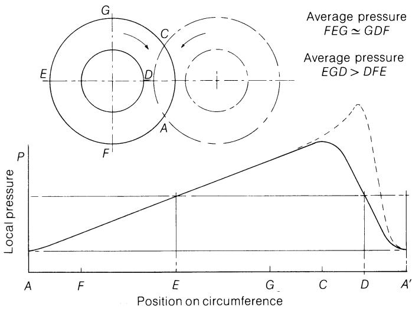
图10.1 逆向旋转螺杆通道周围的局部压力变化。

### 10.2.2 同向旋转

由于相邻叶片的倾角相反，为了避免机械干涉，必须根据倾角以及叶片宽度与对侧通道宽度的相对关系，对可能的啮合程度设定几何限制。 在[第10.4节](#104-full-intermeshing-corotation)中，将针对完全啮合的情况对此进行探讨。 与反向旋转的情况一样，螺杆翅片会在另一个通道中产生限制，这种限制会随着啮合程度的增加而增加，而螺杆翅片尖端与通道根部之间的剪切力(由于运动方向相反，现在更加强烈)也会随之增加。 然而，与叶片尖端类似，叶片侧面似乎也会横向移动至与其啮合的通道中，从而将部分物料从该通道挤出并导入叶片相邻的通道，在两根螺杆之间形成正向流动，但不会将物料分流。

在同向旋转的情况下，两根螺杆通道中的任何压力升高都将呈对角线对称分布，但相反的运动方向会导致通过节流区的流量极小，而这种周向压力升高往往会将物料挤入另一根螺杆的通道中——具体位于该通道的低压点处。 与反向旋转机器一样，在第一近似下，由于通道压力，分离螺杆的力很小，而且在这种情况下，如果没有“挤压点”，间隙处的局部压力升高也很小。 出于同样的原因，通过间隙的流量很小，通道中的流动主要呈“8”字形围绕两根螺杆，压力在局部变化很小；因此，轴平面上的压力力很小，且方向相反。 由于螺杆上不存在较大的侧向力，因此可以使用较小的间隙，并最大限度地减少螺翅尖端的磨损(参见第 344 页)。

根据埃尔德门格(Erdmenger)的分类(Martelli，1983， 第9页)，这意味着两根螺杆之间存在一条连续的通道，可因模具压力而发生回流；因此，尽管输送可能主要依靠机械作用而非单纯的粘性拖曳，但这种输送并非像齿轮泵那样属于正排式输送。 逆向旋转型在横向是封闭的，因为尽管存在空隙，使物料可以从一个螺杆的通道流向另一个螺杆的两个不同通道，但它们会在下一次啮合处重新汇合，从而限制了混合作用；然而，这种流动发生的驱动力微乎其微。 相比之下，具有一定啮合程度的同向旋转机器在螺杆之间具有正向输送作用，但可能将流体分流以实现大规模混合，也可能不进行分流。

由于存在诸多变量(旋转方向、啮合程度、螺纹长度与槽宽之比，以及尺寸、转速、压力、填充度等)，因此很难对部分啮合式设计的性能进行进一步概括。 有人指出，此类设计虽然具有一些优点，但主要还是兼具单螺杆和共轭双螺杆类型的缺点(Martelli，1983，第 12 页)。 从性能角度来看，这些设计以及非啮合型设计，或许最好被视为单螺杆机的变体。

## 10.3 完全啮合：反向旋转

如果将啮合程度增加到每根螺杆的螺翅尖端触及另一根螺杆的沟槽根部(仅保留必要的机械间隙)，则称这两根螺杆为完全啮合。 在这种情况下，上述因另一螺杆螺翅的存在而在一个螺槽中产生的限制，进一步抑制了物料随螺杆旋转的倾向，从而增强了沿轴向向模具推进的作用。

由于两种反向旋转和同向旋转所导致的、前文已提及的差异，在完全啮合的情况下会进一步加剧。因此，下文将分别讨论这两种情况。

### 10.3.1 反向旋转

如果一个螺杆的螺纹在任何位置都无法完全填满另一个螺杆的沟槽(例如，在矩形截面中，螺纹宽度小于沟槽宽度)，则其性能将与部分啮合螺杆相似。 沿同一方向移动的相邻螺杆侧面之间的轴向间隙将取代螺杆尖端与沟槽根部之间的间隙。 这些间隙形成的阻塞将再次导致“进料”侧的压力增加，而“出料”侧的压力相应降低，具体程度取决于阻塞的程度。由于与部分啮合相似，因此不再进一步讨论这种几何形状。

如果在轴平面上，每根螺杆的螺纹与另一根螺杆的螺纹相互匹配并完全填满对方的螺纹槽，即它们是“共轭”的，则物料将完全无法随螺杆旋转，从而在轴向被正向输送，且不受物料粘度、物料对金属表面的附着性以及背压和温度的影响。 此时，在没有泄漏的情况下，螺杆长度将与模具所需的背压无关。 如果螺杆具有方形螺纹，即螺纹侧面垂直于螺杆轴线，那么尽管在轴平面两侧，螺纹仅部分穿入沟槽，但两根螺杆的沟槽之间不会有连接路径，因此它们之间也不会发生混合。 如果螺纹侧面倾斜，例如三角螺纹，那么在轴平面两侧，两个螺杆的通道之间就会存在连通路径([图 10.2](#figure-10-2))。 然而，由于一侧两个槽正在接近，另一侧两个槽正在远离，因此不存在能促使物料在两根螺杆的槽之间转移的正向力。 尽管螺纹开始与另一根螺杆的螺槽啮合时，会将物料推入其相邻的两条螺槽中，但这些物料在下一圈中会重新汇合，因此纵向混合作用微乎其微([图 10.3](#figure-10-3))。

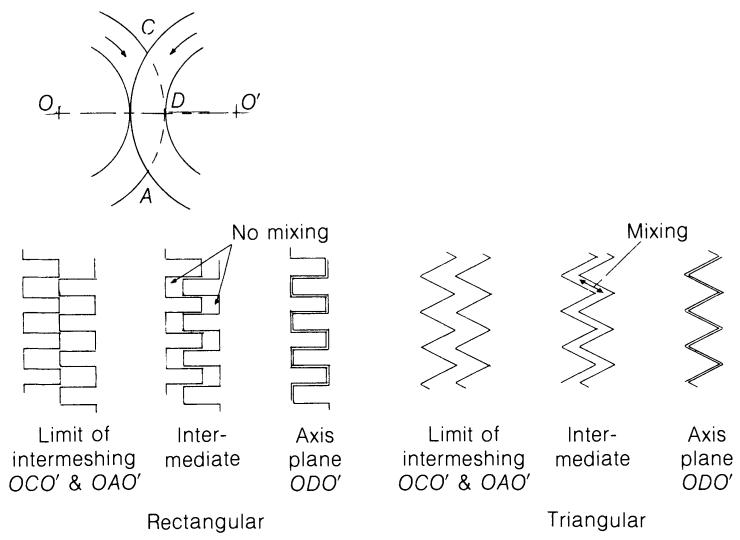  
(figure-10-2)=
图10.2 反向旋转的共轭螺杆：通道轮廓对螺杆间混合的影响。

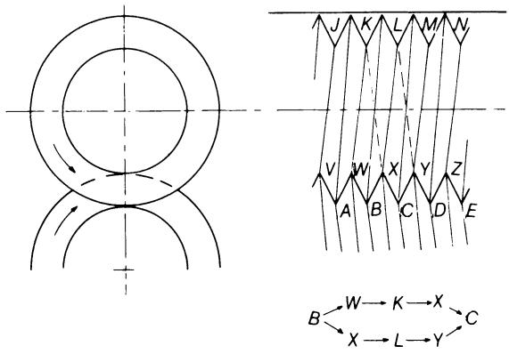  
(figure-10-3)=
图10.3 反向旋转的共轭螺旋桨：流场分离与重组。

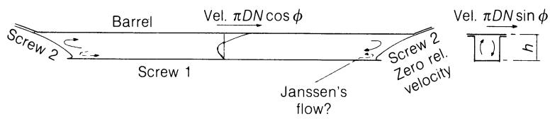  
(figure-10-4)=
图10.4 已成形的螺纹槽，显示了局部纵向和横向速度。

除了通道之间的间隙(见上文)外，每个通道的每圈都将呈封闭的“C”形，其凹陷的两端由相对的螺杆螺纹端部界定。 由于螺杆与筒体的相对运动，通道内的流动将类似于深单螺杆在封闭模具中的流动(图6.6(a)和6.7所示为浅通道)，从而产生一定程度的局部分布混合，并实现每圈的最大压力升高。 [图 10.4](#figure-10-4) 展示了通过将螺旋“展开”成线性形状来近似表示的通道内流场；在双螺杆机中常见的深通道中，与聚合物接触的料筒面积通常会大于螺杆根部的面积。 出于同样的原因，纵向流动将是三维的，横向流动也不能被视为一维的，尽管通常较小的螺距和螺距角会使这一分量很小。 Janssen(1978)报告称，在压延间隙较小的情况下，他在流道底部发现了一种封闭且稳定的流动，这种流动与其余部分的混合非常差。 梯形翅片和流道形状将具有与三角形翅片相似的特征，但在翅片尖端和流道根部还增加了“压延间隙”。

为了使螺杆的性能与下文所述的各种功能相匹配，逆向旋转机器通常设计为两段式或三段式，或者采用连续变化的螺杆轮廓。 这些螺杆可能具有可变的螺条宽度(伴随一定的共轭损失)和/或可变的螺距，此时每转排出的容积会发生变化，在均匀(定量)进料速率下，填充程度也会随之变化。

### 10.3.2 喂养

在某些情况下，此类机器可能采用洪流式喂料，此时喂料段通常为非共轭结构，且间隙较大，以便对固体聚合物进行压缩并释放夹带的空气。随后是第二段，其采用较小且为共轭结构的通道(例如矩形螺片)，以确保压缩后的物料能够良好地向前推进。 然而，此类螺杆更常见的做法是通过独立的计量装置进行限料进料，该装置确定的平均输出量与螺杆转速无关。因此，输出量和螺杆转速成为相互独立的变量，可用于控制混合、剪切加热等过程。 如果计量进料速率需低于该段的自然自由流动进料速率，那么在输送低堆积密度的物料(如再生薄膜或泡沫)时，就需要较大的容积容量。特别是对于此类物料，其倾向于将固相料流中夹带的空气向前输送，因此通常需要进行排气。 为消除计量装置引起的时间波动，通常需要进行一定程度的混合，例如通过减小螺条宽度来实现。螺杆顶部通常向内倾斜，使原料从两侧落入后方的通道中，以确保充分填充。

### 10.3.3 熔化

聚合物的熔融是由料筒传导的热量与聚合物内部剪切作用的综合作用引起的。在定量喂料的情况下，熔融前通道的填充率小于1，因此产生的剪切作用很小，加热主要依靠传导。熔融聚合物所需的最大热量可估算为：

$$
H _ {\text {熔化}} = \rho Q _ {\mathrm{c}} \int_ {T _ {0}} ^ {T _ {\mathrm{m}}} C _ {\mathrm{p}} \mathrm{d} T\tag{10.4}
$$

该式与式(8.4)类似；$Q_{c}$ 为输出容量，$T_{m}$ 为聚合物的结晶熔点。 对于非晶聚合物，可通过将 $T_{m}$ 替换为 $T_{g} + 50^{\circ}C$ 进行近似计算。 如果已知允许的加热器额定功率(W m $^{-2}$)或表面传热系数，则可利用这些参数估算熔化所需的料筒长度。为了使熔体达到在模具处挤出所需的温度，还需要通过传导或剪切进行进一步加热。

### 10.3.4 混合

理想情况下，混合过程中所有聚合物颗粒所经历的剪切和温度变化历程应完全一致。分布式混合主要取决于剪切量，即剪切速率与停留时间的乘积。下文将讨论后者，而前者可通过以下公式近似计算：

$$
\dot {\gamma} = \frac {\pi D N}{h}\tag{10.5}
$$

这与忽略螺距角时单螺杆中的拖曳流剪切速率(方程(6.4)和(6.6))完全一致。通过对方程(6.26)和(6.28)所表示的速度向量和进行求导，可得到更精确的方程。 分散混合是剪应力与时间的函数，其中剪应力是剪切速率和温度的函数。因此，螺杆中的混合效果由剪切速率、温度和停留时间的组合决定。 封闭通道内的运动仅能产生小尺度的混合，因此必须在通道之间进行部分流动才能实现分散混合。这必须在合理短的筒体长度内实现，同时避免过高的剪切速率——过高的剪切速率连同剪切生热，可能会导致聚合物降解。 这些条件还会导致纤维增强聚合物中的纤维缩短，并使产品性能受损。压光辊间隙附近的高剪切应力有助于分散(例如颜料的分散)，但无法保证整个物料都会得到处理。

通过减小螺纹宽度可以增强通道间的物料混合，尽管这会导致非共轭现象并丧失正向自清洁作用。然而，连接螺旋通道的间隙中较高的流速往往能防止物料在这些间隙中滞留。 共轭性可确保附着在螺杆螺纹上的任何物料在啮合区域被挤出，但由于相对速度较小(这是由于旋转中心不同以及半径不同，例如螺纹尖端和相邻通道根部的半径不同)，因此擦拭作用微乎其微。 不过，此类螺杆仍具有较强的自清洁能力。改变螺杆螺距和/或沿螺杆方向的起始螺纹数，可在保持共轭性的同时改变填充程度。 目前尚不清楚这如何能实现充分的分布，因为流体的分流仅发生在螺距发生变化的点上。通过在原本共轭的段落中断螺翅，也可以增强分配混合，从而使压力梯度(例如在封闭的“C”形通道内)促使物料通过切口流入另一个通道。

混合效果在很大程度上取决于螺杆的几何形状，但据说与运行条件基本无关。由于无法准确掌握各种流体的流动情况，因此难以估算混合程度。

### 10.3.5 通风

共轭反向旋转型几乎封闭的“C”形腔室，几乎不允许随进料被困住的空气或加热时产生的挥发物逸出。如果情况确实如此，则可在抽气段之后设置一个带有排气口且通道容积较大的段，以实现较低的填充率和较低的压力。 该段需要进行混合，以使最大表面积暴露于真空环境中，这可通过非共轭结构和/或间歇式桨叶来实现；然而，由于通道未完全填满，因此不会产生显著的流动。

此类排气段之后必须设置第二个泵送段，以确保物料向前流动，并在进入模头前提高压力。

### 10.3.6 泵送

共轭螺杆的封闭腔室使得由模具压力引起的总体回流可以忽略不计，因此产量与压力无关。 然而，轴平面(压光辊间隙)处的泄漏流量 $Q_{L}$ 会降低设备的泵送能力，因为该流量流入的是螺杆的另一个通道(腔室)。

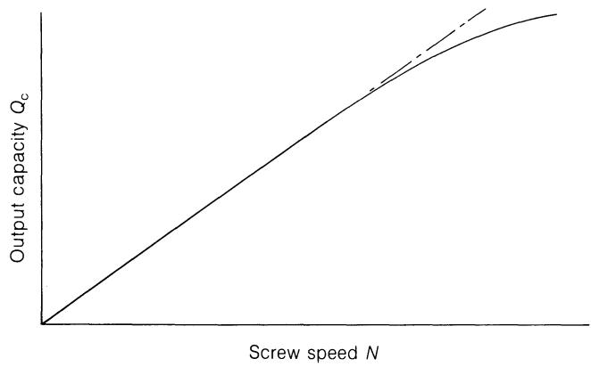  
(figure-10-5)=
图10.5 泄漏对反向旋转螺杆输出容量的影响。

该流场的阻力 $R$ 可以比作狭缝的阻力(方程 (3.34))：

$$
R = \frac {1}{K} = \frac {1 2 L}{T H ^ {3}}\tag{10.6}
$$

(参见式(6.55))，其中

$$
Q _ {\mathrm{L}} = \frac {P K}{\eta}\tag{6.53}
$$

在此处，由于局部剪切率较高，粘度将较低。 提高螺杆转速 N 将增加产量 $Q_{c}$，但剪切率的增加也会降低粘度。此外，通道内阻力流的增加将导致通道周围的压升增大，即压延间隙两端的压差； 这一因素与粘度的降低将共同导致泄漏流量 $Q_{L}$ 增加，在极端情况下可能会影响产量的提升，从而使实际产量与转速的关系曲线与[图10.5](#figure-10-5)相似。 压延辊间附近剪切率的增加会加剧局部温度升高，并可能导致聚合物降解。

通常只需让共轭螺杆旋转两三圈即可达到所需的模具压力，而一旦失去共轭状态，其泵送能力就会急剧下降。 由于两根反向旋转的螺杆汇合处会产生较高的局部压力，这类机器的运行速度通常仅为同向旋转型机器速度的三分之一左右，因此对于相同规格的机器而言，其产量相应较低；这使得对这两种类型进行有意义的比较变得困难。

### 10.3.7 停留时间

如果螺杆是共轭的，则封闭腔室中的物料每转一圈，就会向前推进一个螺距。此时，如果 $V_{e}$ 是相应的轴向速度，

此外，还有停留时间(Martelli，1983)：

$$
t _ {\mathrm{r}} = \frac {N _ {\mathrm{f}} p}{V _ {\mathrm{e}}} = \frac{N_f \pi D \tan \phi}{N \pi D \tan \phi} = \frac{N_f}{N}\tag{10.7}
$$

然而，如果整个螺杆都是为输送而设计的，则停留时间 $t_{r}$ 将过于短暂，无法实现充分的加热、熔化和混合。 因此，螺杆的一部分将设计为非共轭结构或开槽结构([第10.3.4节](#1034-mixing))，以便物料在通道之间流动，从而增强该段的混合效果并延长停留时间。 虽然据称通道仍会完全填满，但泵送作用将会减弱。式(10.7)表明，在较高的螺杆转速 N 下，停留时间会缩短，从料筒传导的热量也会减少，但剪切速率的增加会提高剪切加热的贡献。 较低的螺杆转速N会延长停留时间，从而增加来自筒体的传热比例，而剪切加热则会减少。如上所述，后者是反向旋转螺杆的常见情况。

### 10.3.8 电源

体积为 V 的充满通道中的功耗约为：

$$
E = \eta \dot {\gamma} ^ {2} V\tag{10.8}
$$

(参见式(3.57))。在无法可靠测定渠道内流场的情况下，剪切速率取自式(10.5)中的近似值； 然而，第8.4节表明，对于净流量为零的情况 $Q/Wbh = 0$，总剪切加热量大于拖曳流动 $Q/Wbh = 0.5$ 时的值，后者由方程(10.5)表示。 每根螺杆的一个通道的体积等于横截面积乘以总周长，再减去啮合区域。 可定义一个等效螺杆(Martelli，1983，第56页)，使得 $C_{e} = \pi D_{e}/\cos \phi$ 等于该合并通道长度。则：

$$
\begin{array}{r l} V & = A C _ {\mathrm{e}} = \frac {1}{2} \pi D h \sin \phi \cdot \frac {\pi D _ {\mathrm{e}}}{\cos \phi} \\ & = \frac{\pi^2 D D_e h \tan \phi}{2} \end{array}\tag{10.9}
$$

那么，$N_{f}$次满载飞行所吸收的功率为：

$$
\begin{array}{r l} E & = \bar {\eta} \left(\frac {\pi D N}{h}\right) ^ {2} \cdot \frac {\pi^ {2} D D _ {\mathrm{e}} h \tan \phi}{2} \cdot N _ {\mathrm{f}} \\ & = \frac {\bar {\eta} \pi^ {4} D ^ {3} D _ {\mathrm{e}} \tan \phi}{2 h} N ^ {2} N _ {\mathrm{f}} \end{array}\tag{10.10}
$$

其中 $\bar{\eta}$ 是平均粘度。在反向旋转的螺旋中，$N_{f}$ 通常计算为总匝数减去中断匝数或位于排气段的匝数。

关于各种间隙及通过模具时的功率计算详情，请参阅 Martelli(1983，第 57–59 页)。如第 227 页所述，如果将聚合物的最终能量含量取自模具出口处，则可忽略模具项。 值得注意的是，所有其余项与式(10.10)的区别仅在于几何量——它们均与有效粘度、填充螺纹数(有效长度)以及螺杆转速的平方成正比，这与单螺杆机的情况相同(式(8.11)和 (8.12)式所示)。每个项均与局部间隙成反比，并近似与$D^{3}$或$D^{4}$成正比。然而，这些方程并未考虑因转速增加或间隙减小而导致的非牛顿行为(剪切变稀)； 但据称，剪切速率增加与剪切加热的综合作用在很大程度上抵消了螺杆转速增加的影响(参见方程(8.16)和(8.19))。

### 10.3.9 能量平衡

其能量平衡在定性上将与同向旋转螺杆的情况相似([第10.4节](#104-full-intermeshing-corotation))，只是在此处的泵送段中，填满的螺翅数 $N_{f}$ 随背压和粘度的变化幅度可能要小得多。 此外，机械功率可能主要由啮合区域的功率主导。

## 10.4 完全交错：同向旋转

与反向旋转类似，非共轭设计会导致其性能与部分啮合螺杆相似。 与共轭螺杆相比，泄漏流量和通道间的流量将增加，从而降低泵送能力——例如，在给定模腔压力下，填充圈数 $N_{f}$ 的增加可能会导致功耗上升(因泵送效率降低)、加剧大尺度混合以及延长停留时间分布范围。 如果非共轭是由于螺杆尖端间隙增大所致，则轴平面附近的最大剪切应力和局部剪切加热可能会降低，从而使材料得到更均匀的处理。 由于螺翅宽度减小([图 10.6](#figure-10-6))导致的非共轭现象，会增加轴向间隙，从而降低啮合侧面区域的剪切应力和能耗，但也会对通道间流体流动和混合产生深远影响。 由于两根螺杆螺翅的相邻部分与轴平面成相反角度，且沿圆周方向运动方向相反，因此完全啮合的矩形螺翅无法共轭，即螺翅宽度必须小于通道宽度([图 10.7](#figure-10-7)(#图-10-7))，以避免机械干涉。显然，最大螺翅宽度 $e_{m}$ 与两螺杆啮合过程中的轴向位移之间存在关联，这些位移与螺距以及啮合角 $AOC = AO'C = 2\beta$ 成正比。

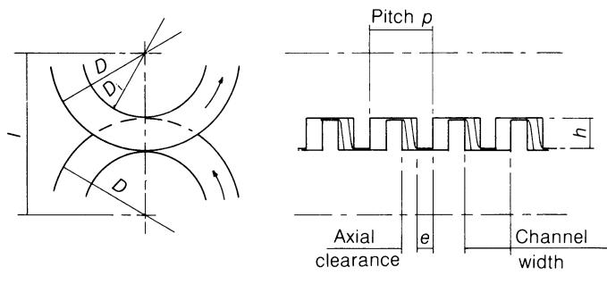  
轴平面
(figure-10-6)=
图10.6 通过减小螺距实现的非共轭：同向旋转螺杆。

现在考虑一个三角形飞行，其外径为：

$$
D ^ {\prime} = 2 I
$$

([图 10.8](#figure-10-8)) 那么

$$
h ^ {\prime} = I, \quad D _ {i} ^ {\prime} = 0
$$

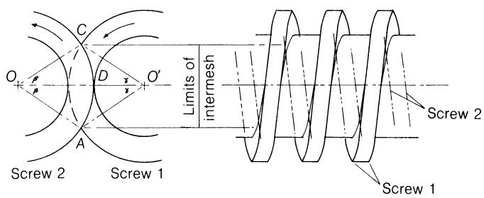

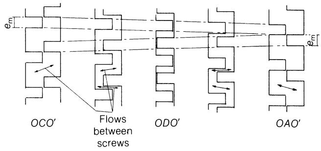  
(figure-10-7)=
图10.7 限制螺旋叶片宽度以避免干涉：矩形螺旋叶片，显示了螺旋叶片之间的气流。

侧面角由以下公式给出：

$$
\theta = \tan^{-1} \left(\frac{p}{D'}\right)\tag{10.11}
$$

此时，各螺纹尖端在点 A 和点 C 处相互交错，此时角 $AOO' = COO' = \beta = 60^{\circ}$，且角 $AO'O = CO'O = \gamma = 60^{\circ}$。 根据螺旋线的定义，在啮合点 A 和 C 的极限位置，每个螺旋线端点相对于轴平面 $OBO'$ 的轴向位移为 $p \times 60/360 = p/6$， 即两螺杆之间的相对位移为 $p/3$([图 10.9](#figure-10-9))。因此，A 与 C 之间的总相对位移为 $2p/3$，这显然是任何三角螺纹所能达到的最大值。 (有些作者认为，在啮合过程中，相对位移为 p，即一个螺杆的一条螺纹从位于另一螺杆上一条螺纹对侧的位置，移动到位于另一螺杆下一条螺纹对侧的位置。这意味着啮合角 $2\beta$ 为 $180^{\circ}$。) 这种配置显然可以实现无机械干涉的共轭。然而，根据制造方法的不同——若是用固定刀具车削，则沿其长度方向所有点处的螺纹轮廓在轴向截面上相同；若是用螺纹铣削，则在垂直于螺旋角的截面上相同。 因此，当实心螺杆的旋转角度相等时，螺纹轮廓上所有点的轴向位移必须相同。 螺旋角随半径变化，例如，直径为 100 mm、沟槽深度为 10 mm、螺距为 50 mm 的螺钉，其尖端螺旋角为 $\phi = \tan^{-1}(50/100\pi) = 9.04^{\circ}$，根角为 $11.25^{\circ}$。 当 $D_{\mathrm{i}}^{\prime} = 0$ 时，$\phi_{\mathrm{root}} = 90^{\circ}$。 因此，在轴平面 $OBO^{\prime}$ 附近，其中一颗螺钉的根部将沿轴向移动，而另一颗螺钉的啮合尖端则会以较小的角度朝相反的轴向方向移动，两者均几乎没有或完全没有径向位移。因此，除了因缺乏抗扭强度而不切实际外，这种配置还会不可避免地导致机械干涉。

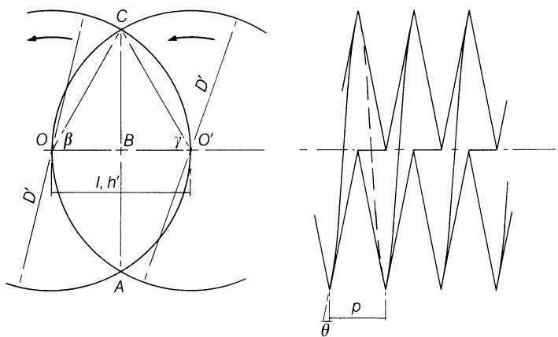  
(figure-10-8)=
图10.8 当 $D' = 2I$ 且根直径为零时的理论三角形飞行。

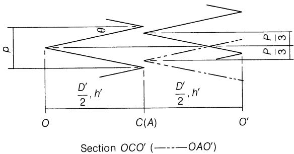  
(figure-10-9)=
图10.9 啮合过程中的相对轴向叶片位移：如图10.8所示的三角形叶片。

请注意，一般而言，虽然相对于轴平面的等间距增量会产生相等的轴向位移，但螺杆1上某一点(例如螺旋叶尖)在螺杆2上的径向位移，在靠近轴平面处较小，而在较大角度处则增加得更快。 (请注意，当与轴平面夹角较大(即 $\beta > 45^{\circ}$)时，随着螺旋1的角 $\beta$ 向点 $A$ 或 $C$ 方向增大， 螺杆2螺旋线上的相对点所对应的角$\gamma$和轴向位移可能会略有减小，尽管总相对位移呈单调递增。)因此，该点在连续角度增量下的轨迹不可能是直线。(对于给定几何形状而言，固定“滑动角”的概念似乎具有误导性。) 本文作者认为，与某些权威观点相反，在同向旋转、完全啮合的机械中，三角形螺纹必然会导致机械干涉，特别是在靠近轴平面处(参见[图10.2](#figure-10-2)中的反向旋转情况)。 为避免干涉，相同的完全啮合螺杆其轮廓必须至少近似于相应的“干涉曲线”([图 10.11](#figure-10-11))，且由于这些曲线是凹形的，笔者认为共轭关系同样无法实现。

### 10.4.1 梯形螺旋段

已有学者指出，三角形螺纹可作为实用设计的基准，在此设计中，通过在螺纹尖端和根部设置圆柱形“平段”或“台阶”，将其截断为梯形截面([图 10.10](#figure-10-10))。 这将流道深度从 $h'$ 减小到 $h$，并将外径从“原始”直径 $D'$ 减小到实际直径 $D$，同时将根部直径 $D_i'$ 增大到有限值 $D_i$。 这种设计具有实际优势：具备真正的抗扭强度，增加了螺杆与筒体壁之间的磨损接触面积，并在给定的机械间隙下，增强了螺杆翅片尖端处各圈之间防泄漏的能力。 请注意，[图 10.10](#figure-10-10) 左上角的横截面几何形状仅取决于比率 $D / 2I$ 或 $h / D$，与螺距 $p$ 无关。

避免机械干涉仍是决定螺旋桨前缘形状的关键因素。已针对两种螺旋桨通道深度 h(分别为 25 mm 和 16.7 mm)以及基本直径 $D'$ 为

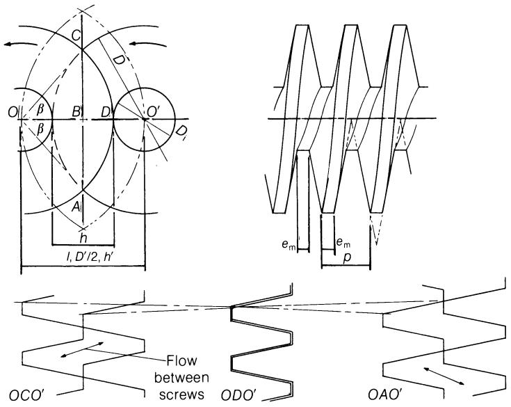  
(figure-10-10)=
图10.10 基于图10.8中所示三角形螺旋结构的梯形螺旋结构，展示了螺旋叶片之间的流场。

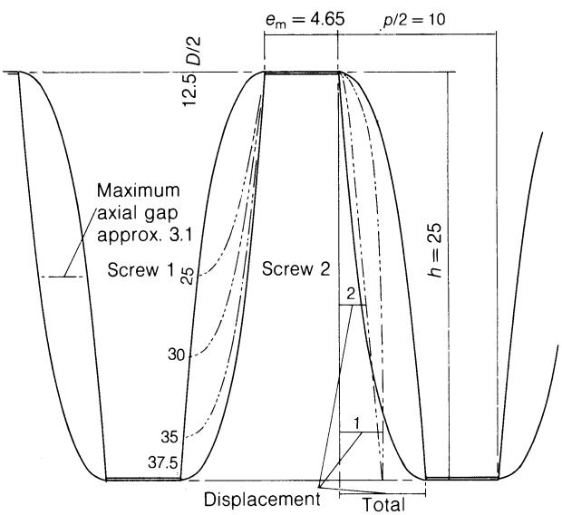  
(figure-10-11)=
图10.11 啮合过程中的相对轴向位移(“干涉曲线”)，这要求螺旋叶片侧面呈凹形，且最大踏面宽度为 $e_m$($h = 25 \, \text{mm}$)。

100 毫米，螺距为 20 毫米。螺杆 2 上相对两点的轴向位移已分别计算。 将这些数值相加即可得到两根螺杆螺纹的总相对轴向位移，对于两种沟槽深度，其最大值分别为5.35 mm和4.60 mm，每根螺杆的轮廓必须能够适应这一总位移(图10.11和10.12)。 由于齿根宽度等于节距的一半减去螺纹侧面的“锥度”，因此在第一种情况下，最大齿根宽度 $e_{m}$ 为 20/2 - 5.35 = 4.65 mm。 这仅比相应梯形螺纹截面的 5 mm 尺寸略小。然而，对于 16.7 mm 的较浅螺纹槽， 最大槽宽 $e_{m} = 20/2 - 4.60 = 5.40$ mm，而对应的梯形轮廓槽宽为 6.67 mm，这表明随着槽深减小，槽宽无法按比例增加。 这些比例对应于梯形轮廓的 $p/4 < e_{m} < p/3$，据称这是通常的范围。 在确定了可避免螺旋桨叶尖干涉的初步侧面轮廓后，计算了螺旋桨1侧面上中间点的相对位移，并将其叠加到[图10.11](#figure-10-11)中的侧面轮廓上。 这表明这些点也不会与螺杆2的相同轮廓发生干涉，这支持了Janssen(1978，第28页)的论断：如果避免了尖端干涉，那么在任何中间位置也不会发生干涉。 需要注意的是，即使在半深度处，靠近轴平面([图 10.10](#figure-10-10) 中的点 B)处的相对轴向位移也较大，因此无法通过修改轮廓来显著减小轴向间隙。 叶片两侧间隙的面积分别约为 62.6 和 32.9 毫米 $^{2}$，分别占通道横截面积的 20% 和 16.5%。这表明共轭性显著降低，并导致正泵送效率的损失。 减小通道深度(同时增加凸缘宽度)似乎能略微减小间隙面积占通道面积的比例，从而带来稍强的正泵送效果，但会降低输出容量。 对于相应的深度为25毫米、且能避免干涉的矩形和梯形叶片，其间隙面积分别约占通道面积的35%和24%。

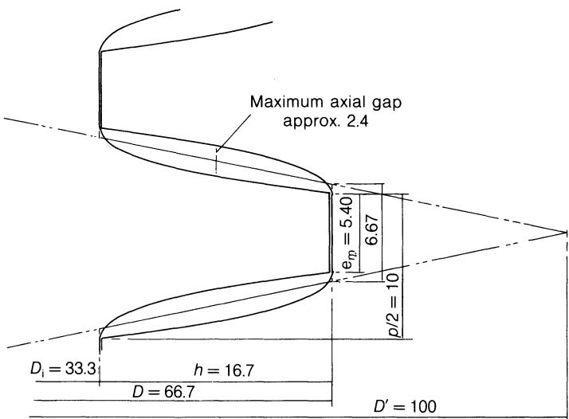  
(figure-10-12)=
图10.12 与图10.11相同的“干涉曲线”，但 $h = 16.7 \, \text{mm}$。

如第333页所述，横向几何形状(包括啮合角$2\beta$)与节距无关，而对于给定的旋转角，轴向位移与节距成正比。 因此，干涉曲线(图10.11和10.12)的轴向尺度也与节距成正比。 然而，通道横截面积近似等于间隙面积加上 $ph/2$，因此间隙将占通道横截面积的近似恒定比例，且与节距无关；图 10.11 和 10.12 中的示例在所有节距值下，对于 $D' = 2I$ 均具有代表性。

如果原始直径 $D'$ 被缩小，使得 $D' < 2I$，那么原始根直径 $D_{i}'$ 将变为正值，$h'$ 随之减小，且三角螺旋线的侧面角增大([图 10.13](#figure-10-13))。 这也可以像前一个例子那样，截短为相同的直径 $D$、$D_{i}$ 和深度 $h$([图 10.10](#figure-10-10)——为清晰起见，侧面画成直线)，但啮合宽 $e$ 较小。 显然，啮合角等参数并不取决于原始尺寸 $D', D_{i}'$ 和 $h'$，而仅取决于实际尺寸 D、 $D_{i}$ 和 h，因此轴向位移将与之前相同，但叠加在与螺杆轴线成较小角度倾斜的理论轮廓上。 间隙面积等于平均轴向位移乘以(相同的)沟槽深度，而沟槽横截面积大致等于间隙面积加上 $ph/2$，因此螺旋叶片侧面的倾斜度变化本身并不会改变间隙面积与沟槽面积的比例，也不会导致共轭关系的丧失。 [图 10.14](#figure-10-14) 展示了修改后螺纹侧面轮廓上的干涉曲线，从中可以看出，除螺纹尖端和根部外，其他位置均存在显著间隙。 随后可将中间的轮廓(通过调整约等于干涉曲线包络线与对向叶片之间差异的一半)修改为凸形曲线。据估算，对于这些尺寸，间隙面积与通道横截面积之比可从20%降低至约14%，从而产生更强的正向泵送效应。

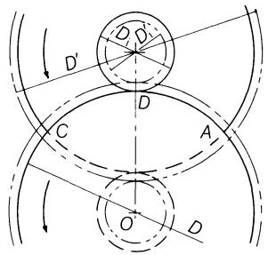

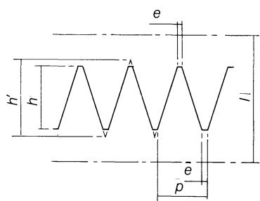  
(figure-10-13)=
图10.13 基于三角形排列且$D' < 2I$的梯形排列。实际直径D和$D_{i}$以及深度h如图10.10所示。

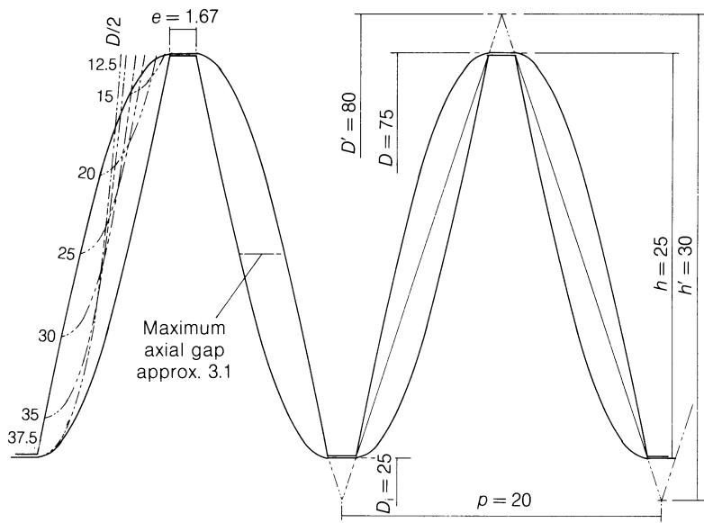  
(figure-10-14)=
图10.14 基于图10.13且减小了台面宽度的倾斜轮廓的相对轴向位移(“干涉曲线”)。

另一种可行的切削路径变体是将切削宽度 e 减小至已确定的最大值 $e_{m}$ 以下。 这将增大间隙区域，导致共轭性和正向泵送进一步减弱，但可能有助于增强混合效果。此外，只要在任何情况下都不越过干涉曲线，这还将一定程度上放宽对侧面轮廓以及两个螺杆相对轴向位置的限制。 如果保持[图 10.11](#figure-10-11)中的齿侧轮廓，但将齿脊宽度 e 减小至[图 10.14](#figure-10-14)中的宽度，即1.67 mm，则间隙面积与通道横截面积之比将增至约38%，这会降低泵送效果，但能改善混合效果。 [图 10.15](#figure-10-15) 在轴平面上示意性地展示了三种避免干涉的轮廓，以及啮合极限处的轴向间隙。 当最大凸缘宽度为 $e_{m}$ 时，混合主要发生在轴平面一侧的另一根螺杆的一个通道与轴平面另一侧的下一个通道之间。 [图10.15](#figure-10-15) 还表明，无论采用哪种方法减小螺纹宽$e$，混合都是在另一根螺杆的一个螺槽与该螺杆的两个相邻螺槽之间同时进行的，尽管比例各异，从而实现了有效的逐匝混合。

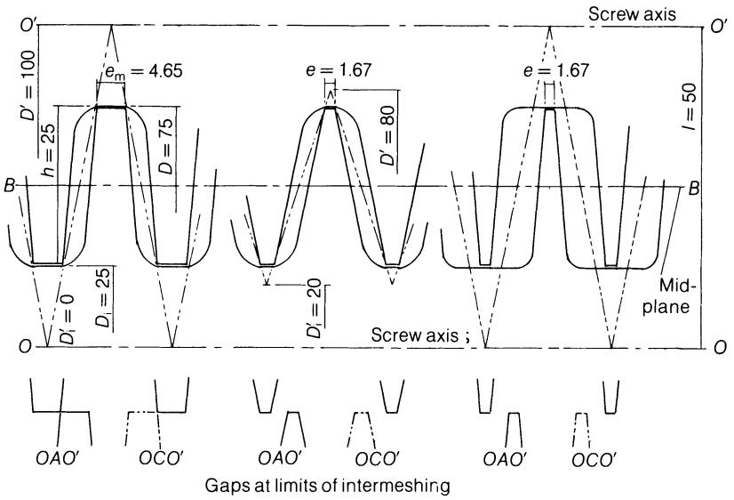  
(figure-10-15)=
图 10.15 避免干扰的实际飞行轨迹，各通道深度相等，但着陆宽度各不相同。

到目前为止，仅考虑了轴平面上两条螺杆翅片之间的间隙——作为偏离共轭的一种情况，这种间隙会影响正向输送。 如果通道完全封闭，通道内的流动将类似于封闭式反向旋转螺杆通道中的流动，只不过啮合螺翅的相反运动会在靠近轴平面的间隙中，在螺翅与通道根部表面之间形成循环，而不是对称的压延“压区” ([图10.4](#figure-10-4))。 然而，由于机械干涉导致同向旋转时无法采用矩形螺翅，因此通道并非完全封闭，在啮合区域的中平面ABC上存在连接两根螺杆通道的间隙，允许流体从一根螺杆的通道流向另一根螺杆的通道(或多个通道)。 由于为避免干涉而必须留出的间隙，这些间隙的面积难以通过解析方法直接求得。尽管流体在从一个螺杆流向另一个螺杆时流向会发生变化，但该间隙面积与通道面积之比可反映出该位置对流体的限制程度。 因此，当涡道宽度较小且涡道深度较大时，两根螺杆涡道之间的流动受限较少；随着深度的减小，最大涡道宽度 $e_{m}$ 增大，流动受限程度随之增加。 [图 10.16](#figure-10-16) 绘制了[图 10.11](#figure-10-11) 示例中这些间隙的计算尺寸，其中螺纹宽为 $e_{m} = 4.65 \, mm$ 和 $e = 1.67 \, mm$(对称)这两种情况，绘制了这些间隙的计算尺寸。[图10.11](#figure-10-11) 中的示例。间隙占通道横截面积的近似百分比见[表10.1](#table-10-1)。

尽管为了避免干涉，轴面上需要留出相当大的间隙([图 10.15](#figure-10-15) 以及 [图 10.16](#figure-10-16) 中的 BB)， [图 10.16](#figure-10-16) 显示，当齿间宽度达到最大值时，在中平面处，该间隙会向啮合极限 $AA$ 和 $CC$ 方向迅速减小，此时相对的螺旋齿向彼此靠近。 这导致螺杆之间的流通面积较小(例如 7.9%)，且流动受到显著限制。 因此，流体主要将通过另一间隙区域(例如 62.7%)流入另一根螺杆的单个通道中。如果缩小螺纹根部宽度，这两个区域都会显著增大，但它们变得更加接近，从而使流体更均衡地分配到另一根螺杆的两个相邻通道中。 两根螺杆的运动将促使：在轴平面的一侧，物料从一根螺杆的通道转移到另一根螺杆的通道；而在平面的另一侧，物料将回流到第一根螺杆的下一个通道，Martelli (1983，第29页)所描述的“扭曲的8字形”。 垂直于螺杆轴线的“8”字形长度为 $2(\pi D - \sqrt{2Dh})$ ([图 10.8](#figure-10-8))，这是直径为：

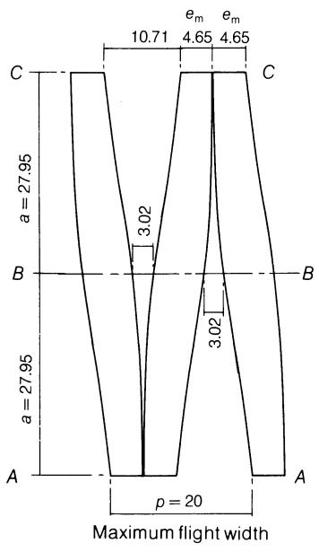

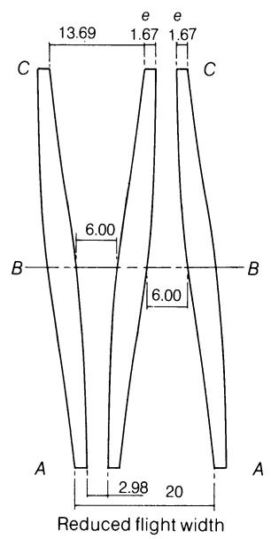  
中平面剖面图
(figure-10-16)=
图10.16 中间平面间隙区域，这些区域限制了螺钉之间的流动。

$$
\begin{array}{r l} D _ {\mathrm{e}} & = \frac {2}{\pi} (\pi D - \sqrt {2 D h}) \\ & = 2 D - 0. 9 0 0 3 \sqrt {D h} \end{array}\tag{10.12}
$$

因此，尽管本文的目的并非探讨尺寸设计，但笔者认为，就运行效果而言，流体将主要呈螺旋状“8”字形绕过两根螺杆的组合通道流动，两者之间混合良好，且从入口到出口的通道畅通无阻，在这方面与单根螺杆相似。 流体被分流到另一根螺杆的两个相邻通道中，将有助于端到端的混合，特别是在螺纹宽减小的情况下，同时还有沿合并通道的压力(回流)所产生的混合作用。 此外，同向旋转的螺杆似乎无法实现耦合，从而无法进行正向泵送；基于这两个原因，来自模具的背压将导致沿合并通道以及通过轴面间隙产生明显的回流。因此，产量将在一定程度上取决于背压。

### 10.4.2 输出

由式(10.12)可得，等效螺杆通道长度 $C_{\mathrm{e}}$ 由下式给出：

$$
C _ {\mathrm{e}} = \pi (2 D - 0. 9 \sqrt {D h}) / \cos \phi
$$

具有相同周向速度 $\pi DN = \pi D_{e} N_{e}$ 的等效螺杆：

$$
N _ {\mathrm{e}} = N \frac {D}{2 D - 0 . 9 \sqrt {D h}}\tag{10.13}
$$

其中，当 0 < h < D/2 时，0.5N < $N_{e}$ < 0.733N。此时输出容量为：

$$
\begin{array}{r l} Q _ {\mathrm{c}} & = A C _ {\mathrm{e}} N _ {\mathrm{e}} \\ & = \frac {1}{2} \pi D h \sin \phi \cdot \frac {\pi}{\cos \phi} (2 D - 0.9 \sqrt{D h}) \cdot N \frac{D}{2 D - 0. 9 \sqrt{D h}} \\ & = \frac{\pi^2 D^2 N h}{2} \tan \phi \end{array}\tag{10.14}
$$

设 $p = \pi D\tan \phi$

$$
Q _ {\mathrm{c}} = \frac {\pi D p N h}{2}\tag{10.15}
$$

如果实际最大输出量 $Q_{max} = KQ_{c}$，那么根据马泰利(1983)的研究，K 的平均值在 0.85–0.90 之间。虽然随着螺杆转速 N 的增加，$Q_{c}$ 会增大，但 K 却趋于减小，因此两者的增大并不成正比。

为了满足螺杆的不同功能需求，I 和 D 的数值通常保持恒定，从而确保螺纹深度恒定，而螺距 p 和/或螺纹前端宽度 e 则会发生变化；前者导致填充比发生变化，而后者则改变螺杆之间的流动，从而影响混合程度，尽管所有截面都具有一定的输送作用。 如果需要延长某一段的停留时间，该段将几乎或完全不具有输送作用，其形式为间断螺杆、无螺杆段、捏合盘或反向螺杆段。 各段的长度通常为3–4个直径，但有时可达6–7个直径——总长度与直径之比并不重要，仅为实现各种功能所需各部分长度的总和。 实际上，长度通常为8–15个直径，现代趋势倾向于20–25个直径，相当于30–50个螺旋翅片。或者，直径可从进料端到出料端呈阶梯式减小，以便在靠近出料端的位置将筒体从螺杆上拆下。 在轴间距恒定的情况下，这意味着通道深度也会沿长度方向呈阶梯状减小；螺距 p 和螺纹尖端宽度 e 则作为各段需选定的变量，通常会逐渐减小以适应材料体积的减少并增强泵送作用。

(table-10-1)=
表 10.1 轴平面和中间平面处螺钉之间的间隙面积

| 成型段宽度 | mm | 4.65 | 1.67 |
| --- | --- | --- | --- |
| 轴向间隙面积（每螺距两个） | $mm^2$ | 62.6 | 137.1 |
| 螺槽截面积  $ph/2+gap area$ | $mm^2$ | 312.6 | 387.1 |
| 轴向间隙面积/通道面积 | % | 20.0 | 35.4 |
| 较小的中平面间隙 | $mm^2$ % | 24.67.9 | 107.827.9 |
| 较大的中平面间隙 | $mm^2$ % | 19662.7 | 27972.2 |
| 较小间隙面积/较大间隙面积 | % | 12.5 | 38.6 |

### 10.4.3 喂养

通常采用的近共轭进料段能够有效输送固体物料，并对低密度进料进行良好的压实。 较大的螺距和螺深配合较小的螺尖宽度，形成了大容积的输送通道；而螺杆之间的间隙则确保了良好的混合效果和彻底的排气。进料口通常位于向下侧的切线位置，以便将固体物料拖入围绕螺杆的循环流中。 由于通常采用欠量进料，因此输出量与螺杆转速无关，且进料段的填充率 $Q/Q_{c}$ 明显小于 1；这可能也有助于平衡进料速率的波动，例如由批量给料机引起的波动。 与共轭运动相关的正向泵送作用，使得该设备能够输送润滑剂和流动性极佳的颗粒物料。

### 10.4.4 熔化

熔融段所需的容积比进料段小，以确保固体物料得到压实，并在聚合物熔融时保持正向输送；这通常通过采用稍小的直径和/或较小的螺距来实现，从而提高填充率并提供更强的正向推进力。 然而，填充率很可能仍小于1，因此产生的剪切热量较少；且由于与料筒接触不完全，来自料筒的热传导也将受到限制。只有当螺杆叶片被填满且能够建立压力时，才会发生熔融。 为了促进早期熔融，通过采用径向间隙较小的无螺片段来提高该段内的压力，从而产生较高的背压和剪切力。如果对于易熔聚合物(如LDPE和增塑PVC)仅需较小的压力，则可用开槽螺片代替无螺片段。 另一种方法是使用带有径向槽的反向螺旋桨叶段。 熔融段中带叶片部分的数量与产生的背压成正比，由公式 $P \propto \eta Q_{slot}/TH^{3}$ 给出，其中 T 为径向长度，H 为槽宽。然后，将下游方向的流向定义为正向，在第一个带叶片部分中：

$$
Q = Q _ {\max} - Q _ {p}\tag{10.16}
$$

关于反向航班：

$$
Q _ {\mathrm{cf}} = Q _ {\mathrm{Pcf}} - Q _ {\mathrm{Dcf}}\tag{10.17}
$$

关于反向航班与时段的组合：

$$
Q = Q _ {\text { slot }} + Q _ {\text { cf }}\tag{10.18}
$$

给予：

$$
Q + Q _ {\mathrm{Dcf}} = Q _ {\mathrm{slot}} + Q _ {\mathrm{Pcf}}\tag{10.19}
$$

因此，由逆向流$Q_{Dcf}$引起的后向阻力流增加，将导致其前方的压力升高，而压力流$Q_{slot}$和$Q_{Pcf}$则分别通过狭缝和逆向流。 槽宽的增加会增大通过槽口的流量 $Q_{slot}$(与槽宽的立方成正比)，或降低上游压力，从而减少填满的叶片数量。 因此，为了实现有效的传热，需要更窄的槽口以获得更多填充的螺杆flight，而槽口宽度可以预先确定。为了使新熔融的聚合物均匀，槽口和逆向螺纹部分应具有较高的混合程度。

### 10.4.5 混合

由于在轴平面上两组螺旋桨叶片沿相反方向旋转，因此流体通过这些间隙时的驱动力很小，这与反向旋转型不同。 由于在最大翅宽 $e_{m}$ 处，从一个螺杆的流道到另一个螺杆的流道之间仅存在一个主要间隙，因此流体分流现象微弱，从而导致大尺度混合程度较低。 如果使用较小的叶片尖端宽度 e 且通道深度 h 保持不变，则两个螺杆之间会形成两个间隙，一个螺杆中的物料将被分流到另一个螺杆的两个不同通道中，并在那里与来自第一个螺杆相邻通道的物料混合。 因此，采用近似三角形的螺杆叶片(小e值)可实现最大的混合效果；通过选择螺杆叶片尖端宽度的数值，可以设计出主要用于输送或混合的螺杆段。 Martelli(1983)指出，总间隙面积通常占进料区和混合区通道横截面积的55–70%，在输送段则占25–45%——[表10.1](#table-10-1)中的数值约为上述数值的一半，因为每个螺杆仅被分配了一个间隙。 除了第338页提到的通道根部和螺翅尖端的循环外，在啮合区域，两根螺杆螺翅侧面的相邻部分之间将产生相当大的剪切和混合，其剪切速率是两速度之和的函数，而不是像反向旋转那样是两速度之差。 除了由于旋转中心分离而产生的夹角外，该速度和在通道深度方向上将保持恒定，并作用于整个啮合区域，从而在上述大尺度混合之外，还产生了小尺度混合。 当加入新材料(例如不同颜色的材料)时，这些混合作用将导致螺杆中残留的旧材料迅速减少，而近共轭螺杆的自清洁作用可防止材料粘附在通道中并被后续材料覆盖，从而实现快速、彻底的清洁和换色。 如果使用捏合盘来增强混合效果，这些捏合盘并不一定具有自清洁功能；它们会对前面的螺杆段产生一定的背压，但其功耗难以计算，因为这很大程度上取决于填充程度。

### 10.4.6 通风

如果压力升高的段之后紧接着一个容积容量大得多的段，后者通道将不会被填满，压力会降至零，从而实现排气。 由于直径 D 和通道深度 h 是固定的，因此在保持近共轭状态的同时，只能通过增加螺距 p 来增加容积。为了促进混合并使物料的各个部分释放蒸汽，与其他混合段一样，螺旋叶尖宽度 e 较小。 尽管通道未被填满，但近共轭性确保了不会发生物料滞留。

### 10.4.7 泵送

使流体通过模具时的所需压头Q由下式给出：

$$
P = \frac {\eta Q}{K _ {\mathrm{Die}}}\tag{6.57}
$$

在许多满料螺杆中，这种压力会因沿通道的回流以及螺杆叶尖与筒体之间的泄漏而导致螺杆的正排量减小。 侧面间隙和尖端-根部间隙对流动影响甚微，因为它们仅在单个螺纹匝内形成短路，且由于螺杆速度方向相反，这些间隙应非常小。对于组合螺杆的一个等效螺纹匝，筒体与螺翅尖端之间的泄漏量可按以下公式表示(Martelli，1983)：

$$
K _ {\mathrm{L}} = \frac {2 (\pi D - \sqrt {2 D h}) \delta^ {3}}{1 2 e _ {\mathrm{m}}}\tag{10.20}
$$

沿“8”字形通道的压力流主要由通道之间的间隙限制决定，而非通道本身。对于理想的梯形螺旋桨，该间隙可近似表示为：

$$
\begin{array}{l} \text{宽度 } AB = \frac{1}{2} \sqrt{D ^ {2} - I ^ {2}} \quad (\text { 图10.8 }) \\ \text { 宽度 } = 0 \text { 至 } (p - 2 e _ {\mathrm{m}}); \text{平均值} \frac{1}{2} (p - 2 e_{\mathrm{m}}) \\ \text{平均长度} = h / 2 \end{array}
$$

代表：

$$
K _ {\mathrm{G}} \simeq \frac {\frac {1}{2} \sqrt {D ^ {2} - I ^ {2}} \left[ \frac {1}{2} (p - 2 e _ {\mathrm{m}}) \right] ^ {3}}{1 2 h / 2}\tag{10.21}
$$

由于每等效匝有两个间隙，因此每匝的电导为 $K_{G}/2$。这些电导可合并为总电导 $K_{s} = K_{L} + K_{G}/2$。 如果每等效匝的压升为 dP，则排量 $Q_{c}$ 将减少 $K_{s} \, dP/\eta$ 。 总扬程 $P = \Sigma \, dP \simeq N_{f} \, dP$，净流量 $Q_{c} = K_{s} \, dP/\eta = Q_{Die}$。

根据这些数据，理论上可以确定满载航班的数量；实际上，只要该数值始终小于该区段的实际航班数量即可，如图6.9下部所示。 然而，显然增大通道间隙(例如通过减小叶片尖端宽度 $e$)将增大 $K_{\mathrm{G}}$，并在给定的净流量下降低每转的压力升高量。 同样，螺杆与筒体间隙的增大(例如由于磨损)将大大增加泄漏流量电导率 $K_{\mathrm{L}}$。这两者都会导致提高所需模头压力所需的填充螺纹数增加，而后者尤其会降低局部剪切加热。 填充螺纹的数量也会随着进料速率的增加而增加(这对应于更高的模头压力)，但会随着螺杆转速的增加而减少，因为转速增加会增大排量流量。尽管温度升高会首先降低螺杆内的粘度，从而增加填充螺纹的数量，但当低粘度材料到达模头时，这一效应将在很大程度上被抵消，从而降低模头压力。 Martelli(1983)指出，科伦坡RC9型机型的径向间隙为$0.6\mathrm{mm}$(直径为$82\mathrm{mm}$)，即$0.7\%$。 单螺杆挤出机的常规值通常为 $0.1 - 0.15\%$，因此双螺杆挤出机的间隙和泄漏流量可能相对较大。

### 10.4.8 停留时间

物料在机器中的停留时间取决于螺杆转速、螺杆设计以及填充比 $Q/Q_{c}$。 在未熔融阶段，特别是当填充比较小时，材料往往滞留在料道底部，每转一圈仅向前移动一个螺距；此时，停留时间必须足够长，以便热量从机筒传导至聚合物，使其加热至熔点。 对于反向旋转的螺杆，$t_{r}=N_{f}/N$(方程(10.7))。实际测试大致证实了这一点，每转平均需时 3.5 秒。 由于通道通常较深，因此假设熔体大致以塞流形式流动，其周向速度为 $V=\pi DN\cos\phi$。通道总长度为等效螺旋长的 $N_{f}$ 倍，由此可得：

$$
\begin{array}{r l} t _ {\mathrm{r}} & = \frac {L}{V _ {\mathrm{e}}} = \frac {N _ {\mathrm{f}} C _ {\mathrm{e}}}{V} \\ & = \frac {\pi (2 D - 0 . 9 \sqrt {D h}) N _ {\mathrm{f}}}{(\cos \phi) \pi D N \cos \phi} = \frac {2 D - 0 . 9 \sqrt {D h}}{D \cos^ {2} \phi} \cdot \frac {N _ {\mathrm{f}}}{N} \end{array}\tag{10.22}
$$

实践经验再次证实，$t_{r} \simeq 1.63 N_{f}/N$，即每转的平均时间为5.8 s。熔体状态下的最长停留时间对降解至关重要，但与单螺杆机不同，在此情况下该时间与平均值相差不大。 据称，现代多段式挤出机的熔融前停留时间为70–100 s，熔融状态下的停留时间为90–150 s。实际上，物料流经适配器和模头的所需时间可能是这些数值的数倍。

### 10.4.9 电源

在填充不完全的螺杆通道中，物料与筒体几乎没有接触，内部剪切作用微弱，且压力不会升高；物料由螺杆的运动带动前进，消耗的功率很小。 在充满物料的通道中，反向旋转螺杆的方程(方程(10.10))在相同的限制条件下同样成立，据称该方程对螺杆的非啮合部分也适用。预计在螺翅尖端与筒体之间的间隙中吸收的功率也会类似。 在轴平面附近，螺纹尖端与流道根部之间的流动呈循环状而非“挤压”状态，且压力升幅很小，因此预计功耗较低。 另一方面，前文提到的相邻螺杆侧面的反向运动预计会消耗功率并产生热量，特别是在螺杆尖端宽度较大(即泵送段)导致间隙较小的情况下。 与反向旋转机器类似，总功率中的这些附加分量各自与平均粘度、填料叶片数量以及螺杆转速的平方成正比(忽略伪塑性行为)，并与局部间隙成反比。此外，由于几何相似性，它们还大致与直径的立方成正比。 因此，在考虑操作方法时，可将方程(10.10)与几何系数结合使用。

### 10.4.10 能量平衡

其能量平衡与单螺杆机器有所不同，主要原因是常规的计量喂料使得产量与螺杆转速无关，因此必须分别考虑这些因素。出于同样的原因，当操作员预先设定流量 Q 时，比功率 E/Q 的意义仅等同于功率 E。

在螺杆转速和产量恒定的情况下，能量平衡随温度的变化情况与单螺杆的图8.10相似，只是通常螺杆的功率输入E会较小，因此更大比例的能量来自筒体加热H。对于给定规格的设备，产量的降低很可能意味着热损失S在比例上会相应增大。 [图10.17](#figure-10-17) 表明了这一点，该图显示低熔体温度可能很容易达到，而高温则可能受限于加热器功率或通过料筒的热传导。

在输出和温度恒定的情况下，内能 I 和损耗 S 与螺杆转速无关。只要转速足够高，能提供大于实际输出 Q 的输出容量 $Q_{c}$，那么转速 N 的增加将减少装料螺纹数 $N_{f}$，从而：

$$
\begin{array}{c} E \propto \eta N ^ {2} N _ {\mathrm{f}} \\ \propto \eta N ^ {2} \cdot \frac {1}{N} = \eta N \end{array}\tag{10.23}
$$

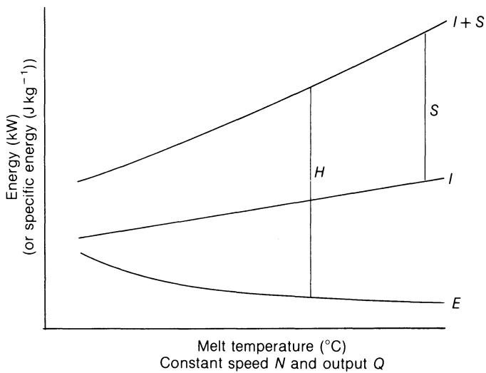  
(figure-10-17)=
图10.17 能量平衡随熔体温度的变化：双螺杆。

由于 $Q/Q_{c} \propto N_{f} \propto 1/N$。因此，对于牛顿流体，功率 $E$ 与 $N$ 成正比；而对于幂律流体，$\eta \propto N^{n-1}$ 且 $E \propto N^{n}$。 [图 10.18](#figure-10-18) 显示，随着速度的增加，电机功率逐渐增大，而从机筒中所需的热量则逐渐减少，尽管在实际运行中不太可能达到绝热点；即使达到绝热点，仍需热能来弥补损耗。

如果在螺杆转速和温度恒定的情况下提高进料速度，内能 I 将成比例地增加。 模压也会随之升高，填充螺纹数 $N_{f}$ 以及传给螺杆的机械功率 E 也会随之增加，直到整个泵送段满负荷运行($Q = Q_{c}$)为止，此时进一步增加便不再可行。 功率 E 将小于内能 I，因为熔化过程主要依赖于传导加热，否则熔体温度将趋于超过规定值。 因此，随着进料速度的增加，功率 E 将上升，但加热量 H 也会随之增加。这一点在 [图 10.19](#figure-10-19) 中有所体现。 在其他变量中，通过更换模具来增加模具压力将导致填充长度增大，进而使功率 E 增加。这将在 [图 10.17](#figure-10-17) 中表现为功率线 E 的整体上升， 而在图10.18和10.19中，则表现为功率曲线E的斜率增大，从而降低了所需的外部加热量。 如果提高聚合物的粘度(例如通过更换树脂等级)，这将增加模头压力，但同时也会提高螺杆的增压能力，因此填充长度应变化不大。 功率方程表明，粘度增加将使功率E成比例增加，其对能量平衡的影响与更换模具的效果相似。

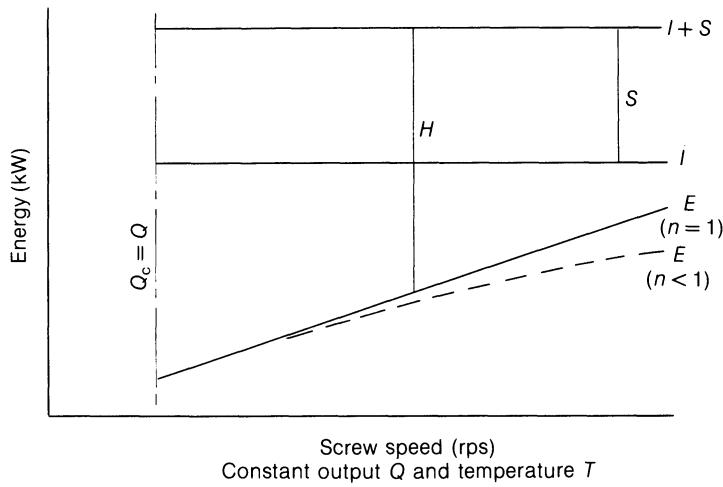  
(figure-10-18)=
图10.18 随螺杆转速变化的能量平衡：定量喂料。

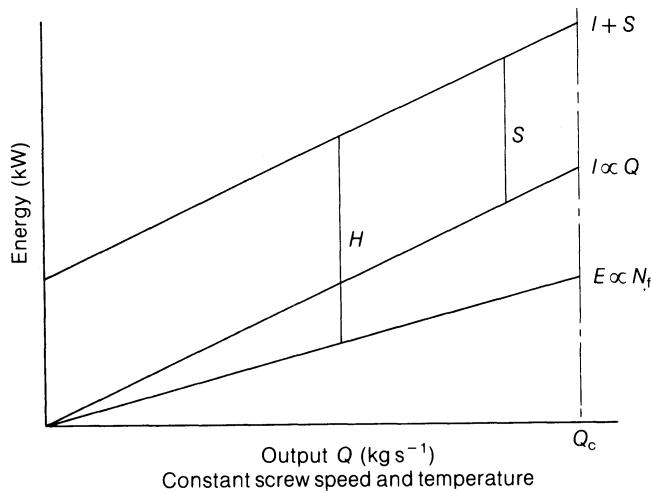  
(figure-10-19)=
图10.19 能量平衡随产量的变化：计量投喂。

通过定量喂料实现的输出与螺杆转速的解耦，比单螺杆机提供了更多的操作变量，正如螺杆设计中也存在更多的几何变量，例如螺距、螺纹深度、螺纹端面宽度以及共轭关系。 然而，作者的印象是，其满意的运行范围更为有限，这印证了双螺杆机器最适合针对特定工艺和条件进行设计，并在这些条件下表现非常出色。 分段式螺杆的广泛使用促进了这一点，虽然初期成本较高，但可以轻松更换以适应不同的聚合物、工艺或操作条件。操作员的任务就是尽可能将机器运行在螺杆设计等预先确定的条件范围内。

## 10.5 不同机型对比

本书的主要目的并非对各种机器进行比较，但在为特定用途选择机器时，总结其主要差异可能会有所帮助。 以下说明应结合表2.2一并阅读，该表概述了若干工艺的要求。在[表10.2](#table-10-2)中，对单螺杆和双螺杆挤出机的主要特征进行了比较。 前者的性能在第6–8章中有详细介绍，而后者则在[第10.3节](#103-full-intermeshing-counterrotation)和第10.4节中进行了描述。 尽管机械设计超出了本书的讨论范围，但双螺杆挤出机的复杂螺杆几何形状和关键间隙要求精密且昂贵的制造工艺， 双叶形料筒比单螺杆挤出机的圆柱形料筒更容易因压力和热应力而发生变形，且螺杆轴间距有限，给实现可靠的螺杆驱动和推力轴承带来了困难。若因此暗示双螺杆

(table-10-2)=
表 10.2 单螺杆和双螺杆挤出机的比较

|  | 单螺杆 | 双螺杆 |
| --- | --- | --- |
| 流动类型 | 拖曳 | 近正排量 |
| 停留时间及分布 | 中等/宽 | 低/窄（适用于反应） |
| 背压对产量的影响 | 降低产量 | 轻微/中等影响 |
| 螺槽中的剪切 | 高（适用于稳定聚合物） | 低（适用于PVC） |
| 总体混合效果 | 差/中等 | 好（适用于共混） |
| 功率吸收与产热 | 高（可能绝热） | 低（主要传导加热） |
| 最高螺杆转速 | 高（产量受熔融、稳定性等限制） | 中等（限制产量） |
| 推力承载能力 | 高 | 低（限制压力） |
| 机械结构 | 坚固、简单 | 复杂 |
| 初期成本 | 中等 | 高 |

挤出机虽然可靠性较低，但上述因素会导致制造成本高昂且操作时需更加谨慎，在进行诸如[表10.2](#table-10-2)之类的比较时，必须将这些因素与性能特征一并考虑在内。

内部熔体混合机(例如 Farrel-Bridge “Banbury”* 和 Shaw “Intermix”†)本质上是一种间歇式混合机，不适用于直接成型操作，且需要截然不同的辅助设备和操作方法。 其结构非常坚固，能够承受非常高的功率输入，通常通过转子转速和限制聚合物的外部压力进行控制，从而产生高剪切应力和快速的温度上升。 批量操作允许通过批量称重来精确计量和配比添加剂，而自动称重/喂料系统不仅消除了人工喂料造成的误差，还为质量控制提供了可靠的记录。 然而，批次产出量往往不符合下游批次工艺的要求，因此需要使用辊式混合机或加热料斗进行存储，以便在其他情况下实现连续产出； 事实上，特制的热喂料单螺杆挤出机(板料挤出机)已被用于连续造粒或带状挤出，但通常不用于成形最终产品。 转子间隙内的捏合作用主要由初始转子设计预先确定，远比单螺杆通道中的物料流动更具确定性，这可能也使得转子尖端处的剪切作用比挤出机中更少随机； 无论如何，混合时间可独立控制，从而确保整批物料极大概率地受到较高剪切应力的作用。这种剪切作用能有效分散颜料团聚体，且发生在机筒表面，因此便于能量散逸和温度控制，整个循环过程中均可对加热/冷却进行编程控制。 批量操作的一大优势在于，通过冷聚合物产生的热量与设备构件的热容相结合，可在不产生过高温度的情况下施加强烈的剪切力；例如，每个循环中可施加动力约2分钟，而冷却则可维持整个循环时间，例如5分钟。 因此，内部熔体混合器在颜料分散、熔体混炼以及有意降解(例如生天然橡胶的捏合)方面非常有效；对于前者，单螺杆挤出机需要先经过高速“强化”粉体混合机处理或使用颗粒母料，而对于后者，加热和温度控制则是一个难题。 双螺杆挤出机是一种有效的混合器，但这两种类型停留时间都相对较短，这限制了混合的规模，并且大范围的均匀性取决于进料装置。

已开发出多种获得专利的连续式混合机设计，旨在兼具内混式混合机的优点与连续出料的功能。它们通常由一对转子组成，置于与内混式混合机类似的夹套式腔室内，并配有螺旋给料机(例如位于转子的一端)，该给料机决定了处理能力。 随后可通过重力进料，这需要对添加剂进行连续或半连续的计量。在这种情况下，由于转子速度不再独立于产量，因此无法再通过转子速度来控制动力，而是采用阀门调节背压。然而，这会影响流向模具的物料流量，从而给直接成型带来问题。 在高产量下，冷却的表面积受到限制，从而限制了能量输入水平；能量输入与带出的时间差已不再可能。 此类设备无疑是高效的混合机，但笔者认为，它们并不构成完整的共混成型工艺，也无法在那些仅需适度分散混合的成型工艺中与螺杆挤出机相抗衡。

柱塞式挤出机结构简单、坚固耐用，适用于需要极高压力的场合，例如静水压挤出、PTFE挤出以及注塑成型。 对于前两种工艺，可以通过使用两个挤出机并配合切换阀交替运行，以牺牲工艺复杂性为代价实现连续操作。由于气缸内的流体流动量很小，加热主要依靠传导，因此加热速度较慢，且会导致聚合物内部产生温差，特别是当为了延长连续运行时间而采用较大直径时。 正如第24页在讨论注塑成型时提到的，材料从机筒流出的路径较为复杂，因此初始的温度差异会在通过模具的過程中重新分布。在进入模具之前，不太可能产生较高的剪切应力和剪切应变，因此温度或成分的混合程度很低。 如果采用常规的直接挤出法(对聚合物料团后端的活塞施加力)，则随着料团长度的减小导致壁面摩擦减弱，模头处的压力会趋于上升，同时还会因机械惯性、摩擦以及略微可压缩的聚合物中储存的弹性能而产生能量损耗。 因此，柱塞挤出机虽是一种高效的间歇式泵，却无法履行螺杆挤出机的其他功能，例如进料、熔融、混合、排气和温度控制。这些功能在注塑机中得到了体现，在注塑机中，螺杆承担了除最终泵送功能以外的所有功能。

这种设计颇为独特：长而窄的通道并非沿细长圆柱体呈螺旋状延伸，而是以螺旋状缠绕在圆盘上，与光滑的圆盘相对运动，流体沿径向向内或向外流动。 预计该装置将实现与单螺杆挤出机类似的固体进料、剪切熔化及熔体输送(伴随一定程度的混合)功能。除非螺旋的匝数与传统螺杆相同，否则相邻两匝螺翅间的压差会更大，因此泄漏流量也会更大。 盘片之间的轴向推力会很大，尤其是当流向向外时——因为该推力是整个盘片面积上的压力积分；相比之下，传统挤出机的轴向推力等于模头压力乘以机筒横截面积；任何机械刚度的不足都会增加螺纹间隙并导致泄漏增加。 请注意，对于沿通道长度方向的恒定阻力流动(方程(6.9))，流速 W 与半径成正比增加，因此宽度 b 或深度 h 必须减小。 在前一种情况下，剪切速率随半径增加而增加，宽通道的假设可能失效，制造也会变得困难；在后一种情况下，剪切速率随半径的平方增加，剪切加热随半径的四次方增加。 也许最大的实际缺点是入口和出口之间的物理距离(径向)较小，这使得难以维持显著的温差，并降低了操作灵活性。

传统单螺杆的一种变体，用于在大直径、短长度的圆柱体上形成流道。* 这使得在相同剪切速率下，螺杆转速更低，螺旋角更小，形状因子$F_{\mathrm{D}}$和$F_{\mathrm{P}}$更高(McKelvey，1962，第236页)，且螺杆的抗扭强度更大。 然而，在给定的模头压力下，这种设计会产生更大的轴向推力，且长度缩短可能导致在维持轴向温差方面出现控制问题。在复合材料加工的讨论中(第2.2.1节)，已提及其他专有设计，这些设计通常正是为此目的而专门设计的。

一种外观上看似与螺旋盘式挤出机相似、但工作原理不同的设备是光面盘式挤出机，文献中常以多种名称指代，包括魏森贝格挤出机和弹性熔融机。据称，该设备利用熔体的弹性特性工作，其典型表现为“爬杆”现象。 该设备由一个光滑转盘组成，该转盘在靠近另一个类似的静止转盘处旋转，将材料从外缘向中心泵送，中心处可能固定有挤出模头。根据作者的经验，该设计确实能非常迅速地熔融聚合物，但最终的熔体温度分布极不均匀。 似乎需要对固体进料进行辅助(可能采用强制进料器或短螺旋叶片)，且产生的压力较小(低于 $1\mathrm{MN}\mathrm{m}^{-2}$)。 为解决后者问题，曾提出采用常规螺杆延长段来产生压力，但这种方法能否充分减少温度不均匀性尚存疑问。若对转盘和螺杆转速进行独立控制，将进一步增加

\*Frieske u. Hoepfner GmbH，德国埃尔兰根-布鲁克。

11

