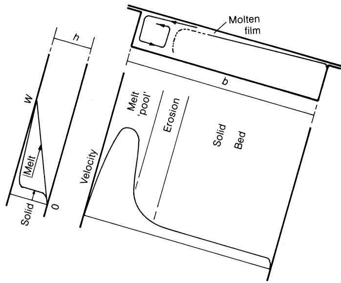
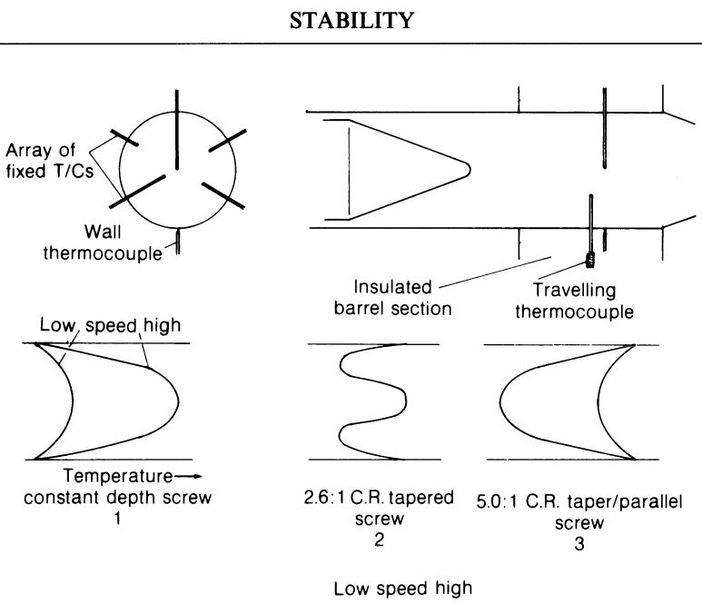
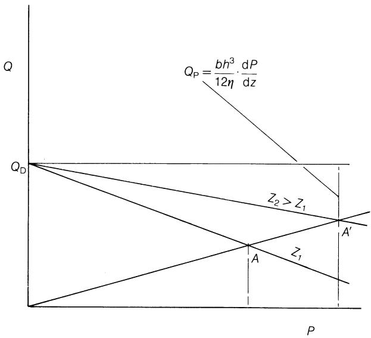
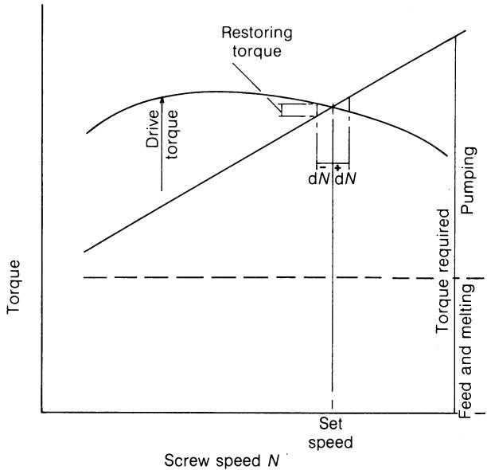

# 挤出机作为整体工艺流程的一部分的运行

在第2章中，已介绍了几种商用挤出工艺的基本原理，并概述了每种工艺对挤出机性能的总体要求。 在第9章和第10章中，讨论了单螺杆和双螺杆挤出机的性能，以及有意改变运行条件后可能产生的变化。由于挤出过程总是涉及某种形式的挤出头，因此假设其尺寸由工艺流程的其余部分所决定。 需要注意的是，如果基于恒定压力等条件对不同设备或运行条件进行比较，得出的结论将大相径庭。第9章和第10章的讨论主要围绕稳态条件及产量、压力、能耗、温度和混合等参数展开，并探讨了通过改变运行条件可能导致的这些参数的微小变化。 本章将尝试探讨如何将这些内容应用于满足完整的商业工艺的条件和要求，并由此引入了稳定性与波动、条件改变时的瞬态过程以及控制方法等额外因素。此外，本章还将详细探讨工艺放大问题，这是建立新工艺的重要步骤。

## 11.1 质量

到目前为止，讨论的重点一直集中在那些或多或少可以较容易测量的物理量上。然而，对于商业产品而言，仅在给定的温度、压力或能量输入条件下获得一定的质量流量是不够的；“质量”这一概念虽然较为抽象，但在确定产品能否正常运行方面却至关重要。 必须强调的是，产品中某个方面的质量几乎不可避免地会成为产量的限制因素，而非物理极限本身。

许多理论研究忽视了质量因素，因此其价值有限。那些忽略质量所施加限制的效率和最优概念，在很大程度上也无关紧要。第6至8章及第10章中提出的理论是经过刻意简化的，旨在揭示整体性能的变化，直到能够通过同样全面地反映实际情况的数学模型来解释更精确的数学模型为止。

那么，什么是质量？对于成品而言，它涉及聚合物和添加剂在微观和宏观尺度上的成分均匀性；所需的高分子结构，包括结晶形态及程度、各方向的取向、分布及程度，以及残余应变；正确且均匀的颜色、外观、表面质地和光学性能； 所需的力学、电气和化学性能及其分布；不存在视觉和机械缺陷，例如模痕、波纹、凹陷、空洞、裂纹、龟裂、翘曲、残余应力集中、污垢、凝胶、鱼眼和颜料团聚物。 尽管这些要求未必全部适用于特定产品，但达到令人满意的质量是一个难以企及的目标，且可能因工艺变更而无意中偏离。 某些性能在很大程度上取决于正确且稳定的原料，例如平均分子量、平均颜料和添加剂含量。而其他性能，在原料正确的前提下，则主要取决于拉伸和冷却等挤出后工序；这些包括结晶度、取向和表面纹理。 因此，最好在挤出头处定义质量，因为质量在很大程度上取决于挤出工艺。这些性能随后可能会发生变化，但正确且均匀的挤出后工艺将取决于挤出头处的性能，例如均匀的流速和温度。现提出以下挤出质量的定义：

\- 恒定流量 $Q$ 和压力 $P$

\- 熔体温度均匀且稳定，特别是没有未熔化的物质

\- 聚合物组分与添加剂的均匀、充分混合

\- 正确的剪切历史，例如：薄膜级LDPE为最大值，PP降解为中等值，PVC复合为最小值，以及消除弹性缺陷为最小值。

此前已讨论过螺杆中的混合机制(第2.2、9.1和10.4节)。总而言之，混合规模受螺杆通道体积较小的限制，且随着产量的增加，停留时间延长，混合规模将进一步减小。 在单螺杆通道中，可以实现相当程度的分散混合(例如，密度和粘度相似的色母粒与基础聚合物的混合)，尽管这种混合并不均匀。 背压增大可提高相对混合速度，而温度降低则会增加由此产生的剪切应力。提高转速可缩短混合时间。分散颜料团聚体或进行机械链断裂所需的高剪切应力仅出现在螺杆螺纹间隙处，仅涉及流体中的一小部分，因此混合往往不完全且能耗较高。 在双螺杆挤出机中，分配式混合发生在螺杆通道内部及通道之间。在两根螺杆的螺纹重叠区域，分散式混合也更为均匀地发生。

### 11.1.1 温度变化

表9.2至9.9中列出了温度变化，这些数据主要基于对熔融过程变化以及熔体输送段中混合效应的定性理解。 根据经验，随着螺杆转速的增加，当超过某个临界点后，模具中的流动会变得越来越不稳定；此外，在其他条件相同的情况下，螺杆越长或螺距越浅，这种情况就越不容易发生，或者只会在更高转速下发生。 随着长度的增加，这种影响可能很小，而对于较浅的螺杆，几乎可以肯定的是，每转的产量会降低。这种不稳定性可能是由于熔体断裂或模具中产生的表面缺陷，也可能是由于螺杆中开始出现波动([第 11.2 节](#112-stability))。 在极端情况下，可能观察到颗粒的轮廓；或者在粉料喂入时，一缕不透明的未熔或部分熔化的粉料可能被包裹在半透明熔体的鞘层中。 此类情况显然会导致产品拉伸性能不佳及机械强度不足(尤其是脆性)，但未熔融的物料可能与平均温度远高于软化点或结晶熔点的熔融聚合物共存。 如第7章和[第9.1节](9_单螺杆挤出机的运行.md#91-螺杆的整体性能)所讨论的， 固体材料通常源于熔融段中固体床的严重破碎，而随后在输送段中的熔融机制(几乎完全是传导)则较为缓慢。然而，熔融部分可能同时受到传导和内部剪切的加热，导致从模具中挤出的聚合物存在显著的空间温度差异。 即使在较低转速或较高背压条件下(此时模头处不会出现未熔融物料)，温度变化也可能足以扭曲模头内的流动，并导致挤出后工序出现不稳定状况。这些温度变化的可能成因包括：

1. 熔化段末端(固体床破碎处)的熔体和半熔融固体内部温度分布不均匀；

2. 来自/通向筒壁的传导加热；

3. 熔体输送段内的内部剪切加热；

4. 向螺杆的传热；

5. 飞行间隙中受剪切作用的聚合物的传热与传质。

有助于减小温度波动的机制包括：

1. 通道内的横向对流([图 6.7](#figure-6-7))；

2. 通道内的相对纵向速度(图6.6)；

3. 熔体输送段内聚合物中的热传导(包括残留的固体颗粒)；

  

图11.1 熔化段中的流速。

4. 筒体和螺杆金属中的局部多轴向及整体纵向热扩散；

5. 在已定义剪切速率的情况下，对粘度较高的元件进行优先剪切加热(见上文)。

首先考虑其可能的起源：

1. 当固体床破碎时，其应占据河道横截面的相对较小比例，其余部分的熔体则遵循与图6.6(c)类似的流动模式([图11.1](#figure-11-1))，其流动模式与图6.6(c)相似——因为通常产生的压力较小——以及[图6.7](#figure-6-7)，且会发生显著的混合。 在熔融区域，螺杆温度不太可能高于熔点，否则固体床会脱落；也不太可能远低于熔点，否则当熔体被螺杆叶片收集时，初始熔体薄膜会重新凝固，从而无法向前输送；因此，熔融段内螺杆受到的传热量可能很小。 料筒温度也不太可能低于熔点，否则就无法形成熔体薄膜。因此，熔体部分内的任何温差似乎都会通过混合而消除，并且通过将熔融段的料筒温度保持在尽可能低的水平(同时避免使聚合物“冻结”并导致过大的扭矩)，可以将这些温差降至最低。 在这种情况下，熔融部分的平均温度也将尽可能接近剩余固体部分的温度。 较低的料筒温度往往能通过导热流$H_{\mathrm{M}}$(其数值也会较小)来最小化温度差异，从而导致熔化速度减慢；熔化所需的大部分能量将来自内部剪切$E_{M}$，尽管这也会产生温度不均匀现象。 因此，熔融过程可能会占据更长的螺杆长度，使该段末端的温度较低但更均匀，大致等于 $T_{M}$，并可能延迟料床的破碎，使较小的固体颗粒更接近其熔点 $T_{M}$ 。

2. 来自料筒的总传导加热量 $H_{P}$将取决于聚合物温度从熔点 $\approx T_{M}$ 升至泵送段末端 $T_{m}$ 的升温幅度，而为实现这一温度升幅所需的聚合物径向温度梯度将与熔体泵送段长度 L 成反比， 即较低的最终熔体温度和较长的泵送段将有利于温度均匀性。

3. 第8.4节(图8.5)已讨论了内部剪切加热及其随背压变化的分布情况。需要注意的是，最大剪切加热发生在料筒附近，该处沿通道方向的速度w最大，导致停留时间最短，但产生混合作用的横向速度u也最大。 因此，剧烈的剪切加热(例如在高压背压条件下)往往会加剧温度波动，尽管由于熔体最终温度较高导致粘度较低，这种波动会被最小化。

4. 聚合物向螺杆的热传递会降低螺杆附近的聚合物温度，从而加剧由剪切加热引起的温度波动。需要注意的是，在靠近螺杆的区域，沿通道方向和横跨通道方向的聚合物流速都很小，因此几乎不会发生混合。 (在双螺杆机中已通过实验观察到类似效应——参见第325页。)如果对螺杆进行强制冷却(例如通过循环水)，将会导致聚合物局部冷却，而这种冷却无法通过混合来消除。 此外，与料筒情况不同，冻结现象可能发生而不会直接影响螺杆扭矩，且其对产量、速度分布、剪切速率和能量输入的间接影响，将远大于对温度波动的直接影响。

5. 如第8.4节所述，在螺杆间隙中对小体积聚合物进行剪切时会消耗大量能量；这将受到螺杆转速以及聚合物的剪切速率/粘度特性的影响。 然而，它也会受到筒体温度的显著影响；如果筒体温度较高，剪切能会较低，但流入筒体的局部热扩散也会相应减弱(见(4)中的减热机制)。如果采用筒体冷却，局部热量会在筒壁内扩散，但局部粘度也会得以维持，从而导致发热。 在筒体内扩散的热量会提高该区域的平均壁温，并沿纵向传导至筒体(以及可能的模具)较冷的部分。 由于在螺杆间隙中的剪切作用，这小部分聚合物的温度将高于平均温度，当与通道中的聚合物混合时，会提高后者的温度，特别是在泄漏流进入的螺杆附近。如(3)中所观察到的，这往往会增加模头前的温度波动。

在那些有助于减少温度波动的机制中：

1. 横向对流([图 6.7](#figure-6-7))往往会通过质量传递来减小温度变化；此外，由于流速不均匀，还会通过混合作用——即将因初始位置不同而温度各异的介质元素拉近，从而促进它们之间的热传导——来减小温度变化。 如前所述，请注意通道深度中存在一个横向速度为零的位置；图6.6(b)显示，在高压背压条件下，该位置仅具有很小的顺流速度，因此混合作用微乎其微。

2. 相对纵向速度(特别是在高压背压条件下，见图6.6)会产生一定程度的物料混合。在没有纵向温度梯度的情况下，这并不会减少温度的横向变化。 在这方面，它有助于横向对流将从料筒传导的热量以及料筒附近由剪切产生的热量传递到整个通道横截面，但如第6.2节所述， 由此产生的速度相对于螺杆轴线绝不会向后，因此不会像筒壁内的纵向传导那样，沿此方向传递热量。

3. 聚合物内部的热传导是减小温度波动的最明显机制，但其存在本身又依赖于这些波动，因此具有自熄灭特性。显然，随着熔体输送段长度的增加、通道深度的减小以及停留时间的延长(即产量的降低)，该效应将增强。

4. 如前所述，筒体内的局部扩散将减小空间上的极端局部温度变化以及时间上的波动，例如由螺杆螺纹的运动所引起的波动。 总体而言，纵向传导会削弱料筒内的轴向温度梯度，并在一定程度上削弱聚合物中的温度梯度(相对于设定加热器温度而言)，因此在加热过程中，聚合物往往会更早受热，且向模具方向的温度梯度较小。

5. 在受恒定剪应力作用的系统中，例如悬浮液或简单的横向温差(方程 $(3.57)$)，剪切速率较大(因而剪切加热也较强)的位置通常位于粘度最低(即温度最高)处，这往往会加剧温差。 然而，在剪切速率被明确定义的情况下(如熔融段，忽略熔融膜)，当两股粘度不同的流体并排流动时，高粘度流体中较大的剪切应力会产生更大的剪切加热，从而趋于减小温度差。这种情况在熔体泵送段中不太可能发生。

由此可见，有助于将最终温度的空间波动降至最低的条件包括：长螺杆、低产量，以及在一定程度上较浅的流道；总体而言，较小的纵向温度梯度和较低的熔体温度可能更有利，而熔融段中尽可能低的筒体温度则有助于将该处产生的温度波动降至最低。 这表明应采用与[图9.6](9_Operation_of_single-screw_extruders.md#figure-9-6)中图3类似的筒体温度分布，特别是在最终熔体温度需要远高于软化/熔点的情况下。 这种温度阶跃很难实现，而采用包含纵向隔热层以辅助形成温度阶跃的结构设计同样困难；这突显了准确掌握聚合物实际熔融的位置以及认识到该位置会随产量、背压等因素而变化的重要性。

作者为确定影响温度变化的因素而进行的实验——诚然，实验中并未对操作条件进行精确控制——使用了一台50毫米挤出机，其螺杆后方延伸出一段直径为50毫米的机筒，该机筒延伸部分连接至一个可调节的挤出头。 第一步是评估温度测量的可靠性；将一根3毫米的Pyrotenax\*热电偶放置在延伸段中心，并将一根简单的热电偶焊接在金属壁上。 挤出机在预计会产生较大径向温度波动的条件下运行，并在对筒体延伸段进行不同程度加热的情况下进行了读数。结果发现，在 25 毫米的距离处，浸入式热电偶的读数往往与壁面热电偶的读数一致，而非与熔体温度一致。 当筒体延伸段未加热但外部包裹保温层时，其温度似乎与浸入式热电偶的读数无关——具体数值高低取决于挤出条件；虽然这不能证明温度读数的绝对准确性， 但由条件变化引起的温差至少应大致正确。随后，在螺杆尖端下游50毫米处，沿不同半径布置了一组热电偶，并配有一组可在整个范围内调节的热电偶([图11.2](#figure-11-2))。 挤出机以LDPE为原料运行，螺杆转速范围为20至100 rpm。使用了三根L/D比为16:1的螺杆：恒定深度6.3 mm($\frac{1}{4}$ in)； 螺杆深度从9.5毫米($\frac{1}{8}$英寸)逐渐减小至3.2毫米($\frac{1}{8}$英寸)，覆盖16个螺杆直径，压缩比为2.6:1； 10个直径范围内的锥度，从9.5毫米($\frac{1}{16}$英寸)到3.2毫米($\frac{1}{8}$英寸)，加上6个直径深度均为1.6毫米($\frac{1}{16}$英寸)——压缩比为5.0:1。 研究发现，在运行过程中，可调热电偶与同一半径处(包括壁面处)的固定热电偶的读数始终保持在1 °C的误差范围内。 发现每根螺钉都呈现出一种特征性的温度分布：第一根螺钉的中心温度较高，向壁面逐渐降低；而第三根螺钉的壁面温度较高，向中心逐渐降低。 第 2 根螺钉则呈现出“胡须”状分布曲线，壁面和中心温度较高，半径中点处的温度较低。在 20 转/分钟时，第 1 根和第 3 根螺钉的温度变化约为 5 °C，第 2 根螺钉约为 2 °C。 随着转速的增加，这三根螺杆都保持了其特征曲线，但温差逐渐增大，直到转速达到 100 转/分时，螺杆 1 和 3 的总体温差高达 50 °C，螺杆 2 的温差约为 30 °C。 由于热电偶的质量和响应时间，这些读数代表的是时间平均温度； 一位同事在类似的机器上使用快速响应热电偶和记录仪获得了读数，结果表明，在看似稳定的运行状态下，温度仍存在量级相近的快速波动——另见Tadmor和Klein(1970)以及第362页。 必须谨慎对待这些结果；在某些方面(如转速的影响)，它们与前述理论一致，但值得注意的是，最浅螺杆(3)的温度波动比螺杆2更大，这可能是由于计量段中剪切加热过强所致。

  

图11.2 螺杆末端的径向温度分布。

马歇尔、克莱因和乌尔(1965)也检测到了温度随时间的变化，但明确指出这些变化源于熔化段，并在熔体输送段中趋于减小。 他们还表明，这些波动会随着螺杆转速的增加而显著增大，而随后的减小过程则需要更长的距离，导致螺杆末端残留的波动增大。当然，这些结果并未区分本章中讨论的各种机制所产生的影响。

## 11.2 稳定性

除了因混合不足和温度波动过大而对有效产量造成的限制外，不稳定的流动或“波动”也常常会限制产量，导致产品尺寸、料深、冷却过程发生变化，进而影响产品性能。这些情况通常在螺杆转速和产量较高时发生，或者仅在这些条件下才变得显著。 缓慢的变化可能源于机器本身之外的因素，例如进料斗中的结桥、螺杆填充不均匀或加热器控制切换；其中，加热器控制切换的情况在采用时间比例型控制器时尤为常见，其特征表现为在10–20分钟的时间段内发生。 现代比例控制器可避免此问题，但对适用于电阻加热的“快速循环”控制系统进行检查时，通常会发现功率输入在通常少于1分钟的时间内存在周期性波动。可通过调整“功率”限值，直至负载指示灯以恒定频率闪烁，从而将此现象降至最低。 控制中的死区过大或超调，或者料筒的热容量，都会加剧温度振荡。 自热操作本应能提高温度稳定性，因为此时流经筒体的热量最小。然而，温度梯度的逆转、筒体材料的热容量，以及在低温度下难以控制液冷等因素，都会对此产生影响。 一种方法是采用能源效率较低的方式：保持大致恒定的风冷，并通过切换加热器来平衡热需求。通过正确布置热电偶并使用现代控制器，一个不错的折中方案是在略低于自热速度或略高于自热温度的条件下运行，从而仅需少量但持续的热输入。

需要注意的是，流量和压力的方程(方程(6.15)、(6.53)和(6.58))均为线性方程，因此其解(由工作点表示，例如图6.18中的A或B)是单值的。 描述机械功率输入 E 的方程 (8.9) 对粘度(温度)和输出 Q 呈线性关系，因此为单值(图 8.10)。 方程 (8.29) 表明，随着背压的增加，比功率输入 E/Q 是 Q/Wbh 的线性(倒数)函数，因此是单值函数。 从方程(8.9)来看，如果将 Q 视为常量，则给定功率 E 值将对应两个转速值(与 W 成正比)； 然而，Q与W之间存在关联(由方程(6.15)和(6.53)的解可知)，若将W和Q/Wbh视为独立变量(其中Q/Wbh由压力梯度dP/dz决定，或在特定情况下由模头常数K决定)，则会得到单一值。 当加热器输入 H 处于给定值时，转速 N 会出现双重值(图 8.12)；这似乎表明，若加热器输入被预先确定，转速 N(以及随之而来的输出 Q 和压力 P)可能会发生不稳定。 实际上，驱动电机的功率/转速特性会抑制这种现象，且笔者在加热器负荷恒定的实验机上未观察到此类振荡。在通常情况下，加热器输入被控制以达到所需的料筒温度，因此熔体泵送段中不存在导致不稳定性的机制。 因此，波动的根源通常归因于熔化段；在第 7 章中，这是由于固体床周期性“堵塞”导致熔池中断所致。此前已观察到，在给定温度下，熔化所需的长度随转速 N(以及产量 Q)的增加而增加。 由此可以合理推断，在给定的转速和温度下，熔化长度越短，熔化速率就越低。 对于熔体泵送段，图 11.3(源自图 6.18 和方程 (6.15))显示，随着泵送长度 Z 的增加，输出量 Q 和压力 P 也会随之增加。 在稳定条件下，熔化长度与泵送长度的总和是恒定的，且 $Q_{melting} = Q_{pumping}$。然而，假设在短时间内泵送速率超过熔化速率，则该差值只能通过部分排空泵送段起始处的螺杆通道来弥补(第 6.6 节)。 当螺杆通道不再充满熔体时，无法产生压力，有效泵送段的起始位置便会向模具方向移动。随着这一变化，泵送速率(及压力)将下降，在某些情况下甚至降至零，从而低于熔化速率。 此时，多余的熔体开始重新填满螺杆通道，可用通道长度的增加会提高熔化速率。随着熔体重新填满通道，泵送长度再次增加，产量和压力随之上升，从而缩短熔化所需的长度，进而降低熔化速率。 当泵送速率再次超过熔化速率时，通道将重新排空，该循环将无限期重复。由于螺杆通道的熔体容积以及额外熔化以重新填满通道所需的时间，这一循环过程需要有限的时间。 随着螺杆转速的增加，该现象的频率和严重程度往往会增加；笔者发现其周期通常为螺杆的5–15转，这大致相当于与熔体输送段体积相等的排量；在极端情况下，产量曾暂时完全停止，但随后又以看似完全熔化的聚合物重新开始。 据称，对于阶梯式螺杆，凝胶点实际上是由通道深度的快速变化所预先决定的； 确实，如果泵送长度超过“计量”长度，超出部分对总压力的贡献微乎其微(图6.10中Q/Wbh值较低时)，因此近似最大输出量和压力是固定的； 然而，这会缩短熔融过程的长度，而在另一极端情况下，计量段的有效长度和产量仍可能因部分排空而进一步减少。 阶梯式螺杆可能会发生冲程现象，通俗的解释是：计量段将自身抽空，然后等待熔融过程(在此情况下主要通过传导)将其重新填满，以便重新开始输送。 显然，在此情况下，熔融速率将与可用长度(机筒表面积)以及机筒与聚合物之间的温差呈正相关，这表明熔融段温度较高。 当熔化主要依靠机械剪切时——据信，这适用于锥形螺杆所适用的聚合物——较低的筒体温度和较高的机械功率输入应能提高熔化速率(参见[表 9.8](9_Operation_of_single-screw_extruders.md#table-9-8])，延缓固体床的破碎，并降低此类波动的发生概率。

  

图11.3 熔体长度对产量的影响。

Kirby(1962)推导出了描述熔体泵送段对外部扰动稳定性的方程，而Fisher(1976)得出结论：增加模头压力或延长熔体泵送长度均可提高稳定性。 虽然附录 D 认同这些结论，但也指出柯比的方程同时表明，降低通道深度也会提高稳定性；当然，这些改变并不能消除不稳定性的根源。 如第 6.5 和 6.6 节所述，传统排气螺杆的后半部分往往容易发生波动，这是由于泵送率随填充程度发生非线性变化，也可能由于排气口下方区域的聚合物流动不连续所致；在此情况下，减少最终沟槽深度似乎也能减少波动。

塔德莫尔和克莱因(1970)引用了关于温度和压力随时间波动的一些有趣的实验结果，并指出：

压力与温度波动之间存在良好的相关性，这表明温度波动是问题的根源，且流量可能保持稳定；而如果存在压力波动但没有温度波动，那么几乎可以肯定会伴随流量波动。

因此，[表 9.8](9_Operation_of_single-screw_extruders.md#表-9-8)下“改善熔融”标题下的建议，因此有助于最大限度地减少这种引起波动的原因，而上述因素则应能减轻其后果；特别是增加长度，也有助于减少熔体输送段末端的温度波动和变化(参见第291页和第357页)。

尽管严格来说位于挤出机外部，但驱动系统的稳定性也会影响挤出机的性能。 图8.12以及方程(8.7)和(8.16)表明，在恒定温度下，螺杆在熔体输送段吸收的功率随其转速的增加而略微超过其转速的比值，具体取决于聚合物的剪切速率/粘度特性。

  

图11.4 驱动器的转速稳定性。

因此，来自该来源的螺杆扭矩与E/N成正比，并将随转速增加而增大；对于牛顿流体而言，这种增大呈线性关系。 因此，总扭矩也将随转速增加，因为由进料和熔化产生的扭矩至少是恒定的(功率与转速成正比)。除低速情况外(例如交流换向器电动机)，电动机的扭矩-转速特性通常呈下降趋势，而静压电动机的扭矩则基本恒定。 因此，如果转速低于设定值([图 11.4](#figure-11-4))，则会有过剩的扭矩用于加速；而由于(例如)暂时性负载减轻导致的转速增加，则会导致扭矩不足，从而趋于降低转速，从而形成一个稳定的系统。 在通常通过减速齿轮传动的高速电机中，存在显著的旋转惯性，这会趋于抑制此类转速波动。 对于那些即使在挤出机需求发生变化时仍需要非常稳定转速的应用，可采用带转速发电机反馈的直流并联电机晶闸管控制，其功率可达数百千瓦，且随着技术日益精进(成本也随之增加)，从零负载到满负载的转速保持精度可提高至0.25%。

### 11.2.1 启动与状态变化

到目前为止，稳定性都是在名义上的稳态条件下考虑的。对于如此大的负载变化，上述的转速保持并不能立即实现。 因此，在启动时或有意改变转速时，短暂的瞬态现象可能会导致过载；只要持续时间较短，电机不会受到损害，且联轴器和皮带传动的柔性会缓冲其影响，但即便是瞬间的过载扭矩也可能损坏螺杆或驱动轴，例如当固体物料卡在进料口时。

关于渐进启动和工况变化，详见[第12.3节](#123-start-up-and-shut-down)；此处只需指出，压力变化对输出功率的影响几乎是瞬时的，而对功率的影响则稍慢一些。 在小型设备上，温度平衡可在10–20分钟内达到，但在大型或转速较低的设备上则需要一小时或更长时间。 对转速变化的响应仅比对压力变化的响应稍慢一些，但图 8.12 所示的能量平衡方面的重大变化意味着，达到温度平衡可能比压力变化需要更长的时间。 设定温度的变化通常需要最长时间才能生效并稳定下来，部分原因是挤出机结构的热容量，部分原因是环境热损失的变化，部分原因是熔融机制的变化。加热器功率有限会减缓温度上升，温度控制器必须在快速预热和最小超调之间取得平衡。 然而，变化最慢的往往是纵向温度梯度，例如，当一个加热区的设定点相对于相邻区发生变化时。 随着经验的积累，可以快速实现此类变化并最大限度地减少瞬态影响，但必须认识到，大幅变化通常会导致第 9 章中描述的许多机制和相互作用出现暂时失衡，而且这些失衡有时会与预期效果背道而驰。

虽然现代温度控制器能对需求变化做出快速且平稳的响应，但它们仍受限于所连接的系统；快速启动与稳定运行的要求可能相互冲突，特别是， 用于升温的加热器最大功率对于稳定控制而言可能过高——在运行时可能需要降低功率(例如通过手动调整控制器上的功率限制)，或咨询控制器制造商以获取差分项(用于控制超调)和比例带(用于功率限制)的最佳设置。

## 11.3 剪切历史

模具处的剩余质量标准(第353页)是正确的剪切历程。虽然此前曾指出 (第19和64页)曾指出，对于某些工艺(如颜料团聚体的分散和聚合物链断裂)，无论剪切时间长短，都需要达到一定的剪应力阈值才能产生显著效果。 在这种情况下，该定义可修改为“达到或超过阈值应力的剪切应变量”。剪切应变是剪切速率与时间的乘积的积分：

$$
\text{剪切应变} = \int_{t_1}^{t_2} \dot{\gamma} \mathrm{d} t\tag{11.1}
$$

理想情况下，对于每个体积元而言，这一情况都应相同，因此尽管剪切速率及其作用时间可能随螺杆中的位置而变化，但所有体积元所受的作用模式都是相同的。 但在单螺杆挤出机中，情况显然并非如此；考虑纵向速度 w，在拖曳流中，该速度从螺杆处的零均匀变化到筒体处的 W(图 6.6)，因此剪切速率 dw/dy 保持恒定。 然而，若忽略 y 方向(径向)的运动，在给定熔体长度内的停留时间将为 $Z/w_{y}$，其值从 Z/W 变化到无穷大。因此，在距螺杆根部 y 处：

$$
\begin{array}{r l} \text{剪切应变} & = \dot{\gamma} _ {y} \mathrm{d} t \\ & = \frac {\mathrm{d} w}{\mathrm{d} y} \cdot \frac {Z}{w _ {y}} \end{array}\tag{11.2}
$$

且其服从双曲分布：

$$
\frac {Z}{h} <   \frac {W Z}{h w _ {y}} <   \infty\tag{11.3}
$$

图6.7显示，横向速度和剪切速率均为非线性；在速度最大(向右)的位置，剪切速率为零，因此该位置不会产生横向剪切，尽管可以推测，当该体积元在靠近筒体处向左移动时，会经历相当大的剪切。 因此，通道中的聚合物会受到多种多样的剪切应变作用；如果剪切降解是故意的，那么假设最终产品经过混合后能达到可接受的均匀性能，则取某种平均值是合理的。 如果要将降解降至最低，则最大剪切应变才是正确的标准，但图6.6和图6.7显示，在螺杆根部附近，聚合物理论上既没有向前速度也没有横向速度，这表明停留时间是无限的；螺杆冷却往往会增加这一滞留层的厚度。 传统上，采用高背压来改善混合效果，这会产生纵向方向上的最大相对速度，并因输出降低而延长停留时间； 然而，随着压力的升高和 $Q / Wbh \rightarrow 0$ ，系统将趋近于图6.6(a)所示的纵向速度分布，此时会出现第二个双向速度均为零的点。因此，在高压背压下，第二层在两个方向上都经历相当大的剪切速率，但停留时间却非常长。 剪切历史的进一步分散，是由于在螺杆间隙中，只有一小部分流体在短时间内承受了非常高的剪切速率。 这强调了单螺杆挤出机本身并不太适合进行有意剪切；显然，最佳条件是长而浅的计量段、低转速以及相当高的背压，从而产生较低的产量。 对于对热或剪切敏感的材料，如橡胶和 UPVC，最好使用短而深的螺杆，以适中的速度运行，并保持较低的背压(这也能最大限度地减少功率输入)，实际上，这种做法也很常见。 单螺杆挤出机作为分配式混合机表现相当不错这一事实表明，在 y(径向)方向上存在某种混合机制(而不仅仅是如图 6.7 所示的螺杆面处的循环)，这是简化的流动分析未能揭示的。 如果这种机制较弱或根本不存在——正如挤出物超薄切片中发现的条纹所暗示的那样(第 20 页)——那么在熔体输送段内安装径向混合装置就有其必要性； 否则，更可取的做法是尽量减少螺杆中的剪切应变，并加装混合装置——该装置最好能提供均匀的剪切力和停留时间，且针对特定用途和聚合物进行专门设计。

当挤出机施加剧烈剪切力时，该剪切力会转化为热量，从而提高聚合物温度，进而降低剪切应力和压力梯度。如果采用冷却措施来抑制温度升高，这往往会导致功率输入和剪切应力增加，因此会在一定程度上适得其反。 这还会导致温度和速度分布发生畸变(第4.3节和[图9.3](9_Operation_of_single-screw_extruders.md#figure-9-3))，从而既不利于冷却，也不利于均匀性。 如果聚合物的升温能够抵消剪切生热，那么挤出机便是一种实现这一目标的简便手段；但无论如何，高粘度材料的冷却都难以均匀实现，单螺杆挤出机也不例外。 当仅需适度的剪切作用时，必须承认剪切力不会在聚合物料体中均匀分布，只有通过试验才能达到可接受的水平。表9.7和表9.9说明了如何获得有利于混合和温度均匀的条件。

在双螺杆挤出机中，停留时间更为均匀，温度更多地取决于外部加热而非内部剪切，因此更容易控制。尽管在螺杆间隙处的剪切速率和应力通常会高于螺杆通道内，但这些间隙的尺寸相对较大 (第335页和第344页)表明，这种差异将小于单螺杆机，且有更大比例的物料流将受到更高剪切作用，从而产生更均匀的剪切历程。 特别是，近正排量机制将缩短热降解所依赖的最大停留时间。因此，双螺杆挤出机——尤其是当间隙专门为此目的设计时——将比单螺杆挤出机提供更均匀的剪切历史和混合效果，同时最大限度地减少降解。 有效的分散(例如颜料团聚体的分散)在很大程度上取决于螺杆间隙，尤其是螺杆螺条侧面之间的间隙，因为总流量中相当大的一部分应通过该间隙。

## 11.4 控制

在关于带排气孔(两段式)螺杆以及螺杆挤出机与齿轮泵组合的讨论中(第6.5节和附录B.5)，曾指出：由于压差或压力梯度的增大会降低熔体输送段的产量，因此该段会自动进行调节，以适应产量或压力的小幅变化。 参照图6.18，如果某种扰动导致模头输出和压力从A增加到$A''$，挤出机的输出将从A减少到$A''$。因此，进入模头的聚合物供应量减少，模头压力趋于再次下降。 同样地，如果模头输出量降至 A 以下，压力也会下降，从而增加挤出机的流量，使输出量和压力趋于恢复到点 A。需要注意的是，如果同一根螺杆配合较浅的模头(如 C 所示)运行，则在给定压力变化下，其输出量的波动幅度会比配合较深螺杆时更大。 从这个意义上说，较浅的螺杆可以被认为更稳定；但在螺杆与模头之间的滞留体积相同时，较深螺杆在模头处产生的更大产量偏差，预计会使系统更快地恢复到原始状态。 因此，以恒定速度运行并向固定模具供料的单螺杆挤出机，就产量和压力而言，是一个自调节系统。 图8.10显示，在恒定转速下，熔体终温的变化会导致机械功率输入发生显著变化，而热量供给的(绝对)变化幅度则更大。因此，温度的暂时下降将导致机械功率增加和损耗减少，从而促使温度回升至原始水平。 如果加热器控制器检测到温度下降，它们也会通过增加热输入来恢复温度，但受设备热容的限制，这一过程将发生在更长的时间尺度上。因此，无论加热器控制器如何工作，挤出机在温度方面都倾向于自我调节。 [图 11.4](#figure-11-4) 表明，电动机的典型“调节”曲线往往使驱动系统在转速方面具有自稳定性，从而抑制了图 8.12 所示的潜在不稳定性。 因此，在许多方面，单螺杆挤出机对短时波动具有自稳定性，因为这些波动会或快或慢地被衰减，尽管瞬态效应无法完全避免。前提是必须保证转速恒定。 因此，除了螺杆转速和机筒温度之外，对挤出机施加任何短期的外部控制都是不明智的，因为这些控制可能会与自调节系统发生相互作用，甚至导致失控。出于同样的原因，任何长期调整都应缓慢且循序渐进地进行。

晶闸管驱动提供的速度控制非常理想，因为安装在电机轴上的转速发电机输出电压几乎能即时响应，且晶闸管控制中的滞后可忽略不计，从而能够提供维持转速所需的电机电流。 只要该控制系统允许的转速调节范围较小，电机和驱动装置的机械惯性影响也微乎其微，从而能够针对负载变化实现快速、精确的转速控制。然而，当需要大幅调整转速设定时，机械惯性会导致响应延迟，并可能出现轻微的超调现象。 可以通过更复杂、更昂贵的控制电路将转速调节误差降至最低，但这些电路在初始安装后往往难以轻松调整；对于要求输出波动最小(如薄膜和纤维)以及拉伸量极小(如大型管材)的产品，采用此类控制电路在经济上可能是合理的。 为辅助重置条件并确保长期稳定性，建议为转速配备数字设定功能。 在较早期的驱动类型中，配备感应式调速器的交流换向电机可能是最理想的，其在约20%过载条件下调节偏差较小，且在50%至120%负载范围内效率保持在85%左右，相当稳定。 然而，当转速设定值远高于或远低于同步转速时，效率会大幅下降，且次级电路中会出现较大的循环电流。带可动电刷的交流施拉格(Schrage)电机能够长期承受相当大的过载转矩，但其转速保持性能较差，其特性与串联电机相似。 交流/直流沃德-莱昂纳德驱动装置价格昂贵且结构笨重，包含三台旋转电机，这也限制了其效率；其负载/转速特性在很大程度上可通过设计来确定。 带磁滑动联轴器的交流感应电动机，在接近满载时会受到感应电动机较大的转速调节影响，而在低速时，由于联轴器中的损耗，效率较低。

在生产过程中，产量无法直接测量，通常只能在远离挤出机的位置进行测量，例如在电线包覆、管材和板材挤出过程中，通过在恒定牵引速度下连续测量产品厚度来实现。 因此，会存在时间延迟，并且由于挤出机与测量点之间的系统“存储”容量，可能会产生误差，这使得产量不适合作为短期控制的信号。压力可以在在线和螺杆末端进行测量，响应速度快，精度高。 遗憾的是，除了可能存在的温度误差外，这些仪器在生产环境中似乎容易受损；由 ICI 石油化工与塑料事业部 (Lolley 和 Wykes，1966)并由 Bowyer Engineering Ltd\* 推向市场的力平衡设计，旨在最大限度地减少这一问题，并提供 20–100 kN m $^{-2}$(3–15 psi)的气动信号，适用于控制。 因此，压力是反映工艺变化的最快且最合适的指标；然而，在高温、高粘度聚合物的环境中，通过可调阀或节流阀直接控制压力不仅速度慢，而且在机械上不可靠。 此外，早先的研究已表明，压力不仅高度依赖于温度和有效泵送长度，还与产量密切相关，因此并非理想的控制手段；尽管如第150页所述，它是反映挤出机运行状况的重要指标。

最终熔体温度既是操作条件的重要指标，也是影响后续加工和产品性能的关键控制因素。可通过将便携式热电偶手动插入从模具中流出的聚合物流中进行粗略测量；该热电偶必须坚固耐用，因此响应较慢，这会导致容易粘附在其表面的聚合物冷却。 通常需要反复插入才能获得可靠的(最高)读数，而这种操作不可避免地会干扰下游工序。若采用

热电偶永久安装在模具前方，与压力传感器一样，在清洁过程中需要小心处理，尤其是当其尺寸较小以实现快速响应时。 它通常无法像压力表那样快速响应，而且鉴于前文提到的空间变化和时间波动(见第358页)，其读数不会显示真实的平均值； 为尽量减少前者的影响，应始终将其安装在相同位置，且最好位于相当狭窄的流道中，尽管这会加剧因壁面热量引起的误差。即便如此，熔体热电偶的读数仍是长期控制料筒温度的重要且有用的信号，特别是在转速、产量等发生变化时。 熔体温度当然无法直接控制，但在给定的螺杆设计和转速条件下，可通过筒体温度间接控制，因此调节速度相对较慢。从表9.4和表9.5可以看出，沿螺杆长度不同位置提高设定温度，会对最终熔体温度产生不同(甚至相反)的影响。 在此情况下，电机驱动装置上的电流表或其他扭矩计可提供快速指示，例如，如果设定温度的升高导致驱动扭矩明显下降，则熔体温度很可能也会升高。因此，应将筒体温度分布视为与平均或最终设定温度不同的控制输入。

结合[图9.6](9_Operation_of_single-screw_extruders.md#figure-9-6)讨论了各种温度曲线，作者总结认为，第一螺杆区的温度决定了熔融开始的时刻； 熔融段的设定温度决定了通过热传导以及与机械驱动产生的热量差所添加的能量；熔体输送段的设定温度则决定了最终熔体温度比聚合物的软化/熔点高出多少。

用于塑料加工机械的现代温度控制器以高度的精密性和可靠性履行两项主要功能：在确保最小超调的情况下实现快速启动和工况切换；以及在工艺热需求发生大幅波动时，仍能精确维持设定温度。 具体的操作细节超出了本书的讨论范围，但仪器制造商深谙塑料行业的需求，在确定仪器设置(时间常数、积分和微分项、功率水平、比例带)以在特定情况下获得最佳性能方面，他们提供了极大的帮助。 为了获得快速且明确的响应，控制热电偶应靠近加热/冷却源，而这正是控制器试图维持的温度。 如上所述，这与所需的聚合物温度间接相关，且会受到时间延迟的影响，因此操作员必须确定设定温度与熔体温度之间的关系，并制定适当的控制设置策略。 位于料筒内壁附近的热电偶(第 232 页脚注和表 C.2)对于指示局部熔体温度非常有用，该温度与设定温度的关系比最终熔体温度更直接。 在维持设定温度的过程中，当因聚合物、 速度、压力或温度变化所导致的扰动后，控制器将自动恢复能量平衡(如图8.10和8.12所示)；但受挤出机内部相互作用的影响，这一过程需要时间，最长可能长达数小时，且必须认识到，这种恢复过程会伴随对其他设定条件的任何有意调整。在此稳定期间，存在生产出不合格产品的可能性，随之而来的将是材料、能源和人工成本的增加以及生产能力的损失。 在极端情况下，停止下游工艺并停止螺杆运转或将产量降至最低，直至温度达到大致所需值，可能更为经济。当速度恢复时，此举对能量平衡必然产生影响，但更有可能更快地获得合格产品，并减少材料浪费等。 随着经验的积累，通过合理调整转速、压力或加热器控制，可能缩短达到平衡所需的时间，但达到正确温度仍可能是时间上的限制因素。必须记住，任何条件的变化都需要时间来稳定，因此不恰当的调整可能会延长达到稳定状态所需的时间。

在其余参数中，驱动装置的恒扭矩控制并不理想，因为这会导致转速和温度发生变化，从而产生稳态时间；与压力一样，电机电流虽可用于快速指示，但不适用于控制。混合程度和熔体温度的变化难以在线测量，且无法直接控制； 应首先调整[表9.7](9_Operation_of_single-screw_extruders.md#table-9-7)中列出的各项因素，必要时可适当牺牲产量，之后才应考虑更改螺杆设计。

如第281页所述，螺杆冷却需要非常精确的调节，以及对冷却液流量和温度的可靠瞬时显示；在实际操作中，这通常由操作员手动控制，作为其“最后手段”。

在双螺杆挤出机中，与单螺杆挤出机相比，筒体温度(尤其是熔融区的温度)对聚合物熔体温度的影响更为直接，因此应能实现更好的控制，尽管仍会出现明显的时间延迟。 筒体温度通过粘度仍会对机械功率输入产生相当大的影响，尽管这在提高熔体温度的总能耗中所占比例较小。在通常的计量喂料情况下，精确控制喂料速率对于确定产量、压力和填充螺纹的数量至关重要，而这些因素反过来又会影响功率输入和熔体温度。 然而，螺杆转速的控制则相对不那么重要，因为除接近满料进料的情况外，它对产量、能量输入等仅产生间接影响。 一般而言，对于给定的聚合物和/或产品及设计(例如长径比和螺杆轮廓)，双螺杆机满足运行条件的范围比单螺杆机更窄； 因此，整体控制系统更可能致力于维持“设计”条件，而非像单螺杆机那样通过调整螺杆转速、整体温度水平、温度分布、背压等运行条件来优化性能。

在考虑挤出工艺的整体控制时，必须将其与注塑成型工艺等区分开来。在后者中，产品尺寸和性能的一致性取决于该工艺固有的周期性过程的重复性。 而这又在很大程度上取决于机械和液压系统的稳定性能，甚至半连续熔融过程也会受到周期性扰动的影響。相比之下，如[第11.2节](#112-stability)所详述，挤出工艺本质上是连续的，且具有相当程度的自稳定性。 因此，首要要求是对外部工艺参数(例如温度和流量——双螺杆机中的进料速度；单螺杆机中的螺杆转速)进行直接闭环控制，并将其与下游因素(如牵引速度、产品冷却以及管状薄膜吹塑压力)建立关联。 如果能够确保进料聚合物的流变性能一致，则应能实现高度的工艺稳定性。

任何总体控制系统(例如由计算机控制的系统)在短期内均不应修改上述控制参数；鉴于工艺过程中的延迟(主要是热延迟)及相互作用，长期调整(例如设定点的调整)应循序渐进，或以时间间隔合理的小步幅进行； 否则可能会产生过大的瞬态响应，导致产品超出规格要求，甚至造成工艺中断，例如丝线断裂、薄膜气泡不稳定或电机过载。在极端情况下，还可能引发共振振荡，导致失控。

有人认为，基于实验数据回归分析推导出的该过程数学模型，可实现整体计算机控制，而无需对螺杆转速和温度等单独变量进行“局部”闭环控制。 即使考虑到本书所介绍的简化理论中固有的近似性，也很难通过经济高效的实验方案建立一个完全通用的模型。 更切合实际的方法是针对特定的机器、螺杆设计、模具类型、加热器布置和聚合物特性，对实验(如第 13 章所述)进行分析，从而建立该机器上该聚合物加工过程的数学模型。这需要包括第 8.3 和 8.4 节中讨论的相互作用； 背压、剪切速率、粘度和剪切生热；熔融、挤出和螺杆间隙中的机械能与加热能；流道和螺杆间隙中的热流与温度梯度；熔体温度的空间和时间变化、模头内的流分布，以及拉伸、吹塑和冷却等下游工艺。 模型若不完善，几乎肯定会导致至少一个参数的控制不佳，并可能在原本稳定的条件下引入微小波动，更不用说对残余应变和取向等产品性能可能产生的影响了。

### 11.4.1 特定过程的控制

本章迄今已讨论了挤出工艺控制的一般条件。由于涉及的聚合物、设备和产品种类繁多，相关讨论必然仅限于定性层面。 在第2章中，概述了主要的挤出工艺，并在表2.2中总结了这些工艺在工艺变量(例如产量、压力、熔体温度和混合)方面的要求，包括其数值范围和精度。 这些细节可能受到质疑，尤其是因为每类工艺都涵盖了广泛的聚合物种类、尺寸、线速度和产品规格，例如在均匀性和尺寸公差方面。不过，该章明确指出了关键工艺因素，并说明了这些因素在不同工艺之间的差异。 [表 11.1](#table-11-1) 说明了如何通过选择单螺杆类型和设定操作条件来满足这些要求。该表还指出了在挤出机自身决定的范围内，为实现可接受的产品质量和均匀性所期望的控制精度。 显然，牵引速度的控制——尤其是与螺杆转速的配合——对于在型材、管材和电线包覆等拉伸比极小的工艺中确定横向尺寸至关重要；而在片材、薄膜和纤维挤出等通常存在较大拉伸比的工艺中，这一控制同样重要。 对产品冷却液温度和流速的控制，包括其与熔体温度及挤出机产量的关系，对于控制形状和尺寸的变形、结晶结构的分布及类型至关重要；这些以及类似的控制要求是[表11.1](#table-11-1)中所述要求的补充。

挤出机工况和产品性能波动的最常见原因之一，源于聚合物原料性能的波动。这可能是由于组分混合不当所致，尤其是回料处理不当，或者在储存或喂料过程中发生成分分离；这属于加工商的控制范围，必须加以监控。 波动还可能源于固体原料颗粒的尺寸、形状或表面摩擦力的变化；较大颗粒的填充性和熔融性可能略有下降，但通常对颗粒尺寸、形状等因素的过度敏感，表明进料段的设计或工况不佳，导致潜在的固体进料速率未能充分超过熔体进料速率。 波动的第三个来源是熔体粘度和弹性随分子量、分子量分布、链支化程度、先前的剪切和受热历史等变化而发生变化。 聚合物制造商自然不愿在成品的机械、电气和环境性能之外，再为熔体加工性能自行设定额外限制。此类限制可能会对聚合物中间体、聚合工艺和操作条件造成不利的经济限制。 因此，加工商必须自行确定其特定工艺和产品所适用的熔体性能及允许的波动范围。他或许能与聚合物供应商商定更详细的采购规范，但无论如何都必须配备设备来监测熔体粘度、膨胀率及其随剪切速率和温度的变化情况。 Teh、Rudin 和 Schreiber(1984)的一篇论文描述了相关设备、方法及数据呈现方式，尽管本文作者并不认为此类全面的研究对于日常控制是必要的。 然而，用于工艺在线计算机控制的模型(见第371页)必须包含这些流动性能的模拟参数，以及基于实际进料材料先前测定特性的输入参数。 如果缺乏后者，控制系统必须具备一种手段，能够将由聚合物性质引起的变化与由操作(例如设定温度)引起的变化区分开来(参见下一段)。

若要详细说明熔体性能变化带来的所有影响，未免过于繁琐，但从式(6.53) 可以看出，在输出量不变的情况下，粘度增加会导致压力成比例地升高；而方程(6.15)表明，压力和粘度的这种成比例变化不会导致挤出机输出量发生变化，因此当压力升高时，输出量保持恒定——这与降低最终熔体温度产生的效果相同。 方程(8.9)表明，在输出量 Q 恒定的情况下，机械功率输入会随粘度的增加而成比例地增加；根据图 8.10，熔体温度将升高，或者热输入将减少，或者需要进行冷却。 从操作角度来看，有人可能会认为应允许温度上升，直到粘度和压力恢复到原始值为止，但这需要根据恒定功率或加热器输入预先调整加热器设定温度；无论哪种情况，下游的冷却条件都会受到干扰，聚合物的热稳定性也可能受到影响。

由伪塑性指数 n 所表示的、对剪切速率的非牛顿响应发生变化，将改变模头内(高剪切速率)与螺杆通道内(低剪切速率)的粘度之间的关系。 例如，当分子量分布变窄导致材料趋向于牛顿流体行为($n \rightarrow 1$)时，在螺杆粘度保持不变的情况下，模头内的粘度会增加。 根据式(6.53)，这相当于模具常数 K 的值减小，图 6.18 显示工作点将发生位移，例如从 A 移至 C，或从 B 移至 D，从而在更高压力下产生较低的产量。 方程(6.58)也说明了这一点：其中K的减小会导致因子$1 + B/K$增大，或者如第153页所示，$\eta_{Die}$的增大将使因子$1 + B\eta_{Die}/K\eta_{Screw}$ 增大，从而导致在给定转速下产出减少。 方程(8.7)展示了这对机械功率的影响，即产出减少会导致功率输入增加；由于该功率由较小的聚合物流量吸收，温度将趋于升高。这与第260页讨论的背压增大效应类似。 高剪切速率下粘度的增加也会增加螺杆螺纹间隙中吸收的功率，从而导致总功率和熔体温度升高。然而，这也会增加螺纹间隙对总功率的贡献比例，以及由此产生的对通道功率的温度影响(第8.5节)。 这还可能加剧模头处的温度波动，进而降低产品质量。熔体弹性的变化会改变膨胀比，同时受挤出机中剪切历史伴随变化的影响，从而导致拉伸行为发生变化；或者，当拉伸效应可忽略不计时，则会导致产品尺寸发生变化。 上述内容说明了聚合物熔体性能变化的影响、通过材料测试预先了解这些变化的必要性，以及将这些影响纳入在线计算机控制所需工艺算法所面临的困难。 为了增强[表11.1](#table-11-1)的参考价值，文中针对速度、温度和机械功率输入的不同控制程度给出了建议限值。 需要指出的是，[表11.1](#table-11-1)中给出的这些数据及其他数据仅作为一般性指导，在具体情况下需要进行调整；笔者相信这些数据与加工者的实际经验不会相去甚远，至少可作为有用的起点。

| Process | Screw diameter (relative) | Screw length L/D ratio | Screw type | Metering depth | Screw speed (relative) | Melt temperature | Degree of control | Comments |  |  |  |
| --- | --- | --- | --- | --- | --- | --- | --- | --- | --- | --- | --- |
| Speed | Temperature | Mechanical power |  |  |  |  |  |  |  |  |  |
| Rod/section and profiles | High | 20/24 | PE, PP | T | Shallow | Low | Medium | × × | × × | × × × | Output relative to haul-off speed, for dimensions. Minimum elastic memory. Medium temperature for rigidity while cooling. Add screens to promote mixing. |
| 15/20 | PVC | T |  |  |  |  |  |  |  |  |  |
| 20/24 | Nylon | S |  |  |  |  |  |  |  |  |  |
| Tube | High | 20/24 | PE, PP | T | Medium | Medium | Medium except die | × × | × × | × × | Minimum elastic memory. High die temperature for gloss. Medium temperature for drawdown of small tubes. |
| 15/20 | PVC | T |  |  |  |  |  |  |  |  |  |
| 20/24 | Nylon | S |  |  |  |  |  |  |  |  |  |
| Wire covering/ sheathing | Low | 20/24 | PE, PP | T | Shallow | High | High | × × | × | × | High temperature for good drawing and avoiding melt fracture. High pressure for thin insulation. Output relative to haul-off speed for thickness |
| 15/20 | PVC | T |  |  |  |  |  |  |  |  |  |
| 20/24 | Nylon | S |  |  |  |  |  |  |  |  |  |
| Sheet/laminating (including continuous vacuum forming) | High | 20/24 | PE, PP | T | Medium | Medium | Medium | × × | × × | × × | Medium speed is compromise for high output and uniformity of Q and T. Steady output to avoid ripples. High output for thick sheet. Uniform temperature for die distribution. Medium temperature for drawdown. |
| 15/20 | PVC | T |  |  |  |  |  |  |  |  |  |
| 20/24 | Nylon | S |  |  |  |  |  |  |  |  |  |
| Flat film | Medium | 24/28 | PE, PP | T | Shallow | Medium | High | × × × | × × × | × × × | High temperature for drawdown. High pressure for die. Medium speed for uniform elastic memory. Uniform output for thickness. |
| 20 | PVC | T |  |  |  |  |  |  |  |  |  |
| Paper coating | Medium | 24/28 | PE,PP | T | Shallow | Medium | High | × × × | × × × | × | Output relative to drum/haul-off speed for thickness. Medium output for rapid cooling. Very high temperature for flow and surface finish. |
| Tapes | Medium | 20/24 | PE,PP | T | Medium | Medium | Medium | × × × | × × × | × × | Medium temperature for crystallization and drawdown. Uniform output for dimensions and crystallization. Uniform temperature for dimensions. |
| Filament/fibres | Medium | 20/24 | PE,PP | T | Shallow | Medium | High | × × × | × × × | × | High temperature for drawing. |
| Tubular film | Medium | 20/24 | PE,PP | T | Shallow | Medium | Medium | × × × | × × × | × × × | High pressure for die. Medium temperature for drawing and blowing. Medium speed for uniform elastic memory. |
| Foam | Medium | 20/24 |  | T | Medium | Low | Low | × | × × | × × | Temperature depends on blowing agent. Low shear heating for decomposition. Medium pressure and mixing for uniform distribution and pore size. |
| Compounding/ blending | Medium/high | 24/28 | PE,PP | T | Deep | Medium | Low | × | × × | × × | Deep screw at high pressure for mixing. Large diameter and medium speed for high output. Low temperature for mixing and heat history. |
| 20 | PVC | T |  |  |  |  |  |  |  |  |  |
| 20/24 | POM | T |  |  |  |  |  |  |  |  |  |
| PMMA | S |  |  |  |  |  |  |  |  |  |  |
| Nylon | S |  |  |  |  |  |  |  |  |  |  |
| Degrading | Medium | 24/28 | PP | T | Shallow | High | High | × | × × × | × × |  |
| Blow moulding | High | 24/28 | PE,PP | T | Medium | Medium | Low | × × | × × | × × × | No haul-off. Melt temperature and swell ratio compromised with output by control, e.g. of speed and diameter. |
| Injection moulding | High | 24/28 | PE,PP | T | Medium/shallow | Medium | Medium/high | × | × × | × × | No haul-off. Melt temperature control important. Back pressures low in practice. |
| 20 | PVC |  |  |  |  |  |  |  |  |  |  |
| 20/24 | PS |  |  |  |  |  |  |  |  |  |  |

表 11.1 各项工艺的建议条件

## 11.5 规模扩大

尽管规模扩大主要属于设计人员的职责范围，但由于一些在设计相关文献中似乎尚未被充分考虑的运行因素，因此在此予以讨论。此外，这些因素往往在设备制造完成后才显现出来，而此时操作人员则需要设法使其发挥最佳性能。 特别是，笔者曾多次遇到要求更改螺杆设计的情况；这种修改可能需要6至12个月才能完成制造，在此期间生产效率将低于最佳水平，而在安装过程中还会造成高昂的生产时间损失。 在其中一个案例中，涉及多台完全相同的超大型机器，笔者不得不基于理论依据说服管理层：这种开支和延误很可能仍无法解决问题；相反，最终将时间和资金投入到采用不同传动比的齿轮系统上，从而确保在满负荷运行时能够提供所需的最大电机功率。

在逐步扩大生产能力、从而使用更大规模的机器的过程中，可能会遇到规模扩大问题；通常可以通过经验方法成功解决这一问题，如果增幅不大，只需对机器尺寸或操作条件进行微调，即可克服任何问题。 然而，对于新型聚合物、产品或工艺而言，初期开发必然在小规模下进行，通常使用直径为60毫米或更小的挤出机。 经济生产可能需要超过实验室规模十倍以上的产量，因此规模扩大方法变得非常重要，这不仅是为了达到产量，更是为了正确配置驱动电机、推力轴承、加热器、螺杆等部件，并获得正确的压力、温度、混合、剪切历史等条件。 可采用多种不同的策略，本文将探讨其中几种，以说明其可能的结果以及适用场景。

以下分析基于第6章和第8章中针对输出和机械功率推导的简化牛顿方程，并在必要时针对伪塑性流动进行了修改。因此，这些推导结果虽不适用于精确设计，但能清晰地揭示其对若干重要运行参数的影响，并有助于选择正确的通用缩放方法。

除了输出功率和机械功率(用于确定驱动电机的额定值)之外，还将推导出比功率输入 E/Q，因为它代表绝热温度，这是能量平衡中的关键点。 为了在任何其他温度下运行，必须通过加热器补充能量或通过冷却带走能量，其量应与输出成正比；如果输出增长速度快于 $D^{2}$，则需要更高的加热密度 (W cm $^{-2}$)，因为在 L/D 比恒定的情况下，表面积随 $D^{2}$ 增加。 如果由 E/Q 表示的绝热温度随规模扩大而变化，那么如图 8.10 所示，每公斤产出的热量需求可能会发生剧烈变化，甚至可能从加热转变为冷却或反之，且总热量需求将因产出增加而放大。 然而，更重要的是，机械能 E 与热能 H 之间的能量输入平衡发生变化，将改变挤出机在熔融、混合、模具温度变化、稳定性等方面的性能，从而可能影响下游工艺，且产品质量几乎肯定会与实验室测定结果不同。 结果汇总于[表11.2](#table-11-2)中。

此前已看到，假设 Q/Wbh 恒定既简化了比较，又能确保螺杆通道内速度分布相似。式(6.32)给出了压力梯度的推导结果，这将在每种情况下进行评估。 螺杆内的混合过程无法简单评估，但在固定的Q/Wbh条件下，最大剪切速率由式(6.69)给出，且与阻力流剪切速率W/h成正比，而W/h又与DN/h成正比。熔体输送段的平均停留时间由体积/Q给出，即：

$$
\begin{array}{r l} \text{平均停留时间} & = \frac{b h Z}{Q} \\ & = \frac {b h Z}{Q} \\ & = \frac {b h L}{\left(\frac {Q}{W b h}\right) \pi D N \cos (\phi) b h \sin (\phi)} \\ & \propto \frac {L}{D N} \end{array}\tag{11.4}
$$

当 Q/Wbh 和螺旋角 $\phi$ 保持恒定时。剪切速率与停留时间共同构成了对总剪切应变的半定量衡量指标，而分布式混合正是依赖于该应变的。当 Q/Wbh 取固定值时，输出由方程 (6.30) 的修正形式给出：

$$
Q \propto D ^ {2} N h\tag{11.5}
$$

通道中的机械功率由式(8.7)给出，可表示为：

$$
E _ {\mathrm{Ch}} \propto \frac {\eta W ^ {2} b Z}{h}\tag{11.6}
$$

对于常数 $Q / Wbh$ 和螺旋角 $\phi$ 。

表 11.2 单螺杆挤出机的规模放大：在 Q/Wbh 保持恒定的情况下，各种规模放大策略的影响总结

|  | Volumetric output | Mechanical power input | Specific mechanical power (adiabatic temperature) | Pressure gradient | Die pressure | Wall shear rate | Mean residence time | Shear strain (mixing) | Specific heating surface |  |  |
| --- | --- | --- | --- | --- | --- | --- | --- | --- | --- | --- | --- |
| Q | E | E/Q | dP/dz | P | $\dot{\gamma }$ | $t_{\text{res}}$ | $\dot{\gamma }t_{\text{res}}$ | A/Q |  |  |  |
| n=1 | n<1 | n=1 | n<1 | n=1 | n=1 | n=1 |  |  |  |  |  |
| Proportional to Equation | $D^{2}Nh$ | $\frac{D^{3}N^{2}L}{h}$ | $\frac{D^{n+2}N^{n+1}L}{h^{n}}$ | $\frac{DNL}{h^{2}}$ | $\frac{D^{n}N^{n}L}{h^{n+1}}$ | $\frac{DN}{h^{2}}$ | $\frac{DNL}{h^{2}}$ | $\frac{DN}{h}$ | $\frac{L}{DN}$ | $\frac{L}{h}$ | $\frac{DL}{Q}$ |
| (11.5) | (11.8) | (11.11) | (11.9) | (11.12) | (6.32) | (6.37) | (6.69), (6.4) | (11.4) | (11.4), (6.69) | - |  |
| Scale-up strategyCase 1: Constant depth h | $D^{2}N$ | $D^{3}N^{2}L$ | $D^{n+2}N^{n+1}L$ | $DNL$ | $D^{n}N^{n}L$ | $DN$ | $DNL$ | $DN$ | $\frac{L}{DN}$ | $L$ | $\frac{L}{DN}$ |
| Case 2: Geometric similarity  $D \propto L \propto h$ | $D^{3}N$ | $D^{3}N^{2}$ | $D^{3}N^{n+1}$ | $N$ | $N^{n}$ | $\frac{N}{D}$ | $N$ | $N$ | $\frac{1}{N}$ | Const. | $\frac{1}{DN}$ |
| Case 2a: Constant speed N | $D^{3}$ | $D^{3}$ | $D^{3}$ | Const. | Const. | $\frac{1}{D}$ | Const. | Const. | Const. | Const. | $\frac{1}{D}$ |
| Case 3: Constant peripheral speed  $D \propto 1/N$ | $Dh$ | $\frac{DL}{h}$ | $\frac{DL}{h^{n}}$ | $\frac{L}{h^{2}}$ | $\frac{L}{h^{n+1}}$ | $\frac{1}{h^{2}}$ | $\frac{L}{h^{2}}$ | $\frac{1}{h}$ | $L$ | $\frac{L}{h}$ | $\frac{L}{h}$ |

| Case 4: |  |  |  |  |  |  |  |  |  |  |  |
| --- | --- | --- | --- | --- | --- | --- | --- | --- | --- | --- | --- |
| Constant | $D^3N^2$ | $D^2NL$ | $D^2NL$ | $\frac{L}{DN}$ | $\frac{L}{DN}$ | $\frac{1}{h}$ | $\frac{L}{h}$ | Const. | $\frac{L}{DN}$ | $\frac{L}{DN}$ | $\frac{L}{D^2N^2}$ |
| shear rate |  |  |  |  |  |  |  |  |  |  |  |
| $N \propto h/D$ | $Dh^2$ | $DhL$ | $DhL$ |  |  |  |  |  |  |  |  |
|  | $\frac{h^3}{N}$ | $\frac{h^2L}{N}$ | $\frac{h^2L}{N}$ | $\frac{L}{h}$ | $\frac{L}{h}$ |  |  |  | $\frac{L}{h}$ | $\frac{L}{h}$ | $\frac{L}{h^2}$ |
| Case 4a: |  |  |  |  |  |  |  |  |  |  |  |
| $h \propto D$ | $D^3$ | $D^2L$ | $D^2L$ | $\frac{L}{D}$ | $\frac{L}{D}$ | $\frac{1}{D}$ | $\frac{L}{D}$ | Const. | $\frac{L}{D}$ | $\frac{L}{D}$ | $\frac{L}{D^2}$ |
| $N$  constant |  |  |  |  |  |  |  |  |  |  |  |
| Case 4b: |  |  |  |  |  |  |  |  |  |  |  |
| $L \propto h$ | $Dh^2$ | $Dh^2$ | $Dh^2$ | Const. | Const. | $\frac{1}{h}$ | Const. | Const. | Const. | Const. | $\frac{1}{h}$ |
| $L/D \propto h/D \propto N$ | $DL^2$ | $DL^2$ | $DL^2$ |  |  |  |  |  |  |  | $\frac{1}{L}$ |
| Case 4b(i): |  |  |  |  |  |  |  |  |  |  |  |
| $L \propto h \propto \sqrt{D}$ | $D^2$ | $D^2$ | $D^2$ | Const. | Const. | $\frac{1}{\sqrt{D}}$ | Const. | Const. | Const. | Const. | $\frac{1}{\sqrt{D}}$ |
| $N \propto 1/\sqrt{D}$ |  |  |  |  |  |  |  |  |  |  |  |
| Case 4b(ii): |  |  |  |  |  |  |  |  |  |  |  |
| $L \propto h \propto D^{1.5}$ | $D^4$ | $D^4$ | $D^4$ | Const. | Const. | $\frac{1}{D^{1.5}}$ | Const. | Const. | Const. | Const. | $\frac{1}{D^{1.5}}$ |
| $N \propto \sqrt{D}$ |  |  |  |  |  |  |  |  |  |  |  |
| Case 5: |  |  |  |  |  |  |  |  |  |  |  |
| $L \propto D$ | $D^{2.5}N$ | $D^{3.5}N^2$ | $D^{n/2+3}N^{n+1}$ | $DN$ | $D^{\frac{1}{2}(n+1)}N^n$ | $N$ | $DN$ | $N\sqrt{D}$ | $\frac{1}{N}$ | $\sqrt{D}$ | $\frac{1}{N\sqrt{D}}$ |
| $h \propto \sqrt{D}$ |  |  |  |  |  |  |  |  |  |  |  |
| Case 5a: |  |  |  |  |  |  |  |  |  |  |  |
| $h \propto \sqrt{D}$ | $D^2$ | $D^{2.5}$ | $D^{2.5}$ | $\sqrt{D}$ | $\sqrt{D}$ | $\frac{1}{\sqrt{D}}$ | $\sqrt{D}$ | Const. | $\sqrt{D}$ | $\sqrt{D}$ | Const. |

由于机械原因，间隙 $\delta$ 与直径 D 近似成正比。注意到随着 D 的增大，h 通常也会增大，尽管未必成正比，如果我们取：

$$
\delta \propto h\tag{11.7}
$$

并将比值 $\eta_{flight}/\eta_{channel}$ 视为常数(因为剪切速率分别与 $W/\delta$ 和 $W/h$ 成正比)，那么式(11.6)也表示了由式(8.9)给出的总功率。 将方程(6.4)中的 $W$、方程(6.2)和(6.3)中的 $b$ 以及方程(6.1)中的 $Z$ 代入方程(11.6)，可得：

$$
E \propto \frac {D ^ {3} N ^ {2} L}{h}\tag{11.8}
$$

在牛顿力学的情况下。将式(11.8)除以式(11.5)可得：

$$
\mathrm{d} T \propto \frac {E}{Q} \propto \frac {D N L}{h ^ {2}}\tag{11.9}
$$

对于假塑性流体，由式(3.7)可得：

$$
\begin{array}{c} \eta \propto \dot {\gamma} ^ {n - 1} \\ \propto \left(\frac {D N}{h}\right) ^ {n - 1} \end{array}\tag{11.10}
$$

将该式代入方程(11.6)可得：

$$
E \propto \frac {D ^ {n + 2} N ^ {n + 1} L}{h ^ {n}}\tag{11.11}
$$

以及:

$$
\mathrm{d} T \propto \frac {E}{Q} \propto \frac {D ^ {n} N ^ {n} L}{h ^ {n + 1}}\tag{11.12}
$$

首先考虑牛顿力学情况：如果通道深度 h 保持恒定，输出仅随 $D^{2}$ 增加，也就是说，要使输出增加十倍，就需要直径超过三倍的挤出机，这将导致资本成本大幅增加。 然而，功率输入(以及电机额定功率！)将按$D^{3}$的比例增加，单位功率则会随直径、转速和长度的增加而相应上升，从而导致温度大幅升高或加热/冷却条件发生剧烈变化。 在此情况下，无需增加长度来维持混合或模头压力，因此L可视为常量(从而减少缠绕圈数)。 然而，如果降低转速($N \propto 1/D$)以保持E/Q恒定，则产量和功率仅随直径D呈线性增长，这显然是不经济的。因此，在深度恒定的情况下，规模扩大受到极大限制，要么是温度过高，要么是产量增幅微小。

一种更常见的策略是按相同比例增大所有尺寸(几何相似性)；长度 L 与直径 D 成正比，因此嗑数(匝数)保持不变。 由于通道深度 h 也与直径成正比，因此流量 Q 随 $D^{3}N$ 增加，机械功率 E 随 $D^{3}N^{2}$ 增加。由 E/Q 表示的绝热温度因此与 D 无关，但与之前一样随转速 N 增加(图 8.13)。 剪切速率、停留时间和混合程度均与直径无关，且混合程度也与转速无关。 压力梯度随直径增大而减小，但由于长度增加，最终压力保持不变，且梯度与压力均与转速成正比。起初这似乎非常理想：只需将直径增大略多于两倍，即可使产量增加十倍，同时温度、压力和混合程度保持不变。 然而，熔化十倍产出所需的热能只需通过4.5倍的料筒表面进行传递($Q \propto D^{3}$，表面积 $\propto D^{2}$)，因此熔化速率可能会受到一定限制，至少在螺杆转速相同的情况下是如此。 如果在熔体输送段需要熔体温度明显高于或低于绝热值，也会出现同样的情况；此外，由于通道更深，这部分热能必须通过更长的平均距离进行传导；因此加热速度会变慢，并可能导致最终熔体温度出现额外的波动。 在恒定转速下，总体后果可能是熔体熔化不完全、产品均匀性降低，以及熔体温度在绝热点以上或以下受到限制。这些因素进而会进一步限制螺杆转速和可达到的产量，否则产品将因不均匀或不稳定而无法满足生产要求。 通过降低转速可以改善这一情况，但随之而来的产量和压力也会降低；然而，如果需要较高的熔体温度，随之而来的绝热温度降低可能会加剧这一问题。 另一种可能的解决方案是增加熔体泵送段的螺纹圈数(L的增加幅度大于D的增加幅度)，从而提高功率E和绝热温度，同时提高压力和混合效果——参见图8.7。

本案例说明了规模扩大问题所带来的影响，以及在再现小规模性能的所有方面时所面临的困难；表面积与体积之间的不成比例是固有的。

关于案例3(即周向速度恒定的情况)，只需指出：这意味着直径增大时速度会相应降低，因此相对于尺寸和资本成本而言，产量的增长非常有限。 然而，通过调整长度和渠道深度，可以使绝热温度、混合程度和压力大致保持恒定(但参见情况5)。

由于剪切速率在能量吸收和混合过程中都起着重要作用，因此第4种情况考虑了恒定剪切速率；这意味着流速 $N \propto h/D$，若 $h/D$ 保持恒定，则该情况类似于第2a种情况(恒定流速下的几何相似性)，但未指定 $L/D$ 的比值。 若 $L/h$ 恒定，则绝热温度、停留时间、混合程度和压力将保持恒定。此时，其他因素在很大程度上取决于通道深度 $h$ 的选择；若 $h \propto \sqrt{D}$，则速度将按 $1/\sqrt{D}$ 减小，输出与 $D^{2}$ 成正比， 但 L 也与 $\sqrt{D}$ 成正比，因此热量(与 $D^{2}$ 成正比)是通过与 $D^{1.5}$ 成正比的筒体表面传递的，但仍通过了增大的通道深度。 如果通道深度 h 的增加幅度超过与 $D$ 的比例关系，例如增加到 $D^{1.5}$，则速度将按 $\sqrt{D}$ 增加，输出功率将按 $D^{4}$ 增加。 长度同样按 $D^{1.5}$ 增加，从而使筒体表面积与 $D^{2.5}$ 成正比，但这会对加热或冷却造成严重限制。

实践中常采用的一种折中方案近似于第5种情况，即匝数为常数 $(L \propto D)$ ，且 $h \propto \sqrt{D}$ 。 在恒定转速下，产量随 $D^{2.5}$ 增加，而代表绝热温度的 E/Q 与 D 成正比。混合程度随 $\sqrt{D}$ 增加，压力随 D 增加。筒体表面积随 $D^{2}$ 增加，因此热传导问题会略微恶化。 然而，如果通过适度降低螺杆转速(例如，$N \propto 1/\sqrt{D}$)来牺牲部分输出，则剪切速率将保持恒定，而 E/Q、停留时间、混合程度和压力均按 $\sqrt{D}$ 的比例增加。 此时产量与$D^{2}$成正比，料筒表面积亦然，因此热传导中唯一的因素是聚合物内热传导的平均径向距离略有增加(与$\sqrt{D}$成正比)。

由于在情况2a、4和5a中，实验室规模和生产规模下的剪切速率相同，因此对于伪塑性聚合物，将得到相同的结果。 在其他情况下，方程 (11.10)、(11.11) 和 (11.12) 同样适用，其一般结果是：压力和绝热温度的升高幅度将小于牛顿流体行为，因此这些因素的影响较小。 如第 259 页所述，速度对绝热温度的影响也会减小，因此对于高度伪塑性材料而言，放大问题并不那么关键。

从[表11.2](#table-11-2)得出的结论是，类似于案例2a和4b(i)的规模扩大策略，在所有考虑因素之间达成了良好的平衡。 在具体情况下，这些因素的相对重要性可能会发生变化，因此可以调整该策略以适应更重要的因素。需要注意的是，规模的扩大通常会导致单位功率输入增加和温度升高，螺杆转速的提高也会产生同样的效果。 在难以获得远高于(或远低于)绝热值的温度、温度均匀性以及产出稳定性方面，直径和转速也会产生类似的影响。 后三项以及混合效果可以通过增加熔体泵送段的长度来改善(比较案例 5a 与 4b(i))，尽管这会增加功率输入、剪切历史和平均停留时间(对于易降解的聚合物)，并提高绝热温度 (当加工温度较低时)。 出于传热的原因，大型机器中的熔化可能也不够彻底，尽管这种影响可能小于增加螺杆转速的影响；这可以通过调整通道深度、增加熔化长度(例如通过降低相应的料筒温度)或增加机械功输入的比例(同样通过降低料筒温度)来纠正。

在双螺杆挤出机中，计量进料速率与螺杆转速无关，因此规模比较更为复杂。 然而，如果假设为了保持填充螺纹的数量恒定，实际产量与设计产能之比 $Q/Q_{c}$ 保持不变，那么根据式(10.14)：

$$
\begin{array}{c} Q \propto Q _ {\mathrm{c}} \\ \propto D ^ {2} N h \end{array}\tag{11.13}
$$

如果将填充长度 $D_{e}N_{f}$ 替换为 L，那么根据式 (10.10)：

$$
E \propto \frac {D ^ {3} N ^ {2} L}{h}\tag{11.14}
$$

以及比功率：

$$
\frac {E}{Q} \propto \frac {D N L}{h ^ {2}}\tag{11.15}
$$

这些分别相当于单螺杆挤出机的方程(11.5)、(11.8)和(11.9)。 在满足上述进料速率前提条件下，双螺杆挤出机的放大设计考虑因素通常应与[表11.2](#table-11-2)相似，尽管可能需要进行修改以考虑螺纹几何形状和间隙随之产生的变化。 如第 346 页所述，与单螺杆挤出机相比，外部加热在总能量输入中所占的比例更大，因此，大型机器在加热表面方面受到的限制，在双螺杆挤出机的规模扩大过程中将更为严格。

12

### 挤出机的实际操作

## 12.1 稳定运行

第6章和第8章阐述了单螺杆挤出机的稳态运行原理，第9章和第11章则讨论了这些原理对运行的意义。 第10章介绍了双螺杆挤出机的原理和操作，其中指出，由于设计种类繁多，其操作主要依据制造商的说明进行。双螺杆挤出机的拆卸和清洗更是如此，因此本章将不对此进行讨论。 不过，本书仍试图涵盖更多与操作相关的实际方面，以补充单螺杆挤出机的理论内容，包括实现和维持安全稳定运行的方法、启动和改变运行条件、停机和清洗，以及废料回收等。

与注塑成型不同，挤出成型本质上是一种连续工艺，能否实现经济高效的生产取决于能否在较长时间内保持稳定的工艺条件。由于在开机以及因材料、操作或产品变化而进行调整时，都会消耗材料和能源，因此必须以经济的方式进行这些调整，并且通常应尽可能快速地完成。 如[第11.2节](#112-stability)所述，单螺杆挤出机与模具的组合在某种程度上是一个自调节系统，尽管对压力或温度变化的补偿可能会导致混合效果或稳定性出现不希望的变化。 然而，后续的定径、拉伸和切断工序会直接影响产品，操作人员通常必须控制这些工序与挤出机本身之间的平衡。 仪表(最好是自动记录的)对于监测工况的初期变化具有重要价值，这些变化通常是由原料性能的变化引起的。仪表通常不直接显示熔体压力或温度，且提供的仪表可能存在响应延迟，例如由于

平稳运行

表 12.1 简单故障排查

| Occurrence | Condition | Cause | Action |
| --- | --- | --- | --- |
| Heating interrupted | Temperature falling | (a) Control action to avoid overshoot, time-proportioning or interaction with adjacent zones(b) Fail-safe control, indicating broken thermocouple or connection | Observe if heating resumed in say 30 s, otherwise check (b), etc.Check thermocouple continuity |
| Temperature continues to rise | Temperature above upper control limit | (a) Thermocouple slipped out or not in contact with heater/extruder(b) Thermocouple incorrectly connected | Replace, ensuring good thermal contactCheck connections and temperature indication, e.g. in hot water or body heat |
| Output suddenly falls | Steady screw speed | (a) Feed hopper empty(b) Bridging in hopper or into screw(c) Polymer melting in feed section(d) Surging | Refeed gradually ([section 12.3](#123-start-up-and-shut-down)). Investigate blocked feed lineStop screw and clear with non-metallic rod, e.g. strip of product. Check adequate feed pocket cooling. Check air entrapment esp. with powdersReduce first barrel zone temperatureIncrease feed pocket coolingCool feed end (only) of screwSee [section 11.2](#112-stability) |
| Polymer leakage from joints or fittings | Excessive pressure | (a) Blocked die or screen(b) Failed die heater or control(c) Incompletely melted polymer, esp. at start-up or after feed interruption | Immediately reduce screw speed.Check die and adaptor temperatureShut down and clearImmediately reduce screw speedCheck thermocoupleShut down and replace heaterStop screwWait to heat up and restart slowly(Continued) |

(待续)

挤出机的实际操作

| Occurrence | Condition | Cause | Action |
| --- | --- | --- | --- |
| Screw stops or speed drops | Excessive torque | (a) Low barrel temperature(b) Excessive pressure(c) Excess feed, e.g. of strips(d) Excessive speed | Reduce speed setting and check heatersAs for ‘Leakage’ aboveStop or reduce speed settingIncrease temperature of first barrel zonesReduce speed and/or increase barrel temperatures |
| Lumpy or unmelted polymer at die | Incomplete melting, esp. of powders | (a) Insufficient shearing/heating in barrel(b) Excessive screw speed(c) Feed contamination, e.g. with hard-grade polymer | Refer to [Table 9.8](9_Operation_of_single-screw_extruders.md#table-9-8)Reduce screw speed or improve melting ([Table 9.8](9_Operation_of_single-screw_extruders.md#table-9-8))Reduce screw speedCheck feed materialIf necessary, increase barrel temperatures |
| Foaming or bubbles at die (distinguish from later contraction bubbles due to rapid cooling), surface blisters | Steady running or start-up | (a) Moist polymer(b) Excess temperature causing decomposition(c) Air entrapment in feed | Stop feed and restart with dried polymerStop or reduce screw speedRefer to [Table 9.5](9_Operation_of_single-screw_extruders.md#table-9-5)Raise first barrel zone temperature (to reduce unmolten length)Fit vent at rear of feed opening |

它们所连接的机器部件具有热容量；因此，有必要了解挤出机制，以避免采取过急或不当的“纠正”措施。因此，对机器控制系统的刻意调整应持谨慎态度；当工艺运行稳定时，应避免不必要的停机或调整速度及温度。 还应认识到，该工艺的响应时间差异很大；压力的变化会对产量和功率输入产生几乎即时的影响，但由于机器和聚合物的热容量，温度的响应会更慢，从而导致产量、功率等进一步的变化。 转速变化也会导致产量和功率输入的快速变化，但温度的变化则更为滞后；如第8章所述，这可能会导致能量平衡发生深刻变化。 设定温度曲线的变化通常对熔体温度的影响相当缓慢，但会对能量平衡、压力和熔融机制产生复杂的影响。如果必须调整压力、转速等参数，通常应逐一进行，并在尝试进一步调整之前，留出足够的时间让系统达到近平衡状态。 现代三项式温度控制器设计上能够自动响应条件的大幅变化，但其响应速度必须在避免挤出机内部热和流动机制出现较大超调或不稳定与保持响应能力之间取得平衡。 有时，输出(波动)或温度会在几分钟内反复变化——这很可能是由于温度控制器调整不当所致，需要专家介入处理。

凭借经验，操作员可能能够预判有意调整所带来的结果，从而节省时间和材料，特别是在设定温度时；但始终应密切留意电机电流表和压力表(如有安装)是否出现过载或快速波动的迹象。 挤出机本身稳定运行的主要要求是聚合物的连续进料——第 7 章已讨论了进料机构中可能出现的问题。 由此导致的产量暂时下降会扰乱下游工序，可能需要重新穿丝以恢复稳定状态；但如果螺杆已基本排空，则在重新开始喂料时必须小心谨慎，以避免压力或功率突增([第 12.3 节](#123-start-up-and-shut-down))。一些常见的运行问题及可能的纠正措施见[表12.1](#table-12-1)。

## 12.2 颜色和等级的变化

导致生产运行不稳定和产品质量不佳的一个常见原因是进料发生变化；这可能是由于供应的原材料存在波动、配方调整或返工造成的，也可能是由于投料错误所致。除非对进料实施严格的质量控制，从而能够迅速查明原因，否则只能通过经验性且造成浪费的运行条件调整来纠正这一问题。

如果需要将同一聚合物的低粘度(高熔体流动速率(MFR))等级更换为高粘度(低MFR)等级，这很容易实现，因为高粘度通常能确保将较软的聚合物排出。 然而，可能会发生一些混合，从而产生不合格的产品，并且由于螺杆或模头适配器上残留的材料，这种情况可能会间歇性地持续一段时间。为了尽量减少浪费，可以暂时降低螺杆转速和产量。 如果粘度变化较大，可以借此机会提高料筒和模头温度，以便在产量恢复到原始值时，驱动功率不会过高。

从高粘度切换到低粘度要困难得多，因为新加入的物料往往会绕过较硬的聚合物，而当系统看似已恢复稳定状态时，较硬的聚合物仍可能间歇性地断裂。 如果无法停机并拆下螺杆进行清洁，最好的策略可能是关闭螺杆冷却系统，将转速和温度降低到可行的最低水平，以产生最大的剪切力进行熔化和混合，停止进料，并让机器尽可能排空。 然后应让机器继续运行几分钟，以便螺杆预热并软化任何残留的聚合物。随后应像启动时那样缓慢地重新开始喂料(使用较软的牌号)，并在尝试将牵引装置穿入之前，让混合后的聚合物空转约 5 分钟。 与持续稳定运行相比，重复此操作可能更为可取，随后在恢复至所需运行条件时需留意是否存在污染。为辅助完成这种转换(尽管会造成一定的材料损失)，可先投料一种由原硬质料级与较软材料混合而成的混合料，以尝试使新引入料级的粘度与之匹配。

更改颜色时可遵循类似的流程，但需注意，不同的颜料和其他添加剂会使混合物的粘度各不相同。如果掌握了每种混合物粘度与温度的关系的详细信息， 则可能通过编程实现从较软到较硬复合材料的过渡；不过出于颜色匹配的考虑，通常的做法是先从浅色过渡到深色——例如经由绿色、蓝色过渡到灰色，或经由橙色、红色过渡到棕色——然后才进行拆卸和清洁，最终恢复为白色或柔和色调。 此外，鉴于粘度随温度的变化可能存在差异，也可以在某个温度范围内临时操作，该范围内粘度的变化方向也恰好是从低粘度向高粘度转变。

在从一种聚合物类别切换到另一种时，可利用温度或剪切速率(输出)来确保粘度从低到高逐步变化，特别是对于聚烯烃等类别，因为该类别中的不同聚合物彼此之间易于混合。 在不同大类之间切换时(例如从聚乙烯切换到PVC，反之亦然)，由于混合程度较低，诸如与金属表面的附着性等因素使得无法一概而论。事实上，这两种聚合物常被用于专门配制的配方中，用于从挤出机和其他加工设备中清除彼此的残留物。 然而，正如第6.6节“部分填充螺杆”部分所解释的，清洗料本身不太可能被完全排空，这可能会在恢复生产时导致污染。由于缺乏混合，此类切换几乎肯定会导致牵引线断料以及产生无法再利用的废料。 如果原材料价值较高，或者产品必须完全无污染，则可能必须停机并对螺杆和模具进行清洗；如[第12.4节](#124-拆卸与清洗)所述，通过合理的设计与高效的拆卸程序相结合，可以将生产损失降至最低。

## 12.3 启动与关闭

所有挤出工艺都存在危险，因此必须在启动机器之前就开始采取安全预防措施，具体包括遵守安全作业规程、确保安全设备触手可及，以及熟悉应急程序，例如了解停止按钮的位置以及它们所控制的驱动装置。 首要原则是必须严格遵守工厂关于防护服和装备、安全操作规程以及特定任务(尤其是维护和修理)所需技能与培训的要求。 [表 12.2](#table-12-2) 仅旨在补充这些说明，并提醒注意避免常见危险。关于受过培训的人员在拆卸和清洁过程中应采取的特殊预防措施，详见[第 12.4 节](#124-dismantling-and-cleaning)。

要实现稳定运行，必须确保启动顺利，而这需要细心操作，往往也耗费一定时间。操作员应首先检查挤出机内是否装有螺杆，并确认螺杆已完全推至后端——螺纹起始处应与进料口后缘对齐。 然后，应检查模具和机头螺栓或卡箍是否安装正确且已拧紧，并确认所有热电偶均已就位并连接至控制面板。如果料斗中有塑料料，应关闭进料阀，将电机开关置于“关”位，并将转速调至最低档。 应开启进料腔冷却并关闭螺杆冷却。应设置并开启加热器控制器。 除非确信它们运行正常，否则最好先将所有温度设定为40或50 °C；此时控制器应显示正在供热，移动指针应在几分钟内升至设定点(40或50 °C)，随后加热器应自动关闭。 这可验证热电偶是否已连接且方向正确，加热器是否正常工作(有时它们配有独立的电源开关，必须处于“开”位置)，以及控制器能否按要求开启和关闭加热；此过程仅需几分钟，但可能节省后续数小时的时间，并避免因过热造成的损坏。 随后即可安全地将控制器重置为所需温度，并让机器开始预热。如果需要接近聚合物最低加工温度的温度，先将控制器设定值调高10至20 °C，待挤出机运行后再调至正确设定值，这样可以减轻启动时的电机负荷。 另一方面，如果需要较高温度，或者聚合物对热非常敏感(尤其是 PVC)，则最好将控制器设定值调低 10 至 20 °C；当温度达到这些设定值后，可将其调高至正确温度，待温度再次稳定后，再开始运行挤出机。 当温度达到正确点时(对于大型挤出机，这可能需要一小时或更长时间)，所有控制器上的移动指针和固定指针(指示指针和设定指针)应非常接近同一温度位置。 作为最终检查，对于没有指示指针的控制器，表示控制器正在供热的指示灯应闪烁或周期性地亮起和熄灭。 在完全确定挤出机已达到正确温度后，牵引装置应就位并连接好电源、水源、气源等，例如将线材穿入线材护套中。 对于水浴槽(如管材定径工艺中)，通常最好将水浴槽从模头处移开几厘米，以留出操作空间并避免水溅到高温模头上。可在模头下方放置一个装有少许水的锡罐以盛放启动材料，或者让牵引装置以最低速度开始运转。 在观察电机电流表是否过载(如有压力表则一并观察)的同时，应在无聚合物的情况下以最低速度启动电机。若电机电流或压力接近安全限值，应立即停止电机，等待设备进一步预热或查明原因。 如果熔融聚合物从模头流出，表明模头已畅通，可以安全地喂料，但应缓慢进行。如果模头没有聚合物流出，机器可能处于空转状态，必须小心操作，直到确定模头畅通为止。 操作员应手动将粉末或颗粒少量分次投入进料斗，但切勿投入过多以致填满螺杆； 这是因为聚合物会在空螺杆中快速下行，来不及充分熔融；若待螺杆填满后强行挤入模头，未熔融的颗粒可能堵塞模头，导致接头爆裂或模头损坏。 这一点对于非常狭窄的模具(例如薄膜模具)尤为重要，或者在螺杆与模具狭窄部分之间存在较大间隙的情况下，因为填满该间隙可能需要几分钟。 当熔融聚合物从模头稳定流出且电机负载不过大时，可逐渐增加进料量，直至螺杆在进料口处完全填满——此时才可安全地填满料斗或完全打开进料阀。 为了减少浪费，一旦聚合物从模具流出，即可将其送入牵引装置——在低速运行时，这通常要容易得多。 然后应启动冷却水或空气泵和喷嘴，并调整牵引速度以获得大致正确的挤出尺寸；可将水浴槽小心地移近模具，并逐渐供应用于管材定型的真空、用于管状薄膜吹塑和冷却的空气等。 当整条生产线稳定运行时，应将挤出机螺杆速度和牵引速度缓慢提高至运行速度，大致同步进行，同时观察主电流表以防过载。 随后应调整速度，尽可能使尺寸达到正确值，只有在此之后才对模具设置进行最终调整——过早进行调整是浪费时间，因为膨胀和拉伸取决于温度和速度。本书篇幅有限，无法涵盖所有不同类型的牵引设备和最终产品。 目标是首先获得正确的尺寸和形状，然后是正确的性能(如薄膜的光学性能、绝缘材料的线材附着力等)、正确的外观和表面光洁度，并在此基础上以尽可能高的产量维持所有这些指标。

表 12.2 操作人员的安全

| Operation | Hazard | Action |
| --- | --- | --- |
| Feeding, esp. from bags or drums | Fire riskTrip hazard | Avoid spillage on to heaters or floorClean up with vacuum, not brush or compressed air |
| Feeding with powders | Fire/explosion risk | Avoid spillageEarthing against static electricityNo smoking |
| Clearing bridging or blockage in feed | Possible toxicityInjury and machine damage if caught in revolving screw | Wear dust maskDon’t remove safety/magnetic gridDon’t lean over hopperUse only long strip of polymer, never metal |
| Excess pressure giving leakage of molten polymer from joints | Fire if contacting heatersInjury if bolts breakBurns from hot polymer from diea | Stop/reduce speed (see [Table 12.1](#table-12-1))Wear goggles and glovesNever lean or stand in front of die, even when screw stoppeda |
| Accidental contact with metal parts or heatersb | Burns | Avoid contactWear gloves and footwearPost warning notices ‘HOT’ or ‘LIVE ELECTRICS’ if leaving machine |
| Contact with molten polymer | Skin burnscEye injury | Avoid contactWear goggles, protective gloves and footwearIsolate motors when working on extruder, die or haul-off |
| Contact with live electrics, e.g. exposed terminals, wet cables | Electric shockConsequential injuries | Wear glovesKeep cables off floorIsolate heaters when covers removed |
| Mechanical movement or falling components | Trapping, esp. fingersCrushing, esp. feet | Isolate drive motorsKeep guards in place whenever possibleAvoid in-running ‘nips’ and close clearancesWear protective gloves and footwear |

$^{a}$ 由于高温下的分解和气体生成，熔融聚合物可能会在几分钟后突然且剧烈地从模具中喷出。

在紧急情况下，只需关闭进料并停止主电机即可停止该工艺。 若为短暂停机(例如不超过2小时)，应保持进料斗冷却和料筒加热功能开启。对于PVC等热敏性材料，公司政策可能要求在停机期间降低料筒温度，或使用聚乙烯等其他聚合物对料筒进行冲洗。 更常见的情况是，如果使用了筒体和螺杆冷却，应先关闭冷却系统，然后降低转速以减轻电机负荷。随后可在检查电机负荷的同时降低筒体温度(例如 20–50 °C)，以延缓聚合物的分解。各公司采用的程序各不相同，应严格遵循相关规定。 常用方法包括：(i) 输送清洗剂，并仅在清洗剂将所有工作聚合物从模头中清除干净后才停止螺杆；(ii) 关闭进料阀，让挤出机尽可能将材料挤出，然后停止螺杆； (iii) 关闭进料阀并立即停止螺杆，此时挤出机内仍充满待加工聚合物，重新启动前必须将其熔化——此举可防止空气和水分导致机器内部生锈，并延缓仍处于高温状态的聚合物的分解。 显然，对于在下次运行前的长时间预热过程中仅受热就会分解的聚合物，此方法并不适用。 螺杆停止后，可关闭料筒加热，但如果机器将在接下来的几小时内重新启动，或者需要进行拆卸，则不得关闭加热([第 12.4 节](#124-拆卸与清洗))。 如果螺杆进料端仍有聚合物，应保持进料腔冷却，直到第 1 区温度降至熔点/软化点以下。

离开设备前，如果电源或加热器仍处于开启状态，或者设备某些部位仍处于高温状态，应张贴醒目的警示标识。应关闭供水系统、水泵和气源。务必将电机和水泵与电源隔离，以防意外启动。

## 12.4 拆卸与清洁

通常情况下，挤出机最好在热态下进行拆卸；如果在生产周期结束时立即进行拆卸(以及必要时的清洁)，不仅能节省大量时间和精力，还能降低设备受损的风险。如果设备处于冷态，应首先执行启动和停机程序。 对于常规挤出机和挤出头，停机后必须采取以下步骤：

\- 关闭进料阀。

\- 关闭冷却系统(进料口除外)。

\- 关闭并隔离驱动电机。

\- 检查所有加热器是否已开启，且温度是否适合清洗。\*

\- 检查加热器端子或裸露的电线是否外露。

\- 在对模具唇口加热器进行操作或在其附近作业前，请先关闭电源并拔下插头。

\- 在拆下加热器的控制热电偶之前，请先关闭加热器电源，以免过热。

\- 将水浴槽等设备移开，以便在挤出机前方留出至少与挤出机螺杆等长的空间。

\*聚合物应相当柔软，但在清洁所需的时间内，在空气中不应发生分解。

\- 将安全防护装备、工具、清洁用品和起重设备妥善放置，其中应包括一桶冷水，这有助于给扳手、螺栓和刷子降温。在支撑或搬运高温模具部件时，除了耐热手套外，一块橡胶模制垫，甚至是一只折叠起来的手套，也会派上用场。

\- 准备工作台、结实的木板或其他不会划伤且不易燃的支撑物，以放置高温金属部件。

\- 断开冷却管路以及不属于供暖系统的其他连接。

现在可以开始拆卸了，从模具出口处开始：

\- 应尽量让每个部件保持高温状态，因此在确保电气安全的前提下，请逐个断开加热器的电源。

\- 每当断开单个加热器或一组加热器的连接时，请拆下相应的控制热电偶，并将其捆扎好，避免被工具或高温聚合物损坏。

\- 拆下加热器护罩，再次检查所有裸露的加热器是否断开。这是挤出机操作中最危险的环节，因此必须严格遵守工厂的安全规程。

\- 戴上耐热手套，小心地取下第一个(通常是模具唇部)加热器。

加热器很容易被工具损坏，因此通常应先将其拆下，拆卸时应尽量减少弯曲，并佩戴耐热手套。 对于云母绝缘加热器(厚度约 3 毫米)，只需拧松接头处的螺钉将其松动，然后沿端面滑出即可；如果无法滑出，则其弯曲幅度不应超过 6–12 毫米(具体取决于尺寸)，但应将其完全拆分为两半，或留待后续阶段处理。 陶瓷绝缘加热器(约 12 毫米厚)绝不能弯曲，通常必须将其分成两半。 由独立的刚性绝缘体片组成并由金属带包围的分段式陶瓷加热器必须更加小心处理——它们会略微弯曲，但贯穿绝缘体之间的盘绕式加热元件可能会被拉伸而受损\*。如果可能，应将筒式加热器(棒状)保留在原位。

\- 一旦取下加热器，立即拆卸模具的第一部分。

在拆下下一部分之前，应先将第一部分清洗干净，并小心地将其放置在干净平滑的表面上，避免接触接合面或与聚合物接触的部位。

应先清洁接触面，且仅使用铝制和黄铜工具、黄铜刷或黄铜丝进行清洁。对镀铬表面需特别小心——一旦划伤，不仅会损坏产品，下次清洁时也会更加困难。 聚苯乙烯和丙烯酸等硬质聚合物在冷金属表面上容易开裂脱落(其他材料，包括聚丙烯，则会剥落)；在此类情况下，热清洁的目的是在材料变软时尽可能多地清除残留物，以便随后在冷态下用最小的力去除剩余部分——从而减少对模具的损伤。 聚丙烯会粘附在热金属上，而低密度聚乙烯(LDPE)则会粘附在热金属和冷金属上——因此最好在热状态下，即材料仍处于软化状态时进行清理。 硬质(未增塑)PVC 无论在热金属还是冷金属表面都能相当干净地剥离，前提是 PVC 未过度降解(分解)，且金属表面光滑无锈；但与聚丙烯类似，它在冷态下非常僵硬，需要更大的力，且存在损坏风险。 增塑聚氯乙烯的情况类似，但由于质地较软，冷态下剥离可能更顺畅。对于大多数聚合物，模具一旦清洁干燥后，只需保持干燥或薄薄涂上一层润滑脂即可。 PVC是个例外——一个干净、干燥且温热的模具，如果涂抹了润滑脂(除非是镀铬的)，隔夜会在润滑脂下生锈——这是因为PVC中的酸会渗入金属的孔隙，这些酸随后会从空气中吸收水分。 最佳解决方法与清洁军用步枪的方法相同，原因也一样：将几升沸水灌入模具，待其干燥后轻涂油脂——热水会“渗出”并溶解酸，而热量也能确保模具在涂油或采取其他防锈措施前迅速干燥。

随后应将模具拆解并逐件清洗，必要时拆下加热器。 锥形模具入口处通常会残留大量聚合物；如果能先将残留物从宽端与金属分离，然后待其冷却至略带韧性，即可用钳子夹住并慢慢拉出。 拉扯会使其变窄，使其逐渐与金属分离，然后在窄端断开并释放出一大块；这通常比戳或挖出聚合物更快、更干净。 随后，可使用木制、Tufnol或铝制清洁棒将窄端残留的聚合物塞子推出，最好顺着流动方向操作，以避免损坏模具唇口。此过程应缓慢进行，以免聚合物膨胀并卡在模具中。 随后可用细密的黄铜瓶刷刷洗模具，最好蘸少许冷水以防堵塞。如果模具仍足够热，可用干净且结实的布包裹在清洁棒上进行抛光——若模具过冷，布会粘在模具上。

如果使用溶剂，应遵循相关说明，特别是要避免火灾和吸入溶剂蒸气。使用溶剂浴时需要采取特殊预防措施，应严格遵守。 取出模具部件后，应将其置于无气流处缓慢冷却，并支撑在远离冷金属的位置，以尽量减少变形，同时需进行烟雾清除。冷却后，应保持部件干燥并加以保护，例如涂上一层薄薄的润滑脂，因为溶剂从表面挥发后，该表面极易发生腐蚀。

对于带有独立芯部或心轴的模具(如管材和管状薄膜模具)，应在取出后立即进行清洁，因为其会迅速冷却，且难以从模具中取出后重新加热。如果此时模具的外件已冷却过度，可将其放在实验室电热板上加热，但通常只要动作迅速，即可避免这种情况。 不建议在烘箱中加热；这种方法通常速度较慢，会产生烟雾，且软化后的聚合物会在烘箱内滴落，开门时可能引发火灾，而且在模具加热期间无法继续进行清洁工作。 在熔炉中或使用燃气喷枪进行灼烧应仅作为最后手段，例如当聚合物已经分解成坚硬的焦炭时——烧焦的塑料残留物难以清除，金属表面会因“氧化皮”而变得粗糙，且模具部件可能因受热或冷却不均而变形，导致无法使用。 模具完全拆卸并清洗后，应尽可能将其组装好并安装在挤出机上或工作台上，以最大限度地减少意外损坏的可能性。

现在可以拆下筛网组件、断料板和模具适配器，并按照相同的方法进行清洁，不过筛网组件可能需要更换。

采用软金属封口的成品包装虽然价格昂贵，但远优于由散件组装而成的包装——柔软的边缘能形成良好的密封，细目纱布不会因接头而发生位移或被卡在边缘处，且能确保纱布组合正确； 但安装时仍须确保方向正确，以便细目滤网能被粗目滤网支撑，避免因挤出机的压力而被推入破碎板孔中。 如果筛网包需要重复使用，请务必注意其中可能含有硬质塑料“凝胶”，这些凝胶会在产品中产生“鱼眼”等缺陷，此外还可能混入污垢、纤维、烧焦的塑料等杂质。

接下来，清理螺杆末端和接合面上的聚合物，为转接头和模具的重新组装做好准备。如果螺杆也需要清理或更换，则应使用专为此设计螺杆或液压千斤顶——使用锤子不仅无效，还可能损坏机器。

如果需要将螺杆拔出，通常会先拆下螺杆前端，以便插入拔出器。 如果从后方推出螺钉，则必须拆下螺钉冷却旋转接头和“导管”(内管)，可能还需要拆下外管。(该管及其在主螺钉后端的螺纹比螺钉本身更容易受损。)

松开驱动轴上的任何锁紧环或螺钉。松开进料口后方的压盖。将螺钉向前拉或推，但不要超过露出两圈的程度。如果螺钉无法移动或在某处卡住，请确保：

\- 它没有被锁死，例如被螺丝冷却管锁死；

\- 并非卡纸，例如：前端的寄存器环或压力传感器上出现污垢、驱动键撞到进纸槽后部，或是进纸槽内卡有固体聚合物；

● 温度足够高，足以熔化聚合物；

\- 可以将其推回运行位置；并且

\- 可以转动它(如果电机仍与传动轴啮合，则用手阻止电机转动)。

将螺丝的裸露啮合圈拧下，并彻底清洁。

除镀铬螺丝外，均可使用钢制刮刀；一种四角圆润、宽度适中且能轻松插入螺丝槽的壁纸或油漆刮刀较为方便，但其硬度不宜超过弹簧钢。 可频繁将刮刀浸入冷水中，以减少其与聚合物的粘连；同样浸湿的钢丝手刷可清除残留的塑料，且不会堵塞刷头。最后可用一块结实干净的布(像皮带一样系在手上)进行抛光，但首先要确保螺纹槽的拐角处没有硬化的或分解的塑料。

将螺杆再向前推进两三圈，并在该部分冷却之前重复清洁过程。根据需要重复此操作，确保在聚合物仍处于软态时将其清除，并确保被清洁的螺杆部分得到充分支撑。 此方法对低密度聚乙烯(LDPE)效果极佳，但对于聚丙烯等不会粘附在冷金属表面的聚合物，建议先在高温时刮除大部分残留物，待螺杆完全冷却后再剥离剩余的薄膜。当清理至进料段时，未熔化的粉末或颗粒应能轻松刷除。 将螺杆完全拔出，平放于木制工作台上或竖立在支架中，使其自然冷却，以避免变形。

现在关闭筒体加热器，趁筒体仍处于高温状态时进行清洁。可使用钢丝烟道刷，其直径应比筒体内径大约 3 毫米，并焊接在长度至少比筒体长 1 米的把手末端。 应像拧螺丝一样上下移动刷子，直到从模具端观察时，整个料筒都变得光亮为止。注意不要将刷子推过进料口，否则可能会损坏后端密封件。向进料腔内轻轻吹入一股压缩空气，即可将任何松散的颗粒、聚合物或刷子上脱落的金属丝吹出。 应再次检查料筒的清洁度，最后检查料筒内孔和驱动轴端面的损坏情况，并确认驱动键在轴或螺杆上位置正确。

对于双螺杆机器，机筒通常需向前拉出，使其位于相互啮合的螺杆上方；必须严格遵循制造商的说明，特别是要正确支撑机筒的重量，以免导致螺杆发生偏移。

重新组装时，请检查键是否就位，是否与轴和螺杆上的键槽对齐，以及螺杆是否紧贴轴端——如果安装了混合装置，这一点尤为重要，否则在挤出机启动时，螺杆可能会卡住或向后移动。 还应检查螺杆前端相对于机筒密封面的正确位置。如果安装了进料口密封件，应重新调整其位置，然后依次安装螺杆前端、筛网组(方向正确)和破碎板。 在重新安装转接头或模头之前，最好先确认机器内是否装有螺杆！

通过精心设计可以辅助实现快速有效的清洁。在一个实例中，一个生产团队拆卸、清洁和重新组装一台带有热熔切刀的114毫米(4.5英寸)挤出机需要32小时。而另一种设计的切刀，采用了与螺杆对齐的铰链门以及包括螺杆拔出器安装座、拆卸下的加热器的挂钩、柔性液压软管和加热器插头连接器在内的若干辅助装置，已向生产管理层演示：使用本章所述的程序，两名操作人员即可在8.5分钟内完成从关闭挤出机和切刀、拆卸和清洁螺杆到恢复满负荷运行的全过程。这无疑很大程度上归功于J. Whitenstall先生作为海军首席ERA的经验和组织能力，但如果没有B. Tunnicliffe先生的实践理解和精心设计，这是不可能实现的。

## 12.5 废料回收

废料始终代表着成本，通常体现在多个方面，并且往往导致昂贵原材料的浪费。即使材料可以完全回收，这也需要额外的能源、劳动力和成本。它还代表着主流程中能源的浪费和生产能力的损失——否则这些本可以盈利销售。废料有以下几种类型：

1. 边角料、"料头"等，作为工艺过程的一部分产生。

2. 原材料的溢出。

3. 清洁的、未分解的但尺寸错误、有断裂、熔融不完全或表面不良等产品。这是由配方错误的材料、不正确的挤出条件(包括转速过快——见[第9.5节](9_Operation_of_single-screw_extruders.md#95-operational-strategies))、运行不稳定、不正确的牵引或冷却条件引起的。

4. 由于污垢、颜色或牌号变化、清洗材料、因温度过高引起的分解等原因而含有轻微污染的产品。

5. 在启动或产量变化时产生的条状或长条状物料，清洁但尺寸和表面不正确，且可能熔融或配方不当。

6. 在启动、停机或牵引装置卡顿时产生的不规则块状和碎片，清洁或脏污。

7. 清洗料、清洁物、机器泄漏物、加热器和其他热部件上的溅落物、"丢失"在水系统中的碎片、切刀等(通常被油脂或污垢污染)。

第1类废料应可以完全回收用于销售或再利用。清洁度至关重要，宁可多浪费一些也不要冒险毁掉整批物料。用于回收的袋子、料箱和造粒机必须绝对清洁，最好先进行试运行。如果重新使用，请查阅操作说明中关于允许的回用料比例的规定，因为即使是颗粒形状不同也可能影响喂料或改变产品性能。

第2类废料应不惜一切代价避免或最小化，因为它直接增加了原材料成本。在此状态下，它很容易被污染且无法清洁——只能回收确定清洁的部分，并立即清扫其余部分——它会造成跌倒和可能的火灾隐患。

第3类废料如果数量和形状值得投入造粒机、储存等的成本，应可以像第1类一样回收。与第1类一样，请检查允许的再利用比例。

第4类废料应单独存放并防止进一步污染，如果数量可能值得回收的话。只有在造粒机之后能被清洁以用于第1、3或5类废料时，才应对其进行再造粒。如果可以，可用于试验、清洗、启动等，但必须始终警惕挤出机的污染问题。

第5类废料如果形状方便且数量充足，可以按第3类废料处理。

第6类和第7类废料不易回收，因此应与其他废料分开，并尽快处理，但不得与金属、纸张等混合，因为有受伤和火灾的风险。

造粒机很危险；应留意松动部件或不牢固的防护装置，并遵守操作说明。如果机器卡住且5–10秒内不能清除，请勿再推入更多废料，而是关闭电源，等待其停止，并遵循清洁说明。清洁或拆卸时，应拔下插头或确保其不会意外启动——不要依赖安全开关。即使没有电源，切刀也非常锋利且具有高动量——即使手动转动也会造成严重伤害。造粒机的角落和缝隙难以清洁，某些材料可能会在刀片或机壳上涂抹，只是后来脱落并污染另一批次。清洁后，试运行总是值得的，以确保正常工作并获得清洁的产品。造粒机会产生粉尘和噪音，因此通常位于单独的房间。粉尘会吸引静电从而吸附污垢，并且通常高度易燃——它还会妨碍向挤出机的重新喂料，因此最好将其处理掉。应按规定佩戴防尘口罩和/或耳罩。

将粉状聚合物或颜料等配混成颗粒也是一项危险、多尘和嘈杂的工作，只要有可能就应在单独的房间进行；清洁的安全程序尤其重要。污染至少是与挤出操作一样大的危险，特别是在回收废料时。这可能由以下原因引起：溢出物、肮脏的容器、批次或颜色之间的交叉污染、空气中的水分或湿气。

