# Principles of melt flow in single-screw extruders  

In this chapter, a simplified analysis leads to equations relating output, pressure and screw speed for the melt pumping section for several typical screw types. The flow patterns within the screw and pressure profiles along it are discussed, together with an examination of leakage flow. Graphical presentations are used to analyse the output/pressure characteristics of the screw/die combination, for simple and some more complex situations, including venting. Corrections to the simplified equations are discussed, leading to those due to pseudoplastic and non-isothermal conditions. The mechanisms of solids conveying and melting are covered in Chapter 7.  

# 6.1 FUNCTIONS OF THE EXTRUDER  

As discussed in Chapter 3, the mass fow through the die is related to the pressure drop, the die dimensions and the viscosity, the last being mainly a function of temperature. Since the outlet conditions from the die are only slightly affected by the haul-off, the function of the extruder is to deliver to the die the required mass flow at the corresponding pressure and temperature, with minimum fuctuations of these three quantities in space and time (section 11.1) and correct composition, e.g. shear history (section 11.3) and dispersion of additives (section 4.4). The output of a given extruder screw is mainly dependent on rotational speed, so the relation between mass flow output, screw speed and back pressure will be considered in this chapter, together with the influences of screw dimensions and viscosity, and the interactions with the die pressure.  

A principal function of the extruder for plastics and rubbers - which it shares with those for clays, bitumen, paste explosives, pastas and even the domestic meat mincer - is thus to pump material in a fuid state against the back pressure created by the resistance of the die. This is the function which is susceptible to hydrodynamic analysis and is the main subject of this chapter. Because this flow is complex a certain amount of both distributive and dispersive mixing occurs (section 4.4), and energy is transformed into heat (section 8.1) by shearing, leading to temperature changes and distributions (section 11.1). Coincidentally, the single-screw extruder, which is an Archimedean screw or 'drag' pump, will also convey solid particles and generate pressure in the solid; this causes shearing and, together with heat conducted from the barrel, generates heat to melt the solid polymer (Chapter 7). The extruder may also be used for removing air, volatiles, water, etc., at the feed section and gases or vapours from the melt (section 6.5). The mixing action may be used for incorporating (compounding) solids or liquids, e.g. pigments or foaming agents, and solids, e.g. dirt may be removed from the melt by mechanical filtering. The mixing action of the screw enables it to be used as a ^scraped' heat exchanger, though cooling is limited by shear heating, and this is also utilized for chemical reaction, e.g. continuous polymerization when the extruder becomes effectively a stirred reaction vessel. The single-screw extruder thus has many possible functions including melting, conveying, mixing, compounding, pumping, separating and heat exchange, and several of these may have to be optimized in a specific case. However, some are difficult to analyse in theory or control in practice, so mass flow in the melt pumping region, often called the ‘metering' section, is usually made the controlled (minimum) factor such that uncertainties in the others are of less significance.  

The single-screw extruder for plastics usually consists of a single-start screw of constant pitch and rectangular thread section running in a barrel or cylinder of constant diameter. The following analysis can be adapted to multistart screws by substituting lead' for pitch' and multiplying the output by 'number of starts'. For rubbers, screws of varying diameter are sometimes used, e.g. in 'slabbers', and frequently of varying depth, with or without constant pitch. In the first case it may be necessary to use mean (McKelvey, 1962, p. 234) rather than maximum channel diameter in calculating velocities, and in the second case the ‘wide channel assumption may be invalid, so that shape factors (McKelvey, 1962, p. 236) must be included.  

Note 1: This analysis concerns the screw only, giving $Q=f(N,P)$ ,i.e. assuming that $Q$ or $P$ can be varied independently of the die, e.g. by altering the die dimensions. But in section 3.2 it was shown that for the die $Q=f^{\prime}(P)$ ; thus in the normal case of an extruder feeding directly to a die, both relations must be satisfied and at a given screw speed and temperature only one pair of real values of $Q$ and $P$ will hold (section 6.5).   
Note 2: The equation $Q=f(N,P)$ seems to imply that mass flow (output) can always be raised by increasing screw speed. However, in practice,  

energy considerations (Chapter 8), product quality (section 11.1) or stability (section 11.2) more often limit satisfactory operation. Many texts ignore these factors in analysing performance.  

In this book the terms front and back refer to the die end and feed end, respectively; applied to the flight they are synonomous with leading or pushing and trailing edges. The terms top and bottom of the channel refer to the outer (barrel surface) and inner (thread root) diameters, respectively. Flight clearance refers to the radial gap necessary for free running, which is assumed constant round the circumference, which is consistent with observation in moderate-size machines containing polymer - but see Klein (1973) and Worth and Lai-Fook (1978) for very large machines. Wear, especially with glass-filled or other abrasive compounds, may lead to excessive clearance (section 6.3) or axial variation in clearance.  

# 6.2 DERIVATION OF FLOW EQUATION  

# 6.2.1 Introduction  

The geometry of a simple screw is shown in Fig. 6.1 with the nomenclature used in this chapter. Note that the pitch $\pmb{p}$ and fight width $t$ are measured axially, whereas the channel width $^b$ is measured normal to the helix. (Weeks and Allen (1962) use $t$ for the helical flight width, i.e. as measured in the workshop, leading to minor differences in equations (6.2) and (6.11).) The helix angle $\phi$ is the true angle, although for convenience the flight is often shown as a straight line in side view. Unless stated otherwise, all diagrams show a left-hand helix with the side nearest to the reader moving down the page, causing a flow from left to right. Evidently a right-hand screw must rotate in the opposite direction to cause the same flow, but the equations are equally valid. The rotational speed is given in revolutions per second (rps) and output in $\mathbf{m}^{3}\,\mathbf{s}^{-1}$ or ${\bf k g}\,{\bf s}^{-1}$ for dimensional consistency; more theoretical texts may use speed in radians per second where the numerical value will be greater by a factor of $2\pi$ . The components of output $Q$ (equation (6.15)) are derived in volume terms and should be multiplied by the density at the mean temperature and pressure in the melt section of the screw to give the theoretical mass output (assumption 8 below). The rectangular coordinate system in the channel is given in Fig. 6.2; the length coordinates are $x,\,y$ and $\boldsymbol{z}$ in the directions of (normal) channel width, (radial) channel depth and (helical) channel length, respectively. The limiting values are $b,\ h$ and $Z$ , respectively, where by development it can be seen that:  

$$
\begin{array}{l}{Z=L/\sin{\phi}}\\ {b=(p-t)\cos{\phi}}\\ {p=\pi D\tan{\phi}}\end{array}
$$  

for a screw having $\pmb{n_{\mathrm{s}}}$ turns and $L$ is the corresponding axial length. The corresponding velocity components are $\pmb{u}$ , vand w, with limiting values $U$ at the barrel surface $(y=h)$ ， $V$ at the channel edge $(x=b)$ and $W$ at the barrel surface $(y=h)$ , respectively.  

Note: The popular belief that the geometric sections of the screw correspond to the functions of solids conveying, melting and melt pumping, respectively, is not necessarily true (see section 6.4 and Chapter 7), and mention in this book of 'melting region’ refers to those parts where this mechanism dominates rather than to a tapered portion as such.  

# 6.2.2 Assumptions  

The assumptions in the simplified fow analysis are:  

1. Steady-state operation. Section 11.2 considers instability.  

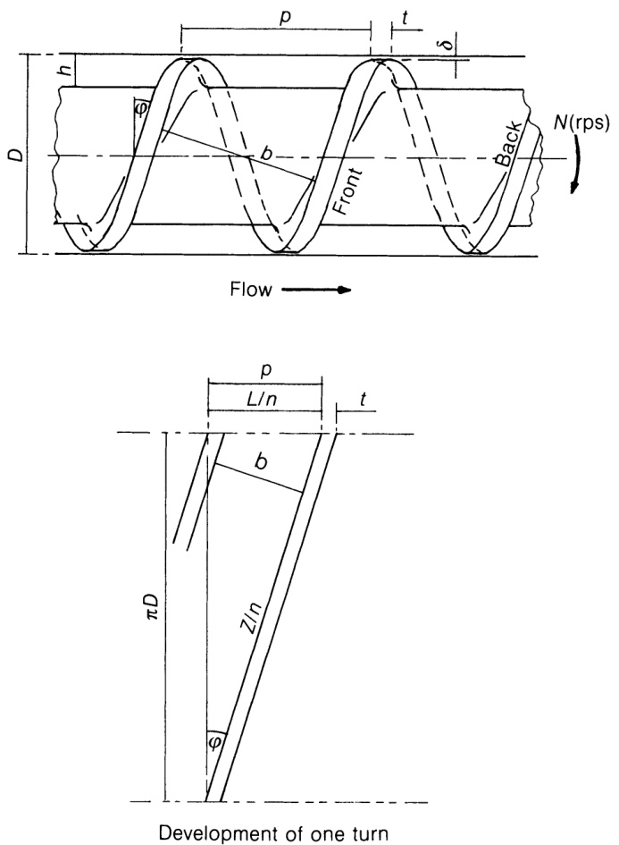  
Figure 6.1 Screw dimensions.  

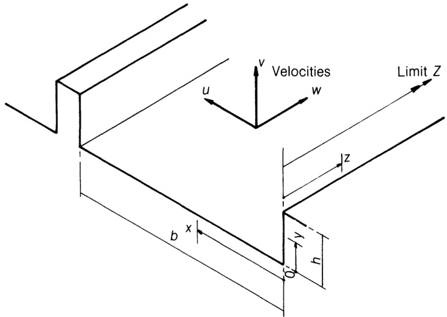  
Figure 6.2 Co-ordinate system for screw channel.  

2. The polymer is a homogeneous fluid, i.e. 'melt pumping? section only.   
3. The polymer adheres to the barrel and screw root surfaces, but not to the fight front and back (channel sides).   
4. Curvature is neglected, i.e. the helical channel is approximated by a straight channel of the same dimensions.   
5. The channel depth is small compared with the internal barrel diameter.   
6. Zero leakage flow. This is discussed in section 6.3.   
7. The melt is Newtonian, i.e. viscosity is a function of temperature, but not of shear rate or time.   
8. The flow is isothermal.   
9. Gravity is neglected.   
10. Initially the screw is treated as of constant depth. In differential form, the flow equation (6.15) may be applied to an elemental length of a screw of varying depth.  

Fenner (1970) has published an excellent study of the differences produced by several of these assumptions and has shown that, while they are important for exact design, in most usual cases they can be approximated by correction factors, and thus the effects on trends caused by changes of operating conditions are negligible. It is those trends in operation which are the chief concern ofthe present book, so that useful conclusions may still be drawn from a very simplified mathematical treatment. However, the validity of these assumptions will be reviewed wherever necessary (e.g. sections 6.6, 8.3 and 9.2).  

The author is greatly indebted to Weeks and Allen (1962) for the following analysis and that for power consumption in Chapter 8; however, he takes full responsibility for the deductions therefrom.  

# 6.2.3 Drag fow  

Assumptions 3, 4, 5 and 6 mean that flow in a straight channel may be further approximated as that between two parallel flat plates moving at an angle $\phi$ to each other (Fig. 6.3); for convenience the lower plate (screw) will be taken as stationary, so that velocities will be relative to the screw, not the barrel - this is obviously immaterial as far as axial components giving gross flow are concerned. Because viscosity is constant (assumptions 7 and 8) superposition of flows is valid and that due to relative motion of the plates is first considered in the absence of a pressure gradient. The velocity of the barrel relative to the screw is its circumference $\pi D$ times the speed $N$ ; barrel velocity equals $\pi D N$ and is at an angle $\phi$ to the screw channel. Since the polymer is assumed to adhere to the barrel and screw (assumption 3), its velocity at each limit will be the same as that ofthe adjacent solid surface,i.e. $\pi D N$ at the barrel and 0 at the screw. Resolving the barrel velocity along and across the screw channel:  

$$
W=\pi D N\cos\phi
$$  

$$
U=\pi D N\sin\phi
$$  

$W$ and $U$ being defined as in Fig. 6.2.  

Evidently only the along-channel component $W$ can cause a net flowfrom the extruder, although $U$ is important in creating a transverse circulation (equation (6.26)). This is a case of isothermal simple shear, and from equation  

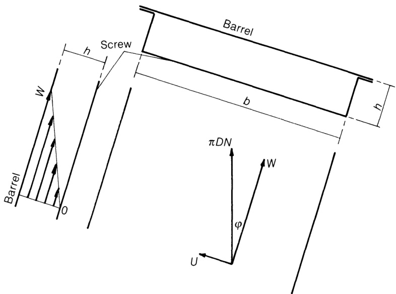  
Figure 6.3 Velocities in drag flow.  

(3.11) the shear rate $\dot{\gamma}$ will be uniform i.e.  

$$
\dot{\gamma}=\frac{w}{y}=\frac{W}{h}
$$  

giving the velocity distribution shown in Fig. 6.3. The along-channel flow ${\tt d}Q_{\tt D}$ in a layer $\pmb{b}$ wide and dy thick is:  

$$
\mathrm{d}Q_{\mathbf{D}}=w\boldsymbol{b}\cdot\mathbf{d}\boldsymbol{y}
$$  

and the total fow:  

$$
Q_{\mathrm{D}}=\int_{0}^{h}w b\,\mathrm{d}y=\int_{0}^{h}b\,{\frac{W}{h}}\,y\,\mathrm{d}y=\left[{\frac{W b y^{2}}{2h}}\right]_{0}^{h}
$$  

Since $^b$ is constant, $\textstyle\int_{0}^{h}w\,\mathbf{d}y$ is the area $W h/2$ under the plot of velocity against depth and:  

$$
Q_{\mathbf{D}}={\frac{W}{2}}\,b h
$$  

where $Q_{\mathbf{D}}$ is the volumetric fow due to relative motion of barrel and screw, called drag flow, and $W/2$ is the mean downchannel velocity. Substituting for $W$ gives:  

$$
Q_{\mathrm{D}}={\frac{\pi}{2}}\,D N b h\cos\phi
$$  

and substituting for $^b$ from equation (6.2):  

$$
Q_{\mathrm{D}}=\frac{\pi}{2}\,D N h(p-t)\cos^{2}\phi^{*}
$$  

# 6.2.4 Pressure fow  

To separate the effect of pressure, the screw is considered stationary, so that no drag flow takes place. Suppose a pressure is generated at the end of the screw by a separate pump (Fig. 6.4). At the same temperature (and viscosity) the fow through the die will remain the same as though the pressure were generated by the extruder. However, this pressure will also cause a flow backwards, i.e.  

\*As mentioned in section 6.2.1, Weeks and Allen (1962) define $t$ as helical flight width, such that equation(6.2)becomes  

$$
\boldsymbol{b}=p\cos\phi-\boldsymbol{t}
$$  

Several authors, including Fisher (1976), neglect the flight width $t$ sothat $b=\pi D\sin\phi$ leadsto a modification of equation (6.11).  

$$
Q_{D}=\frac{\pi^{2}}{2}D^{2}N h\,\sin\phi\,\cos\phi
$$  

The present book expresses equations for fow and power primarily in terms of channel width $^b$ as being more appropriate to performance considerations; any of the above definitions may thereforebeused.  

towards the feed section, in the screw, which behaves as a long die of rectangular cross-section( $[b\gg h$ , assumption 3). In Chapter 3 the pressure gradient in an ‘infinite' slit die $T$ wideby $H$ deepwasgivenby:  

$$
\frac{\mathbf{d}P}{\mathbf{d}L}\!=\!\frac{12\eta Q}{T H^{3}}
$$  

Substituting the screw dimensions and putting $Q=Q_{\mathbf{P}}$ for pressure flow:  

$$
\frac{\mathbf{d}P}{\mathbf{d}z}\!=\!\frac{12\eta Q_{\mathrm{P}}}{b h^{3}}
$$  

or rearranging:  

$$
Q_{\mathtt{P}}={\frac{b h^{3}}{12\eta}}\cdot{\frac{\mathrm{d}P}{\mathrm{d}z}}
$$  

Note that for a positive pressure gradient (pressure rising from feed section to die) the pressure flow is in the reverse direction, i.e. subtracts from the drag fow. The velocity distribution is parabolic (Fig. 3.8) as shown in Fig. 6.5.  

As mentioned on p.132 the assumption of Newtonian viscosity permits superposition of flows, i.e. the total volumetric flow $Q_{\mathrm{Tot}}$ isgivenby:  

$$
Q_{\mathrm{Tot}}=Q_{\mathbf{D}}-Q_{\mathbf{P}}-Q_{\mathbf{L}}
$$  

but by assumption 6, leakage flow $Q_{\mathrm{L}}$ is negligible (section 6.3) so substituting  

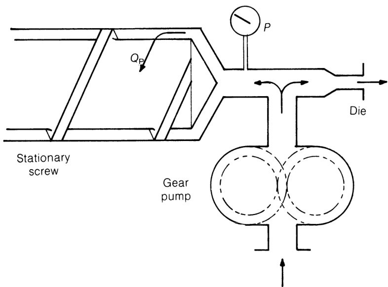  
Figure 6.4 Analogy for pressure (back) flow.  

equation (6.9) and (6.13):  

$$
Q_{\mathrm{Tot}}=Q_{\mathrm{D}}-Q_{\mathrm{P}}={\frac{W b h}{2}}-{\frac{b h^{3}}{12\eta}}\cdot{\frac{\mathrm{d}P}{\mathrm{d}z}}\,
$$  

The same result may be obtained by the more rigorous mathematical method given in appendix B.1 based on the Navier-Stokes equation of one-dimensional fow. This may also be written in dimensionless form:  

$$
\frac{Q_{\mathrm{Tot}}}{W b h}\!=\!\frac{1}{2}-\frac{h^{2}}{12\eta W}\!\cdot\!\frac{\mathrm{d}P}{\mathrm{d}z}
$$  

This dimensionless output, abbreviated to $Q/W b h$ ,is of great value both theoretically and practically in characterizing the operating condition of single-screw extruders and will be referred to in the following chapters.  

Some authors have used the ratio (minus) pressure flow/drag flow, which has the following relation to $Q/\pmb{W}b h$  

$$
{\frac{Q_{\mathrm{P}}}{Q_{\mathrm{D}}}}\!=\!{\frac{-(Q_{\mathrm{Tot}}-Q_{\mathrm{D}})}{Q_{\mathrm{D}}}}\!=\!1-{\frac{2Q}{W b h}}
$$  

and  

$$
\frac{Q}{W b h}\!=\!\frac{1}{2}\left(1-\frac{Q_{\mathrm{P}}}{Q_{\mathrm{D}}}\right)
$$  

i.e.  

$$
0<Q/W b h<\textstyle{\frac{1}{2}}\quad\mathrm{as}\quad1>Q_{\mathrm{P}}/Q_{\mathrm{D}}>0
$$  

and  

$$
\begin{array}{r}{\frac{1}{2}<Q/W b h<1\quad\mathrm{as}\quad0>Q_{\mathrm{P}}/Q_{\mathrm{D}}>-1}\end{array}
$$  

Referring to equation (6.15), by continuity $Q_{\mathrm{Tot}}$ mustbe approximately constant along the extruder, and therefore for a screw of constant channel Width $^b$ anddepth $\pmb{h}$  

$$
{\frac{\mathbf{d}P}{\mathbf{d}z}}={\mathrm{constant}}={\frac{P}{Z}}
$$  

i.e. the pressure rises uniformly along a constant depth screw and equation (6.15) may be rewritten:  

$$
Q_{\mathrm{Tot}}=\frac{W b h}{2}-\frac{b h^{3}}{12\eta}\cdot\frac{P}{Z}
$$  

where ${\cal Z}$ is the helical length of the melt pumping section and $P$ isthepressure rise over that length. Note that this is not valid for a screw of varying depth, whereas equations (6.15) and (6.16) are valid for an incremental length of such ascrew.  

The velocity at any point in the channel is given in appendix B.1 as:  

$$
w=\frac{W y}{h}+\frac{y^{2}-y h}{2\eta}\cdot\frac{\mathrm{d}P}{\mathrm{d}z}
$$  

and is the algebraic sum of the velocities due to drag and pressure flows. The net fow will be proportional to the algebraic sum of the areas under the velocity profiles. When ${\bf d}P/{\bf d}z=0$ , there is no change of pressure along the screw and no pressure flow (this is quite possible in a parallel'metering’ section if pressure is generated in the preceding tapered portion). Then the velocity profile will be as in Figs 6.3 and 6.6(d), all the flow will be positive and $Q/W b h=1/2$ If a small back pressure is now introduced, $\mathbf{d}P/\mathbf{d}z$ will be small and positive, causing a small (virtual) back flow represented by $-b h^{3}\,\mathrm{d}P/12\eta\,\mathrm{d}z$ , reducing the total flow, and hence $Q/W b h$ is now less than $1/2$ ; this is shown in Fig. 6.6(c). Note that the resultant velocity profile is no longer linear and its slope at the barrel $\mathrm{d}w/\mathrm{d}y_{(y=h)}=\dot{\gamma}_{\mathrm{wall}}$ the shear rate at the barrel wallis greater than in the corresponding drag flow (see also p.168). If $P$ and ${\bf d}P/{\bf d}z$ are further increased, output and $Q/W b h$ are further reduced and over part of the channel depth the resultant flow will be reversed, as in Fig. 6.6(b), partially offsetting the positive flow nearer the barrel wall. At some value of pressure, the positive and negative fows will be equal (Fig. 6.6(a)) giving zero net flow and $Q/W b h=0$ .This corresponds to a completely closed die and the pressure is the theoretical maximum achievable with the screw; in practice, shear heating due to ^churning' will modify this and the mechanism of melting will also be disturbed. If the pressure falls through this section of the screw, e.g. due to high pressure generation in an earlier portion of the screw, ${\bf d}P/{\bf d}z$ will be negative and the pressure fow will be towards the die, giving a total fow greater than that due to drag flow alone, and $Q/W b h>1/2$ as in Fig. 6.6(e). Note that the shear rate at the barrel wall is now reduced.  

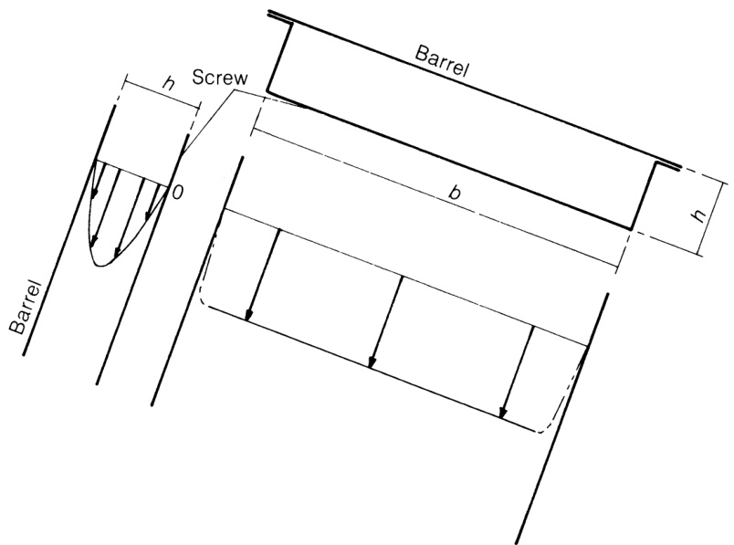  
Figure 6.5 Velocities in pressure flow.  

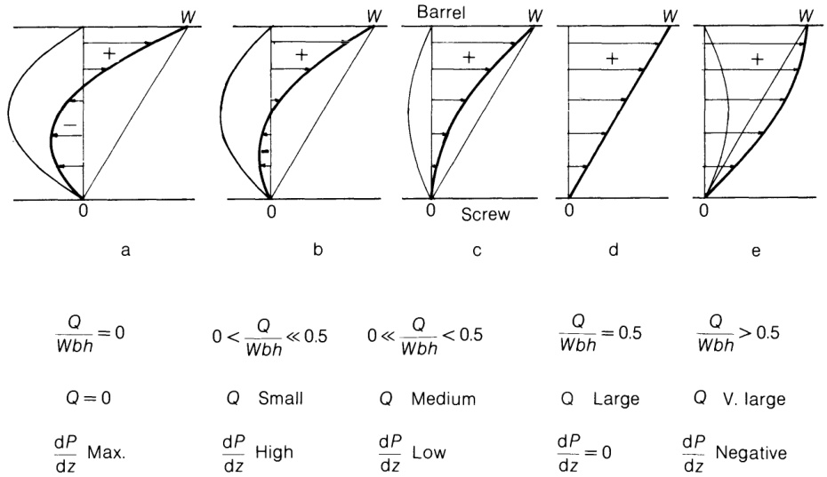  
Figure 6.6 Velocity profiles for several outputs and pressure gradients.  

The expression $Q/W b h$ is the ratio of the actual flow to that theoretically possible if the polymer moved as a plug with the barrel at velocity $W$ and slipped on the screw - like a solid nut prevented from rotating with the screw. It is therefore a kind of 'volumetric efficiency' and compared to the value $_{1/2}$ for drag flow gives an impression how much less (or greater) the actual flow is than at drag flow. More importantly, it indicates whether the pressure gradient in the screw is small $(Q/W b h$ slightlyless than $1/2_{_\cdot}$ )or large $(Q/W b h$ tending to zero) or even negative $(Q/W b h>1/2)$  

In practice it is difficult to envisage what is occurring within the screw, and even if a pressure gauge is fitted before the die, it does not indicate whether the pressure is seriously affecting the performance of the screw. The expression $Q/W b h$ can be determined in a particular operating condition if the screw dimensions are known. It is only necessary to measure accurately the screw speed(giving $W$ )and the output, e.g. by weighing and dividing by the density at the melt temperature to give the volumetric output $Q$ . The magnitude of $Q/W b h$ is therefore valuable as a first step in shop-floor troubleshooting - see example on p. 150.  

# 6.2.5 Transverse fow  

So far, only the longitudinal or downchannel component of velocity has been considered. The flow transverse to the channel has been analysed by Mohr, Saxton and Jepson (1957), starting from the Navier-Stokes equation (see appendixB.1):  

$$
\eta\,{\frac{\partial^{2}u}{\partial y^{2}}}+\eta\,{\frac{\partial^{2}u}{\partial z^{2}}}-{\frac{\partial P}{\partial x}}=0
$$  

and ignoring stagnation at the channel sides. In a channel of constant dimensions, the cross-channel component:  

$$
U=\pi D N\sin\phi
$$  

is independent of $\boldsymbol{z}$ and since the along-channel velocity distribution (Fig. 6.6) is also independent of $\boldsymbol{z}$ , it is reasonable to assume that $\partial u/\partial z=0$ throughout and hence $\partial^{2}u/\partial z^{2}=0$ . Eliminating this term and rearranging:  

$$
\eta\,{\frac{\partial^{2}u}{\partial y^{2}}}\!=\!{\frac{\partial P}{\partial x}}
$$  

Since viscosity $\eta$ is Newtonian and isothermal, integration gives:  

$$
u=\frac{1}{2\eta}\cdot\frac{\partial P}{\partial x}\left(y^{2}\right)+C y+D
$$  

But ${\pmb u}={\bf0}$ at $y=0$ , and $u=U$ at $y=h$ , therefore ${\cal D}=0$ and  

$$
C=\frac{U}{h}-\frac{1}{2\eta}\cdot\frac{\partial P}{\partial x}\cdot h
$$  

leading to:  

$$
u=\frac{U y}{h}+\frac{1}{2\eta}\cdot\frac{\partial P}{\partial x}\left(y^{2}-y h\right)
$$  

Note that this is of the same form as the along-channel velocity distribution, i.e. a ‘drag fow’ term due to the relative motion of the two surfaces and proportional to distance from the screw, followed by a parabolic term with the pressure gradient. This is shown diagrammatically in Fig. 6.7, which is similar to Fig. 6.6(a), the positive and negative areas being equal.  

The total transverse flow is given by:  

$$
\begin{array}{c}{{Q=\displaystyle\int_{0}^{h}u z\,{\mathrm{d}}y=\left[\frac{U}{h}\,\frac{z y^{2}}{2}\!+\!\frac{z}{2\eta}\!\cdot\!\frac{\partial P}{\partial x}\left(\frac{y^{3}}{3}\!-\!\frac{y^{2}h}{2}\right)\right]_{0}^{h}}}\\ {{=\displaystyle\frac{U z h}{2}\!-\!\frac{z h^{3}}{12\eta}\!\cdot\!\frac{\partial P}{\partial x}}}\end{array}
$$  

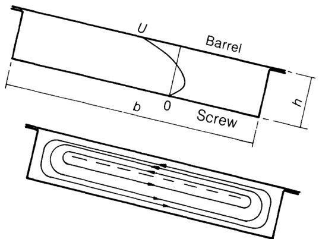  
Figure 6.7 Transverse velocity profile.  

But since leakage is assumed negligible, the transverse flow $Q$ mustbezero. Then:  

$$
\frac{U z h}{2}-\frac{z h^{3}}{12\eta}\cdot\frac{\partial P}{\partial x}=0
$$  

rearranging:  

$$
{\frac{\partial P}{\partial x}}\!=\!{\frac{6\eta U}{h^{2}}}
$$  

or:  

$$
\frac{1}{2\eta}\cdot\frac{\partial P}{\partial x}\!=\!\frac{3U}{h^{2}}
$$  

Substituting equation (6.24) in (6.23):  

$$
u=\frac{U y}{h}\left(\frac{3y}{h}-2\right)
$$  

giving the velocity at any point independent of the transverse pressure gradient.  

In practice the flow near the barrel wall, leftwards in Fig. 6.7, must go down the front of the flight (inwards) to return, rightwards in Fig. 6.7, nearer the screw. The circulation is completed by a flow upwards at the back of the next flight (outwards). The foregoing analysis refers to the central portion of the channel where the radial component is negligible, in accord with assumption 3 that the channel is wide relative to its depth. The implications of this transverse flow for leakage, power and mixing will be discussed in sections 6.3, 8.2 and 9.1, respectively.  

The longitudinal and transverse velocities in the channel combine to form a complex flow pattern which may perhaps best be described as an oblique helix, which itself is centred on the helix described by the channel--a sort of ‘coiled coil'.  

When the die is closed and there is zero net fow $Q=0$ , and substituting in equation (6.15) gives:  

$$
\frac{\mathbf{d}P}{\mathbf{d}z}\!=\!\frac{6\eta W}{h^{2}}
$$  

When this is substituted in equation (B.8), the latter gives the downstream velocity:  

$$
w={\frac{W y}{h}}\left({\frac{3y}{h}}-2\right)\qquad(Q=0~~\mathrm{only})
$$  

which is of identical form to equation (6.26), $U$ being replaced by $W$ .Butby equations (6.4) and (6.5) these are, respectively, $\pi D N$ sin $\phi$ and $\pi D N\cos\phi$ these vectors may be combined to give:  

$$
\mathrm{total~velocity}=\pi D N\,{\frac{y}{h}}\,\left({\frac{3y}{h}}-2\right)\qquad(Q=0\ \ \mathrm{only})
$$  

in a plane normal to the screw axis, as shown diagrammatically in Fig. 6.8(a).  

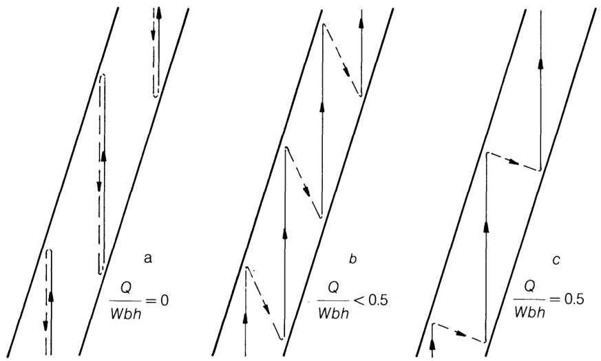  
Figure 6.8 Flow patterns in screw channel (only extreme elements shown).  

When the die is opened and flow commences, the transverse circulation remains but the longitudinal profile changes as shown in Figs 6.6(b)-6.6(d), giving a resultant as in Figs 6.8(b) and 6.8(c). These flow patterns have been experimentally confirmed by Eccher and Valentinotti (1958) and Kennaway (1957), the latter producing a ciné film of a transparent model with solid tracer particles in the fuid. Bernhardt (1959) gives more a precise representation by means of a flagpole' diagram showing the changing magnitude and directions of the total velocity vector. For pseudoplastic or other non-Newtonian fluids, where viscosityis dependent on the total shear in all directions, thelongitudinal and transverse flows are interdependent through their effects on viscosity, and superposition of the components is no longer valid. In the same way drag and pressure flows cannot be superimposed, but this will be reconsidered in section6.7.  

# 6.3 LEAKAGE FLOW  

This treatment is not exhaustive and is included in order to show the order of magnitude of leakage and the factors on which it depends. Approximate equations for the leakage flows are derived in appendix B.2 and expressed as fractions of the corresponding channel flows. Due to differences in the assumptions made, the expressions in appendix B.2 differ somewhat from those of other authors (Fisher, 1976; McKelvey, 1962; Bernhardt, 1959); these differences are of less importance than the conclusion that in most practical cases neglect of leakage flow is of less consequence than approximations inherent in the calculation of channel flow. Note that, as shown in section 8.4, it cannot be ignored in power consumption.  

Leakage flow in the melt pumping section arises from two causes: the relative motion of screw flight and barrel; and the pressure difference (if any) between the two faces of the flight due to pressure gradients along and across the screw channel. The first is of the form of a drag fow, the polymer being sheared between two parallel faces so that part is carried along with the screw and part retained on the barrel surface.  

As an example, using the results of appendix B.2, consider the following typicalvalues:  

Pitch $\pmb{p=}$ Diameter $D$ hence $\phi=17^{\circ}\,40^{\prime}$   
Flight width $t=0.1D$ hence $b=0.858D$   
Channel depth $h=0.05D$ (low value taken to maximize proportionate   
leakage)   
Flight clearance $=0.0015D$ (high value taken to maximize leakage)  

Substituting in equation (B.20) gives:  

$$
Q_{\mathrm{DL}}/Q_{\mathrm{D}}=0.0367\ \mathrm{or}\ 3_{\frac{2}{3}}^{20\%}\ \mathrm{per\turn}
$$  

and in equations (B.25) and (6.13) gives:  

$$
Q_{\mathrm{PL}}/Q_{\mathrm{P}}=0.003\,26~\mathrm{or}~\frac{1}{3}\%~\mathrm{per~turn}
$$  

To estimate the effect of transverse pressure gradient, further assumptions are necessary,e.g.  

Diameter $D=0.1\,\mathrm{m}$ $100\,\mathrm{mm}$ 0r 4 in screw)   
Viscosity $=10^{3}\,\mathrm{N\,s\,m}^{-2}$ $10^{4}$ poise)   
Pressure gradient $\mathrm{d}P/\mathrm{d}z=20\,\mathrm{MNm}^{-2}$ per metre $(73.61\mathfrak{b}/\mathrm{in}^{2}$ per inch)   
Speed $N=1$ rps  

Then from equations (B.29) and (6.13):  

$$
Q_{\mathrm{PL}}^{\prime}/Q_{\mathrm{P}}=0.001\,07~\mathrm{or}~0.1\%~\mathrm{per~turn}
$$  

and from equation (B.30):  

$$
\frac{Q_{\mathrm{PL}}+Q_{\mathrm{PL}}^{\prime}}{Q_{\mathrm{P}}}=0.004\,33~\mathrm{or}~0.43\,\%\ \mathrm{per\turn}
$$  

This pressure term of course only approximates that for a real machine, since local increases in shear rate and temperature will increase the leakage flow as a proportion ofchannel pressure flow, whereas the drag term (equation (B.20)) is scarcely affected. Note that the leakages are expressed ‘per turn’ since the leakage in successive turns is primarily in series and only to a limited extent in parallel, i.e. the output of a ten-turn screw would not be reduced by $35\%$ dueto drag flow leakage.  

Since for a positive output $Q_{\mathbf{P}}\neq Q_{\mathbf{D}}$ , the above example shows that in the usual case the drag fow element of leakage is the dominant factor. Analysing the effect of variables on leakage flow, equation (B.19) shows that the leakage drag flow is proportional to the flight clearance $\delta$ , the screw speed $N$ and the square of the screw diameter $\pmb{D}$ .Further, equation (B.20) shows that for a screw of constant helix angle $\phi$ (so that $(p-t)/D$ is constant), as a proportion of the channel drag fow, the leakage drag flow is proportional to $\delta$ ,inversely proportional to the channel depth $h_{i}$ , and independent of screw speed and diameter. Thus, as a screw wears in service, the leakage increases approximately linearly in proportion to the clearance, but will be proportionately larger for a shallow screw. As with channel drag flow (equation (6.11) and discussion on p. 143), the leakage drag fow given by this analysis is independent of fuid viscosity, and hence of increased shear rate over the flight and consequent local shear heating. Equations (B.25) and (B.29) show that for a screw of constant helix angle $\phi$ $(t\propto D)$ the (minor) leakage flows due to pressure differences are proportional to the diameter $\pmb{D}$ and to $\delta^{3}$ .Equation (B.30) shows that, as a proportion of the channel pressure flow, the term which is due to the longitudinal pressure gradient is dependent only on $\left(\delta/h\right)^{3}$ ， whereas that due to the transverse gradient is more complex as there is no simple relation between longitudinal and transverse pressure gradientshowever, it is still proportional to $\delta^{3}$ . The overall implication for operation is that the effect of leakage on output at low back pressures is small and broadly independent of speed and diameter, is proportional to fight clearance and proportionately greater for shallow screws (equation (B.20)); however, as back pressure is increased, the effect of clearance (wear) on the pressure terms dominates. In other words, at high back pressures, a severely worn screw will rapidly lose output, or have to turn faster to generate high pressures at the same output. The implications of leakage for energy consumption and heat generation will be discussed in section 8.2.  

# 6.4 OUTPUT EQUATIONS ANDLONGITUDINAL PRESSURE PROFILESFORCOMMONSCREWTYPES  

# 6.4.1 Analysis of variables  

First the variables in the equation for parallel (constant-depth) screws will be analysed. The volumetric fow equation (6.15) consists of two terms representing the drag and pressure flows, respectively. The first is given by equation (6.9) or (6.11); for geometric similarity, helix angle is constant and $p,t$ and $^b$ (equation (6.2)) are all proportional to $\pmb{D}$ ,so:  

$$
Q_{\mathbf{D}}\propto D^{2}N h
$$  

i.e. drag flow is proportional to speed $N$ and channeldepth $h$ andtothesquare of diameter $_{D}$ . Drag flow can be increased by increasing screw speed and/or using a deeper screw. The effect of changing screw diameter will be considered in section 11.5. Volumetric drag fow is also independent of the fuid properties, including viscosity, of the polymer melt; the mass drag fow will therefore be proportional to the polymer melt density and decrease only slightly due to thermal expansion with increase in temperature.  

Note that since the dimensionless output $Q/W b h$ represents the ratio of actual output to (twice) the drag flow, for a constant value of $Q/W b h$ the actualoutput $Q_{\mathrm{Tot}}$ will follow the same relationships as drag flow. The second term, representing the (negative) pressure flow, is given by equation (6.13). For geometric similarity $\left(b\propto D\right)$ , the pressure flow is proportional to screw diameter and pressure gradient and the cube of channel depth, but inversely proportional to melt viscosity. Thus the loss of output is proportional to the pressure gradient, but increases very rapidly with increase in channel depth, resulting in a relatively low output from deep screws at high back pressures (see Fig. 6.16). The effect of viscosity is that the loss of output with increasing back pressure will be greater for low-viscosity melts, e.g. due to high melt temperature or low intrinsic viscosity such as with nylons or low molecular weight polymers. The effect of shear rate, e.g. due to high screw speeds, must also be considered for pseudoplastic melts (section 6.7).  

Longitudinal pressure gradients for various screw geometries will be considered later in this section, but the complicated effects of variables can be simplified by use of the dimensionless output $Q/W b h$ . It is therefore worth examining the relationship between $Q/W b h$ and the other variables in equation (6.13). It has already been seen (p. 136) that an increase in (positive) pressure gradient leads to a decrease in $Q/W b h$ from $_{1/2}$ towards zero, while a negative pressure gradient corresponds to $Q/W b h>1/2$ . Equation (6.16) shows that if other factors are constant, a constant value of $Q/W b h$ corresponds to a constant pressure gradient. However, substituting equation (6.4) for $W$ gives:  

$$
\frac{Q_{\mathrm{Tot}}}{W b h}\!=\!\frac{1}{2}\!-\!\,\frac{h^{2}}{12\eta\pi D N\cos\phi}\!\cdot\!\frac{\mathrm{d}P}{\mathrm{d}z}
$$  

or for constant $Q/W b h$  

$$
\frac{\mathsf{d}P}{\mathsf{d}z}\propto\frac{\eta D N\cos\phi}{h^{2}}
$$  

Thus for constant $Q/W b h$ and helix angle $\phi,\mathbf{d}P/\mathbf{d}z$ will increase linearly with viscosity $\pmb{\eta}_{\mathrm{:}}$ , screw diameter $D$ and speed $N$ but decrease as the square of channel depth $h_{\ast}$ . In other words, a constant value of $Q/W b h$ implies an increase of pressure gradient for a high-viscosity polymer and a large or fast-running screw, but a substantial reduction for a deep screw. Thus an increase in temperature, reducing viscosity, implies a reduction in pressure gradient, while an increase in shear rate $\mathbf{\nabla}W/h$ in equation (6.16)) implies an increase in pressure gradient. Alternatively, for a constant pressure gradient, $Q/W b h$ can only be held constant by adjusting the factors on the right-hand side of equation (6.32), e.g. if it is required to compare the performance of the same screw at the same pressure gradient, this can be done at constant $Q/W b h$ if a reduction in viscosity (due to temperature increase) is compensated by a proportionalincrease in screw speed. This, and other, operating characteristics of a melt pumping section will be discussed in section 6.5 and Chapter 9. The foregoing analysis is in terms of pressure gradient; the relationships to pressure at the end of the screw are covered in section 6.5.1.  

# 6.4.2 Constant-depth screw  

The longitudinal pressure profiles for a constant-depth screw will now be derived. In the usual case, mass fow must be constant at all points along the length of the screw. Exceptions occur with additive injection, extraction and some multiscrew arrangements. Thus, except for variations in density due to pressure, temperature or chemical reaction, the volumetric flow will also be constant along the melt pumping section. Equation (6.15) shows that for an isothermal Newtonian fuid in a screw of constant speed $N$ and dimensions $D$ and $^b$ , the channel depth $h$ and pressure gradient ${\bf d}P/{\bf d}z$ are uniquely related. Thus in a parallel screw (constant $\boldsymbol{h}$ ${\bf d}P/{\bf d}z$ will be constant along the length of the melt pumping section and equal to $P/Z$ (equation (6.19), where $P$ is the total pressure increase and $Z$ the helical length of the melt pumping section; $Z=L/\sin\phi$ (equation (6.1)), where $L$ is the axial length. Equation (6.20) applies and may be rearranged in the form:  

$$
P=\frac{12\eta W Z}{h^{2}}\left(\frac{1}{2}-\frac{Q}{W b h}\right)
$$  

or:  

$$
P=K_{1}\left(\frac{1}{2}-\frac{Q}{W b h}\right)
$$  

where:  

$$
K_{1}=\frac{12\eta W Z}{h^{2}}
$$  

The pressure profile is therefore a straight line as shown in terms of axial length in Fig. 6.9. It is assumed in Fig. 6.9 that the ^gel point' is fixed -see section 6.6 for corrections. As the die pressure is increased, ${\bf d}P/{\bf d}z$ must increase and equation (6.15) and (6.16) show $Q$ and $Q/W b h$ must decrease. In the limit, the output $Q$ and $Q/W b h$ are zero, and rearranging equation  

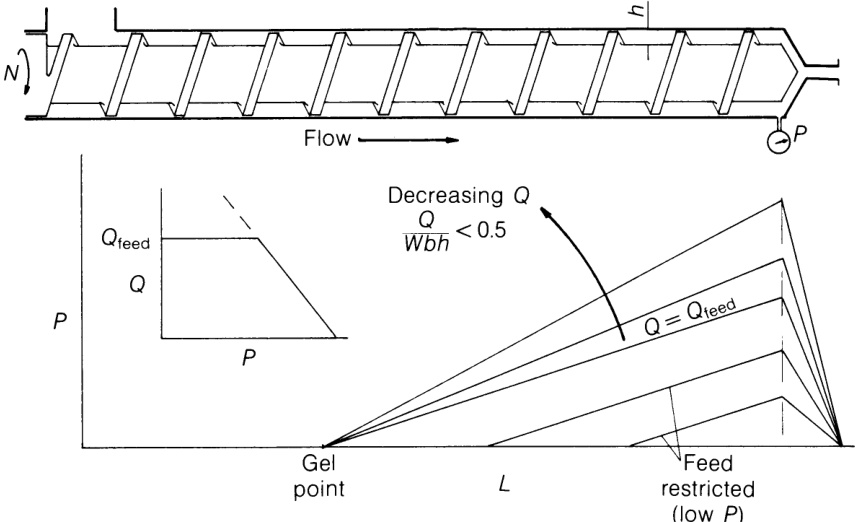  
Figure 6.9 Pressure profiles: parallel screw.  

(6.16) gives:  

$$
\frac{\mathrm{d}P}{\mathrm{d}z}\!=\!\frac{6\eta W}{h^{2}}
$$  

or:  

$$
P={\frac{6\eta W L}{h^{2}\sin\phi}}
$$  

which represents the maximum gradient and pressure this screw can deliver -- but see p. 136 for practical limitations. If the pressure is reduced, e.g. by opening the die, ${\bf d}P/{\bf d}z$ will decrease and output $Q$ will increase. In practice, before the die pressure falls to zero, other factors are likely to limit output. The most obvious is the solids feeding and conveying capacity of the feed hopper and screw, which is largely independent of die pressure, and will limit further increase in output rate. Then, as die pressure is further decreased, output remains constant and equation (6.20) can only be satisfied by decreasing $Z$ thus ${\bf d}P/{\bf d}z$ remains constant but pressure commences to rise further along the screw, implying that up to this point the screw is only partially filled - see p. 166. At low back pressures, melting will be mainly by conduction and the screw is likely to deliver largely unmolten polymer. The condition of zero pressure gradient, when $Q/W b h=1/2$ , is thus unlikely to be achieved by a constantdepth solid-fed screw. It is, however, perfectly possible for a melt-fed screw (in which the effective length is from the front face of the feed opening, where pressure can commence to rise) to operate with either a uniformly increasing pressure along its length or a zero change of pressure. If fed under pressure, a melt-fed screw may also suffer a uniform decrease of pressure, when $Q/W b h>1/2$ . The same possibilities exist with a constant-depth section within a compound screw; the result that there is no change of pressure along that section when $Q/W b h=1/2$ is extremely important, especially for a compound screw with a parallel (constant-depth) 'metering? section. Limitations on practical output will be discussed in section 6.6.  

# 6.4.3 Double-parallel (stepped) screw  

The merits of a double-parallel or stepped screw (often called a 'nylon’ screw) are discussed in section 9.4. Assuming $D,p,t,\phi,b$ , etc., are similar in the two sections, equation (6.20) may be applied separately to the each section:  

$$
Q_{1}=\frac{W b h_{1}}{2}-\frac{b h_{1}^{3}}{12\eta}\cdot\frac{P_{1}}{Z_{1}}
$$  

and  

$$
Q_{2}=\frac{W b h_{2}}{2}-\frac{b h_{2}^{3}}{12\eta}\cdot\frac{P_{2}}{Z_{2}}
$$  

But by continuity,  

$$
Q_{1}=Q_{2}
$$  

and  

$$
P_{1}+P_{2}=P
$$  

An alternative equation, eliminating $P_{1}$ and $P_{2}$ , is given in appendix B.3. As for the parallel screw, the pressure gradient within each section will be constant, but generally different in the two sections. Starting from the die pressure at which $Q/W b h_{2}=1/2,$ $P_{2}$ will be zero and $P_{1}=P$ ,i.e. the total pressure is raised in the first section. If, as is usual, $h_{1}>h_{2}$ ， then $Q/W b h_{1}<1/2,$ indicating a positive pressure gradient in the first section; this is illustrated in Fig. 6.10. If the die pressure is now increased, output $Q$ will decrease (equation (B.31)) and both $Q/W b h_{2}$ and $Q/W b h_{1}$ will be less than $_{1/2}$ ; however, it is always the case that $Q/W b h_{1}<Q/W b h_{2}$ $(Q\neq0)$ . Thus pressure will rise throughout the melt pumping section, with a step change in gradient (but not pressure) at the change of channel depth. Ultimately, a die pressure will be reached at which output is zero, so that $Q/W b h_{2}$ and $Q/W b h_{1}$ are also zero, representing the maximum pressure achievable with the screw. It will be noted that for the usual ratios of depths $h_{1}/h_{2},\,Q/W b h_{1}$ will be much less than $Q/W b h_{2}$ ; however, the cubic term in equations (B.31) and (B.33) dominates, and except at values of $Q/W b h_{2}$ only slightly less than $1/2,\mathrm{d}P_{2}/\mathrm{d}z_{2}$ is greater than ${\bf d}P_{1}/{\bf d}z_{1}$ . The relative magnitudes of the pressure gradients are further examined in appendix B.4, which shows, e.g. for $h_{1}/h_{2}=3$ ， ${\bf d}P_{2}/{\bf d}z_{2}>$ $\mathbf{d}P_{1}/\mathbf{d}z_{1}$ , for all values of $Q/W b h_{2}<0.46,$ when $Q/W b h_{1}\simeq0.15$ At this condition ${\bf d}P_{1}/{\bf d}z_{1}$ is only $4\%$ greater than at $Q/W b h_{2}=0.5.$ This means that unless the second section $L_{2}$ is very short, most of the pressure is raised in the second section of the screw; however, this is not the case when $Q/W b h_{2}>1/2$ When die pressure is reduced below that at which $Q/W b h_{2}=1/2$ , output increases so that $Q/W b h_{2}>1/2$ and ${\bf d}P_{2}/{\bf d}z_{2}$ is negative, i.e. pressure falls along the second section. However, $Q/W b h_{1}$ remains less than $_{1/2}$ and pressure rises in the first section. The maximum output is achieved when pressure at the end of the screw is zero, i.e. the rise in pressure in the first section is exactly balanced by the fall in the second section. Since in this condition there is resistance to the forward movement through the melting section and output is to some extent limited by the melt pumping section, melting by mechanical shearing can take place. It is thus possible for a stepped screw to operate satisfactorily with low or zero die pressure, especially with a high compression ratio (large $h_{1}/h_{2})$ or large $L_{2}/L_{1}$ ; this can be of use where there is little or no die resistance as in thick tube and section extrusion, or in flow moulding. In effect the second screw section becomes a resistance equivalent to a die, in which melt is forced through it at a greater rate than its own natural pumping rate (when $Q/W b h_{2}=1/2)$ . A further increase in output would imply a negative die pressure, where the pressure rise in the first section was insufficient to overcome the ‘resistance' of the second section, and evidently $Q/W b h_{1}$ cannot reach a value of 0.5. Screws having the second section deeper than the first $(h_{1}/h_{2}<1)$ have been proposed; in this case the pressure profiles are transposed; at high die pressures, pressure will rise rapidly in the first section and more gradually in the second, whereas at low die pressures, pressure in the first section may be constant zero or even negative, and rise in the second section to a zero or positive value.  

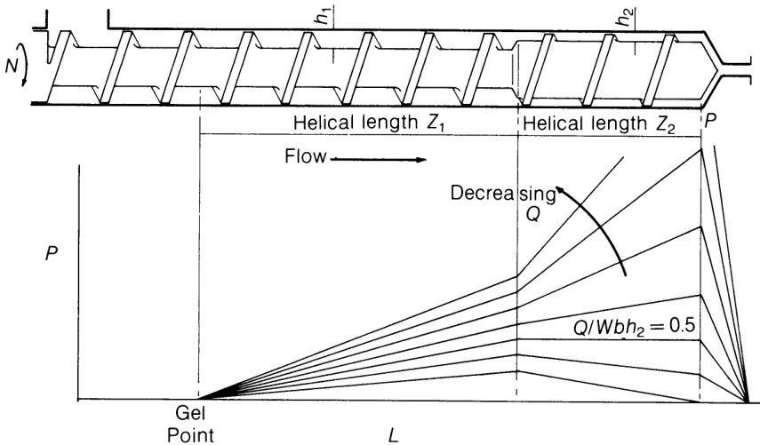  
Figure 6.10 Pressure profiles: stepped screw.  

# 6.4.4 Taper and taper-parallel screws  

Similar features are to be found with screws having a gradual taper (continuous decrease in $h$ ), with or without a parallel section following without a step. In this case the channel depth is assumed to decrease uniformly from $h_{1}$ at the commencement of pressure rise over a helicallength $Z_{1}$ to $h_{2}$ at the die or start of the parallel section of depth $h_{2}$ and helical length $Z_{2}$ . Note that in this case, if the point at which pressure commences to rise changes in a real screw, both $Z_{1}$ and $h_{1}$ will also change, though the taper angle $\theta$ remains constant. Equation (6.15) may be applied to any small element of length $\mathtt{d}z$ of the first (tapered) section and rearranged as:  

$$
\frac{\mathrm{d}P}{\mathrm{d}z}\!=\!\frac{12\eta W}{h^{2}}\left(\frac{1}{2}\!-\!\frac{Q}{W b h}\right)
$$  

and integrated between the limits $h=h_{1}$ at $z=0$ ,and $h=h_{2}$ at $z=Z_{1}$ rememberingthat $Q$ is constant and fora constant pitch screw $W$ and $^b$ are also constant. The detailed derivation in appendix B.3 yields the pressure rise in the first section $P_{1}$ given by:  

$$
P_{1}=\frac{6\eta W Z_{1}}{h_{1}h_{2}}\left(1-\frac{Q}{W b h_{2}}\cdot\frac{h_{1}+h_{2}}{h_{1}}\right)
$$  

Equation (6.20) may then be rearranged and applied to the parallel section (if any):  

$$
P_{2}=\frac{6\eta W Z_{2}}{h_{2}^{2}}\left(1-\frac{2Q}{W b h_{2}}\right)
$$  

and combined with equation (6.43), remembering that $Q_{1}=Q_{2}$ and $P=P_{1}+P_{2}$  

$$
P=\frac{6\eta W Z_{1}}{h_{1}h_{2}}\left(1-\frac{Q}{W b h_{2}}\cdot\frac{h_{1}+h_{2}}{h_{1}}\right)+\frac{6\eta W Z_{2}}{h_{2}^{2}}\left(1-\frac{2Q}{W b h_{2}}\right)
$$  

If $Q/W b h_{2}=1/2$ , then the second term in equation (6.45) is zero (no pressure rise in the parallel section) and since $h_{2}/h_{1}<1$ both equations (6.43) and (6.45) give $P_{1}$ positive. Since $h_{1}>h>h_{2}$ , the differential form of equation (6.42) shows that ${\bf d}P/{\bf d}z$ at all points in the first section is positive, though tending to zero as $h\rightarrow h_{2}$ . To complete the pressure profile it is necessary to examine the trend of the pressure gradient. Differentiating equation (6.42) gives:  

$$
\frac{\mathrm{d}^{2}P}{\mathrm{d}z^{2}}=-\left(\frac{-12\eta W}{h^{3}}+\frac{36\eta Q}{b h^{4}}\right)\left(\frac{h_{1}-h_{2}}{Z_{1}}\right)
$$  

A point of inflexion occurs when $\mathsf{d}^{2}P/\mathsf{d}z^{2}=0$ or:  

$$
\frac{Q}{W b h}\!=\!\frac{1}{3}
$$  

Thus the pressure profile for $Q/W b h_{2}=1/2$ is as shown in Fig. 6.11, but note that the point of inflexion is independent of the value of $Q/W b h_{2}$ and occurs at all values of the latter greater than $1/3$ . As die pressure is increased, the pressure gradient ${\bf d}P/{\bf d}z$ increases at each point along the length of the screw, and output $Q$ decreases, giving a corresponding decrease in $Q/W b h$ at each point. At high die pressures giving values of $Q/W b h_{2}$ less than $1/3$ , the pressure gradient increases continuously along the taper section so that the major portion of the pressure rise is contributed by the later, shallower portion of the screw. Since there is no step change in $h$ at the end of the taper, there is no change in $Q/W b h$ and ${\bf d}P/{\bf d}z$ , so that at all die pressures the pressure profile in the parallel section (if any) is a straight line tangential at that point to the curve in the taper section. If there is a parallel section of substantial length then at high die pressures this section will contribute the major portion of the pressure rise, in which case the output/pressure relation will be similar to that of a simple parallel screw of the same depth and slightly greater length than the parallel 'metering′ section, i.e. the first term in equation (6.45) can be neglected in favour of a small increase in $Z_{2}$ in the second term. If the die pressure is low so that $Q/W b h_{2}$ is greater than $_{1/2}$ , pressure will fall at the end of the taper section and in the parallel section, if present. Thus a maximum pressure will occur at some point within the taper at which $Q/W b h=1/2$ . This point, and that at which the point of infexion occurs $(Q/W b h=1/3)$ , will move back towards the feed end as die pressure is reduced and output increased; a greater proportion of the pressure is raised in the earlier portion of the taper, which becomes more significant in determining the output for a given die pressure. As with the stepped screw, maximum output occurs at zero die pressure, and since positive pressure is generated within the screw, this type also may operate satisfactorily with low or zero die pressure.  

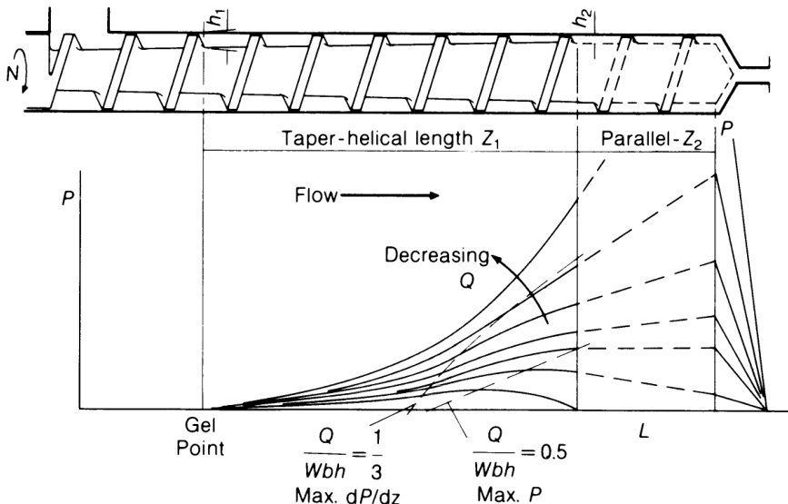  
Figure 6.11 Pressure profiles: taper and taper-parallel screw.  

An industrial example illustrates the higher pressures possible within a screw than at the die and the significance of the ratio $Q/W b h$ in understanding the conditions within the screw. A $200\,\mathrm{mm}\,(8\,\mathrm{in})$ diameter solid-fed extruder had a taper-parallel screw with pitch and diameter equal $(\phi=17^{\circ}36^{\prime})$ , total length 24 diameters and a metering section depth of $5.59\,\mathrm{mm}\,(0.22\,\mathrm{in})$ .At $60\,\mathrm{rpm}$ it gave an output of $1091\,\mathbf{kg}\,\mathbf{h}^{-1}(2400\,\mathbf{lb}/\mathbf{h})$ of LD polyethylene with a die pressure of only $13.8\,\mathbf{M}\mathbf{N}\mathbf{m}^{-2}$ $(20001\mathbf{b}/\mathrm{in}^{2})$ . Trouble was experienced with granulation due to the high melt temperature and the drive motor tended to be overloaded. With a melt density of approximately $760\,\mathbf{kg}\,\mathbf{m}^{-3}$ $(47.41\mathfrak{b}/\mathfrak{f t}^{3})$ ， $Q/W b h_{2}$ was calculated as 0.672 showing that pressure was falling in the parallel metering section; this only required knowledge of the screw dimensions, speed and output-see p. 137. When a pressure gauge was fitted half way along the metering section it registered $55.2\,\mathrm{MNm}^{-2}$ $(80001\mathsf{b}/\mathsf{i n}^{2})$ , indicating a pressure at the start of the metering section of $96.6\,\mathbf{MNm}^{-2}$ $(14\;000\,16/\mathrm{in}^{2})$ . As shown by Fig. 6.11 the maximum pressure would be even greater. The immediate remedy was to reduce speed, reducing shear heating and pressures (equation (6.44) and die equation) and increase barrel temperatures to reduce power input and pressures through reduction in viscosity (equations (8.9) and (6.44), respectively). A lower output, of course, resulted, but it was judged preferable to continue making good product at low rate, rather than make scrap at high rate, until a screw of different profile could be obtained!  

Some authors, e.g. Bernhardt (1959), have identified the value $Q/W b h=$ $1/3$ with some form of optimum design. Figure 6.11 shows that for tapered screws it represents neither the maximum output nor maximum pressure, only the position of the point of inflexion in the pressure curve and the maximum value of the pressure gradient. For a constant-depth screw, rearranging equation (6.20)in the form ofequation (6.33) and differentiating $P$ withrespect to $\pmb{h}$ ,treating $Z$ and $Q$ as constant, gives:  

$$
\frac{{\mathrm{d}}P}{{\mathrm{d}}h}\,{=}\,\frac{-12\eta W Z}{h^{3}}\,{+}\,\frac{36\eta Z Q}{b h^{4}}
$$  

and:  

$$
\frac{\mathrm{d}^{2}P}{\mathrm{d}h^{2}}\,{=}\,\frac{\,+36\eta W Z}{h^{4}}\,{-}\,\frac{144\eta Z Q}{b h^{5}}
$$  

but ${\sf d}P/{\sf d}h=0$ when $Q/W b h=1/3$ and then ${\bf d}^{2}P/{\bf d}h^{2}$ is negative, indicating a maximum value of $P$ . Thus the corresponding (constant) depth $h$ of screw will give the maximum pressure for given values of output and speed; as shown by comparing equations (B.32) and (B.39) with (6.33), this is approximately true for variable-depth screws at high back pressure. However, to the present author, this seems of doubtful value, since in practice the pressure required is determined by the type of die used and output is limited by considerations of energy, mixing and stability, as will be discussed later in Chapters 9 and 11.  

The foregoing shows the pressure profiles along several common types of screw and their changes with output and back pressure. These can be extended to other screw types, but increasingly complex output/pressure equations can better be solved by use of graphical representations.  

# 6.5GRAPHICAL REPRESENTATION OFOUTPUT FOR SCREW/DIE COMBINATIONS, INCLUDING VENTING  

# 6.5.1 Graphical representation  

From equation (6.9)it is seen that the drag flow is proportional to $W$ and hence to screw speed $N$ (equation (6.11)). Equation (6.13) shows that the pressure gradient ${\bf d}P/{\bf d}z$ , and hence pressure, is independent of screw speed for a Newtonian fluid. Thus at constant pressure, output $Q$ is linear with $N$ (equation (6.20)) being the proportional drag fow minus a constant pressure flow of the form:  

$$
Q_{\mathrm{Tot}}=A N-\frac{B P}{\eta}
$$  

where:  

$$
A={\frac{\pi}{2}}\,D b h\cos\phi
$$  

(from equation (6.10)) and:  

$$
B={\frac{b h^{3}}{12Z}}
$$  

(from equation (6.20)). Thus output versus speed is represented in Fig. 6.12 by a series of parallel straight lines for various back pressures. Equation (6.50) shows that as temperature increases, causing a decrease in viscosity $\eta$ the pressureflow $Q_{\mathbf{P}}$ will increase and the total output decrease for a given speed, as shown by the dashed lines for constant pressure and increasing temperature. Of more practical interest is the variation of output with speed for the combination of extruder and a fixed die. From equation (3.22), the $Q/P$ relation for a die of fixed geometry is:  

$$
Q_{\mathrm{Die}}=\frac{K P}{\eta}
$$  

where:  

$$
K=\frac{\pi R^{4}}{8L}
$$  

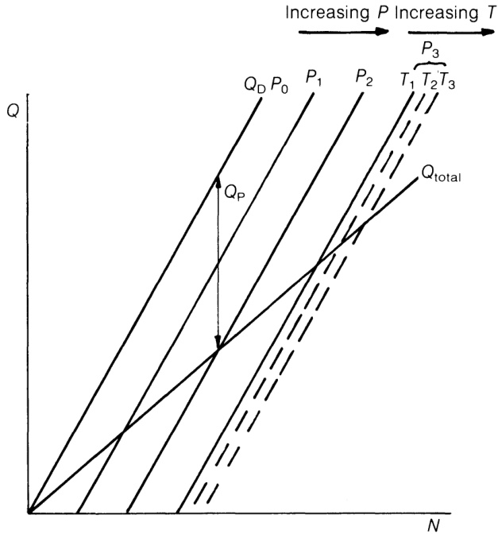  
Figure 6.12 Total output vs speed.  

for a capillary of radius $R$ and length $L$ or:  

$$
K=\frac{T H^{3}}{12L}
$$  

for an “infinite’ slit of width $T$ and depth $H$ . But by continuity:  

$$
Q_{\mathrm{Tot}}=Q_{\mathrm{Die}}
$$  

Combining equations (6.53) and (6.56) and rearranging:  

$$
P=\frac{\eta Q_{\mathrm{Tot}}}{K}
$$  

and substituting in equation (6.50) and rearranging:  

$$
Q_{\mathrm{Tot}}\left(1+\frac{B}{K}\right)=A N
$$  

that is, as shown in Fig. 6.12, the total output and pressure are proportional to speed $N$  

$$
Q_{\mathrm{Tot}}\propto P_{\mathrm{Die}}\propto N
$$  

This is only approximate since in practice temperatures are also likely to change with speed (section 9.2). Pseudoplastic fluids are considered in section 6.7, but for convenience the effect on output versus speed is included here. Most important is that shear rates and hence viscosities in screw channel and die will be different (equations (6.50) and (6.53)) and therefore the bracketed term in equation (6.58) becomes $(1+B\eta_{\mathrm{Die}}/K\eta_{\mathrm{Screw}})$ . The ratio of these viscosities will depend on the shear rates in screw and die and on the values of the pseudoplasticity index $n$ at these shear rates. However, even if the separation of drag and pressure flows is still taken to be valid for a pseudoplastic fuid, equation (6.69), combined with equation (6.17), shows that shear rate in the screw, unlike that in the die, is not proportional to the pressure flow $Q_{\mathbf{P}}$ or pressure $P$ , so that the ratio of these shear rates, and hence of viscosities $\eta_{\mathrm{Die}}$ and $\eta_{\mathrm{Screw}}$ , will change with screw speed. This would be expected to lead to a slightly more than proportional increase in output with speed. In practice, due to the increasing specific mechanical power $E/Q$ (Fig. 8.13), temperatures tend to rise with increasing speed, which may reduce viscosity in the screw more than in the die if the temperature coefficient of viscosity is greater at shear rates in the screw than in the die. This is implied by the converging lines in Fig. 3.5, often found experimentally. It is frequently found that even with highly pseudoplastic polymers, output and speed are nearly linear until feed or melting restrictions become apparent (Chapter 7). At high pressures or with large machines where temperature control is difficult, the output/speed curve may droop, probably due to temperature effects on viscosity.  

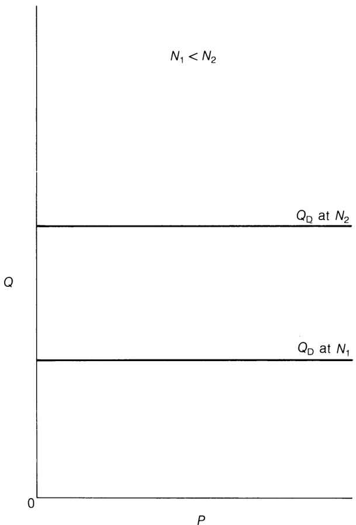  
Figure 6.13 Drag flow vs speed.  

Equations (6.20), (B.31), (B.37) and (B.38) indicate that for several common types of screw the drag flow is proportional to speed and independent of pressure. Thus in Fig. 6.13 the $Q/P$ diagram shows $Q_{\mathbf{D}}$ as a series of horizontal lines at distances above the origin proportional to speed $N$ . Figure 6.14 shows a similar effect of channel depth $h$ . drag flow at constant speed being proportional to channel depth. According to equation (6.20), the (negative) pressure flow $Q_{\mathbf{P}}$ is proportional to pressure $\pmb{P}$ and independent of speed $N$ , so Fig. 6.15 consists of Fig. 6.13 with a superimposed series of parallel straight lines for different speeds commencing from drag flow $Q_{\mathbf{D}}$ at zero pressure and decreasing linearly with pressure $P$ ; then $Q_{\mathrm{Tot}}=\,Q_{\mathbf{D}}-Q_{\mathbf{P}}$ (equation (6.15)) is represented by the ordinate. Equations (B.32), (B.39), and (B.42) show that for other types of screw output also varies linearly with pressure (but see sections 6.7 and 6.8). In Fig. 6.16, pressure flow $Q_{\mathbb{P}}$ is similarly superimposed on Fig. 6.14 with $Q_{\mathrm{Tot}}$ as the resulting ordinate, but since $Q_{\mathbb{P}}$ is proportional to $h^{3}$ , the slope of the $Q/P$ line increases rapidly with increase of channel depth. This diagram immediately explains  several  operational features of screws of different depths -as explained on p. 149, final channel depth is of more significance than ^compression ratio' $h_{1}/h_{2}$ and use of the latter term will be avoided as a common but misleading colloquialism. Firstly, for a given increase in pressure, the output of a deep screw will decrease much more than that of a shallow screw -- for this reason they are sometimes referred to as 'soft and \*hard' screws, respectively. Secondly, although the output of a deep screw will be greater than that of a shallow one at low pressures, at high pressures the reverse will be true. The maximum pressure achievable (at zero output) will also be less than that of a shallow screw. The effects of decreasing melt pumping section length $_{Z}$ will be similar to those of increasing depth $\pmb{h}$ though less dramatic since $Q_{\mathbf{P}}$ varies only linearly with $Z$ (equation (6.13)). Since $Q/W b h$ is proportional to $Q_{\mathrm{Tot}}$ , the vertical ordinate of Fig. 6.16 may also represent a linear scale of $Q/W b h$ for a given speed and channel depth, with a value of $_{1/2}$ at zero pressure, corresponding to drag flow. Values of $1/2<Q/W b h<1$ represent negative pressure changes by continuation of the output/pressure line to the left of the vertical axis-this will be used in considering two-stage screws, in appendix B.5. This output/pressure line is a graphical representation of equation (6.20) or (6.33) and must be satisfied for the screw in question; however, it gives no information on what values of output, and its corresponding pressure, will be experienced in combination with a die. The output/pressure relation for a die with a Newtonian isothermal fluid is given by equation (6.53), which is represented by a straight line through the origin. Equations (6.54) and (6.55) show that if the die is narrow and/or long, $K$ will be small and the slope small; if wide and/or short, the slope will be large as shown in Fig. 6.17, the slope representing $K/\eta$ . For a screw and die in steady operation, both the relations between output $Q$ and pressure $P$ must be satisfied, and the intersection of the screw and die lines represents the unique (real) solution of two simultaneous equations. Figure 6.18 shows that for a large die, a deep screw may give a substantially higher output and pressure (point $\pmb{A}$ ) than a shallow screw (point $\textbf{\emph{B}}$ ). However, with a small die the shallow screw (point $\b{D}$ ) may give a higher output than a deep one (point $^{c}$ )at the same speed; this may be overcome by increasing the speed of the latter, and the choice between screw designs, like that of back pressure, then becomes a matter of energy, mixing and stability (see Chapters 9 and 11). Modification to this diagram due to non-Newtonian and non-isothermal operation will be considered in sections 6.7 and 6.8. For more complex problems, continuity requires that for sections in series:  

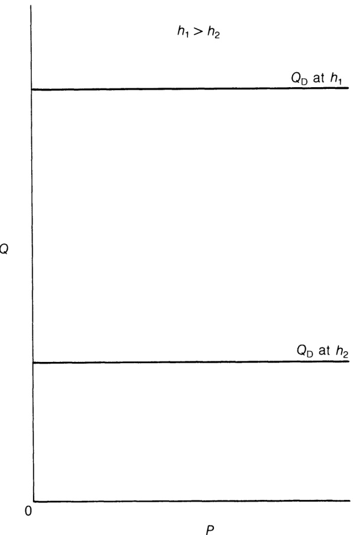  
Figure 6.14 Drag flow vs channel depth.  

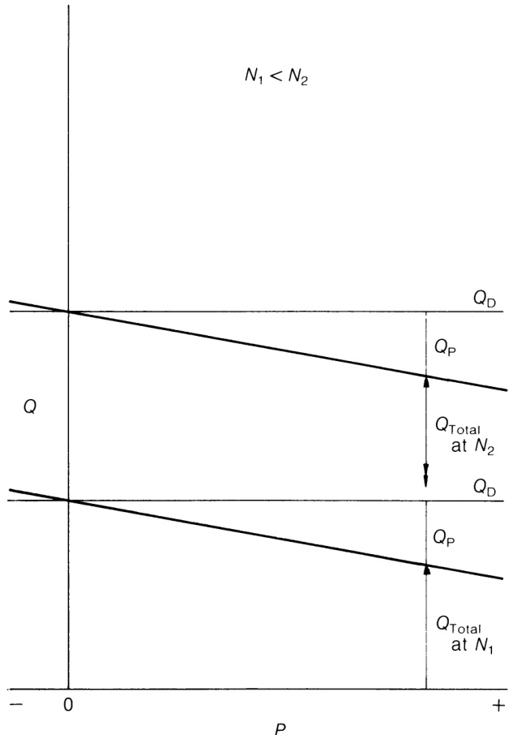  
Figure 6.15 Pressure and total flows vs speed.  

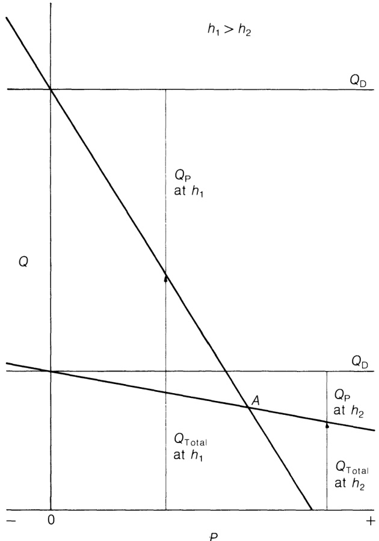  
Figure 6.16 Pressure and total fows vs channel depth.  

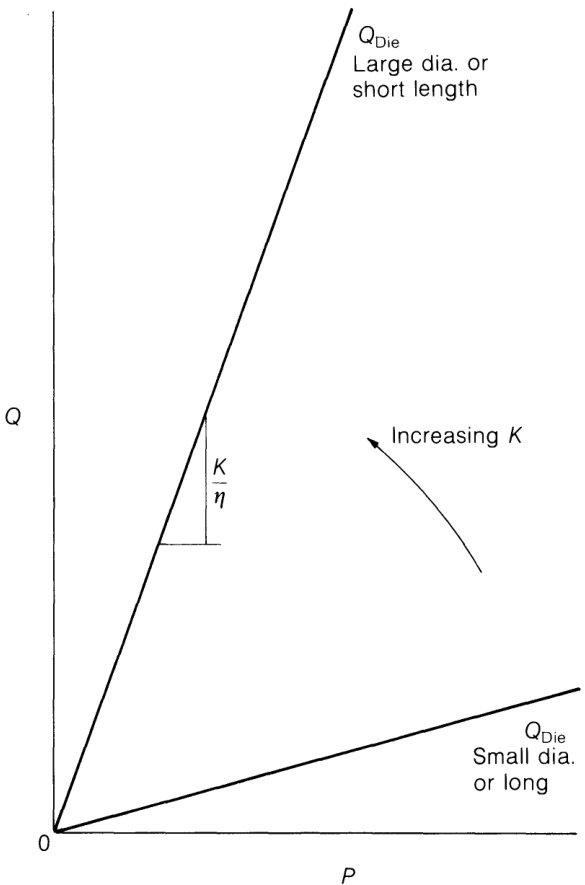  
Figure 6.17 Die characteristics (Newtonian).  

$$
Q_{1}=Q_{2}=Q_{3},\;\;\mathrm{etc.}
$$  

and:  

$$
\mathrm{d}P_{1}+\mathrm{d}P_{2}+\mathrm{d}P_{3}+\dots=0
$$  

(including pressure drop through the die) where $\mathbf{d}P_{x}$ is the pressure change in section $_x$ . In the case of operation in parallel:  

$$
Q_{1}+Q_{2}+Q_{3}+\cdot\cdot=Q_{\mathrm{Tot}}
$$  

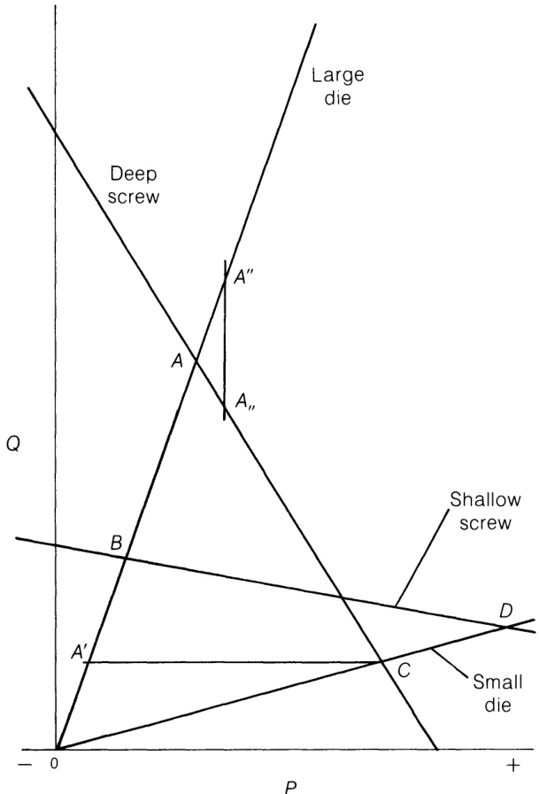  
Figure 6.18 Operating points of screw/die combinations.  

and:  

$$
{\bf d}P_{1}={\bf d}P_{2}={\bf d}P_{3},~~\mathrm{etc.}
$$  

Further, where screw sections are on a common shaft, speed $N$ is the same for each section, and where diameter $\boldsymbol{D}$ and helix angle $\phi$ are also constant, downchannel velocity $W$ and channel width $^b$ will be constant.  

# 6.5.2 Venting or vacuum extraction  

The use of this type of diagram is exemplified by considering venting or vacuum extraction, using the isothermal Newtonian approximation for simplicity. The purposes of venting are: (i) to remove air trapped in the feed section; (i) to remove water vapour on or in solid feed material; (i) to remove residual volatiles, e.g. monomer, diluent; and (iv) to remove degradation products produced during heating in the screw. This may assist in giving non-porous, steady, smooth-surfaced product and in reducing odour, die build-up and 'smoking', e.g. due to high temperatures used in paper-coating with LDPE.  

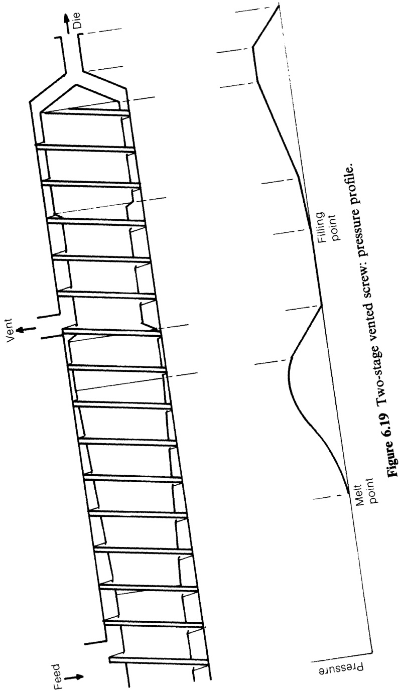  

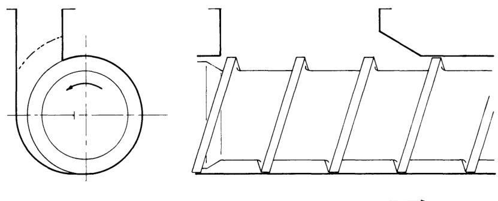  
Figure 6.20 Vent for vacuum extraction.  

Trapped air, and to a partial extent purposes (i) and (i), can also be achieved by vacuum feeding (Chapter 7); purpose (iv) can obviously only be achieved after melting.  

Several methods are used of which the commonest is probably a decompression section in the screw with a vent in the barrel over it (Fig. 6.19). All the polymer melt passes over the vent, which is therefore liable to blockage; various shapes, including removable inserts, have been used to reduce blocking of the vent and assist in clearing material forced into the vent, such as that shown in Fig. 6.20 where the vent port is arranged tangentially above the downgoingside of the screw,and elongated toincrease the area for vapour release, and the trailing edge is well chamfered to assist in reentrainment (Chapter 7). Since the principle is that after melting in the first section of the screw, the pressure is reduced to zero under the vent, a second shallow section is usually necessary to raise the requisite pressure before the die. This may be satisfactory for one set of operating conditions, though requiring careful prediction in the design of the screw, but is quite inflexible, since an increase in die pressure is liable to cause vent blockage. Analysing the output/pressure relations, speed is the same for both sections and while the vent is unblocked the first section is operating against zero back pressure so that its output is independent of die pressure. By continuity, if the vent is to remain unblocked, $Q_{2}\geq Q_{1}$ ,SO $h_{2}$ must be greater than $h_{1}$ .As the die pressure $P_{2}$ is increased, $Q_{2}$ will decrease until at $P_{2}>P$ (Fig. 6.21) it is less than $Q_{1}$ ， when the vent will block since the second section is not removing material from the vent region as fast as the first section is supplying it. To avoid this, $h_{2}$ is often designed considerably greater than $h_{1}$ , which may allow a slightly higher die pressure $\pmb{P}$ but, as Fig. 6.16 shows, leads to a steeper gradient of ${\bf d}Q/{\bf d}P$ i.e. output falls more for a given increase in pressure and therefore this design is even more sensitive to changes in die pressure. To permit vapour release, the screw channel at the vent must be only partially filled; if the second section is tapered, it will fill at some point depending on the die pressure. If the die pressure is increased, the same output can be maintained if the channel is filled further back (Fig. 6.22), increasing the effective length, untileventually it fills at the vent, causing blockage. However, as will be seen in section 6.6, the pumping rate of a partially filled screw is very sensitive to the degree of filling, and surging is likely to result in otherwise satisfactory conditions; this is aggravated by increasing the depth of the second section $h_{2}$ beyond the minimum.  

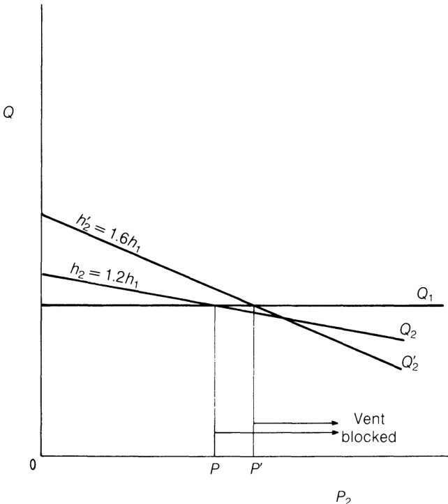  
Figure 6.21 Effect of die pressure on venting.  

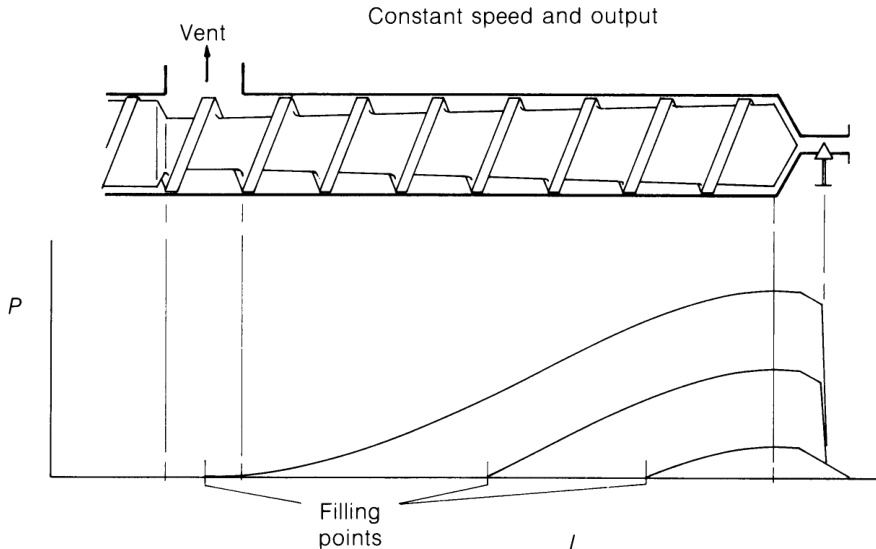  
Figure 6.22 Effect of die pressure on filling position.  

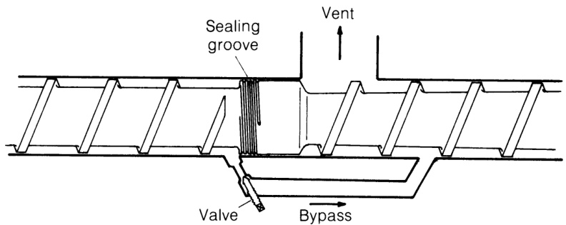  
Figure 6.23 Valved bypass venting system (Bone-Cravens patent).  

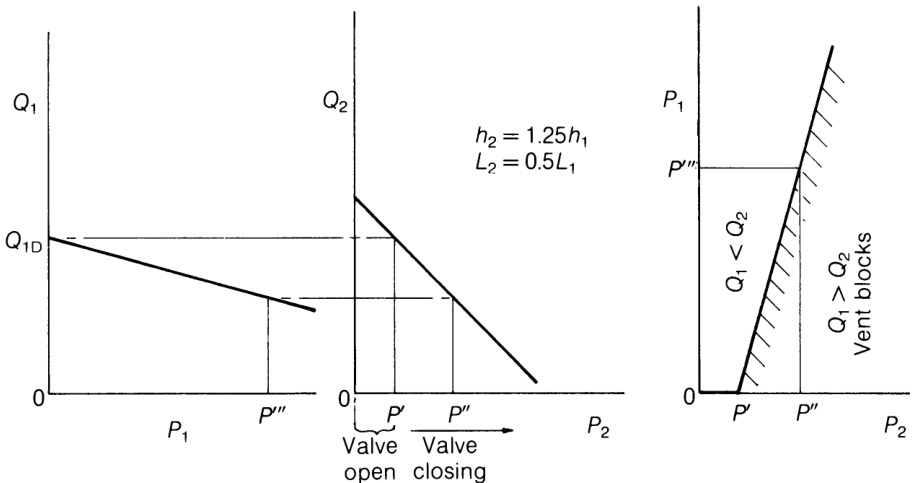  
Figure 6.24 Valve closing vs die pressure $P_{2}$ to avoid vent blocking.  

Another method of venting with a similar screw is to make use of the partial filling to avoid the polymer melt passing directly over the vent by placing the latter in the screw itself just behind a flight (Bernhardt, 1956), where filling is normally last to occur. The vent is then taken out through a hollow screw to a rotary joint at the drive end. The output/pressure characteristics are similar to the preceding method, but the area of the vent is very restricted, it is difficult to incorporate with screw heating or cooling, and if it becomes blocked is inaccessible for manual clearing. Since the first section is operating against zero back pressure, the last part of this section is acting as a resistance to raise pressure and promote melting and mixing in the earlier parts; it has been proposed to replace this with a restriction in the form of a short annulus, e.g. a 'smearhead', permitting a deeper first section with probably a higher output and/or more complete mixing. However, the output of the first section is still independent of die pressure; limitation of the latter and/or surging are still probable.  

If this restriction is carried to the limit, with a close clearance and reversepitch groove for sealing, the flow may be diverted through a bypass channel in the barreland returned to the screw downstream ofthe vent position. In this way the melt does not pass over the vent and, in the event of accidental blockage, the second section of the screw will tend to pump the vent clear. A refinement of this system is to incorporate an adjustable valve in the bypass (Grant, 1961) so that the back pressure $P_{1}$ on the first screw section can be varied to compensate for changes in die pressure $P_{2}$ (Fig. 6.23). This, in general, will permit higher values of die pressure without vent blocking, but more importantly enables the depths of the first and second screw sections to be more nearly equal and so reduce the risk of surging. Operation with a given screw may be summarized by a diagram of $\scriptstyle P_{1}$ against $P_{2}$ (Fig. 6.24); a pressure gauge upstream of the valve will assist the operator. The author has seen the vent blocked by increasing $P_{2}$ and subsequently cleared by increasing $P_{1}$ accordingly. This system has an additional advantage of a large melt surface for release of volatiles depending on the filling point of the second section. Actual experience has shown two limitations: (i) thermal degradation due to long residence time of polymer in the seal or vent regions may contaminate the product; (i) although adjustment of the valve will avoid vent blocking, the increased back pressure on the first screw section will alter the work input and melt temperature. This is qualitatively the same as in a simple unvented screw but made more critical by the understandable tendency to try to accommodate venting within the length ofa simple screw,thus reducing theeffective length for melting and mixing, butexpecting similar performancein terms of output, melt temperature, stability, etc. The present author believes it would be more correct to treat the vent and second screw section as an addition to the length of the simple screw and accept a compromise between output and the additionalshear history imposed on the polymer by theextra length. Withinthe-barrel systems may remove up to about $5\%$ by mass of water vapour -- multiple extract points have been used to remove approximately $15\%$ of a volatile monomer down to much less than $1\%$ residual content.  

A more radical system (Fisher, 1976, p. 83) is the use of two distinct extruders with a venting vessel between the first solid-fed machine which melts and pumps the polymer to the vessel, and a second melt-fed machine pumping the devolatilized polymer to the die. The vessel must be heated and may have a stirrer and/or vacuum applied to assist in volatile removal. It can have a large polymer surface and long residence time for separation, and it is claimed that the second machine is surge-free, though this depends on satisfactory feeding of the melt to it. The two extruders may run at different speeds and even be of different diameters; control of relative outputs does not need to be refined because of the large capacity of the vessel. Although the equipment is cumbersome, and the long residence time may give degradation of heatsensitive polymers, it appears suitable for removal of large proportions of water vapour and other volatiles.  

In appendix B.5 further examples of the use of $Q{\scriptscriptstyle-}P$ diagrams are given.  

# 6.6 OUTPUT CORRECTIONS  

The ten assumptions in section 6.2 permit derivation of fow rate and mechanical power input in terms of simple analytic equations, from which the trends caused by changes in operating conditions may clearly be seen. Further, numerical values can be obtained with the aid of a pocket calculator.  

Of these assumptions, nos 1, 6, 7, 8 and 10 are treated in sections 11.2, 6.3, 6.7, 6.8, and 6.4 respectively, and gravity (assumption 9) is clearly negligible with high viscosity melts. Apart from external causes such as feed variations, inhomogeneities may arise within the extruder, for instance by selective feeding (p. 271) or selective melting (p. 282). Although partly-melted polymer may behave as a fuid and generate pressure, appropriate values of viscosity and heat content must be used.  

If the polymer does not adhere to the barrel and screw surfaces, the flow becomes indeterminate. If low viscosity occurs near the barrel, e.g. due to excessive heating or separation of low molecular weight material (monomer, lubricant, etc.), the drag fow will be decreased. If conditions aproaching \*slip' occur at the screw surface, drag fow may actually be increased, but the pressure fow will also be distorted. Assumption 3 neglected the drag due to adherence of the polymer to the sides of the flight; the drag flow is not truly onedimensional and the mean drag velocity is less than $W/2$ (equation (6.9)). Similarly, the pressure flow is not completely represented by fow through an infinite’ slit. McKelvey (1962, p. 236) has presented graphs of correction factors for drag and pressure fow for various ratios $b/h$ of channel width to depth. These show that for $b/h=10$ , which is typical for extruders for plastics, $K_{\mathrm{D}}=0.93$ and $K_{\mathrm{P}}=0.94$ , and these vary only slowly with $b/h$ so may be neglected in estimating changes due to operating conditions, though not in design. Neglect of these corrections will cause approximately $7\%$ overestimate in the calculated fow rate and corresponding underestimate in the value of $Q/W b h$ based on observed flow rate, so they are significant in deductions made from the value of $Q/W b h$ . These corrections will be greater than the above in the deep channels often associated with screws for extruding rubbers.  

The main effect of assuming a shallow channel and neglecting curvature, since inertia terms are negligible, is that the mean channel velocities are overestimated by equations (6.9) and (6.10)-the latter would better be represented by:  

$$
Q_{\mathrm{D}}={\frac{\pi}{2}}\left(D-h\right)N b h\cos{\phi}
$$  

The error for a diameter/depth ratio $D/h=10$ is $+11\%$ , but the approximation is convenient, especially for tapered screws, where $(D-h)$ wouldvary along the length. A smaller error arises because the areas, and therefore the stresses, at the barrel wall and the screw root are unequal, so that drag fow shear rate (velocity gradient) is not constant and the velocity distribution shown in Fig. 6.3 should be similar to that in Fig. 6.6(e) - the parabolic velocity distribution (Fig. 6.5) due to pressure fow will similarly be distorted with a maximum nearer the screw root.  

A major uncertainty which directly affects the output/pressure characteristic is the effective melt length Z. Experiments by Weeks and Allen (1962) have shown that the point of initial pressure rise in a solid-fed extruder can be determined quite reliably by plotting pressure measurements at a series of points along the melt pumping section and extrapolating to zero pressure. The same researchers measured melt temperature by allowing polymer to flow out of the barrel at various points and over thermocouples. This of course gave time-averaged readings, but in the region of the \*gel point' may have given high readings, since any solid particles in the fow could not pass through the relatively narrow passage surrounding the thermocouple. A recalculation by the present author from the measured final temperature and total output, together with the calculated power input in the length from the point of initial pressure rise, gave the enthalpy and mean temperature at this point. For the high-compression screw this indicated a temperature between $105^{\circ}\mathbf{C}$ and $110^{\circ}\mathbf{C}$ for LDPE in the conditions of the experiment, compared with the nominal crystalline melting point of approximately $117^{\circ}\mathbf{C}$ This suggests that in this case the point of initial pressure rise was a good indication of the ^gel point' since partly-solid particles in suspension in a molten matrix might have an average temperature below the nominal melting temperature, but would behave as a fuid and be capable of generating hydrodynamic pressure. Experiments made with thermocouples attached to the screw and immersed in the channel flow have been reported by Marshall, Klein and Uhl (1965) and Barnett et al. (1966). Diagrams of temperature against position along the screw reproduced from these authors by Tadmor and Klein (1970) show: (i) the existence and nature of time-fluctuations of temperature at a point; (i) the variation in temperature across the channel width; (i) the tendency for fluctuations and variations to increase with screw speed; and (iv) the movement of the region of fuctuations towards the die with increase of speed. The implications for the melting process (Chapter 7) and homogeneity at the die (section 11.1) will be considered later, but they demonstrate that simple measurements of temperature are unreliable in determining the point at which pressure begins to rise. Practical experience confirms the findings of Weeks and Allen (1962) that this point moves back, i.e. towards the feed end, with increasing pressure. Calculations based on the Tadmor melting model reported in Chapter 7 (Figs 7.23 and 7.31(b)) predict substantial pressure rise within the melting section, giving a smaller pressure gradient ${\bf d}P/{\bf d}z$ and greater output $Q$ in the melt pumping section for a given die pressure. As discussed on p. 275, this effect is likely to be small, except with deep screws and high die pressures, so that output based on length $Z$ from the point where the channel is effectively filled with melt should not be unduly conservative. The Tadmor melting model (Chapter 7) predicts the position at which melting of the solid bed should be complete, and this seems the best basis for effective melt length $Z$ until theory or experiment can predict the point at which the solid bed will break up.  

  
Figure 6.25 Melt cross-section of partially filled channels.  

The pumping rate of partially filled screws has been mentioned in connection with pressure profiles (p. 145) and venting (p. 162); various situations are shown diagrammatically in Fig. 6.25. If the channel is filled to a very small extent as in Fig.6.25(a),the melt willform a thin film overthe screwsurface and rotate without touching the barrel and thus without any forces tending tomove it along the screw. Any material which adheres to the barrel or is trapped in the flight clearance will tend to be collected on the leading face of the screw flight (Fig. 6.25(b)) by the transverse movement represented by velocity component $U$ (equation (6.5)). The material represented by the shaded area will be subjected to a shear force at the barrel, opposed by an equilibrium force on the much larger surface in contact with the screw; the shear stress and hence shear rate at the barrel will thus be much higher than at the screw, resulting in a velocity gradient as in Fig. 6.25(f). The drag flow will be given by a modification of equation (6.8):  

$$
Q_{\mathbf{D}}=\int_{0}^{h}w x\,\mathbf{d}y
$$  

but in this case both $w$ and $x$ are nonlinear functions of $y$ $Q_{\mathrm{D}}\ll W b h/2$ As the degree of filling increases through the situation represented by Fig. 6.25(c), the area in contact with the barrel will increase faster than both the volume of melt, represented by the shaded area, and the area in contact with the screw, so that the shear stresses and shear rates tend to become more nearly equal and the ‘pumping efficiency’ increases. When the channel is nearly filled, as in Fig. 6.25(d), the shear conditions and pumping efficiency will be similar to those of the filled channel, as in Fig. 6.25(e), and a nearly filled channel therefore may be expected to operate similarly to one completely filled, except that evidently the pressure must remain zero, otherwise the channel would fill. However, the nonlinear increase in pumping rate with the degree of channel filling brings the possibility that a slight increase in feed rate to the screw section may cause a disproportionate increase in its pumping rate, which then pumps the section empty, reducing the pumping rate until the feed again causes an increase in the degree of filling. This is believed to be the cause of the output instability known as surging (section 11.2) which is frequently encountered with the second section of conventional vented screws (section 6.5). It is analogous to the classical surging due to the stalling of the inlet stages of turbocompressors.  

# 6.7 PSEUDOPLASTIC FLOW  

On p. 143 it was mentioned that drag fow is independent of viscosity and therefore if screw speed is increased, this element of output will be unaffected by pseudoplastic behaviour. However, increased speed entails an increase in shear rates and reduction of viscosity of a pseudoplastic melt; this in turn will increase the back flow due to pressure represented by the last term of equation (6.15). Therefore, as speed increases, the slope of the output/pressure line will increase in contrast to the constant slope for a Newtonian fluid shown in Fig. 6.15. It has been shown in Fig. 6.6 that, except in the case of drag fow when $Q/W b h=1/2$ , the velocity profile over the depth of the screw channel is nonlinear, and since $\dot{\gamma}=\mathsf{d}w/\mathsf{d}y$ (equation (3.4)) the shear rate varies with position, its value depending on the magnitudes of both drag and pressure flow. In appendix B.1, the downstream velocity $w$ at a point $y$ from the root of the screw channel is given as:  

$$
w=\frac{W y}{h}+\frac{(y^{2}-y h)}{2\eta}\cdot\frac{\mathrm{d}P}{\mathrm{d}z}
$$  

Then the shear rate at this point:  

$$
\dot{\gamma}_{y}=\frac{\mathrm{d}w}{\mathrm{d}y}=\frac{W}{h}+\frac{\left(2y-h\right)}{2\eta}\cdot\frac{\mathrm{d}P}{\mathrm{d}z}
$$  

But by rearrangement of equation (6.16):  

$$
\frac{\mathrm{d}P}{\mathrm{d}z}=\left(\frac{1}{2}-\frac{Q}{W b h}\right)\frac{12\eta W}{h^{2}}
$$  

Substituting in equation (B.8):  

$$
w={\frac{W y}{h}}+{\frac{6W}{h^{2}}}\left({\frac{1}{2}}-{\frac{Q}{W b h}}\right)(y^{2}-y h)
$$  

Substituting in equation (6.66) gives:  

$$
\begin{array}{r}{\dot{\gamma}_{y}=\displaystyle\frac{\mathrm{d}w}{\mathrm{d}y}=\displaystyle\frac{W}{h}+(2y-h)\left(\displaystyle\frac{1}{2}-\displaystyle\frac{Q}{W b h}\right)\displaystyle\frac{6W}{h^{2}}\,}\\ {=\displaystyle\frac{W}{h}+\displaystyle\frac{W}{h}\left(\displaystyle\frac{12y}{h}-6\right)\left(\displaystyle\frac{1}{2}-\displaystyle\frac{Q}{W b h}\right)}\end{array}
$$  

At the barrel surface, when $y=h$  

$$
\begin{array}{c}{\displaystyle{\dot{\gamma}_{h}=\frac{\mathrm{d}W}{\mathrm{d}y}=\frac{W}{h}\left[1+6\left(\frac{1}{2}-\frac{Q}{W b h}\right)\right]}}\\ {\displaystyle{=\frac{W}{h}\left(4-\frac{6Q}{W b h}\right)}}\end{array}
$$  

This is valid for constant viscosity, i.e. isothermal Newtonian flow (assumptions 7 and 8 in section 6.2.2), but as shown in appendix B.1, for a non-Newtonian fluid, in which viscosity $\eta$ is a function of shear rate, viscosity will vary across the channel depth and will be a function of $Q/W b h$ ,i.e. a function of the ratio of pressure flow to drag flow (equation (6.68)). Thus the integration of the Navier-Stokes equation (B.1) becomes complex, precluding an analytical solution such as equation (6.15) which clearly indicates the effects of operational variables. However, an approximate method which takes account of the major effect on viscosity of shear rate (e.g due to changes in speed or channel depth) and the change in shear rate with increasing back pressure, uses equation (6.69) to determine the shear rate at which viscosity is taken for insertion in the flow equation. It does not include the effect of changes in viscosity on the shape of the velocity profile, i.e. the distortion of the curves in Fig. 6.6 (see also Fig. 4.1). The method is first to calculate the value of $Q/W b h$ for a known condition of either output or pressure, and hence the apparent wall shear rate given by equation (6.69). The intercept at this shear rate on the curve of viscosity against shear rate for the polymer in question at the appropriate melt temperature then gives the viscosity to be used in the flow equation (6.15) or (6.20). This enables ${\bf d}P/{\bf d}z$ or $P$ to be calculated for the assumed $Q$ or vice versa, with little more difficulty than for the Newtonian case, except that it must be repeated for each value of $Q$ or $P$  

The implications of equation (6.69) for pressure profiles and output/ pressure characteristics will now be examined briefly. When $Q/W b h=1/2$ equation (6.69) reduces to $\mathsf{d}W/\mathsf{d}y=W/h,$ , consistent with Fig. 6.6(d), and the second term of equation (6.15) disappears, giving an output independent of viscosity, as for the Newtonian case. For a constant-depth screw, consider first the condition at which the viscosity of two fluids, one Newtonian and the other pseudoplastic, is equal at the drag flow shear rate, given by $W/h$ . If back pressures are now applied, such that output $Q$ and $Q/W b h$ are decreased by the same amount for each fuid, then by Fig. 6.6 and equation (6.69), wall shear rate $\dot{\gamma}_{h}$ will be increased and the viscosity $\eta$ of the pseudoplastic will be decreased, whereas viscosity of the Newtonian fluid remains constant. Then, by equation (6.15) and compared with the Newtonian fuid at the same output $Q$ and $Q/W b h$ ， $Q_{\mathbf{P}}$ must be the same, but the pressure gradient ${\bf d}P/{\bf d}z$ decreased in proportion to the viscosity. Since the channel depth $h$ is constant, ${\bf d}P/{\bf d}z$ remains constant along the length, so that Fig. 6.9 remains valid, but with smaller pressure gradient and final pressure $P$ for a given value of $Q/{W b h}$ . On the output/pressure diagram a given value of output $Q$ and $Q/W b h$ will occur at a lower pressure than for the Newtonian fuid, i.e. a horizontal shift towards the origin. If the comparison is made on the basis of equal back pressures, then equation (6.15) shows that the lower viscosity of the pseudoplastic fluid implies a lower output, i.e. a vertically downward shift on the diagram of $Q$ against $P$ Thus in Fig. 6.26 the output line for the pseudoplastic lies below that for a Newtonian fluid. Note that since viscosity is nonlinear with shear rate and pressure gradient, the $Q/P$ characteristic for a pseudoplastic fluid is no longer a straight line; the Newtonian line is tangential to this curve at $P=0$ ifviscosities of the two fluids are equal at shear rates near to that for drag flow, i.e. $\dot{\gamma}_{h}=W/h$  

For screws of varying depth, e.g. stepped or tapered screws, the above trends will also be observed, but also the variation of shear rate and viscosity along the screw will cause additional changes in pressure gradient to those shown in Figs 6.10 and 6.11. By differentiating equation (6.69) with respect to channel  

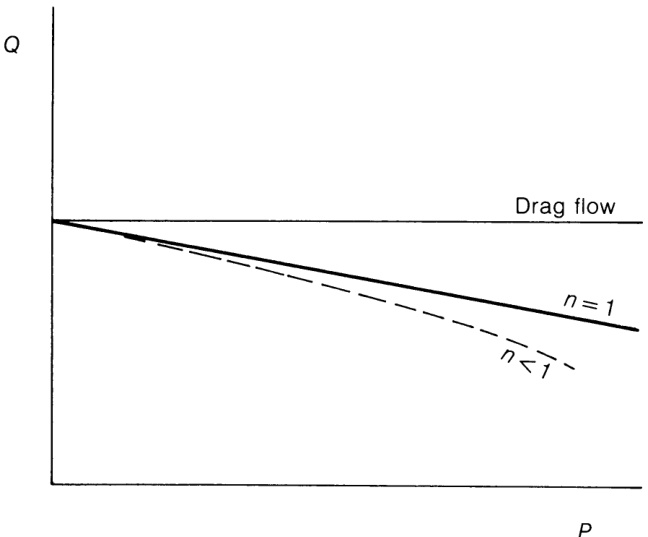  
Figure 6.26 Effect of pseudoplasticity on output/pressure line. Newtonian; ---- pseudoplastic.  

depth h:  

$$
\frac{{\bf d}\dot{\gamma}_{h}}{{\bf d}h}=\frac{W}{h^{2}}\left(\frac{12Q}{W b h}-4\right)
$$  

This shows that at constant output (as at various positions along the same screw), the wall shear rate increases as the depth $\pmb{h}$ decreaseswhen $Q/W b h<1/3$ i.e. the same condition as shown on p. 149 for the point of inflexion in the longitudinal pressure gradient. This is shown by the horizontal lines in Table 6.1; for instance in a 4:1 stepped screw $\left(h_{1}/h_{2}=4.0\right)$ operating at drag flow in the metering section, the wall shear rate increases from 0.81 in the first section to 1.00 in the metering section. In a 5:1 tapered screw $(h_{1}/h_{2}=5.0)$ operating at $Q/W b h_{2}=0.2,$ , the wall shear rate increases progressively from 0.75 at the gel point to 2.80 at the end. As shown for the parallel screw, increasing shear rate gives decreasing viscosity and decreasing pressure gradient compared with a Newtonian fluid, therefore a horizontal line on Table 6.1 shows that the curvature of the upper pressure profiles in Figs 6.10 and 6.11 will be decreased and a smaller proportion of the total pressure will be generated in the shallower sections. At values of $Q/W b h>1/3$ , i.e. to the right of the heavy line in Table 6.1, the wall shear rate decreases as depth h decreases, so that viscosity and pressure gradient will increase compared with the Newtonian fluid. These changes to the longitudinal pressure gradient are shown qualitatively in Fig. 6.27 for comparison with Fig. 6.11 for a tapered screw. The actual values of pressure $P$ and gradient $\mathbf{d}P/\mathbf{d}z$ at a point will depend on the value of shear rate at which Newtonian and pseudoplastic viscosities are assumed equal.  

A vertical line on Table 6.1 shows the variation in shear rate with back pressure at a given point within the length of the screw, e.g. for a 3:1 screw, the wall shear rate at the gel point only varies from 1.33 to $0.93W/h_{2}$ overthewhole useful range of back pressures and $Q/W b h$ . In fact, it is only at low values of  

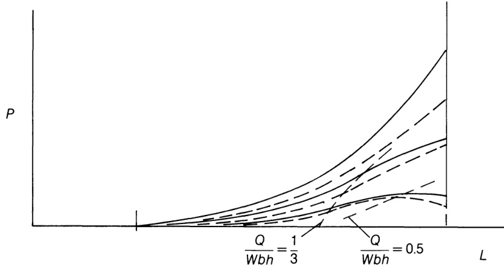  
Figure 6.27 Pressure gradients in pseudoplastic flow. $\begin{array}{r}{\pmb{n}=1;\operatorname{--}\pmb{n}<1,}\end{array}$  

Table 6.1 Wall shear rate from equation (6.69) vs dimensionless output for screws ofvarioustapers $h_{1}/h_{2}$ , expressed as a ratio of the shear rate at the end of the screw indragflow $W/h_{2}$   

<html><body><table><tr><td rowspan="2">Q</td><td colspan="9">h/h2</td><td rowspan="2"></td></tr><tr><td>5.0</td><td>4.5</td><td>4.0</td><td>3.5</td><td>3.0</td><td>2.5</td><td>2.0</td><td>1.5</td><td>1.0</td></tr><tr><td>Wbh2 0</td><td>0.80</td><td>0.89</td><td>1.00</td><td>1.14</td><td>1.33</td><td>1.60</td><td>2.00</td><td>2.67</td><td>4.00</td><td></td></tr><tr><td>0.1</td><td>0.78</td><td>0.86</td><td>0.96</td><td>1.09</td><td>1.27</td><td>1.50</td><td>1.85</td><td>2.40</td><td>3.40</td><td>back</td></tr><tr><td>0.2</td><td>0.75</td><td>0.83</td><td>0.92</td><td>1.04</td><td>1.20</td><td>1.41</td><td>1.70</td><td>2.13</td><td>2.80</td><td></td></tr><tr><td>0.3</td><td>0.73</td><td>0.80</td><td>0.89</td><td>1.00</td><td>1.13</td><td>1.31</td><td>1.55</td><td>1.87</td><td>2.20</td><td>pressure asing</td></tr><tr><td>0.4</td><td>0.70</td><td>0.77</td><td>0.85</td><td>0.95</td><td>1.07</td><td>1.22</td><td>1.40</td><td>1.60</td><td>1.60</td><td>ecreas</td></tr><tr><td>0.5</td><td>0.68</td><td>0.74</td><td>0.81</td><td>0.90</td><td>1.00</td><td>1.12</td><td>1.25</td><td>1.33</td><td>1.00</td><td>D</td></tr><tr><td>0.6</td><td>0.66</td><td>0.71</td><td>0.77</td><td>0.85</td><td>0.93</td><td>1.02</td><td>1.10</td><td>1.07</td><td>0.40</td><td></td></tr><tr><td></td><td></td><td></td><td></td><td></td><td></td><td></td><td></td><td></td><td></td><td></td></tr><tr><td></td><td></td><td></td><td></td><td>Distance alongtapered screw</td><td></td><td></td><td></td><td></td><td></td><td></td></tr></table></body></html>  

$Q/W b h_{2}$ and near the end of the screw (when pressure gradients will be high) that the wall shear rates differ markedly from those in drag flow. These are Newtonian shear rates, but the modest departure from drag flow values implies that they will also not differ greatly from those in pseudoplastic flow, making the foregoing approximation for viscosity reasonable in most instances.  

In estimating the performance of a varying-depth screw at a given speed and back pressure, a reasonable approximation is to take a viscosity which is an arithmetic average of those equivalent to the range of wall shear rates given by equation (6.69). However, at low back pressures, when $Q/W b h_{2}>1/3$ ,the maximum shear rate is no longer at the end of the screw, and evidently it would be more correct to take a viscosity which is an average of those corresponding to the maximum and minimum shear rates rather than shear rates at the two ends of the screw. A more accurate method would be to treat the screw as composed of a number of separate sections, each of constant shear rate and viscosity, and combine them by use of equations (6.60) and (6.61). In the case of a stepped screw, this reduces to using equations (6.38), (6.39), (6.40) and (6.41) with different values of viscosity in the first two equations. The viscosity to be used in the die equation (6.53) must also be based on the shear rate in the die, e.g. equation (3.24).  

When the screw is considered in combination with a die of fixed geometry, the $Q{\scriptscriptstyle-}P$ relationship for the latter with a pseudoplastic fuid must be included. As shown in section 3.1,if the rheological equation is approximated by a power law:  

$$
\tau\propto\dot{\gamma}^{n}
$$  

$$
\eta=\frac{\tau}{\dot{\gamma}}\propto\dot{\gamma}^{n-1}
$$  

But in the die:  

$$
\dot{\gamma}_{\bf w}\propto Q
$$  

e.g. for a circular capillary (Table 3.1):  

$$
{\dot{\gamma}}_{\mathrm{w}}={\frac{3n+1}{n}}\cdot{\frac{Q}{\pi R^{3}}}
$$  

Then substituting in equation (3.7):  

$$
\eta\propto Q^{n-1}
$$  

Substituting equation (6.71) in (6.53) gives:  

$$
{\cal Q}\propto\frac{K P}{Q^{n-1}}
$$  

or:  

$$
Q^{n}\propto K P
$$  

where $n<1$ . This is a concave upward curve compared with $Q\propto K P$ for a Newtonian fluid $(n=1)$ in Fig. 6.17. Then, the Newtonian screw and die characteristic equations (6.15) and (6.53) must be replaced by Fig. 6.26 and equation (6.73), respectively, and Fig. 6.18 is modified to Fig. 6.28 and the operating point moves from $A$ to $A^{\prime}$  

In short, the effects of a pseudoplastic polymer melt are threefold. First, the drop in output due to pressure tends to be greater than for a Newtonian fluid, especially at high screw speeds and/or back pressures. Second, the shapes of the longitudinal pressure profiles are modified. Third, in combination with a die, at a given screw speed the output will be little changed but the die pressure will be less and increase at a slower rate with output (screw speed) than for a Newtonian fluid.  

The foregoing assumes isothermal conditions are maintained; the effects of changing temperatures, some of which are implicit in changing shear rates, are considered in the next section. The effects of both pseudoplastic and nonisothermal conditions on power consumption and heat generation are dealt with in Chapter 8.  

This discussion has treated viscosity as a separate variable, dependent on Newtonian shear rate. Fenner (1970) has compared the Newtonian output/ pressure characteristic with those for power-law pseudoplastic fuids. The latter show the expected increase in the pressure dependence, especially for high pseudoplasticity (low values of $n$ ) leading to reduced total output at a given pressure and lower maximum pressure (at zero output). In the onedimensional case, the viscosity is taken as a function of the downstream shear rate only; in the two-dimensional case, the viscosity is dependent on the resultant shear rate including cross-channel velocities (Fig. 6.8). As Fenner points out, the differences in $Q/W b h$ for the two cases are generally small (less than 0.025)except near the drag fow condition (with $n=0.25$ , the difference in  

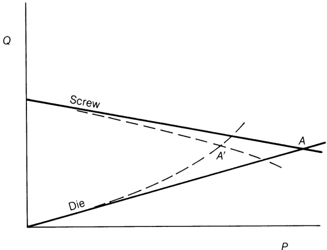  
Figure 6.28 Operating point for pseudoplastic flow. $-\,n=1;\--\,n<1$  

$Q/{W b h}$ is approximately 0.07). Comparison with his Fig. 4.1 shows that the viscosity corresponding to the Newtonian shear rate underestimates the departure from the Newtonian $Q{\scriptscriptstyle-}P$ diagram at low pressures, but overestimates it at high pressures.  

In addition to pseudoplasticity, real polymer melts may also be timedependent, which may be evident as a delay in responses at start-up and speed changes, but in steady-state extrusion such effects are likely to masked by those due to heat capacities and mechanical inertia. In the steady state, viscoelastic effects will only be apparent in longitudinal retraction and lateral swelling from thedie.  

# 6.8NON-ISOTHERMAL FLOW  

Firstly, variations in melt density due to longitudinal changes of mean temperature will modify equation (6.60) such that mass fow, rather than volumetric flow, is constant; apart from this, the drag flow element is independent of material properties and hence of temperature. It must be remembered that, as discussed in section 8.2, the temperature of the polymer melt is not the same as the set temperatures on the heater controls, even when steady conditions have been attained; the melt will generally be at a lower temperature except when severe cooling is in operation. As will be seen in section 8.4, except at drag flow, the variations in shear rate through the channel depth will give rise to non-uniform shear heating. This, coupled with temperature variations ‘inherited’ from earlier in the screw, will lead to radial temperature variations in the channel-usually significantly higher temperature near the barrel wall. This will be exaggerated by intentional heating from the barrel. The consequent changes in viscosity from the isothermal values will further modify the velocity distribution - see section 4.3 for these effects in a simple capillary. It is shown in section 8.4 that radial conduction in the polymer will only slowly reduce these temperature variations, but will be assisted by mass transfer through the transverse circulation (Fig. 6.7). The effect of both viscous heating and conduction from the barrel will thus be to reduce viscosity and hence further reduce output at a given pressure, and this effect will increase rapidly at lower values of $Q/W b h$ i.e. the output/pressure diagram with heating a Newtonian fluid will resemble that in Fig. 6.26 for an isothermal pseudoplastic. With a pseudoplastic melt, heating will further lower the output line and accentuate its curvature.  

However, the output is represented by the net area under the velocity distribution, and Fig. 6.6 shows that even at drag flow condition $(Q/W b h=1/2)$ nearly half the output $(44\%)$ is accounted for by the $25\%$ of channel depth nearest the barrel. Evidently when back pressure is applied this percentage is increased, and more so when pseudoplasticity and viscous heating are taken into account, so that the bulk average temperature will be higher than indicated by the radial temperature distribution. This will be returned to in considering heat flows in section 8.4. An extreme case of radial temperature gradients occurs with screw cooling (section 9.1) with an effect resembling a decrease of channel depth and which is not necessarily reversible.  

Longitudinal temperature gradients will reduce the viscosity at regions of higher temperature (generally nearer the die) so further reducing the longitudinal pressure gradient in these regions (irrespective of the value of $Q/W b h$ , since temperature has a direct effect on viscosity). These changes in gradient will lead to changes in pressure profiles similar to the upper left-hand portion of Fig. 6.27.  

The reduction of viscosity due to temperature increase in the flight clearance will only affect the pressure term, so that the effect on leakage flow will only be significant with large clearances (worn screws).  

The radial temperature gradients in the melt channel make reliable measurement difficult (see pp. 246 and 358) and the necessary instruments are not usually available to the industrial operator. The best approximation for output/pressure estimation is therefore the barrel temperature close to the inner surface, as for power estimation (p. 232). An average viscosity for use in the isothermal fow equation must be estimated from these temperatures, corresponding to the longitudinal temperature variation, and in the case of tapered screws may need to be weighted to take account of the variation of channel depth. As with pseudoplastic behaviour, a closer approximation can be sought by assuming a series of sections, each at uniform temperature, and summing the pressure changes; the validity of this depends on the accuracy of available data on the actual melt temperatures.  
