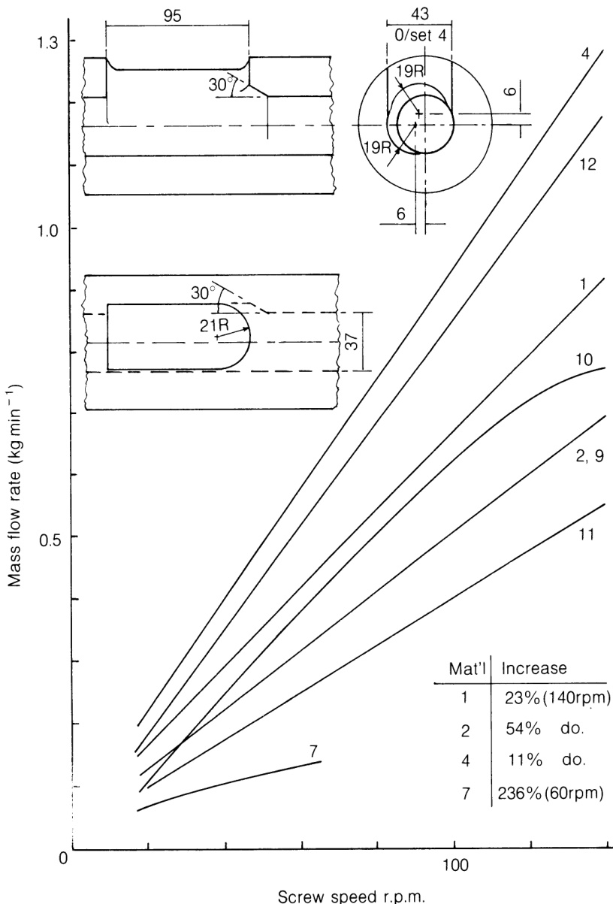

# 7.1 固体输送与熔融的相关性

挤出机不仅是熔体输送装置，其特性与产能已在第6章讨论。若挤出物未能完全熔融或流动不稳，优化挤出机的输送能力可能毫无意义。因此，固体输送与熔融性能对决定整机运行表现至关重要。

粉状与颗粒状固体的流动受颗粒几何形状、颗粒间及颗粒与金属表面间的摩擦力，以及水分等附加参数影响。与挤出机性能直接相关的固体输送过程有三种：料斗内的重力流动、料口向螺杆通道的填充，以及沿螺杆的输送。

重力流动过程中，料斗内物料整体会形成压力分布曲线。料斗底部的压力波动（由固体柱高度变化或流动阻滞引起）将导致挤出速率、能耗及熔体温度的波动。料斗最严重的问题是因颗粒间摩擦显著增大导致的局部或完全堵塞，本章后文将对此进行探讨。为克服这些困难，已采用机械解决方案：如料斗振动、轻柔搅拌进料及强制进料（利用螺杆输送颗粒并产生压力）。料斗的排料能力同样决定着挤出机的最大可能产量。

螺杆填充状态同样影响工艺性能。进料喉部需具备良好冷却能力，避免颗粒粘附壁面影响流动稳定性。若进料斗衬板与加工物料不匹配，可能导致物料被挤回进料喉部，阻碍新料流入。通常进料口设计为偏移或切向螺杆布置。橡胶挤出工艺中，粗大团聚物可能堵塞进料喉部。因此进料口常设置在螺杆下降侧的切线位置，而上升侧的螺杆则切入下降的物料柱。实验（Hayward, 1977）表明，采用常规与改良型进料槽衬板（图7.1及表7.1）时，两者性能差异甚微。

  

**图 7.1** Performance of a modified feed pocket liner.

**表 7.1** Materials used in feeding trials

|     |     |     |     |     |     |
| --- | --- | --- | --- | --- | --- |
| 编号 | 材料 | 硬度 | 形状 | 尺寸 | 粒度分布 |
| 1   | LDPE | 软 | 圆柱形 | 2 mm直径 × 3 mm长 | 非常均匀 |
| 2   | LDPE再生料 | 软 | 粗糙块状和片状 | 最大4 mm | 非常不均匀 |
| 3   | HDPE | 硬 | 透镜形 | 4 mm直径 × 3 mm长 | 非常均匀 |
| 4   | PS  | 硬 | 菱形 | 1.5 mm × 2 mm × 3 mm | 非常均匀 |
| 5   | LDPE | 软 | 球头圆柱形 | 5 mm直径 × 4 mm长 | 非常均匀 |
| 6   | PS  | 硬 | 圆柱形 | 约2 mm直径，约4 mm长 | 直径均匀，长度不一 |
| 7   | 合成橡胶 | 软弹性 | 大卷曲条状 | 非特定，20 mm × 8 mm × 4 mm | 非常不均匀 |
| 8   | 合成橡胶 | 软弹性 | 近四面体碎块 | 非特定，高4 mm，底面9 mm × 9 mm | 不均匀 |
| 9   | 合成橡胶 | 软弹性 | 近立方/圆柱形块状 | 6 mm × 7 mm × 9 mm | 不均匀 |
| 10  | 橡胶颗粒 | 极软弹性 | 近四面体块状 | 高5 mm，底面9 mm × 9 mm | 不均匀 |
| 11  | 橡胶碎屑 | 软 | 极小颗粒，近乎粉末 | -   | 大小不一的颗粒 |
| 12  | PVC粉末 | -   | 粉末 | -   | 均匀颗粒 |

两种设计在处理自由流动固体时的流量表现相当。然而，当处理流动性差的物料时，改进型设计展现出明显更高且更稳定的输送效率。

在螺杆内部，颗粒物很快被压缩成固体料柱，该料柱借助内筒壁产生的摩擦力向前输送，而螺杆表面的摩擦力则起到阻滞作用。关键在于确保筒壁摩擦系数远高于螺杆表面系数，如此即使物料摩擦特性偶有波动，亦不会显著影响系统稳定性。实现高筒壁摩擦的常用方法是加工纵向或螺旋形沟槽。

固体输送区的重要性通常取决于所选操作条件。当操作由熔体输送能力控制时，固体输送仅限于螺杆前几圈，导致压力升幅较小。若料筒冷却效率高，较长的固体输送区将产生较大压力，从而提升挤出机的输送能力（Broyer and Tadmor, 1972）。

单螺杆挤出过程中形成的熔融机制可能因材料而异，即使相同材料在不同操作条件下也会变化。所有情况下，固体床（或多或少被熔融材料包围）都可能过早断裂，从而引发压力波动。对这一现象重要性的认识促使了隔离螺杆的发展，该设计通过将熔池与固体床分离来确保后者的完整性。在特定螺杆几何结构和操作条件下，熔融过程的完成需要螺杆通道具备精确定义的螺旋长度。若该长度过长，则无法实现真正的熔体输送（从而同时影响压力生成和分布式混合过程），螺杆输送的聚合物很可能存在大量未熔融和混合不均的现象。在此情况下，熔融过程将限制工艺产量，可能需要采取特殊操作策略。

实验已证实固体输送与熔融过程及其相互作用对工艺性能和稳定性的关键影响。稳定性的先决条件之一是满足以下条件：

$$
Q _ {\mathrm {s}} \geq Q _ {\mathrm {m}} \geq Q _ {\mathrm {p}} \tag {7.1}
$$

其中 $Q_{\mathrm{s}}$、$Q_{\mathrm{m}}$ 和 $Q_{\mathrm{p}}$ 分别表示固体输送区、熔融区和泵送功能区的处理能力。不稳定现象通常根据其发生频率进行区分，可分为周期性或随机性，其频率可能高于、等于或低于螺杆旋转频率。频率高于螺杆转速的不稳定现象（如鲨鱼皮效应或熔体断裂）与模口流动条件相关（参见第5章）。螺杆频率下不稳定性的主要成因在于螺杆泵送段的横向压力梯度。此外，当螺杆螺纹经过进料口时，料斗中聚合物的周期性中断还会额外引发微小压力变化。根据Fenner、Cox和Isherwood（1979）的研究，固体床在加速过程中发生破碎，导致压力在低于螺杆转速5至10倍的频率下剧烈波动。此外，固体床破碎会产生温度分布不均的异质挤出物（Sakai，1990）。固态床中困住的空气逸出以及固态床表面的不平整，也是熔体流动不稳定的重要来源（Becker等人，1990；1991）。后者改变了熔体流动可用空间的有效流体动力学尺寸。当压缩区锥度导致固体床在螺杆通道内重塑形态时，同样会引发熔融过程中断而产生不稳定现象（Bigg, 1987）。压力或流速波动亦可能由温度波动引起，其根源在于温度控制系统性能，或在极低频率下源于环境温度变化。Gitschner和Lutterback（1984）将料筒加热系统启停阶段引发的压力波动与产量波动建立了关联。最后，随机性不稳定通常与前述不规则进料条件相关。同样地，熔融起始位置的任何变化都会影响压力建立曲线（Bigg, 1987）。

Cheng（1990）研究了颗粒几何形状对挤出速率和混合质量的影响。由于颗粒形状既取决于造粒系统，也受操作条件制约，这对复合材料生产商至关重要。冷切系统（如条状切粒）通常能产生比热面切系统（如气水造粒机）更均匀的颗粒几何形状。颗粒形态会随冷却方式、切割速度、模孔几何结构及材料类型而变化。研究发现颗粒尺寸对挤出速率的影响随螺杆转速增加而增强，产量波动幅度可达16%。聚乙烯颗粒（压缩性更高）对颗粒尺寸的依赖性低于刚性更强的聚丙烯颗粒。相对于螺杆槽深的小颗粒具有更高的固体输送率和熔化速率，但其对产量的影响同样取决于螺杆设计。