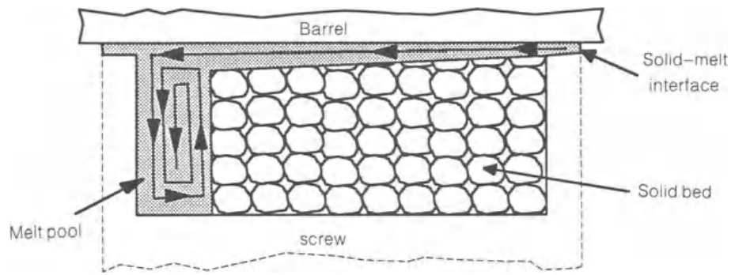
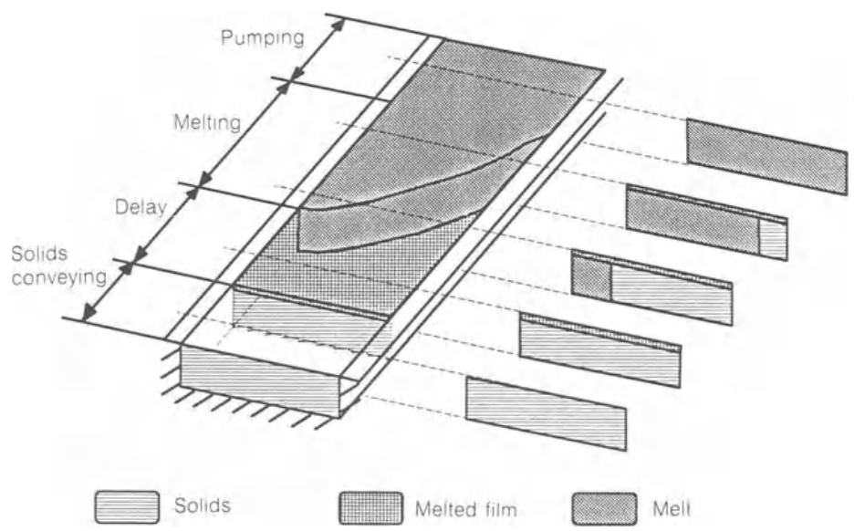
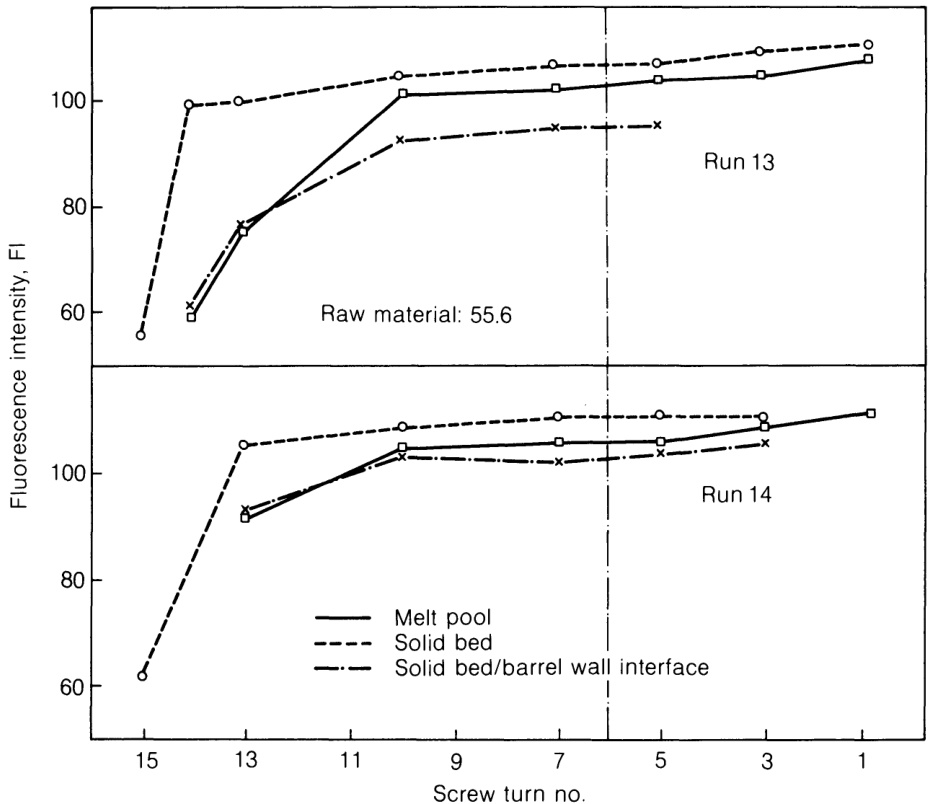
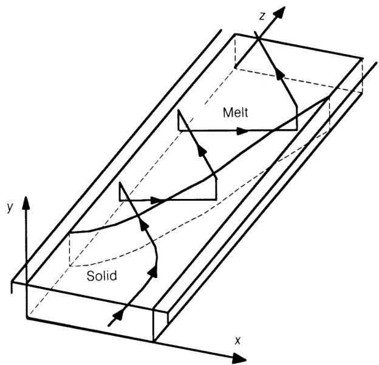
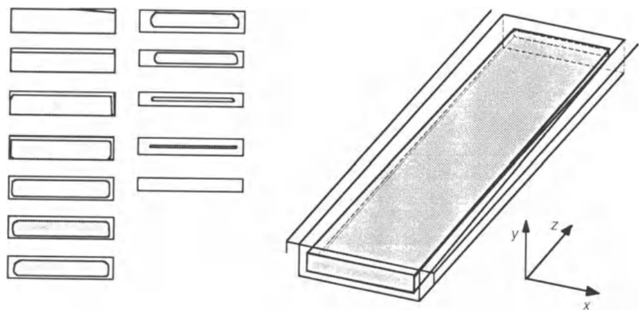
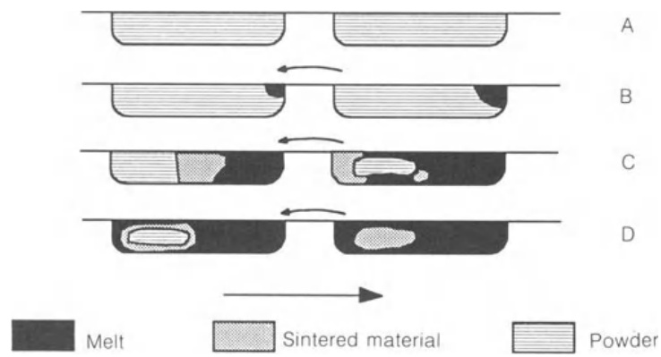
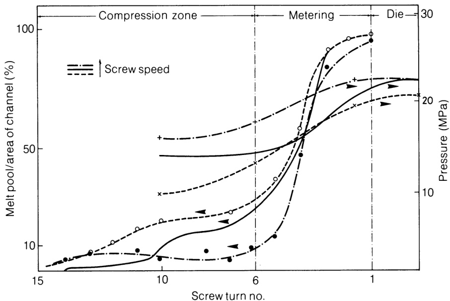
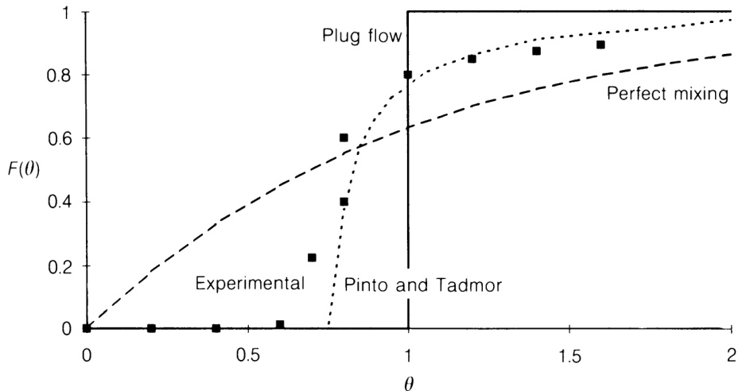

# 7.2 固体输送与熔融的现象学描述

自20世纪60年代以来，为全面理解聚合物挤出过程，研究人员开展了大量工作。数百篇论文与多部专著相继问世，目前已有若干用于模拟该过程的软件包可供使用。早期理论描述仅限于固体输送与熔体输送，因其可基于连续介质力学原理展开研究。然而要理解熔化机制并描述塑化过程，则需开发特定实验方法。马多克（1959）与斯特里特（1961）创立的“瞬态成像”技术，为挤出研究开辟了新路径。当特定材料挤出达到稳态时，中断螺杆旋转，冷却系统启动并取出螺杆。建议选用配备高效冷却系统的挤出机（带循环冷却介质的料筒）。在原料颗粒中混入部分彩色颗粒，熔融后形成的显著纹理可对应材料沿螺杆运动的轨迹。根据聚合物刚度，材料螺旋结构会被解卷或破坏，并在其长度方向的若干已知位置进行横向切割，以获取工艺的全局视图。

通过仔细观察多种热塑性塑料在不同挤出机中的挤出样本，得出关于该工艺特征的若干普遍结论：

1. 通常可识别出三个功能区，对应材料的不同物理相态。最初所有材料保持固态；随后固态与熔融态共存；最终整个聚合物呈现熔融状态。这些区域通常分别位于螺杆的进料区、压缩区和计量区。但功能区与几何区并无直接对应关系，因为首次熔融位置及熔融速率取决于加工条件、螺杆与模头几何结构以及聚合物的热物理特性。

2. 在螺杆初始旋转阶段，聚合物颗粒处于松散状态（并在螺杆抽吸过程中损失），随着在通道中推进逐渐被压缩，呈现出类似弹性固体的特性。该区域可明显划分为两个子区域： 第一子区属于真正的固体输送阶段（即仅能检测到固态物料），而第二子区在固体/内筒壁顶部的界面处形成薄熔融膜。该区域被称为延迟区，因为尽管已形成熔体，但主要熔融机制尚未启动（Kacir and Tadmor, 1972）。类似的熔融薄膜也可能出现在螺杆螺距和根部附近。

3. 图7.2展示了熔融区螺杆通道的典型（虽理想化）横截面。固体物料与熔融物料完全分离：前者形成高度密实的块状堆积，后者则形成覆盖整个通道高度的熔池。图中熔融仅发生于内筒壁，但实际操作中螺杆根部及尾部螺纹处亦可能（以较低速率）发生熔融。隔离固体与筒体的薄膜厚度随熔池方向逐渐增厚，此现象源于螺杆与筒体间的相对速度，该速度将熔体向螺杆推料螺纹方向挤压。由彩色颗粒与原始聚合物混合形成的痕迹表明，熔池中的材料遵循螺旋路径运动，类似于图6.8(b)和6.8(c)所示。

4. 随着熔化进程推进，熔池宽度增加而固体床宽度减小。固体颗粒填充通道间隙，仅在与金属壁的界面处保留熔融聚合物薄膜。固体颗粒逐渐变形并被压缩。固体床常会过早断裂，其碎片被熔融材料包围。

5. 最终所有材料完全熔化。在熔体输送区，流体元素沿着先前熔池中识别的螺旋轨迹被推动前进。

  

  

固体与周围金属表面之间产生的作用力，使其在内筒壁传热效率不断提高的作用下逐渐致密化并升温。经过数圈螺杆旋转后，固体开始表现出塞子特性——即通道内任意点的速度仅沿通道下行方向（z轴）变化。最终，靠近筒壁的材料达到熔点，由此形成延迟区。该点的精确位置取决于热传导机制（与料筒温度相关）与机械能转化为热能机制（取决于摩擦力）的相对强度。固体与内筒壁顶部界面处形成薄熔融膜层。由于粘性耗散作用，该膜层在高剪切速率作用下厚度急剧增加。然而剪切速率的相应渐减将减缓该过程。随后，熔融聚合物薄膜亦可能在螺杆通道的三面交界处形成。此时摩擦作用完全被粘性阻力机制取代，固体与筒体的相对运动将界面薄膜推向螺杆工作螺纹。若薄膜厚度小于螺杆尖端与内筒壁间的机械间隙，薄膜将流经间隙而不形成熔融池。图7.2所示的熔融机制仅在大部分熔体无法跨越间隙、被迫聚集于螺杆推料螺纹附近时才会启动。这意味着薄膜厚度至少需等于机械间隙值。实践观察表明，当薄膜厚度达到间隙值的5至7倍时熔融区才开始形成。

熔融过程中，螺杆推料螺纹刮除部分熔融薄膜并沉积于熔池。每个流体单元将形成规则且特征鲜明的螺旋纹理，其形态取决于运动启动时单元在通道中的坐标位置——这与先前研究熔体输送时观察到的现象一致。熔融池推动固体床抵靠螺杆尾部螺纹。熔融过程发生于熔融薄膜与固体床的界面。因此，当薄膜被筒体表面拖曳至熔融池时，固体颗粒被迫持续重排，此时料柱获得沿$y$方向的向上速度分量$V_{\mathrm{py}}$，使更多材料暴露于熔融环境。新熔融物随即被带回，暴露更多固体并延续该机制。因此$V_{\mathrm{py}}$可视为熔融速率的度量。该机制通过实验得到验证（Covas和Gilbert，1992）：利用降解聚氯乙烯在紫外线照射下于可见光区域荧光发光的特性，其荧光强度（FI）与降解程度成正比。图7.4展示了两种操作条件下固体床、熔融池及其界面沿通道方向的荧光强度变化。总体而言，荧光强度随停留时间增加而上升。固体床呈现最高荧光强度，因固体颗粒间无相对运动时，配方中稳定剂的效能受限。界面处观测到最低荧光强度值，此处

Figure 7.4 Fluorescence intensity (FI) of PVC along the length of an extruder, for two operating conditions (Covas and Gilbert, 1992).

材料刚熔化时，添加剂迅速分散。两条曲线几乎平行。熔池的熔融指数高于界面处，因为材料持续受到热量和剪切力的作用。

该机制将持续作用，熔融池逐渐占据通道宽度的更大比例，直至聚合物完全熔合。然而如前所述，作用于固态床的局部压力和剪切力可能诱发应力导致其过早破裂。产生的碎片很快悬浮于熔体中，影响熔融过程和压力发展。此外，未熔化碎片可能在螺杆通道内堆积，导致挤出机产量波动，这是造成流量突增的原因之一。通过强化固态床的措施可减轻此问题，例如冷却螺杆或降低熔池流速，从而减小作用于固态床的剪切力（Klein, 1972）。但此举将导致挤出机产量下降。压缩区熔融过程因通道深度变化速率而复杂化。在锥形通道中，由于受热固相床相对表面积增大，熔融速率随之提升。但横截面缩小迫使固相重塑并增宽，因此固相床宽度

通常比恒定深度通道缩减更缓慢，甚至可能观察到固相床宽度增加。与此同时，熔体因受限于较小的熔池尺寸而加速流动，导致更多热量产生，即熔体温度升高。该现象对需采用小压缩比螺杆的热敏性聚合物尤为关键。若压缩区过短且深度变化过快，固体暴露熔化的速率可能超过熔化速率。固体将填满通道大部分截面，阻碍熔体池向下流动。由此形成循环过程：在螺杆转速恒定时，产量下降会加速熔化速率，进而促使通道疏通。产量恢复至先前水平后，通道很快再次堵塞。这种剧烈波动严重影响产品均匀性和质量（Klein, 1972）。Rauwendaal（1990）基于操作变量与材料特性量化了避免堵塞的最大压缩比和锥度，并指出采用大压缩比和短压缩区尤为危险。

如前章所述，熔体输送过程中会延续熔池中形成的流动模式。螺旋运动的节距与振幅由螺杆转速、模腔产生的流动阻力以及流体单元在通道中的初始位置共同决定。图7.5描绘了典型材料单元沿螺杆通道的运动轨迹，其在穿过连续功能区时的运行路径。最初与通道侧壁平行的直线运动逐渐获得垂直方向的

Figure 7.5 Flow pattern of a polymer fluid element along the screw channel.

分量。当流体单元抵达固液/熔融膜界面时，其熔化并向螺杆推料翼片方向移动。进入熔池后，材料将遵循前述螺旋轨迹：在通道顶部向前推进，在螺杆根部附近向后回流。流体各元素与侧壁间的距离由横向流线决定（图6.7）。这种运动引发分布式混合，但由于各截面应变率存在差异，混合过程并不均匀。涉及的剪切速率可能导致显著的粘性耗散，尤其在处理高粘度材料时。例如，研究发现：在多种加工条件下生产的UPVC挤出件温度始终高于设定值；而相同温度设定下，实际温度值对螺杆转速和模头阻力变化极为敏感（Covas and Gilbert, 1992）。

单螺杆挤出塑化过程中，聚合物颗粒在固体输送区被置于不同螺杆通道坐标时，便形成了独特的加工轨迹。任何靠近内筒壁的颗粒会迅速熔化并融入熔体池，此时流动模式配合较长的停留时间，可能形成可接受的分布式混合。然而，位于螺杆根部附近的颗粒将承受渐进的热量与压力，在接近固体/熔体膜界面时发生显著变形。当颗粒最终熔化时，整体熔化机制可能已近完成，而新熔体在螺杆中的停留时间往往不足以确保与邻近物料充分混合。这种工艺特性在加工热敏性聚合物时尤为不利。如前文关于PVC复合物的讨论及图7.4所示，当物料仍处于固态时，相关添加剂（如热稳定剂）无法渗透颗粒内部延缓降解速率。结果不仅导致物料沿螺杆长度方向平均降解程度加剧，最终固体床也可能发生显著降解。相反，在反向啮合双螺杆挤出机中，由于平均剪切水平较低且固体几乎同时熔融，物料一旦熔化，沿螺杆方向的降解程度便不会增加（Covas and Gilbert, 1988）。

上述熔融序列通常被称为马多克或塔德摩尔机制（因后者率先提出该过程的理论描述且至今仍具参考价值（Tadmor and Klein, 1970））。然而该机制并非唯一。德克尔（1976）在大直径（90毫米）挤出机中研究聚丙烯挤出时，观察到截然不同的熔融机制：固体床被熔体完全包围（图7.6）。随着熔融推进，固体床的宽度与厚度均持续减小。测量到显著的轴向压力分布（每螺杆转动约 $3\mathrm{MPa}$）。第三种熔融机制最初由 Menges 和 Klenk（1967）提出，后被多位研究聚氯乙烯化合物的学者证实(参见 Covas 和 Gilbert, 1992).

 

Figure 7.6 Melting mechanism observed by Dekker (1976).

  

Figure 7.7 Melting sequence, with the melt pool developing near the screw trailing flight (Covas and Gilbert, 1992).

这些材料具有高粘度和壁面滑移的特性。每转螺杆可能产生高达$8\mathrm{MPa}$的压力。如图7.7所示，熔池在螺杆尾部螺纹附近聚集。该过程由延迟区(A)先行。熔膜逆向流经机械间隙，将固态床推向工作螺纹并形成聚集池(B)。由壁面滑移引发的塞流效应提升了有效间隙的输送能力。因此，尽管薄膜厚度持续增厚，熔融物料仍能逆向流动并补充熔池，使熔池宽度不断扩大。高压环境同时促进了固态床内的热传递效率，导致部分固态物料发生烧结（C）。在多数工况下，螺杆尖端附近的物料基本处于熔融状态（D）。该机制通常被视为低效，不仅需要螺杆完成大量行程，还会导致混合效果不佳。图7.8展示了干混UPVC复合料挤出过程中，不同螺杆转速下熔池与压力沿螺杆轴向的变化（Covas and Gilbert, 1992）。材料仅在螺杆尖端附近完全熔化，这意味着分布式混合的机会微乎其微。在压缩区熔融速率明显较低，这可能源于颗粒内熔融与颗粒间熔融的共同作用。计量区的高剪切水平可能是熔融速率急剧提升的原因。由于滑移主要取决于配方和加工温度，可推测通过调整配方或提高熔体温度，是否可能实现从该机制向塔德摩尔机制的转换。在高温条件下，Covas（1985）观察到螺杆推料段附近形成额外熔池，熔融过程在计量区起始段即告完成。事实上，挤出PVC复合材料时，挤出机内的加工历史至关重要。该聚合物在粒内由小分子聚集体构成的分级结构，会在加工过程中逐步破坏，从而引发所谓的凝胶化机制。由于凝胶化程度直接影响挤出物的物理与力学性能，理解凝胶化序列并确定操作条件对该机制的影响至关重要。凝胶化序列源于固态床顶部熔融薄膜的高剪切速率及局部高压环境。首批熔融的颗粒在传导热量作用下保持内部结构完整，最终因剪切力作用破裂，形成以初级颗粒为流动单元的新熔体。 

  

Figure 7.8 Development of pressure and fusion along the screw (melting sequence as depicted in Fig. 7.7) (Covas and Gilbert, 1992).

固态床层中的材料逐渐被压实变形，其内部结构逐步熔融。当颗粒抵达固液界面时，最初沿流动方向伸长，随后轮廓消失并融入熔融层。在熔池中，颗粒结构因剪切力和热作用逐渐破坏，但在常规加工条件下，流动仍保持超分子状态——因材料初始结晶性得以保留（Covas and Gilbert, 1992）。这种超分子流动造就了聚氯乙烯复合材料部分独特的流变特性。

Lindt（1981）将上述机制归因于促进熔体在通道横向流动的条件。这种流动取决于聚合物横向循环与间隙泄漏流之间的相互作用。随着塔德莫尔、德克尔和门格斯-克伦克机制的依次考量，间隙流体压力分量对循环模式的影响愈发显著：塔德莫尔机制以固体床周围的闭合循环为主导，而门格斯-克伦克机制则由机械间隙中的流动决定。Lindt（1976）还指出，随着通道下段压力梯度增大，推动固体床抵靠螺杆推料翼的横向力会减弱。因此对于产生显著压力梯度的高粘度物料，横向力可能反转方向，从而促进Menges-Klenk机制的发生。

近期研究对既有的熔融机制认知提出质疑。朱与陈（1991）通过配备透明观察窗的挤出机实现了在线过程观测，发现熔融过程可划分为多个阶段，其中部分传统熔融机制沿螺杆方向发展。研究表明螺杆转速、温度分布及螺杆冷却条件等操作参数具有显著影响。该研究尚需扩展至不同聚合物及设备几何结构。

特定熔融机制的发展影响工艺性能，因其会改变熔融所需的螺杆长度、停留时间与应变分布（进而影响混合效果）、脉冲振幅，最终影响聚合物降解程度。Wolf和White（1976）获得了聚乙烯液体输送、固体输送及塑化挤出过程中的停留时间分布（RTD）实验数据。RTD函数衡量系统内颗粒停留时间的分布，可反映流动方向上的混合程度，其值受挤出机流动特性影响。在液体输送过程中，他们发现结果与Pinto和Tadmor（1970）推导的RTD函数吻合良好——该函数基于未缠绕螺杆通道中牛顿等温流的假设。固体输送过程则接近塞流特性。塑化过程中的RTD分布由Pinto-Tadmor模型描述效果优于常规的完全混合与塞流组合模型，由此可推断熔融过程影响分布函数。Lidor和Tadmor（1976）基于Tadmor机制计算的塑化过程理论曲线，

 

Figure 7.9 RTD curves of various mixing systems.

其定性特征也与Wolf和White的研究结果高度吻合。Zemblowski和Sek（1981）研究了广泛操作条件下的RTD，结论指出尽管Wolf和White的结果成立，但RTD函数可在塞流与完全混合之间呈现广阔变化范围。上述研究者可能在利于Tadmor熔融机制发生的条件下开展工作。Benkreira、Shales和Edwards（1992）通过实验观察到：混合作用主要发生在Tadmor机制发展阶段，后续改善有限。研究发现提高螺杆转速和降低料筒温度可优化工艺。Covas（1991）在多种加工条件下获得了存在Menges-Klenk机制时的RTD数据。增加模头阻力、温度或螺杆转速会使分布曲线变宽，反映出更好的轴向分散性。常获得短尾分布曲线，这可能是由于高粘度、极端非牛顿行为以及壁面滑移共同作用，导致塞流现象加剧而混合效果变差。如图7.9所示，该图展示了塞流、完全混合、Pinto-Tadmor模型及PVC挤出工艺的RTD曲线。PVC的分布曲线可能出现拐点，该现象通常与高度非牛顿流动及显著背压值相关。
