# 7.3 理论分析

相较于其他功能区域，固体输送环节长期未受重视。固体输送通常仅是塑化过程中的次要环节，
发生在螺杆前几圈运转阶段，极少影响设备产量。多数分析仍遵循固体输送理论先驱Darnell与Mol（1953）的核心假设——即固体颗粒被压缩成固体塞，在筒体与螺杆表面承受摩擦力。该模型虽经逐步改进——详见芬纳（1977）及阿梅拉尔、拉弗勒与阿尔潘（1990）的综述——但基本框架基本未变。近期方、陈与朱（1991）计算了螺杆初始转动阶段（固体塞形成前）颗粒的三维速度与应力分布。松散颗粒的剪切阻力微弱，在微小外力作用下即可流动。Chung（1970）采用不同方法处理该问题，假设弹性固体床通过熔体塞表面摩擦产生的聚合物熔体薄膜所形成的粘性阻力机制向前输送。

塔德莫尔（Tadmor and Klein, 1970）提出的定量熔融理论为后续调整与改进奠定了基础。该理论最初假设：在恒定下行速度移动的刚性固体床顶部，会形成厚度恒定的熔融薄膜覆盖整个通道。后期研究同时考虑了螺杆表面附近熔融薄膜的存在，以及刚性或可变形固体床（即包含自由变形颗粒或无凝聚力的固体团聚体）。在最精密的模型中，通道横截面被划分为多达五个独立区域，固体或熔体的行为通过连续介质平衡方程描述。关于熔融过程建模的综述文献已有多篇发表（Fenner, 1977; Lindt, 1985; Amellal, Lafleur and Arpin, 1990）。Lindt（1985）指出所有模型均能合理估算熔融沿螺杆长度的推进过程，但熔融区压力变化对各模型假设的敏感度存在显著差异。可变形床模型严重低估压力值，而刚性床模型则能获得更优结果。因此Lindt建议采用非牛顿流体分析法研究熔体流动模式（特别是横向通道循环），并结合刚性固体床概念。这要求模型除熔池和上部熔融薄膜外，还需纳入与螺杆表面接触的下部薄膜。该课题持续吸引着研究者的关注。Vincelette等人（1989）修改了Tadmor模型，通过固床加速度参数（SBAP）——该参数由Donovan（1971）定义——计算熔化速率，该参数反映固床速度的变化。李与韩（1990）对林特团队提出的非等温非牛顿五区模型（Elbirli等，1984；Lindt与Elbirli，1985）进行改进，基于固床表面受力平衡原理及固床体积状态弹性模量，引入固床变形概念。该模型后经实验验证（韩、李与惠勒，1990）。学界亦尝试寻求解析解（参见波坦特，1991）。例如劳文达尔（1991-92）推导出

幂律流体熔解的精确解析解。显然，现有理论尚无法预测床层过早破裂及其后续效应。通过引入聚合物的粘弹性特性改进现有熔解模型，或开展更全面的固体床力学研究（以实现过早破裂预测），无疑具有重要意义。但同时需权衡计算要求与成本，评估其对预测精度的实际效益。

## 7.3.1 固体输送

### 输送机制

本节采用塔德莫尔与克莱因（1970）基于达内尔与莫尔（1953）框架提出的分析模型。尽管该模型结构简洁，却为理解和优化输送过程提供了便捷工具。同时考虑了塔德莫尔及其合作者（布罗耶与塔德莫尔，1972；卡西尔与塔德莫尔，1972；塔德莫尔与布罗耶，1972）提出的部分改进方案。

固体床在料斗表面与固体床顶部间的切向摩擦力作用下，沿下料方向被拖曳移动。该运动受到作用于螺杆根部和螺旋叶片上的摩擦力阻滞。因此固体床获得沿槽道下行方向的速度 $V_{\mathrm{pz}}$。固体沿槽道方向压力递增，但该压力梯度与物料运动方向相反。本文作出以下假设：

1. 固体行为视为弹性连续体；固体内部无变形，呈恒定速度的塞流状态。

2. 料道内聚合物完全充满。此条件确保塞流及物料压实，从而产生压力。实际操作中，当采用计量式断料进料模式，或料斗/挤出机进料口发生流体中断时，该假设不成立。

3. 料道深度均匀。但若按小步长计算料道深度变化，可考虑深度变化因素。

4. 料筒与螺杆间的机械间隙不存在逆流现象。

5. 聚合物密度与摩擦系数与压力温度无关。此假设存疑，但可通过采用上述方法规避。

6. 应力分布各向同性，因此压力仅随通道纵向距离变化。

7. 材料处于恒定均匀温度。同样可通过微小$\Delta z$增量处理料筒温度变化。

部分假设已被不同学者放宽。通道采用直角坐标系描述，即假设通道从螺杆展开后形成截面为矩形的完美线性管道。通道深度 $h$ 与螺杆外径 $D$ 的比值越小，此简化引入的误差越小。将螺杆视为静止物体，将料筒视为在通道顶部以恒定速度 $V_{\mathrm{b}}$ 滑动的无限板（其运动方向与通道下行方向夹角 $\phi$，即螺旋角），这种简化更易于分析。虽然该简化改变了作用于聚合物的惯性力效应，但产生的误差较小。

图7.10展示了纵向剖面视图下固体塞的速度分量。固体沿通道以速度 $V_{\mathrm{pz}}$ 运动，其切向分量与轴向分量分别为 $V_{\mathrm{p}\phi}$  和 $V_{\mathrm{pa}}$ 。由于固体输出量等于其速度与有效截面积的乘积，可写为：

$$
Q _ {\mathrm {p}} = V _ {\mathrm {p a}} \left[ \pi \left(D ^ {2} - D _ {\mathrm {i}} ^ {2}\right) / 4 - i t h / \sin \bar {\phi} \right] \tag{7.2}
$$

其中 $D_{\mathrm{i}}$ 为螺钉内径，$i$ 为螺纹圈数，$t$ 为螺距。下标 $s$ 和 $b$ 分别表示在螺钉根部和内筒壁处测得的数值。项 $i t h / \sin \bar {\phi}$  表示螺纹投影到与螺杆轴线垂直平面上的面积。如上所述，固体输送机构源于金属接触面产生的摩擦力差。

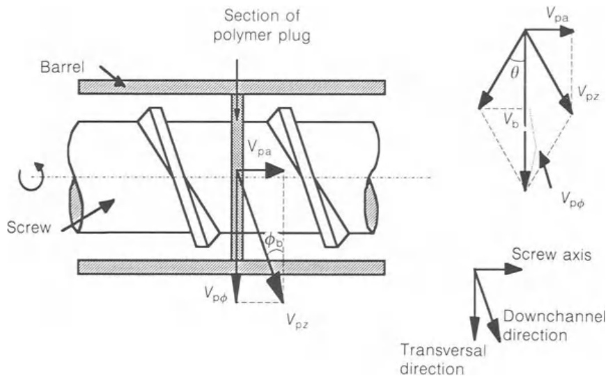  

图7.10 固体输送区截面。

因此，切向固体速度 $V_{\mathrm{p}\phi}$ 小于对应的筒体速度 $V_{\mathrm{b}}$（$\pi ND$，其中 $N$ 为螺杆转速频率）。图7.10同时展示了料斗表面速度与下料通道固体料块速度之间的矢量差，该差值与$V_{\mathrm{b}}$形成角度$\theta$。固体输送角$\theta$与该速度差成反比。当 $\theta = 0$ 时，$V_{\mathrm{pa}} = 0$，输送量为零。若 $V_{\mathrm{bz}} = V_{\mathrm{pz}}$，输出达到最大值且 $\theta = 90 - \phi^{\circ}$。理论上可能出现 $V_{\mathrm{p}\phi} = V_{\mathrm{c}}(\theta = 90^{\circ})$ 的情况，这意味着料柱将沿通道滑落。根据图7.10可得出结论：

$$
\tan \theta = \frac {V _ {\mathrm {p a}}}{V _ {\mathrm {b}} - V _ {\mathrm {p} \phi}} = \frac {V _ {\mathrm {p a}}}{V _ {\mathrm {b}} - V _ {\mathrm {p a}} / \tan \phi_ {\mathrm {b}}} \tag{7.3}
$$

因此,

$$
V _ {\mathrm {p a}} = V _ {\mathrm {b}} \frac {\tan \theta \tan \phi_ {\mathrm {b}}}{\tan \theta + \tan \phi_ {\mathrm {b}}} \tag{7.4}
$$

代入(7.2)：

$$
Q _ {\mathrm {p}} = \pi N D \frac {\tan \theta \tan \phi_ {\mathrm {b}}}{\tan \theta + \tan \phi_ {\mathrm {b}}} \left\{\frac {\pi}{4} \left(D ^ {2} - D _ {\mathrm {i}} ^ {2}\right) - \frac {i t h}{\sin \phi} \right\}. \tag{7.5}
$$

整理：

$$
Q _ {\mathrm {p}} = \pi^ {2} N h D (D - h) \frac {\tan \theta \tan \phi_ {\mathrm {b}}}{\tan \theta + \tan \phi_ {\mathrm {b}}} \left[ 1 - \frac {i t}{\pi (D - h) \sin \bar {\phi}} \right] \tag{7.6}
$$

此表达式无实际应用价值，因参数 $\theta$ 未知。此外，尽管摩擦系数对输送机构至关重要，其影响在公式中并不明显。通过分析固体段所受作用力（如图7.11所示），可推导出第二个关系式。其中包括：料筒与固体间产生的摩擦力 $(F_{1}$，见图7.11)，其作用方向与下料通道方向夹角 $(\theta + \phi)$；固体与螺杆接触产生的摩擦力 $(F_{3}, F_{4}, F_{5})$；料道两侧施加的法向力 $(F_{7}, F_{8})$；以及由下通道方向压降产生的力 $(F_6, F_2)$：

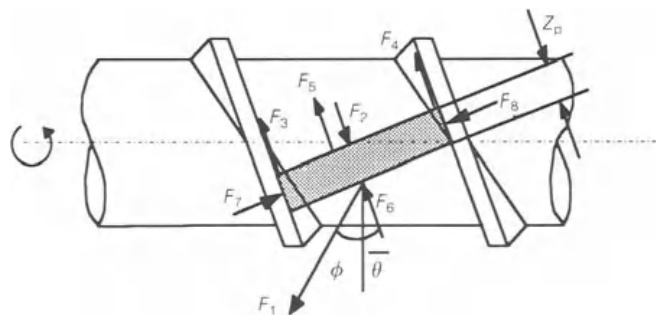 

图7.11 固体塞受力平衡。

$$
F _ {1} = f _ {\mathrm {b}} P b _ {\mathrm {b}} \mathrm {d} z \tag{7.7}
$$

$$
F _ {3} = f _ {s} F _ {7} \tag{7.8}
$$

$$
F _ {4} = f _ {8} F _ {8} \tag{7.9}
$$

$$
F _ {5} = f _ {\mathrm {s}} P b _ {\mathrm {s}} \mathrm {d} z \tag{7.10}
$$

其中 $f_{\mathrm{s}}$ 和 $f_{\mathrm{b}}$ 分别表示固体聚合物颗粒与筒体及螺杆表面的动态摩擦系数；$b$ 为通道宽度；$P$ 为局部压力；且

$$
F _ {7} = P h \mathrm {d} z + F ^ {*} \tag{7.11}
$$

$$
F _ {8} = P h \mathrm {d} z \tag{7.12}
$$

$$
F _ {6} - F _ {2} = h \bar {b} d p \tag{7.13}
$$

而 $F^{*}$ 是维持系统平衡所需的未知力。通过执行力与动量平衡关系 $(\Sigma F = 0, \Sigma M = 0)$，消去 $F^{*}$ 后，可获得 $\theta$ 与 $P$ 的关联表达式。从距离 $z = 0$（此时 $P = P_{1}$）到 $z = Z_{\mathrm{b}}$（此时 $P = P_{2}$）进行积分，结果为：

$$
\cos \theta = K \sin \theta + M, \tag{7.14}
$$

其中 $K$ 是取决于系统几何结构的常数：

$$
K = \frac {\bar {D}}{D} \left(\frac {\sin \bar {\phi} + f _ {\mathrm {s}} \cos \bar {\phi}}{\cos \bar {\phi} - f _ {\mathrm {s}} \sin \bar {\phi}}\right) \tag{7.15}
$$

且 $M$ 为以下表达式：

$$
\begin{array}{l} M = 2 \frac {h f _ {\mathrm {s}}}{b _ {\mathrm {b}} f _ {\mathrm {b}}} \sin \phi_ {\mathrm {b}} \left(K + \frac {\bar {D}}{D} \cot \bar {\phi}\right) + \frac {b _ {\mathrm {s}} f _ {\mathrm {s}}}{b _ {\mathrm {b}} f _ {\mathrm {b}}} \sin \phi_ {\mathrm {b}} \left(K + \frac {D _ {\mathrm {i}}}{D} \cot \phi_ {\mathrm {s}}\right) \\ + \frac {\bar {b} h}{b _ {\mathrm {b}} Z _ {\mathrm {b}} f _ {\mathrm {b}}} \sin \bar {\phi} \left(K + \frac {\bar {D}}{D} \cot \bar {\phi}\right) \ln \left(P _ {2} / P _ {1}\right)  \end{array}
$$

公式（7.14）可重新排列为另一形式：

$$
P _ {2} = P _ {1} \exp \left(\frac {B _ {1} - A _ {1} K}{A _ {2} K + B _ {2}} Z _ {\mathrm {b}}\right) \tag{7.17}
$$

其中 $A_{2}$ 和 $B_{2}$ 是取决于几何形状的常数，而 $A_{1}$ 和 $B_{1}$ 是取决于几何形状、摩擦系数以及固体输送角 $\theta$ 的参数。 $P_{1}$ 和 $P_{2}$ 分别是固体区起始端与终止端的压力值，该固体区具有螺旋长度 $Z_{\mathrm{b}}$。拖曳机构应能以高于相邻熔融区的速率输送固体，以确保工艺稳定性。该机制还需具备优异的压力生成能力，以显著提升挤出机的泵送能力。由于高产量要求增大角速度 $\theta$，故方程(7.14)中的 $K$ 和 $M$ 应取较小值。

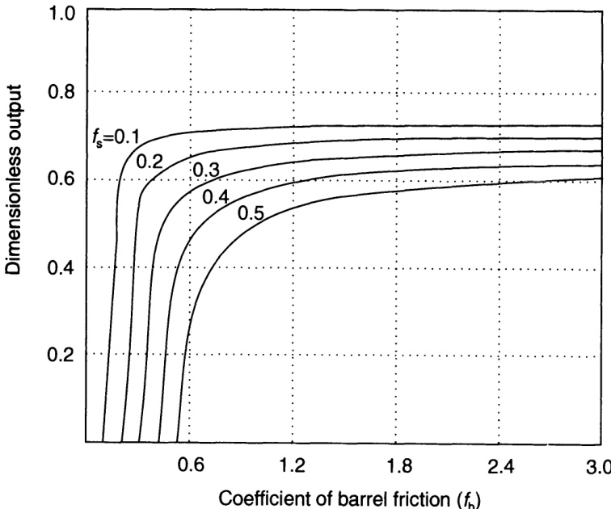 

图7.12 摩擦系数相对大小对固体输送能力的影响。

根据方程(7.15)和(7.17)可得出三个结论。第一，比值 $f_{\mathrm{s}} / f_{\mathrm{b}}$ 应尽可能小。这从理论上解释了为何实践中重视螺杆的抛光或涂层处理，同时允许料筒内壁保持一定的粗糙度。采用PTFE浸渍镀镍工艺也可获得低摩擦螺杆表面。如图7.12清晰所示——采用Rauwendaal（1990）的方法——产量随摩擦系数相对大小的变化而显著改变。该实例表明，对于特定几何结构和螺杆转速，增加料筒表面摩擦 $f_{\mathrm{b}}$ 可能显著影响螺杆性能。若 $f_{\mathrm{b}} \approx f_{\mathrm{s}}$，产量很小；但 $f_{\mathrm{b}}$ 的微小增量即可引起输送能力的显著提升。因此，若设备在该区域运行，不同批次聚合物间的微小差异可能导致工艺显著不稳定。当 $f_{\mathrm{b}} \gg f_{\mathrm{s}}$ 时，产量增加，且操作对材料物理性质变化的稳定性得到保证。此处需指出，目前缺乏在类似工业挤出条件下测量的颗粒状聚合物摩擦系数的准确完整数据，这限制了该理论的实际应用价值及其诊断和解决挤出问题或优化加工条件的潜力。

第二，比值 $P_{2} / P_{1}$ 应尽可能小。由此可推断，固体输送区的产量和压力生成（见方程(7.17)）取决于通道内的初始压力 $P_{1}$。稍后将介绍估算 $P_{1}$ 的方法。当 $P_{2} = P_{1}$ 时达到最大产量。这表明螺杆的输送能力受压力生成需求的影响。压力沿螺杆呈指数增长，由于提高了 $M$ 值而降低了产量。下料通道长度 $Z_{\mathrm{b}}$ 的影响取决于量 $(h / Z_{\mathrm{b}})(\ln (P_{2} / P_{1}))$ 的相对大小。

第三，$D_{\mathrm{i}} / D$ 或 $\bar{D} / D$ 应尽可能小，即通道深度应最大化。图7.13在零压力梯度 $(P_{2} = P_{1})$ 条件下，针对不同 $f_{\mathrm{b}} / f_{\mathrm{s}}$ 比值展示了该影响。不出所料，摩擦系数差异越大，产量越高。若通道深度大幅增加（显然受限于螺杆的机械强度），产量最终将达到最大值后下降。这是由于增加横截面流动面积（方程(7.6)）与增加螺杆螺棱上的阻滞摩擦力 $(F_{3}, F_{4},$ 由方程(7.8)、(7.9)、(7.11)和(7.12)计算），以及下料通道压力梯度 $(F_{2}, F_{6} -$ 见方程(7.13)）之间的冲突效应所致。图7.13明确证实了后者的影响：在恒定通道深度和摩擦特性下，产量随压力发展增加而降低。随着压力增长的重要性增加，最大产量向较低通道深度方向转移。

此外，方程(7.6)表明产量与量 $\left(\tan \theta \tan \phi\right) / \left(\tan \theta + \tan \phi\right)$ 成正比。图7.14中绘制了该项值与螺旋角 $\phi$ 的关系，针对两个 $f_{\mathrm{b}} / f_{\mathrm{s}}$ 比值，并考虑了不同的 $f_{\mathrm{s}}$ 值。假设达到最大产量条件，即无下料通道压力梯度。如预期，料筒内壁/固体界面处较高的摩擦系数有助于提高输送速率。该图表明，对于每种操作条件，均存在一个实现最大流量的最佳螺旋角。如Tadmor和Klein（1970）先前所示，当两个摩擦

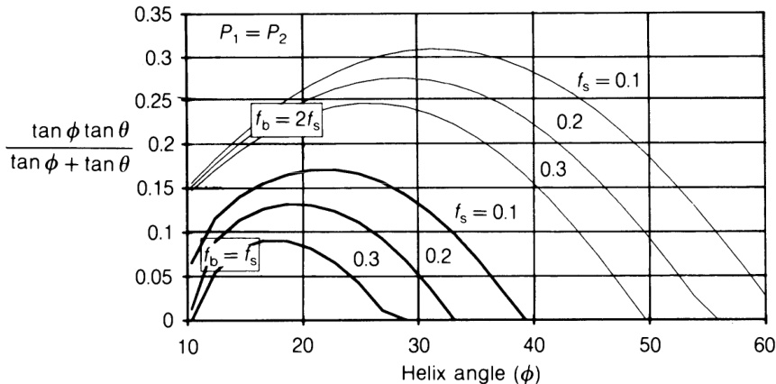  

图7.14 螺旋角对固体输送速率的影响 $(P_{1} = P_{2})$

系数相同且数值为0.3或更高（大多数聚合物常见值）时，最大产量在螺旋角 $15 - 20^{\circ}$ 范围内获得。这解释了为何大多数螺杆加工经典选择 $\phi = 17.56^{\circ}$（等距螺杆）。然而，图7.14还表明，当摩擦系数相对大小增大时，最佳螺旋角增加。值得庆幸的是，当分析中考虑下料通道压力梯度影响时（见图7.15），可观察到最佳螺旋角回移至较低值。在图7.14所示示例中，当 $f_{\mathrm{b}} = 2f_{\mathrm{s}}$ 且 $f_{\mathrm{s}} = 0.3$ 时，最佳角 $\phi \approx 26^{\circ}$。若压力沿通道增加100倍（属正常情况），该值降至约 $15^{\circ}$。因此，等距螺杆应表现出良好的输送能力。

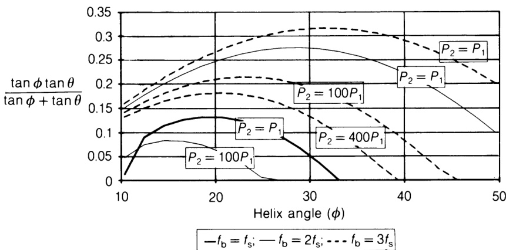 

图7.15 考虑下料通道压力梯度时，螺旋角对固体输送速率的影响。

方程(7.6)还表明产量与螺杆转速成正比，且单头螺纹更有利于固体输送。

固体输送对总过程功耗的贡献由作用在固体塞顶部的摩擦力 $F_{1}$ 与料筒在该力方向上的速度（$\pi ND\cos \theta$）的乘积给出：

$$
\mathrm {d} E _ {\mathrm {w}} = \pi N D (\cos \theta) f _ {\mathrm {b}} b _ {\mathrm {b}} P \mathrm {d} z _ {\mathrm {b}} \tag{7.18}
$$

代入方程(7.17)并积分：

$$
E _ {\mathrm {w}} = \pi N D (\cos \theta) f _ {\mathrm {b}} b _ {\mathrm {b}} Z _ {\mathrm {b}} \left(P _ {2} - P _ {1}\right) / \ln \left(P _ {2} / P _ {1}\right) \tag{7.19}
$$

一个尤其值得商榷的假设是下料通道方向温度恒定。实际上，不仅料筒温度通常在轴向上升高，摩擦对聚合物/金属界面附近温度的发展也有重要贡献。因此，通过轴输入的部分机械功率在所有接触表面转化为热量。例如，料筒表面摩擦产生的热量速率（单位料筒表面积）由料筒与塞体之间的切向力及其相对速度的乘积给出（Broyer和Tadmor，1972）：

$$
q _ {\mathrm {b}} = \pi N D P f _ {\mathrm {b}} b _ {\mathrm {b}} \sin \phi_ {\mathrm {b}} / \sin \left(\phi_ {\mathrm {b}} + \theta\right) \tag{7.20}
$$

考虑到大部分热量在料筒内壁附近产生，沿固体输送区转化为热量的机械功率为：

$$
E _ {\mathrm {w h}} = \pi N D b _ {\mathrm {b}} Z _ {\mathrm {b}} f _ {\mathrm {b}} \frac {\sin \phi_ {\mathrm {b}}}{\sin \left(\phi_ {\mathrm {b}} + \theta\right)} \frac {P _ {2} - P _ {1}}{\ln \left(P _ {2} / P _ {1}\right)} \tag{7.21}
$$

如方程(7.17)所示，压力在该区域呈指数上升。根据关系式(7.20)，热量生成速率与局部压力成正比。因此，若料筒得到有效冷却（这一特点通常在开槽挤出机中加以利用），或材料具有高熔点，则在固体输送过程中——即表面温度达到熔点之前——可产生较大压力。

假设下料通道方向的热传导与径向相比可忽略不计，且螺棱和螺杆根部的热通量不重要，则能量方程简化为方程(4.7)。料筒表面产生的热量（方程(7.20)）部分通过料筒散失，剩余部分传导至固体。因此，在 $yy$ 方向上形成温度分布：

$$
q _ {\mathrm {b}} = - k _ {\mathrm {p}} \left(\frac {\partial T _ {\mathrm {p}}}{\partial y}\right) _ {y = 0} + k _ {\mathrm {b}} \left(\frac {\partial T _ {\mathrm {b}}}{\partial y}\right) _ {y = 0} \tag{7.22}
$$

其中 $k_{\mathrm{p}}$ 和 $k_{\mathrm{b}}$ 分别为聚合物和料筒的热导率，$T_{\mathrm{p}}$ 和 $T_{\mathrm{b}}$ 分别为固体和料筒的温度。Tadmor

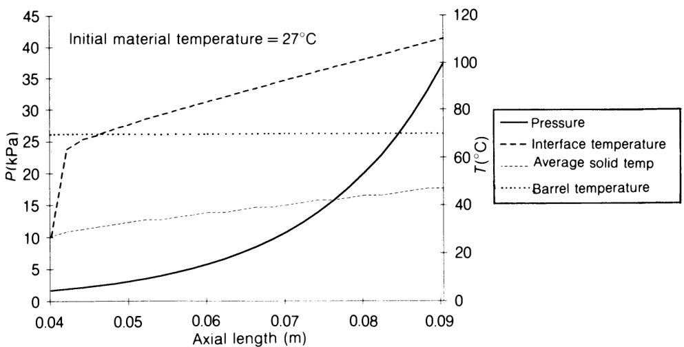 

图7.16 给定操作条件下压力与温度的轴向分布。

和Broyer（1972）对固体床表面进行了微分热平衡分析，并数值求解了传热方程。他们计算了塞体温度分布沿下料通道方向的变化，得出结论：界面表面温度呈指数增长。因此，他们推断第一层聚合物通常在料筒平均温度达到熔融温度之前即熔化，且固体输送过程中产生的最大压力由固体塞表面温升决定。图7.16展示了该现象的模拟结果，针对一台 $60\mathrm{mm}$ 挤出机（Covas和Cunha，1993）。设备特性见表7.2，本章后续示例也将使用该数据。选择了一组操作条件（料筒维持在 $70^{\circ}\mathrm{C}$，螺杆转速 $60\mathrm{rpm}$）。预期的温度与压力指数增长得到证实。由于固体与料筒温度差异，温度增长在初始螺杆圈数中略为复杂。界面温度因热传导与摩擦耗散的联合效应迅速接近料筒设定值。随后，完全由摩擦效应引起的第二次指数增长开始。界面温度在料筒平均温度或固体平均温度之前已提前达到聚合物熔融温度（本例所用LDPE约为 $110^{\circ}\mathrm{C}$）。

表7.2 计算所用螺杆几何参数

| 区段 | 长度 | 螺槽深度 (mm) |
| --- | --- | --- |
| 加料段 | 8D | 10 |
| 压缩段 | 9D | 10–5 |
| 计量段 | 8D | 5 |

等距螺距；$t = 5\mathrm{mm}$；机械间隙 $= 0.5\mathrm{mm}$

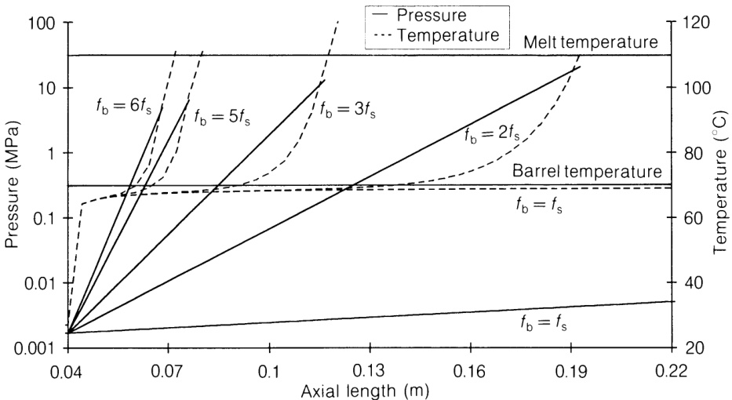 

图7.17 摩擦系数相对大小对固体输送区压力与温度轴向分布的影响。

图7.17展示了摩擦系数相对大小对固体输送区压力和床顶表面温度轴向发展的影响。如预期，这两个参数呈指数增长，遵循图7.16所示模式，主要取决于料筒壁面的摩擦值。若 $f_{\mathrm{b}} = f_{\mathrm{s}}$，压力生成极少，固体输送将占据螺杆的相当长度。随着摩擦因子增大，情况发生变化。对于输入的操作条件组，图示清晰表明：将系数 $f_{\mathrm{b}}$ 从 $f_{\mathrm{s}}$ 的两倍增至六倍，可使固体输送所占螺杆长度从0.19缩短至 $0.07\mathrm{m}$。然而，机械热耗散引起的过早聚合物熔融未必导致更高的最大压力。图7.17同样表明：当 $f_{\mathrm{b}} = f_{\mathrm{s}}$ 时最大压力仅为 $0.01\mathrm{MPa}$，而 $f_{\mathrm{b}} = 2f_{\mathrm{s}}$ 时产生的显著增长（最大压力达 $20.6\mathrm{MPa}$）并不随料筒摩擦增加而持续。实际上，更高的 $f_{\mathrm{b}}$ 反而产生逐渐降低的压力增长（分别为13.0、6.5和 $5.0\mathrm{MPa}$）。如Tadmor和Broyer（1972）所指出的，单螺杆挤出机具有防止压力过度升高的固有保护机制，因为塞体表面温度只能达到物料熔点。超过该位置后，延迟区形成，压力增速降低。

图7.17所示曲线是在恒定产量条件下计算的，而实际操作中，如上所述，料筒壁面较高摩擦有利于输送机构。图7.18所示示例考察了典型LDPE挤出级物料在已选定的 $60\mathrm{mm}$ 挤出机上的加工过程，该挤出机连接至一个由锥形适配器和口模组成的简单机头（生产 $6\mathrm{mm}$ 圆棒）。输入常规操作条件（料筒温度分布和螺杆转速）。采用本书所述的塑化过程数学描述，所开发的计算机程序包能够确定在保证口模出口处压降近似为零前提下的产量（及相关功能参数，如压力和温度分布）（Covas和Cunha，1993）。该图展示了两种不同料筒摩擦系数条件下固体输送区压力和温度的轴向增长。由于两种情况下产量的差异同时影响传热和耗散机制，上述保护机制使得压力升高差异可达一个数量级以上。将料筒壁面摩擦系数从0.3增至0.9，有效质量产量从44.6增至 $51.1\mathrm{kg}\mathrm{h}^{-1}$，同时固体输送区长度从0.09缩短至小于 $0.08\mathrm{m}$。料筒在略超过 $0.08\mathrm{m}$ 处达到聚合物熔融温度。产生的最大压力从0.009增至 $3.36\mathrm{MPa}$。

### 料斗中的流动

如上所述，评估固体输送效率需要 $P_{1}$ 信息，即过程起始端的初始压力。通常，假设该压力等于料斗底部的压力，可通过散粒固体分析计算。然而，该方法忽略了从料斗中颗粒固体重力流动到螺杆通道中拖曳诱导流动的复杂过渡。从静态储存切换到流动模式期间，情况更为复杂，因为超压会迅速向上传播通过物料（Shamlou，1988）。尽管如此，该方法提供了料斗与挤出机性能之间的联系，从而反映了实际经验中对这种依赖关系的认识。也可忽略料斗，假设 $P_{1}$ 源于局部重力和离心力效应（Lovegrove和Williams，1973）。该方法考虑了在形成塞流之前通道可能部分充满物料的情况。然而，它未能考虑上述料斗与挤出机之间的关联。如Tadmor和Gogos（1979）所指出的，显然需要一个包含料斗、挤出机进料口区域和前几圈螺杆（Darnell-Mol模型无法适用的区域）的模型。

在此情况下，建立料斗中物料流动模型的目的在于：确保足够的产量，即工艺产能不受料斗限制；通过参数 $P_{1}$ 提供料斗与挤出机之间的联系；以及建立最小化容器底部压力波动的装料/操作条件。

料斗的几何形状决定了流动模式以及在卸料过程中固体内部产生的压力分布。料斗可为圆锥形（产生轴对称流动），或楔形（产生平面流动）。后者半角约大 $8 - 10^{\circ}$，提供更有效的储存容量，但这被尖锐角落处可能发生的物料积聚所抵消（Roberts，1991）。可形成两种不同的流动模式。整体流（mass flow）期间，颗粒整体朝向出口流动，仅存在微小速度梯度，保证容器完全排空。漏斗流（funnel flow）中，运动仅限于容器中心的垂直区域。形成稳定管状流，滞留物料起支撑作用。流动不稳定，可能引起离析。两种情况的组合也可能出现。整体卸料更为可取，因为出口一打开通常即开始流动，流动中断（如拱结）倾向小，且不会出现死区，先进先出。

目前尚无能够关联卸料速率对垂直压力分布影响的理论。通常仅考虑静态装料或敞开卸料情况。推导流量方程因颗粒或粉末状固体复杂且仍不甚明了的流变学而变得困难。因此，大多数作者将关联式拟合至其实验数据，或采用量纲分析。如Beverloo、Leniger和de Velde（1961）提出的方程可量化粗颗粒通过平板或收缩容器的重力卸料。对于中心锥形孔口，质量卸料速率为：

$$
Q = 0. 5 8 \rho g ^ {0. 5} (D - k d _ {\mathrm {p}}) ^ {2. 5} \tag{7.23}
$$

其中 $D$ 为孔径，$d_{\mathrm{p}}$ 为颗粒直径，$k$ 为颗粒形状常数，平均值为1.4。考虑一个具有 $6\mathrm{cm}$ 开口的锥形料斗，容纳直径约 $3\mathrm{mm}$ 的颗粒，物料堆积密度 $600\mathrm{kg}\mathrm{m}^{-3}$，预计质量流量可达 $3000\mathrm{kg}\mathrm{h}^{-1}$。这比具有相同进料口几何形状的常规挤出机预期产量高出超过一个数量级。因此，挤出机料斗中固体的压力分布可能更适合采用静态条件描述，而设计目的则需考虑卸料条件（以计入产生的显著超压）。底部压力对装料条件的依赖性此时更为显著。

一个世纪前，Janssen（1895）考虑了作用在垂直圆柱形固体柱中所含小物料切片上的力平衡，预测了垂直压力分布：

$$
P _ {\mathrm {v}} = \rho g D \left\{1 - \exp \left[ - (K f D / 4) h \right] \right\} / 4 f K \tag{7.24}
$$

其中 $\rho$ 表示物料堆积密度，$g$ 为重力加速度，$f$ 为壁面摩擦系数，$D$ 为料斗直径，$h$ 为距顶部表面的深度，$K$ 为容器中侧向压力与法向压力之比。固体的重量主要由侧壁承载。在固体顶部（$h = 0$）$P_{\mathrm{v}}$ 等于静水压力，而 $h \to \infty$ 产生的最大值为：

$$
P _ {\mathrm {v}} (\max) = \rho g D / 4 f \tag{7.25}
$$

因此，不同于液体柱底部静水压力随高度线性增加，在固体柱中，堆积压力呈指数增长直至达到渐近值。该临界高度位置取决于几何形状和材料性质。从实用角度，若需避免螺杆初始圈数中的压力变化，临界高度对应于料斗中应保持的最低固体料位。对于收缩段（静态条件），Walker（1966）假设垂直面上不存在剪切应力，并假定任意水平面的垂直压力等于其上方物料量所产生的静水压力。由此得出的线性垂直压力分布计算式为：

$$
P _ {\mathrm {v}} = \rho g \left[ \left(P _ {\mathrm {v o}} / \rho g\right) + h \right] \tag{7.26}
$$

$P_{\mathrm{vo}}$ 表示收缩段顶部的压力，$h$ 为所考虑的高度。如图7.19所示，该图展示了装料高度对锥形圆柱料斗垂直压力分布的影响，底部压力对固体高度的依赖性很强。该图还比较了三种装料高度下的静态和动态垂直压力分布。在敞开卸料过程中，动态分析预测

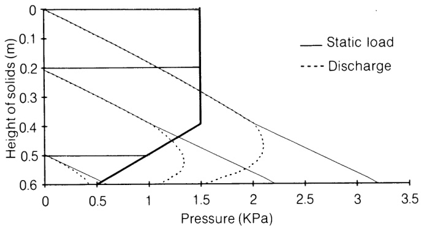

图7.19 锥形圆柱料斗装料和敞开卸料期间计算的垂直压力分布。

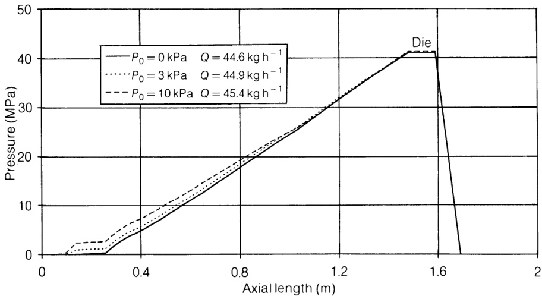 

图7.20 料斗底部压力对连接口模的挤出机轴向压力分布发展的影响。

底部压力在0.4至 $1.5\mathrm{kPa}$ 之间变化，而假设静态条件时，预测压力在 $0.6 - 3.2\mathrm{kPa}$ 范围内变化。图7.20展示了料斗装料高度对前述案例中挤出机和口模性能的预测影响。三条轴向压力曲线对应三种不同的料斗底部压力，同时给出了质量产量。由于压力升至兆帕级别，而装料高度差异仅为千帕级别，曲线之间的偏差几乎不可察觉，且趋向于在口模出口处减弱。然而，当初始压力 $(P_{1})$ 从0变化至 $10\mathrm{kPa}$ 时，产量增加约 $1.8\%$。该效应与前一章讨论的熔体输送中机械间隙的影响相当。

### 延迟区

当靠近料筒壁面的固体由于热传导与热生成的联合效应达到其熔点时，一层薄熔膜形成。自此位置起，基于固体界面摩擦力差异的固体输送机理被另一种利用拖曳流的机理所取代，此时聚合物黏度扮演了摩擦的角色。延迟区持续发展，直至形成引发熔融机理的条件。原则上，预计该过程会持续至熔膜厚度等于螺棱与料筒内壁之间的机械间隙。此时，由于间隙的产量能力低于熔融物料的泄漏量，熔池将在螺杆推进螺棱附近形成。然而，实践观察发现，熔池仅在膜厚达到间隙值的5-7倍时才会增长。该行为可能由以下几种原因导致（Agassant, Aynes和Sergent, 1986）：

1. 反向膜流将固体塞推向螺杆推进螺棱，从而使过程启动困难。

2. 熔池仅在固体床变形时出现，即局部压力大于床层屈服应力时。间隙中横跨通道方向的最大压降发生在膜厚达到机械间隙的三倍时。已有研究表明（Kacir和Tadmor，1972；Agassant、Avenas和Sergent，1986），对于等温牛顿熔体，横跨通道压力由下式给出：

$$
\Delta P = \frac {6 \eta V _ {\mathrm {b}}}{\sin \phi_ {\mathrm {b}}} \frac {\delta_ {\mathrm {f}} - \delta}{\frac {\delta^ {3}}{t} + \frac {\delta_ {\mathrm {f}} ^ {3}}{b}} \tag{7.27}
$$

其中 $\eta$ 为聚合物黏度，$\delta_{\mathrm{f}}$ 和 $\delta$ 分别为熔膜和间隙的厚度。压力随 $\delta_{\mathrm{f}}$ 与 $\delta$ 差值增大而升高，在膜厚等于1.5倍螺棱间隙时达到最大值。若考虑非牛顿和非等温效应，则如前所述，当 $\delta_{\mathrm{f}}$ 约为螺棱间隙的2.5–3倍时达到最大值。若间隙足够大，产生的应力将低于材料的屈服应力。在此情况下，Tadmor熔融机理不会发生，或发展非常缓慢，转而可能发展为类似Dekker的机理。

3. 熔融物料最终可能渗透进入颗粒间隙，使膜厚增长速度减慢。

膜厚的增长直接取决于热传导与热生成的相对贡献。虽然传热机理与熔融区相似，但在延迟区，任何新熔融物料都积聚在膜中，增加膜厚，而非被螺杆刮入熔池。然而，该模型不适用于膜形成的初始阶段，此时需解决固体聚合物颗粒的熔融问题。多位学者研究了颗粒固体床的熔融（Pearson, 1976; Kuo和Chung, 1989），但均假设初始存在一层薄熔膜。Kacir和Tadmor（1972）假设球形聚合物颗粒且熔体渗透深度不超过颗粒半径，对该问题进行了研究。结果表明仅 $5\%$ 的延迟区需用该模型处理。

预测从延迟区到相邻熔融区过渡的位置并不容易。确定延迟区长度的两种最常用判据为：计算形成约为机械间隙厚度5.6倍的材料膜所需的通道长度，实验发现这是延迟区结束时的平均膜厚（Kacir和Tadmor, 1972）；以及采用基于不同热塑性塑料可视化实验结果的经验关联式。图7.21展示了延迟区长度与熔融速率之间的关系，以无因次熔融参数 $\psi$ 表示（Tadmor和Klein, 1970）。

在该区域，压力初始由料筒上的黏性拖曳和螺杆上的摩擦产生。因此，不仅方程(7.6)仍然有效，而且在图7.11所示的固体塞力平衡中，只需将摩擦力 $F_{1}$（方程(7.7)）替换为由以下公式给出的黏性拖曳力：

$$
F _ {1} = \tau b _ {\mathrm {b}} \mathrm {d} z _ {\mathrm {b}}, \tag{7.28}
$$

其中 $\tau$ 为剪切应力。膜中的平均剪切速率为：

$$
\dot {\gamma} = \frac {V _ {\mathrm {b}} \sin \phi_ {\mathrm {b}}}{\delta_ {\mathrm {f}} \sin (\phi_ {\mathrm {b}} + \theta)} \tag{7.29}
$$

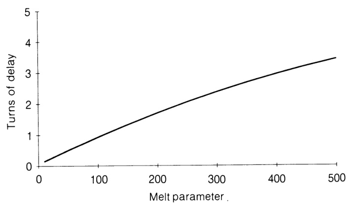  

图7.21 延迟区长度，以熔融参数 $\psi$ 表示（改编自Tadmor和Klein, 1970）。

由此产生的压力升高为（Kacir和Tadmor, 1972）：

$$
P _ {3} = \frac {\tau b _ {\mathrm {b}} (\cos \theta - K \sin \theta)}{A _ {3} K - B _ {3}} \left[ 1 - \exp \left(\frac {B _ {3} - A _ {3} K}{A _ {2} K + B _ {2}} Z _ {\mathrm {b}}\right) \right] + P _ {2} \exp \left(\frac {B _ {3} - A _ {3} K}{A _ {2} K + B _ {2}} Z _ {\mathrm {b}}\right)\tag{7.30}
$$

其中 $A$ 和 $B$ 与之前相同（见方程(7.17)），为取决于系统几何形状、摩擦系数和固体输送角的常数。驱动力 $F_{1}$ 在过程前期很大，因为小膜厚产生显著剪切应力（见方程(7.29)）。随着膜厚增加，剪切速率降低，$F_{1}$ 减小。因此，可观察到延迟区开始处压力升高，随后下降。情况可能更为复杂，因为虽然大部分熔融发生在料筒内壁附近，其他固体床表面的摩擦系数也可能引起物料熔融。这种情况类似于Chung（1970）的假设，他研究了被熔融材料膜包围的固体塞的输送机理。虽然方程(7.6)仍然成立，但当各界面膜厚度相同且材料遵循幂律时，预计沿通道的压力为线性升高。

### 开槽进料衬套

如前所述（并由图7.12所示），固体输送的效率和稳定性随聚合物与料筒之间及聚合物与螺杆之间摩擦系数差异的增加而提高。图7.18将此概念扩展至塑化挤出，通过案例研究证明，有效过程产量随比值 $f_{\mathrm{b}} / f_{\mathrm{s}}$ 的增加而提高。确保该操作模式的一种实用方法是通过加工轴向或螺旋沟槽大幅增加料筒内壁表面粗糙度。该方案最初于二十世纪七十年代初在德国提出并试验，用于加工高分子量HDPE，随后在欧洲得到广泛应用。配备开槽进料衬套的设备通常被称为正排量泵送装置，其产量与材料密度和螺杆转速成正比，且与口模阻力无关（然而，尽管具备这种正向进料和早期良好压力生成能力，螺杆仍需熔融并充分均化物料，这本身往往限制了可进料的物料速率）。

实际经验证明，沟槽的数量和几何形状取决于螺杆直径、所加工聚合物的性质及原料类型。通常，沟槽数量随螺杆直径增大及加工较软塑料而增加。沟槽总数通常在 $D / 10$ 至 $D / 5$ 之间。沟槽常为矩形截面，其深度从料斗开口下方的最大值开始线性减小，长度为 $2D$ 至 $4D$。较小的锥角对物料压缩较轻，因此产生较低的剪切应力。虽然沟槽的主要目的是增加等效摩擦系数，但其相对于通道深度和颗粒尺寸的较大尺寸常常改变了固体的常规流动。Grünschloss（1990）采用视频技术观察了粉末在锥形进料衬套中的流动，并得出结论：在轴向沟槽中，固体沿槽方向和横跨槽方向均有显著速度，而在螺旋沟槽方案中，物料沿小通道移动，从而改善了自清洁能力。速度场影响压力生成机制，使得该区域的数学处理相当复杂。此外，它们可能也解释了开槽进料挤出机加工粉末时性能提升相对有限的原因。

在料筒上加工沟槽会显著改变挤出机的特性，并需要对其设计和结构进行多项改进。

- 需具备冷却开槽衬套的能力，并在料筒其余长度上设置热屏障。有必要避免因高摩擦力产生的强烈热量导致物料过早熔融（料筒壁面热量生成速率如方程(7.20)所示，与产生的压力和 $f_{\mathrm{b}}$ 成正比）。通过冷却通道损失的能量可达机械输入功率的15–40%，具体取决于所加工物料。然而，"单位功耗"（即每单位挤出产品的能耗）可能低于常规设备，因为所需能量的增加被提高的输送能力充分补偿（Rauwendaal, 1990）。基于塑料的摩擦系数通常随温度升高而增加这一事实，Menges、Feistkorn和Fischbach（1984）提出开槽衬套不应过快地冷却固体，而仅应阻止熔膜的形成。采用温度控制的开槽衬套（水温维持在 $70^{\circ}\mathrm{C}$），他们观察到了更高的熔体产量，并称效率从45%提高到80%。图7.22补充了图7.18所提供的信息，并说明了控制料筒初始段温度如何影响塑化过程。沟槽的整体效果通过考虑一个相对较高的 $f_{\mathrm{b}}$ 值（取为螺杆表面摩擦的4.5倍）进行模拟。当选择常规料筒温度分布时（见图7.18中料筒温度分布），增加料筒壁面摩擦使质量产量从44.6增至 $51.1\mathrm{kg}\mathrm{h}^{-1}$。若料筒温度在 $0.18\mathrm{m}$（相当于 $3D$）长度上维持 $70^{\circ}\mathrm{C}$，则相应地

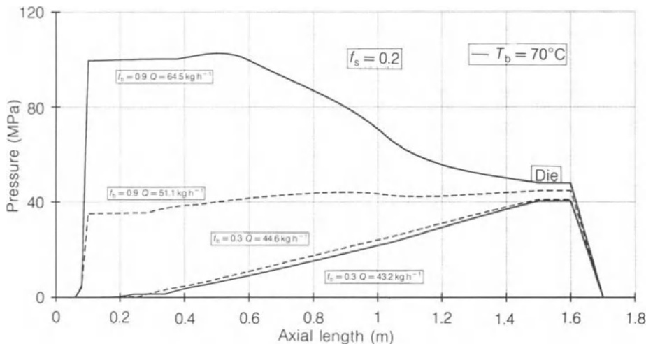

图7.22 控制料筒初始段温度如何影响轴向压力分布和过程质量产量。选择了两种不同的料筒内壁摩擦系数。

延长了固体输送区（从0.090增至 $0.096\mathrm{m}$），加之压力的同步指数增长，促进了产量的提高。特别是，对于高摩擦料筒壁面，产量从51.1提升至 $64.5\mathrm{kg}\mathrm{h}^{-1}$。预计压力可达 $100\mathrm{MPa}$，实际中亦常观测到。

- 需使用更高强度的螺杆和料筒材料。增加料筒壁面附近的摩擦会促进磨损，并产生可高达 $100 - 300\mathrm{MPa}$ 的显著早期压力。因此，不仅沟槽长度需保持较短（通常小于 $5D$），所用结构材料也需具备较高强度和耐磨性。

- 需配备功率更大的电机。如方程(7.21)所示，增加 $f_{\mathrm{b}}$ 要求在相同螺杆转速下提供更大扭矩。

- 需采用较低压缩比的螺杆。为将压力维持在合理范围内，通常采用低压缩比螺杆。然而，由于较高产量意味着物料在挤出机内停留时间更短，需要更高的熔融效率。这导致了配备剪切混合段或混合环的复杂螺杆构型的发展。

由于需修改螺杆、增强磨损可能性、增加设备成本以及更大的质量顾虑（存在熔融被额外固体产出超出的可能性），一些作者得出结论：使用开槽进料段通常不合理，因为采用适当尺寸的挤出机配合良好的螺杆通常可获得良好特性（Steward, 1989）。然而，对开槽进料挤出机理论理解和技术上的持续改进，使其在吹塑、吹膜以及管材和型材挤出中得到广泛应用。与加工中表现出的优势相比，较高的设备成本和其他缺点被认为是次要的。

如上所述，沟槽效应的数学处理是复杂的（有关先前理论工作的参考文献列表，参见Potente, 1985）。Potente（1985）引入了简单近似解来计算等效摩擦系数 $f_{\mathrm{bg}}$，即由沟槽几何形状效应产生的料筒壁面摩擦系数。以下方程与实验数据吻合良好：

$$
f _ {\mathrm {b g}} = f _ {\mathrm {b}} + \left(f ^ {*} - f _ {\mathrm {b}}\right) \frac {b _ {\mathrm {g}} N _ {\mathrm {g}}}{\pi D} \left\{1 - \exp \left[ - 5 \left(\frac {h _ {\mathrm {g}} N _ {\mathrm {g}}}{b _ {\mathrm {g}}}\right) ^ {0. 9} \right] \right\} \tag{7.31}
$$

其中 $f^{*}$ 为内摩擦系数，$b_{\mathrm{g}}$ 为沟槽宽度，$N_{\mathrm{g}}$ 为沟槽数量，$h_{\mathrm{g}}$ 为最大沟槽深度。

也可考虑沟槽底部与料筒表面粗糙度的差异。螺旋沟槽的优势已由Rauwendaal（1990）进行了定量解释。最佳螺旋角随螺杆螺旋角的增加和沟槽深度的减小而增大。

## 7.3.2 熔融

Tadmor和Klein（1970）开发的模型以合理的数学复杂度提供了理解和描述单螺杆挤出机中Maddock熔融机理的手段。由此得出的解析方程可方便地用于研究系统几何形状、操作条件或聚合物热物理性质对熔融速率的影响。该模型在文献中相当流行，并常用于挤出软件包。本节也将采用该模型，以提供与相邻功能区间一致的物理边界条件。

考虑图7.23，该图展示了Tadmor熔融机理发展过程中的螺杆通道截面（该图本质上对应于图7.2中考虑的一个切面，是图7.2所示横截面的简化示意）。如前所述，采用直角坐标系，将料筒视为以恒定速度 $V_{\mathrm{b}}$ 沿与下料通道方向 $z$ 成 $\phi$ 角方向滑动的无限板。固体床和熔池均具有矩形截面，熔池占据整个通道高度，而一层厚度为 $\delta_{\mathrm{f}}$ 的薄熔膜将固体床与料筒内壁隔开。料筒维持在 $T_{\mathrm{b}}$，固体床/熔膜界面则处于聚合物熔融温度 $T_{\mathrm{m}}$。在任一特定位置，固体占据宽度 $X$，显然小于通道宽度 $b$。塞体以

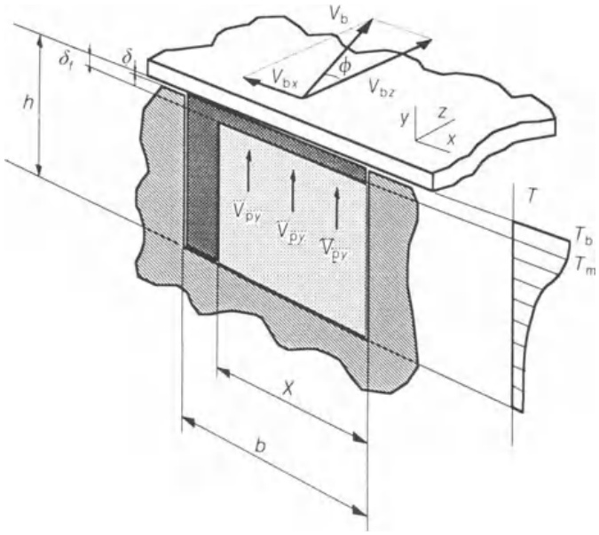  

图7.23 熔融过程中通道的理想化横截面。

恒定的下料通道速度 $V_{\mathrm{pz}}$ 移动，并具有 $yy$ 方向的分量 $V_{\mathrm{py}}$，正如第7.2节所述，该分量对应于过程的熔融速率。因此，固体的熔融发生在塞体顶部表面，新熔融材料形成的膜在 $xx$ 方向被拖曳至熔池。熔融过程在 $X = b$ 时开始，在 $X = 0$ 时完成。重要的是要了解熔融沿螺杆的进展，并确定熔融物料所占的通道长度（通常记作 $z_{\mathrm{t}}$），因为它决定了螺杆后续用于熔体泵送和混合阶段的剩余长度。假设以下条件成立：

- 通道为矩形，宽度为 $b$，深度为 $h$，且充满聚合物。间隙对熔融进展和产量的影响忽略不计。

- 固体床表现为均匀弹性连续体。

- 存在稳态。在熔融区通道的任一位置，料筒处于温度 $T_{\mathrm{b}}$，熔膜/固体床界面处于 $T_{\mathrm{m}}$。固体占据宽度 $X$，该值沿下料通道方向递减。

- 就传热而言，固体床具有无限深度。忽略与螺杆之间的传热。该简化忽略了固体床沿螺杆移动过程中的渐进加热，使模型无法预测熔融过程后期通常出现的加速现象。因此，预测值通常偏于保守。

- 熔融仅发生在固体床外表面与料筒内壁附近熔膜所构成的界面。由于忽略来自熔池的热传导，问题简化为单维传热。虽然大部分熔融发生在所考虑的界面处，预测值将再次偏于保守。然而，避免这种简化将大大增加计算复杂性，因为需采用四区或五区模型以考虑围绕固体的熔膜的存在。

- 熔融膜在平行板之间移动。假设固体床/熔膜界面锋利且平坦，从而简化了图7.2所示的更真实几何形状。流动在两块以不等速度 $V_{\mathrm{b}}$ 和 $V_{\mathrm{pz}}$ 且沿不同方向移动的平行板之间发展。如图7.24所示，更简便的做法是假设下板（固体顶面）保持静止并处于温度 $T_{\mathrm{m}}$，上板处于温度 $T_{\mathrm{b}}$，以速度 $V_{j}$ 运动，该速度与下料通道方向成角 $\alpha_{\mathrm{j}}$。由图7.24：

$$
\vec {V} _ {j} = \vec {V} _ {\mathrm {b}} - \vec {V} _ {\mathrm {p z}} \tag{7.32}
$$

$$
V _ {j} = \left[ \left(V _ {\mathrm {b} z} - V _ {\mathrm {p} z}\right) ^ {2} + V _ {\mathrm {b} x} ^ {2} \right] ^ {1 / 2} \tag{7.33}
$$

$$
\tan \alpha_ {j} = \frac {V _ {\mathrm {b x}}}{V _ {\mathrm {b z}} - V _ {\mathrm {p z}}} = \frac {V _ {b} \sin \phi_ {\mathrm {b}}}{V _ {\mathrm {b}} \cos \phi_ {\mathrm {b}} - V _ {\mathrm {p z}}} \tag{7.34}
$$

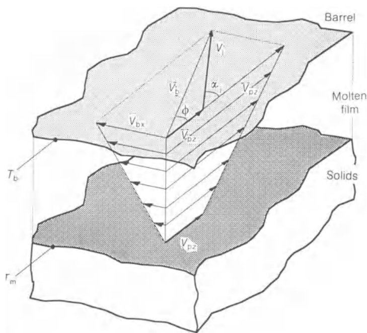

图7.24 料筒与固体床之间的速度差。

- 熔体为牛顿流体，因此熔膜速度分布为线性；相应的剪切速率为 $V_{j} / \delta_{\mathrm{f}}$。熔体主要在横跨通道方向被移除，该速率主要由速度分量 $V_{\mathrm{bx}}$ 决定。因此，熔膜厚度在 $\mathbf{zz}$ 方向的变化很小。

- 聚合物的热物理性质恒定。与固体输送中一样，若针对小的下料通道增量进行计算，则可考虑压力、温度和剪切速率的局部变化对这些性质的影响。

在任一通道位置，固体宽度 $X$ 可通过固体质量衡算确定。考虑下料通道方向上一个小塞体增量，在位置 $\Delta z$ 进入单元的固体速率等于在位置 $(z + \Delta z)$ 离开单元的固体速率与通过固体/熔膜界面因熔融而离开的固体速率之和：

$$
\rho_ {\mathrm {p}} V _ {\mathrm {p} z} h X \mid_ {z} = \rho_ {\mathrm {p}} V _ {\mathrm {p} z} h X \mid_ {z + \Delta z} + V _ {\mathrm {p} y} \rho_ {\mathrm {p}} \bar {X} \Delta z \tag{7.35}
$$

该方程中 $V_{\mathrm{py}}$、$X$ 和 $V_{\mathrm{pz}}$ 均为未知量。由于 $V_{\mathrm{pz}}$ 被假设在整个过程中恒定，在熔融开始前可写出：

$$
G = \rho_ {\mathrm {p}} V _ {\mathrm {p} z} h _ {0} b \tag{7.36}
$$

其中 $G$ 为塑化过程的质量流量（假设已知），$h_0$ 为熔融过程起始处的通道深度。因此，方程(7.35)中仍有两个未知量。固体/熔膜界面处的热量衡算可提供所需的第二个关系式。在此情况下，由熔膜传导至界面的热量速率，部分通过热传导从界面传入固体，部分用于熔融物料。数学表达为：

$$
k _ {\mathrm {m}} \left(\frac {\partial T}{\partial y}\right) _ {y = 0} - k _ {\mathrm {p}} \left(\frac {\partial T}{\partial y}\right) _ {y = 0} = V _ {\mathrm {p y}} \rho_ {\mathrm {p}} \lambda \tag{7.37}
$$

其中 $k_{\mathrm{m}}$ 和 $k_{\mathrm{p}}$ 分别为熔融聚合物和固体聚合物的热导率，$\lambda$ 为聚合物的熔融热。该方程需要了解熔体和固体中的温度分布。因此，必须求解能量方程并计算膜厚 $\delta_{\mathrm{f}}$。这导致求解 $X$ 的计算过程相对复杂：

1. 熔膜和固体塞的温度分布。必须求解动量方程和能量方程。

2. 固体/熔膜界面处的传热速率。

3. 界面处的热量衡算（方程(7.37)）。

4. 熔膜中的质量衡算。用于计算 $\delta_{\mathrm{f}}$。考虑下料通道方向上的一小段

熔膜长度。可写出：

[在 $z$ 处进入单元的   
先前已熔融物料速率] +   
[通过界面进入单元的   
新熔融聚合物速率] =   
[在 $z + \Delta z$ 处离开增量段的物料速率] +   
[离开增量段以供给   
熔池的物料速率]

或数学表达为：

$$
\rho \bar {V} _ {z} X \delta_ {\mathrm {f}} | _ {z} + V _ {\mathrm {p y}} \rho_ {p} \bar {X} \Delta z = \rho \bar {V} _ {z} X \delta_ {\mathrm {f}} | _ {z + \Delta z} + \left(V _ {\mathrm {b x}} / 2\right) \rho \bar {\delta} _ {\mathrm {f}} \Delta z \tag{7.38}
$$

其中 $\bar{V}_z$ 和 $V_{\mathrm{bx}} / 2$ 分别为熔膜在下料通道方向和横跨通道方向的平均流速，$\bar{X}$ 和 $\delta_{\mathrm{f}}$ 为沿增量段的平均值。

5. 固体床中的质量衡算（方程(7.35)）。

6. 求解系统几何形状所得的微分方程。由此可获知函数 $X(z)$ 及 $z_{\mathrm{t}}$。

上述步骤中获得的各相关方程将在以下段落中给出。

1. 熔膜中的温度分布。由动量方程（单维流动，$x = j$ 方向，边界条件为 $\nu_{j}(0) = 0$ 和 $\nu_{j}(\delta_{\mathrm{f}}) = V_{j}$），得出线性熔膜速度分布。将该分布代入能量方程 $(x = j)$ 并积分（边界条件 $T(0) = T_{\mathrm{m}}$ 和 $T(\delta_{\mathrm{f}}) = T_{\mathrm{b}}$），最终得到：

$$
\frac {T - T _ {\mathrm {m}}}{T _ {\mathrm {b}} - T _ {\mathrm {m}}} = \frac {\eta V _ {j} ^ {2} y}{2 k _ {\mathrm {m}} \delta_ {\mathrm {f}} \left(T _ {\mathrm {b}} - T _ {\mathrm {m}}\right)} \left(1 - \frac {y}{\delta_ {\mathrm {f}}}\right) + \frac {y}{\delta_ {\mathrm {f}}} \tag{7.39}
$$

无因次项 $\eta V_{j}^{2} / 2k_{\mathrm{m}}(T_{\mathrm{b}} - T_{\mathrm{m}})$ 通常称为Brinkman数 $B_{\mathrm{r}}$，用于量化黏性热生成相对于热传导供热的重要性。如图7.25所示（图中展示了熔膜中几种可能的温度分布），当 $B_{\mathrm{r}} < 2$ 时，黏性耗散有限，因此熔膜温度始终低于料筒温度。然而，若 $B_{\mathrm{r}} > 2$，黏性耗散变得显著，熔体温度可能局部超过料筒设定值。这具有明显的实际意义，特别是在加工温度敏感型聚合物时，这意味着即使在口模处熔体温度适中，

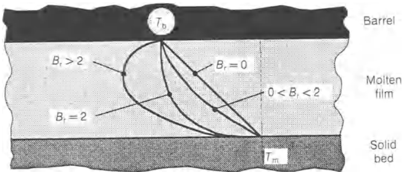

图7.25 熔膜中的温度分布及相应的Brinkman数。

聚合物也可能降解。这也意味着提高料筒温度 $T_{\mathrm{b}}$ 将降低 $\eta$，进而降低黏性耗散，可能导致熔膜温度降低。可确定确保 $B_{\mathrm{r}} \leq 2$ 的 $V_{\mathrm{b}}$ 最大值，即对于特定料筒温度，可计算避免聚合物过早降解的最大推荐螺杆频率。

2. 固体中的温度分布。积分能量方程，边界条件为 $T(0) = T_{\mathrm{m}}$ 和 $T(-\infty) = T_{\mathrm{p}}$，得到：

$$
\frac {T - T _ {\mathrm {p}}}{T _ {\mathrm {m}} - T _ {\mathrm {p}}} = \exp \left(\frac {V _ {\mathrm {p} y}}{\alpha_ {\mathrm {p}}} y\right), \tag{7.40}
$$

其中 $\alpha_{\mathfrak{p}}$ 为固体聚合物的热扩散系数。

3. 由熔膜至界面及由界面至固体的单位面积热通量分别为：

$$
 [ q ] _ {\mathrm {y} = 0} = \frac {k _ {\mathrm {m}}}{\delta_ {\mathrm {f}}} \left(T _ {\mathrm {b}} - T _ {\mathrm {m}}\right) + \frac {\eta V _ {j} ^ {2}}{2 \delta_ {\mathrm {f}}} \tag{7.41}
$$

$$
 [ q ] _ {\mathrm {y} = 0} = \rho_ {\mathrm {p}} C _ {\mathrm {p}} V _ {\mathrm {p y}} \left(T _ {\mathrm {m}} - T _ {\mathrm {p}}\right) \tag{7.42}
$$

其中 $C_{\mathfrak{p}}$ 为固体聚合物的比热容。

4. 界面热量衡算与熔膜质量衡算。联立描述两个衡算的方程，所得表达式简化为：

$$
\omega = V _ {\mathrm {p y}} \rho_ {\mathrm {p}} X = \frac {V _ {\mathrm {b x}}}{2} \rho_ {\mathrm {p}} \delta_ {\mathrm {f}} = \Omega \sqrt {X} \tag{7.43}
$$

其中

$$
\delta_ {\mathrm {f}} = \left\{\frac {\left[ 2 k _ {\mathrm {m}} \left(T _ {\mathrm {b}} - T _ {\mathrm {m}}\right) + \eta V _ {j} ^ {2} \right] X}{V _ {\mathrm {b x}} \rho_ {\mathrm {p}} \left[ C _ {\mathrm {p}} \left(T _ {\mathrm {m}} - T _ {\mathrm {p}}\right) + \lambda \right]} \right\} ^ {2} \tag{7.44}
$$

$$
\Omega = \sqrt {\left\{\frac {V _ {\mathrm {b x}} \rho_ {\mathrm {m}} \left[ k _ {\mathrm {m}} \left(T _ {\mathrm {b}} - T _ {\mathrm {m}}\right) + \eta V _ {j} ^ {2} / 2 \right]}{2 \left[ C _ {\mathrm {p}} \left(T _ {\mathrm {m}} - T _ {\mathrm {p}}\right) + \lambda \right]} \right\}} \tag{7.45}
$$

参数 $\Omega$ 是熔融速率的度量。分子与供熔融所用的热量速率成正比，包括热传导（第一项）和黏性耗散（第二项）的贡献。分母表示将温度为 $T_{\mathrm{p}}$ 的固体转化为温度为 $T_{\mathrm{m}}$ 的熔体所需的热量。相关的聚合物性质为热容 $C_{\mathrm{p}}$ 和熔融热 $\lambda$。熔融速率随料筒温度 $T_{\mathrm{b}}$ 和螺杆转速（含于 $V_{\mathrm{bx}}$ 中）的增加而提高，但这显然受限于聚合物可能发生的降解，正如Brinkman数 $B_{\mathrm{r}}$ 所表达。熔融速率也因固体聚合物预热（即提高 $T_{\mathrm{p}}$）而增加，因为这降低了熔融所需的热量。然而，该方案需谨慎考虑，因为聚合物颗粒可能黏附在进料口壁上，阻碍固体向螺杆初始圈数的流动。

5. 固体床中的质量衡算。以下微分方程描述熔融过程：

$$
 \frac {\mathrm {d} (h X)}{\mathrm {d} z} = \frac {\omega}{\rho_ {\mathrm {p}} V _ {\mathrm {p z}}} \tag{7.46}
$$

6. 系统几何形状的影响。对于恒定深度通道，将方程(7.43)代入(7.46)并积分，取初始条件 $X(z_{1}) = X_{1}$（其中 $z_{1}$ 为任意螺旋距离），并利用方程(7.36)：

$$
\frac {X}{b} = \frac {X _ {1}}{b} \left[ 1 - \frac {\Omega b h _ {0}}{2 G h \sqrt {X _ {1}}} (z - z _ {1}) \right] ^ {2} \tag{7.47}
$$

若 $X(0) = b$：

$$
\frac {X}{b} = \left(1 - \frac {\Omega \sqrt {b} h _ {0}}{2 G h} z\right) ^ {2} \tag{7.48}
$$

熔融所需的总螺旋长度 $z_{\mathrm{t}}$ 可通过方程(7.48)在 $X = 0$（熔融完成）时确定：

$$
z _ {\mathrm {t}} = \frac {2 G h}{\Omega \sqrt {b} h _ {0}}. \tag{7.49}
$$

若熔融在其起始的几何段内完成，则 $h \simeq h_0$。如第7.3.1节所述，并由图7.21所示，延迟区下料通道长度可与无因次熔融参数 $\psi$ 关联。该参数表示单位下料通道固体/熔体界面熔融速率 $(\omega / X)$ 与固体速率 $(V_{\mathrm{pz}} \rho_{\mathrm{p}})$ 之比：

$$
\psi = \frac {\Omega}{V _ {\mathrm {p z}} \rho_ {\mathrm {p}} \sqrt {X} _ {1}} = \frac {\Omega \sqrt {b}}{G / h _ {0}} \tag{7.50}
$$

方程(7.47)-(7.49)可分别改写为：

$$
\frac {X}{b} = \frac {X _ {1}}{b} \left[ 1 - \frac {\psi}{2 h} (z - z _ {1}) \right] ^ {2} \tag{7.51}
$$

$$
\frac {X}{b} = \left(1 - \frac {\psi}{2 h} z\right) ^ {2} \tag{7.52}
$$

$$
z _ {\mathrm {t}} = \frac {2 h}{\psi} \tag{7.53}
$$

对于通道深度线性递减的锥形通道：

$$
h = h _ {1} - A z \tag{7.54}
$$

其中 $h_1 = h(z = 0)$，$A$ 为锥度（由 $(h_1 - h_2) / Z_{\mathrm{comp}}$ 给出），方程(7.51)-(7.53)分别变为：

$$
\frac {X}{b} = \frac {X _ {1}}{b} \left[ \frac {\psi}{A} - \left(\frac {\psi}{A} - 1\right) \sqrt {\left(\frac {h _ {1}}{h _ {1} - A z}\right)} \right] ^ {2} \tag{7.55}
$$

$$
\frac {X}{b} = \left[ \frac {\psi}{A} - \left(\frac {\psi}{A} - 1\right) \sqrt {\left(\frac {h _ {1}}{h _ {1} - A z}\right)} \right] ^ {2} \tag{7.56}
$$

$$
z _ {\mathrm {t}} = \frac {h _ {1}}{\psi} \left(2 - \frac {A}{\psi}\right) \tag{7.57}
$$

Tadmor和Gogos（1979）将对流对熔膜温度分布的影响纳入考虑，并得出结论：上述方程高估了熔融速率。他们还推导了与本文所给出等效的关系式，但针对幂律流体。

若要计算熔融沿螺杆的进展或熔融所需的通道长度，必须具备聚合物的热物理性质、系统几何形状以及质量产量数据。应首先计算熔融速率（方程(7.45)），并将其值代入方程(7.51)-(7.53)或(7.55)-(7.57)，具体取决于系统几何形状。然而，为确定 $\Omega$，必须已知 $V_{j}$（由方程(7.32)结合(7.36)计算）和 $\eta$。因此，必须估计平均熔膜温度和剪切速率。前者作为一阶近似并忽略黏性耗散，可取为 $(T_{\mathrm{b}} + T_{\mathrm{m}}) / 2$。后者由比值 $V_{j} / \delta_{\mathrm{f}}$ 给出。平均膜厚可估计为其最大值的一半，该最大值在熔融过程开始时达到，如方程(7.44)所示。考虑黏性耗散的影响，平均膜温为：

$$
\bar {T} = \frac {1}{\delta_ {\mathrm {f}}} \int_ {0} ^ {\delta_ {\mathrm {f}}} T \mathrm {d} y = \frac {T + T _ {\mathrm {m}}}{2} + \frac {\eta V _ {j} ^ {2}}{1 2 k _ {\mathrm {m}}} \tag{7.58}
$$

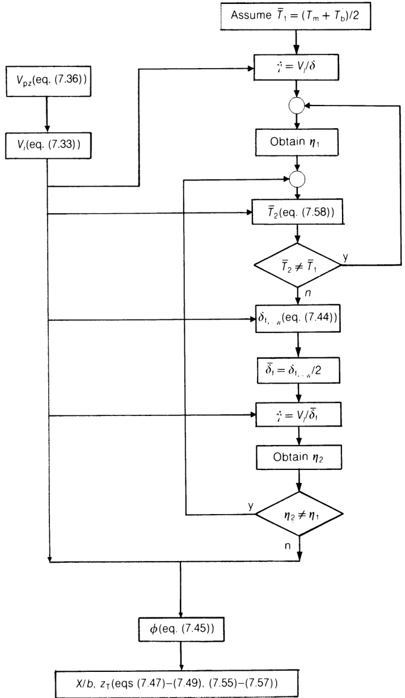 

图7.26 应用Tadmor熔融模型计算缩减固体床宽度或熔融所需长度。

若采用迭代方法，可校正平均膜温和膜厚的初步估计值。图7.26所示流程图展示了如何在计算熔融速率 $\Omega$ 之前评估 $V_{j}$ 和 $\eta$。同样应注意螺杆几何形状对熔融发展的重要性。例如，若熔融在螺杆加料段开始，则很可能在压缩段继续发展。在此情况下，

可用方程(7.49)确认熔融是否会在其起始的几何段内完成。若不能，则通过应用方程(7.48)，可确定对应于加料段至压缩段过渡位置 $z$ 处的 $X$。此时方程(7.55)应适用。最终，若熔融在压缩段内尚未完成，将采用相同的推理，此时用方程(7.47)描述螺杆计量段内的熔融过程。

对于恒定深度通道，熔融长度与质量流量成正比，与熔融速率 $\Omega$ 成反比（方程(7.49)）。由于操作条件的影响包含在该参数中（见方程(7.45)），可轻松得出三个结论。第一，增加螺杆转速（含于 $V_{j}$ 中）促进黏性耗散，从而提高熔融速率。遗憾的是，由于物料在挤出机内的平均停留时间缩短，热传导项变小。总体效果必然取决于聚合物黏度水平。图7.27模拟了增加螺杆转速对缩减固体床宽度 $X / b$ 的影响，即对螺杆通道内固体（$X = b$）被熔体流（$X = 0$）取代所需轴向长度的影响（以前节所述挤出机和聚合物为例）。熔融机理的起始取决于前序固体区（及延迟区）所发展的条件。该图清晰显示，在较高螺杆频率下运行时，螺杆更大部分用于熔融，尽管各曲线之间的差异随螺杆转速增加而减小。这种行为显然是由于随螺杆转速增加，黏性耗散的重要性逐渐增强所致。该图还表明，高螺杆转速从产量角度可能令人鼓舞，但从产品质量角度则存在疑问。事实上，在

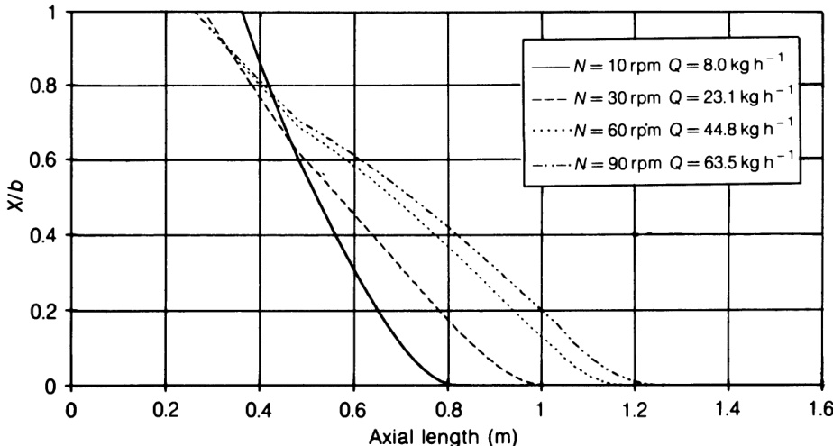 

图7.27 螺杆转速对固体床分布的影响。

高螺杆频率下运行时，几乎或完全没有螺杆长度剩余用于熔体混合和泵送目的。Tadmor和Klein（1970）明确表明，当以高于特定产量所需的螺杆转速运行设备，同时在口模处施加高背压（例如，可通过在口模上安装压力阀实现）时，可在产量与挤出物质量之间达到良好折衷。该策略的效果可借助前一章给出的 $Q$（产量）对 $P$（压力）图轻松理解。由于口模曲线斜率的降低以及挤出机特性的垂直位移，操作点移向更高压力。在此条件下，应注意黏性耗散最终可能发挥的关键作用。

第二，提高料筒温度可提升熔融速率，因为热传导的贡献增加。料筒设定温度显然受限于聚合物热降解的可能性。同时，由于熔体黏度的逐步降低，黏性耗散分量将下降。根据关联式(7.45)，熔融所需的热量为 $[C_{\mathrm{p}}(T_{\mathrm{m}} - T_{\mathrm{p}}) + \lambda]$。事实上，热量不仅用于熔融物料，还用于将其加热至膜的平均温度 $\bar{T}$（方程(7.58)）。因此，需要输入的总热量为：

$$
q _ {\mathrm {b}} = C _ {\mathrm {m}} \left(\bar {T} - T _ {\mathrm {m}}\right) + C _ {\mathrm {p}} \left(T _ {\mathrm {m}} - T _ {\mathrm {p}}\right) + \lambda \tag{7.59}
$$

基于上述考虑，对于特定螺杆转速、物料和挤出机几何形状，可能存在最大化热传导与黏性耗散联合效应的最佳料筒温度。图7.28展示了针对本章所述案例进行模拟的结果。如预期，Tadmor熔融过程的起始点和缩减固体床宽度轴向分布均取决于料筒设定温度（图7.28(a)）。前者的变化可轻松在图7.28(b)中识别，该图绘制了不同操作条件下的轴向压力分布。在固体输送期间经历指数增长后，压力增加速率在延迟区降低，但在熔融和熔体输送期间恢复。螺旋长度 $z_{\mathrm{t}}$ 随料筒温度升高至 $190^{\circ}\mathrm{C}$ 而减小，似乎在该温度达到最小值（图7.28(c)）。因此，在本示例中，较低热生成与将新形成熔体升温所需额外热量的联合效应，超过了增强热传导的效应。

第三，如上所述，提高固体的入口温度 $T_{\mathfrak{p}}$ 可增加熔融速率。采用本文给出的方程并以小下料通道增量计算，可更新 $T_{\mathfrak{p}}$ 值（见方程(7.40)）并考虑固体沿通道的渐进加热。此时预测结果将与所观察到的熔融过程在末期的加速现象相符。

锥形通道中的熔融长度总是短于恒定通道（比较方程(7.57)与(7.53)）。压缩效应可

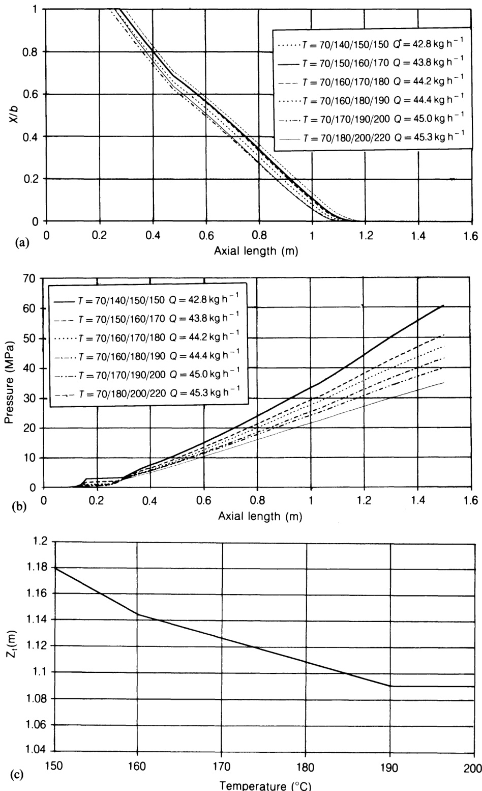 

图7.28 料筒温度对熔融影响的模拟：(a) 对固体床分布的影响；(b) 对轴向压力分布的影响；(c) 对熔融所需通道长度的影响。

视为暴露于热量与剪切下的固体相对宽度增加，而深度 $h$ 减小。该行为在图7.29中以我们的案例进行了说明（比较了三根在计量段具有不同通道深度的螺杆的性能，其他参数保持不变——另见表7.2）。当 $A = 0$ 时，方程(7.56)和(7.57)分别简化为方程(7.52)和(7.53)。在此情况下，缩减固体床宽度分布呈现抛物线形回归。随锥度增加，该下降趋势逐渐变为较低的凹度，继而变为凸形，同时 $z_{\mathrm{t}}$ 缩短。锥度 $A$ 越大，$z_{\mathrm{t}}$ 越短。当 $A / \psi = 1$ 时达到极限，熔融所需长度为其最小值：

$$
z _ {\mathrm {t}, \min } = \frac {h _ {1}}{\psi} \tag{7.60}
$$

在此情况下，固体床宽度在熔融过程中保持恒定，然后 $X$ 在无穷小距离内减小至零。图7.30展示了针对不同锥度 $A$ 值预测的四种缩减固体床分布。如上所述，熔融过程在恒定深度通道中较慢，而若 $A = \psi$ 则可获得最大效率。其他两种中间情况将产生凹形（$A / \psi \ll 0.5$）或凸形（$A / \psi \gg 0.5$）熔融分布。在实际情况下，熔融速率可能无法匹配压缩速率，导致观察到的固体床宽度沿通道增加。该现象已在第7.2节中讨论，可能导致因通道堵塞而引发严重挤出不稳定。Rauwendaal（1990）已证明，当压缩段长度 $L_{\mathrm{c}}$ 满足以下条件时，可避免堵塞：

$$
L _ {\mathrm {c}} \geq \frac {V _ {\mathrm {p} z} \sqrt {X _ {1}} h _ {1} \rho_ {\mathrm {p}} \left(C _ {\mathrm {R}} - 1\right) \sin \phi}{\Omega C _ {\mathrm {R}}}, \tag{7.61}
$$

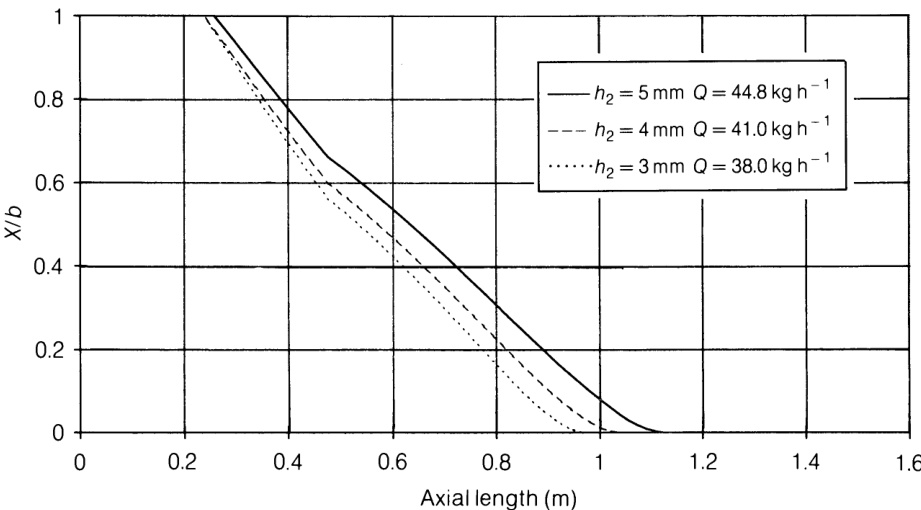 

图7.29 通道深度对固体床分布的影响。

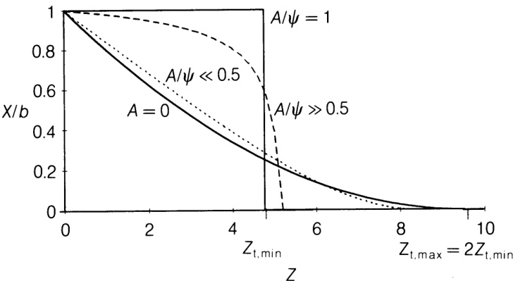

图7.30 锥度 $A$ 对固体床分布的影响。

其中 $C_{\mathbb{R}}$ 为压缩比 $(h_1 / h_2)$，$h_1$ 和 $X_1$ 分别为锥度起始处的通道深度和固体宽度。显著的压缩比要求相对较长的压缩段。

熔融期间螺杆驱动所提供的机械功率可计算为聚合物与料筒内壁之间界面（熔融区）处的做功速率。因此，总功耗由熔膜中的功耗 $E_{\mathrm{f}}$、熔池中的功耗 $E_{\mathrm{m}}$ 和机械间隙中的功耗 $E_{\mathrm{g}}$ 组成：

$$
E _ {\mathrm {w}} = E _ {\mathrm {f}} + E _ {\mathrm {m}} + E _ {\mathrm {g}} \tag{7.62}
$$

各分量可通过在相关料筒表面上对速度与力（剪切应力）的乘积进行积分计算。对于本节假设的牛顿等温情况，通道长度 $dz$ 内熔池中的功耗可通过方程(8.7)（熔体泵送）计算，将通道宽度 $b$ 替换为局部熔池宽度 $b - X$。同理，间隙中的功耗由方程(8.8)给出，该方程在假设局部压力流相对于拖曳流较小的情况下获得。Rauwendaal（1990）针对幂律流体计算了 $E_{\mathrm{f}}$。Tadmor和Klein（1970）采用不同方法，将膜下料通道增量中引入的功率确定为黏性耗散引入的能量速率，其表达式为：

$E_{\mathrm{f}} = [\text{增量 } \mathrm{dz} \text{ 中黏性耗散引入的能量速率}]$

$= \{\mathrm{[熔融所需热量]}$ - [料筒表面传导的热量]

$\times$ [熔融质量速率]

料筒界面处传导的热量通过对方程(7.39)微分得到：

$$
X [ q ] _ {y = \delta_ {\mathrm {r}}} = \frac {X k _ {\mathrm {m}} \left(T _ {\mathrm {b}} - T _ {\mathrm {m}}\right)}{\delta_ {\mathrm {f}}} \tag{7.63}
$$

熔融质量速率为 $Q_{x}\rho_{\mathrm{m}}\mathrm{d}z$，其中 $Q_{x} = \delta_{\mathrm{f}}V_{\mathrm{bx}} / 2$。因此，

$$
\mathrm {d} E _ {\mathrm {f}} = \frac {\delta_ {\mathrm {f}} V _ {\mathrm {b x}} \rho_ {\mathrm {m}}}{2} \left[ C _ {\mathrm {m}} (\bar {T} - T _ {\mathrm {m}}) + C _ {\mathrm {p}} (T _ {\mathrm {m}} - T _ {\mathrm {p}}) + \Omega - \frac {X k _ {\mathrm {m}}}{\delta_ {\mathrm {f}}} \left(T _ {\mathrm {b}} - T _ {\mathrm {m}}\right) \right] \mathrm {d} z \tag{7.64}
$$