# 8 能量平衡原理

## 8.1 能量平衡与效率

前两章讨论了挤出机的质量产量及其与螺杆转速和背压的关系，但已提及能量因素对商业操作中有用产量施加了额外的限制。本章的目的是建立单螺杆挤出机的能量平衡方程，考察该平衡的各组成部分及其依赖的因素，并推导操作条件的有意变化对能量平衡的总体影响。这些方面在文献中大多被忽视，因此将其纳入使理论与实践经验的关联性更强，并允许进一步合理地制定操作策略。

如果将挤出过程视为一个整体系统，它接收常温下的原料聚合物，通过耗能过程将聚合物转化为半成品或可销售产品，这些产品通常也处于常温。聚合物的比能量含量仅因化学降解、结晶度变化、残余压力或应力、形状变化等而发生微小变化，且此类能量含量的变化很少能在产品的最终使用中被利用。因此，能量消耗被视为制造过程的必然伴随物，效率以每千克有用产品的比能量输入（焦耳）来定义。这至少同样取决于聚合物和产品的特性以及过程本身，因此与后者的效率关系不大。它也难以揭示对单位产量或产品质量的影响，为此需要对过程及其相互作用进行更深入的研究。主要的能量输入是加热聚合物，无论是有意加热至成型所需温度，还是在混合等随机过程中偶然加热，以及提供由此产生的对周围环境的热损失。快速生产要求在成型后，通过大量低温冷却介质（第4.3节）降低产品的温度和热含量，导致环境空气或冷却水中的小温升和低品位热量。已有提议

回收这些废热，这些热量无论如何都有助于空间加热，从而降低总能耗。然而，只有当将其应用于例如预热原料聚合物进料（第9.1节）时，才会对过程本身产生影响。因此，就能源而言提高效率的主要机会在于减少过程所需的能量输入；因此以下分析集中于挤出机内部的能量平衡和利用，以为成型过程提供具有正确温度和混合程度的聚合物。

图8.1中的框图显示了挤出机的能量输入来自三个来源：(i) 进料焓 $I_{1}$；(ii) 转动螺杆的机械能 $E$；以及(iii) 来自加热器的能量 $H$。能量输出为产品的焓 $I_{2}$ 和挤出机的损失 $S$。由于质量连续性，输入和输出质量相同，因此方便地仅考虑产品焓的增加 $I$，其中：

$$
I = I _ {2} - I _ {1} \tag{8.1}
$$

在稳态下，能量平衡为：

$$
E + H = I + S \tag{8.2}
$$

逐一考虑各项，施加到螺杆轴上的机械功率 $E$ 可用于加热聚合物；如果部分转化为机筒表面或进料口密封处的摩擦热，这些热量可用于加热聚合物或计入进料口冷却损失或辐射损失，因此包含在平衡项 $I$ 和 $S$ 中。如果 $E$ 在驱动电机输出端测量，则传动皮带或齿轮以及轴承中的损失必须包含在总损失 $S$ 中以实现平衡；如果 $E$ 通过驱动装置的电或液压输入来测量，则电机损失也必须包含在 $S$ 中，因为它们不能用于加热聚合物。来自加热器的能量 $H$ 方便地以加热器的电或流体热输入来测量，因为难以将加热器表面的热损失与

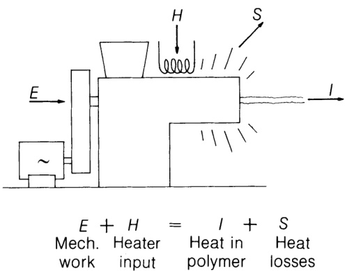

图8.1 挤出机能量平衡。

挤出机本身暴露区域的热损失分开；如果移除电加热器，那么额外暴露的机筒表面会有可观的热损失，因此将这种损失单独归因于加热器是不合理的。当对机筒、螺杆或进料口进行冷却时，移除的热量必须作为计算 $H$ 时的负输入，或作为损失 $S$ 的一个组成部分。由于机筒冷却通常仅在加热器关闭时进行，作者倾向于将其计为负输入 $H$，而对进料口（和螺杆）的冷却是为了控制聚合物输出温度以外的目的而进行的，无论机筒加热或冷却，因此计入损失 $S$。因此术语 $H$ 表示必须有意施加的加热（或冷却）能量以维持稳态操作条件。

在挤出机内没有诸如聚合、交联、降解、水解或与添加剂反应等化学反应的情况下，对恒定质量聚合物的能量输入是焓的增加加上压力能：

$$
I = m \int_ {T _ {1}} ^ {T _ {2}} C _ {\mathrm {p}} \mathrm {d} T + p (V + \mathrm {d} V) \tag{8.3}
$$

如果气体或蒸气在排气中被移除，这既代表质量的减少也代表额外的能量损失。进料通常处于或接近大气温度和压力；如果使用预热或熔体进料，特别是在压力下，$I_{1}$ 变得显著，必须扣除以得到焓的增加 $I$（方程(8.1)）。否则，焓的增加由质量流量（千克每秒）乘以机器末端从室温起算的比焓（热含量*）（焦耳每千克）来充分表示。在螺杆末端，聚合物也处于升高的压力下，相应的压力能（方程(8.3)中右侧第二项）必须加到焓的增加上以得到对聚合物的总能量输入。这可能占能量输入的高达约 $15\%$，许多作者（Bernhardt, 1959; Fisher, 1976）将其作为单独的项。螺杆对聚合物做的功等同于压缩机中的"压缩和输送"功；然而，这用于迫使聚合物通过口模，功在那里转化为摩擦热，提高聚合物和/或口模的温度。由于在口模出口处压力通常为大气压，可以通过将能量输入 $I$ 取为质量流量乘以聚合物在口模出口温度下的焓来排除压力项；无论如何，这通常是加工的关键温度；

$$
I = \rho Q \int_ {T _ {1}} ^ {T _ {2}} C _ {\mathrm {p}} \mathrm {d} T \tag{8.4}
$$

*平均比热对熔体温度的小变化有效，但对总能量平衡无效（第4.1节）

由于适配器和口模刚性连接到机筒，它们之间的热流难以确定，因此能量平衡中方便地将机筒和口模一起处理。则加热器输入 $H$ 应包括对口模的热量，损失 $S$ 包括来自口模的热损失——在大型片材或管材口模的情况下，这些可能占总量的相当大比例，但彼此不一定相等。

损失 $S$（图8.2）包括从机筒、口模和加热器到周围环境的对流和辐射，到机筒和口模支撑件的传导，以及纵向到一端的进料口和另一端的任何口模附件（如定型板）的传导。到进料口的传导在进料口冷却和传递到轴承组件的热量中重新出现。通过空气或流体冷却螺杆也从系统中移除热量——这些损失的估计在附录C.1中考虑，但前述强调了包含所有因素的重要性，例如通过在尽可能接近实际操作条件下进行测量。

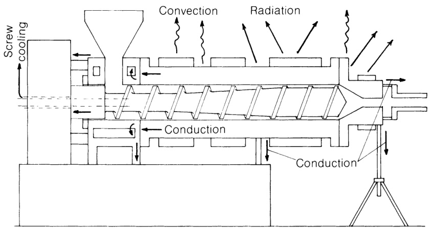

图8.2 热损失。

在没有预热的情况下简化为：

$$
\Phi = \frac {I _ {2}}{E + H} = \frac {I _ {2}}{I _ {2} + S} \tag{8.6}
$$

显然，这个效率值将取决于 $E$、$H$ 和 $S$ 的值，因此取决于后者的定义方式；如果功率输入在驱动电机输入或输出端测量，$E$ 和 $S$ 将相应更大，效率 $\Phi$ 比在螺杆处测量功率时更低。操作条件的微小变化对效率的影响将是类似的，但必须记住，某些驱动装置如Schrage和AC整流子电机以及磁滑差联轴器的效率随负载和/或速度变化很大。因此基于电输入计算的效率变化可能更多地反映驱动装置的效率而非挤出机的效率，不同机器之间的比较可能具有误导性。

由于能量平衡及其对挤出过程性能的影响尚未在定量方面广泛讨论，附录C.1中就半技术和生产机械的前者实验测量给出了一些评论；适用于研究单元的特殊设备和技术不在本工作范围内。

## 8.2 螺杆中的功耗：牛顿等温情况

机械功率通过螺杆在螺槽中的聚合物质量内转动以及螺杆螺棱与机筒之间的剪切而被吸收。前者引起聚合物的内部剪切，但仅凭借聚合物与机筒壁之间的周向剪切应力分量；因此对于总功率来说，将螺杆和聚合物视为相对于机筒一起旋转，以相同的应力分量和螺杆对机筒的相对速度来考虑是充分的。由于螺棱上的剪切速率将远大于螺槽上的剪切速率，剪切应力将不同，两个区域方便地分开考虑。平行于螺杆轴线的剪切应力分量将对机筒产生推力，并对螺杆和推力轴承产生相等的反作用力；然而，由于在该方向上不发生运动，不做功，周向或切向分量代表功率的消耗。

牛顿行为意味着给定聚合物的粘度仅是温度的函数，而不是剪切速率的函数；这也意味着一个方向上的有效粘度（剪切应力与剪切速率之比）不会受到其他方向上剪切分量的影响，因此各分量可以独立处理——这对于假塑性流体是不成立的。等温限制意味着有效温度以及因此粘度在两个方向上是相同的，在螺杆螺棱上也是相同的。此外，它

意味着由于表面剪切和聚合物质量内部的粘性加热被瞬时耗散（例如到机筒和螺杆），因此温度和粘度不是时间的函数，不会对速度分布产生反作用（第4.3节）。

为了在第6章中推导速度和剪切速率的表达式，机筒相对于螺杆的总速度 $\pi DN$ 被分解为沿螺槽和跨螺槽的分量（方程(6.4)和(6.5)）。此处遵循的方法（感谢Weeks和Allen（1962））是推导与速度分量相对应的剪切应力，并将它们重新组合以得到切向上的总剪切应力。距离螺杆表面深度 $y$ 处的剪切速率由方程(B.7)和(B.11)给出。令 $y = h$，这些方程给出机筒表面处的剪切速率，并分别代入方程(6.16)和(6.24)中的压力梯度 $\mathrm{d}P / \mathrm{d}z$ 和 $\mathrm{d}P / \mathrm{d}x$，得到以 $Q / Wbh$ 和速度分量表示的壁面剪切速率。乘以（牛顿）粘度后，这些给出相应的剪切应力，从中获得切向分量。将它们求和并乘以机筒表面积和切向速度得到吸收的功率。螺棱上吸收的功率采用类似方法。详细推导见附录C.2。因此，在螺槽长度 $\mathrm{dz}$ 中吸收的功率为：

$$
E _ {\mathrm {C h}} = \frac {\eta W ^ {2} b \mathrm {d} z}{h} \left[ 4 \left(1 + \tan^ {2} \phi\right) - \frac {6 Q}{W b h} \right] \tag{8.7}
$$

在螺棱间隙中吸收的功率为：

$$
E _ {\mathrm {F l}} = \frac {\eta W ^ {2} t \mathrm {d} z}{\delta \cos \phi} \tag{8.8}
$$

在熔体输送段长度 $\mathrm{dz}$ 中吸收的总功率为：

$$
E _ {\mathrm {d z}} = \frac {\eta W ^ {2} b \mathrm {d} z}{h} \left[ 4 (1 + \tan^ {2} \phi) - \frac {6 Q}{W b h} \right] + \frac {\eta W ^ {2} t \mathrm {d} z}{\delta \cos \phi} \tag{8.9}
$$

对于熔体输送段中具有恒定螺距 $p$ 和深度 $h$ 的螺杆，在螺旋长度为 $Z$ 的螺槽中的总功率由方程(8.9)给出，其中 $dz$ 替换为 $Z$，其中：

$$
Z = \frac {L}{\sin \phi} \tag{6.1}
$$

$L$ 为相应的轴向熔体长度。

对于恒定直径 $D$ 但变深度 $h$ 的螺杆，方程(8.9)可以积分，或更简单地通过将功率在若干元件中求和来近似，每个元件具有恒定深度，对每个元件应用方程(8.9)并使用适当的 $h$ 值。注意对于恒定螺距，$W, b, \phi$ 和 $t$ 是常数，螺棱间隙 $\delta$ 通常也是常数；

体积流量 $Q$ 由连续性保持恒定，因此 $h$ 的变化值意味着 $Q / Wbh$ 的变化值。表6.1中基于方程(6.69)的水平线定性地显示了沿锥形螺杆长度的功率变化，忽略了由项 $\tan^2\phi$ 表示的横向分量。这些表明在螺杆的深槽部分功率几乎不受背压影响，功率输入通常向螺杆浅槽部分增加，这在高背压下最为显著。方程(8.9)的右侧项与 $h$ 无关，因此可以直接从 $Z$ 的值计算，如同恒定深度螺杆一样。

熔体段中吸收的功率是最可能受操作条件变化影响的，包括随之而来的有效熔体长度变化。在通常没有强制进料的单螺杆挤出机中，输送固体聚合物吸收的功率可能只占总功率的一小部分，除螺杆转速外受操作变化的影响很小，预期与转速大致成正比。如第7章所述，熔融的几种可能机制极其复杂，温度和剪切速率将随螺槽中的位置以及各圈螺棱之间而变化。熔融消耗的功率固有地包含在熔融完成位置的估计中，在绝热条件下约等于质量流量乘以聚合物在熔融温度下的热含量（焓）（图A.2）。对于半结晶聚合物，这可取为结晶熔点（表A.1），对于无定形聚合物取为软化点（例如高于 $T_{\mathrm{g}}$ 约 $30^{\circ}\mathrm{C}$）。例如，如果需要确定现有驱动电机的最大产量，建议将熔融吸收的功率加到熔体输送段（方程(8.9)）的功率中。由此获得的总功率对于小机器和低转速将是过高估计，因为熔融的相当多能量来自加热器，但对于较大机器或较高转速，随着接近绝热点，它将逐渐变得更加准确。

如第166页所建议，为估计有效熔体长度 $Z$，熔融完成的位置可从Tadmor熔融模型理论计算；实验上难以测量，但不太可能小于任何恒定深度"计量段"的长度（特别是阶梯式螺杆），也不太可能大于产生压力的长度。

在本工作中，将假设熔体输送段开始处聚合物的比焓 $(\mathrm{J} \, \mathrm{kg}^{-1})$ 是恒定的，不论达到该点之前加热器和机械功率对螺杆的相对贡献如何。因此，操作条件变化导致的熔体输送段功率输入变化以及因而熔体温度变化将由方程(8.9)给出，尽管已知总功率输入和能量平衡也会受到熔融机制相关变化的影响。在分析方程(8.9)关于

独立变量（转速、背压、螺杆直径、长度、深度和螺棱间隙）影响之前，必须讨论确定粘度的适当温度值。由于方程(8.9)基于机筒壁处的剪切应力，该位置的温度和粘度是相关的，而不是整个螺槽的"平均混合"温度；后者即使通过复杂取样或集成多点测量方法也难以可靠测量。在实践中，机筒附近的温度将在一定程度上受跨螺槽循环（第6.2节）的影响，特别是在剧烈加热或冷却条件下，以及受螺槽内剪切热分布（第8.4节）的影响。它还将强烈受到螺棱间隙中剪切热（第8.4节）的影响，因此使用等温方程的最佳折衷是取靠近内表面的机筒壁的时间平均温度。* 机筒内表面附近温度测量的必要性主要源于从/到机筒加热/冷却系统的热传递效应。为了快速响应、精确控制和减少温度超调，为加热器和机筒冷却提供控制信号的热电偶位于加热或冷却元件附近，或至少靠近机筒外表面。如方程(4.1)所示，热传导流的方向与（下降的）温度梯度方向相同并成正比。因此，对于温度控制器的相同"设定"值，聚合物附近的温度将根据热量是向聚合物供应还是从聚合物提取而降低或升高（图8.3）。此外，对于剧烈加热或冷却，这种差异将比径向热流小的近自热条件更大。这些温度变化对操作和控制的影响将在第9.1节中考虑，但这里必须注意它们将影响粘度和功率输入，后者的正确估计必须取决于选择适当的温度。

实践中经历的纵向温度变化最好通过对方程(8.9)应用于连续长度单元来考虑，方式类似于对变深度螺杆所建议的。剪切速率和温度变化对粘度和功率的影响将在第8.3和8.4节中考虑；这里的目的是确定哪些实验值最适合用于方程(8.9)所代表的牛顿等温近似。可以注意到，该方程的形式将螺槽和螺棱间隙中吸收的功率分开，因此可以简单地在方程的两项中插入不同的粘度值，以更接近实际情况而不损害方程的简单性及其对操作的含义。

*在初始制造期间应在机筒上沿若干点设置适当的热电偶安装孔，因为这些温度提供了简单但重要的操作控制信号。

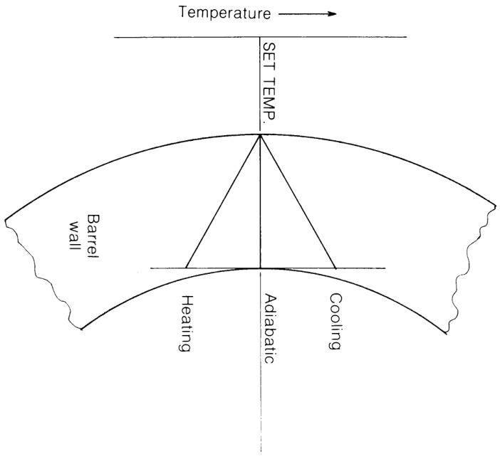

图8.3 机筒中的温度梯度。

### 8.2.1 变量分析：功率方程

前一节强调了实验测量的重要性，因为能量平衡中某些项目的理论计算存在问题。特别是，如第6.6节和第231页所讨论的，熔体长度 $Z$ 以复杂的方式变化，尤其是随转速和背压的变化。为简单起见，以下讨论将忽略这种相互作用，本章及后续章节中关于功率输入、能量平衡等的推论必须通过修正来考虑伴随的熔体长度 $Z$ 变化，特别是转速或压力的较大变化。

聚合物热含量 $I$（焓）的增加与质量流量和比焓的变化成正比，但后者需要实验室数据，对于半结晶聚合物取决于（通常未知的）进料结晶度。然而，对于操作温度的微小变化，恒定的（熔体）比热可能是足够的近似。热损失 $S$ 几乎不可能精确计算，但需要通过初步实验（见附录C.1）来确定，包括适当的物理布置（机筒长度、口模和适配器组件、加热器额定值和位置、进料口和螺杆冷却流量和温度）以及外部温度。加热器输入 $H$ 难以

预测（除了最大可用值外），测量中可能不确定——这也许最好在方程(8.2)中作为因变量或平衡因子处理。

与之相反，导致方程(8.9)的分析为估算螺杆的机械功率输入 $E$ 以及独立变量 $\eta, D, N, Z, h, \delta$ 和压力 $P$ 变化对其的影响提供了基础。方程(8.9)中的螺槽和螺棱项都与粘度成正比；因此功率输入随聚合物分子量增加（熔体流动速率降低）而增加，随温度升高而减少。由方程(6.4)，对于恒定螺旋角 $\phi$：

$$
W \propto D N \tag{8.10}
$$

因此功率方程的两项都按 $N^2$ 成比例增加。对于恒定螺旋角 $\phi$ 和螺棱比例，螺槽宽度 $b$ 和螺棱宽度 $t$ 与直径 $D$ 成正比，因此两项都与 $D^3$ 成正比，并与熔体长度 $Z$ 和 $L$ 成正比（方程(6.1)）。螺槽和螺棱功率项分别与深度 $h$ 和间隙 $\delta$ 成反比。虽然第一项中螺旋角 $\phi$ 仅在括号内明确出现，方程(6.1)-(6.4)显示它隐含在 $W, b, t$ 和 $Z$ 中（对于恒定 $L$），因此改变螺旋角 $\phi$ 对功率的影响是复杂的——对于 $\phi$ 的较小值，当 $\tan^2\phi \ll 1$，且螺棱比例恒定（$t / p$ 恒定），$b \propto \sin \phi$（方程(6.2)和(6.3)），功率 $E$ 对于恒定 $D, N, h$ 和 $L$ 大约与 $\cos^2\phi$ 成正比，预测功率随螺旋角增加而略有降低。由于只考虑泄漏流的拖曳元素，方程(8.9)的第二项与压力无关；后者在第一项中由无量纲组 $Q / Wbh$ 表示，如第136页（图6.6）所讨论的，该值的减小对应于背压的增加。因此方程(8.9)表明螺槽功率随背压增加而增加，尽管由方程(6.15)、(B.9)等给出的产量 $Q$ 在减少。因此对于给定的螺杆设计和转速，$Q / Wbh$ 是包含背压对功率影响的便捷方式，对于恒定螺旋角 $\phi$ 和压力 $P$，方程(8.9)中方括号内的项是常数。然而，在其他情况下，方程(6.32)表示独立变量在恒定 $Q / Wbh$ 下对压力的影响。这强化了方程(6.16)后面的断言，即 $Q / Wbh$ 的大小在表征操作条件方面有价值。则对于恒定螺旋角 $\phi$ 和恒定无量纲产量 $Q / Wbh$，方程(8.9)可简化为：

$$
E _ {\mathrm {C h}} \propto \frac {\eta D ^ {3} N ^ {2} L}{h} \tag{8.11}
$$

*参见McKelvey (1962, 图10.11, 第255页)。$Q$ 随 $\theta(\phi)$ 增加直到 $\theta = 30^\circ$。效率 $Q / E$ 降低，因此功率必须增加。

以及：

$$
E _ {\mathrm {F l}} \propto \frac {\eta D ^ {3} N ^ {2} L}{\delta} \tag{8.12}
$$

这些关系在表8.3中列出，并将在第8.5节中结合产量能量平衡的影响以及第11.5节中放大讨论中一起考虑。

## 8.3 假塑性等温近似

第141页关于泄漏流的数值例子表明，螺棱间隙 $\delta$ 通常比螺槽深度 $h$ 小一或两个数量级；因此螺棱上的剪切速率将远大于螺槽中（方程(B.16)和(6.69)）。由于方程(8.9)的两项是独立的，假塑性行为的一个粗略近似是在每一项中插入不同的粘度值，对应于相应的剪切速率（见第232页）。如第8.5节中的例子所示，方程(8.9)的严格牛顿等温应用表明总功率的很高比例在螺棱上被吸收；使用与螺槽和螺棱中剪切速率相适应的粘度大大降低了后者的贡献。这个过程还允许包含螺杆转速对粘度的影响，粘度随转速增加而降低，在某种程度上抵消了后者对功率的影响。例如，如果使用方程(3.7)中给出的幂律近似：

$$
\eta \propto \dot {\gamma} ^ {n - 1} \propto N ^ {n - 1} \tag{8.13}
$$

方程(8.9)变为：

$$
E \propto N ^ {n - 1} \cdot N ^ {2} = N ^ {n + 1} \tag{8.14}
$$

由于 $n < 1$，方程(8.9)的牛顿关系

$$
E \propto N ^ {2} \tag{8.15}
$$

被替换为

$$
E \propto N ^ {n + 1} \tag{8.16}
$$

其中 $1 < (n + 1) < 2$，即假塑性情况下功率随转速增加不如牛顿情况迅速。

图6.6显示，对于给定的转速 $N$，当 $Q / Wbh$ 从 $1/2$ 减小且压力增加时，顺螺槽壁面剪切速率按方程(6.69)增加。该表达式是方程(C.9)的一个因子，可识别为方程(8.7)和(8.9)的一部分，即由背压引起的剪切速率变化在功率方程中是线性的。进一步的

允许压力影响的近似因此是对螺槽取在由下式给出的壁面剪切速率下评估的粘度 $\eta$：

$$
\dot {\gamma} _ {h} = \frac {W}{h} \left(4 - \frac {6 Q}{W b h}\right) \tag{6.69}
$$

该表达式严格仅适用于牛顿流动，如 图4.1 所示，在相同流量下对假塑性流动低估了壁面剪切速率而高估了粘度；然而，它在定性上是正确的，部分抵消了方程(8.9)括号项的增加，给出了对压力对功率输入影响的更接近的整体评估。

## 8.4 非等温流动中的功率

### 8.4.1 熔体输送段中热流的估算

等温假设已被用于允许流动和功率的解析方程，从中可以推导出尺寸和操作变量的影响。它也形成了一个方便的基础，用于可以针对假定的纵向温度分布进行求和的局部行为。然而，它仅基于"平均"条件提供了实际挤出机总体性能的近似表示，在实际挤出机中，由于内部剪切热和外部加热或冷却的组合结果，熔体温度通常沿下游方向增加。在第232页建议，给定轴向位置处的功耗应在靠近其内表面的机筒壁局部温度下评估；纵向温度分布的影响然后可以通过在若干轴向截面上求和来估算，同时考虑任何尺寸变化，例如螺槽深度。当然仍然需要知道有效熔体长度。

加热聚合物沿螺杆的流动代表了由于质量传递而产生的轴向热通量，它随平均熔体温度的增加而逐渐增加；在绝热情况下，这是由于螺槽和螺棱间隙中的剪切热。然而，由于剪切热的不均匀性以及到或从机筒壁的热传递，将产生径向温度梯度。这些将在某种程度上由于横向循环（图6.7）和其他较小的内部热流而缓解。因此用于评估功耗的表面温度通常将不同于局部平均温度。此外，径向温度变化将导致拖曳流的非线性速度分布，以及在包含压力流时壁面剪切速率进一步偏离方程(6.69)（图4.1）。通常，对于给定的螺杆转速，随着壁面附近温度高于体积平均值，壁面附近的剪切速率将增加而粘度降低。这将导致功率输入与从

体积温度预测的相比发生变化（可能是增加），并且由于图6.6所示速度分布的畸变导致产量降低。除了引起聚合物中的径向温度变化外，强烈的外部加热或冷却将在机筒壁内产生径向温度梯度，因此加热控制器上设定的温度仅间接地与内表面处的温度相关，因此后者的直接测量仍然是功率估算最可靠的方法。对于变深度螺杆，即使可以假定机筒温度的线性变化，轴向平均温度也将不正确，因为与局部壁面剪切速率的变化（表6.1中的水平方向）相互作用。在第232页推荐了时间平均温度，主要是因为由螺棱间隙中功耗产生的剪切热对机筒壁的局部效应。

第8.5节（第260页）中的例子，基于等温牛顿假设（方程8.9）计算，表明在通常情况下，螺杆螺棱上的功耗与螺槽中的功耗相比是可观的，尽管其作用面积小得多（与螺棱宽度 $t \cos \phi$ 成正比而不是螺槽宽度 $b$）。在极端情况下，螺棱功率可能实际超过螺槽功率。如果考虑螺棱间隙中高得多的剪切速率（方程(C.15))，对于假塑性流体，螺棱对总功率的贡献降低，但仍然显著（见表8.4）。在螺棱间隙中很少质量聚合物中的这种功耗将倾向于引起大的局部温度升高；一些热量将在螺棱通过固定点的短时间内在机筒中向所有方向间歇传导，一些将连续地在螺杆螺棱中径向传导，一些将由不粘附到螺杆螺棱上的聚合物带入螺槽中。为了设定估算螺棱间隙区域中这些温度升高和热流的边界条件，有必要考虑螺杆和机筒熔体输送段中所有各种可能的热流。图8.4示意性地显示了这些，其中用字母标记如下：

A 机筒外径处的径向热传递，例如从加热器或到冷却介质。

B 机筒厚度内的径向导热。

C 机筒内径处的径向热传递，到或从螺杆螺槽中的聚合物。

D 机筒壁中的轴向传导。

E 螺杆根部处的径向热传递，到或从螺杆螺槽中的聚合物。

F 螺杆螺棱中的径向导热。

G 螺杆中螺棱与螺槽根部之间的局部轴向传导。

H 螺杆根部中的总体轴向传导。

J 螺棱厚度内的轴向传导。

(table-8-1)=
表8.1 熔体输送段中的热流

<table><tr><td rowspan="2">热流</td><td colspan="3">特定条件</td><td colspan="3">操作条件</td></tr><tr><td>温度或梯度</td><td>面积/圈 (m2)</td><td>通量 (W/圈)</td><td>温度或梯度</td><td></td><td>通量 (W/圈)</td></tr><tr><td>A</td><td>1°C</td><td>0.0628 200 mm 外径</td><td>取决于来源</td><td>-</td><td></td><td>1880 (3 W cm-2) 8160 (13 W cm-2) (外部)</td></tr><tr><td>B</td><td>1°C/mm 平均</td><td>0.0471 平均</td><td>2273</td><td>3.06°C</td><td>在 0.05 m 中</td><td>139 总计</td></tr><tr><td>C</td><td>1°C</td><td>0.0283 仅螺槽</td><td>8.5</td><td>10°C</td><td></td><td>85</td></tr><tr><td>D</td><td>1°C/mm</td><td>0.0236 200 mm 外径</td><td>1180</td><td>125°C/m 50°C</td><td>每 4D 区间</td><td>147 W</td></tr><tr><td>E</td><td>1°C</td><td>0.0226 80 mm 根部直径</td><td>6.8</td><td>10°C</td><td></td><td>68</td></tr><tr><td>F</td><td>1°C/mm (螺棱高度上10°C)</td><td>0.003 14</td><td>157</td><td>0.89°C 1.53°C 2.65°C</td><td>平均过量温度 - 见下面P</td><td>14 (1 rps) 24 (2 rps) 42 (4 rps)</td></tr><tr><td></td><td></td><td></td><td></td><td>0.89°C</td><td>包括螺棱尖端阻力</td><td>3.6 (1 rps)</td></tr><tr><td>G</td><td>1°C 超过 0.0314 m 见附录 C.3</td><td>0.0024</td><td>3.8</td><td>0.89°C 1.53°C 2.65°C</td><td>平均过量温度 - 见下面P</td><td>3.4 (1 rps) 5.8 (2 rps) 10.1 (4 rps)</td></tr><tr><td></td><td></td><td></td><td></td><td>0.89°C 包括表面阻力 每 4D 区间</td><td>1.4 (1 rps)</td><td></td></tr><tr><td>H</td><td>1°C/mm</td><td>0.005 03</td><td>251</td><td>125°C/m 50°C</td><td>每 4D 区间</td><td>31.4 W</td></tr><tr><td>J</td><td>1°C</td><td>0.003 14</td><td>15.7</td><td>125°C/m 1.25°C 0.03°C</td><td>聚合物/聚合物 在金属中</td><td>0.57</td></tr><tr><td>K</td><td>1°C/mm</td><td>0.0283</td><td>14.1</td><td>0.42–3.8°C</td><td>在 5 mm 中</td><td>1.2–10.7 无循环</td></tr><tr><td></td><td></td><td></td><td></td><td>0.05–0.30°C</td><td>在 5 mm 中</td><td>0.14–0.85 有循环</td></tr><tr><td>L</td><td>1°C/mm</td><td>0.000 86</td><td>0.43</td><td>37.9°C/m</td><td></td><td>0.016</td></tr><tr><td>M</td><td>-</td><td>0.0283</td><td>21.9–33.4 kW m-2@ 1 rps</td><td>-</td><td></td><td>620–946 W/圈 @ 1 rps</td></tr><tr><td>N</td><td>-</td><td>0.0283</td><td>-</td><td>-</td><td></td><td>41.6–392 W/圈 @ 1 rps 净</td></tr><tr><td>P</td><td>-</td><td>0.003 14</td><td></td><td>见附录 C.5</td><td></td><td></td></tr><tr><td>R</td><td>1°C/mm</td><td>0.95 × 10-4</td><td>4.8</td><td>37.9°C/m</td><td></td><td>0.18</td></tr><tr><td>S</td><td>1°C/mm</td><td>0.0033</td><td>1.65</td><td>10.2°C</td><td></td><td>0.20</td></tr></table>

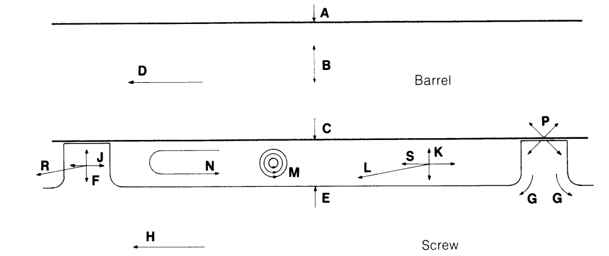

图8.4 熔体输送段中的局部热流。

K 螺槽中聚合物内的径向传导。

L 螺槽中聚合物内的纵向（螺旋）传导。

M 螺槽中聚合物内的剪切热。

N 由横向循环引起的径向混合。

P 螺棱间隙中的剪切热和局部耗散。

R 沿螺棱螺旋的传导。

S 聚合物中跨螺槽的传导。

这些分别在附录C.3、C.4和C.5中针对附录C.3中给出的尺寸和材料特性进行研究，并针对 $1^{\circ}\mathrm{C}$ 的温度差或 $1^{\circ}\mathrm{Cmm}^{-1}$ 的温度梯度（视情况适用）进行评估。结果列于表8.1，以指示相对数量级，以及在操作条件下预期值的估计。

首先考虑螺杆，热量 $\mathbf{H}$ 将轴向朝向进料端传导，除了由于螺槽深度变化引起的横截面变化外，这将与轴向温度梯度成正比。对于均匀梯度且无径向热增益或损失的零径向热流，热通量沿长度将是恒定的。显然在螺杆尖端，该轴向热通量必须由聚合物提供，聚合物也必须处于更高的温度。在某个轴向位置朝向进料端增加的梯度必须类似地由该位置的径向热流（下面的E和F）补偿。螺杆冷却将增加轴向和径向热流，取决于接触螺杆的冷却介质的流动方向（即，是从进料端还是通过"棒管"供应到尖端）。螺杆与冷却介质之间仅 $1^{\circ}\mathrm{C}$ 的温度差可每圈移除 $15\mathrm{W}$（方程(C.56)），因此精确的螺杆温度控制对于稳定操作和避免聚合物冻结到螺杆根部是必不可少的。对于所选例子，轴向热流 $\mathbf{H}$ 对于 $125^{\circ}\mathrm{C}\mathrm{m}^{-1}$ 的轴向梯度或 $4D$ 区间的 $50^{\circ}\mathrm{C}$ 为中等的 $31\mathrm{W}$（方程(C.41)）。

来自螺槽根部的径向热通量 $\mathbf{E}$ 可以在螺杆的一个螺距中（例如在输送端）提供上述轴向通量 $\mathbf{H}$，对于估计的 $4.6^{\circ}\mathrm{C}$ 聚合物对金属的温度差（方程(C.33)）。或者，如果该热量在螺杆螺棱 $\mathbf{F}$ 中径向传导，则螺棱间隙中的聚合物与螺棱根部之间约 $7.8^{\circ}\mathrm{C}$ 的温度差（方程(C.37)）可能是需要的，即聚合物温度比螺槽根部处高超过 $3^{\circ}\mathrm{C}$；剪切热 $\mathbf{P}$ 的计算表明即使在螺杆高转速下也不太可能，因此该贡献将很小，在大多数条件下聚合物对螺杆的温度差可能小于 $5^{\circ}\mathrm{C}$。对螺杆螺棱尖端与螺槽根部之间的局部热传导 $\mathbf{G}$ 的估计显示，对于金属中 $1^{\circ}\mathrm{C}$ 的温度差热通量为 $3.8\mathrm{W}$（方程(C.38)）。当包含表面传热系数时（方程(C.39)），对于螺棱间隙中聚合物温度平均增加（在1 rps下）$0.89^{\circ}\mathrm{C}$，这降低至 $1.4\mathrm{W}$。这些与螺棱间隙中的剪切热 $\mathbf{P}$ 相比非常小，后者几乎不受螺杆螺棱中传导的影响。虽然螺棱厚度上的实际温度差难以定义，但似乎从/到聚合物的表面传热系数将使螺棱 $\mathbf{J}$ 中的轴向传导保持较小，例如小于 $1\mathrm{W}$（方程(C.44)），因此相邻螺杆螺槽圈数中聚合物之间的热量传递也将很小。然而，它将倾向于短接横向循环 $\mathbf{N}$ 的效应并维持螺槽中的径向温度差。与螺棱 $\mathbf{F}$ 中的径向热流比较表明后者将占主导，尽管仍然很小。沿螺杆螺棱的传导 $\mathbf{R}$ 显示非常小，但仍然比聚合物中的传导 $\mathbf{L}$ 大一个数量级，例如在静止时或非常高背压下，尽管横截面小得多。结论是，在通常条件下螺杆内的热流 $\mathbf{E}$、$\mathbf{F}$、$\mathbf{G}$ 和 $\mathbf{J}$ 将很小，因此假设螺杆是隔热的合理。例外将是：(i) 螺杆尖端附近；(ii) 纵向温度梯度存在实质性变化处；以及(iii) 有螺杆冷却时。在每种情况下，径向热流可能主要来自螺杆根部 $\mathbf{E}$，螺棱 $\mathbf{F}$ 的贡献较小。随着该流动增加，例如剧烈螺杆冷却，螺杆温度将明显低于聚合物温度（方程(C.56)），并且由于后者的低导热性和靠近螺杆表面的低速度，聚合物冻结到螺杆上的可能性将增加，后果见第9.1节。

在机筒中，来自加热器的可用能量 $\mathbf{A}$ 明显超过可传递给聚合物 $\mathbf{C}$ 的能量（方程(C.22)）。其主要目的是确保快速升温并提供热损失，特别是在高操作温度下，此时感应加热可能因这些原因而合理（附录C.1）。机筒中径向导热 $\mathbf{B}$ 与 $\mathbf{A}$ 中实际加热器额定值的比较表明，在升温期间温度梯度可能超过 $1^{\circ}\mathrm{Cmm}^{-1}$ 或机筒厚度上的 $50^{\circ}\mathrm{C}$。然而，

到聚合物C的表面热传递可能将机筒上的温度降限制（方程(C.20)）到机筒与聚合物之间温差的大约三分之一。该传热系数（表C.3）难以从理论或实验可靠确定，螺棱尖端P上的也是如此，虽然后者可能大几倍：结论必须谨慎对待。理论预测当背压从 $Q / Wbh = 0.5$ 增加到 $Q / Wbh = 0$ 时，系数将增加约三分之一（表C.3），当螺杆转速加倍时增加约四分之一。前者不太可能补偿高背压下增加的功率（图8.14），而后者证实了实践经验，即在螺杆高转速下熔体温度的控制变得越来越困难（图8.12）。机筒D中轴向传导的热量（方程(C.23)）可能与径向传递给聚合物C的量（方程(C.22)）处于同一数量级，但少于加热器功率A的 $10\%$，因此不太可能影响聚合物C的加热或冷却。在均匀轴向温度梯度下，轴向热通量D在机筒区间内外相等，但在输送端必须由加热器供应，加热器也可能有助于维持口模和适配器温度（附录C.1）。因此轴向传导D的主要效果将是耦合相邻机筒区间的温度控制系统，因此在实践中经历的相互作用必须在总体控制中考虑，无论是手动还是自动，特别是如果要修改纵向温度分布时。

在螺槽内的聚合物中，估计表明纵向 $\mathbf{L}$（方程(C.50))和横向 $\mathbf{S}$（方程(C.53))热流可忽略不计。径向传导 $\mathbf{K}$ 很小——例如，对于螺槽深度上的 $10^{\circ}\mathrm{C}$ 差异，每圈 $14\mathrm{W}$（方程(C.46)），特别是与由横向循环（图6.7）引起的质量传递 $\mathbf{N}$（附录C.4）径向传递的热量相比时；然而，它在减少由外部加热 $\mathbf{C}$ 或内部剪切 $\mathbf{M}$ 引起的径向温度差方面确实起一定作用。在第8.4.2节考虑剪切热 $\mathbf{M}$ 和循环 $\mathbf{N}$ 之前，本研究可总结为：(i) 基本隔热的螺杆；以及(ii) 机筒与螺杆螺槽中聚合物之间严重受限的热传递，特别是在螺杆高转速下。在升温期间不可能预测界面处的传热阻力；如果忽略这些，似乎高达 $80\%$ 的热量将通过螺棱到达螺杆根部（方程(C.54)），或者聚合物将几乎相等地从机筒和螺杆被加热。对于本节中考虑的机器，在升温末期机筒与螺杆之间的温度差似乎可能大约每五分钟减半（方程(C.55)）。

### 8.4.2 剪切热的分布

施加到螺杆上的机械功率部分被吸收用于输送固体聚合物并提供将

聚合物温度升至熔点或软化点所需的部分或全部能量。其余部分，大致由方程(8.9)估算，在熔体输送段中被吸收为剪切热（图8.4中的M）和提升流体聚合物中的压力。与外部加热/冷却一起，这将聚合物温度升至口模所需的温度。然而，由于剪切速率在螺槽深度上不均匀（图6.6和6.7），剪切热将导致不均匀的温度升高，这是口模处温度不均匀的来源，因此对产品质量和均匀性不利。由于聚合物的低导热性（图8.4中的K），外部加热或冷却也将引起径向温度差。这些温度差将由质量传递（图8.4中的N）修正，其来自图6.7所示的横向循环。然而，重要的是要注意，除零产量外，这伴随着顺流流动，聚合物以斜螺旋移动，因此上层和下层径向层不仅仅是被交换。在从上层径向移动到下层以及反之亦然的过程中，聚合物元素也被移动到下游不同的距离处，在那里无循环时的体积混合温度也可能不同。因此对循环效应的简单计算只能间接地与螺杆末端聚合物温度的分布相关联。

之前已经提到（第139页）螺杆螺槽中的纵向和横向速度组合形成复杂的流动模式，已经使用了各种近似来确定所产生的剪切速率。在方程(6.69)中，壁面处顺螺槽剪切速率以背压 $(Q / Wbh)$ 表示，并用于方程(8.9)以给出背压对粘度和功率输入的近似影响。在附录C.3中，靠近壁面的薄层上的顺螺槽和横向速度差被矢量求和并除以层厚度，以给出用于估算对机筒的表面传热系数的总剪切速率。顺螺槽和横向剪切速率矢量求和的更近似方法被用于显示在螺杆根部处的系数相似。对于当前目的，需要更精确的估算，尽管仍然针对等温牛顿条件以保持代数关系的简单性。

使用跨螺槽和顺螺槽速度分量的方程((6.26)和(6.67))，以 $W$、$h$、$y / h$ 和 $Q / Wbh$ 为项建立了一个代数表达式（方程(C.59)），用于在由 $y / h$ 无量纲给出的径向位置处的合速度。该表达式对 $y$ 微分以给出总剪切速率（方程(C.61)），其中忽略了总速度矢量方向随 $y / h$ 变化的近似。由于

*在本书第一版中，这被近似为 $u \sin \phi + w \cos \phi$，即假设合力垂直于螺杆轴线。图6.8显示这仅在 $y / h = 1$ 或零产量（$Q / Wbh = 0$）时成立。

这涉及几个非齐次项之和的平方根，不能更简单地表示。然后通过方程(3.57)计算单位体积的剪切热为 $\eta \dot{\gamma}^2\mathrm{Wm}^{-3}$。为简洁起见，使用符号 $T$ 和 $q$，其中：

$$
q = \frac {1}{2} - \frac {Q}{W b h} \tag{8.17}
$$

$$
T = \tan \phi \tag{8.18}
$$

表达式则变为：

单位体积剪切热 $(\mathrm{Wm}^{-3})$

$$
\left[ 1 + 4 T ^ {2} - 1 2 q + 3 6 q ^ {2} - 1 8 T ^ {2} \left(\frac {y}{h}\right) + 18q \left(\frac {y}{h}\right) \right. \left. - 7 2 q ^ {2} \left(\frac {y}{h}\right) + 9 T ^ {2} \left(\frac {y}{h}\right) ^ {2} + 3 6 q ^ {2} \left(\frac {y}{h}\right) ^ {2} \right] = \eta \frac {W ^ {2}}{h ^ {2}} \cdot \frac {\left[ - 108q ^ {2} \left(\frac {y}{h}\right) + 1 8 T ^ {2} \left(\frac {y}{h}\right) ^ {2} + 7 2 q ^ {2} \left(\frac {y}{h}\right) ^ {2} \right] ^ {2}}{\left[ 1 + 4 T ^ {2} - 1 2 q + 3 6 q ^ {2} - 1 2 T ^ {2} \left(\frac {y}{h}\right) + 1 2 q \left(\frac {y}{h}\right) - 7 2 q ^ {2} \left(\frac {y}{h}\right) + 9 T ^ {2} \left(\frac {y}{h}\right) ^ {2} + 3 6 q ^ {2} \left(\frac {y}{h}\right) ^ {2} \right]} \tag{C.62}
$$

螺距等于直径且 $T = 1 / \pi$ 的结果针对 $Q / Wbh$ 的多个值绘于图8.5中，对应于 $y / h$。

对于 $Q / Wbh = \frac{1}{2}$，$q = 0$，方程(8.20)简化为：

$$
\text{Shear heat} \left(\mathrm {W m} ^ {- 3}\right) = \eta \frac {W ^ {2}}{h ^ {2}} \cdot \frac {\left[ 1 + 4 T ^ {2} - 1 8 T ^ {2} \left(\frac {y}{h}\right) + 1 8 T ^ {2} \left(\frac {y}{h}\right) ^ {2} \right] ^ {2}}{\left[ 1 + 4 T ^ {2} - 1 2 T ^ {2} \left(\frac {y}{h}\right) + 9 T ^ {2} \left(\frac {y}{h}\right) ^ {2} \right]} \tag{8.20}
$$

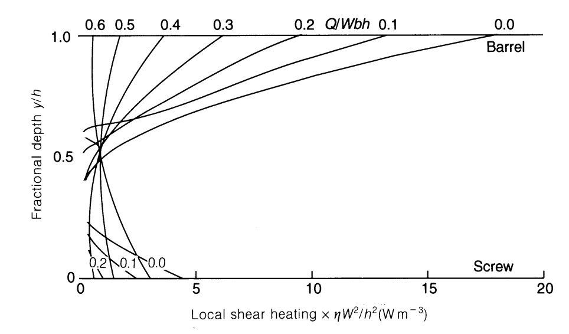

图8.5 组合流动中局部剪切热的径向分布。

对于螺距等于直径的通常情况，$T = 1 / \pi$，方程(8.20)进一步简化为：

$$
\text{Shear} \left(\mathrm {W m} ^ {- 3}\right) = \eta \frac {W ^ {2}}{h ^ {2}} \cdot \frac {\left[ 1 . 4 0 5 3 - 1 . 8 2 3 8 \left(\frac {y}{h}\right) + 1 . 8 2 3 8 \left(\frac {y}{h}\right) ^ {2} \right] ^ {2}}{\left[ 1 . 4 0 5 3 - 1 . 2 1 5 9 \left(\frac {y}{h}\right) + 0 . 9 1 1 9 \left(\frac {y}{h}\right) ^ {2} \right]} \tag{8.21}
$$

在 $y$ 和 $y + \mathrm{dy}$ 之间层中的剪切热为 $\eta \dot{\gamma}^2\mathrm{dyWm}^{-2}$，从0到 $y$ 的累积剪切热为：

$$
\text{Cumulative shear heat} = \eta \int_ {0} ^ {y} \dot {\gamma} ^ {2} d y \tag{8.22}
$$

由于方程(8.20)中的分数难以积分，通过将 $\eta \dot{\gamma}^2$ dy 对0到 $y$ 之间的连续层求和来实现数值近似。结果以 $\eta W^2 /h$ 表示，绘于图8.6中。应该注意，上述表达式基于牛顿速度分布，没有考虑粘度随剪切速率在螺槽深度 $(y / h)$ 上的变化或随之而来的速度和剪切速率分布的修正。数值例子使用了由方程(6.69)给出的顺流壁面剪切速率下的粘度，以与表C.11中的总功率计算进行比较。在该例子中，忽略了横向速度分布，其中：

$$
\left(\frac {\partial u}{\partial y}\right) _ {y = h} = \frac {4 U}{h} \tag{B.15}
$$

导致壁面剪切速率低估（比较表C.3和C.11）以及熔体输送段中粘度、剪切热和功率的高估。该近似因总壁面剪切速率的解析解过于复杂而合理，用于研究剪切热变化的当前目的。显然这里可以使用任何合适的粘度值，因为它是一个单独的因素。在此计算中仅为了假塑性而被允许，以避免对牛顿流体预测的背压 $(Q / Wbh)$ 的极端效应（图8.15）。然而，壁面剪切速率的横向分量（方程(B.15)）独立于背压，因此总剪切速率、粘度和剪切热的真实变化将甚至小于方程(6.69)预测的变化。

径向温度变化对粘度以及因此速度分布的影响被忽略，因为附录C.5中的表C.12显示即使对平均温度的中等变化也只有小的影响。这些径向变化还将由横向循环进一步减小（见下文）。

剪切热 $\mathbf{M}$ 显然是与熔体输送段内部热流相比的主导能源；它也随压力

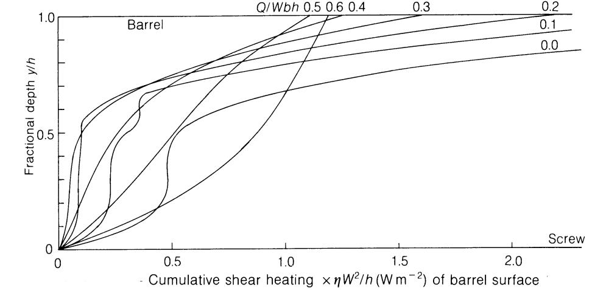

图8.6 组合流动中累积剪切热的径向分布。

梯度的增加迅速增加。图8.5和8.6显示它在螺槽深度上高度不均匀，导致温度不均匀性的发展，如果允许持续到口模，将引起产品中的流动分布和收缩不均问题。这些不均匀性由横向循环 $\mathbf{N}$ 的同时减少在下面讨论。即使在中等压力梯度下 $(Q / Wbh = 0.4)$，总加热的超过 $50\%$ 发生在最靠近机筒的$25\%$深度中，近 $15\%$ 在最外层的 $5\%$ 深度中。在更高压力梯度（更低的 $Q / Wbh$）下，不均匀性甚至更大，在螺槽深度的内半部分几乎很少加热。即使在非常高背压和低产量下，螺杆根部附近的剪切热虽然显著，仍然是总量的一小部分（表C.6）。如从速度图6.6(e)预期的，在负压力梯度下，剪切热在螺槽根部附近最大，虽然 $Q / Wbh = 0.6$ 代表了大梯度（对所用例子约 $5\mathrm{MNm}^{-2}$ 每圈），总值及其分布与零梯度 $(Q / Wbh = 0.5)$ 的情况没有太大不同。虽然高背压给予可观的纵向混合（图6.6(b)）常被提倡以提供组成均匀性，但可以说朝向螺杆末端的低甚至略微负的压力梯度将促进口模处的温度均匀性。即使以下研究表明由剪切热产生的不均匀温度可能由横向循环 $\mathbf{N}$ 大幅减少，残余温度差也可能随背压增加。

尽管本研究严格仅适用于等温牛顿行为，但很明显，剪切热和温度变化可能通过外部加热或假塑性流体时壁面附近剪切速率的增加（图4.1）而得到强调。

### 8.4.3 通过横向循环混合
垂直于螺杆螺槽下游方向的闭合流动必然涉及靠近螺棱侧面的径向流动（图6.7）。这在流动方程中被忽略，因为流动方程假设相对于深度无限宽的螺槽。然而，由这种径向流动代表的质量传递产生了一个循环（图8.4中的N），它在螺槽中聚合物的上层和下层之间交换热量，倾向于减少由剪切热和来自机筒的加热/冷却引起的径向温度差。在附录C.4中，针对 $y / h$ 的增量（表C.7）计算了横向速度和流量。这些给出了螺槽深度 $y / h$ 中左右向流量相等的位置，可以假定在纯层流混合中被交换。这些深度对应于图6.7下部的流线；注意这些不是等速线，因为螺槽下部的速度通常小于上部。与浅槽假设一致，径向移动被假定为瞬时的。附录C.4中显示径向传递的热量是源层中的剪切热除以穿越该层的平均时间。因此，在领先螺棱侧面处向内传递的热量以及在尾随侧面处向外传递的热量被计算；每个求和给出各自的总量，它们的差给出净向内传递的热量（表C.9）。该差值分别从上层减去并加到下层，以给出循环效应的估计。由于上层和下层中的材料体积不同，计算了有循环和无循环时的等效温度升高。由循环引起的这些差异的减小然后被取为后者效应的度量（表C.10）。

因此增加背压（降低 $Q / Wbh$）的效果是增加总剪切热（表8.4和C.10）和径向温度差（表C.10）。然而，横向循环非常显著地减少了这些，并且以几乎恒定的比例。这是横向循环独立于背压的结果，也是附录C.4中的推论，即径向热传递与在每个螺槽深度分数处的横向穿越时间成反比。注意这只是横向流动的左右部分之间温度差的平均减少；试算表明正是在温度差最大的表面区域，百分比减少也是最大的。中心层中较小的减少是由于更慢的循环，并伴随着（通常）更小的顺游移动，然而这也依赖于 $Q / Wbh$ 的值（图6.6）。这对温度均匀性意义有限，后者也由局部热传导 $\mathbf{K}$ 辅助；组成混合仅取决于（上层和下层区域之间的）相对速度和（相邻层之间的）剪切速率，因此一个不良混合区可能预期在靠近

$y / h = 2 / 3$ 处，其中横向速度为零，特别是在低背压（高 $Q / Wbh$）下，此处该位置的下游速度相对较高。

上述计算针对1 rps的螺杆转速。随着螺杆转速增加，熔体输送段中的机械功率按螺杆转速 $N$ 的 $(n + 1)$ 次方增加（方程(8.14)），增加径向温度差。横向速度 $u$ 在位置 $y / h$ 处与机筒处的 $U$ 成正比（方程(6.26)），后者与转速成正比（方程(6.5)）。因此跨螺槽的穿越时间将与转速 $N$ 成反比。因此径向热流：

$$
Q _ {x} \rho C _ {\mathrm {p}} \mathrm {d} T \propto \frac {N ^ {n + 1}}{N ^ {- 1}} = N ^ {n + 2} \tag{8.23}
$$

因此径向热流随转速作为所产生的剪切热（方程(8.14)）的比例增加，这将倾向于更快速地减少（更大的）温度差异。然而，顺螺槽速度也增加，因此这种减少很可能在更长的长度上发生，在口模处产生更大的温度不均匀性，如随着转速增加而通常经历的。

横向循环的这种效应应类似地减少由中等的机筒加热或冷却引起的径向温度差，因为它取决于螺槽深度不同点处的相对温度升高。然而，机筒或螺杆的剧烈冷却将扭曲速度分布甚至引起局部冻结，抑制温度差的减少。

### 8.4.4 螺棱间隙中的热量产生和耗散

如果假设螺槽中的聚合物与周围环境处于热平衡，则剪切热 $\mathbf{M}$ 被吸收用于维持螺槽中熔体的温度；螺棱间隙上更大的剪切热必须产生不平衡和随之的局部温度升高。任何粘附到螺杆螺棱上并随其旋转的聚合物将连续受到这种加热，而其余部分将在间隙中被剪切和加热，然后返回到螺槽中的较低剪切速率，在该处显热可能通过对流传导在周围的螺槽流中再次损失。在极端情况下，粘附到机筒上的聚合物将在每次旋转的约 $10\%$ 时间内被经过的螺棱尖端加热，并在剩余的 $90\%$ 时间内松驰到准稳态，这很可能高于螺槽中的平均温度。螺杆螺棱的金属将被持续加热并达到稳态温度，取决于螺杆内的热流 $\mathbf{F}, \mathbf{G}, \mathbf{H}, \mathbf{J}$。附录C.3中显示，在没有有意冷却的情况下，螺杆基本隔热，通过螺棱的局部热流 $\mathbf{F}, \mathbf{G}, \mathbf{J}$ 很小，除非聚合物中存在

大的温度差。由于其很小的体积，间隙中的聚合物具有可忽略的热容量，且由于其很小的厚度不能维持实质性的温度差；因此它代表一个可忽略的热汇，其温度将紧密跟随周围环境的温度。机筒受到循环加热，且在螺棱和螺槽通过期间，机筒将从其内表面上的点向所有方向传导热量。

如果机筒（假定初始处于螺槽中聚合物的温度）构成可忽略的热阻，则螺棱上产生的热量将被传导走，等温假塑性计算（见第260页的例子）将保持有效。然而，有限的热阻（导热性）将导致螺棱间隙中的瞬态温度升高，因此粘度、产生的热量和吸收的功率降低。据信该问题此前未在文献中研究过，此处的目的限于初步研究以评估该效应的数量级以及如何可能受操作条件的影响。在附录C.5中取了一个例子，基于附录C.3开头给出的数据。

螺棱间隙中剪切聚合物产生的热量针对几个平均温度和剪切速率进行了计算。显示该能量流入机筒可合理地由径向一维瞬态热传导表示。适用于这种情况的标准方法（McAdams, 1954, 第33页及以下）给出了温度作为时间和位置函数的分布。它们还给出了吸收的热量作为时间的函数，显示它与表面温度超过机筒原始（均匀）温度的过量成正比。将该热量在螺棱穿越时间内与聚合物中产生的剪切热相等，确定了螺棱尾缘通过时机筒的过量表面温度 $T$，例如在1 rps时 $1.54^{\circ}\mathrm{C}$。当螺棱通过后，热源被移除，但热量将在机筒内继续扩散。聚合物的非常低导热性和低传热系数 $\mathbf{C}$ 给出了热量从机筒流向聚合物的阻力比（McAdams, 1954中的 $m$）超过10，因此如McAdams（1954, 图3.2和3.4）所示，此表面现在可视为隔热，储存在机筒中的热量将向机筒厚度中进一步扩散。这在0.9 s（在1 rps时）的"休息"期间持续，并在下一转开始时给出残余过量温度，例如在1 rps时 $0.32^{\circ}\mathrm{C}$，当螺棱再次通过时。在例子的条件下，该残余过量很小，螺棱功率（方程(8.9)的第二项）的减少也很小。然而，该过量温度在螺杆连续旋转期间将累积，在没有其他传热机制的情况下将导致机筒温度大幅增加到聚合物温度之上。这反过来必须影响靠近机筒的螺杆螺槽内的有效粘度，从而减少由方程(8.9)第一项表示的功率。

从表C.12可知，上述条件对应于螺棱间隙中数量级为 $100 \, \text{N} \, \text{s} \, \text{m}^{-2}$ 的熔体粘度，显然对于该粘度的牛顿流体效果将类似，这近似于尼龙66和PETP在加工温度下的典型值。然而，类似聚乙烯在低剪切速率下粘度的牛顿流体——例如 $2000 \, \text{N} \, \text{s} \, \text{m}^{-2}$——将导致约 $20^{\circ}\text{C}$ 的温度升高和约 $20\%$ 的螺棱功率减少；螺槽功率的减少也必定是显著的。

增加螺槽中的平均温度将降低螺棱间隙中的粘度和剪切功，例如此聚合物（$n = 0.315$）从 $150^{\circ}\mathrm{C}$ 到 $200^{\circ}\mathrm{C}$ 减少约一半。这些将反过来按大致相同比例减少螺棱穿越结束时和"休息"期间结束时机筒中的温度升高。因此在高平均熔体温度下循环温度波动将被最小化。螺棱功率也将减少，但可能成为（现在更小的）总功率中比例增加的部分。

附录C.5中在相同假设下的计算显示（表8.2）温度升高分别在2和4 rps时增加到 $2.68^{\circ}\mathrm{C}$ 和 $4.61^{\circ}\mathrm{C}$，而下一转之前的残余增加分别为 $0.55^{\circ}\mathrm{C}$ 和 $0.94^{\circ}\mathrm{C}$，即剪切结束和"休息"期间结束时的温度增加随转速上升并彼此成比例。对于这种情况，假塑性指数 $n = 0.315$ 的聚合物，初始和残余增加分别大致与螺杆转速的0.8次方成正比。当包含表面阻力时机筒的温度增加较小，但仍然显著。然而，附录C.5中预测的聚合物温度升高在1 rps时现在约为 $30^{\circ}\mathrm{C}$，虽然它将在螺槽中迅速消散，但可能通过促进表面滑移扰乱螺槽中的流动。聚合物温度的这种增加也将使螺杆螺棱与螺槽根部G之间的热流增加到每圈 $40 - 50\mathrm{W}$（表8.1），进一步减少到机筒的热量。

这些温度升高肯定将给出总功率的重要减少，以及在高转速和高熔体粘度下螺棱间隙贡献比例的减少。

(table-8-2)=
表8.2 螺棱间隙中的剪切热和温度升高，可忽略的表面阻力

<table><tr><td>螺杆转速 (rps)</td><td>剪切结束时温度 (°C)</td><td>剪切功 (J/圈)</td><td>"休息"结束时残余温度 (°C)</td></tr><tr><td>1</td><td>1.54</td><td>24.45</td><td>0.32</td></tr><tr><td>2</td><td>2.68</td><td>30.05</td><td>0.55</td></tr><tr><td>4</td><td>4.61</td><td>36.63</td><td>0.94</td></tr></table>

将外部加热导致的机筒中径向温度梯度 $\mathbf{B}$ 叠加到图C.4上显示，这在大小上相似，但方向相反，与"休息"期间除最初时刻外几乎所有时间的机筒表面附近的温度梯度相比。因此这种程度的外部加热将严重减少来自螺棱的热量扩散，增加局部温度升高并减少功耗。相反，剧烈的机筒冷却将产生与来自螺棱的扩散相同方向的温度梯度，导致局部聚合物温度降低和螺棱功耗增加。这项初步研究显示螺棱功率对机筒加热或冷却将是多么敏感；确实，观察到的对总功率的影响很可能主要归因于此（方程(8.9)的第二项），对稳定操作和最终熔体温度均匀性具有重要影响。特别是对于粘性聚合物、低熔体温度和高转速，可能预期对性能的实质性影响，该主题值得进一步研究。

## 8.5 变量对能量平衡的影响

尺寸和操作变量对牛顿流体 $(n = 1)$ 功耗的直接影响已在第233-4页讨论，对假塑性流体 $(n < 1)$ 的修正见第235页。在第6章（方程(6.30)）中拖曳流以尺寸 $D$、$h$ 和 $N$ 表示，对于恒定值的无量纲产量 $Q / Wbh$，总流量遵循与直径 $D$、螺槽深度 $h$ 和转速 $N$ 相同的关系：

$$
Q \propto D ^ {2} N h \tag{8.24}
$$

对于某些目的，方便的是以每单位体积产量表示能量 $E / Q$；则结合方程(8.11)和(8.12)与方程(8.24)：

$$
\frac {E _ {\mathrm {C h}}}{Q} \propto \frac {\eta D N L}{h ^ {2}} \tag{8.25}
$$

以及：

$$
\frac {E _ {\mathrm {F l}}}{Q} \propto \frac {\eta D N L}{h \delta} \tag{8.26}
$$

对于其他目的，有用的是将独立变量分组以揭示改变剪切速率的影响。由方程(6.69)壁面剪切速率由下式给出：

$$
\dot {\gamma} _ {h} = \frac {W}{h} \left(4 - \frac {6 Q}{W b h}\right) \tag{6.69}
$$

(table-8-3)=
表8.3 产量和功率输入作为尺寸的函数（恒定 $Q / Wbh$），来自方程(8.11)、(8.12)和(8.24)-(8.27)

<table><tr><td>独立变量</td><td>Q</td><td colspan="2">E</td><td colspan="2">E/Q</td></tr><tr><td></td><td></td><td colspan="2">正比于:</td><td></td><td></td></tr><tr><td>D</td><td rowspan="2">D2恒定</td><td rowspan="2" colspan="2">D3L</td><td>D</td><td></td></tr><tr><td>L</td><td>L</td><td></td></tr><tr><td></td><td></td><td>螺槽</td><td>螺棱</td><td>螺槽</td><td>螺棱</td></tr><tr><td>h</td><td>h</td><td>1/h</td><td>1/δ</td><td>1/h2</td><td>1/hδ</td></tr><tr><td>η (例如改变温度 T)</td><td>恒定</td><td>η</td><td></td><td>η</td><td></td></tr><tr><td>N</td><td>N</td><td>N2</td><td>N2</td><td>N</td><td>N</td></tr><tr><td>ηN 牛顿 (n = 1)</td><td>N</td><td>ηN2</td><td></td><td>ηN</td><td></td></tr><tr><td>ηN 假塑性 (n &lt; 1)</td><td>N</td><td>Nn+1</td><td></td><td>Nn</td><td></td></tr><tr><td>Q/Wbh(a) (例如改变压力)</td><td>Q/Wbh</td><td>4(1 + tan2φ) - (6Q)/(Wbh)</td><td>常数</td><td>4(1 + tan2φ)/Q/Wbh - 6b</td><td>1b/Q/Wbh</td></tr></table>

a 见图8.15。

对于恒定 $Q / Wbh$ 并代入方程(6.4)：

$$
\dot {\gamma} _ {h} \propto \frac {W}{h} \propto \frac {D N}{h} \tag{8.27}
$$

结果总结于表8.3中，$\eta N$ 的行表示转速变化的总效应，如方程(8.25)和(8.26)。

在此阶段从表8.3得出的重要推论是，每一次尺寸或操作条件的改变都会引起功率输入 $E$ 与产量 $Q$ 的不同变化。因此，比功率输入 $E / Q$ 改变，导致能量平衡的变化。放大（$D$ 的变化）的含义，例如从实验室半技术机器到大规模生产，将在第11.5节中研究。熔体长度 $L$ 的增加不对产量 $Q$ 产生直接影响，但总功率输入 $E$ 和比功率 $E / Q$ 成比例增加。因此，其他条件相同，长机器将倾向比短机器运行更热，这对于像纸张涂覆这样需要高熔体温度的工艺可能是一个优点，但对于吹塑成型或高粘度熔体如高分子量UPVC和HDPE以及某些橡胶来说是一个缺点。如果熔体温度（和 $I$）被控制为恒定（图8.7），延长熔体段将

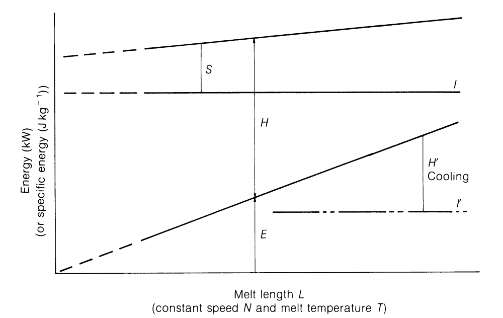

图8.7 熔体长度对热量需求的影响。

减少对聚合物的加热器输入，尽管损失 $S$ 将增加。在大多数情况下，增加的表面积将允许减少加热器额定值 $(\mathrm{Wcm}^{-2})$ 。如果功率输入高或熔体温度低到需要机筒冷却，则如图8.7所示，增加长度将增加所需的冷却。如第219页所述，增加螺杆转速倾向于减少熔体长度，这种相互作用如上所述修正了螺杆转速本身的影响。

增加螺槽深度 $h$ 按比例增加拖曳流 $Q_{\mathrm{D}}$，并且如果 $Q / Wbh$ 保持恒定，总产量 $Q$ 也增加。注意后一条件意味着压力梯度 $\mathrm{d}P / \mathrm{d}z$ 与螺槽深度 $h$ 的平方成反比变化（方程(6.32)）。然而，由于剪切速率随螺槽深度 $h$ 或螺棱间隙 $\delta$ 的增加而降低，螺槽和螺棱间隙中的功率输入分别与 $h$ 和 $\delta$ 成反比。因此随着螺槽深度 $h$ 的增加，螺槽和螺棱间隙中的比功率输入 $E / Q$ 分别（反向）按 $1 / h^2$ 和 $1 / h\delta$ 减小。如果出于机械原因螺棱间隙 $\delta$ 恒定，相应的比功率 $E_{\mathrm{Fl}} / Q$ 按 $1 / h$ 变化，总比功率反向按 $1 / h^2$ 和 $1 / h$ 之间的因子变化。方程(8.4)显示在恒定温度下焓的增加 $I$ 与产量 $Q$ 成正比，因此：

$$
\frac {I}{Q} = \rho \int_ {T _ {1}} ^ {T _ {2}} C _ {\mathrm {p}} \mathrm {d} T - (\text{a constant for given} \mathrm {d} T) \tag{8.28}
$$

在图8.8中，产量 $Q$ 和焓 $I$ 由直线表示，与螺槽深度 $h$ 成正比。然而，$E_{\mathrm{Ch}} \propto 1 / h$。在恒定

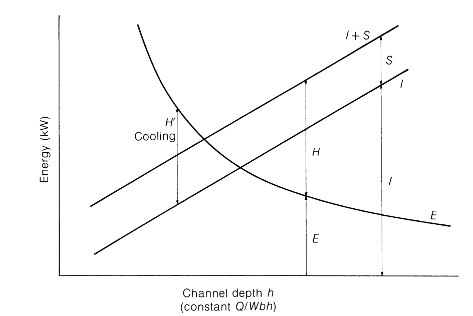

图8.8 螺槽深度对热量需求的影响。

温度下损失 $S$ 将恒定，因此随着螺槽深度增加，机筒加热 $H$ 必须迅速增加（或冷却减少）以维持温度。图8.9以每单位产量的能量表示相同的情况，不仅证明总加热器功率随螺槽深度增加，而且来自加热器的能量比例增加而来自机械驱动的比例减少。这意味着低熔体温度将更容易而高熔体温度可能更难实现，稳定条件将更依赖于温度控制器的性能而较少依赖于进料的一致粘度（分子量、组成等），但由于更大的热流跨越更深的螺槽，螺槽中可能发生更大的径向温度差。

聚合物分子量的增加或熔体温度的降低意味着粘度的增加；在恒定 $Q / Wbh$ 下这对产量 $Q$ 没有影响，尽管方程(6.32)显示它意味着增加的压力梯度 $\mathrm{d}P / \mathrm{d}z$。然而，功率方程(8.9)的两项都成正比增加，因此比功率 $E / Q$ 也成正比增加。因此在图8.10中，功率 $E$ 随熔体温度 $T$ 的增加而降低。然而，增加的温度涉及聚合物中焓 $I$ 的增加，以及机器热损失 $S$ 的增加，因此加热器功率 $H$ 随温度迅速增加，由于增加了热需求 $I$ 和 $S$ 以及减少了机械功率输入 $E$。由于产量恒定，只需改变图8.10的垂直比例即可表示比功率输入 $E / Q$ 和平衡因子 $I / Q$（方程(8.28)），损失 $S / Q$ 和加热器输入 $H / Q$（$\mathrm{Jm}^{-3}$）。

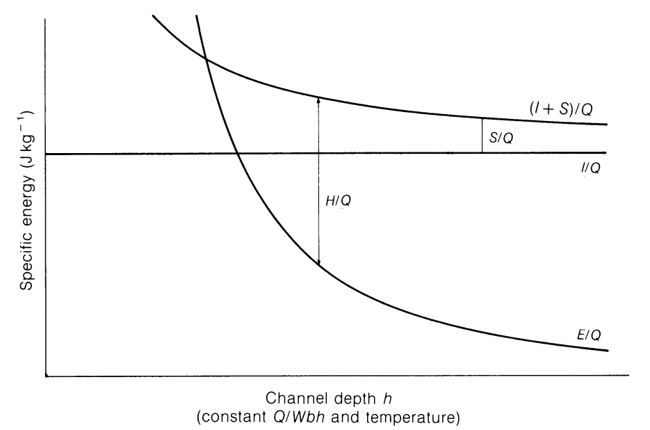

图8.9 螺槽深度 vs 比能量。

这显示，与增加螺槽深度 $h$ 一样，加热器输入不仅增加，而且成为总能量中更大的比例；同时在高温度下操作困难，特别是对于大型机器，其中加热器表面通常比产量增加更慢（第11.5节）。将注意到，在 $T_{\mathrm{A}}$ 处，驱动电机提供聚合物焓的所有所需增加，留下加热器仅提供热损失；这有时被称为'绝热'温度，因为聚合物既不放出热能也不从周围环境接收热能。在给定情况下 $T_{\mathrm{A}}$ 的实际值将取决于产量和功率输入，后者本身取决于螺杆尺寸、压力 $(Q / Wbh)$、转速以及聚合物类型和分子量。在稍低温度 $T_{\mathrm{B}}$ 处，驱动电机也提供损失，因此加热器可关闭。该温度 $T_{\mathrm{B}}$ 有时也被称为绝热温度，但本作者认为更正确地称为'自热'或'自生'，因为机械功转化为聚合物中的热量，其中一些然后传递到机筒等以提供热损失。一直认为该温度对稳定操作非常理想；确实外部热流引起的温度梯度将被最小化，但其他因素如剪切速率可能未优化，且如第11.4节所述可能导致控制问题。如果需要的熔体温度低于 $T_{\mathrm{B}}$，则必须应用机筒冷却，图8.10显示随着温度进一步降低，这必须迅速增加。然而，机筒冷却必然最影响最靠近机筒表面的聚合物，如第8.4节所示，剪切速率和剪切热通常是最大的，并且后者将由于外部冷却引起的局部粘度

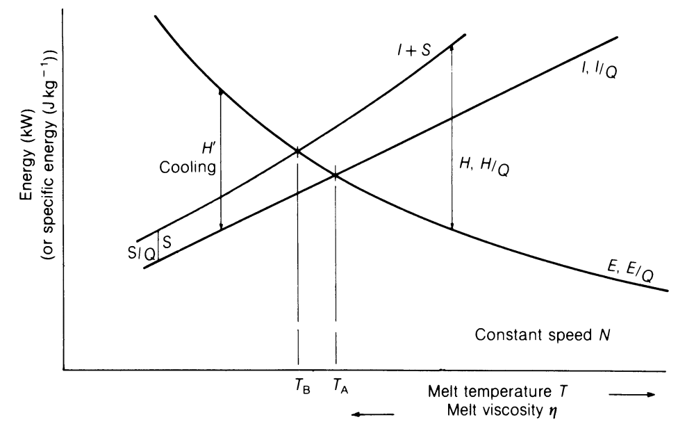

图8.10 能量平衡随熔体温度的变化。

增加而不成比例地增加。类似地，机筒冷却对螺棱间隙中耗散的能量具有深刻影响。实践经验表明，这些效应引起机械功率的不成比例增加和冷却需求的相应增加（图8.11），这可能超出向机筒传热的可能性，特别是对于大型机器。作者有 $200\mathrm{mm}$ 和 $250\mathrm{mm}$ 直径挤出机的经验，其中机筒冷却导致驱动电机过载而没有显著降低聚合物熔体温度；额外功率仅增加了对冷却水的损失，导致非常低效的运行。在这种情况下，较低熔体温度可能只有通过降低转速和产量、更深螺槽和/或更大机器才能实现。螺杆冷却通常有完全不同的效果，将在第9.1节中讨论。将注意到在图8.10和8.11中，与 $H$（冷却）相关的箭头延伸到焓线 $I$ 而不是像加热时那样到 $I + S$。这大致是正确的，因为当加热器关闭并应用冷却时，机筒（但不是口模）的外表面温度下降到接近冷却介质温度，大多数由于加热器热损失的自然冷却消失。这种效应在感应加热器中被最小化，其中大部分热量由机筒本身内的涡流产生，或在外部隔热的加热器中损失无论如何都大幅减少。

在恒定 $Q / Wbh$ 下，螺杆转速的效果简单的是产量 $Q$ 按正比增加（方程(8.24)），而功率方程(8.9)的两项按转速的平方增加（方程(8.11)和(8.12)）。因此比功率输入 $E / Q$（每单位产量）按

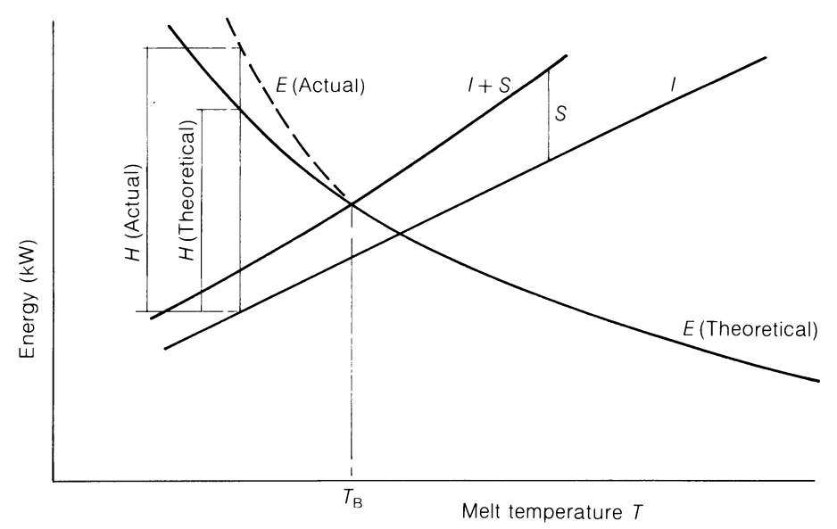

图8.11 机筒冷却与机械功率之间的相互作用。

转速比例增加。在恒定熔体温度下，总焓增加 $I$ 与产量 $Q$ 成正比，而损失 $S$ 恒定。因此图8.12代表总能量平衡，图8.13代表每单位产量的能量。图8.12显示在静止时加热器仅提供损失，但在低转速下还必须提供来自驱动电机的不断增加的不足。由于后者贡献的向上曲线，当达到某个转速时加热器功率再次降低，直到在 $N_{\mathrm{A}}$ 处电机提供聚合物的所有焓

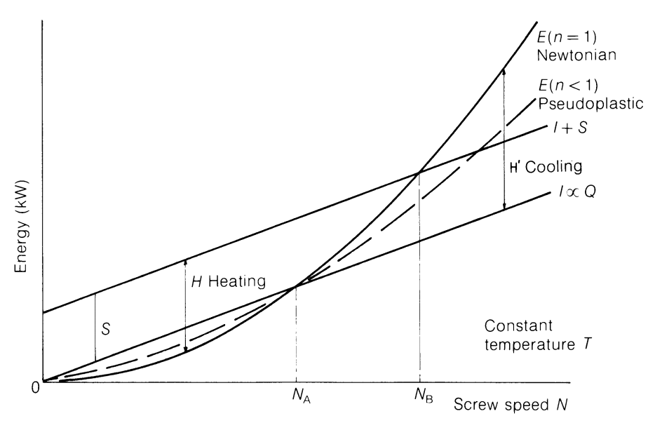

图8.12 能量平衡随螺杆转速的变化。

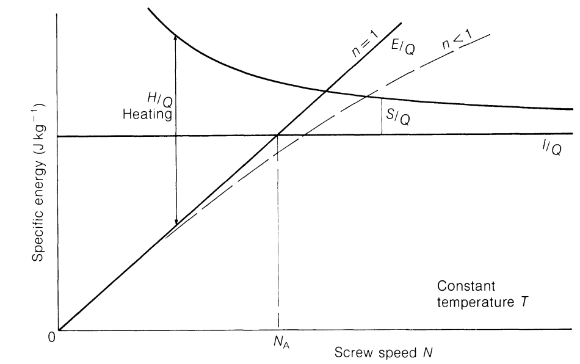

图8.13 比能量 vs 螺杆转速。

增加 $I$，而加热器再次仅提供损失。随着转速进一步增加到 $N_{\mathrm{B}}$（自生转速），加热器被关闭，驱动电机提供能量以满足聚合物中焓的增加 $I$ 和损失 $S$。该点对应于自生温度 $T_{\mathrm{B}}$，其中图8.10中的 $N$ 和 $T_{\mathrm{B}}$ 分别等于图8.12中的 $N_{\mathrm{B}}$ 和 $T$。随着转速在熔体温度 $T$ 下进一步增加，驱动电机功率比聚合物焓增加更快，需要冷却以维持温度 $T$。如图8.10，机筒冷却减少了由 $S$ 代表的自然冷却，需要有意冷却移除的热量近似为 $E - I$ 而非 $E - (I + S)$。如方程(8.11)和(8.12)所给出，在牛顿情况下 $E \propto N^2$；$E$ 在任何转速下的数值，以及因此交点 $N_{\mathrm{A}}$ 和 $N_{\mathrm{B}}$ 的位置，将取决于螺杆尺寸和聚合物粘度，包括后者中温度的影响。对于给定的螺杆和聚合物，图8.10和8.12可视为共同表示能量平衡的 $E, I, S$ 和 $H$ 三维表面的相互截面。

在图8.13中能量值按每单位流量绘制，其中 $I / Q$ 在恒定熔体温度下是常数，$S / Q$ 由于 $Q$ 的增加随转速降低。则 $E / Q$，如方程(8.25)和(8.26)所给出，与转速 $N$ 成正比。这再次显示加热器输入 $H / Q$ 随转速增加而减少，无论绝对值还是作为总能量的比例。这再次表明需要剧烈冷却及其伴随问题以避免熔体温度在转速高于 $N_{\mathrm{B}}$ 时上升，正如 图8.10 显示在固定转速 $N$ 下如需将熔体温度降至 $T_{\mathrm{B}}$ 以下则必须冷却。作者回忆操作 $50\mathrm{mm}$（2英寸）直径实验室挤出机，带有2:1压缩比螺杆，加工K65 UPVC，熔体温度

约 $200^{\circ}\mathrm{C}$；自生转速在40 rpm时达到。使用相同螺杆在相似温度下，MFR 2.0的LDPE在200 rpm时仍需要加热。由于两种聚合物在该温度下的焓没有很大不同，自生转速 $N_{\mathrm{B}}$ 的差异反映了很不同的熔体粘度及因此所需的驱动功率。

在牛顿情况下，粘度是温度的函数而不是转速的函数，因此温度和转速的影响可以分开。如方程(8.16)所示，在假塑性情况下，转速 $N$ 对剪切速率和粘度的组合效应给出：

$$
E \propto N ^ {n + 1} \tag{8.31}
$$

其中指数 $(n + 1)$ 在1和2之间。虚线（图8.12）显示与牛顿流体 $(n = 1)$ 实线相比的该函数。将注意，结果是所需加热器功率 $H$ 随转速变化更慢，在高于自生转速 $N_{\mathrm{B}}$ 的转速下需要更少冷却。还注意为了比较目的，该曲线显示为一个假塑性材料，在温度 $T$ 下和对应于螺杆转速 $N_{\mathrm{A}}$ 的剪切速率下具有与牛顿材料相同的粘度，因此在该转速下两种材料的驱动功率相同。表8.3中 $\eta N$ 的行表明，等同于驱动电机功率的焓（或温度）增加按转速的n次方 $(n < 1)$ 增加（对于假塑性材料），相比于牛顿材料的成正比 $(n = 1)$。因此可达到的熔体温度在前者情况下比后者更不依赖于转速。虽然剪切速率的影响将在第11.5节中进一步讨论，但在恒定剪切速率下对热平衡的影响（例如当改变多个尺寸时）在此简要提及。将方程(8.24)除以方程(8.27)给出在恒定剪切速率下产量 $Q$ 随 $Dh^{2}$ 变化。则对于牛顿聚合物，螺杆螺槽中的驱动功率按 $\eta D^{2}NL$ 变化，螺棱上的相同加上比率 $h / \delta$。代表由剪切引起的温度增加的比驱动功率 $E / Q$ 分别按 $\eta DNL / h^{2}$ 和 $\eta DNL / h\delta$ 增加。对于假塑性聚合物，关系类似，$\eta N$ 替换为 $N^{n}$。这的含义是：(i) 粘度、转速或尺寸的增加将倾向于增加自生温度，即低于该温度时需要冷却的温度；(ii) 螺槽深度的减小将引起比功率（与 $1 / h^{2}$ 成正比）的更大增加；以及(iii) 聚合物的假塑性而非牛顿行为只在某种程度上减少螺杆转速的影响。这些用于强调改变尺寸或操作条件几乎不可避免地导致能量平衡的变化和满意操作的'窗口'，这在将加工技术和经验从一种聚合物、机器、产量或规模适应到另一种时必须考虑。这将是第9章和第11章中包含的操作的一个主要方面。

(table-8-4)=
表8.4 机械功率随背压的变化 (kW/圈)

<table><tr><td rowspan="2"></td><td colspan="7">Q/Wbh</td></tr><tr><td>0</td><td>0.1</td><td>0.2</td><td>0.3</td><td>0.4</td><td>0.5</td><td>0.6</td></tr><tr><td colspan="8">螺槽</td></tr><tr><td>n = 1 E</td><td>2.233</td><td>1.928</td><td>1.624</td><td>1.320</td><td>1.016</td><td>0.7122</td><td>0.4081</td></tr><tr><td>E/Qrel</td><td>∞</td><td>13.54</td><td>5.701</td><td>3.089</td><td>1.783</td><td>1.000</td><td>0.477</td></tr><tr><td>n = 0.5 E</td><td>1.116</td><td>1.045</td><td>0.9712</td><td>0.8897</td><td>0.8037</td><td>0.7122</td><td>0.6452</td></tr><tr><td>E/Qrel</td><td>∞</td><td>7.336</td><td>3.409</td><td>2.082</td><td>1.411</td><td>1.000</td><td>0.755</td></tr><tr><td>n = 0.3 E</td><td>0.846</td><td>0.819</td><td>0.7893</td><td>0.7603</td><td>0.7315</td><td>0.7122</td><td>0.7750</td></tr><tr><td>E/Qrel</td><td>∞</td><td>5.750</td><td>2.771</td><td>1.779</td><td>1.284</td><td>1.000</td><td>0.907</td></tr><tr><td colspan="8">螺棱</td></tr><tr><td>n = 1 E</td><td colspan="2">←</td><td colspan="5">3.100</td></tr><tr><td>E/Qrel</td><td>∞</td><td>15.5</td><td>7.75</td><td>5.17</td><td>3.875</td><td>3.100</td><td>2.583</td></tr><tr><td>n = 0.5 E</td><td colspan="2">←</td><td colspan="5">0.428</td></tr><tr><td>E/Qrel</td><td>∞</td><td>2.14</td><td>1.07</td><td>0.713</td><td>0.535</td><td>0.428</td><td>0.357</td></tr><tr><td>n = 0.3 E</td><td colspan="2">←</td><td colspan="5">0.194</td></tr><tr><td>E/Qrel</td><td>∞</td><td>0.97</td><td>0.485</td><td>0.323</td><td>0.242</td><td>0.194</td><td>0.162</td></tr></table>

到目前为止表8.3的比较已在恒定 $Q / Wbh$ 下进行，即使用由方程(6.32)给出的纵向压力梯度。如果此无量纲产量现在被视为变量，则对于给定的尺寸和转速，产量 $Q$ 与 $Q / Wbh$ 成正比。螺槽中的驱动功率与 $4(1 + \tan^2\phi) - 6Q / Wbh$ 成正比，而螺棱间隙中的不变。相除：

$$
\frac {E _ {\mathrm {C h}}}{Q} \propto \frac {4 \left(1 + \tan^ {2} \phi\right)}{\frac {Q}{W b h}} - 6 \tag{8.29}
$$

以及：

$$
\frac {E _ {\mathrm {F l}}}{Q} \propto \frac {1}{\frac {Q}{W b h}} \tag{8.30}
$$

因此，随着压力梯度增加，$Q$ 和 $Q / Wbh$ 减少，但螺槽功率增加。结果主要是由于产量减少，比功率 $E / Q$ 增加，倾向于更高的熔体温度（比较图8.10）。

以下示例说明了总功率和比功率（代表由剪切热引起的温度升高）作为背压函数的变化。对于 $Q / Wbh$ 的几个值的结果在表8.4中给出，并绘制在图8.14和8.15中。这些表明在牛顿情况下螺槽功率随背压增加迅速增加，但恒定的螺棱功率也很大。对于更高假塑性的熔体，螺槽功率随背压的变化变得小得多，如

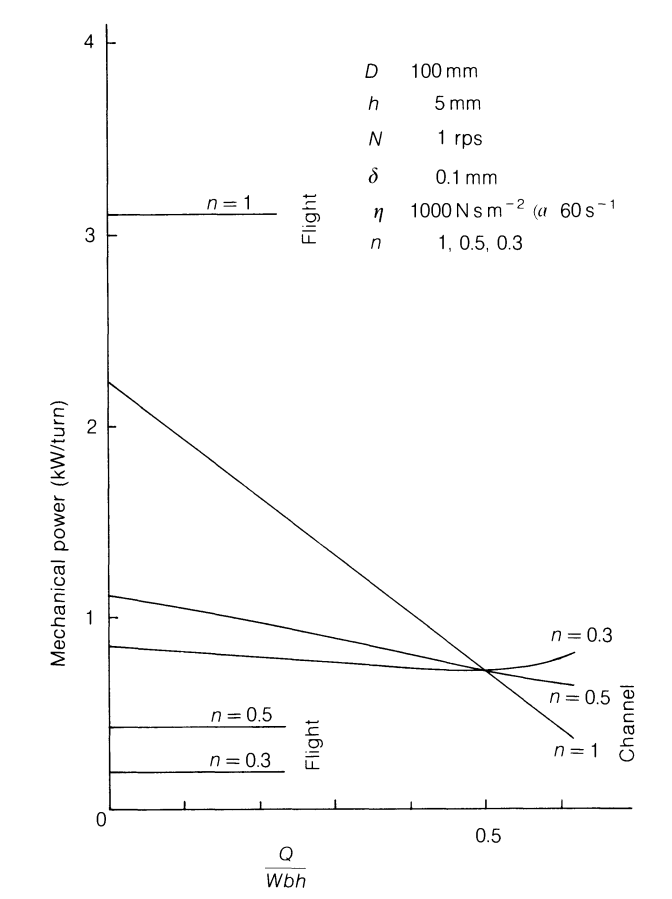

图8.14 机械功率随压力的变化。

螺棱间隙贡献的总功率比例也变得小得多。由于产量 $Q$ 随背压增加而减少，比功率 $E / Q$（相对于螺槽在 $Q / Wbh = 1 / 2$ 处的单位值绘制）增加甚至更快，表明在 高背压和低产量下温度升高的严重问题。

<table><tr><td>直径</td><td>D</td><td>100 mm</td></tr><tr><td>螺槽深度</td><td>h</td><td>5 mm</td></tr><tr><td>螺距</td><td>p</td><td>100 mm</td></tr><tr><td>螺棱宽度</td><td>t</td><td>10 mm</td></tr><tr><td>转速</td><td>N</td><td>1 rps</td></tr><tr><td>粘度 (螺槽)</td><td>η</td><td>1000 N s m-2 在剪切速率 59.87 s-1 时</td></tr><tr><td>假塑性指数</td><td>n</td><td>1, 0.5, 0.3</td></tr><tr><td>螺棱间隙</td><td>δ</td><td>0.1 mm</td></tr></table>

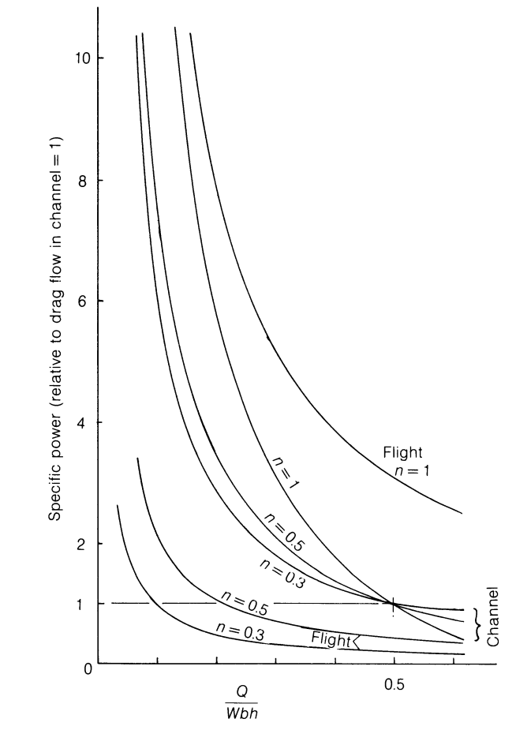

图8.15 比功率 vs 背压。

然后

螺槽宽度 $b = (p - t)\cos \phi = 0.08576\mathrm{m}$

螺旋角 $\phi = 17.657^{\circ}$

螺旋长度 $\mathrm{dz} = 0.1\pi /\cos \phi = 0.3297\mathrm{m}$（一圈）

周向速度 $\pi DN = \pi 0.1\times 1 = 0.3142\mathrm{ms}^{-1}$

纵向

速度 $W = 0.2994\mathrm{ms}^{-1}$

横向

速度 $U = 0.0953\mathrm{ms}^{-1}$

拖曳流 $Q_{\mathrm{D}} = 0.2994 \times 0.08576 \times 0.005 / 2$

$= 0.642\times 10^{-4}\mathrm{m}^3\mathrm{s}^{-1}$

质量拖曳流 $\rho Q_{\mathrm{D}} = 0.0505\mathrm{kg}\mathrm{s}^{-1}$ 如果密度为 $786\mathrm{kg}\mathrm{m}^{-3}$

拖曳流

剪切速率 $\dot{\gamma}_{\mathrm{D}} = W / h = 0.2994 / 0.005 = 59.87\mathrm{s}^{-1}$

因子 $4(1 + \tan^2\phi) = 4.4053$

牛顿

$$
\begin{array}{l} \begin{array}{l} \text {N e w t o n i a n} \\ \text {c h a n n e l p o w e r} \end{array} \mathrm {d} E = \frac {1 0 0 0 \times (0 . 2 9 9 4) ^ {2} \times 0 . 0 8 5 7 6 \times 0 . 3 2 9 7}{0 . 0 0 5} \left(4. 4 - \frac {6 Q}{W b h}\right) \\ = 5 0 6. 8 \left(4. 4 - \frac {6 Q}{W b h}\right) \mathrm {W} / \text {t u r n} \\ \end{array}
$$

螺棱功率 $= \frac{\eta \times (0.2994)^{2} \times 0.01 \times 0.3297}{0.0001 \times \cos \phi}$

$$
= 3. 1 0 \eta \mathrm {W} / \text {t u r n}
$$

上述例子可扩展以说明背压对热平衡的影响。需要进一步的假设：

<table><tr><td>熔体温度</td><td>T</td><td>157.6°C (与以下关于N和T影响的例子一致)</td></tr><tr><td>熔体密度</td><td>ρ</td><td>786 kg m-3 来自图 A.1</td></tr><tr><td>比热</td><td>Cp</td><td>2300 J kg-1K-1 来自表4.1 LDPE</td></tr><tr><td>在115°C下熔融的能量</td><td></td><td>3.3 × 105 J kg-1 来自图 A.2 (ref. 70)</td></tr><tr><td>熔体长度</td><td></td><td>8 圈</td></tr><tr><td>假塑性指数</td><td>n</td><td>0.3436</td></tr></table>

在结晶熔点 $115^{\circ}\mathrm{C}$ 处的内能为 $3.3 \times 10^{5} \mathrm{~J} \mathrm{~kg}^{-1}$。在 $157.6^{\circ}\mathrm{C}$ 处的内能则为：

$$
1. 3 \times 1 0 ^ {5} + 2 3 0 0 (1 5 7. 6 - 1 1 5) = 4. 2 8 \times 1 0 ^ {5} J k g ^ {- 1}
$$

在 $Q / Wbh = 0.5$ 处的质量流量为：

$$
0. 6 4 2 \times 1 0 ^ {- 4} \times 7 8 6 = 0. 0 5 0 5 k g s ^ {- 1}
$$

其他值与 $Q / Wbh$ 成正比，由此以瓦特为单位的总内能通过乘以 $4.28 \times 10^{5} \, \text{J kg}^{-1}$ 获得。损失 $S$ 从表C.1的数据计算，机筒 $1.7 \, \text{m}$（$20L / D$ 减去进料的 $3L / D$）长和 $150 \, \text{mm}$ 外径，根据附录C.1中列表试验中使用数据的简单比例，即 $600 \, \text{mm 长} \times 127 \, \text{mm OD}$，口模和适配器具有相同假设的损失。则从表C.1的设置1、3和5，对于 $100 \, \text{mm 直径机器}$ 的总损失预测为：

<table><tr><td>熔体温度 (°C)</td><td>总损失 (W)</td></tr><tr><td>150</td><td>6374</td></tr><tr><td>200</td><td>8970</td></tr><tr><td>250</td><td>13061</td></tr><tr><td>157.6</td><td>6769 由内插</td></tr></table>

(table-8-5)=
表8.5 能量平衡随背压的变化

<table><tr><td>Q/Wbh</td><td></td><td>0</td><td>0.1</td><td>0.2</td><td>0.3</td><td>0.4</td><td>0.5</td></tr><tr><td>流量 ×10-4</td><td>m3s-1</td><td>0</td><td>0.128</td><td>0.257</td><td>0.385</td><td>0.514</td><td>0.642</td></tr><tr><td>质量流量</td><td>kg s-1</td><td>0</td><td>0.0101</td><td>0.0202</td><td>0.0303</td><td>0.0404</td><td>0.0505!</td></tr><tr><td>内能 I</td><td>W</td><td>0</td><td>4320</td><td>8640</td><td>12961</td><td>17281</td><td>21601</td></tr><tr><td>壁面剪切速率</td><td>s-1</td><td>239.5</td><td>203.6</td><td>167.6</td><td>131.7</td><td>95.79</td><td>59.87</td></tr><tr><td>螺槽粘度</td><td>N s m-2</td><td>402.5</td><td>447.9</td><td>508.7</td><td>596.0</td><td>734.5</td><td>1000</td></tr><tr><td>螺槽功率</td><td>W/圈</td><td>897.7</td><td>862.8</td><td>825.1</td><td>785.5</td><td>744.6</td><td>709.3</td></tr><tr><td>螺棱功率</td><td>W/圈</td><td>230.3</td><td>230.3</td><td>230.3</td><td>230.3</td><td>230.3</td><td>230.3</td></tr><tr><td>ECH + EFl</td><td>W/圈</td><td>1128.0</td><td>1093.1</td><td>1055.4</td><td>1015.8</td><td>975.4</td><td>939.6</td></tr><tr><td>功率 (8圈)</td><td>W</td><td>9024</td><td>8745</td><td>8443</td><td>8126</td><td>7803</td><td>7517</td></tr><tr><td>熔融功率</td><td>W</td><td>0</td><td>3331</td><td>6662</td><td>9993</td><td>13324</td><td>16655</td></tr><tr><td>总功率 E</td><td>W</td><td>9024</td><td>12076</td><td>15105</td><td>18119</td><td>21127</td><td>24172</td></tr><tr><td>热损失 S</td><td>W</td><td>6769</td><td>6769</td><td>6769</td><td>6769</td><td>6769</td><td>6769</td></tr><tr><td>加热器功率 H</td><td>W</td><td>-2255</td><td>-987</td><td>304</td><td>1611</td><td>2923</td><td>4198</td></tr><tr><td>H = I + S - E</td><td></td><td></td><td></td><td></td><td></td><td></td><td></td></tr></table>

螺槽中的机械功率 $E_{\mathrm{Ch}}$ 对于每个 $Q / Wbh$ 值从方程(8.7)计算，使用从方程(6.69)的壁面剪切速率计算的粘度，取粘度在拖曳流剪切速率 $59.87\mathrm{s}^{-1}$ 下为 $1000\mathrm{N}\mathrm{s}\mathrm{m}^{-2}$，假塑性指数 $n$ 为0.3436。螺棱功率 $E_{\mathrm{Fl}}$ 类似地从方程(8.8)计算，使用 $\pi DN / \delta = 3142\mathrm{s}^{-1}$ 的剪切速率，给出粘度为 $74.3\mathrm{N}\mathrm{s}\mathrm{m}^{-2}$，每圈螺棱功率为 $230.3\mathrm{W}$。螺槽和螺棱功率之和乘以8圈（假设恒定）并加到熔融能量（等于在 $115^{\circ}\mathrm{C}$ 处的内能）即 $3.3\times 10^{5}$ 乘以质量流量。计算值在表8.5中给出，并绘制在图8.16中。这表明随着背压增加，总机械功率 $E$ 不像内能 $I$（或 $I + S$ 因为损失 $S$ 恒定）那样快速减少，因此在拖曳流 $(Q / Wbh = 0.5)$ 时需要加热以维持所选熔体温度 $(157.6^{\circ}\mathrm{C})$，而在高背压和低相对流量下将需要冷却。此例子大致相当于图8.14和8.15中 $n = 0.3$ 的曲线，尽管不那么显著，因为后者仅指熔体段中的功率。然而，熔融点倾向于随压力增加而后移，给出更长的熔体长度、更高的机械功率，以及比图8.16所示从加热到冷却更快速的变化，随着压力增加。

在实践中这意味着在高背压下可能难以维持低熔体温度，例如用于吹塑成型，而后者在减少外部加热需求和伴随的径向温度梯度方面可能是有益的，在高熔体温度需要的地方，例如用于纸张涂覆，其中口模阻力无论如何可能很高。

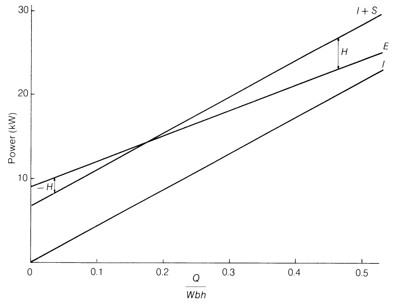

图8.16 能量平衡随背压的变化。

通过改变尺寸和材料属性，曲线的位置、斜率和形状可以改变，例如使得加热总是需要的，因此图8.16应被视为典型的而非普遍的。

另一个例子，使用相同的尺寸，显示在固定的 $Q / Wbh$ 值下热平衡随熔体温度 $T$ 和螺杆转速 $N$ 的变化。后者任意取为0.3，代表中等背压。与图8.16一样，目的是显示趋势而非绝对值。

为了强调变化，但不变更自生温度 $T_{\mathrm{B}}$ 和转速 $N_{\mathrm{B}}$ 的值，仅考虑熔点以上的内能 $I$ 和熔体段中的机械功率 $E$，即将熔融聚合物的能量分别从 $I$ 和 $E$ 中扣除，维持平衡；在估计所需驱动电机功率或螺杆扭转强度时这当然不能忽略。

所选聚合物（也用于附录C.5）是典型的MFR 2.0 LDPE，在剪切速率 $30\mathrm{s}^{-1}$（螺杆螺槽的典型值）下在 $150^{\circ}\mathrm{C}$ 时的粘度为 $2200\mathrm{N}\mathrm{sm}^{-2}$，在 $200^{\circ}\mathrm{C}$ 时为 $730\mathrm{N}\mathrm{sm}^{-2}$。在剪切速率 $2000\mathrm{s}^{-1}$（螺棱间隙的典型值）下，粘度为在 $150^{\circ}\mathrm{C}$ 时 $124\mathrm{N}\mathrm{sm}^{-2}$，在 $200^{\circ}\mathrm{C}$ 时 $61\mathrm{N}\mathrm{sm}^{-2}$。为将例子扩展到 $250^{\circ}\mathrm{C}$，使用方程(3.8)覆盖宽温度范围，但由于粘度在结晶熔点（取为 $115^{\circ}\mathrm{C}$）处实际上无穷大，该方程中的 $T$ 取为高于 $115^{\circ}\mathrm{C}$ 的温度差。则从上述实验

粘度：

$$
\begin{array}{l} E / R = 6 5. 6 3 9 \text {在} 3 0 \mathrm {s} ^ {- 1} \\ E / R = 4 2. 2 1 0 \text {在} 2 0 0 0 \mathrm {s} ^ {- 1} \\ n = 0. 3 1 5 2 \text {在} 1 5 0 ^ {\circ} \mathrm {C} \\ n = 0. 4 0 9 0 \mathrm {在} 2 0 0 ^ {\circ} \mathrm {C} \\ n = 0. 4 3 3 3 \mathrm {在} 2 5 0 ^ {\circ} \mathrm {C} \\ \eta = 5 4 8. 4 \mathrm {N} \mathrm {s m} ^ {- 2} \text {在} 3 0 \mathrm {s} ^ {- 1} \text {和} 2 5 0 ^ {\circ} \mathrm {C} \\ \eta = 5 0. 7 5 \mathrm {N} \mathrm {s m} ^ {- 2} \text {在} 2 0 0 0 \mathrm {s} ^ {- 1} \text {和} 2 5 0 ^ {\circ} \mathrm {C} \\ \eta = 1 0 0 0 \mathrm {N} \mathrm {s} \mathrm {m} ^ {- 2} \text {在} 6 0 \mathrm {s} ^ {- 1} \text {和} 1 5 7. 6 ^ {\circ} \mathrm {C}, \text {如前面的例子} \\ \end{array}
$$

对于 $Q / Wbh = 0.3$，由方程(6.69)给出的壁面剪切速率为

$$
\dot {\gamma} _ {h} = \frac {W}{h} (4 - 6 \times 0. 3) = 2. 2 \frac {W}{h}
$$

由方程(8.7)给出的螺槽功率为

$$
E _ {\mathrm {C h}} = \frac {\eta W ^ {2} b \mathrm {d} z}{h} [ 4 (1 + \tan^ {2} \phi) - 6 \times 0. 3 ] = \frac {2 . 6 \eta W ^ {2} b \mathrm {d} z}{h}
$$

熔体长度再次假设恒定为8圈。对于150、200和 $250^{\circ}\mathrm{C}$ 的熔体温度以及1、2和4 rps的螺杆转速的值在表8.6中给出。热平衡在图8.17和8.18中分别针对熔体温度和螺杆转速绘制。

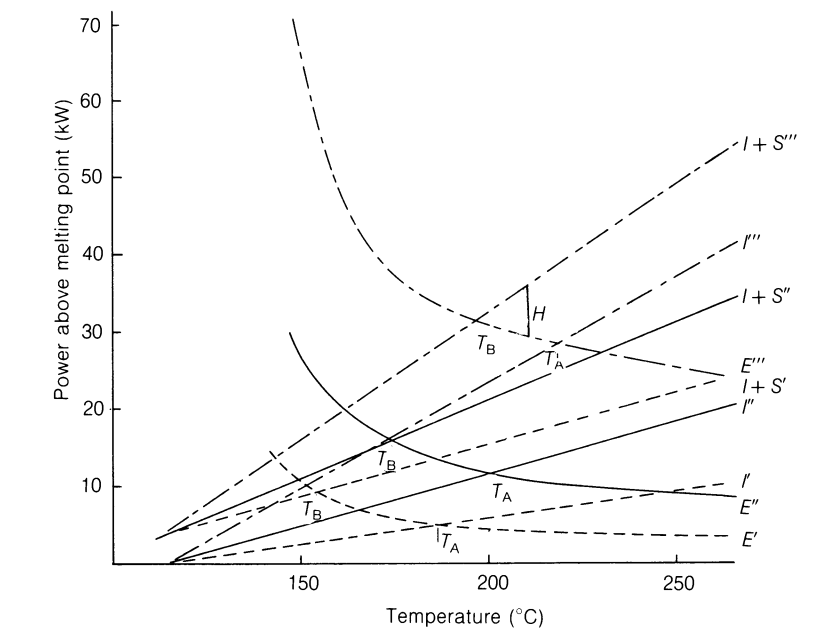

图8.17 能量平衡随熔体温度的变化。

(table-8-6)=
表8.6 能量平衡随熔体温度和螺杆转速的变化

<table><tr><td>熔体温度</td><td>°C</td><td>150</td><td>200</td><td>250</td></tr><tr><td>1 rps</td><td></td><td></td><td></td><td></td></tr><tr><td>壁面剪切速率</td><td>s-1</td><td>131.7</td><td>131.7</td><td>131.7</td></tr><tr><td>粘度 ηCh</td><td>N s m-2</td><td>798.8</td><td>304.5</td><td>237.2</td></tr><tr><td>螺槽功率</td><td>W/圈</td><td>1052.8</td><td>401.3</td><td>312.6</td></tr><tr><td>螺棱功率</td><td>W/圈</td><td>282</td><td>145</td><td>122</td></tr><tr><td>总功率 (熔体)</td><td>W</td><td>10678</td><td>4370</td><td>3477</td></tr><tr><td>内能 I115-T</td><td>W</td><td>2439</td><td>5830</td><td>9110</td></tr><tr><td>损失 S</td><td>W</td><td>6374</td><td>8970</td><td>13061</td></tr><tr><td>热能 H</td><td>W</td><td>-1865</td><td>10430</td><td>18694</td></tr><tr><td>2 rps</td><td></td><td></td><td></td><td></td></tr><tr><td>壁面剪切速率</td><td>s-1</td><td>263.4</td><td>263.4</td><td>263.4</td></tr><tr><td>粘度 ηCh</td><td>N s m-2</td><td>497.0</td><td>202.2</td><td>160.1</td></tr><tr><td>螺槽功率</td><td>W/圈</td><td>2620.1</td><td>1065.9</td><td>844.0</td></tr><tr><td>螺棱功率</td><td>W/圈</td><td>702</td><td>384</td><td>329</td></tr><tr><td>总功率 (熔体)</td><td>W</td><td>26577</td><td>11599</td><td>9384</td></tr><tr><td>内能 I115-T</td><td>W</td><td>4883</td><td>11660</td><td>18202</td></tr><tr><td>损失 S</td><td>W</td><td>6374</td><td>8970</td><td>13061</td></tr><tr><td>热能 H</td><td>W</td><td>-15320</td><td>9031</td><td>21879</td></tr><tr><td>4 rps</td><td></td><td></td><td></td><td></td></tr><tr><td>壁面剪切速率</td><td>s-1</td><td>526.9</td><td>526.9</td><td>526.9!</td></tr><tr><td>粘度 ηCh</td><td>N s m-2</td><td>309.1</td><td>134.2</td><td>108.1</td></tr><tr><td>螺槽功率</td><td>W/圈</td><td>6518</td><td>2830</td><td>2279</td></tr><tr><td>螺棱功率</td><td>W/圈</td><td>1746</td><td>1021</td><td>888</td></tr><tr><td>总功率 (熔体)</td><td>W</td><td>66112</td><td>30807</td><td>25340</td></tr><tr><td>内能 I115-T</td><td>W</td><td>9761</td><td>23319</td><td>36403</td></tr><tr><td>损失 S</td><td>W</td><td>6374</td><td>8970</td><td>13061</td></tr><tr><td>热能 H</td><td>W</td><td>-49977</td><td>1482</td><td>24124</td></tr></table>

图8.17中显示的在约 $150^{\circ}\mathrm{C}$ 以下熔体温度时机 械功率 $E$ 的快速上升部分是由于使用的方程(3.8)，$200^{\circ}\mathrm{C}$ 以上几乎水平的线也是如此。然而，它强调低熔体温度难以实现，特别是在高螺杆转速下，需要剧烈冷却，后果如第256页所述。此计算未尝试包含图8.11所示的机筒冷却的额外影响。在高熔体温度下，机械功率可能变化很小，但需要增加加热器输入 $H$ 以提高熔体温度，这是由于聚合物所需内能 $I$ 的增加，以及较小程度上增加的热损失 $S$。每个转速的曲线组与图8.10中的图示表示定性相似，在每个情况下均显示一个绝热温度 $T_{\mathrm{A}}$ 和一个稍低的自生温度 $T_{\mathrm{B}}$；差值 $T_{\mathrm{A}} - T_{\mathrm{B}}$ 在此例中由于假设的相对较大热损失而比较大。如预期，$T_{\mathrm{A}}$ 和 $T_{\mathrm{B}}$ 均随螺杆转速 $N$ 增加，但 $T_{\mathrm{B}}$ 比 $T_{\mathrm{A}}$ 增加更快，且差值 $T_{\mathrm{A}} - T_{\mathrm{B}}$ 变小，由于总

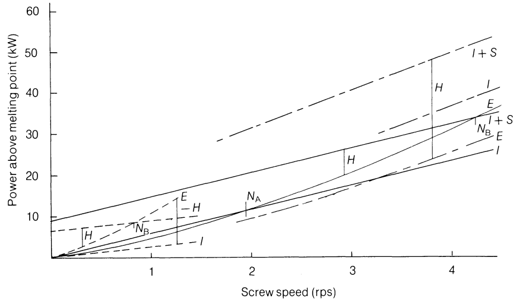

图8.18 能量平衡随螺杆转速的变化。

能量中由损失 $S$ 代表的比例在螺杆高转速下较小。使用相同的螺杆，较高粘度的聚合物，例如较少增塑的PVC或较高分子量，在给定熔体温度和转速下将产生更多的机械功率 $E$，但内能变化很小。因此绝热和自生温度将更高，对最低熔体温度或最高转速施加进一步的限制；显然，如果其中任何一个是关键的，螺杆设计将需要重新考虑。相反，如果低粘度聚合物需要非常高熔体温度，运行更快的更浅螺杆可能是期望的，或者更长的螺杆将给出增加的机械功率输入 $E$ 和更大的表面积用于外部加热 $H$——无论如何，更长的停留时间将最小化螺杆末端的径向温度差。

乍一看，图8.18中的曲线组看起来与图8.12中的相当不同。这部分是因为该例子使用的LDPE是高度非牛顿的 $(0.3 < n < 0.45)$，给出了比牛顿流体更平坦的曲线（与转速 $N$ 的 $(n + 1)$ 次方成正比），如图8.12中的虚线所示。因此图8.12的最左侧部分仅在 $250^{\circ}\mathrm{C}$ 处代表此例子，扩展到大约最大热输入 $H$ 的点且不接近绝热转速 $N_{\mathrm{A}}$，后者在该温度下将非常高。在 $200^{\circ}\mathrm{C}$ 时，绝热点 $N_{\mathrm{A}}$ 在约2 rps时达到，自生转速在约4.2 rps——这些值之间的较大差异部分是由于 $E$ 的平坦曲线（高度非牛顿）部分是由于假设的较大热损失 $S$，如上所述。然而，值得注意的是在这些条件下从加热到冷却的变化也很慢，因此自生转速 $N_{\mathrm{B}}$ 可以被超过而无需剧烈冷却或仅需

熔体温度的适度增加，且温度控制应稳定。这在LDPE的实践中得到证实，其中挤出机已在宽范围的螺杆转速下操作，在维持中等熔体温度方面几乎没有困难，例如用于热熔造粒；$90\mathrm{mm}$ 生产单元在4 rps下运行以及熔体进料机器*在6-7 rps下运行而没有过高的熔体温度或冷却。相反，在 $150^{\circ}\mathrm{C}$ 时，整个图8.12代表仅到约1 rps的例子，且显然在 $150^{\circ}\mathrm{C}$ 时在此转速以上操作将是困难的。如果聚合物更接近牛顿流体，从加热到冷却随转速增加的变化将更快速，如图8.12所示，后者假设在 $T_{\mathrm{A}}$，$N_{\mathrm{A}}$ 处相等的粘度。

此例子假设熔融点的位置保持恒定，尽管熔体温度和转速变化。熔体温度本身预期对熔融点影响很小，尽管这可能由于增加的机筒设定温度而后移。这将倾向于进一步平坦化图8.17中机械功率 $E$ 曲线的右侧高温部分，导致所需外部热量 $H$ 的小幅减少。转速的增加可能导致熔融点前移，减少剩余熔体段的长度和其中耗散的机械功率。这将进一步平坦化图8.18中的功率曲线 $E$，在达到自生转速 $N_{\mathrm{B}}$ 和需要冷却之前允许更大的螺杆转速，前提是螺杆末端的熔体温度变化是可接受的。

这强调了实验确定熔融点位置及其随聚合物粘度、螺杆设计、温度和螺杆转速的变化对于可靠估算能量平衡的重要性。本介绍和例子仅旨在说明趋势并提供对观察到的变化的解释，例如熔体温度或能量输入。更精确的定量预测不仅需要准确了解聚合物在宽范围剪切速率（包括螺棱间隙）和温度下的粘度以及熔融点位置的变化，还需要包含机筒冷却（图8.11）、螺棱间隙中局部加热（附录C.5）和热损失数据（包括口模）的影响。这样的预测也不太可能表明螺杆末端的温度变化和其他影响产品质量的因素。这些将在第9章和第11章中进一步讨论。

*作者使用了一个简单的'V'形联苯夹套料斗，开口约为 $280\mathrm{mm}$（11英寸）见方，紧接在螺杆上方。高分子量LDPE熔体以高达 $1090\mathrm{kg}\mathrm{h}^{-1}$（2400 lb/h）的速率被送入在400 rpm下运行的 $90\mathrm{mm}$（3.5英寸）16:1 $L / D$ 挤出机。挤出物在这些速率下由水下模面切粒机成功造粒，没有过高熔体温度的问题。
