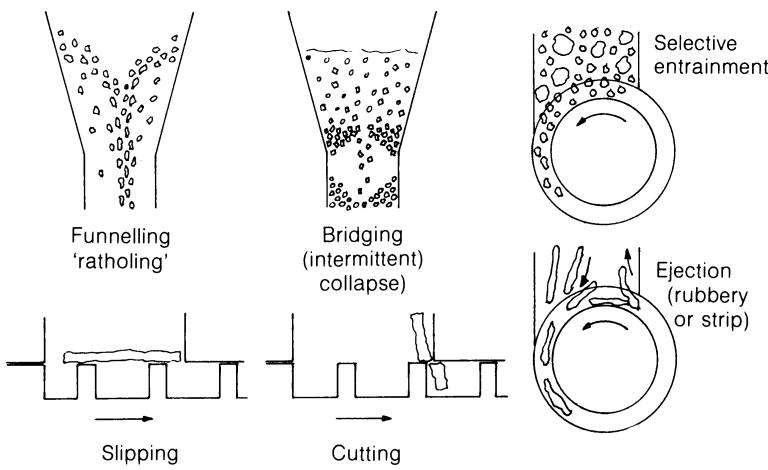
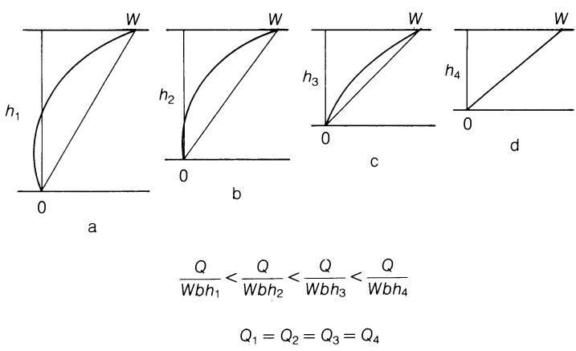
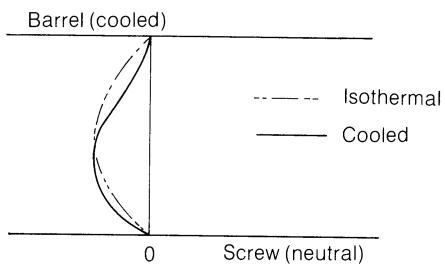
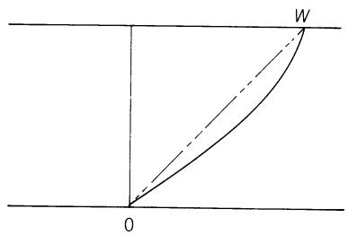
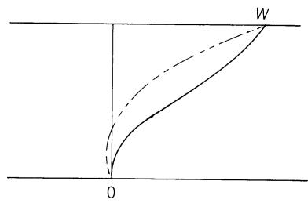
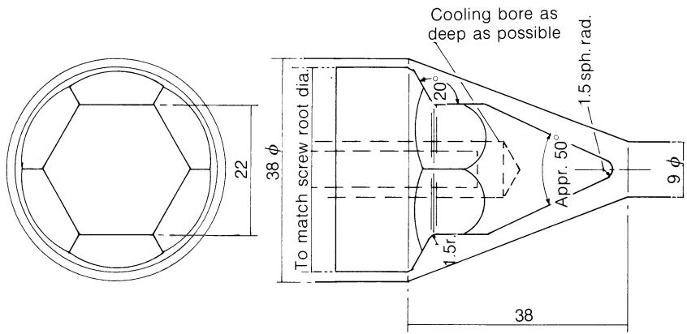
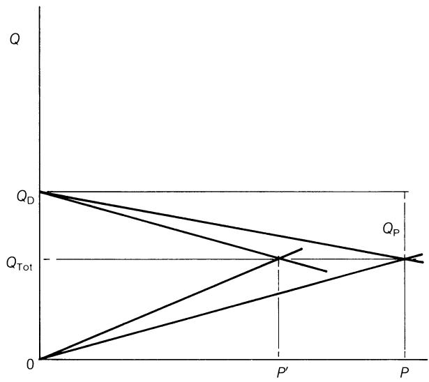
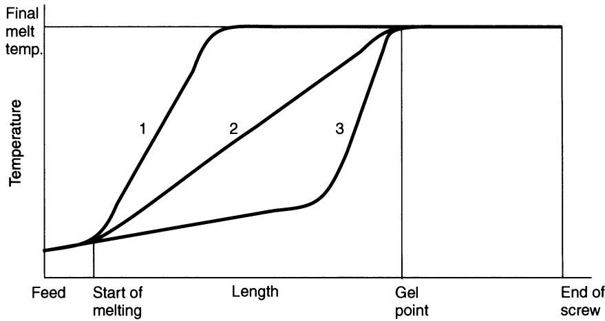

# 单螺杆挤出机的运行

## 9.1 螺杆的整体性能

前几章分别讨论了螺杆通道各功能区以及螺杆间隙内的质量流和热流。即使在稳态运行条件下，这些流场也会相互作用，并与压力及温度梯度相互作用，从而产生速度、剪切和温度同时变化的复杂模式。 任何试图用数学方法全面描述这些现象的尝试，要么会导致非常概括化的公式，要么会导致极其复杂的公式，而这两种情况都难以帮助人们理解其作用机制或运行条件变化所带来的后果。 对后者的理解——这也是本书的主要关注点——对于实现合理且有效的运行至关重要。本书采用的替代方法是，通过定性描述来修正和扩展第6至8章中简化理论的近似解。 实践经验表明，与针对特定性能的设计不同，这些解对于操作策略以及条件变化带来的后果具有重要的指导意义。以下描述涉及固定模头的固体进料单螺杆挤出机的稳态运行，但不包括可选附件或功能。

在考虑挤出机整体性能时，连续性要求对质量流量、压力、温度、能量和混合等物理参数施加了限制，因此，某一环节中某个参数的改变，不仅需要其余环节相应调整，还会影响工艺的整体特性。 为清晰起见，本文将逐一探讨每个参数，尽管这些参数之间不可避免地会相互作用，且这种相互作用构成了整体响应的一部分。

### 9.1.1 物料流

稳态要求材料的净质量流量随时间保持恒定，且在挤出机和模头内的所有点处均保持一致，尽管材料的密度(受温度和相态变化影响)及流动机制各不相同。

由于桥接现象，料斗中的流量可能会间歇性地发生波动。这可能与因漏斗效应或颗粒密度、形状差异(例如再研磨料)导致的偏析同时存在，从而造成成分不均匀。 当处理细粉且料斗料位较高时，由于空气滞留，流动也可能中断。如果这些空气无法通过轴封逸出，可在进料口后部设置横向隔板，使空气从其后方逸出。 为减少桥接和空气滞留，常采用机械搅拌器或振动器。进料喉部冷却不足可能会导致低熔点聚合物的颗粒附着，尤其是附着在前端表面，从而限制物料流动。

螺杆的进料通常依靠重力进行，螺杆周向大部分区域设有间隙较小的淬火进料口衬套，以防止进料物料再次掉出，并提供一定阻力，使其被输送至料筒内，而非仅仅被螺杆带着转圈。 如果螺杆的进料口纯粹是径向的，螺杆可能会将物料逼回进料喉部，从而阻碍新物料的流入，特别是当颗粒具有弹性或相对于螺杆通道的尺寸较大时。 出于这个原因，进料口通常设计为与螺杆下行侧相切；尽管有些设计师认为，在高速运转时，螺杆会“逃离”进料口，而在上行侧，螺杆则会切入下行的物料柱中。 经验表明，在向下侧和通向料筒的端部设置较大的倒角(图7.1)非常有用，这有助于将位于螺杆翅片路径外的物料引导入槽道，而不是使其撞击近乎径向的表面而被弹出。 特别是对于大颗粒或细长条状物料，可以观察到楔入作用不仅发生在螺杆根部与进料口衬板之间，也发生在螺杆叶片尖端与衬板之间——如果没有倒角，螺杆叶片往往会切削和/或将颗粒排出([图 9.1](#figure-9-1))。 进料口长度通常为螺杆直径的三倍，即可充分填满螺杆。需注意，螺杆长度通常从进料口后端开始计算，尽管压实形成物料塞的过程是从前端开始的。由这些机制导致的输出受限现象，在螺杆高速运转时更易发生。

  
(figure-9-1)=
图9.1 饲料分层的原因。

原料颗粒快速压实形成固体塞的同时，夹带的空气会向后位移；如果这一过程被过度延迟(例如由于第一区料筒温度过低)，部分空气可能会被向前带走并出现在挤出产品中。 关于该固体塞向前输送的条件已在第7章中讨论过。为了满足与熔体泵送段的质量流量连续性(方程(6.15))，塞的沿通道向下速度$V_{pz}$可由下式给出：

$$
\rho_ {\mathrm{p}} b h _ {1} V _ {\mathrm{pz}} = \rho_ {\mathrm{m}} \left[ \frac {W b h _ {2}}{2} - \frac {b h _ {2} ^ {3}}{1 2 \eta} \cdot \frac {\mathrm{d} P}{\mathrm{d} z} \right]
$$

or

$$
V _ {\mathrm{pz}} = \frac {\rho_ {\mathrm{m}}}{\rho_ {\mathrm{p}}} \cdot \frac {h _ {2}}{h _ {1}} \left[ \frac {W}{2} - \frac {h _ {2} ^ {2}}{1 2 \eta} \cdot \frac {\mathrm{d} P}{\mathrm{d} z} \right]\tag{9.1}
$$

从图A.1可以看出，对于几种常见的聚合物，熔体密度与固体密度的比值$\rho_{m}/\rho_{p}$(该比值仅取决于相应的温度)介于0.7和0.9之间。 因此，对于压缩比为3:1、在Q/Wbh = 0.5条件下运行的螺杆，$V_{pz} \approx 0.13 W$。 对于具有熔融所需高背压的恒深螺杆，假设 Q/Wbh = 0.2，则 $V_{pz} = 0.16 W$。 因此，在大多数情况下，固体料塞的速度仅占螺杆螺条周向速度($\pi DN = W/\cos \phi$)的一小部分，将固体的输送速率与熔体输送速率相匹配并不困难。 在某些固体输送压力极高的情况下，不仅会产生极高的压力，还会对螺杆施加过大的扭矩。这一点已在第7章关于带沟槽进料段的内容中讨论过；笔者在同时输送多条用于回收的薄膜条时，曾遇到驱动电机过载的情况， 例如宽度为50–100 mm、厚度为$2 \times 0.25$ mm的非吹塑LDPE管状薄膜，以及宽度为25 mm、厚度为0.025 mm的PETP边边料薄膜。 如果两种不同材料(各自单独进料时均无问题)以混合物形式进料，则可能会发生选择性输送现象，例如在橡胶颗粒与聚丙烯粉末的混合物中，橡胶被输送出去，从而在很大程度上排挤了PP粉末，并显著改变了挤出产品的成分。

一些作者曾建议采用某种连续称重喂料机，通过“限料”喂料方式来控制挤出机的产量；根据作者的经验，这种做法会导致固体原料的喂料不那么规律，可能影响熔融过程，输送压力往往会波动，但功率输入仅略有下降，从而导致最终温度升高。 其他研究人员则在进料斗中采用了坚固的螺杆和驱动装置(称为“强制喂料器”)，并配合改进的轴封，这不仅防止了进料斗中的架桥现象，还对进料段施加了压力。 笔者曾目睹过一台 150 毫米(6 英寸)挤出机对聚丙烯粉末进行致密化处理以备造粒的试验；在给定的螺杆转速下，产量提高了约 25–30%，而熔体温度和聚合物的降解程度则显著降低。 主驱动电机的负载大幅增加，当喂料机速度提高时，在82千瓦(110马力)的主电机达到满载之前，2.2千瓦(3马力)的喂料机电机就已失速，因此必须进行仔细控制。

第7章已对熔化段中压实固体与熔体并行流动的情况进行了分析；在稳态运行中，这两者的总和显然必须等于熔体输送段中的总和。 熔池中的流动机制和流动模式将与熔体输送段(第6.2节)相似，主要由螺杆与筒体的相对运动驱动。 除非在更早的阶段(例如在固体输送段)就产生了压力，否则这种拖曳流代表熔池中的最大流速，其近似表达式为 $\rho_{\mathrm{m}}F_{\mathrm{D}}W(b - X)h / 2$ 近似给出，其中 $F_{\mathrm{D}}$ 是宽度为 $(b - X)$、深度为 $h$ 的通道的拖曳流形状因子(Mckelvey，1962)。 由于构成“通道”一侧的固体床具有向前运动速度，该计算结果会略有低估。固体床中的质量流量为 $\rho_{\mathrm{p}}V_{\mathrm{pz}}Xh$ 。在无压力升高的恒定深度螺旋输送机中：

$$
\frac {\rho_ {\mathrm{m}} F _ {\mathrm{D}} W (b - X) h}{2} + \rho_ {\mathrm{p}} V _ {\mathrm{pz}} X h = \frac {\rho_ {\mathrm{m}} F _ {\mathrm{D}} ^ {\prime} W b h}{2}
$$

or

$$
V _ {\mathrm{pz}} = \frac {\rho_ {\mathrm{m}}}{\rho_ {\mathrm{p}}} \cdot \frac {W}{2} \left[ F _ {\mathrm{D}} + \left(F _ {\mathrm{D}} ^ {\prime} - F _ {\mathrm{D}}\right) \frac {b}{X} \right]\tag{9.2}
$$

如上所述，$0.7 < \rho_{m}/\rho_{p} < 0.9$，$b/X > 1$ 且 $F_{D}^{\prime} - F_{D}$ 为正值，尽管数值较小(除熔化初期 $b/X \to 1$ 时外)，而此时 $F_{D}$ 略小于 1；因此，要满足连续性条件，需满足 $V_{pz} \approx 0.4 W$ 。 实践经验表明，恒定深度的螺杆需要相当大的背压才能实现较为满意的熔融，这可解释为：限制熔体输送段的平均速度，以使之与固体床在通道下游可达到的速度保持连续性。 若施加背压，将 Q/Wbh 降低至 0.2(例如)，则 $V_{pz} = 0.16 W$(如上所述)。塔德莫尔理论假设 $V_{pz}$ 在熔化区保持恒定，并得出固体床宽度 X 呈近乎线性减小的结果。 这要求熔池中的 $Q/W(b - X)h$ 仅以 $1/F_{D}$ 的比例变化，其变化量相对于熔体泵送段的 $Q/Wbh$。这将预测随着熔化进程的推进，纵向压力梯度仅略有增加，且与熔体泵送段中的压力梯度保持连续性。

如果将相同的假设应用到前面的例子中，即压缩比为 3:1 的螺杆，且在熔体输送段中 $Q / Wbh_{2} = 0.5$，则 $V_{pz} \approx 0.13W$。 若假设熔化过程发生在螺杆的压缩段内，且固体床速度在整个熔化区内保持恒定，则其宽度 $X$ 将近似呈线性减小，如图 7.28(a) 所示。 根据连续性原理可推算，熔池中的 $Q / W(b - X)h$ 将从熔化开始时的约 $0.3 / F_{\mathrm{D}}$ 增加到熔化结束时的 $0.5 / F_{\mathrm{D}}$。 这对应于熔化区内的压力梯度逐渐减小，如同锥形熔体泵送区的情况(见图 6.11 的右下部分)。 如果熔体泵送区内的压力增加($Q / Wbh_{2} < 0.5$)，则熔池中的压力梯度将逐渐趋近于图 6.11 左上角所示的情况，并如图 7.28(b) 所预测的那样。 如果固体床速度低于初始值，或者其宽度减小速度慢于预测值，那么根据连续性原理，熔池中的流量将不得不增大，尤其是在熔化开始阶段，而熔化区产生的压力将大幅降低。 如果熔化过程持续到螺杆的锥形段之后，进入深度恒定的“计量”段，预计也会出现类似的影响。相反，如果熔化在锥形段开始之前就已启动，即使熔化速度慢于Tadmor模型的预测，仍可能产生压力。

熔体泵送区通道内的等温流动可通过方程(6.67)和(6.26)分别对沿通道方向和横向速度进行恰当描述：

$$
w = \frac {W y}{h} + \frac {6 W}{h ^ {2}} \left(\frac {1}{2} - \frac {Q}{W b h}\right) (y ^ {2} - y h)\tag{6.67}
$$

$$
u = \frac {U y}{h} \left(\frac {3 y}{h} - 2\right)\tag{6.26}
$$

前者给出的净流速如式(6.15)所示，而后者(忽略泄漏)给出的流速为零，如式(6.24)所示。 第 6.2 节(图 6.8)讨论了由此产生的流动模式，该模式产生了端到端和横向混合，其中(仅)前者受纵向压力梯度影响。 第 6.4 节(图 6.11)讨论了深度变化的螺旋对压力梯度的影响，其中可以看出，由于连续性原理，当 Q 保持恒定时，h 的减小意味着 Q/Wbh 的局部值增加。 如果通过从方程(6.67)中提取深度分数 y/h 来表示通道中的位置 y，则可见阻力流项仅随 h 的垂直(径向)尺度而变化，而压力流项的幅值也会随着 $Q/Wbh \rightarrow 1/2$ 而减小。 因此，在锥形螺旋中，沿流道下行的速度分布会从图6.6(b)变为图6.6(c)，最终变为图6.6(d)或图6.6(e)，尽管h的尺度在变化([图9.2](#figure-9-2))。方程(6.26)表明，横向速度分布仅随尺度 h 而变化。因此，即使在等温条件下，深度变化的螺杆沿长度方向的流动模式也在不断变化。 第 6.7 节和第 6.8 节分别讨论了非牛顿流和非等温流的定性效应。 尽管泄漏量很小(第 6.3 节)，但它会减少由方程 (6.15) 给出的净流量，并重新卷入靠近筒体表面的前一螺杆圈的流场中，在那里迅速分散。

  
(figure-9-2)=
图9.2 锥形螺杆中速度分布的变化。

### 9.1.2 压力

压力的影响与流体流动的影响密不可分。螺杆各连续段中的压力升高(或降低)必须呈累加关系，正如式(6.61)所示的熔体输送段的情况，且该压力值应等于模头、断料板等的总阻力。 第7章已指出，在没有强制进料或带沟槽的进料段衬套的情况下，固体输送区的压力较低。然而，这种压力或与其相关的流速似乎是熔融区固体物料沿螺杆向前移动的主要机制(Stevens，1970)。 如上所述，熔融理论预测熔池内会发生显著的压力上升。Weeks 和 Allen(1962)发现，当模头压力较高且熔体泵送段相对较深时，存在此类压力上升的证据，而产生此类压力需要相当长的泵送段长度。随着模头压力的增加，初始压力上升点似乎向进料端移动。 相比之下，当模压在5至45 MPa之间、螺杆转速在0.3至1.3 rps之间时，熔体泵送段较浅的螺杆在初始压力上升的锥形区域内，其位置几乎保持恒定。 在此情况下，熔体温度接近料筒内壁温度，且至少比结晶熔点高$15^{\circ}$ C，这表明在初始压力上升点处，熔化过程基本上已经完成。 熔融区压力上升对熔融速率的敏感性使得压力上升的预测变得困难；在高模压下，它似乎对总压力上升有显著贡献，而在所讨论的螺杆类型下，低模压条件下，它似乎贡献甚微。 因此，产生压力的有效长度尚不确定；但另一方面，初始压力上升点作为“凝胶点”的参考指标并不可靠，例如在确定合适的料筒温度分布时。

熔体输送段中的纵向压力梯度(包括背压和流道深度的影响)已在第6.4节中进行了讨论。这些因素与横向压力梯度(从后缘向先缘逐渐升高，在[图6.7]中由右向左[(11_Extruder_operation_as_part_of_a_total_process.md#figure-6-7)中，从后缘到前缘螺旋叶片边缘，由右向左)共同作用，导致料筒上某固定点处压力周期性波动，实践中可通过压力表观察到这一现象。 这种波动通常在螺杆末端稍远处就会被衰减。压力通过接头和模头逐渐下降，其中最大的降压发生在模头凸缘以及任何限流条/环处，从而控制了流量。 第 5.3.3 节指出了模头中可能出现的横向压力差，而压力的时间波动将在 [第 11.2 节](11_Extruder_operation_as_part_of_a_total_process.md#112-stability) 中进行讨论。

### 9.1.3 温度

挤出机内聚合物温度升高主要导致粘度降低(方程(3.8))，并在较小程度上降低熔体弹性。 前者导致机械功减少，从而导致剪切加热减少(方程(3.57))，并在固定流速下降低压降(方程(3.23))。 大多数聚合物的导热系数较低(附录 A)，这限制了热流以及因料筒温度升高而导致的聚合物温度上升，而料筒温度的升高往往也会降低剪切加热，因此最终的变化结果并不明确。 金属料筒和螺杆中的纵向传导也限制了聚合物中的纵向温度梯度(表 8.1)。

进入挤出机的固体原料通常处于室温状态；\* 通常采用原料仓水冷的方式，以使原料在通过进料口之前保持自由流动状态——但这是否也有助于原料沿螺杆输送尚不确定。 来自第一段料筒加热器的传导热可能导致原料粘连，这为第一区温度设定了上限。螺杆的进料段也会通过纵向传导吸收热量，但其温度通常未知且不受控制——第20页提到了一个例外情况。 在料筒内，聚合物通过与料筒(以及可能与螺杆)的热传导而受热，导致压实料团内部产生温度梯度；同时还会发生剪切加热，主要发生在金属表面。由于固体料床保持其整体形态，其内部的这些温差往往会持续存在，直到在熔融区末端被打破为止。 一旦到达轴向位置，此时机筒温度高于聚合物的软化/熔点，由于传导加热与局部剪切加热的综合作用，将形成一层熔融聚合物薄膜。起初，这层薄膜将改善机筒与固体聚合物颗粒之间的接触，从而增强传导加热，但可能减少摩擦加热。 当薄膜厚度超过螺杆螺纹间隙时，它往往会被螺杆螺纹收集起来，通常在螺杆前端面形成一个“熔池”，如第 7 章所述。 熔融薄膜中的粘性加热可能会使其温度升高至高于料筒温度，从而减少来自料筒的热传导，并提高熔池的平均温度。 在此处，也会发生强度较弱的粘性加热，但热量往往会通过传导散失到暴露的筒体和螺杆表面，也会通过与固体床的界面散失。熔池内的温度差异将通过横向循环([图 6.7](11_Extruder_operation_as_part_of_a_total_process.md#figure-6-7)) 降至最低，但在固相床破碎点处，熔体的平均温度可能明显高于新熔融物料和剩余固体颗粒的温度。 当熔融过程达到固体床破碎这一状态时，软化的颗粒便悬浮在熔体中。根据普遍经验，在单螺杆挤出机中，粉末的均匀熔融往往比同种颗粒状聚合物更难实现； 笔者发现，在高螺杆转速下，当同种聚合物以颗粒形式加工时能获得令人满意的熔融输出，但粉末形式却会形成一串未熔化的粉末颗粒，这些颗粒表面包裹着一层熔融聚丙烯。因此，粉末进料的挤出机通常会将熔融段延长至4至8个螺杆直径，以适应较慢的熔融速度。 导致这些受热软化但仍相对刚性的颗粒被消除得较为缓慢的机制，主要是来自熔体的热传导；这一过程将耗费相当长的时间，且当聚合物到达挤出头时可能尚未完全消除，特别是在高螺杆转速延长了熔融长度并缩短了熔体输送长度的情况下。 即使没有此类颗粒，离开熔融区的聚合物温度也可能不均匀。

熔化段中相对较低的料筒温度有望抑制料筒表面附近熔融膜的形成，并加强固体床内的剪切作用，从而增加机械功输入并降低加热器输入。 经验证实了后一点，同时表明产量未必会受到影响，且最终熔体温度可能会升高。在某些情况下，这似乎能改善最终熔体的温度均匀性，并提高未熔颗粒在模头处出现的临界速度。这突显了熔化段中正确设定和精确控制筒体温度的重要性。

熔化段中螺杆温度的影响尚未确定，但预计会影响固体床的向前速度，并可能影响固体床破裂的位置； 特别是在料筒温度较低的情况下，仅对该段进行螺杆冷却(以避免干扰熔体输送段)，预计可通过延缓固体床的移动和破碎，从而改善熔化效果。

在熔体输送区内，如第8.4节所示，内部剪切加热将是不均匀的，且从筒体传导的热量往往会导致靠近筒体表面的熔体温度较高。 如第 8.4 节所示，横向循环往往会减小这些温差，尽管沿通道向下的流速差异(图 6.6)确保了这种情况不会在横向平面上发生，因此无法实现横向温度均匀性。 这种循环是一种层流([图 6.7](11_Extruder_operation_as_part_of_a_total_process.md#图-6-7))，因此容易形成一个未混合的中心核心，该核心具有显著的沿通道向下的流速(图 6.6(c) 和 6.6(d))，但其温度与螺杆末端的外层不同。 Barnett 等人(1966)的实验表明，这些温差会从最大值向模头方向逐渐减小，但同时也表明，在高螺杆转速下，模头处仍可能存在显著的温度波动——这一点将在[第 11.1 节](11_Extruder_operation_as_part_of_a_total_process.md#111-quality)——有观点认为，消除这些温差是螺杆“计量”段的主要功能。 一般而言，此类温差不仅会直接影响模头内的流动以及产品的差异性冷却，还会通过熔体弹性及恢复性间接影响挤出后的操作(如模头膨胀、拉伸、吹膜、型坯下垂等)，因此是不希望出现的。 有人认为，通过较小的压力梯度(图 6.6(c) 或 6.6(d))以及熔体输送段末端附近螺杆内较小的轴向温差，可以最大限度地减小不均匀剪切加热和螺杆传导的影响； 前者意味着在适度的模头压力下采用锥形螺杆(图6.11)，后者则意味着采用阶梯式设定温度曲线([图9.6](#figure-9-6)中的3)。

### 9.1.4 能量传递

能量的产生与传递与温度变化密切相关；前者的不平衡表现为显热(内能)和温度的变化，而后者则会影响粘度以及由剪切产生的能量。

主要能量来源是驱动电机和机筒加热器，它们为输送到模头的聚合物提供有用的内能和压力能，同时也会向周围环境散失热量。 第 8.5 节讨论了这些能量之间的平衡以及运行条件变化对其的影响。挤出机各段内的机械功与热能之间的平衡主要取决于当地的剪切速率和温度条件。 将未压实的聚合物从进料口输送出来时，吸收的能量很少，但在压实聚合物、克服螺杆和料筒表面上的剪切力输送固体料柱以及提高料柱内的压力时，会消耗大量的机械能。 聚合物的低热导率将确保由这些剪切力引起的加热集中于表面附近，从而降低局部应力和能量输入，且该现象在很大程度上取决于金属表面的温度。当表面温度达到聚合物熔点且滞留区开始时， 熔体薄膜与固体塞将共同承受剪切应力，但薄膜的粘度远低于熔体，导致剪切速率更高，因此剪切加热(方程$(3.57)$)将集中在薄膜中，并辅以从金属表面传导的热量。 出于同样的原因，熔融区内的能量耗散将集中在料筒表面及可能的螺杆表面，而固体床则主要通过传导受热。剪切加热也会发生在熔池中，尽管其速率低于熔体薄膜中的剪切加热。 在这两种情况下，料筒温度在整体能量传递中起着双重作用：温度升高会增加传导热量，但会减少剪切加热。因此，料筒加热器控制器上设定的温度可更多地视为对聚合物能量输入的调节，因为前者与聚合物温度仅存在间接关系。

如[第9.1.3节](#913-temperature)所述，在熔体输送段，料筒加热会使聚合物温度升高，但升温不均匀。不过，这会降低剪切能，特别是在螺杆叶片尖端处。 通过筒体加热提高温度将降低总机械功率输入，而背压的增加(方程 $(8.7)$)则会增加单位功率输入——这主要是由于输出减少所致——从而形成控制最终熔体温度以及机械能与加热能输入之间平衡的第二种手段。

筒体冷却与加热被分别考虑，因为其影响并非单纯的负面作用；它会在流道深度方向上产生反向的温度梯度，但最低温度和最高粘度现在出现在剪切速率最高的区域，从而倾向于改变剪切速率。 在压力(毛细)流动中，边界冷却会降低壁面剪切速率(图 4.1)，并加剧速度分布，在此情况下(假设螺杆处于热中性状态)，该分布呈现不对称性([图 9.3](#figure-9-3)(a))。 拖曳流也会因冷却而发生畸变([图 9.3](#figure-9-3)(b))，因此尽管流场的叠加法不再严格成立，但合成的流速分布([图 9.3](#figure-9-3)(c))将偏离等温条件。由于筒体处的速度保持恒定且粘度增加，通道中散发的功率(方程(8.7))必然会增加，这与通常的观察结果一致。 筒体冷却对流道间隙中吸收功率(方程(8.8))的影响将大得多，因此总功率和来自流道间隙的功率比例都会增加，从而导致熔体温度趋于升高。 在极限情况下，料筒冷却会使一层聚合物凝固并导致电机失速；但如果散热不足，冷却不仅会增加机械功率，还会提高整体平均温度，并可能加剧温度的空间波动。 在大型设备中，通道深度越大，温差就越大，而且与热流和质量流相比，用于冷却的表面积是有限的。笔者回忆起一台大型热喂料挤出机，在该机中，筒体冷却使机械功率输入急剧增加，但最终熔体温度却呈上升趋势，而非下降。

(a) 压力流量
  
(b) 拖曳流

  
(c) 组合流量
(figure-9-3)=
图 9.3 带冷却筒体的速度分布曲线。

螺杆冷却所涉及的因素与筒体冷却截然不同。第20页和第278页曾提及在进料区和熔融区可能采用螺杆冷却。 由于熔体导热系数低，且螺杆根部附近的相对速度较低(图6.6和6.7)，因此在熔体输送段进行的螺杆冷却对料筒壁附近的工况影响甚微，从而对功率输入的影响也微乎其微。 对于 UPVC 等热敏性聚合物，通常会采用轻微的螺杆冷却(最好针对螺杆最前端)，以降低螺杆尖端的温度，从而减少该处降解聚合物的积聚。* 较大的空气或水流量，或较低的入口温度，会导致产量显著下降，同时机械功率输入和熔体温度往往会有所增加——其效果类似于在螺杆转速恒定的情况下减小螺道深度(图8.8)。 在熔体输送段，螺杆冷却的效果确实主要表现为减小螺沟深度，当现有螺杆过深时，通常会采用这种方法来达到此目的。 然而，这种变化并非总是能够立即逆转；笔者曾对一台加工UPVC的50 mm挤出机螺杆进行短暂的水冷处理，但在停止冷却8小时后，产量和功率仍未恢复到冷却前的数值。 出于这个原因，并且由于操作对流道深度变化的敏感性(第 143、253 页和图 8.8)，必须逐步实施螺杆冷却，并精确控制流量和温度。

  
(figure-9-4)=
图9.4 实验用螺钉前端。

### 9.1.5 混合

混合与流动和能量传递机制相关，因此已归入上述章节。此处只需概述其主要特征。当聚合物处于固态时，混合现象很少发生；事实上，防止相分离可能是首要关注的问题。 熔融机制会导致熔体区域内一定程度的端对端混合以及横向混合。未熔融的物料仅在被纳入熔体时才会发生混合，因此，最后那部分物料——最终会分解成半熔融颗粒——在本节中经历的混合程度最小，且后续混合的时间也最短。 在这些半熔融颗粒完全熔化之前，它们无法与主体混合，并继续成为热不均匀性的来源；然而，尽管熔体中存在由横向循环和压力引起的纵向回混所导致的混合，但在螺杆末端仍经常出现温度不均匀现象。 至少可以列举出四种不均匀性的来源，尽管它们的相对重要性难以量化，且会随运行条件而变化。这些包括：

(i) 通道内缺乏径向混合——[图 6.7](11_Extruder_operation_as_part_of_a_total_process.md#figure-6-7) 中的横向循环往往呈层流状态，其“核心”区域几乎静止，尽管该区域具有纵向流速(Q = 0 时除外)；

(ii) 如[第9.1.4节](#914-energy-transfer)和第8.4节所讨论的，通道内剪切加热不均匀，导致温度升高不均匀；

(iii) 筒体加热或冷却，导致筒体与螺杆根部之间产生温度梯度；

(iv) 在流道中，聚合物因叶片间隙而受到剧烈剪切和加热，导致混合不充分。Simplified Chinese (Mainland)

在熔融段进行的混合有助于成分(添加剂等)的均匀分布，而在熔体输送段的螺杆通道中，分布式混合仍会继续进行，但受上述(i)项的限制。 只有在螺杆螺纹间隙处才会产生足以进行显著分散混合的高剪应力，且这些剪应力仅作用于总流量中的一小部分，并且在该部分内分布也不均匀。背压既通过改变纵向速度分布(图6.6)，又通过降低输出量来延长平均停留时间，从而改善了分布混合效果。

纵向混合的范围必然受到螺杆内物料体积的限制。在此限制范围内，可以认为，当一部分物料以速度 W 沿通道向下移动，而另一部分在 x 和 z 方向上均保持静止时，混合程度会达到最高。 然而，后者的停留时间将无限长，这对热稳定性有限的聚合物有害，因此必须寻求折中方案，尤其是为了确保横向速度为零的层([图 6.7](11_Extruder_operation_as_part_of_a_total_process.md#figure-6-7)) 具有有限的沿通道向下速度(图 6.6(b) 或 6.6(c))，这与有效产出相吻合。

## 9.2 受控变量的影响

上述对挤出机中同时运行的各种机制的描述，为制定操作策略和决策提供了定性背景。 挤出机操作员通常面临的问题是，如何利用现有的设备配置(包括挤出机、螺杆、驱动电机和齿轮箱、加热/冷却系统、控制系统以及模头)，以最高产量和效率生产出质量和均匀性均达到要求、可销售的产品或半成品。 只有当这无法实现，或者只能以不经济的产量实现时，才能考虑对机器进行改造，尽管后者在现金和生产损失方面成本高昂，但最好还是了解需要进行哪些改造以及它们能达到什么效果。 通常情况下，整套设备或其部分是为另一种聚合物、产品或产量而设计的，因此必须做出妥协，至少要等到能够购置新设备或市场能证明更换新设备是合理的为止。

操作员可控制的设备变量通常包括螺杆转速、背压、加热器温度和温度分布。首先将总结这些变量的总体影响，同时也会总结熔体温度、聚合物性能和螺杆轮廓的影响——尽管这些因素通常无法直接控制，但同样十分重要。 在进行此类总结时，明确条件至关重要；在此情况下，通常将除正在研究的变量之外的其他独立变量保持恒定。 在此，将把模头几何形状视为固定，因此背压(除非另有说明)成为取决于产量和熔体温度的变量；而在温度分布(加热器)恒定的情况下，能量平衡和熔体温度则成为因变量。

### 9.2.1 螺杆转速

第6.5节表明，对于固定的模头，等温牛顿流体的输出量与螺杆转速成正比(方程(6.59))，而对于伪塑性聚合物，其输出量与螺杆转速近似成正比(第153页)。 因此，在螺杆的任何位置，无量纲流量 Q/Wbh 均近似恒定。式(8.9)表明，对于牛顿流体，在 Q/Wbh 恒定的情况下，通道间隙和螺纹间隙中的机械功率均与速度的平方成正比 (式(8.15))，而对于假塑性流体，其则与介于1和2之间的速度指数成正比(对于幂律流体，该指数为$n+1$，其中0 < n < 1；参见式(8.16))。 因此，单位体积产出对应的机械功率输入(即单位体积的剪切加热量)，对于牛顿流体与速度 N 成正比，对于伪塑性流体则与 $N^{n}$ 成正比(表 8.3)。 在恒温条件下，图 8.12 显示，随着转速的增加，加热器所需的能量先增加后减少，最终变为负值(冷却)。如果在任何时刻加热或冷却不足以维持设定温度，则最终熔体温度将相应下降或上升。 随着螺杆转速的增加，熔融区将占据螺杆更长的长度，从而使有效熔点和压力开始上升的点向前移动。这会缩短熔体长度 Z，因此方程 (6.52) 中的 B 必须增加，方程 (6.58) 中的 $Q_{Tot}$ 将减少，而 P 必须减少 (方程(6.53))，这与原始熔体长度下的相应参数相比，即前文所述(方程(6.59))必须进行修正，使得产量和压力增加，但增幅略小于转速的增加量。 实际上，这种效应通常较小，且取决于螺杆的轮廓以及熔体点的发生位置——图6.11显示，在锥形螺杆中，熔体长度的第一部分通常仅占总压力的较小比例。 一个更重要的影响是，固体床破碎后剩余颗粒的熔化距离缩短了。这加上熔体输送段中用于混合(成分和温度)的停留时间缩短，导致模头处的温度波动更大，混合效果更差。 对转速提升的常见限制因素包括：(i) 固体料喂入受限——在料斗或螺杆输送段；(ii) 模头处存在未熔融的聚合物；(iii) 模头处温度波动过大；(iv) 模头处混合不充分，导致成分不均； (v) 冷却不足导致无法维持熔体温度或熔体温度过高；以及 (vi) 电机功率不足。

### 9.2.2 背压

可以通过增加模头唇口的长度、在模头唇口前部分关闭限流杆或限流环，或者插入额外的筛网或破碎板来提高这一数值。 此处假设工况为恒定转速和设定温度。方程(6.15)、(6.20)、(B.31)、(B.37)和(B.38)表明，对于所有常见类型的螺杆，压力的增加将导致产量下降。 图 6.18 中从 A 到 C 的部分也显示了这一点，但请注意，模头的压降从 A 到 $A'$ 逐渐减小，因此压力限制必须将螺杆上的压力从 $A'$ 提高到 C。 根据方程(8.7)，通道中吸收的机械功率随压力的增加(Q/Wbh的减小)而增加，尽管在实践中这种影响似乎很小，但产量的减少意味着比功率E/Q显著增加，温度也趋于升高(方程(8.29))。 螺纹间隙中消耗的功率名义上保持不变(方程(8.8))。 壁面剪切速率增加(方程(6.69))，纵向混合增强(图 6.6(b) 和 6.6(c))，但横向流速名义上保持不变(方程(6.24))。 由于输出减少，熔化时间更长；经验表明，熔化更彻底，尽管模头处的温度变化可能会增加，这可能是由于剪切加热的径向分布不均匀性增加所致(第 8.4 节)。 顺便提一下，背压的增加会加大推力轴承的负荷($\pi D^{2}P/4$)。

### 9.2.3 加热器温度

提高筒体加热器的设定温度，当然会增加传递给聚合物的加热能量，同时也增加热损失。通过降低筒体附近的粘度，还可以减少流道中的机械功率输入，而在螺杆间隙处这种减少更为显著。 这将导致熔体输送段的能量平衡发生变化(如右侧图所示

(图8.10)以及更高的最终熔体温度。螺杆和模头中的较高温度会导致压力降低，但假设在螺杆和模头的不同剪切速率下，粘度的温度系数相似，则产量变化不大；因为如果后缀1和2分别指代螺杆和模头，那么对于模头而言

$$
Q _ {\mathrm{Tot}} = \frac {K P}{\eta_ {2}}\tag{6.53}
$$

以及压力流量

$$
Q _ {\mathrm{P}} = \frac {B P}{\eta_ {1}}\tag{6.50}
$$

and

$$
B = \frac {b h ^ {3}}{1 2 Z}\tag{6.52}
$$

在较高温度下 $(Q', P', \eta', 等)$

$$
\eta_ {2} ^ {\prime} = C \eta_ {2}\tag{9.3}
$$

and

$$
\eta_ {1} ^ {\prime} = C \eta_ {1}\tag{9.4}
$$

则

$$
Q _ {\text { Tot }} ^ {\prime} = \frac {K P ^ {\prime}}{\eta_ {2} ^ {\prime}} = \frac {K P ^ {\prime}}{C \eta_ {2}}\tag{9.5}
$$

and

$$
Q _ {\mathrm{P}} ^ {\prime} = \frac {B P ^ {\prime}}{\eta_ {1} ^ {\prime}} = \frac {B P ^ {\prime}}{C \eta_ {1}}\tag{9.6}
$$

通过重新排列方程(6.15)：

$$
Q _ {\mathrm{D}} = Q _ {\mathrm{Tot}} + Q _ {\mathrm{P}}\tag{9.7}
$$

$$
Q _ {\mathrm{D}} ^ {\prime} = Q _ {\mathrm{Tot}} ^ {\prime} + Q _ {\mathrm{P}} ^ {\prime}\tag{9.8}
$$

将方程(6.53)和(6.50)代入(9.7)，将方程(9.5)和(9.6)代入(9.8)：

$$
Q _ {\mathrm{D}} = \frac {K P}{\eta_ {2}} + \frac {B P}{\eta_ {1}}\tag{9.9}
$$

$$
Q _ {\mathrm{D}} ^ {\prime} = \frac {1}{C} \left(\frac {K P ^ {\prime}}{\eta_ {2}} + \frac {B P ^ {\prime}}{\eta_ {1}}\right)\tag{9.10}
$$

但根据式(6.9)，且与温度无关：

$$
Q _ {\mathrm{D}} ^ {\prime} = \frac {W b h}{2} = Q _ {\mathrm{D}}\tag{9.11}
$$

  
(figure-9-5)=
图9.5 输出量与压力随温度的变化。

因此

$$
\frac {P ^ {\prime}}{C} \left(\frac {K}{\eta_ {2}} + \frac {B}{\eta_ {1}}\right) = P \left(\frac {K}{\eta_ {2}} + \frac {B}{\eta_ {1}}\right)
$$

or

$$
\frac {P ^ {\prime}}{C} = P\tag{9.12}
$$

然后，由方程(9.5)和(9.6)可得：

$$
Q _ {\mathrm{Tot}} ^ {\prime} = \frac {K P}{\eta_ {2}} = Q _ {\mathrm{Tot}}\tag{9.13}
$$

$$
Q _ {\mathrm{P}} ^ {\prime} = \frac {B P}{\eta_ {1}} = Q _ {\mathrm{P}}\tag{9.14}
$$

[图 9.5](#figure-9-5) 以图形形式展示了这一点。根据式 (9.13)：

$$
\frac {Q _ {\mathrm{Tot}} ^ {\prime}}{W b h} = \frac {Q _ {\mathrm{Tot}}}{W b h}\tag{9.15}
$$

而且由于 Q/Wbh 是常数，因此式(8.7)中括号内的项也是常数，通道功率的减小也仅由粘度的变化引起，即由式(9.4)中的系数 C 决定。 如果流道间隙中的粘度也按相同的系数 C 变化，即粘度的温度系数与剪切速率无关，则由式(8.9)给出的总功率也会按系数 C 变化。恒定的 Q/Wbh 恒定(方程(9.15))还意味着纵向速度分布(图6.6)保持恒定，从而产生类似的混合效果；但来自加热器的总能量比例增加，可能会产生额外的径向温度梯度，导致最终熔体温度出现更大的波动。

熔化段的额外加热虽然可能加速熔化，但也可能导致固体床过早破碎，从而使熔体的温度均匀性变差；因此，正如第278页所讨论的那样，该段的温度控制至关重要。 关于机筒和螺杆的冷却，此前已在第279–281页进行了讨论。

### 9.2.4 温度分布

这指的是沿料筒长度方向对设定温度进行有意调整，由于这取决于螺杆轮廓和聚合物种类，以及熔融速率与螺杆长度的关系，特别是最终熔体温度所需的水平和均匀性，因此很难给出通用的规则。 如果第一个加热区的温度过高，可能会导致固体进料段出现滑动；如果温度过低，则会延迟熔化，并可能因进料中夹带空气而造成问题。不过，有时也会采用后者来缩短螺杆的有效长度，从而限制功率输入。 如前所述，该设定温度与加热器的功率输入关系更为密切，而非与该区段内聚合物的温度。 一种做法(见[图 9.6](#figure-9-6)中的曲线 1)是，在不影响进料的情况下将温度设置得尽可能高；这往往能促进聚合物在熔体输送段之前快速熔化和加热，并最大限度地减少给定螺杆设计和转速下的机械功率输入。 然而，这会导致传导加热而非内部剪切加热，并可能导致固体床过早破碎，以及该点温度出现较大波动。 因此，对于尼龙 66 和 PETP 等高熔点聚合物，这种曲线可能值得采用，因为这些聚合物在固态下难以剪切，通常使用具有较长平行或略微锥形段的螺杆，据称这样可以提供足够的加热。 当电机功率有限或需要最大熔融速率，但熔体温度变化并不关键，或者螺杆长度仅勉强满足所需产量时，这也是一种可行的策略。

一种常见的策略是在熔融段采用均匀的设定温度梯度(曲线2)；这可能会导致初始熔融速率较慢，但能使固态床末端的聚合物温度接近熔体输送段所需的温度。然而，这也可能导致固态床过早破碎。

第三种工艺方案(方案3)是将温度控制在电机功率、螺杆强度等因素所能允许的最低水平， ，但又足以使熔融发生。虽然这可能需要占用螺杆长度中较大且不理想的部分，但能延缓固体床的破碎，并使该段聚合物受热更均匀，从而当破碎发生时，温度虽较低但分布均匀，且熔化剩余固体颗粒所需的时间更短。 这或许是实现低且均匀的最终熔体温度的理想方案，但鉴于螺杆长度有限，对于较高温度而言则不切实际。

  
(figure-9-6)=
图9.6 理想化的桶组温度分布曲线。

普遍认为，在熔体输送段，应尽快将熔体温度升至所需的最终值，然后将其保持恒定，以最大限度地减少或消除温度波动，因此该段通常采用恒定的设定温度曲线。 这似乎更倾向于熔化段中的“斜坡”温度曲线2，因为料筒温度的阶跃变化并不现实；考虑到熔点位置通常未知且会随螺杆转速而变化，在温度曲线2和3之间寻求折中方案可能更为理想。

### 9.2.5 熔体温度

尽管这严格来说是一个因变量，其数值在很大程度上由加热和温度曲线决定，但为了确保聚合物及其后续成型、拉伸、淬火等工艺的正常进行，该数值必须准确，因此通常需要通过调整温度曲线来获得所需的熔体温度。 熔体温度升高对其他因素的影响类似，例如：在产量相同时，螺杆和模头中的压力降低；机械功率输入降低，但加热器输入增加(图 8.10)；此外，混合效果可能减弱，温度均匀性可能变差；这假设螺杆的设计和转速保持不变。

## 9.3 聚合物的性质

在挤出工艺中，最重要的性质是熔体粘度，它取决于聚合物类型和分子量，同时也受温度和剪切速率的影响。 通常会调整操作温度，使熔体粘度在低剪切速率下保持在约100–1000 N s m $^{-2}$的范围内；

然而，在热降解极限条件下，UPVC的粘度接近上限值，而尼龙66的挤出级产品的粘度则更接近下限值。 如第 2 章所述，温度(以及由此产生的粘度)还取决于制造和下游工艺，这些工艺可能更多地由熔体弹性等其他性能决定。 对于给定的聚合物和温度，粘度随分子量增加而增加，并与熔体流速(BS2782 (1970)，方法 720A)大致成反比，因为后者代表在给定压降下的质量流速(参见方程 (6.53))。 熔体粘度随温度升高而降低，这由粘度的温度系数(方程(3.8)至(3.10))所表征，尽管在实际中，这会随温度和剪切速率而变化。

如图9.5(#figure-9-5)所示，无论粘度是由聚合物分子量还是工作温度引起的，其总体水平对流速的影响都很小，但粘度的增加会导致压力成比例地增加。 方程(8.11)和(8.12)表明，粘度的增加也会导致通道功率和螺杆功率成比例地增加，如图 8.10 所示，这会导致能量平衡发生变化，从而减少所需的外部加热。 在极端情况下，这可能需要增加螺杆通道深度和/或降低螺杆转速，以维持对熔体温度的控制或避免驱动电机过载，并由此产生其他连锁影响。在低剪切速率下，高熔体粘度会使蒸汽和挥发分去除变得更加困难(第6.5节)。

粘度随剪切速率的变化——由伪塑性指数 n(式(3.7))表征——在阐明螺杆通道(低剪切速率)与模头 (高剪切速率)(第153页)之间的关系，也与螺杆 flight 间隙中的粘度(方程(8.11)和(8.12))之间的关系密切相关。 前一关系影响在模头前产生与所选流速相对应的压力所需的熔体泵送段的深度和长度，而后一关系则影响在螺纹间隙中吸收的总功率所占的比例。第8.4节和C.5节讨论了决定螺纹间隙中有效粘度的温度。 聚合物熔体的伪塑性行为也会影响螺杆转速对流体的影响——流体行为在第 6.7 节中进行了讨论，功率和能量平衡在第 8.3 和 8.5 节中进行了讨论(尤其是图 8.12)。 主要影响有两方面。首先，输出功率将大致与螺杆转速成正比，但与采用相同螺杆/模头组合的牛顿流体相比，压力随转速的增加速度会更慢。 其次，机械功率输入与速度的关系将更接近线性(牛顿流体为 $N^{2}$ 成正比)，因此外部加热/冷却的变化将更为平缓，从而使熔体温度的控制更加稳定。 包括尼龙和 PETP 在内的聚合物，其 $n$ 值在 0.8 < $n$ < 0.9 之间，即它们接近牛顿流体，这预示着能量平衡会随螺杆转速快速变化。 然而，工作温度下较低的熔体粘度意味着熔体输送段的功率输入无论如何都很低，因此螺杆转速的影响可能并不明显。 聚缩醛和未增塑的 PVC 的值在 0.4 < n < 0.5 之间，而聚烯烃和聚苯乙烯的值在 0.2 < n < 0.5 之间。 通常观察到，对于后一类聚合物，虽然产量大致与螺杆转速成正比增加，但压力的上升却明显较慢。 此外，如图 8.18 针对某些熔体温度所预测的那样，在速度变化幅度较大的情况下，能量平衡的变化也很小；尽管如上所述，UPVC 的高粘度导致该范围的绝对速度值较低。 非牛顿行为也是分子量分布的函数，分布越宽，n 值通常越低，但对温度的依赖性越小(Brydson，1981)。 一个不太明显的影响是，模腔中的高度非牛顿流将趋向于塞流(图 4.1)，而在较低的 Q/Wbh 值下，螺杆中的速度分布将比图 6.6(b) 所示的更为严重，且在料筒壁处的剪切速率更高。 因此，可以预计，模头和螺杆中的流动以及螺杆中的机械功率输入，对筒体温度和热流(第 8.4 节)会更加敏感。

软化温度或结晶熔融温度主要取决于聚合物类型，在商业应用范围内，其与分子量之间的关系微乎其微(表A.1)。 高熔点往往需要螺杆中较长的熔融段和较高的加热功率，但就尼龙 66 和 PETP 而言，在略高于熔点的温度下，其熔体粘度相当低，因此熔融后很少需要进行大量加热。 另一个因素是这两种聚合物在固态下的刚性较高，这意味着它们在熔融之前不易被内部剪切加热；这被认为是通常使用阶梯式螺杆的原因，其第一段长度较长，深度恒定或接近恒定，而不是因为它们的熔点较高。 因此，如果需要较大的模头压力(例如用于薄膜或纤维挤出)，较低的粘度就要求螺杆中的熔体输送段深度较浅。 较低的熔点或软化温度限制了预热(见第 276 页)的量和必要性，预热可能出于其他目的(如聚合物干燥)而进行。 在工艺的下游端，需要较低的冷却液温度来确保产品具有足够的刚性，以避免截面变形或后拉伸，或抑制结晶，例如在随后进行取向时。 特别是当粘度随温度的变化相当缓慢时，较低的熔点可能允许根据工艺使用较宽范围的最终熔体温度，从而在熔体泵送段需要较宽的温度上升范围，这会对能量平衡和温度均匀性产生影响。 另一方面，粘度随温度的快速变化(即像 PMMA 那样具有较高的温度系数)会导致机械功率输入和能量平衡的快速变化，因此需要更精确的温度控制，并可能限制其他变量(如螺杆转速和螺杆设计)的范围。

各种聚合物的比热差异，导致在工作温度增加相同的情况下，其所需能量不同，在产品冷却时的散热需求也不同。 在熔体中，且在同一种聚合物内，比热随温度的变化很小(图A.3)，因此其影响通常仅在熔体温度较高时才会显现——此时粘度较低，且外部加热起主导作用。

关于熔体导热系数的可靠数据十分稀缺，图A.4和图A.5展示了已发表数据的差异。 室温下的数值(表A.1)对熔体情况几乎没有参考价值。预计较低的热导率会导致熔体温度出现较大的横向波动，且这些波动会在熔体泵送段的长度方向上缓慢消除。

第5章已讨论了弹性效应，尤其是模头膨胀(可恢复应变)和熔体断裂，这些效应对产品质量至关重要(第353和354页)。它们取决于温度和剪切(或拉伸)应力，以及聚合物类型。 然而，在螺杆内部，这些效应通常仅在非稳态条件下才会显现，例如在转速快速变化时，或者在物料流入和流出螺纹间隙的过程中(第248页)。

## 9.4 螺杆设计

在其他因素不变的情况下，螺杆中的停留时间与其有效长度成正比，与转速(输出)成反比。 因此，与停留时间相关的因素，如熔化、熔化温度与最终温度之间的加热、分布式混合、固体颗粒的粉碎以及熔体输送段的温度变化，都会受到类似的影响，而更长的螺杆往往可以抵消因速度增加而产生的限制。 更长的熔体输送段可在相同产量下产生更高的压力，或者在对压力和压力变化有类似响应的情况下，使用更深的螺杆(并获得更高的产量)。 在需要高产量、高温、高压，但产量变化较小等情况下，以及在均匀混合或熔体温度均匀的情况下，短螺杆会表现出局限性；倾向于改善一个因素的操作变化可能会导致至少另一个因素恶化(参见表 9.2–9.9)。

作者认为，对于热塑性塑料，总长度至少应为15个直径；尽管冷喂料橡胶通常采用12D，但20D才是标准值。 如果需要高速、高压或高熔体温度，或者需要非常稳定的产量和均匀的温度，则建议使用 24D 甚至 28D。 如果需要排气，应增加 6D 或最好是 8D；总长度小于 28D 的排气螺杆几乎肯定会在上述某一方面受到限制，尤其是当第一段在零背压下工作时。 这些长度仅是关于操作员在现有机器上建议工作范围的经验法则；在设计时，最好通过将喂料、熔化以及泵送/混合所需的长度相加来确定总长度。 必须记住，较长的螺杆通常会消耗更多的功率，因此进料端的扭转强度会成为限制因素。当需要较低的熔体温度时，这些温度也会对可行的长度设定限制，且不同类型的聚合物可能有不同的限制。 例如，低产量的UPVC可能只需15D甚至更短的螺杆，而高产量的尼龙66则可能需要至少24D的螺杆长度。 对于 UPVC 和生天然橡胶等高粘度熔体，24D 长的螺杆几乎肯定会导致较高的机械功率输入和过高的熔体温度；通过在进料端采用低温来延迟熔化以减少有效长度，可能会导致空气夹带(参见第 272 页)。

压缩比是一个常用术语，在熔融过程中可能具有重要意义——参见第7章。就本节讨论而言，熔体输送段的通道深度是一个更好的比较依据。如式(6.9)所示， 浅螺杆的阻力流量较低，但方程(6.13)表明其压力流量也较小，且与 $h^{3}$ 成正比；如图6.16所示，在高模头压力下，其产量可能高于同转速的深螺杆。 图6.16还表明，与较深的螺杆相比，浅螺杆的产量随压力的变化而变化的幅度要小得多，从这个意义上说，浅螺杆往往更稳定。附录B.4比较了阶梯式螺杆两个段落中的压力梯度，即转速和产量相等的段落。 基于此(图6.16中的点A) 结果表明，除非 $Q/Wbh_{2}$ 接近 0.5(即压力较低)，否则浅螺杆中的压力梯度总是大于深螺杆，因此可在更短的熔体输送段内达到给定的模腔压力。 然而，在给定产量的条件下，当 h 减小时，Q/Wbh 会增大，从而使速度分布更接近图 6.6(c) 而非图 6.6(b)，这表明纵向混合程度降低； 另一方面，在给定的外部热输入条件下，较小的深度会产生较小的温差，但预计会因内部剪切加热速率的不同而导致温差增大(第8.4节)。 由于深度减小，壁面剪切速率及通道内吸收的机械功率将增加。这可从表6.1中看出：在速度W和输出量Q恒定的情况下， 当Q/Wbh = 0.4时，深度为$h_{2}$的螺杆其壁面剪切速率是拖曳流时的1.60倍，而深度为$h_{1} = 2h_{2}$($Q/Wbh_{1} = 0.2$)和 $h_{1} = 4h_{2}$( $Q/Wbh_{1} = 0.1$)的较深螺杆——此时牛顿壁面剪切率分别为 1.40 和 0.85——在 Q/Wbh_2 = 0.4 时，壁面剪切率为拖曳流的 1.60 倍，即可得出这一结论。 由式(8.7)可知，通道中吸收的功率将分别从 $2\eta W^{2}bd z/h_{2}$ 变为该因子的1.6倍和0.95倍。 因此，在给定的加热器输入功率下，螺杆越浅，温度越高；或者在温度固定的情况下，加热器输入功率将相应减小。如第 281 页所述，通过螺杆冷却通常也可获得类似效果，这似乎会减小熔体输送段的有效深度。 在熔化段，深度的减小会缩短停留时间，很可能导致熔化速率不足；当然，进料段深度的减小可能会导致进料速率降低(图 6.9)。 然而，无论因何种原因导致的产量下降，其重要性都远不及可能出现的运行不稳定——这是因为固体进料和熔化这两个机制比熔体输送更容易受到随机干扰的影响。 到目前为止，比较是基于浅螺杆和深螺杆的输出和压力相同的条件进行的。更常见的情况是，在相同的螺杆转速下，浅螺杆的输出较低(例如图 6.18 中的 A 和 B)，或者需要使用更高的转速才能达到相同的输出。 在产量较低的情况下，机械功率输入会略低一些，但会被较小的聚合物流量吸收，因此单位功率输入和温升会更大，对外部加热的依赖程度会降低，混合效果也会得到改善。 较低的产量往往还会导致最终熔体温度更均匀。如果通过提高螺杆转速来恢复产量，那么这些效应将综合导致温度升高或热输入减少(即接近图 8.10 和 8.12 中的自热点)。 然而，速度的增加往往会加剧温度不均匀性，并可能导致熔化受限；产品均匀性可能比使用较深螺杆且速度较低时更好或更差。

螺杆轮廓(即沿长度方向的深度变化)一直存在争议，特别是在某些聚合物和产品类型方面。例如，人们常说，某些尼龙几乎无法通过锥形或锥形平行螺杆挤出，而此类螺杆却几乎普遍用于UPVC。 从逻辑上讲，像尼龙和PETP这类熔体粘度较低的聚合物，通常采用末端截面较浅且相对较长的螺杆进行挤出，以实现有效的压力梯度(方程(6.15))并抵御压力波动。 这些聚合物的常规应用(例如薄膜和纤维)需要高压力和稳定的产量，这也导致了长而浅的“计量”段。 高熔体粘度的聚合物(如天然橡胶和UPVC)则往往采用较深且较短的熔体输送段进行挤出，这样可以在不增加过多功率输入(与方程(8.9)中的dz成正比)和温升的情况下获得足够的压力； 后者尤为重要，因为为了降低粘度，这些聚合物通常在接近热降解极限的温度下进行加工。其他热稳定性有限的聚合物，如聚丙烯和聚甲醛(POM)，也往往采用较深螺杆进行加工，但其“计量”段长度通常相当可观。 显然，较深的进料区有助于避免固体进料带来的限制，但除非是超大型设备，否则进料深度会受到螺杆扭转强度的限制。为了辅助进料，许多螺杆设有长度为4至6个直径(包括进料口)的平行段。 因此，争议的焦点在于熔融区应采用均匀锥度，还是先平行段后阶梯段的设计。 如前所述，支持后者的论点似乎是：由于聚合物是刚性固体，使用阶梯式螺杆时，它们不易被剪切以辅助熔融，且需要较长时间才能通过传导热达到其高熔点，从而导致较长的平行或近平行段，这些段通常是进料段的延续。 据称，一圈或更短距离内通道深度的快速下降(“台阶”)会阻碍未熔聚合物的向前流动，从而“固定”了凝胶点。 如图 6.10 所示，大部分压力将在浅槽段内升高，而凝胶点(初始压力上升点)向后移动相当远，对压力(或产量)的影响却微乎其微，从而趋于稳定运行。 虽然均匀锥度的优势表述得不太明确，但可以认为它能维持熔融床中未熔部分的通道下行速度(第 184 页)，并减少可能形成降解滞留点的停滞现象。 这也意味着，螺杆轮廓与实际压力上升点的匹配要求不那么严格，因此预计在初始不匹配和运行过程中发生的变化(尤其是随着螺杆转速的增加)方面，其性能会更加灵活。

关于螺杆尺寸，撇开用于排气、混炼等特殊类型不谈，无法进一步一概而论。 列举一些已成功运行的实例([表 9.1](#table-9-1))或许有所帮助；这些实例以直径为 90 mm、进料段深度为 15 mm 的螺杆为例，不过正如 [第 11.5 节](11_Extruder_operation_as_part_of_a_total_process.md#115-scale-up)中所讨论的，螺杆沟槽深度通常与螺杆直径之间的变化关系略小于正比。 此处所用术语指的是螺杆的几何部分，而非本书其余部分中用于描述特定机制区域的进料、熔化和熔体输送等功能部分。

(table-9-1)=
表 9.1 螺纹类型示例(直径 90 毫米，单头，螺距等于直径(螺旋角 $17.6^{\circ}$))

| 用途 | 聚合物 | 深度 (mm) | 长度 (直径) | 压缩  $ratio^b$ |  |  |  |  |  |
| --- | --- | --- | --- | --- | --- | --- | --- | --- | --- |
| 进料 | $Transition^a$ | 计量 | 进料 | 过渡 | 计量 | 总长 |  |  |  |
| 高产量混炼 | LDPE | 15 | 15–6.5T | 6.5 | 6 | 12 | 6 | 24 | 2.1:1 |
| 通用 | LDPE | 15 | 15–5.5T | 5.5 | 4 | 10 | 6 | 20 | 2.4:1 |
| HDPE |  |  |  |  |  |  |  |  |  |
| PS |  |  |  |  |  |  |  |  |  |
| 薄膜 | LDPE | 15 | 15–3.0S | 3.0 | 10 | 11 | 9 | 20 | 4.3:1 |
| 高产量混炼 | PP粉末 | - | 15–7.9T | 7.9 | - | 18 | 2 | 20 | 1.8:1 |
| 通用 | PP | - | 15–6.0T | 6.0 | - | 16 | - | 16 | 2.2:1 |
| 通用 | PP | - | 12.7–5.6T | 5.6 | - | 10.9 | 9.1 | 20 | 2.1:1 |
| 通用 | POM | 15 | 15–5.0T | 5.0 | 4 | 12 | 4 | 20 | 2.7:1 |
| 通用 | PMMA | 15 | 15–4.0S | 4.0 | 14 | 1 | 5 | 20 | 3.3:1 |
| 混炼 | Nylon 66 | - | 11.1–9.6T/S | 2.8 | - | $12+\frac{1}{2}$ | 7.5 | 20 | 3.6:1 |
| 薄膜 | PET | 15 | 15–3.0S | 3.0 | 14 | 1 | 9 | 24 | 4.3:1 |
| 薄膜 | UPVC | 15 | 15–7.0T | 7.0 | 4 | 12 | 4 | 20 | 1.9:1 |
| 低产量混炼 | UPVC | 15 | 15–9.0T | 9.0 | 4 | 7 | 4 | 15 | 1.5:1 |

$^{a}$ T = 锥形；S = 阶梯形。
$^{b}$ 截面基矢。
注：第291页推荐的螺钉长度通常比此处所列的要长，这是因为自这些螺钉投入使用以来，设计和要求已有所发展。

许多特殊形式的螺杆(如带隔板、双螺纹、间断螺纹或反向螺纹，以及带有中间混合段的螺杆，其中部分类型在第7章中有描述)被用于改善熔融过程，或防止未熔颗粒流入熔体输送段。 其他特殊类型的螺杆旨在减少螺杆末端熔体温度随时间或空间的变化。其作用机制多种多样，有些甚至尚未明确，故无法在此详述；下文内容可能不适用，因为该部分旨在作为常规设计操作的指南，而常规设计的机制已得到相当程度的理解。

## 9.5 运营策略

[第9.1节](#91-screw-overall-performance) 描述了挤出机在流量、压力、温度、能量传递和混合方面的整体性能； 第(9.2)节探讨了螺杆转速、背压、加热器温度、温度分布和熔体温度等受控变量变化所产生的影响。[第9.3节](#93-polymer-properties)和第9.4节分别探讨了聚合物性能和螺杆设计的影响。 本节则从相反的角度出发，说明为实现预期目标可进行哪些操作调整，以及可能随之产生的其他后果，以便操作员根据具体情况的其他限制条件选择应采用的方案。 为清晰起见，相关内容以表格形式呈现(表9.2–9.9)。为避免不必要的回溯查阅，此处重列了流量和能量的基本方程；图6.18和图8.10也与此相关。

恒定深度渠道中的流动：

$$
Q _ {\text { Tot }} = \frac {W b h}{2} - \frac {b h ^ {3}}{1 2 \eta} \cdot \frac {P}{Z}\tag{6.20}
$$

仅限通道内的机械功率：

$$
E _ {\mathrm{Ch}} = \frac {\eta W ^ {2} b \mathrm{d} z}{h} \left[ 4 (1 + \tan^ {2} \phi) - \frac {6 Q}{W b h} \right]\tag{8.7}
$$

通道和飞行间隙中的机械功率：

$$
E _ {\mathrm{dz}} = \frac {\eta W ^ {2} b \mathrm{dz}}{h} \left[ 4 (1 + \tan^ {2} \phi) - \frac{6 Q}{W b h} \right] + \frac{\eta W^2 t \mathrm{dz}}{\delta \cos \phi}\tag{8.9}
$$

在表 9.2–9.9 中，某些论述(尤其是关于减小螺杆槽深度的影响)可能看似相互矛盾。 在输出量恒定且背压显著的情况下，通道内的流速分布将从图6.6(b)中深螺杆的情况转变为图6.6(c)中浅螺杆的情况， 但随着纵坐标比例尺的缩小，壁面剪切速率和应力会随之增大(除非出现图6.6(e)所示的情况)；然而，逆流分量

| 操作 | 响应 | 参考文献 | 限制条件 |
| --- | --- | --- | --- |
| 提高转速（固定模头） | 产量Q和压力P近似与转速N成正比增加 | 式 (6.59) | 进料受限；最大牵引和冷却速度 |
| 机械功率近似与  $N^{1.5}/N^2$  成正比增加 | 图 8.12 | 最大电机功率；最大加热/冷却功率 |  |
| 加热器功率增加/减少 | 图 8.12 | 热降解 |  |
| 熔体温度  $T_m$  升高（加热器设定不变） | 第258页 | 模头出料不良（如牵伸、吹塑、骤冷） |  |
| 凝胶点向模头方向移动 | 第219、283页；图 7.27 |  |  |
| 温度波动增大 | 第284页 | 熔融不完全和压力波动 |  |
| 停留时间（混合）缩短 | 第283页 | 模头处流动不稳定和分布不良；成分和产品性能不均匀 |  |
| 增加"计量"段深度（固定转速和模头） | 仅在低压下Q增加 | 图 6.16 | 进料受限 |
| 若P变化则Q波动增大 | 图 B.7 | 产品在牵引中断裂，尤其在拉伸比大时 |  |
| 机械功率E略有下降 | 式 (8.11) |  |  |
| 熔体温度  $T_m$  可能降低 | 图 8.8 |  |  |
| 凝胶点向模头方向移动 | 图 7.29 | 熔融不完全和压力波动 |  |
| 温度波动可能增大 | 第292页 | 模头处流动不稳定 |  |
| 停留时间（混合）增加但混合均匀性可能降低 | 第293页 | 产品性能不均匀；成分不均匀 |  |

(table-9-2)=
表 9.2 运营策略：需提高产量

(table-9-3)=
表 9.3 操作策略：需要增加压力

| 操作 | 响应 | 参考文献 | 限制条件 |
| --- | --- | --- | --- |
| 在多孔板上添加滤网（固定模头） | 在恒定转速下，螺杆输出  $Q$  降低，需要提高转速  $N$（同上）以恢复模头处的  $Q$  和  $P$。 | 图 6.15 | 可通过增加螺杆深度恢复产量（图 6.16） |
| 机械功率  $E$  增加 | 式 (8.9) | 最大电机功率 |  |
|  | 图 8.14 | 螺杆最大扭转强度 |  |
|  | 第235页 |  |  |
| 加热器功率  $H$  降低 | 类似于图 8.10 | 加热器关闭（无冷却） |  |
| 最大冷却（如有冷却） |  |  |  |
| 熔体温度  $T_{m}$  升高（加热器设定不变） | 式 (8.29) | 热降解 |  |
|  | 第284页 | 模头出料不良 |  |
| 熔融更完全 | 第284页 |  |  |
| 温度波动可能增大 | 第284页 |  |  |
| 停留时间（混合）增加 | 第284页 |  |  |
| 混合均匀性增加 |  |  |  |

(table-9-4)=
表 9.4 操作策略：需要提高熔体温度

| 操作 | 响应 | 参考文献 | 限制条件 |
| --- | --- | --- | --- |
| 提高料筒设定温度 | 产量Q近似不变 | 式 (9.13) |  |
| 压力降低（固定转速和模头） | [图 9.5](#figure-9-5) |  |  |
| 机械功率E显著降低 | 式 (8.9) |  |  |
|  | 第279页 |  |  |
|  | 第284页 |  |  |
| 加热器功率H增加 | 图 8.10 | 最大加热器功率 |  |
| 若此前E较小（如深槽短螺杆），则熔体温度  $T_m$  升高 | 图 8.10 | 按需——降解等将被预先考虑 |  |
| 若此前E较大（如浅槽螺杆、高压），则熔体温度降低 | 第277页 | 与需求相反 |  |
|  | 第287页 |  |  |
| 若产量Q和机械功率E较低，熔融可能更完全 | 第287页 |  |  |
|  | 第355页 |  |  |
| 若产量Q和机械功率E较高，熔融可能更不完全 | 第277页 | 熔融不完全 |  |
|  | 第287页 |  |  |
| 温度波动可能增大/减小，取决于熔融情况 | 第287页 | 若"增大"，则模头处流动不稳定 |  |
|  | 第288页 | 产品性能不均匀 |  |
|  | 第354页 |  |  |
| 混合效果减弱，尤其是分散混合，因剪切应力和功率降低 | 第288页 | 成分和产品性能不均匀 |  |
|  | 第353页 |  |  |
| 仅降低熔化段设定温度 | 产量Q和压力P近似不变（固定模头） | 图 7.28(a) |  |
|  | 第277页 |  |  |
| 机械功率E显著增加 | 第279页 | 最大电机功率 |  |
|  | 第287页 | 螺杆最大扭转强度 |  |
| 加热器功率H降低；若此前机械功率E较高，则熔体温度  $T_{m}$  升高 | 第287页；第279页 | 按需——可能引起剪切降解，如颜料变暗 |  |
|  | 若此前机械功率E较低或熔化后经历了大量加热，则熔体温度  $T_{m}$  降低 | 第287页 | 与需求相反 |
| 熔融更完全——凝胶点可能向进料端移动 | 第287页 |  |  |
| 固体床破碎可能延迟 | 第287页 |  |  |
| 温度波动可能减小，因熔体输送段起始处温度更均匀，模头流动改善 | 第277页；第287页；第288页 |  |  |
| 混合可能增强，因熔化后停留时间更长，产品均匀性改善 | 第282页 |  |  |
| 开始或增加螺杆冷却 | 泵送段有效沟槽深度减小 | 第281页；第292页 |  |
| 若压力较低，产量Q和压力P将降低 | 图 6.18中A到B | 不经济的产量 |  |
| 若压力较高，产量Q和压力P将略有增加 | 图 6.18中C到D |  |  |
| 机械功率E略有增加 | 第280页；第281页 |  |  |
| 熔体温度  $T_{m}$  因Q减小而升高 | 图 8.9；第281页；第293页 | 按需 |  |
| 有效深度减小可能使熔融更完全 | 图 7.29 | 但参见等效情况（第292页） |  |

| 操作 | 响应 | 参考文献 | 限制条件 |
| --- | --- | --- | --- |
|  | 温度波动可能增大，因螺杆和料筒温差更大以及停留时间更短 | 第292页 | 但参见等效情况（第293页）；模头处流动不稳定；产品性能不均匀 |
| 混合可能减弱，因纵向剪切梯度，但径向混合距离缩短 | [图 9.2](#figure-9-2)(c) | 与[图 9.2](#figure-9-2)(a)及第292页对比；可能成分不均匀 |  |
| 增加螺杆长度 | 压力梯度减小，因此产量Q和压力P增加（固定模头） | 图 6.18；第291页 |  |
| 泵送段机械功率E增加 | 式 (8.9) | 最大电机功率 |  |
| 损失S增加。加热器功率可能增加 | 图 8.7 | 最大加热器功率 |  |
| 熔体温度  $T_{m}$  升高，尤其当此前接近熔点时 | 图 8.7 | 按需——降解等将被预先考虑 |  |
| 若减小的压力梯度允许熔融长度增加，尽管产量Q更大，熔融可能更完全 | 第291页 |  |  |
| 温度波动减小，因熔融更完全且泵送段混合长度更大 | 第291页；第354页 |  |  |
| 混合增强，因泵送段长度更大 | 第291页 |  |  |

(table-9-5)=
表 9.5 操作策略：需降低熔体温度

| 操作 | 响应 | 参考文献 | 限制条件 |
| --- | --- | --- | --- |
| 降低料筒设定温度 | 产量Q近似不变 | 式 (9.13) |  |
| 压力P增加（固定转速和模头） | [图 9.5](#figure-9-5) | 料筒和模头安全工作压力 |  |
| 机械功率E显著增加 | 式 (8.9) | 最大电机功率 |  |
| 加热器功率H降低 | 第279页 | 螺杆扭转强度 |  |
| 若此前E较小（如深槽短螺杆），则熔体温度  $T_m$  降低 | 图 8.10 | 按需 |  |
| 若此前E较大（如浅槽螺杆、高压），则熔体温度  $T_m$  升高 | 第369页 | 与需求相反 |  |
| 若此前产量Q和功率E较低（主要为传导加热），熔融可能更不完全 | 第277页 | 熔融不完全 |  |
| 若此前产量Q和功率E较高（主要为剪切加热），熔融可能更完全 | 第220页 | 熔融不完全 |  |
| 温度波动可能增大或减小，取决于熔融情况 | 第220页 | 熔融不完全 |  |
| 混合增强，尤其是分散混合，因剪切应力和功率更高 | 第287页 | 熔融不完全 |  |
| 产量Q和压力P近似不变（固定模头） | 第287页 | 若增大，模头处流动不稳定 |  |
| 机械功率E显著降低 | 第287页 | 产品性能不均匀 |  |
| 加热器功率H增加 | 第287页 | 最大加热器功率 |  |
|  | 第287页 | （续） |  |
|  | 若此前机械功率  $E$  较高，则熔体温度  $T_{m}$  降低 | 图 8.10；第277页；第369页 | 按需 |
| 若此前机械功率  $E$  较低，则熔体温度  $T_{m}$  升高 | 第369页 | 与需求相反 |  |
| 熔融更不完全——凝胶点可能向模头方向移动 | 第287页 | 熔融不完全 |  |
| 固体床破碎可能加速 | 第287页 |  |  |
| 温度波动可能增大，因熔融更不完全 | 第287页 | 模头处流动不稳定或不均匀；产品性能不均匀 |  |
| 混合可能减弱，因熔化后停留时间更短 | 第282页 | 成分和产品性能不均匀 |  |
| 减小螺杆长度（熔体输送段） | 压力梯度增大，因此产量  $Q$  和压力  $P$  降低（固定模头） | 图 6.18；第291页 | 不经济的产量 |
| 机械功率  $E$  （泵送段）降低 | 式 (8.9) |  |  |
| 损失S降低。加热器功率  $H$  可能降低 | 图 8.7 |  |  |
| 熔体温度  $T_{m}$  降低，尤其当远高于熔点时 | 图 8.7 | 按需；最低加工温度将被预先考虑 |  |
| 若较高的压力梯度趋向于缩短熔融长度，尽管产量  $Q$  较低，熔融可能更不完全 | 第291页 | 熔融不完全 |  |
| 温度波动增大，因熔融更差且泵送段长度更短 | 第291页；第354页 | 模头处流动不稳定或不均匀；产品性能不均匀 |  |

|  | 混合减弱，因泵送段长度更短 | 第291页 | 成分和产品性能不均匀 |
| --- | --- | --- | --- |
| 增加熔体泵送段沟槽深度 | 在低压下，产量  $Q$  和压力  $P$  将增加 | 图 6.18中  $B$  到  $A$ |  |
| 通道内机械功率  $E$  将降低 | 式 (8.7) |  |  |
| 恒定螺棱功率在总功率  $E$  中所占比例增大 | 式 (8.9) |  |  |
| 熔体温度  $T_{\text{m}}$  降低，因比功率  $E/Q$  减小 | 图 8.8 | 按需；最低加工温度将被预先考虑 |  |
| 熔融可能更不完全，因沟槽更深且产量  $Q$  更高 | 第292页 | 熔融不完全 |  |
| 温度波动可能增大，因产量  $Q$  更大且沟槽深度  $h$  更大 | 第292页 | 模头处流动不稳定 |  |
| 混合可能增强或减弱，取决于熔融情况和更高产量的影响 | 第293页 | 成分不均匀 |  |

| 表 9.6 运行策略：需降低机械功率输入 |  |  |  |
| --- | --- | --- | --- |
| 操作 | 响应 | 参考文献 | 限制条件 |
| 降低螺杆转速 | 产量Q和压力P近似与转速N成正比降低 | 式 (6.59) | 不经济的产量；最小牵引和拉伸速度；按需 |
| 机械功率E降低幅度大于与转速的正比关系，因此扭矩也降低（当受驱动限制时）；几乎瞬时效果 | 图 8.12；式 (8.16) |  |  |
| 熔体温度  $T_m$  降低 | 第258页；第283页；第284页 |  |  |
| 熔融更完全——停留时间更长 | 第283页 |  |  |
| 混合更完全——停留时间更长 | 第284页 |  |  |
| 仅提高熔化段设定温度 | 产量Q和压力P近似不变（固定模头） | [图 9.5](#figure-9-5)；第277页 | 按需 |
| 机械功率E显著降低 | 第276页；第277页；第287页 |  |  |
| 加热器功率H增加 | 第284页；第287页 | 最大加热器功率 |  |
| 若此前机械功率E较高，则熔体温度降低 | 第277页；第369页 | 达到软化/熔点 |  |
| 若此前机械功率E较低，则熔体温度升高 | 第369页 | 热降解 |  |
| 熔融更不完全——凝胶点向模头方向移动 | 第287页 | 熔融不完全 |  |
| 固体床破碎可能加速 | 第287页 | 模头处流动不稳定或不均匀 |  |
| 温度波动可能增大，因熔体输送段起始处温度较低；混合可能减弱，因熔化后停留时间更短 | 第287页；第287页；第282页 | 产品性能不均匀；（续）；成分和产品性能不均匀 |  |
| 提高所有设定温度 | 同上，但功率E进一步降低且熔体温度  $T_{m}$  因熔体输送段而进一步升高 | 式 (8.9)；图 8.10 | 热降解 |
| 熔体输送段的进一步加热可能导致更大的温度波动 | 第287页；第288页 | 流动和产品性能不均匀 |  |
| 减小螺杆长度（熔体输送段） | 压力梯度增大，因此产量Q和压力P降低（固定模头） | 图 6.18；第291页 | 不经济的产量 |
| 机械功率E（泵送段）降低 | 式 (8.9) | 按需 |  |
| 损失S降低。加热器功率可能降低 | 图 8.7 |  |  |
| 熔体温度  $T_{m}$  降低，尤其当远高于熔点时 | 图 8.7；第291页 | 达到聚合物软化/熔点 |  |
| 若较高的压力梯度趋向于缩短熔融长度，尽管产量Q较低，熔融可能更不完全 | 第291页 | 熔融不完全 |  |
| 温度波动增大，因熔融更差且泵送段长度更短 | 第291页；第354页 | 模头处流动不稳定或不均匀；产品性能不均匀 |  |
| 混合减弱，因泵送段长度更短 | 第291页 | 成分和产品性能不均匀 |  |
| 增加熔体泵送段沟槽深度 | 在低压下，产量Q和压力P将增加 | 图 6.18中B到A |  |
| 通道内机械功率E将降低 | 式 (8.7) | 按需 |  |
| 恒定螺棱功率在总功率E中所占比例增大 | 式 (8.9) |  |  |
| 加热器功率H增加 | 图 8.8 | 最大加热器功率；（续） |  |
| 操作 | 响应 | 参考文献 | 限制条件 |
| --- | --- | --- | --- |
|  | 熔体温度  $T_m$  降低，因比功率  $E/Q$  减小 | 图 8.9 | 达到软化/熔点 |
| 熔融可能更不完全，因沟槽更深且产量  $Q$  更高 | 图 7.29 | 熔融不完全 |  |
| 温度波动可能增大，因产量  $Q$  更大且沟槽深度  $h$  更大 | 第292页；第292页；第293页 | 模头处流动不稳定 |  |
| 混合可能增强或减弱，取决于熔融情况和更高产量的影响 | 第293页 | 若减弱，则成分不均匀 |  |
| 减小模头阻力或移除滤网 | 在恒定转速下，产量  $Q$  随（总）背压降低而增加 | 图 6.18中  $C$  到  $A$ | 最大牵引和冷却速度 |
| 通道内机械功率  $E$  随压力降低而减小（即  $(Q/Wbh)$  增大）（仅熔体泵送段） | 第284页；式 (8.7)；图 8.14 | 按需。注意：实际影响较小，可能因  $T_m$  降低所致；另见表 8.5（通道功率）；总功率可能因  $Q$  增大而增加——与需求相反 |  |
| 加热器功率  $H$  增加 | 表 8.5；图 8.16 | 表 8.5假设  $T_m$  恒定；最大加热器功率 |  |
| 熔体温度  $T_m$  因比功率  $E/Q$  减小而降低 | 第284页；式 (8.29)；图 8.15 | 达到软化/熔点；粘度升高，部分抵消功率降低 |  |
| 熔融可能更不完全，因产量  $Q$  更高 | 第284页 | 熔融不完全 |  |
| 温度波动可能增大，因产量  $Q$  更大 | 第284页 | 模头处流动不稳定 |  |
| 混合可能增强或减弱，取决于熔融情况和更高产量的影响 | 第284页 | 成分不均匀 |  |

(table-9-7)=
表 9.7 运行策略：需降低熔体温度波动

| 操作 | 响应 | 参考文献 | 限制条件 |
| --- | --- | --- | --- |
| 降低螺杆转速  $N$  （固定模头） | 产量  $Q$  和压力  $P$  近似与转速  $N$  成正比降低 | 式 (6.59) | 不经济的产量 |
| 机械功率  $E$  近似与  $N^{1.5}/N^2$  成正比降低 | 图 8.12；式 (8.16) |  |  |
| 加热器功率  $H$  增加/减少，取决于高/低转速 | 图 8.12 | 最大加热器功率；最大冷却或加热器关闭 |  |
| 熔体温度  $T_m$  降低（加热器设定不变） | 第258页 | 达到软化/熔点 |  |
| 凝胶点向进料端移动 | 图 7.27；第283页 |  |  |
| 熔融更完全——时间更长 | 第284页 |  |  |
| 温度波动减小 | 第284页 | 按需 |  |
| 混合停留时间增加 | 第284页 |  |  |
| 降低料筒设定温度 | 产量  $Q$  近似不变 | 式 (9.13) |  |
| 压力  $P$  增加（固定转速和模头） | [图 9.5](#figure-9-5) | 料筒和模头安全工作压力 |  |
| 机械功率  $E$  显著增加 | 式 (8.9) | 最大电机功率；螺杆扭转强度 |  |
| 加热器功率  $H$  降低 | 图 8.10 |  |  |
| 若此前  $E$  较小，则熔体温度  $T_m$  降低 | 图 8.10；第277页；第369页 | 达到软化/熔点 |  |
| 若此前  $E$  较大，则熔体温度  $T_m$  升高 | 第369页 | 对温度波动的影响（见下文） |  |
| 若此前产量  $Q$  和功率  $E$  较低（主要为传导加热），熔融可能更不完全 | 第287页 | 熔融不完全 |  |
| 若此前产量  $Q$  和功率  $E$  较高（主要为剪切加热），熔融可能更完全；若熔融改善且泵送段温升较小（即  $T_{m}$  较低），则温度波动可能减小 | 第277页；第287页；第287页；第287页 | 按需 |  |
|  |  | 第354页 |  |
| 若熔融恶化和/或泵送段温升较大（即  $T_{m}$  较高），则温度波动可能增大 |  | 与需求相反 |  |
| 若  $T_{m}$  降低，混合可能改善，因停留时间更长且泵送段剪切应力更高 | 第282页 |  |  |
|  | 第288页 |  |  |
|  | 第353页 |  |  |
| 通过模头限流或添加滤网增加背压（恒定转速） | 产量Q降低且总压力P增加 | 图 6.18中A到C | 不经济的产量 |
| 通道内机械功率E增加 | 式 (8.7) | 料筒安全工作压力 |  |
|  | 图 8.14 | 最大电机功率 |  |
| 加热器功率H降低 | 类似于表 8.5 | 表 8.5假设  $T_{m}$  恒定 |  |
| 熔体温度  $T_{m}$  因比功率E/Q增大而升高（加热器设定不变） | 式 (8.29) | 热降解 |  |
|  | 第284页 | 模头出料不良；对温度波动的影响（见下文） |  |
| 熔融更完全，因停留时间更长且比功率增大 | 第284页 |  |  |
| 若熔融改善且泵送段温升较小（即  $T_{m}$  较低），则温度波动可能减小 | 第284页 | 按需 |  |

热降解加剧
对温度变化的影响
(见下文)

增加螺杆长度(熔体输送段)

在螺杆转速恒定的情况下，输出通常会随螺杆进给深度的增加而增大。理论上，机械功率 E 会随螺杆进给深度的增加而减小，但在实际中，这种变化似乎微乎其微。

| 操作 | 响应 | 参考文献 | 限制条件 |
| --- | --- | --- | --- |
|  | 熔体温度将随螺杆深度增加而降低，因比功率  $E/Q$  减小 | 图 8.8；第292页 | 达到软化/熔点 |
| 熔融可能更不完全，因螺杆更深且产量  $Q$  更高 | 第292页 | 熔融不完全 |  |
| 温度波动——实验表明中等深度螺杆比极浅或极深螺杆的温度更均匀 | 第292页；第293页；第358页 | 复杂，取决于此前的  $N$、$dP/dz$、$E$、$h$、熔融长度；取决于恒定  $N$  还是恒定  $Q$  下的比较 |  |

| [表 9.8](#table-9-8) 操作策略：需要改进熔化工艺 |  |  |  |
| --- | --- | --- | --- |
| 操作 | 响应 | 参考文献 | 限制条件 |
| 降低螺杆转速N | 产量Q和压力P近似与转速N成正比降低 | 式 (6.59) | 不经济的产量 |
| 机械功率E近似与  $N^{1.5}/N^2$  成正比降低 | 图 8.12；式 (8.16) |  |  |
| 熔体温度  $T_m$  因比功率降低而降低（加热器设定不变） | 图 8.13；第258页 | 达到软化/熔点 |  |
| 凝胶点向进料端移动 | 图 7.27 |  |  |
| 熔融更完全——传导加热的停留时间更长 | 第284页 | 按需 |  |
| 温度波动减小，因熔融更完全且泵送段停留时间更长/长度更大 | 第284页 |  |  |
| 混合停留时间增加 | 第284页 |  |  |
| 增加背压（恒定转速） | 产量Q降低且总压力P增加 | 图 6.18中A到C | 不经济的产量 |
| 机械功率E增加 | 式 (8.7)；图 8.14 | 最大电机功率 |  |
| 加热器功率H降低 | 表 8.5 |  |  |
| 熔体温度  $T_m$  因比功率E/Q增大而升高（加热器设定不变） | 式 (8.29)；第284页 | 热降解 |  |
| 熔融更完全 | 第284页 | 按需 |  |
| 温度波动可能增大或减小 | 第284页 |  |  |
| 混合改善，因停留时间更长且纵向混合增强 | 第284页 |  |  |
| [表 9.8](#table-9-8)（续） |  |  |  |
| --- | --- | --- | --- |
| 操作 | 响应 | 参考文献 | 限制条件 |
| 仅降低熔化段料筒设定温度 | 产量Q和压力P近似不变（固定模头） | 图 7.28(a) |  |
| 机械功率E显著增加 | 第279页 | 最大电机功率 |  |
|  | 第287页 | 最大扭转强度 |  |
| 加热器功率H降低 | 第287页 |  |  |
| 若此前机械功率E较高，则熔体温度  $T_{m}$  升高 | 第279页 | 热降解 |  |
| 熔融更完全，因剪切应力更大、固态和熔融部分温差更小，且固体床破碎可能延迟 | 第287页 | 按需 |  |
| 温度波动（模头处）可能增大，因熔体输送段起始处平均温度较低 | 第277页 | 模头处流动不稳定 |  |
|  | 第288页 | 产品性能不均匀 |  |
| 混合可能增强，因熔化后停留时间更长且低温下剪切应力更大 | 第282页 |  |  |
| 增加螺杆长度 | 同上，较低的压力梯度趋向于增加熔融长度 | 第291页 |  |
| 更大的长度也允许熔化段内更平缓的温度梯度 | 第288页 |  |  |
| 更大的长度也允许熔化段内更多的时间以消除固体颗粒和温度波动 | 第291页 |  |  |
|  | 第354页 |  |  |

(table-9-8)=
表 9.8 操作策略：需要改进熔化工艺

| 操作 | 响应 | 参考文献 | 限制条件 |
| --- | --- | --- | --- |
| 增加背压（恒定转速） | 产量  $Q$  降低且总压力  $P$  增加 | 图 6.18中  $A$  到  $C$ | 不经济的产量 |
| 机械功率  $E$  增加 | 式 (8.7)；图 8.14 |  |  |
| 加热器功率  $H$  降低 | 表 8.5 |  |  |
| 熔体温度  $T_{\text{m}}$  因比功率  $E/Q$  增大而升高（加热器设定不变） | 式 (8.29)；图 8.15；第284页 |  |  |
| 熔融更完全 | 第284页 |  |  |
| 温度波动可能增大或减小 | 第284页 |  |  |
| 混合改善，因停留时间更长且纵向混合增强 | 第284页；图 6.6 | 按需 |  |
| 降低螺杆转速（固定模头） | 产量  $Q$  和压力  $P$  近似与转速  $N$  成正比降低 | 式 (6.59) | 不经济的产量 |
| 机械功率E近似与  $N^{1.5}/N^{2}$  成正比降低 | 图 8.12；式 (8.16) |  |  |
| 熔体温度  $T_{\text{m}}$  降低（加热器设定不变） | 第258页；第283页 |  |  |
| 熔融更完全 | 第284页 |  |  |
| 温度波动减小 | 第284页 |  |  |
| 混合改善，因停留时间更长、温度更低且熔融更完全 | 第284页 | 按需 |  |
| 降低料筒设定温度 | 产量Q近似不变 | 式 (9.13) |  |
| 压力P增加（固定转速和模头） | [图 9.5](#figure-9-5) |  |  |
| 机械功率E显著增加 | 式 (8.9) | 最大电机功率 |  |
|  | 图 8.10 | 螺杆扭转强度 |  |
| 若此前E较小，则熔体温度降低 | 图 8.10 | 达到软化/熔点 |  |
|  | 第369页 |  |  |
| 若此前E较大，则熔体温度  $T_{m}$  升高 | 第277页 | 热降解 |  |
|  | 第369页 | 对温度波动的影响 |  |
| 若此前机械功率较高/较低，则熔融可能更完全/更不完全 | 第287页 |  |  |
| 固体床破碎可能延迟 | 第287页 |  |  |
| 温度波动可能增大/减小，取决于熔融变化、熔体温度  $T_{m}$  变化以及后者是否远高于熔点 | 第287页 |  |  |
|  | 第287页 |  |  |
|  | 第354页 |  |  |
| 混合可能改善，因熔融更完全且均匀，泵送段剪切应力更高；但若泵送段熔体温度显著升高，则可能被抵消 | 第288页 | 按需 |  |
|  | 第353页 |  |  |
| 增加螺杆长度 | 同上，较低的压力梯度趋向于增加熔融长度 | 第291页 |  |
| 泵送段更大的长度允许更多混合时间 | 第291页 | 按需 |  |
|  | 第354页 |  |  |
| 压力波动 | 见[第11.2节](11_Extruder_operation_as_part_of_a_total_process.md#112-stability) |  |  |

(table-9-9)=
表 9.9 操作策略：需要改善混合效果

从而减少或消除了纵向混合。 参照图6.16可知，对于两根深度不同的螺杆，在相同转速下使用同一模头以获得相同产出时，工作点必须位于A点，且图6.17中的模头线也必须通过该点；这是在恒定产出条件下进行比较的基础。 如第293页所述，任何其他深度的螺杆都需要对转速进行一定调整，才能获得相同的运行点。 在其他情况下，比较是基于固定的模头特性K(如图6.18所示)和恒定转速进行的，此时螺杆沟槽深度减小会导致产量和压力降低，尽管Q/Wbh的值会增加(如图6.18中从A到B)。 因此，如果运行要求是保持恒定产量(如图 6.18 中的 A 点)，则必须提高较浅螺杆的转速，直到运行点 B 与 A 重合。如 [表 9.2](#table-9-2)所示，提高转速带来的后果往往与其他变化(尤其是减小螺杆沟槽深度)的效果相反，而总体效果是改善还是恶化，则取决于这些变化的相对大小及其在特定情况下的影响。

10

