# 附录A 聚合物的热与流动性能

聚合物熔融加工中重要的物理性能已在第3章和第4章中讨论过。它们包括密度(或其倒数比容)、比热容、导热系数和熔体黏度。这些性能在不同程度上依赖于聚合物类型、分子量、分子量分布、压力、温度和流动条件。它们还可能受先前温度史或剪切史的影响，引起结晶度、取向或残余应变的变化；这些变化又可能导致某些性能的各向异性：例如导热系数随结晶度提高而增大(在各方向上)；在无定形和半结晶两种状态下，它也沿取向方向(各向异性地)增大，尽管两种状态下增大的程度可能不同。还有一些证据表明，在强剪切流动中导热系数也是各向异性的，这可能是由于熔体取向所致。

其中一些性能及其相互作用极难精确而可靠地测量，因此数据缺乏，尤其是在熔体状态下，有时还缺乏一致性。出于这些原因，这里给出的热数据(表A.1)仅作参考，主要针对固态和室温。它们为比较差异很大的聚合物的加工行为提供了近似基础；只要可能，也给出了熔体状态和一定温度范围的数据(图A.1–A.5)，但不得假定这些数据适用于其他聚合物或牌号。如第54页所指出的，对于所列各聚合物，比容取决于基准密度(分子量)，而从室温起比容和焓的变化还取决于初始结晶度。

表A.1 固态热性能(室温)

| 聚合物 (表2.1) | 玻璃化转变温度 (°C) | 结晶熔点 (°C) | 密度 $(kg\ m^{-3})$ | 比热容 $(J\ kg^{-1}\ K^{-1})$ | 导热系数 $(W\ m^{-1}\ K^{-1})$ |
| --- | --- | --- | --- | --- | --- |
| ABS | - | - | $\left\{ \begin{array}{l} 990 \\ 1150 \end{array} \right.$ | $\left\{ \begin{array}{l} 1380 \\ 1680 \end{array} \right.$ | $\left\{ \begin{array}{l} 0.19 \\ 0.36 \end{array} \right.$ |
| PMMA | 105 | - | $\left\{ \begin{array}{l} 1170 \\ 1200 \end{array} \right.$ | 1470 | $\left\{ \begin{array}{l} 0.19 \\ 0.21 \end{array} \right.$ |
| CAB | - | - | $\left\{ \begin{array}{l} 1150 \\ 1220 \end{array} \right.$ | $\left\{ \begin{array}{l} 1260 \\ 1680 \end{array} \right.$ | $\left\{ \begin{array}{l} 0.17 \\ 0.33 \end{array} \right.$ |
| PC | 160 | - | 1200 | 1260 | 0.19 |
| PS | 105 | - | $\left\{ \begin{array}{l} 1040 \\ 1065 \end{array} \right.$ | 1340 | $\left\{ \begin{array}{l} 0.10 \\ 0.14 \end{array} \right.$ |
| PVAC | - | - | $\left\{ \begin{array}{l} 1350 \\ 1450 \end{array} \right.$ | $\left\{ \begin{array}{l} 840 \\ 1170 \end{array} \right.$ | $\left\{ \begin{array}{l} 0.13 \\ 0.29 \end{array} \right.$ |
| SAN | 105 | - | $\left\{ \begin{array}{l} 1075 \\ 1100 \end{array} \right.$ | $\left\{ \begin{array}{l} 1340 \\ 1420 \end{array} \right.$ | 0.12 |
| UPVC | $\left\{ \begin{array}{l} 67 \\ 80 \end{array} \right.$ | 220 | $\left\{ \begin{array}{l} 1350 \\ 1450 \end{array} \right.$ | $\left\{ \begin{array}{l} 840 \\ 1170 \end{array} \right.$ | $\left\{ \begin{array}{l} 0.15 \\ 0.17 \end{array} \right.$ |
| PPVC | - | - | $\left\{ \begin{array}{l} 1160 \\ 1350 \end{array} \right.$ | $\left\{ \begin{array}{l} 1260 \\ 2100 \end{array} \right.$ | $\left\{ \begin{array}{l} 0.13 \\ 0.17 \end{array} \right.$ |
| HIPS | - | - | $\left\{ \begin{array}{l} 980 \\ 1100 \end{array} \right.$ | $\left\{ \begin{array}{l} 1340 \\ 1470 \end{array} \right.$ | $\left\{ \begin{array}{l} 0.04 \\ 0.13 \end{array} \right.$ |
| PPOa | 195 | - | 1060 | - | 0.21 |
| PESb | 195 | - | 1240 | 1260 | 0.26 |
| POM | -70 | 180 | 1410 | 1470 | $0.23^c$ |
| EVAC | - | - | $\left\{ \begin{array}{l} 920 \\ 950 \end{array} \right.$ | 2300 | - |
| PA 6–6 | -25 | $\left\{ \begin{array}{l} 250 \\ 267 \end{array} \right.$ | $\left\{ \begin{array}{l} 1090 \\ 1140 \end{array} \right.$ | $\left\{ \begin{array}{l} 2300 \\ 2350 \end{array} \right.$ | $\left\{ \begin{array}{l} 0.21 \\ 0.25 \end{array} \right.$ |
| PA 6 | -30 | $\left\{ \begin{array}{l} 215 \\ 225 \end{array} \right.$ | $\left\{ \begin{array}{l} 1120 \\ 1140 \end{array} \right.$ | - | 0.24 |
| PA 6–10 | - | 220 | 1090 | - | 0.21 |
| PA 11 | - | 190 | 1040 | 2430 | 0.29 |
| PETP | +70 | $\left\{ \begin{array}{l} 260 \\ 267 \end{array} \right.$ | 1350 | - | $\left\{ \begin{array}{l} 0.23 \\ 0.29 \end{array} \right.$ |
| PBTP | - | - | - | - | - |
| LDPE | -60 | $\left\{ \begin{array}{l} 110 \\ 117 \end{array} \right.$ | $\left\{ \begin{array}{l} 910 \\ 925 \end{array} \right.$ | 2300 | $\left\{ \begin{array}{l} 0.33 \\ 0.36 \end{array} \right.$ |
| HDPE | -80 | $\left\{ \begin{array}{l} 135 \\ 138 \end{array} \right.$ | $\left\{ \begin{array}{l} 941 \\ 965 \end{array} \right.$ | 2300 | $\left\{ \begin{array}{l} 0.46 \\ 0.52 \end{array} \right.$ |
| PP | 0 | $\left\{ \begin{array}{l} 165 \\ 175 \end{array} \right.$ | $\left\{ \begin{array}{l} 895 \\ 910 \end{array} \right.$ | 1930 | $\left\{ \begin{array}{l} 0.12 \\ 0.14 \end{array} \right.$ |
| TPXd | - | 250 | 830 | 2180 | 0.17 |
| PTFE | - | 327 | $\left\{ \begin{array}{l} 2100 \\ 2200 \end{array} \right.$ | 1050 | 0.25 |

$^{a}$ 聚苯醚  
$^{b}$ 聚醚砜  
$^{c}$ POM均聚物。共聚物k约0.07。  
$^{d}$ 英国帝国化学工业有限公司的商品名。  
密度、比热容和导热系数数据主要来自文献A

关于熔体黏度的数据，建议读者查阅Cogswell (1981)。黏度可视为每类聚合物的代表性数值，尽管其随剪切速率的变化受分子量分布的强烈影响。然而，绝对值很可能随分子量、制造变量和配料添加剂而有相当大的变化；由于黏度直接进入口模压力、机械能量等计算中，强烈建议至少在一个已知温度和两个(相距较宽的)剪切速率下自行测量黏度。

对于某些用途，例如计算传热系数和瞬态导热时，需要若干性能的组合量，例如热扩散率 $(\alpha = k/\rho C_{\mathrm{p}})$ 、普朗特数 $(Pr = C_{\mathrm{p}}\eta/k)$ 、Graetz数 $(G_{z} = WC_{p}/kL)$ ；这些可由单个数值计算得出，但在

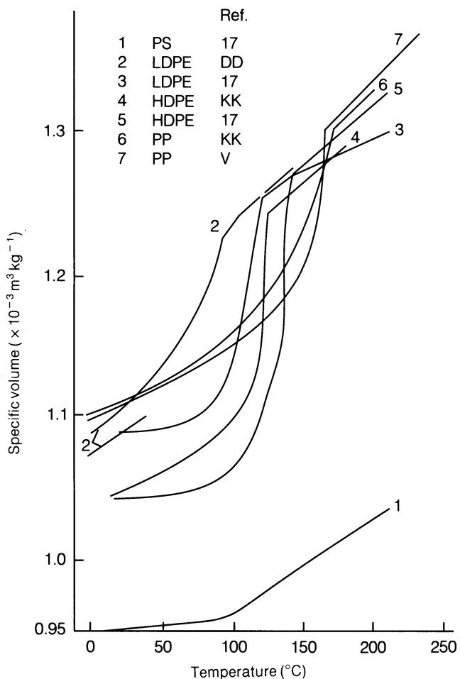  
图A.1 比容与温度的关系。

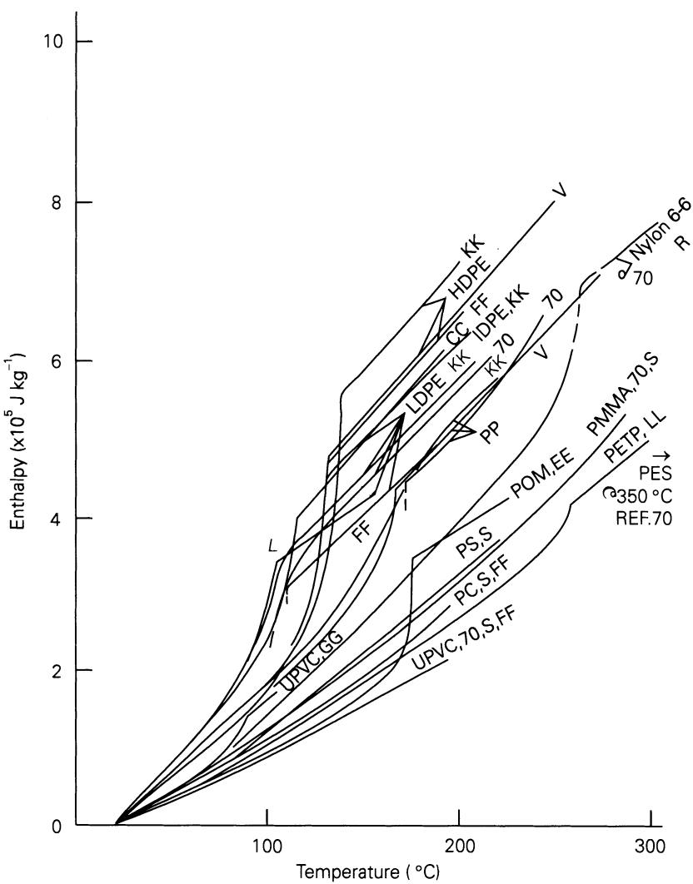  
图A.2 热容：$20^{\circ}$ C以上的焓。

某些情况下，用其他方法(例如由冷却实验求热扩散率)确定可能更为可靠。

表4.1给出了LDPE、空气、水和钢的一些典型数据。溶胀比的一个例子(针对聚苯乙烯)见图3.10和3.11。

下面清单中给出的参考文献字母标在图A.1–A.5中相应数据旁。在某些情况下，同一组实验数据似乎曾在不止一种期刊上以不同的

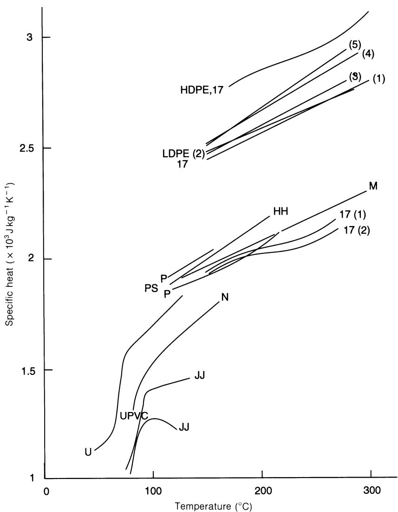  
图A.3 熔体中的比热容。

作者姓名组合发表过；本附录中已尽可能避免重复。本书作者已尽力尽可能精确地复制数据，但比例尺和单位方面的问题可能无意中导致某些取平均的做法；精确数值、单个数据点以及超出本书范围的数据请读者查阅原始出版物。所用材料的准确情况和预处理也应回溯原始文献，为清晰起见，此处将其归入通用名称。Adamski (1974)所测试的材料由英国科学与工程研究理事会在橡胶与塑料研究协会设立的聚合物供应与表征中心(PSCC)提供，并由其编码为LDPE4、PS2等，如图中所示。

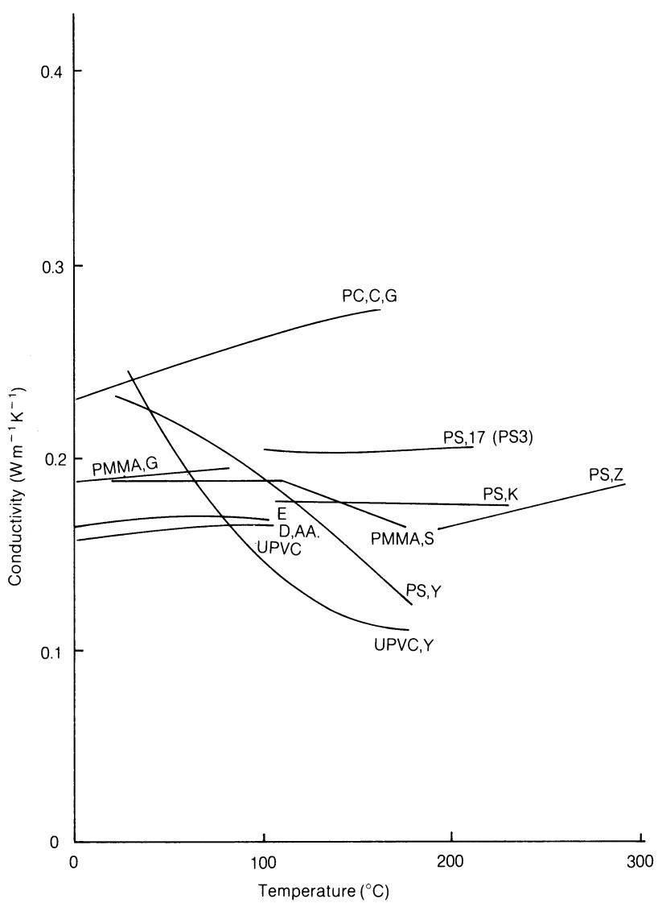  
图A.4 导热系数：无定形聚合物。

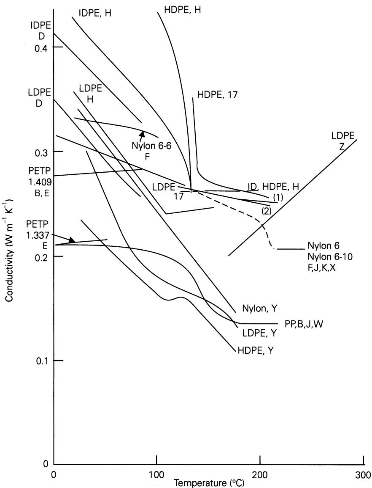  
图A.5 导热系数：半结晶聚合物。

# 图A.1-A.5的参考文献

A Anon. Plastiques Modernes et Elastomères, 18 (6) (1966), 128–149.

B. Eiermann, K., Koll. Zeit., 201 (1965), 3–15.

C Eiermann, K., Kunstst., 55 (1965), 335.

D Eiermann, K. and Hellwege, K.-H., J. Poly. Sci., 57 (1962), 99–106.

E Eiermann, K., Hellwege, K.-H. and Knappe, W., Koll. Zeit., 174 (2) (1961), 134–142.

F Hellwege, K.-H., Hoffmann, R. and Knappe, W., Koll. Zeit., 226 (1968), 109–115.

G Hellwege, K.-H., Hennig, J. and Knappe, W., Koll. Zeit., 188 (1963), 121–127.

H Hennig, J., Knappe, W. and Lohe, P., Koll. Zeit., 189 (1963), 114–116.

J Knappe, W. et al., Kunstst., 51 (1961), 707.

K Lohe, P. et al., Koll. Zeit., 203 (1965), 115–119.

L Dole, M. et al., J. Chem. Phys., 20 (1952), 781–790.

M Abu-Isa, I. and Dole, M., J. Phys. Chem., 69 (8) (1965), 2668–2675.

N Alford, S. and Dole, M., J. Amer. Chem. Soc., 77 (1955), 4774.

P Currie, J.A. and Dole, M., J. Phys. Chem., 73 (10) (1969), 3384–3389.

R Wilhoit, R.C. and Dole, M., J. Phys. Chem., 73 (1969), 14–21.

S Wunderlich, B. and Baur, H., Adv. Poly. Sci., 7 (1970), 151.

T Bares, V. and Wunderlich, B., J. Poly. Sci. A2, 11 (1973), 861–873.

U Wilski, H., Koll. Zeit., 210 (1) (1966), 37–45.

V Wilski, H., Kunststoffe, 50 (6) (1960), 335–336.

W Tomlinson, J.N. and Kline, D.E., J. Appl. Poly. Sci., 11 (1967), 1931–1940.

X Holzmüller, W. and Münx, M., Koll. Zeit., 159 (1958), 26–28.

Y Holzmüller, W. and Lorenz, J., Plaste u. Kautschuk, 8 (1961), 351–352.

Z Fuller, T.R. and Fricke, A.L., J. Appl. Poly. Sci., 15 (1971), 1729–1736.

AA Sheldon, R.P. and Lane, S.K., Polymer, 6 (1965), 77–83.

BB Shoulberg, R.H. and Shetter, J.A., J. Appl. Poly. Sci., 6 (23) (1962), S32–33.

CC Raine, H.C., Richards, R.B. and Ryder, H., Trans. Farad. Soc., 41 (1945), 56–64.

DD Hunter, E. and Oakes, W.G., Trans. Farad. Soc., 41 (1945), 49–56.

EE Linton, W.H. and Goodman, H.H., J. Appl. Poly. Sci., 1 (2) (1959), 179–184.

FF Cogswell, F.N. and Couzens, D.C., unpublished data.

GG Griskey, R.G. et al., Mod. Plast., 43 (11) (1966), 119–123.

HH Karasz, F.E., Bair, H.E. and O'Reilly, J.M., J. Phys. Chem., 69 (8) (1965), 2657–2667.

JJ Dunlap, L.H., J. Poly. Sci., A2, 4 (1966), 673–684.

KK Hanna, R.D. and Lomax, J.Y., Mod. Plast., 36 (6) (1959), 111–122.

LL Smith, C.W. and Dole, M., J. Poly. Sci., 20 (1956), 37–56.

17 见主参考文献部分中的Adamski (1974)。

70 见主参考文献部分中的Cogswell (1981)。

# 附录B 流动与压力的推导

# B.1 流动方程的另一种推导

在直角坐标系 $x, y, z$ 中，局部速度分别为 $u, v, w$ ，若仅在 $z$ 方向存在压力梯度 $\partial P / \partial z$ ，则不可压缩流体的一般流动方程简化为纳维-斯托克斯方程：

$$
\eta \frac {\partial^ {2} w}{\partial x ^ {2}} + \eta \frac {\partial^ {2} w}{\partial y ^ {2}} = \frac {\partial P}{\partial z}\tag{B.1}
$$

式中 $\eta$ 为局部动力黏度。

若螺槽在x方向的宽度b远大于y方向的深度h，则x方向的剪切应力和剪切速率 $\partial w/\partial x$ 为常数，且：

$$
\frac {\partial^ {2} w}{\partial x ^ {2}} \approx 0\tag{B.2}
$$

于是近似有：

$$
\eta \frac {\partial^ {2} w}{\partial y ^ {2}} - \frac {\partial P}{\partial z} = 0\tag{B.3}
$$

若黏度 $\eta$ 不依赖于剪切速率 $\partial w/\partial y$ (如同牛顿流体)，并对y积分：

$$
\eta \frac {\partial w}{\partial y} - y \frac {\partial P}{\partial z} = C\tag{B.4}
$$

再积分一次得：

$$
\eta w - \frac {y ^ {2}}{2} \cdot \frac {\partial P}{\partial z} = C y + D\tag{B.5}
$$

注意，若黏度依赖于剪切速率，则不能如此简单地积分。

在挤出机螺杆中，取相对于螺杆的速度，边界条件为：y = 0处w = 0；y = h处w = W。代入方程(B.5)得D = 0及：

$$
C = \eta \frac {W}{h} - \frac {h ^ {2}}{2 h} \cdot \frac {\partial P}{\partial z}\tag{B.6}
$$

将此 $C$ 值代入方程(B.4)得：

$$
\frac {\partial w}{\partial y} = \frac {W}{h} + \frac {(2 y - h)}{2 \eta} \frac {\partial P}{\partial z}\tag{B.7}
$$

而方程(B.5)变为：

$$
\eta w - \frac {y ^ {2}}{2} \frac {\partial P}{\partial z} = \eta \frac {W y}{h} - \frac {y h}{2} \frac {\partial P}{\partial z}
$$

或：

$$
w = \frac {W y}{h} + \frac {y ^ {2} - y h}{2 \eta} \frac {\partial P}{\partial z}\tag{B.8}
$$

体积流量由下式给出：

$$
Q _ {\mathrm{Tot}} = \int_ {0} ^ {h} w b \mathrm{d} y \quad = \left[ \frac {W b y ^ {2}}{2 h} + \frac {b}{2 \eta} \cdot \frac {\partial P}{\partial z} \left(\frac {y ^ {3}}{3} - \frac {y ^ {2} h}{2}\right) \right] _ {0} ^ {h} \quad = \frac {W b h}{2} - \frac {b h ^ {3}}{1 2 \eta} \frac {\partial P}{\partial z} \tag{B.9}
$$

这与方程(6.15)完全相同。

若考虑x方向的压力梯度 $\partial P/\partial x$ ，则方程(B.1)经坐标变换后变为：

$$
\eta \frac {\partial^ {2} u}{\partial y ^ {2}} + \eta \frac {\partial^ {2} u}{\partial z ^ {2}} = \frac {\partial P}{\partial x}\tag{B.10}
$$

对于横向剪切速率，方程(B.7)变为：

$$
\frac {\partial u}{\partial y} = \frac {U}{h} + \frac {(2 y - h)}{2 \eta} \frac {\partial P}{\partial x}\tag{B.11}
$$

对于横向速度，方程(B.8)变为：

$$
u = \frac {U y}{h} + \frac {y ^ {2} - y h}{2 \eta} \frac {\partial P}{\partial x}\tag{B.12}
$$

对于横向体积流量，方程(B.9)变为：

$$
Q _ {x} = \frac {U z h}{2} - \frac {z h ^ {3}}{1 2 \eta} \cdot \frac {\partial P}{\partial x}\tag{B.13}
$$

若将方程(6.25)代入式(B.11)：

$$
\frac {\partial u}{\partial y} = \frac {U}{h} \left(\frac {6 y}{h} - 2\right)\tag{B.14}
$$

在料筒壁处u = U，且

$$
\left(\frac {\partial u}{\partial y}\right) _ {y = h} = \frac {4 U}{h}\tag{B.15}
$$

下游剪切速率 $\partial w/\partial y$ 的相应方程为方程(6.68)和(6.69)。如8.4节所述，这一横向剪切速率将对总壁面剪切速率有所贡献，在假塑性的情况下，与仅基于下游剪切速率(方程(6.69))的计算相比，它会降低黏度和功耗。

# B.2 漏流的估算

对于间隙 $\delta$ 中的拖曳流，剪切速率为：

$$
\dot {\gamma} _ {\text { clearance }} = \frac {\pi D N}{\delta}\tag{B.16}
$$

取相对于螺杆的速度，料筒垂直于螺槽方向的速度为 $U = \pi DN \sin \phi$ ，故聚合物的平均速度为：

$$
\frac {U}{2} = \frac {\pi D N \sin \phi}{2}\tag{B.17}
$$

(参见方程(6.9))。一圈的螺旋长度(图6.1)为：

$$
\frac {Z}{n} = \frac {\pi D}{\cos \phi}\tag{B.18}
$$

于是拖曳引起的漏流为：

$$
Q _ {\mathrm{DL}} = \frac {U}{2} \delta \frac {\pi D}{\cos \phi} \quad = \frac {\pi^ {2} D ^ {2} N \delta \tan \phi}{2} \text { per turn. } \tag{B.19}
$$

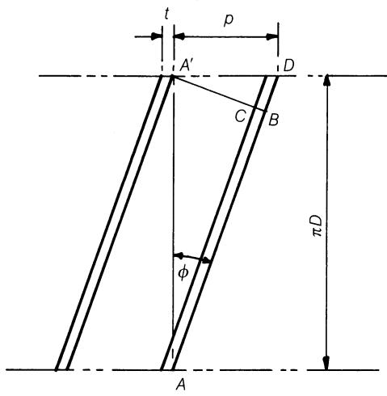  
图B.1 螺槽展开图。

以方程(6.11)给出的螺槽内拖曳流的分数表示：

$$
\frac {Q _ {\mathrm{DL}}}{Q _ {\mathrm{D}}} = \frac {\frac {1}{2} \pi^ {2} D ^ {2} N \delta \tan \phi}{\frac {1}{2} \pi D N h (p - t) \cos^ {2} \phi} \quad = \frac {\delta}{h \left(1 - \frac {t}{p}\right) \cos^ {2} \phi} \tag{B.20}
$$

典型地 $t / p = 0.1$ 且 $\cos \phi = 0.953 (\phi = 17.6^\circ, p = D)$ ，由此得：

$$
\frac {Q _ {\mathrm{DL}}}{Q _ {\mathrm{D}}} = 1. 2 2 4 \frac {\delta}{h}\tag{B.21}
$$

若忽略螺棱宽度t，即 $b = \pi D \sin \phi$ ，则方程(B.20)进一步简化为：

$$
\frac {Q _ {\mathrm{DL}}}{Q _ {\mathrm{D}}} = \frac {\delta}{h \cos^ {2} \phi}\tag{B.22}
$$

现在考虑纵向(沿槽方向)压力梯度dp/dz。则在图B.1中距离 $AB = \pi D \cos \phi$ ，压差为：

$$
P _ {B A} = (\pi D \cos \phi) \frac {\mathrm{d} P}{\mathrm{d} z}\tag{B.23}
$$

点 $A'$ 与 $A$ 在螺杆上代表同一位置，因此由于纵向压力梯度，B与C之间的压差也为 $P_{BC} = (\pi D \cos \phi) \mathrm{d}P / \mathrm{d}z$ ——若 $\mathrm{d}P / \mathrm{d}z$ 为正则为正压差，即压力朝口模方向升高。

再次对通过狭缝口模的流动应用方程(3.34)，类比于方程(6.13)，由纵向压力梯度引起的漏流 $Q_{PL}$ 将

为：

$$
Q _ {\mathrm{PL}} = \frac {\pi D}{\cos \phi} \cdot \frac {\delta^ {3}}{1 2 \eta t} \cdot \frac {P _ {B C}}{t \cos \phi} \text { per   turn }\tag{B.24}
$$

即沿图B.1中的长度 $AB$ 。代入方程(B.23)：

$$
Q _ {\mathrm{PL}} = \frac {\pi^ {2} D ^ {2} \delta^ {3}}{1 2 \eta t \cos \phi} \cdot \frac {\mathrm{d} P}{\mathrm{d} z}\tag{B.25}
$$

然而，图B.1中A与C之间还存在由方程(6.24)给出的横向压力梯度，即 $dP/dx = 6\eta U/h^{2}$ ，于是压差为：

$$
P _ {A C} = b \cdot \frac {\mathrm{d} P}{\mathrm{d} x}\tag{B.26}
$$

代入方程(6.2)、(6.5)和(6.24)得：

$$
P _ {A C} = \frac {6 \pi \eta D N (p - t) \sin \phi \cos \phi}{h ^ {2}}\tag{B.27}
$$

从[图6.7](11_Extruder_operation_as_part_of_a_total_process.md#figure-6-7)可见，横向压力流自左向右，即从螺槽的前缘侧流向后缘侧，因此压力必然沿该方向下降。故 $P_{AC}$ 始终为正，跨过螺棱的总压差由下式给出：

$$
P _ {B C} = P _ {B A} + P _ {A C}\tag{B.28}
$$

这可以由方程(B.23)和(B.27)代入得到，但由于流量正比于压差，由横向压力梯度dP/dx引起的漏流可单独计算为：

$$
Q _ {\mathrm{PL}} ^ {\prime} = \frac {\pi^ {2} D ^ {2} \delta^ {3} N (p - t) \tan \phi}{2 t h ^ {2}}\tag{B.29}
$$

拖曳漏流与压力漏流的相对重要性显然取决于螺槽压力梯度，即取决于螺杆运行在Q/Wbh的高值还是低值。因此，仿照方程(B.20)，把压差引起的漏流表示为螺槽压力流的分数更为方便。将方程(B.25)与(B.29)相加并除以方程(6.13)(其中的b用方程(6.2)代入)：

$$
\frac {Q _ {\mathrm{PL}} + Q _ {\mathrm{PL}} ^ {\prime}}{Q _ {\mathrm{P}}} = \frac {\frac {\pi^ {2} D ^ {2} \delta^ {3}}{1 2 \eta t \cos \phi} \cdot \frac {\mathrm{d} P}{\mathrm{d} z}}{\frac {(p - t) (\cos \phi) h ^ {3}}{1 2 \eta} \cdot \frac {\mathrm{d} P}{\mathrm{d} z}} + \frac {\frac {\pi^ {2} D ^ {2} \delta^ {3} N (p - t) \tan \phi}{2 t h ^ {2}}}{\frac {(p - t) (\cos \phi) h ^ {3}}{1 2 \eta} \cdot \frac {\mathrm{d} P}{\mathrm{d} z}} \quad = \frac {\pi^ {2} D ^ {2}}{(p - t) t} \left(\frac {\delta}{h}\right) ^ {3} \cdot \frac {1}{\cos^ {2} \phi} + \frac {6 \eta \pi^ {2} D ^ {2} \delta^ {3} N}{t h ^ {5}} \cdot \frac {\sin \phi}{\cos^ {2} \phi} \cdot \frac {1}{\frac {\mathrm{d} P}{\mathrm{d} z}} \tag{B.30}
$$

第141页使用方程(B.20)和(B.30)来估算典型情况下的数值，并考察各变量对漏流的影响。

# B.3 纵向压力分布

# B.3.1 双平行(变深)螺杆

方程(6.38)和(6.39)便于求出给定转速N和产量Q下产生的压力。若需要确定对应于给定总压力升P的产量，则必须消去 $P_{1}$ 和 $P_{2}$ 。如果压力开始上升的点位于突变段或其前方，则压力分布将与平行螺杆的情形相同，适用方程(6.20)，只是以 $h_{2}$ 代替h。但如果压力在突变段之前轴向 $L_{1}$ 或螺旋 $Z_{1}$ 距离处开始上升，则方程(6.20)必须改用Weeks和Allen (1962)提出的方程：

$$
\frac {Q}{W b h _ {2}} \left(1 + \frac {Z _ {1} h _ {2} ^ {3}}{Z _ {2} h _ {1} ^ {3}}\right) = \frac {1}{2} \left(1 + \frac {Z _ {1} h _ {2} ^ {2}}{Z _ {2} h _ {1} ^ {2}}\right) - \frac {h _ {2} ^ {2} P}{1 2 \eta W Z _ {2}}\tag{B.31}
$$

这可以重新整理为：

$$
P = K _ {1} \left(K _ {2} - \frac {Q}{W b h _ {2}}\right)\tag{B.32}
$$

式中：

$$
K _ {1} = \frac {1 2 \eta W Z _ {2}}{h _ {2} ^ {2}} \left(1 + \frac {Z _ {1} h _ {2} ^ {3}}{Z _ {2} h _ {1} ^ {3}}\right)\tag{B.33}
$$

(类似于方程(6.35))，且

$$
K _ {2} \approx \frac {1}{2}\tag{B.34}
$$
注意这仍是P与Q之间的线性关系。

# B.3.2 锥形和锥形-平行螺杆

对于半角为 $\theta$ (图B.2)的均匀锥度螺杆，在螺旋距离z处的深度h为：

$$
h = h _ {2} + \left(h _ {1} - h _ {2}\right) \left(\frac {Z _ {1} - z}{Z _ {1}}\right) \quad = h _ {1} - \frac {z}{Z _ {1}} \left(h _ {1} - h _ {2}\right) \tag{B.35}
$$

因此：

$$
\frac {\mathrm{d} h}{\mathrm{d} z} = - \left(\frac {h _ {1} - h _ {2}}{Z _ {1}}\right) = - \tan \theta\tag{B.36}
$$

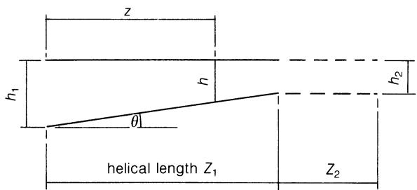  
图B.2 锥形螺杆半角 $\theta$ 的定义。

但是：

$$
\frac {\mathrm{d} P}{\mathrm{d} z} = \frac {1 2 \eta W}{h ^ {2}} \left(\frac {1}{2} - \frac {Q}{W b h}\right)\tag{6.42}
$$

且由于按z的定义在 $z = 0$ 处 $P = 0$ ，第一段的压力升 $P_{1}$ 由下式给出：

$$
P _ {1} = \int_ {0} ^ {Z _ {1}} \frac {\mathrm{d} P}{\mathrm{d} z} \mathrm{d} z \quad = - \frac {6 \eta W Z _ {1}}{h _ {1} - h _ {2}} \int_ {h _ {1}} ^ {h _ {2}} \left(\frac {1}{h ^ {2}} - \frac {2 Q}{W b h ^ {3}}\right) \mathrm{d} h \quad = - \frac {6 \eta W Z _ {1}}{h _ {1} - h _ {2}} \left[ - \frac {1}{h} + \frac {Q}{W b h ^ {2}} \right] _ {h _ {1}} ^ {h _ {2}} \quad = \frac {6 \eta W Z _ {1}}{h _ {1} h _ {2}} \left(1 - \frac {Q}{W b h _ {2}} \cdot \frac {h _ {1} + h _ {2}}{h _ {1}}\right) \tag{6.43}
$$

方程(6.43)和(6.45)的其他形式由Weeks和Allen (1962)给出为：

$$
\frac {Q}{W b h _ {2}} \left(1 - \frac {h _ {2} ^ {2}}{h _ {1} ^ {2}}\right) = 1 - \frac {h _ {2}}{h _ {1}} - \frac {h _ {2} P \tan \theta}{6 \eta W}\tag{B.37}
$$

以及：

$$
\frac {Q}{W b h _ {2}} \left(1 + \frac {2 Z _ {2} \tan \theta}{h _ {2}} - \frac {h _ {2} ^ {2}}{h _ {1} ^ {2}}\right) = 1 + \frac {Z _ {2} \tan \theta}{h _ {2}} - \frac {h _ {2}}{h _ {1}} - \frac {h _ {2} P \tan \theta}{6 \eta W}\tag{B.38}
$$

方程(6.43)具有如下形式：

$$
P = K _ {3} \left(K _ {4} - \frac {Q}{W b h _ {2}}\right)\tag{B.39}
$$

式中：

$$
K _ {3} = \frac {6 \eta W Z _ {1} (h _ {1} + h _ {2})}{h _ {1} ^ {2} h _ {2}}\tag{B.40}
$$

以及：

$$
K _ {4} = \frac {h _ {1}}{h _ {1} + h _ {2}}\tag{B.41}
$$

同样，方程(6.45)也可整理为：

$$
P = K _ {5} \left(K _ {6} - \frac {Q}{W b h _ {2}}\right)\tag{B.42}
$$

式中：

$$
K _ {5} = \frac {6 \eta W}{h _ {2}} \left(\frac {(h _ {1} + h _ {2}) Z _ {1}}{h _ {1} ^ {2}} + \frac {2 Z _ {2}}{h _ {2}}\right)\tag{B.43}
$$

以及：

$$
K _ {6} = \left(\frac {Z _ {1}}{h _ {1}} + \frac {Z _ {2}}{h _ {2}}\right) / \left(\frac {\left(h _ {1} + h _ {2}\right) Z _ {1}}{h _ {1} ^ {2}} + \frac {2 Z _ {2}}{h _ {2}}\right)\tag{B.44}
$$

因此，无论锥形螺杆还是锥形-平行螺杆，P都与Q呈线性关系，这将在6.5节加以利用。

# B.4 变深螺杆中的压力梯度

在具有螺槽深度 $h_{1}$ 和 $h_{2}$ 两段的变深螺杆中，两段的压力梯度dP/dz通常不同(p.146)。由于流动方程(方程(6.15)和(B.9))是h的三次函数，无法明确断言 $dP_{1}/dz$ 还是 $dP_{2}/dz$ 更大。本节目的在于确定 $dP_{1}/dz$ 大于或小于 $dP_{2}/dz$ 的条件。由于下游速度W和螺槽宽度b在两段中通常相同，且由连续性知体积流量Q相同，故可用无量纲流量 $Q/Wbh_{1}$ 和 $Q/Wbh_{2}$ 来表征螺槽深度。当 $Q/Wbh_{2} > 0.5$ 时， $dP_{2}/dz$ 为负；当 $Q/Wbh_{2} = 0.5$ 时， $dP_{2}/dz = 0$ ；在这两种情况下，全部压力都在第一段产生，此时若 $h_{1}/h_{2} > 1$ ，则 $Q/Wbh_{1} < 0.5$ 。有效熔体长度 $z_{1}$ 和 $z_{2}$ 随不同的螺杆设计而异，前者还随初始压力上升位置(凝胶点)而变化。然而，本研究表明，除很小的流量范围( $Q/Wbh_{2} \simeq 0.5$ )外，较浅第二段中的压力梯度大于较深第一段中的压力梯度，因此除非第二段很短，否则口模前的大部分压力将在该段产生。表B.1针对三种比值 $h_{1}/h_{2}$ 即2、3和4计算了Q/Wbh和dP/dz的值；图B.3中将 $dP_{2}/dz$ 与 $dP_{1}/dz$ 之比对相应的无量纲流量作图。若将方程(6.16)重新整理，得：

表B.1 变深螺杆中的压力梯度

| $\frac{h_1}{h_2}$ | $\frac{Q}{Wbh_1}$ | $\frac{Q}{Wbh_2}$ | $\mathrm{d}P_1/\mathrm{dz} \times \frac{12\eta W}{h_2^2}$ | $\frac{\mathrm{d}P_1/\mathrm{dz}}{\mathrm{d}P_1/\mathrm{dz}_{(P_2=0)}}$ (Fig. B.4) | $\frac{\mathrm{d}P_2/\mathrm{dz}}{\times \frac{12\eta W}{h_2^2}}$ | $\frac{\mathrm{d}P_2/\mathrm{dz}}{\mathrm{d}P_1/\mathrm{dz}}$ (Fig. B.3) |
| --- | --- | --- | --- | --- | --- | --- |
| 2 | 0.25 | 0.50 | 0.0625 | 1.00 | 0 | 0 |
| 2 | 0.22 | 0.44 | 0.070 | 1.12 | 0.060 | 0.858 |
| 2 | 0.21 | 0.42 | 0.0725 | 1.16 | 0.080 | 1.103 |
| 2 | 0.20 | 0.40 | 0.075 | 1.20 | 0.100 | 1.333 |
| 2 | 0.15 | 0.30 | 0.0875 | 1.40 | 0.200 | 2.285 |
| 2 | 0.10 | 0.20 | 0.100 | 1.60 | 0.300 | 3.000 |
| 2 | 0.05 | 0.10 | 0.1125 | 1.80 | 0.400 | 3.56 |
| 2 | 0 | 0 | 0.125 | 2.00 | 0.500 | 4.00 |
| 3 | 0.167 | 0.50 | 0.0370 | 1.0 | 0 | 0 |
| 3 | 0.160 | 0.480 | 0.0378 | 1.02 | 0.020 | 0.530 |
| 3 | 0.155 | 0.465 | 0.0383 | 1.036 | 0.035 | 0.914 |
| 3 | 0.150 | 0.450 | 0.0389 | 1.050 | 0.050 | 1.286 |
| 3 | 0.120 | 0.360 | 0.0422 | 1.14 | 0.140 | 3.32 |
| 3 | 0.100 | 0.300 | 0.0444 | 1.20 | 0.200 | 4.50 |
| 3 | 0.050 | 0.150 | 0.050 | 1.35 | 0.350 | 7.00 |
| 3 | 0 | 0 | 0.0556 | 1.50 | 0.500 | 9.00 |
| 4 | 0.125 | 0.500 | 0.0234 | 1.0 | 0 | 0 |
| 4 | 0.120 | 0.480 | 0.0238 | 1.014 | 0.020 | 0.842 |
| 4 | 0.115 | 0.460 | 0.0241 | 1.027 | 0.040 | 1.661 |
| 4 | 0.110 | 0.440 | 0.0244 | 1.04 | 0.060 | 2.462 |
| 4 | 0.100 | 0.400 | 0.0250 | 1.068 | 0.100 | 4.00 |
| 4 | 0.070 | 0.280 | 0.0269 | 1.15 | 0.220 | 8.17 |
| 4 | 0 | 0 | 0.0312 | 1.33 | 0.50 | 16.0 |

$$
\frac {1}{2} - \frac {Q}{W b h} = \frac {h ^ {2}}{1 2 \eta W} \cdot \frac {\mathrm{d} P}{\mathrm{d} z}\tag{B.45}
$$

因此：

$$
\frac {\mathrm{d} P _ {1}}{\mathrm{d} z} = \left(\frac {1}{2} - \frac {Q}{W b h _ {1}}\right) \frac {1 2 \eta W}{h _ {1} ^ {2}} \quad = \left(\frac {1}{2} - \frac {Q}{W b h _ {1}}\right) \cdot \frac {1 2 \eta W}{h _ {2} ^ {2}} \cdot \frac {h _ {2} ^ {2}}{h _ {1} ^ {2}} \tag{B.46}
$$

以及：

$$
\frac {\mathrm{d} P _ {2}}{\mathrm{d} z} = \left(\frac {1}{2} - \frac {Q}{W b h _ {2}}\right) \frac {1 2 \eta W}{h _ {2} ^ {2}}\tag{B.47}
$$

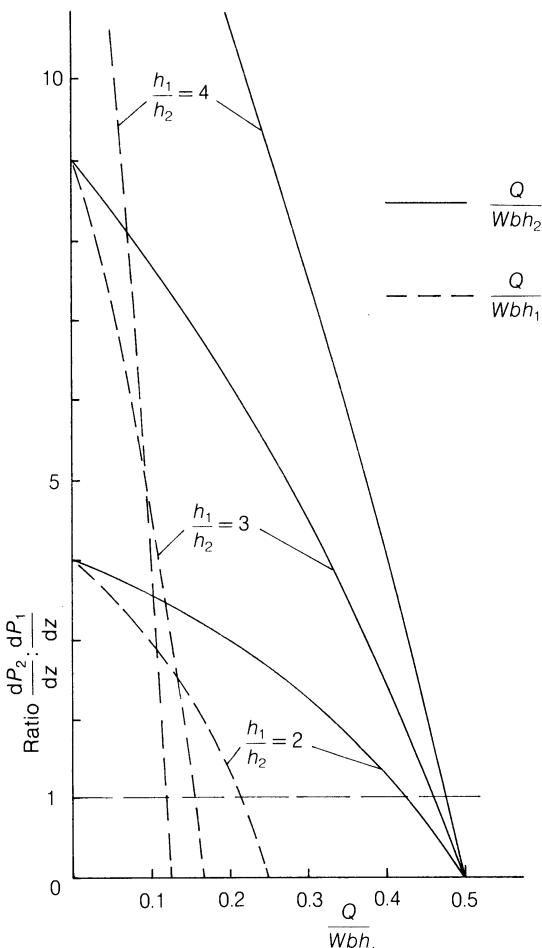  
图B.3 变深螺杆：两段中压力梯度之比。

压力梯度由方程(B.46)和(B.47)计算，以 $12\eta W / h_2^2$ 表示。

参照图6.10，考察第一段中压力梯度随流量 $(Q/Wbh_{1})$ 和口模压力如何变化也很有意义；图B.4通过将 $dP_{1}/dz$ 与其代表总压力升时的值(即 $Q/Wbh_{2}=0.5$ 时)进行比较来完成这一点。结果表明，即使深度比 $h_{1}/h_{2}$ 仅为2:1，最大压力梯度(零产量时)也只是浅段无压力变化时的两倍，即 $dP_{1}/dz$ 不仅通常小于 $dP_{2}/dz$ ，而且随口模压力的变化也较小。

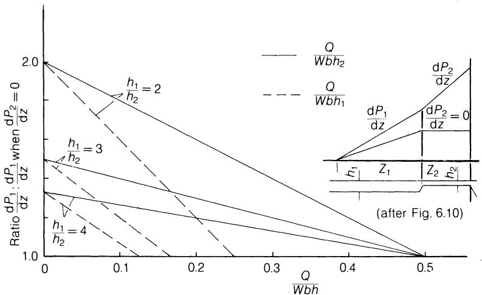  
图B.4 第一段中的压力梯度 $dP_{1}/dz$ 以 $dP_{2}/dz = 0$ ( $Q/Wbh_{2} = 0.5$ )时的值表示。

# B.5 Q-P图的更多实例

# B.5.1 双平行螺杆

双平行(变深)螺杆的性能可以用方程(6.38)和(6.39)的图形形式来表示，而不必使用相当繁琐的方程(B.31)。考虑一根直径和螺距恒定的双平行螺杆，螺槽深度为 $h_{1}$ 和 $h_{2}$ ， $h_{1}$ 大于 $h_{2}$ 。相应的拖曳流和压力流分别为 $Q_{ID}$ 、 $Q_{2D}$ 和 $Q_{1P}$ 、 $Q_{2P}$ 。图B.5表示这些流量以及合成的总流量 $Q_{1}$ 和 $Q_{2}$ ，稳态下满足：

$$
Q _ {1} = Q _ {2} = Q _ {\mathrm{Die}}\tag{B.48}
$$

压力升 $P_{1}$ 和 $P_{2}$ 代数相加，其和等于口模压力：

$$
P _ {1} + P _ {2} = P _ {\text { Die }}\tag{B.49}
$$

然后，对于需要在低产量下产生高压的小口模，Q由一条水平线确定，该线满足方程(B.48)，使得截距 $P_{1}$ 和 $P_{2}$ 之和等于 $P_{Die}$ 从而满足方程(B.49)。若换成更大的口模使产量变为大于 $Q_{2D}$ 的 $Q'_{Die}$ ，则 $Q/Wbh_{2} > 1/2$ ，第二段中压力下降，表现为 $Q_{2}$ 线上的负压力截距。此时 $Q'_{Die}$ 由一条水平线给出，使 $P_{1}'$ 与 $P_{2}'$ 的(算术)差等于口模压力 $P'_{Die}$ 。注意， $Q/Wbh_{1}$ 和 $Q/Wbh_{2}$ 的纵坐标尺度对任意已知Q值都能直观提示每段螺杆中的压力和流动状态。与单一的Q/P线相比，这种方法能更好地展示多段螺杆内部发生的过程，也可用于更复杂的螺杆形式，只要遵守对应于方程(B.48)和(B.49)的约束条件即可；例如第163页提到的排气系统即可进行分析，只要在计算Q/Wbh值时适当注意直径、螺距、转速等的差异。

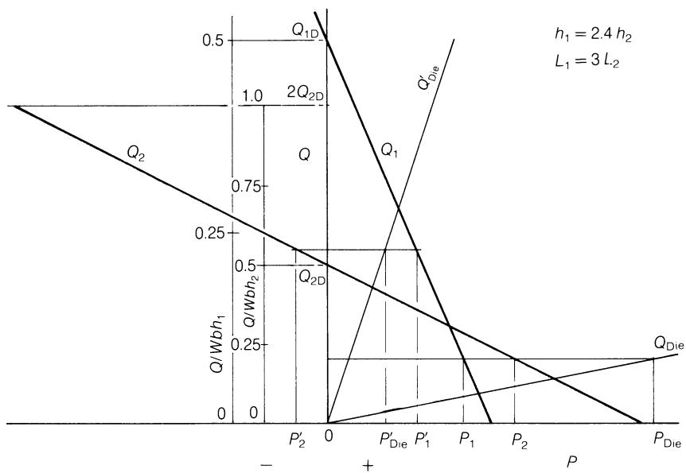  
图B.5 变深螺杆的产量与压力的关系。

# B.5.2 螺杆挤出机与齿轮泵

用于纤维熔体纺丝的系统由一台单螺杆挤出机组成，它将固体聚合物熔融并送入用于计量流量的齿轮泵。通过齿轮泵的流量正比于其转速，但几乎与压差无关，因此当过滤组件被杂质和凝胶部分堵塞时，通过喷丝板的流量仍保持与拉伸系统平衡，无需对后者作大的调整。在稳态条件下，挤出机通过升高或降低两者之间的压力，自动使其产量与齿轮泵的流量相等。但是，若挤出机转速设定过低，该压力可能降到例如 $0.3 \, MN \, m^{-2}$ ( $50 \, lb/in^{2}$ )以下，齿轮泵开始气蚀，导致输出不稳定并在制品中产生空隙。若转速过高，挤出机与泵之间的压力可能升至不可接受的水平。考虑一个系统，要求泵入口处保持压力P，流量恒定为 $Q_{Pump}$ 。一台深度为h的浅螺槽螺杆在转速N下给出该压力和产量。若现在挤出机转速变化 $\pm10\%$ ，拖曳流(纵轴上的截距)

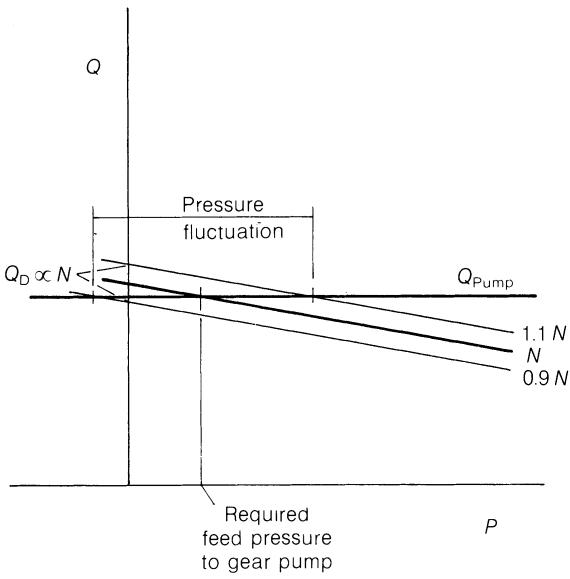  
图B.6 浅螺槽螺杆向齿轮泵供料。

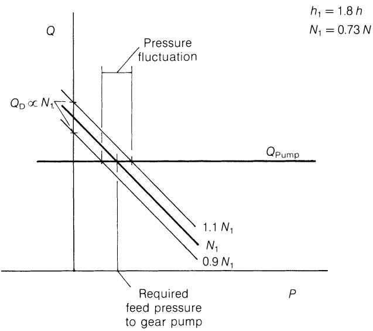  
图B.7 深螺槽螺杆向齿轮泵供料。

将以相同的比例变化。然而，如图B.6所示，浅螺槽螺杆Q/P线的斜率小，导致压力变化很大，包括可能出现不足以防止泵气蚀的压力。图B.7表明，在转速 $N_{1}$ 下给出相同压力P的更深螺槽螺杆，其拖曳流 $Q_{D}$ 的绝对变化较大，但在 $\pm10\%$ 转速变化下P的变化较小。

因此，为满足充分熔融和混炼而可能必须采用的浅螺槽螺杆，需要对转速进行严格得多的控制，这只能通过从泵入口压力引出的反馈信号实现自动控制。即便如此，挤出机响应的固有延迟仍可能造成不希望的瞬态过程。作者记得有一套装置，一台114 mm (4.5 in)挤出机并联向12台齿轮泵和喷丝板供料，由于拉伸和卷绕设备所需的空间，涉及相当多的高压加热管路。当其中一台泵因清理过滤器而停机时，出现了类似的情形：在挤出机转速恒定的情况下 $Q_{Pump}$ 实际上减少了8.3%，导致压力暂时升高。随后有人提议改用带真空排气的螺杆以除去挥发分；这样第二段螺杆的性能将与图B.7类似。然而，第一段的产量仅取决于螺杆转速，不受挤出机与齿轮泵之间压力的影响，因此必须精确设定挤出机转速以匹配通过齿轮泵的流量，避免泵气蚀或排气口堵塞。此时所达到的压力将取决于两段螺杆的相对比例；这些图说明了用一个需要非常精细外部控制的系统替代一个自调节系统的情形。

# 附录C 能耗与能量平衡

# C.1 能量平衡的实验测定

# C.1.1 机械功率输入

测量螺杆机械功率输入的最直接方法是对转速和转矩进行同步测量。转速可用转速表测量，但在约1 rps以下，更可靠的做法是在1 min或更长的固定时段内通过自动计数或目测计数转数进行积分，尤其当驱动装置因打滑或调速而使转速随负载明显变化时。这也可用于在较高转速下校准转速表。如果转速表由输入轴驱动，则必须适当考虑磁性联轴器、变速齿轮箱、带传动等中的打滑。一种适用于小型机器(尤其是可完全从加料端支承的立轴机器)的转矩测量方法是测量支承上的转矩反力，此时支承必须具有低摩擦。除非减速比超过约100:1，否则必须考虑驱动电机定子上小得多的反力，并根据两者旋转方向的异同将其加上或减去。必须注意尽量减小加料、管路和电缆连接的约束以及制品或下游设备造成的约束。另一种方法是在传动轴的一段短截面上贴应变片，并通过遥测或滑环将输出信号传至固定记录仪。为了增大信号，会引入一段更柔性的轴段(常通过减小直径实现)；这可能带来标定改变甚至过载时(如启动时)传动失效的风险。轴截面的突变通常会使生产机器中可用的有限长度产生非线性应变分布，还需对温度和弯曲应力进行补偿或修正。扭转应变也曾用光干涉法测量，利用镜面系统放大偏转；这类方法有可能实现增量输出从而生成数字信号，并具有长期稳定性，还可静态标定，但相当脆弱，不适合工业使用。对于大型机器，已改造采用了为船舶推进轴和轧机传动设计的系统。其中之一是ASEA\* Torductor，其一段轴的作用类似变压器的磁芯；两圈围绕轴布置并馈入交流电的径向绕组，沿与轴线成$\pm45^{\circ}$的方向(即扭转主剪应力的方向)产生连续的磁场分布。轴上的扭矩使这些主应力之间产生差值，由于轴材料磁化率的相应变化，一次绕组与置于两个一次绕组环之间的第三个二次绕组环之间的互感便产生成比例的差值。二次绕组中感应的电压因此与一次电压和轴上的扭矩成正比。据称它对温度及邻近截面变化不敏感，且弯曲应力和气隙变化的影响可通过沿$360^{\circ}$积分予以消除。据称经适当标定后它适用于大多数磁性钢，标定可静态进行且非常稳定。作者及其他人曾在一条直径90 mm(3.5 in)、长径比20:1、由270 kW(360 hp)电机驱动、转速高达400 rpm的实心加料挤出机上使用过这种扭矩仪。

作者曾在多台功率不超过26 kW的机器上使用Allen和Hillman(1957)设计的一种间接系统，积累了相当丰富的经验。该系统本质上测量传动皮带两侧的张力差，可以静态标定；尽管必须考虑皮带与螺杆之间任何齿轮箱和轴承的损耗，但它在半工业性实验工作中被证明准确可靠。在同样的前提下，也可采用其他间接方法，其优点是高转速下转矩较小，且物理布置比直接在螺杆轴上测量更自由。通过电机定子反力测量转矩时，既要防范传动系统的损耗，也要防范电缆造成的物理约束。正如第226页所述，若以电机的电输入来衡量输入螺杆的机械能，则除传动损耗外，还必须考虑电机内部的电气损耗。这些损耗可从制造商的效率数据获得，或通过与机械制动器的比对标定获得——若制动器安装在螺杆位置上，则它还能确定随转速和转矩变化的传动损耗。对于交流感应电机，转速与转矩相互关联，因此一条效率曲线即可满足要求。对于直流并励电机(常与晶闸管驱动配套)，空载转速主要取决于

\*ASEA Ltd, Earl Road, Cheadle Hulme, Cheshire SK8 6QP, UK.

所施加的电压，且转速随转矩下降的百分比几乎与电压无关，因此同样是单条效率曲线近似正确。然而，对于变速交流电机，包括Schrage(转子馈电换向器)型和换向器(感应调压器)型，效率还在很大程度上取决于名义转速设定(即空载或满载转速)；在某些工况下，由于二次绕组中不成比例的环流，后者会产生极大的损耗。计量仪表的电气接线位置也必须考虑辅助设备(如冷却风机)的损耗。

因此，机械功率的测量相当复杂；为获得可靠的指示，需在初期设备选型时即加以考虑。不过，凭借经验，一只简单的电流表就能给出过载警示，并能大体反映负载随MFR、温度、转速、压力等的变化。

# C.1.2 加热器能量

加热器加入系统的能量或冷却带走的能量难以直接作理论分析；在常用的闭环温控系统中，控制系统会自动调节能量的输入或输出以维持所需温度。这一能量作为方程(8.2)中的平衡项确定，取决于与这些温度相应的机械功率E、聚合物焓增I和损失S的数值。当然，可以确定可获得的最大功率，例如按相应工作温度下电加热器的额定瓦数，或按可用流量和允许温升下加热/冷却流体的显热来确定。这可与能量平衡(图8.10和图8.12)联用，以确定给定产量下的近似极限操作温度，反之亦然。热输入实验测量的可靠性在很大程度上取决于控制系统的类型；若电阻加热器直接接市电供电或在手动控制(例如经自耦变压器)下供电，则电输入可直接用方均根(RMS)电流和电压测量，功率因数接近于1。这里的风险是，能量平衡稍有欠缺就会引起温度及相关因素(包括热损失)的缓慢漂移，能量差额主要消耗在加热或冷却料筒及其他机器部件上。这种对稳态假定的偏离对于小型机器或低产量(实验工作常用条件)尤为显著，因为机器金属部件的热容相对于聚合物制品而言很大。对于较老的时间比例型控制器，每个回路用一只家用型积算电能表可能已足够准确；但由于这类仪表并非为突变的负载设计，更准确的做法可能是监测加热器总负载，此时各回路错开的开关时间可减小成比例的负载变化。下面描述的另一种方法是采用多通道事件记录仪记录每只加热器的通断时段，得出各区平均的'通电'时间百分比——若取10–20 min，便可计及各区相互作用造成的时间波动。然后可将该'通电'时间百分比乘以每只加热器的额定瓦数后求和，或乘以在工作温度下单独实测的实际瓦数。这里的一个误差来源是加热器电阻随温度的变化，例如：

设定控制温度200°C。

断电期间，绕组温度(设为)$180^{\circ}$C，电阻$58 \Omega$。

通电期间，绕组温度(设为)$500^{\circ}C$，电阻$61.7\Omega$，设电阻温度系数从$180^{\circ}$到$500^{\circ}C$恒定为$0.0002\ \Omega\ ^{\circ}C^{-1}\ \Omega^{-1}$。则通电期间的瞬时功率将从993 W降至933 W；若假定其线性变化，采用连续额定值933 W将低估实际功率约3%。若断电前绕组已达稳定温度，此误差会减小。

相位角触发的晶闸管给出非正弦波形，而快速循环晶闸管可能只给出半波输出——无论哪种情况，简单的RMS测量都不准确，不过在后一种情况下，长时间常数的电流表可给出定性指示。如需更精确的测量，应咨询控制器制造商，但通常只需了解加热器与机械功率输入之间的平衡如何随物料、螺杆或操作条件的变化而改变即可。对于工频感应加热器，需要考虑功率因数——通常低于0.8。对于流体加热或冷却，困难主要在于维持稳定的流量以及精确测量小的温度变化。

由于料筒壁内的纵向梯度会引起壁内各区之间的传导(附录C.1.4)，且控制作用会造成径向温度梯度随时间的波动，因此几乎不可能根据料筒壁内的温度梯度估算加热/冷却能量。此外，由于纵向传导以及加热器与裸露料筒部位之间外壁温度的差异，很难界定发生传热的面积。

# C.1.3 聚合物的热含量(焓)

评估聚合物离开口模时能量含量的首要条件是准确掌握质量流量。如果下游工序可以中断，最简单的测量方法是让挤出的物料落入一只已称重的金属容器中，在已知时段结束后用刀快速贴着口模面切断料条——该时段应不少于60 s，以计及短期波动。为不干扰生产过程，也可在计时起点和终点用蜡笔在口模处给挤出物做标记，待冷却工序完成后再取下称重。在口模附近测量尺寸多半不能令人满意，原因在于精确测量横截面十分困难，而且相关平均温度及由此得到的密度也不确定。冷却(及牵伸)后测量尺寸本身就未必足够精确；若生产定长切段，较好的做法是对切取适当数量切段所需的时间计时，然后再称重。采用此法及其他间接方法(包括称量加料物料)时，务必确保在计时起止时刻，口模与测量位置之间系统内'储存'的物料质量相同。

口模处的比焓(J kg $^{-1}$)需要知道熔体平均温度；有关合适值的确定在[11.1节](11_Extruder_operation_as_part_of_a_total_process.md#111-quality)中讨论。相应的焓值可从相应聚合物的图表(4.1节)中读取。半结晶聚合物存在的一个困难是：尽管熔体状态是无定形的、能量含量是明确的，但所加工的固体加料物料的能量含量可能与制图所用样品不同，主要原因在于结晶度的差异，而结晶度又在很大程度上取决于造粒或混炼过程中的冷却速率。如4.1节所述，这对HDPE影响不大，但对聚丙烯、尤其是支化LDPE更为显著。不过，只要加料物料一致，这就只是一个恒定误差，因而不同操作条件之间的比较不受影响。加料物料受到恒定程度预热时也是如此。焓值通常以质量而非体积为基准给出，因此体积产量的测量值必须乘以对应测量温度下的密度。值得注意的是，根据比热容数据计算热含量通常不准确。首先，文献发表的比热容数值通常对应环境温度，对无定形聚合物而言直至玻璃化转变温度$T_{g}$这可能是足够好的近似。较高温度下的比热容往往更高，因此基于环境温度比热容值算得的热含量会偏低，无论在绝对值上还是对操作条件的小幅变化都是如此。若有工作温度下的比热容数据，对后者或许够用，但会高估前者。对于半结晶聚合物，比热容会随温度变化，尤其在固态与熔融态之间；此外，结晶潜热使熔融态的热含量进一步增加。即使对比热容-温度曲线下的面积进行积分也不确定，因为熔融峰的确切形状受测量仪器(通常在程序升温模式下)响应速度的影响。焓增在方程(8.4)中以积分形式表达纯粹是为了方便。

# C.1.4 能量损失

若鉴于口模与挤出机在物理上相连而将二者视为单一系统，则该系统的能量损失(图8.2)包括向地面及周围大气的传导、对流和辐射，向传动轴承和齿轮箱的传导，加料口冷却水带走的热损失，以及螺杆冷却(如采用)的热损失。料筒冷却为某些特定过程和条件所特有，作为负的加热处理，归入附录C.1.2。如附录4.2所述，传导正比于温度梯度或两固定点间的温度差，对流正比于温度差。辐射热损失以更大的速率增加，因此随着操作温度升高，热损失将大幅增加；若挤出机外表面温度精确已知，可按第4章给出的公式计算这些损失。然而，由于控制作用，加热元件的温度乃至外表面的温度在加热期间可能显著高于控制温度，而在断电期间又略低于后者——参见第430页的例子。这种控制作用会使其他裸露表面的温度产生随之而来的、但较小的随时间波动；这些表面因靠传导受热，温度较接近控制温度。沿料筒(和螺杆)向加料口冷却剂的传导也随操作温度升高而增大，但同时还取决于沿料筒设定的温度分布。表C.1给出了一个利用实测温度进行的此类计算实例，以便与实验值比较。实验值的测定方法是：在螺杆静止、产量为零的情况下，测量维持预设温度分布所需的加热器输入，即E = 0且I = 0，于是方程(8.2)简化为H = S。正如预期，这些结果表明损失随温度升高而增大，也显示了改变温度分布(例如由常见的斜坡分布改为均匀设定值)的影响。对这台机器可以清楚地看到，在某些条件下各加热区提供的能量平衡如何变化，以及各区如何通过料筒壁内的纵向传导相互影响。例如，口模接头上的大加热器为所用的小口模提供了大部分热量，而口模加热器只是调节口模出口处的温度。显然，这种实验方法比计算更可靠，而且对任何一种物理配置(如料筒长度和口模类型)只需做一次。它确实需要对不同温度和温度分布分别读数，主要限制在于建立稳态所需的时间。环境温度的正常波动影响不大，但重要的是加料口冷却和螺杆冷却的条件须保持与正常操作时相同。此方法的另一局限是：挤出机运行时，热量靠聚合物的质量输送被带向口模，因而可以维持大的温度梯度，而在静态测试中这样的梯度会被纵向传导削弱。

# C.1.5 热损失实验

挤出机：直径37 mm(1.5 in)，长径比20:1

料筒：外径127 mm(5 in)，长约600 mm(24 in)
料筒加热器：(3只)外径200 mm(8 in)，长150 mm(6 in)，每只额定3 kW

接头法兰加热器：外径280 mm(11 in)，长63 mm(2.5 in)，额定2.3 kW

口模加热器：直径82 mm(3.25 in)，长89 mm(3.5 in)，额定0.6 kW。控制热电偶靠近加热元件布置，配三参数时间比例控制器和继电器，其辅助触点接入多通道事件记录仪的独立记录笔。

指示热电偶(L、M、N)位于加热器之间，伸至距料筒内表面3 mm以内。

事件记录仪(图C.1)记录了15 min时段内的通电与断电时间；人工累加求出平均通电时间百分比，再乘以

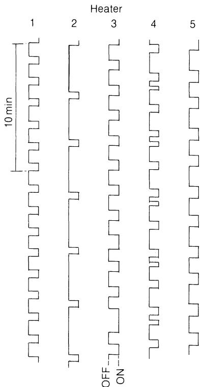  
温度设定No. 5(表C.1)
图C.1 事件记录仪：加热器通断记录。

表C.1 静态热损失

|  | 设定温度 (°C) | 功率消耗 (W) |  |  |  |  |  |  |  |  |  |
| --- | --- | --- | --- | --- | --- | --- | --- | --- | --- | --- | --- |
| 料筒区 | 法兰 | 口模 | 料筒区 | 法兰 | 口模 | 总计 |  |  |  |  |  |
| 加热器功率 | 1 | 2 | 3 | 4 | 5 | 1 | 2 | 3 | 4 | 5 |  |
|  |  |  |  |  | 3000 | 3000 | 3000 | 2200 | 600 | 8800 |  |
| 设定值 |  |  |  |  |  |  |  |  |  |  |  |
| 1 | 100 | 125 | 150 | 150 | 150 | 276 | 289 | 789 | 342 | 105 | 1801 |
| 2 | 150 | 150 | 150 | 150 | 150 | 996 | 0 | 498 | 356 | 123 | 1973 |
| 3 | 150 | 175 | 200 | 200 | 200 | 619 | 182 | 1056 | 626 | 182 | 2665 |
| 4 | 200 | 200 | 200 | 200 | 200 | 1189 | 324 | 757 | 562 | 185 | 3017 |
| 5 | 200 | 225 | 250 | 250 | 250 | 990 | 339 | 1396 | 867 | 241 | 3833 |
| 6 | 250 | 250 | 250 | 250 | 250 | 2015 | 444 | 1074 | 821 | 246 | 4600 |
| 辐射与对流计算热损失 |  |  |  |  |  |  |  |  |  |  |  |
| 2 | 150 | 150 | 150 | 150 | 150 | 352 | 171 | 235 | 295 | 48 | 1101 |
| 4 | 200 | 200 | 200 | 200 | 200 | 588 | 342 | 400 | 497 | 99 | 1926 |

表C.2 热损失试验中的表面温度(°C)

| 设定值 | 位置 |  |  |  |  |  |  |  |  |  |  |  |  |  |
| --- | --- | --- | --- | --- | --- | --- | --- | --- | --- | --- | --- | --- | --- | --- |
| K | F | A | G | L | B | H | M | C | I | N | D | J | E |  |
| 1 | 57 | 74 | 125 | 105 | 110 | 105 | 134 | 145 | 203 | 154 | 145 | 137 | - | 130 |
| 2 | 65 | 90 | 240 | 131 | 145 | 128 | 144 | 155 | 175 | 150 | 155 | 150 | 146 | 150 |
| 3 | 74 | 111 | 210 | 152 | 160 | 157 | 183 | 190 | 250 | 193 | 190 | 210 | 173 | 216 |
| 4 | 100 | 137 | 322 | 188 | 200 | 221 | 201 | 210 | 248 | 207 | 215 | 207 | 200 | 233 |
| 5 | 104 | 137 | 286 | 205 | 210 | 212 | 240 | 250 | 231 | 262 | 250 | 255 | 250 | 265 |
| 6 | 115 | 172 | 390 | 240 | 245 | 242 | 255 | 255 | 315 | 260 | 255 | 252 | 250 | 285 |
|  | K |  |  |  |  |  |  |  |  |  |  |  |  |  |
|  |  | F | A | G | LDeep | B | H | MDeep | C | I | NDeep | D | J | E |
|  |  |  |  |  |  |  |  |  |  |  |  |  |  |  |
|  | 法兰 | 区1 | 区2 | 区3 | 适配器(4)法兰 | 口模(5) |  |  |  |  |  |  |  |  |
|  | 进料端 |  |  |  |  | 口模端 |  |  |  |  |  |  |  |  |

连续额定功率，得出每只加热器的实际功率输入。冷水按正常运行方式连续循环流过加料口水套；流量与温升未予记录。

表C.1列出六组控制温度及相应的加热器功率输入，其中设定2和4附有按上述方法计算的值以供比较。表C.2给出用于该计算的实测表面温度。

各加热器之间的能量分配有一些出乎意料的特点。即使在'水平'温度分布下纵向传导应为最小时，区3仍然偏高。区1的贡献较大，推测是由于向加料口的传导所致；由于区1频繁通电，它还可能把热量向前传导，从而减少区2加热器的负荷；表C.2中的表面温度支持了这一点。向加料口的可观热损失表明，在加料口与料筒之间设置隔热屏障值得考虑，既可节约能量，又可提高第一料筒区的温度。

基于设定1、3和5'深置'热电偶温度计算的纵向热流表明，料筒内该热流可能仅为100–150 W，与加热器的能耗相比很小。然而，它会限制相邻区之间的温差，同时影响各加热器各自的能量贡献。

可以注意到，尤其在较高的设定温度下，能量损失占加热器额定输入(总计8.8 kW)的比例相当大。由于损失随温度升高而增大，这不仅限制了可达到的料筒温度上限，还会限制升温速率，并延长改变温度设定后重新建立稳定状态所需的时间。一种适合在(元件)温度约$350^{\circ}\mathrm{C}$左右连续运行或可与外部保温配合使用的加热器，例如工频感应加热器，可大幅减少这些损失，改善能量利用，并对设定温度的有意变化作出更快的响应。

所给出的数据严格来说仅适用于表C.2所列的外部温度，而这些温度不一定直接对应料筒内表面的温度。各加热器之间的能量分配在很大程度上决定了这些外部温度，它主要受设定温度分布的支配，尤其是靠近加料端的分布。因此，就大多数实用目的而言，可将能量损失视为仅取决于设定温度和物理布置。

# C.2 螺杆吸收功率的推导

由附录B.1，距螺杆表面距离y处的下游速度为：

$$
w = \frac {W y}{h} + \frac {(y ^ {2} - y h)}{2 \eta} \cdot \frac {\mathrm{d} P}{\mathrm{d} z}\tag{B.8}
$$

而$y$处的剪切速率为：

$$
\dot {\gamma} _ {y} = \frac {\mathrm{d} w}{\mathrm{d} y} = \frac {W}{h} + \frac {(2 y - h)}{2 \eta} \cdot \frac {\mathrm{d} P}{\mathrm{d} z}\tag{B.7}
$$

由此得壁面($y = h$)处的剪切速率为：

$$
\dot {\gamma} _ {h} = \left(\frac {\mathrm{d} w}{\mathrm{d} y}\right) _ {y = h} = \frac {W}{h} + \frac {(2 h - h)}{2 \eta} \cdot \frac {\mathrm{d} P}{\mathrm{d} z} \quad = \frac {W}{h} + \frac {h}{2 \eta} \cdot \frac {\mathrm{d} P}{\mathrm{d} z} \tag{C.1}
$$

为消去dP/dz，可将方程(6.16)改写为：

$$
\frac {h}{2 \eta} \cdot \frac {\mathrm{d} P}{\mathrm{d} z} = \frac {6 W}{h} \left(\frac {1}{2} - \frac {Q}{W b h}\right)
$$

代入方程(C.1)得：

$$
\dot {\gamma} _ {h} = \frac {W}{h} \left(4 - \frac {6 Q}{W b h}\right)\tag{6.69)(C.2}
$$

于是沿槽方向的剪应力为：

$$
\tau_ {h} = \eta \dot {\gamma} _ {h} = \frac {\eta W}{h} \left(4 - \frac {6 Q}{W b h}\right)\tag{C.3}
$$

该应力的切向分量为：

$$
\tau_ {h} \cos \phi = \frac {\eta W}{h} \left(4 - \frac {6 Q}{W b h}\right) \cos \phi\tag{C.4}
$$

同理，横向速度为：

$$
u = \frac {U y}{h} + \frac {y ^ {2} - y h}{2 \eta} \cdot \frac {\mathrm{d} P}{\mathrm{d} x}\tag{B.12}
$$

而$y$处的剪切速率为：

$$
\frac {\mathrm{d} u}{\mathrm{d} y} = \frac {U}{h} + \frac {2 y - h}{2 \eta} \cdot \frac {\mathrm{d} P}{\mathrm{d} x}\tag{B.11}
$$

由此得壁面($y = h$)处的剪切速率为：

$$
\left(\frac {\mathrm{d} u}{\mathrm{d} y}\right) _ {y = h} = \frac {U}{h} + \frac {h}{2 \eta} \cdot \frac {\mathrm{d} P}{\mathrm{d} x}\tag{C.5}
$$

代入下式以消去dP/dx：

$$
\frac {1}{2 \eta} \cdot \frac {\mathrm{d} P}{\mathrm{d} x} = \frac {3 U}{h ^ {2}}\tag{6.25}
$$

得：

$$
\left(\frac {\mathrm{d} u}{\mathrm{d} y}\right) _ {y = h} = \frac {4 U}{h}\tag{C.6}
$$

横槽方向的剪应力为：

$$
\eta \left(\frac {\mathrm{d} u}{\mathrm{d} y}\right) _ {y = h} = \frac {4 \eta U}{h}\tag{C.7}
$$

该应力的切向分量为：

$$
\eta \frac {\mathrm{d} u}{\mathrm{d} y} \sin \phi = \frac {4 \eta U}{h} \sin \phi\tag{C.8}
$$

因此，料筒表面上的总切向应力为：

$$
\eta \frac {W}{h} \left(4 - \frac {6 Q}{W b h}\right) \cos \phi + 4 \eta \frac {U}{h} \sin \phi\tag{C.9}
$$

联立方程(6.4)与(6.5)得：

$$
U = W \tan \phi\tag{C.10}
$$

并将U代入(C.9)得：

$$
\text { tangential   stress } = \eta \frac {W}{h} \left[ \left(4 - \frac {6 Q}{W b h}\right) \cos \phi + 4 \sin \phi \tan \phi \right]\tag{C.11}
$$

对于螺槽微元长度dz，该应力作用的面积为b dz，由此得：

切向剪切

$$
\text { force } = \frac {\eta W b \mathrm{d} z}{h} \left[ \left(4 - \frac {6 Q}{W b h}\right) \cos \phi + 4 \sin \phi \tan \phi \right]\tag{C.12}
$$

吸收的功率等于力×距离/时间，即力×速度；由方程(6.4)整理可知切向速度为：

$$
\pi D N = \frac {W}{\cos \phi}\tag{C.13}
$$

因此，螺槽长度dz内吸收的功率为：

$$
\text { channel   power } = \frac {\eta W ^ {2} b \mathrm{d} z}{h} \left[ 4 (1 + \tan^ {2} \phi) - \frac {6 Q}{W b h} \right]\tag{8.7)(C.14}
$$

如6.3节所示，流经螺棱间隙的压力流通常远小于拖曳流；鉴于其他方面的近似(8.3节和8.4节)，只需考虑后者即可。由于这是简单剪切流动，与槽内压力梯度无关，无需将其分解为沿槽与横槽分量。与螺槽流动一样，切向速度由下式给出：

$$
\pi D N = \frac {W}{\cos \phi}\tag{C.13}
$$

而螺棱间隙$\delta$内的剪切速率为：

$$
\dot {\gamma} _ {f 1} = \frac {W}{\delta \cos \phi}\tag{C.15}
$$

相应的剪应力为：

$$
\tau_ {\mathrm{f} 1} = \frac {\eta W}{\delta \cos \phi}\tag{C.16}
$$

其作用面积为$t \cos \phi dz$，由此得剪力：

$$
\text { flight   shear   force } = \frac {\eta W}{\delta \cos \phi} t \cos \phi d z\tag{C.17}
$$

其中dz为螺槽长度。

速度仍为$W/\cos\phi$，得：

吸收功率

$$
\text {flights} = \frac {\eta W}{\delta \cos \phi} t \cos \phi \mathrm{d} z \frac {W}{\cos \phi} \quad = \eta \frac {W ^ {2} t \mathrm{d} z}{\delta \cos \phi} \tag{8.8) (C.18}
$$

因此，熔体输送段长度dz内吸收的总功率为：

$$
E _ {\mathrm{dz}} = \frac {\eta W ^ {2} b \mathrm{dz}}{h} \left[ 4 (1 + \tan^ {2} \phi) - \frac {6 Q}{W b h} \right] + \frac {\eta W ^ {2} t \mathrm{dz}}{\delta \cos \phi}\tag{8.9) (C.19}
$$

这些功率方程将在8.2节中分析。

# C.3 熔体输送段中的热流

表8.1和图8.4用字母标示了熔体输送段中若干可能的热流。下面逐一考察这些热流，估计各自的大小，并推导操作变量(尤其是螺杆转速和背压)的影响。

为了估计典型条件下各项的相对数值，采用下面给出的尺寸与物性。它们与第260页例子的差别主要在于槽深和螺棱间隙增大(分别为10 mm和0.15 mm，而不是5 mm和0.1 mm)，以及

# 能耗与能量平衡

黏度数据如下，属典型的MFR 2.0 LDPE：

| 剪切速率 (s-1) | 温度 (°C) | 黏度 (N·sm-2) | 温度系数 (°C-1) |
| --- | --- | --- | --- |
| 30 | 150 | 2200 | β = 0.0134 |
| 30 | 200 | 730 |  |
| 2000 | 150 | 124 | β = 0.0102 |
| 2000 | 200 | 61 |  |

于是：

| 假塑性指数 | n | 0.3152 (150°C), 0.4090 (200°C) |
| --- | --- | --- |
| 直径 | D | 100 mm |
| 螺槽深度 | h | 10 mm |
| 螺距 | p | 100 mm |
| 螺棱宽度 | t | 10 mm |
| 转速 | N | 1 rps |
| 黏度 | η | 见上表 |
| 螺棱间隙 | δ | 0.15 mm |
| 料筒外径 | $D_0$ | 200 mm |

于是：

螺槽宽度
螺旋角
每转螺旋线长度
圆周速度
纵向速度
横向速度
拖曳流

$$
b = (p - t) \cos \phi = 0. 0 8 5 7 6 \mathrm{m}
$$

$$
\phi \quad 1 7. 6 5 7 ^ {\circ}
$$

$$
\mathrm{d} z = 0. 1 \pi / \cos \phi = 0. 3 2 9 7 \mathrm{m}
$$

$$
\pi D N = \pi \times 0. 1 \times 1 = 0. 3 1 4 2 \mathrm{ms} ^ {- 1}
$$

$$
0. 2 9 9 4 \mathrm{ms} ^ {- 1}
$$

$$
0. 0 9 5 3 \mathrm{ms} ^ {- 1}
$$

$$
Q _ {\mathrm{D}} = 0. 2 9 9 4 \times 0. 0 8 5 7 6 \times 0. 0 1 / 2
$$

$$
= 1. 2 8 4 \times 1 0 ^ {- 4} \mathrm{m} ^ {3} \mathrm{s} ^ {- 1}
$$

拖曳流剪切速率

$$
\dot {\gamma} _ {\mathrm{D}} = W / h = 0. 2 9 9 4 / 0. 0 1
$$

因子$4(1 + \tan^2\phi)$

150°C下的螺槽功率

$$
\begin{array}{r l} \mathrm{d} E & = \frac {2 2 0 0 \times 0 . 2 9 9 4 ^ {2} \times 0 . 0 8 5 7 6 \times 0 . 3 2 9 7}{0 . 0 1} \\ & \times \left(4. 4 - \frac {6 Q}{W b h}\right) \\ & = 5 5 7. 6 \left(4. 4 - \frac {6 Q}{W b h}\right) \mathrm{W/turn} \end{array}
$$

200°C下的螺槽功率

$$
\mathrm{d} E = 1 8 5. 0 \left(4. 4 - \frac {6 Q}{W b h}\right) \mathrm{W} / \text { turn }
$$

热物性(取自表4.1)：

钢的密度

聚乙烯的密度$\left\{\begin{array}{l} at 150^{\circ}C \\ at 200^{\circ}C \end{array}\right.$

$$
7 8 0 0 \mathrm{kg} \mathrm{m} ^ {- 3}
$$

$$
7 8 5 \mathrm{kg} \mathrm{m} ^ {- 3}
$$

$$
7 7 4 \mathrm{kg} \mathrm{m} ^ {- 3}
$$

钢的比热容

$$
5 0 3 \mathrm{Jkg} ^ {- 1} \mathrm{K} ^ {- 1}
$$

聚乙烯的比热容

$$
2 3 0 0 \mathrm{Jkg} ^ {- 1} \mathrm{K} ^ {- 1}
$$

钢的导热系数

$$
5 0 \mathrm{W} \mathrm{m} ^ {- 1} \mathrm{K} ^ {- 1}
$$

聚乙烯的导热系数

$$
0. 5 0 \mathrm{Wm} ^ {- 1} \mathrm{K} ^ {- 1}
$$

钢的热扩散率

$$
1. 3 \times 1 0 ^ {- 5} \mathrm{m} ^ {2} \mathrm{s} ^ {- 1}
$$

聚乙烯的热扩散率

$$
1. 5 \times 1 0 ^ {- 7} \mathrm{m} ^ {2} \mathrm{s} ^ {- 1}
$$

假定的纵向温度梯度为$125^{\circ}C m^{-1}$(轴向)，相当于每个4D区段$50^{\circ}C$，沿螺旋方向为$37.9^{\circ}C m^{-1}$

# A 表面传热：加热器至料筒

典型的加热器额定值为：

\- 电阻式3–4 W cm $^{-2}$，相当于每个4D区段7.5–10 kW

\- 感应式$13\mathrm{Wcm}^{-2}$，相当于每$4D$区段$33\mathrm{kW}$。

若全部热量传入料筒，则分别相当于热流密度$30-40\ kW\ m^{-2}$和$130\ kW\ m^{-2}$，即每转940–4080 W。

# B 料筒内的径向传导

对于圆柱体内的径向传导，热流密度q为：

$$
q = \frac {2 \pi k L (T _ {2} - T _ {1})}{\log_ {\mathrm{e}} (R _ {2} / R _ {1})}\tag{4.6}
$$

代入给定数值，

$$
T _ {2} - T _ {1} = \frac {q \times \log_ {\mathrm{e}} (0 . 1 / 0 . 0 5)}{2 \pi \times 5 0 \times 0 . 1} \quad = 0. 0 2 2 q \quad = 4 1. 5 ^ {\circ} \mathrm{C} \text { for } 3 \mathrm{Wcm} ^ {- 2} \quad \text { or } 1 8 0 ^ {\circ} \mathrm{C} \text { for } 1 3 \mathrm{Wcm} ^ {- 2} \quad \text { or } 3. 0 6 ^ {\circ} \mathrm{C} \text { for } 1 0 ^ {\circ} \mathrm{C} \text { difference } \quad \text { between barrel and polymer (see C below) } \tag{C.20}
$$

# C 料筒与聚合物之间的表面传热

对于抛物线速度分布(例如牛顿流体的压力流动)，基于算术平均温度的传热系数$h_{a}$

由下式给出：

$$
\frac {h _ {\mathrm{a}} D}{k} = 1. 7 5 \left(\frac {w C _ {\mathrm{p}}}{k L}\right) ^ {1 / 3}\tag{4.14}
$$

适用于Graetz数$wC_{\mathrm{p}} / kL > 10$的情形。对于宽$T\times H$的矩形狭缝，此方程可用，取$H = D / 2$，$w$为通过宽度$\pi H$的质量流量。

螺槽中的速度分布复杂，因此为估算传热，取一个壁面剪切速率相同的、具有抛物线速度分布的简单流动代替。如附录C.4所示，壁面总剪切速率难以计算，故进一步的近似是计算离壁一小段距离内总速度大小的变化，再除以该距离得到壁面剪切速率。沿槽速度与横向速度以槽深分数y/h(自螺杆根部算起)表示于方程(6.67)、(6.26)。y/h = 0.99处的合成速度按$(w_{0.99}^{2} + u_{0.99}^{2})^{1/2}$计算。其大小(忽略方向变化)与料筒表面处$\pi DN$之差除以距离$0.01h = 1 \times 10^{-4} \, m$，即得总剪切速率。对若干背压(Q/Wbh)值进行了此项计算。由表3.1可见，狭缝的体积流量为：

$$
Q = \dot {\gamma} \frac {T H ^ {2}}{6}\tag{C.21}
$$

上式乘以熔体密度，即得通过深H、宽$T = \pi H$狭缝的质量流量，用于估算Graetz数。由于(相对料筒的)速度至少要到槽深三分之二以上才达到最大值(对应压力流的中心)(图6.6(a)和6.7)，小于此的任何深度都应视为等效于狭缝深度之半，即H/2或D/4。对本文数值，只要H/2大于1.57 mm，Graetz数即超过10；又因Q正比于$D^{3}$，传热系数预计在更大深度下保持恒定，故深度的选取并不重要。速度分布未受扰动的长度L为垂直于螺杆轴线的槽宽b/sin $\phi$。表C.3给出螺杆转速1 rps时总剪切速率、Graetz数和传热系数的计算结果。结果表明，壁面剪切速率随背压的增大会使传热系数适度增大约三分之一。由于剪切速率乃至Graetz数都正比于速度(方程(6.67)和(6.26))，螺杆转速加倍预计会使传热系数乘以$(2)^{1/3} = 1.26$倍。

对于典型传热系数$300 W m^{-2} K^{-1}$和聚合物/金属温差$10^{\circ}C$：

$$
\text { radial heat flux } = 3 0 0 \times 0. 0 8 5 7 6 \times 0. 3 2 9 7 \times 1 0 \quad = 8 4. 8 \mathrm{W/turn} \tag{C.22}
$$

表C.3 表面传热系数：料筒至聚合物

| Q/Wbh |  | 0 | 0.1 | 0.2 | 0.3 | 0.4 | 0.5 | 0.6 |
| --- | --- | --- | --- | --- | --- | --- | --- | --- |
| 料筒处沿槽速度 W (y = h) | m s-1 | ---- | 0.2994 | ---- |  |  |  |  |
| y = 0.99h处沿槽速度 w | m s-1 | 0.2875 | 0.2893 | 0.2910 | 0.2928 | 0.2946 | 0.2964 | 0.2981 |
| 速度差 dw | m s-1 | 0.0119 | 0.0101 | 0.0083 | 0.0066 | 0.0048 | 0.0030 | 0.0012 |
| 料筒处横槽速度 U (y = h) | m s-1 | ---- | 0.0953 | ---- |  |  |  |  |
| y = 0.99h处横槽速度 u | m s-1 | ---- | 0.0915 | ---- |  |  |  |  |
| 速度差 du | m s-1 | ---- | 0.0038 | ---- |  |  |  |  |
| 总速度差 √dw2+du2 | m s-1 | 0.0125 | 0.0108 | 0.0092 | 0.0076 | 0.0061 | 0.0048 | 0.0040 |
| 总剪切速率 γ = dV/0.0001 | s-1 | 124.7 | 107.9 | 91.5 | 75.6 | 60.9 | 48.2 | 39.7 |
| 等效流量 ×10-6Q = γTH2/6 | m3s-1 | 2.02 | 1.75 | 1.48 | 1.22 | 0.987 | 0.781 | 0.644 |
| 格雷茨数 QρCp/kL |  | 25.8 | 22.3 | 18.9 | 15.6 | 12.6 | 9.97 | 8.22 |
| 努塞尔数 1.75(Gz)1/3 |  | 5.17 | 4.93 | 4.66 | 4.37 | 4.07 | 3.77 | 3.53a |
| 传热系数 ha = 0.5Nu/4 × 0.00157 | W m-2K-1 | 411.7 | 392.2 | 371.1 | 348.1 | 324.2 | 299.9 | 281.2a |

$^{a}$ 略有高估，因为在Gz=10以下曲线低于$1.75(Gz)^{1/3}$

# D 料筒壁内的轴向传导

熔体的纵向温度梯度取每4D区段$50^{\circ}C$，即$125^{\circ}C m^{-1}$。对聚合物的径向传热受限(C)预示料筒壁内只有很小的径向温差(B)。因此，除非聚合物/金属温差很大，料筒壁内的平均轴向梯度也将接近$125^{\circ}C m^{-1}$。注意，由于向周围环境的散热可能很大(附录C.1)，加热器设定温度的梯度可能明显大于或小于聚合物中的梯度。

当外径为200 mm时，料筒横截面积为$0.02356 \, m^{2}$，得：

$$
\text { axial heat flux } = 5 0 \times 0. 0 2 3 5 6 \times 1 2 5 \quad = 1 4 7 \mathrm{W/turn} \quad \text { or } 1 1 8 0 \mathrm{Wforagradientof} 1 ^ {\circ} \mathrm{Cmm} ^ {- 1} \tag{C.23}
$$

若料筒外径减至150 mm，横截面积为$0.009817 \, m^{2}$，且：

$$
\text { axial heat flux } = 5 0 \times 0. 0 0 9 8 1 7 \times 1 2 5 \quad = 6 1. 4 \mathrm{W/turn} \tag{C.24}
$$

对给定的加热器类型，加热器热流密度大致恒定，加热器功率正比于直径的平方。由于向聚合物的传热系数几乎恒定(第442页)，径向热流也将正比于直径的平方，因而是加热器功率的恒定分数。径向厚度近似正比于直径，故料筒内的径向温差也将正比于直径。料筒横截面积正比于直径的平方，而在区间温差恒定时，轴向梯度反比于直径。于是：

$$
\text { axial heat flux } = k A \cdot \frac {\mathrm{d} T}{\mathrm{d} x} \quad \propto k \cdot D ^ {2} \cdot \frac {1}{D} \quad \propto D (\text { diameter }) \tag{C.25}
$$

因此，在较大的机器中，轴向热流相对变得更小。

# E 螺杆根部的径向传热

采用与料筒表面传热相同的假设和方法(表C.3)，由方程(6.68)和(B.14)，在y/h = 0处：

$$
\left(\frac {\mathrm{d} w}{\mathrm{d} y}\right) _ {y = 0} = \frac {W}{h} \left(\frac {6 Q}{W b h} - 2\right)\tag{C.26}
$$

以及

$$
\left(\frac {\mathrm{d} u}{\mathrm{d} y}\right) _ {y = 0} = \frac {- 2 U}{h} \quad = \frac {- 2 W}{h} \tan \phi \tag{C.27}
$$

在$Q / Wbh = 1 / 2$时，方程(C.26)变为：

$$
\left(\frac {\mathrm{d} w}{\mathrm{d} y}\right) _ {y = 0} = \frac {W}{h}\tag{C.28}
$$

而当$Q / Wbh = 0$时

$$
\left(\frac {\mathrm{d} w}{\mathrm{d} y}\right) _ {y = 0} = - \frac {2 W}{h}\tag{C.29}
$$

作为近似，若：

$$
\text { total   shear   rate } = \sqrt {\left(\frac {\mathrm{d} w}{\mathrm{d} y}\right) ^ {2} + \left(\frac {\mathrm{d} u}{\mathrm{d} y}\right) ^ {2}}\tag{C.30}
$$

在$Q / Wbh = 1 / 2$时

$$
\text { total   shear   rate } = \frac {W}{h} \sqrt {1 + 4 \tan^ {2} \phi}\tag{C.31}
$$

表C.4 若干阻力比m = k/hx下螺棱内的径向传导

| 螺杆转速 | rps | 1 | 2 | 4 |
| --- | --- | --- | --- | --- |
| m=0 |  |  |  |  |
| 到达终点时的温度升高 | °C | 1.54 | 2.68 | 4.61 |
| "静止"结束及下一段起点时的残余温度升高 | °C | 0.32 | 0.55 | 0.94 |
| 平均超温 | °C | 0.93 | 1.61 | 2.77 |
| m=2.909 (h=1719 W m-2K-1) |  |  |  |  |
| 到达终点时聚合物温度升高 | °C | 15.2 | 21.9 | 28.4 |
| 到达终点时金属温度升高(均匀), rm=0.01 m | °C | 0.068 | 0.049 | 0.032 |
| m=∞ |  |  |  |  |
| ‘Adiabatic’ polymer temperature rise | °C | 29.7 | 36.5 | 44.5 |

而当$Q / Wbh = 0$时

$$
\text { total   shear   rate } = \frac {2 W}{h} \sqrt {1 + \tan^ {2} \phi}\tag{C.32}
$$

在1 rps及$\tan \phi = 1 / \pi$时，方程(C.31)和(C.32)给出的总剪切速率分别为$35.5\mathrm{s}^{-1}$和$-62.8\mathrm{s}^{-1}$。

由于横向剪切速率du/dy = 0出现在y/h = 1/3处，等效狭缝的H取为$0.01 \times 2 \times 1/3 = 0.00667 \, m$。按表C.3的方法，相应的传热系数分别为271和$328 \, W m^{-2} K^{-1}$，因此取与C相同的统一值$300 \, W m^{-2} K^{-1}$是合理的。若要在螺杆一转内供给螺杆轴向传导所需的热量，聚合物与螺杆根部之间的温差应为：

$$
\mathrm{d} T = \frac {3 1 . 4 \cos \phi}{3 0 0 \times 0 . 0 8 5 7 6 \times \pi \times 0 . 0 8} \quad = 4. 6 ^ {\circ} \mathrm{C} \tag{C.33}
$$

# F 螺棱内的径向传导

每转的螺棱面积为$0.00314 \, m^{2}$。对于$1^{\circ}C \, mm^{-1}$的温度梯度，相当于整个螺棱高度上$10^{\circ}C$：

$$
\text { radial heat flux } = 5 0 \times 0. 0 0 3 1 4 \times 1 0 0 0 \quad = 1 5 7 \mathrm{W/turn} \tag{C.34}
$$

螺棱间隙温度超出螺槽内温度(150°C)的部分已在附录C.5中算出，如表C.4所示。

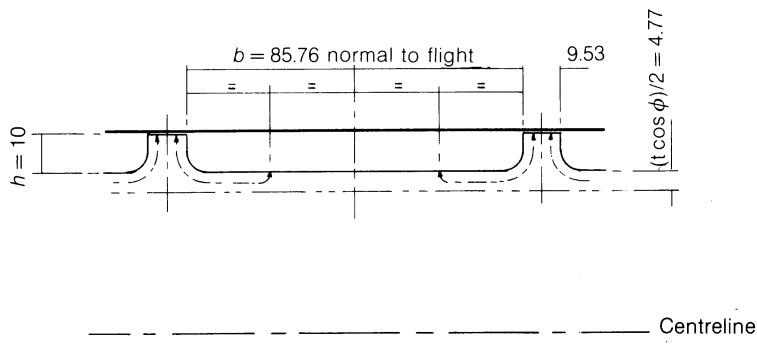  
图C.2 螺棱顶部与螺槽根部之间假定的热流路径。

若计入螺棱顶部处$1719 \, W m^{-2} K^{-1}$(来自P，第459页)的传热系数，则间隙内聚合物与螺杆根部之间的总传热系数为：

$$
U = \frac {1}{\frac {1}{1 7 1 9} + \frac {0 . 0 1}{5 0}} \quad = 1 2 7 9 \mathrm{Wm} ^ {- 2} \mathrm{K} ^ {- 1} \tag{C.35}
$$

且

$$
\text { radial   heat   flux   at } 1 \mathrm{rps} = 3. 6 \mathrm{W}\tag{C.36}
$$

若要在螺杆一转内供给螺杆根部轴向传导所需的全部热量，径向温差将为：

$$
\mathrm{d} T = \frac {3 1 . 4}{1 2 7 9 \times 0 . 0 0 3 1 4} \quad = 7. 8 ^ {\circ} \mathrm{C}. \tag{C.37}
$$

# G 螺杆上螺棱与螺槽根部之间的局部轴向传导

为估算这些热流(图C.2)，需引入若干近似假设：

1. 螺棱侧面处聚合物的热阻为无穷大(另见J)。

2. 螺槽根部相对较大的表面保证其上热流密度E近似均匀。

3. 热量横穿螺槽流动，即垂直于螺棱方向，尽管螺杆根部的传导主要是轴向的。

4. 热量流向螺棱两侧的螺槽。

5. 两条有效热路径各为螺棱宽度之半，即距螺槽根部$(t\cos\phi)/2=0.00476\mathrm{~m}$，有效长度为$h+b/4=0.03144\mathrm{~m}$。前者对应的横截面积为$2\pi\times0.08\times0.00476=0.00240\mathrm{~m}^{2}$。

对于0.03144 m上$1^{\circ}$ C的温差，

$$
\text { heat flux } = 5 0 \times 0. 0 0 2 4 0 \times \frac {1}{0 . 0 3 1 4 4} \quad = 3. 8 \mathrm{W} \tag{C.38}
$$

若考虑E和P处的表面传热系数，则相对于面积$0.00240 \, m^{2}$的总传热系数：

$$
\begin{array}{r l} U & = \frac {1}{\frac {1}{1 2 7 9} + \frac {0 . 0 3 1 4 4}{5 0} + \frac {0 . 0 0 2 4 0}{3 0 0 \times 0 . 0 8 5 7 6}} \\ & = 6 6 5 \mathrm{Wm} ^ {- 2} \mathrm{K} ^ {- 1} \end{array}
$$

对于螺棱内与螺槽内聚合物之间$0.89^{\circ}$ C的平均温差(来自P)，经由螺杆传递的热量为：

$$
\text { heat flux } = 6 6 5 \times 0. 0 0 2 4 0 \times 0. 8 9 \quad = 1. 4 \mathrm{W} \tag{C.39}
$$

# H 螺杆根部的总体轴向传导

槽深10 mm的螺杆，其根部横截面积为 $0.00503 \, m^{2}$ 。当纵向温度梯度为 $1^{\circ}C/mm$ 时：

$$
\text { heat flux } = 5 0 \times 0. 0 0 5 0 3 \times 1 0 0 0 \quad = 2 5 1 \mathrm{W} \tag{C.40}
$$

对于所假设的温度梯度 $125^{\circ}C m^{-1}$ ：

$$
\text { heat   flux } = 3 1. 4 \mathrm{W}\tag{C.41}
$$

# J 螺棱厚度内的轴向传导

垂直于螺杆轴线的螺棱横截面积为 $0.01 \times \pi \times 0.1 = 0.00314 m^{2}$ 。当温差为 $1^{\circ}C$ 时：

$$
\text { heat flux } = 5 0 \times 0. 0 0 3 1 4 \times \frac {1}{0 . 0 1} \quad = 1 5. 7 \mathrm{W} \tag{C.42}
$$

若与槽底一样假设表面对流传热系数为 $300 \, W m^{-2} K^{-1}$ ，则总传热系数为：

$$
U = \frac {1}{\frac {1}{3 0 0} + \frac {1}{3 0 0} + \frac {0 . 0 1}{5 0}} \quad = 1 4 5 \mathrm{Wm} ^ {- 2} \mathrm{K} ^ {- 1} \tag{C.43}
$$

则

$$
\text { heat flux } = 1 4 5 \times 0. 0 0 3 1 4 \times 1 2 5 \times 0. 0 1 \quad = 0. 5 7 \mathrm{W} \tag{C.44}
$$

以及螺棱金属内部的温差：

$$
\mathrm{d} T = \frac {0 . 5 7 \times 0 . 0 1}{0 . 0 0 3 1 4 \times 5 0} \quad = 0. 0 3 6 ^ {\circ} \mathrm{C} \tag{C.45}
$$

# K 螺槽内聚合物的径向传导

对螺槽的一圈而言，

$$
\begin{array}{r l} \text { surface   area } & = 0. 0 8 5 7 6 \times 0. 3 2 9 7 \\ & = 0. 0 2 8 3 \mathrm{m} ^ {2} \end{array}
$$

当温度梯度为 $1^{\circ}$ C/mm 时，

$$
\text { radial heat flux } = 0. 5 \times 0. 0 2 8 3 \times 1 0 0 0 \quad = 1 4. 1 \mathrm{W/turn} \tag{C.46}
$$

C.4节中已证明，若无环流N，剪切生热M将造成每圈径向温差，范围约从 Q/Wbh = 1/2 时的 $0.42^{\circ}$ C 到 Q/Wbh = 0 时的 $3.8^{\circ}$ C，平均距离约5 mm，即半个槽深。于是仅由传导可得，

$$
\text { radial heat flux } = 0. 5 \times 0. 0 2 8 3 \times \frac {0 . 4 2}{0 . 0 0 5} \quad = 1. 2 \mathrm{W} \text { to } 1 0. 7 \mathrm{W} \tag{C.47}
$$

环流N将该径向温差降至0.05–0.30°C，对此，

$$
\text { radial   conduction } = 0. 1 4 - 0. 8 5 \mathrm{W}\tag{C.49}
$$

# L 螺槽内聚合物沿螺旋线方向的纵向传导

螺槽横截面积为 $0.01 \times 0.08576 = 0.00086 m^{2}$ 。当沿螺旋线的温度梯度为 $1^{\circ}C/mm$ 时，

$$
\text { heat flux } = 0. 5 \times 0. 0 0 0 8 6 \times 1 0 0 0 \quad = 0. 4 3 \mathrm{W} \tag{C.49}
$$

所假设的轴向梯度 $125^{\circ}C/m$ 相当于沿螺旋线的梯度 $125 \times 0.1/0.3297 = 37.9^{\circ}C/m$ ，此时沿螺槽螺旋线的传导为，

$$
\text { heat flux } = 0. 5 \times 0. 0 0 0 8 6 \times 3 7. 9 \quad = 0. 0 1 6 \mathrm{W} \tag{C.50}
$$

M 螺槽内的剪切生热

见C.4节。

# N 螺槽内的横向环流

见C.4节。

# P 螺棱间隙内的剪切生热与耗散

见C.5节。

# R 沿螺棱螺旋线的传导

螺杆螺棱的横截面积为

$$
0. 0 1 \times 0. 0 1 \cos \phi = 9. 5 \times 1 0 ^ {- 5} \mathrm{m} ^ {2}
$$

沿螺旋线的温度梯度(同L项)为 $37.9^{\circ}$ C/m，由此传导的热流量为

$$
\text { heat flux } = 5 0 \times 9. 5 \times 1 0 ^ {- 5} \times 3 7. 9 \quad = 0. 1 8 \mathrm{W} \tag{C.51}
$$

# S 横穿螺槽的传导

此项是在不考虑由聚合物速度引起的质量传递的情况下估算的。垂直于螺杆轴线的横截面积为

$$
0. 0 1 \times \pi \times 0. 1 = 0. 0 0 3 1 4 \mathrm{m} ^ {2}
$$

当轴向温度梯度为 $1^{\circ}$ C/mm 时，

$$
\text { axial heat flux } = 0. 5 \times 0. 0 0 3 1 4 \times 1 0 0 0 \quad = 1. 5 7 \mathrm{W} \tag{C.52}
$$

对于所假设的温度梯度 $125^{\circ}$ C/m，

$$
\text { axial heat flux } = 0. 5 \times 0. 0 0 3 1 4 \times 1 2 5 \quad = 0. 2 0 \mathrm{W/turn} \tag{C.53}
$$

垂直于螺槽螺旋线方向传导的热量与此相近，较小的温度梯度被较大的横截面积部分抵消。

停机时这一小热流量可能很重要；但在运转时，靠近料筒处的聚合物流动垂直于螺杆轴线，因而不靠质量传递输运热量，而在其他位置其流动具有向前的分量，与纯传导的作用相反。

# 停机时(例如升温期间)

螺杆静止时，无法确定各表面的对流传热系数。若将其忽略，则可将螺杆视为经由螺槽与螺棱两条并联路径的纯传导受热。显然，若螺杆内无聚合物，后者将占主导。否则，设料筒与螺杆之间总温差为 $10^{\circ}$ C。则在螺槽中，

$$
\begin{array}{r l} q & = k A \cdot \frac {\mathrm{d} T}{\mathrm{d} x} \\ & = 0. 5 \times \frac {1 0}{0 . 0 1} \\ & = 5 0 0 \mathrm{Wm} ^ {- 2} \end{array}
$$

或

$$
5 0 0 \times 0. 0 8 5 7 6 \times 0. 3 2 9 7 = 1 4. 1 4 \mathrm{W} / \text { t   u   r   n }
$$

对于螺棱，

$$
\begin{array}{r l} U & = \frac {1}{\frac {0 . 0 0 0 1 5}{0 . 5 0} + \frac {0 . 0 1}{5 0}} \\ & = 2 0 0 0 \mathrm{Wm} ^ {- 2} \mathrm{K} ^ {- 1} \end{array}
$$

且

$$
\begin{array}{r l} \text { heat   flux } & = 2 0 0 0 \times 0. 0 0 9 5 3 \times 0. 3 2 9 7 \times 1 0 \\ & = 6 2. 8 4 \mathrm{W/turn} \end{array}
$$

流经螺棱的比例为：

$$
\frac {62.84}{62.84 + 14.14} = 0.816 \text { or } 81.6 \%\tag{C.54}
$$

可见即使螺槽充满时，经螺棱的加热仍占主导。
在螺杆末端，设沿轴向传入螺杆的热量为31 W，则余下约46 W用于加热螺杆。此时升温速率应为：

$$
\frac {4 6}{0 . 0 0 5 0 3 \times 0 . 1 \times 7 8 0 0 \times 5 0 3} = 0. 0 2 3 ^ {\circ} \mathrm{Cs} ^ {- 1}
$$

或

$$
1. 4 ^ {\circ} \mathrm{C} \min ^ {- 1} \text {   for   } 1 0 ^ {\circ} \mathrm{C} \text {   radial   difference   }\tag{C.55}
$$

若鉴于加热器功率而假定料筒温度恒定，则在温差为 $5^{\circ}C$ 时螺杆升温速率将为 $0.7^{\circ}C min^{-1}$ 。因此，使料筒/螺杆温差减半大约需要5 min。

# 螺杆冷却

湍流状态下水侧的传热系数可取 $1705 \, W m^{-2} K^{-1}$ (300 BTU/hr · ft² · °F)。若冷却孔直径为30 mm，则每圈表面积为 $\pi \times 0.03 \times 0.1 = 0.0094 m^{2}$ 。

温差为 $1^{\circ}$ C 时，热流量 = $1705 \times 0.0094 \times 1 = 16$ W每圈。若该热量来自螺槽(E项)，则

$$
\text { polymer / metal   difference } = 2. 4 7 ^ {\circ} \mathrm{C}\tag{C.56}
$$

# C.4 剪切生热的分布与横向环流

# M 螺杆螺槽中的剪切生热

距螺杆根部距离y处的沿槽方向速度由下式给出：

$$
w _ {y} = \frac {W y}{h} + \frac {6 W}{h ^ {2}} \left(\frac {1}{2} - \frac {Q}{W b h}\right) (y ^ {2} - y h)\tag{6.67}
$$

令

$$
q = \frac {1}{2} - \frac {Q}{W b h}\tag{8.17}
$$

则

$$
w _ {y} = \frac {W y}{h} + 6 W q \left[ \left(\frac {y}{h}\right) ^ {2} - \frac {y}{h} \right]\tag{C.57}
$$

距螺杆根部距离y处的横向速度为：

$$
u _ {y} = \frac {U y}{h} \left(\frac {3 y}{h} - 2\right)\tag{6.26}
$$

将式(6.4)和式(6.5)中的 $U = W \tan \phi$ 代入，并令

$$
T = \tan \phi\tag{8.18}
$$

$$
u _ {y} = \frac {W T y}{h} \left(\frac {3 y}{h} - 2\right)\tag{C.58}
$$

距螺杆根部距离y处的总速度为：

y处的速度 = $\sqrt{w_y^2 + u_y^2}$

$$
\text {at} y = \sqrt {w _ {y} ^ {2} + u _ {y} ^ {2}} \quad = \sqrt {W ^ {2} \left(\frac {y}{h}\right) ^ {2} + 1 2 W ^ {2} q \left(\frac {y}{h}\right) ^ {3} - 1 2 W ^ {2} q \left(\frac {y}{h}\right) ^ {2} - 7 2 W ^ {2} q ^ {2} \left(\frac {y}{h}\right) ^ {3} + 3 6 W ^ {2} q ^ {2} \left(\frac {y}{h}\right) ^ {4} + 3 6 W ^ {2} q ^ {2} \left(\frac {y}{h}\right) ^ {2} + 9 W ^ {2} T ^ {2} \left(\frac {y}{h}\right) ^ {4} + 4 W ^ {2} T ^ {2} \left(\frac {y}{h}\right) ^ {2} - 1 2 W ^ {2} T ^ {2} \left(\frac {y}{h}\right) ^ {3}} \tag{C.59}
$$

求导后，y处的剪切速率为：

$$
\dot {\gamma} _ {y} = \frac {\mathrm{d}}{\mathrm{d} y} (\text {Velocity})
$$

$$
= \frac {W ^ {2}}{2} \cdot \frac {N}{D}
$$

其中分子 $N$ 为：

$$
N = \frac {2}{h} \left(\frac {y}{h}\right) + \frac {3 6 q}{h} \left(\frac {y}{h}\right) ^ {2} - \frac {2 4 q}{h} \left(\frac {y}{h}\right) - \frac {2 1 6 q ^ {2}}{h} \left(\frac {y}{h}\right) ^ {2} + \frac {1 4 4 q ^ {2}}{h} \left(\frac {y}{h}\right) ^ {3} + \frac {7 2 q ^ {2}}{h} \left(\frac {y}{h}\right) + \frac {3 6 T ^ {2}}{h} \left(\frac {y}{h}\right) ^ {3} + \frac {8 T ^ {2}}{h} \left(\frac {y}{h}\right) - \frac {3 6 T ^ {2}}{h} \left(\frac {y}{h}\right) ^ {2}
$$

分母 $D$ 为：

$$
D = \sqrt {W ^ {2} \left(\frac {y}{h}\right) ^ {2} + 1 2 W ^ {2} q \left(\frac {y}{h}\right) ^ {3} - 1 2 W ^ {2} q \left(\frac {y}{h}\right) ^ {2} - 7 2 W ^ {2} q ^ {2} \left(\frac {y}{h}\right) ^ {3} + 3 6 W ^ {2} q ^ {2} \left(\frac {y}{h}\right) ^ {4} + 3 6 W ^ {2} q ^ {2} \left(\frac {y}{h}\right) ^ {2} + 9 W ^ {2} T ^ {2} \left(\frac {y}{h}\right) ^ {4} + 4 W ^ {2} T ^ {2} \left(\frac {y}{h}\right) ^ {2} - 1 2 W ^ {2} T ^ {2} \left(\frac {y}{h}\right) ^ {3}} \tag{C.60}
$$

从分子中提出 $(2/h)(y/h)$ ，从分母中提出 $[W^{2}(y/h)^{2}]^{1/2}$ ，得

$$
\dot {\gamma} _ {y} = \frac {W}{h} \cdot \frac {\left[ 1 + 1 8 q \left(\frac {y}{h}\right) - 1 2 q - 1 0 8 q ^ {2} \left(\frac {y}{h}\right) + 7 2 q ^ {2} \left(\frac {y}{h}\right) ^ {2} + 3 6 q ^ {2} \quad + 1 8 T ^ {2} \left(\frac {y}{h}\right) ^ {2} + 4 T ^ {2} - 1 8 T ^ {2} \left(\frac {y}{h}\right) \right]}{\sqrt { 1 + 1 2 q \left(\frac {y}{h}\right) - 1 2 q - 7 2 q ^ {2} \left(\frac {y}{h}\right) + 3 6 q ^ {2} \left(\frac {y}{h}\right) ^ {2} + 3 6 q ^ {2} \quad + 9 T ^ {2} \left(\frac {y}{h}\right) ^ {2} + 4 T ^ {2} - 1 2 T ^ {2} \left(\frac {y}{h}\right) }}\tag{C.61}
$$

单位体积剪切生热为

$$
\eta \dot {\gamma} ^ {2} \mathbf {W m} ^ {- 3}\tag{3.57}
$$

整理各项后，单位体积剪切生热(W m $^{-3}$ )为：

$$
\frac {\eta W ^ {2}}{h ^ {2}} \cdot \frac {\left[ 1 + 4 T ^ {2} - 1 2 q + 3 6 q ^ {2} - 1 8 T ^ {2} \left(\frac {y}{h}\right) + 1 8 q \left(\frac {y}{h}\right) - 1 0 8 q ^ {2} \left(\frac {y}{h}\right) \right] ^ {2}}{\left[ 1 + 4 T ^ {2} - 1 2 q + 3 6 q ^ {2} - 1 2 T ^ {2} \left(\frac {y}{h}\right) + 1 2 q \left(\frac {y}{h}\right) - 7 2 q ^ {2} \left(\frac {y}{h}\right) \right.} + 9 T ^ {2} \left(\frac {y}{h}\right) ^ {2} + 3 6 q ^ {2} \left(\frac {y}{h}\right) ^ {2}\tag{C.62}
$$

表C.5 牛顿流体在螺杆螺槽中的剪切生热 $\left(\times \frac{\eta W^2}{h^2}\mathrm{Wm}^{-3}\right)$

| y/h | Q/Wbh |  |  |  |  |  |  |
| --- | --- | --- | --- | --- | --- | --- | --- |
| 0 | 0.1 | 0.2 | 0.3 | 0.4 | 0.5 | 0.6 |  |
| 0 to 0.05 | 3.769 | 1.985 | 0.851 | 0.366 | 0.531 | 1.346 | 2.811 |
| 0.05 to 0.15 | 2.159 | 1.045 | 0.390 | 0.189 | 0.457 | 1.192 | 2.384 |
| 0.15 to 0.25 | 0.705 | 0.257 | 0.056 | 0.078 | 0.425 | 1.034 | 1.892 |
| 0.25 to 0.35 | 0.044 | 0.0001 | 0.013 | 0.075 | 0.467 | 0.931 | 1.486 |
| 0.35 to 0.45 | 0.176 | 0.264 | 0.098 | 0.227 | 0.594 | 0.879 | 1.161 |
| 0.45 to 0.55 | 1.101 | 0.962 | 0.069 | 0.659 | 0.818 | 0.879 | 0.910 |
| 0.55 to 0.65 | 2.819 | 0.129 | 1.472 | 1.366 | 1.153 | 0.932 | 0.727 |
| 0.65 to 0.75 | 5.332 | 4.107 | 3.113 | 2.289 | 1.603 | 1.044 | 0.606 |
| 0.75 to 0.85 | 8.634 | 6.667 | 4.901 | 3.399 | 2.172 | 1.220 | 0.543 |
| 0.85 to 0.95 | 12.731 | 9.651 | 6.961 | 4.690 | 2.855 | 1.468 | 0.535 |
| 0.95 to 1.00 | 16.314 | 12.221 | 8.707 | 5.778 | 3.442 | 1.704 | 0.568 |

表C.6 单位面积累积剪切生热 $\left(\times \frac{\eta W^2}{h} \, \mathrm{Wm}^{-2}\right)$

| y/h | Q/Wbh |  |  |  |  |  |  |
| --- | --- | --- | --- | --- | --- | --- | --- |
| 0 | 0.1 | 0.2 | 0.3 | 0.4 | 0.5 | 0.6 |  |
| 0 to 0.05 | 0.188 | 0.099 | 0.043 | 0.018 | 0.027 | 0.067 | 0.141 |
| 0 to 0.15 | 0.404 | 0.204 | 0.082 | 0.037 | 0.072 | 0.186 | 0.379 |
| 0 to 0.25 | 0.475 | 0.229 | 0.087 | 0.045 | 0.115 | 0.290 | 0.568 |
| 0 to 0.35 | 0.479 | 0.229 | 0.089 | 0.053 | 0.161 | 0.383 | 0.717 |
| 0 to 0.45 | 0.497 | 0.256 | 0.098 | 0.075 | 0.221 | 0.471 | 0.833 |
| 0 to 0.55 | 0.607 | 0.352 | 0.105 | 0.141 | 0.303 | 0.559 | 0.924 |
| 0 to 0.65 | 0.889 | 0.365 | 0.252 | 0.278 | 0.418 | 0.652 | 0.997 |
| 0 to 0.75 | 1.422 | 0.776 | 0.564 | 0.507 | 0.578 | 0.756 | 1.057 |
| 0 to 0.85 | 2.286 | 1.442 | 1.054 | 0.847 | 0.795 | 0.878 | 1.112 |
| 0 to 0.95 | 3.559 | 2.407 | 1.750 | 1.316 | 1.081 | 1.025 | 1.165 |
| 0 to  $1.00^a$ | 4.374 | 3.018 | $2.185^b$ | 1.604 | 1.253 | 1.110 | 1.193 |

$^{a}$ 计入泵送功率QdP后，与采用相同黏度值按式(8.9)计算的功率相比，大部分差异可以得到解释，但仍遗留10–20%未解释的偏差。  
$^{b}$ 用40个区间重新计算，总和仅大0.6%。

注意，式(C.62)不易积分以求出自螺杆根部(y/h = 0)起的累积剪切生热，因此采用手工求和得到图8.6。就等温牛顿条件这一假设而言，式(C.62)是相当普遍的；而以每平方米料筒表面瓦数表示的图8.6则仅适用于槽深0.01 m的情形。

单位体积剪切生热已由式(C.62)算出，取螺距等于直径、$\phi = 17.7^{\circ}$ 、$T = \tan \phi = 1/\pi$ ，Q/Wbh从0到0.6、间隔为0.1。作为一阶近似，在y/h = 0.025、0.10、0.20、…、0.90、0.975处计算数值，分别代表区间0 < y/h < 0.05、0.05 < y/h < 0.15、…、0.85 < y/h < 0.95、0.95 < y/h < 1.00的平均值。这些数值(W m $^{-3}$ )列于表C.5并绘于图8.5。以每平方米表面瓦数计的累积剪切生热列于表C.6并绘于图8.6。作为对该近似的检验，对Q/Wbh = 0.2以y/h间隔0.025(40步)重复了计算，因为在此情形下曲率出现突变。

# N 横向环流

距螺槽根部y处的横向速度由式(6.26)给出：

$$
u _ {y} = \frac {U y}{h} \left(\frac {3 y}{h} - 2\right)\tag{6.26}
$$

注意 $u = 0$ 出现在 $y / h = 2 / 3$ 处，而 $u = -U / 3$ (极大值)出现在 $y / h = 1 / 3$ 处。在 $y = 0$ 与 $y = y_{1}$ 之间、单位螺旋线长度dz内的横向流量 $Q_{x}$ 为：

$$
Q _ {x} = \int_ {0} ^ {y _ {1}} u \mathrm{d} y \mathrm{d} z \quad = \left[ \frac {U}{h} \left(\frac {y _ {1} ^ {3}}{h} - y _ {1} ^ {2}\right) + C \right] \mathrm{d} z \tag{C.63}
$$

但在 $y = 0$ 处 $Q_{x} = 0$ ，故 $C = 0$ 。

类似地， $y = y_{2}$ 与 $y = h$ 之间的流量 $Q_{x}^{\prime}$ 为：

$$
Q _ {x} ^ {\prime} = \int_ {y _ {2}} ^ {h} u \mathrm{d} y \mathrm{d} z \quad = - \frac {U}{h} \left(\frac {y _ {2} ^ {3}}{h} - y _ {2} ^ {2}\right) \mathrm{d} z \tag{C.64}
$$

根据连续性

$$
Q _ {x} = - Q _ {x} ^ {\prime}\tag{C.65}
$$

因此

$$
Q _ {x} = \frac {U h y _ {1} ^ {2}}{h ^ {2}} \left(\frac {y _ {1}}{h} - 1\right) \mathrm{d} z \quad = \frac {U h y _ {2} ^ {2}}{h ^ {2}} \left(\frac {y _ {2}}{h} - 1\right) \mathrm{d} z \tag{C.66}
$$

表C.7给出了若干y/h值及对应的u/U值与 $Q_{x}/Uh\mathrm{d}z=y^{2}(y/h-1)/h^{2}$ 值。例如，这表明紧邻料筒的0.9<y/h<1.0薄层内，以平均流速0.81U=0.0772ms $^{-1}$ 输送的流量0.081Uhdz，近似等于0<y/h<0.355区域内以平均流速0.081U/0.355=0.228U反向输送的流量。

表C.7 横向速度与流量

| 无量纲深度 y/h | 无量纲速度 u/U | 累积流量 0-y $Q_x/Uh dz = y^2(y/h - 1)/h^2$ |
| --- | --- | --- |
| 0 | 0 | 0 |
| 0.05 | -0.0925 | -0.0024 |
| 0.1 | -0.170 | -0.0090 |
| 0.15 | -0.232 | -0.0191 |
| 0.2 | -0.280 | -0.0320 |
| 0.25 | -0.312 | -0.0469 |
| 0.3 | -0.330 | -0.0630 |
| 0.35 | -0.332 | -0.0796 |
| 0.4 | -0.320 | -0.0960 |
| 0.45 | -0.292 | -0.1114 |
| 0.5 | -0.250 | -0.1250 |
| 0.55 | -0.192 | -0.1361 |
| 0.6 | -0.120 | -0.1440 |
| 0.65 | -0.032 | -0.1479 |
| 0.667 | 0 | -0.1481 |
| 0.7 | +0.070 | -0.1470 |
| 0.75 | 0.187 | -0.1406 |
| 0.8 | 0.320 | -0.1280 |
| 0.85 | 0.467 | -0.1084 |
| 0.9 | 0.630 | -0.0810 |
| 0.95 | 0.807 | -0.0451 |
| 1.0 | 1.0 | 0 |

此薄层中的每个单元在横穿螺槽的过程中都会经历剪切生热。例如，当Q/Wbh = 0.5且0.9 < y/h < 1.0时，由图8.6得，

$$
\text { shear   heating } = 8 8. 5 5 \mathrm{W} / \text { turn }\tag{C.67}
$$

$$
\mathrm{laminavolume} = 0. 0 0 1 \times 0. 0 8 5 7 6 \times 0. 3 2 9 7
$$

$$
= 2. 8 3 \times 1 0 ^ {- 5} \mathrm{m} ^ {3} / \text { turn   (Table   C.8) }\tag{C.68}
$$

于是1 s内在该体积中产生88.55 J，即 $88.55/2.83 \times 10^{-5}$ J m $^{-3}$ 。1 s内自该薄层径向向内流出的体积为：

$$
Q _ {x} = U h \frac {y ^ {2}}{h ^ {2}} \left(\frac {y}{h} - 1\right) \mathrm{d} z \quad = 0. 0 9 5 3 \times 0. 0 1 \times 0. 0 8 1 \times 0. 3 2 9 7 \quad = 2. 5 4 5 \times 1 0 ^ {- 5} \mathrm{m} ^ {3} \mathrm{s} ^ {- 1} \text {per turn} \tag{C.69}
$$

于是

$$
\text { heat transferred out of lamina } = 8 8. 5 5 \times \frac {2 . 5 4 5 \times 1 0 ^ {- 5}}{2 . 8 3 \times 1 0 ^ {- 5}} \quad = 7 9. 7 \mathrm{Js} ^ {- 1} \tag{C.70}
$$

表C.8 用于估算传热的径向单元

| y/h | 层体积 (×10-5m3) | 横向流量 Qx (×10-5m3s-1) | 平均横向速度 (由Qx得) (ms-1) | 平均横穿螺槽时间 (s) |
| --- | --- | --- | --- | --- |
| 0.9–1.0 | 2.827 | 2.545 | 0.0772 | 1.110 |
| 0.8–0.9 | 2.827 | 1.477 | 0.0448 | 1.915 |
| 0.7–0.8 | 2.827 | 0.597 | 0.0181 | 4.738 |
| 0.65–0.7 | ---- 忽略 ---- |  |  |  |
| 0.512–0.65 | 3.902 | 0.597 | -0.0131 | 6.547 |
| 0.355–0.512 | 4.439 | 1.477 | -0.0285 | 3.006 |
| 0–0.355 | 10.04 | 2.545 | -0.0218 | 3.934 |

考察式(C.68)与式(C.69)可见，两者相差 $b/u_{y}$ ，即一个质点在该薄层中横穿螺槽所需的渡越时间，即

$$
t = \frac {0 . 0 8 5 7 6}{0 . 0 7 7 2} \quad = 1. 1 1 \mathrm{s} \tag{C.71}
$$

且

$$
7 9. 7 \mathrm{W} = \frac {8 8 . 5 5}{1 . 1 1} \mathrm{Js} ^ {- 1}\tag{C.72}
$$

即径向传递的热量等于源区剪切热除以横穿螺槽的渡越时间。类似地，从0 < y/h < 0.355区域径向向外传递的热量54.4 W每圈，等于该区域的剪切热213.9 W每圈除以渡越时间3.93 s。对若干薄层进行此类计算并求和，得到总的径向向内与向外热流量，其差值即为净向内传递的热量，例如Q/Wbh = 0.5时为41.6 W。由累积剪切生热(图8.6)算得总剪切热为620.0 W每圈，经作图内插估计右行流动区域0 < y/h < 0.67内的剪切热为368.5 W每圈。于是左行流动区域0.67 < y/h < 1.0的剪切生热由差值得251.5 W每圈。由于所涉及的质量不同，无环流条件下算得的等效平均温升分别为1.077°C和1.493°C，相差0.416°C。计入环流后，下层净加热速率增加41.6 W，上层减少相同数量。重新算得的温升分别为1.199°C和1.246°C，相差0.047°C。因此估计环流使螺槽上下区域间的温差降低了 $(0.416 - 0.047)/0.416 = 89\%$ 。

| 附录C |  |  |  |  |  |  |  |
| --- | --- | --- | --- | --- | --- | --- | --- |
| 表C.9 转速1 rps、温度150 °C下螺杆槽径向传热的估算 |  |  |  |  |  |  |  |
| Q/Wbh | 0 | 0.1 | 0.2 | 0.3 | 0.4 | 0.5 | 0.6 |
| 黏度 (N s m-2) | 852.6 | 952.9 | 1088.4 | 1283.9 | 1596.7 | 2203.0 | 4126.0 |
| 剪切热 (W/转) |  |  |  |  |  |  |  |
| 0.9313.8264.1216.1170.3127.488.557.7 | 313.8 | 264.1 | 216.1 | 170.3 | 127.4 | 88.5 | 57.7 |
| 0.8230.9197.0163.6131.6101.775.056.4 | 230.9 | 197.0 | 163.6 | 131.6 | 101.7 | 75.0 | 56.4 |
| 0.7150.9130.1110.592.576.463.260.1 | 150.9 | 130.1 | 110.5 | 92.5 | 76.4 | 63.2 | 60.1 |
| 0.51272.814.741.655.263.276.6123.6 | 72.8 | 14.7 | 41.6 | 55.2 | 63.2 | 76.6 | 123.6 |
| 0.35515.718.036.518.140.673.6169.0 | 15.7 | 18.0 | 36.5 | 18.1 | 40.6 | 73.6 | 169.0 |
| 0103.655.424.417.165.4213.9749.6 | 103.6 | 55.4 | 24.4 | 17.1 | 65.4 | 213.9 | 749.6 |
| 径向向内传热 (W/转) |  |  |  |  |  |  |  |
| 0.9282.7237.9194.7153.4114.879.752.0 | 282.7 | 237.9 | 194.7 | 153.4 | 114.8 | 79.7 | 52.0 |
| 0.8120.6102.985.468.753.139.229.4 | 120.6 | 102.9 | 85.4 | 68.7 | 53.1 | 39.2 | 29.4 |
| 0.731.827.523.319.516.113.312.7 | 31.8 | 27.5 | 23.3 | 19.5 | 16.1 | 13.3 | 12.7 |
| 总向内 (W/转) | 435.1 | 368.3 | 303.4 | 241.6 | 184.0 | 132.2 | 94.1 |
| 径向向外传热 (W/转) |  |  |  |  |  |  |  |
| 0.51211.12.26.38.49.611.718.9 | 11.1 | 2.2 | 6.3 | 8.4 | 9.6 | 11.7 | 18.9 |
| 0.3555.26.012.26.013.524.556.2 | 5.2 | 6.0 | 12.2 | 6.0 | 13.5 | 24.5 | 56.2 |
| 026.314.16.24.316.654.4190.5 | 26.3 | 14.1 | 6.2 | 4.3 | 16.6 | 54.4 | 190.5 |
| 总向外 (W/转) | 42.6 | 22.3 | 24.7 | 18.7 | 39.7 | 90.6 | 265.6 |
| 净向内传热 (W/转) | 392.5 | 346.0 | 278.7 | 222.9 | 144.3 | 41.6 | -171.5 |

表C.9估算了若干Q/Wbh值下的径向传热，表C.10给出了温差的降低。

尽管本附录的主要目的是考察剪切生热沿螺槽横向的分布，但如表C.6末行所示的总剪切热仍应与按式(8.7)、采用p. 245所述相同黏度算得的总值进行比较。内部剪切所做的功以热的形式出现于聚合物中，除此之外还须加上螺杆末端产生的压力能，如p. 227所讨论。

$$
\begin{array}{r l} \text { pressure   energy } & = Q \mathrm{d} p \text { over   length   dz } \\ (\text { pumping   power }) & = Q \frac {\mathrm{d} P}{\mathrm{d} z} \cdot \mathrm{d} z \end{array}
$$

表C.10 环流引起的螺槽内温差的降低

| Q/Wbh | 0 | 0.1 | 0.2 | 0.3 | 0.4 | 0.5 | 0.6 |
| --- | --- | --- | --- | --- | --- | --- | --- |
| 总剪切热 (W/转) | 945.3 | 729.0 | 602.8 | 522.1 | 507.1 | 620.0 | 1248.1 |
| 近似剪切热 0.67740.0639.6525.6421.2327.0251.5197.1 | 740.0 | 639.6 | 525.6 | 421.2 | 327.0 | 251.5 | 197.1 |
| 近似剪切热 0205.389.477.2100.9180.1368.51051.0 | 205.3 | 89.4 | 77.2 | 100.9 | 180.1 | 368.5 | 1051.0 |
| 无环流时等效温升 |  |  |  |  |  |  |  |
| 0.674.3933.7973.1202.5001.9411.4931.170 | 4.393 | 3.797 | 3.120 | 2.500 | 1.941 | 1.493 | 1.170 |
| 00.6000.2610.2260.2950.5271.0773.073 | 0.600 | 0.261 | 0.226 | 0.295 | 0.527 | 1.077 | 3.073 |
| 无环流时温升差 (°C) | 3.793 | 3.536 | 2.894 | 2.205 | 1.414 | 0.416 | -1.903 |
| 有环流时净能量 (W/转) |  |  |  |  |  |  |  |
| 0.67345.5293.6246.9198.3182.7209.9368.6 | 345.5 | 293.6 | 246.9 | 198.3 | 182.7 | 209.9 | 368.6 |
| 0599.8435.4355.9323.8324.4410.1879.5 | 599.8 | 435.4 | 355.9 | 323.8 | 324.4 | 410.1 | 879.5 |
| 有环流时等效温升 |  |  |  |  |  |  |  |
| 0.672.0511.7431.4661.1771.0841.2462.188 | 2.051 | 1.743 | 1.466 | 1.177 | 1.084 | 1.246 | 2.188 |
| 01.7541.2731.0410.9470.9481.1992.571 | 1.754 | 1.273 | 1.041 | 0.947 | 0.948 | 1.199 | 2.571 |
| 有环流时温升差 (°C) | 0.297 | 0.470 | 0.425 | 0.230 | 0.136 | 0.047 | -0.383 |
| 温差降低率 (%) | 92 | 87 | 85 | 90 | 90 | 89 | 80 |

(代入式(6.16))

$$
= \frac {\eta W}{h ^ {2}} \left(\frac {1}{2} - \frac {Q}{W b h}\right) \cdot 1 2 Q \mathrm{d} z \quad = \frac {\eta W ^ {2}}{h} \left(\frac {1}{2} - \frac {Q}{W b h}\right) \cdot 1 2 \frac {Q}{W b h} b \mathrm{d} z \tag{C.73}
$$

例如，当 $Q / Wbh = 0.2$ 时，

$$
\begin{array}{r l} \text { pressure   energy } & = 1 0 8 8. 4 \times \frac {0 . 2 9 9 4 ^ {2}}{0 . 0 1} \times 0. 0 8 5 7 6 \times 0. 3 2 9 7 \times 0. 7 2 \\ & = 1 9 8. 6 \mathrm{W/turn} \end{array}
$$

且

$$
\begin{array}{r l} \frac {\mathrm{d} P}{\mathrm{d} z} & = \frac {1 2 \eta W}{h ^ {2}} \left(\frac {1}{2} - \frac {Q}{W b h}\right) \\ & = 1 1. 7 3 \mathrm{MNm} ^ {- 2} \text { per   metre } \\ & \text { or } 3. 8 7 \mathrm{MNm} ^ {- 2} \text { per   turn } \end{array}
$$

各种Q/Wbh值的数据见表C.11。

| 附录C |
| --- |

表C.11 转速1 rps、温度150 °C下，式(8.7)与C.4节所得螺槽功率的比较

| Q/Wbh | 0 | 0.1 | 0.2 | 0.3 | 0.4 | 0.5 | 0.6 |
| --- | --- | --- | --- | --- | --- | --- | --- |
| 剪切速率 $\dot{\gamma}_{w}$ (式(6.69)) $(s^{-1})$ | 119.8 | 101.8 | 83.8 | 65.9 | 47.9 | 29.9 | 12.0 |
| 黏度 $\eta_{w}(N\,s\,m^{-2})$ | 852.6 | 952.9 | 1088.4 | 1283.9 | 1596.7 | 2203.0 | 4126.0 |
| 螺槽功率, A(式(8.7))(W/转) | 952.0 | 919.1 | 884.2 | 847.8 | 811.5 | 784.7 | 842.2 |
| 等效温升 (°C/转) | ∞ | 18.00 | 8.66 | 5.54 | 3.97 | 3.07 | 2.75 |
| 剪切热, 表C.6 (W/转) | 945.3 | 729.0 | 602.8 | 522.1 | 507.1 | 620.0 | 1248.1 |
| 压力能 (W/转) | 0 | 115.9 | 198.6 | 234.3 | 194.2 | 0 | -752.9 |
| 总螺槽功率, B (W/转) | 945.3 | 844.9 | 801.4 | 756.4 | 701.3 | 620.0 | 495.2 |
| (B)/(A) (%) | 99.3 | 91.9 | 90.6 | 89.2 | 86.4 | 79.0 | 58.8 |
| 压力升高 (MN m−2/转) | 5.05 | 4.51 | 3.87 | 3.04 | 1.89 | 0 | -4.89 |

# C.5 螺棱间隙内的温度变化

p. 249曾预言，螺棱顶面与邻近聚合物之间的温差和热流量都很小；而且后者构成一个可忽略的热汇。因此，螺棱间隙内因剪切而产生的热量将通过料筒内的三维瞬态传导而耗散。然而，由图C.3可以看出，在时刻t，热量从正对螺棱推进面的一点沿轴向朝口模方向传导；到时刻 $t + dt$ ，料筒上同一点又正对螺棱拖曳面，热量改为沿轴向远离口模方向传导。于是轴向传导的热量大小相等、方向相反，仅在时间上稍有错开。同样的推理亦适用于周向传导，因此一维(径向)瞬态导热是合理的假设，实践中仅受到轻微削弱。

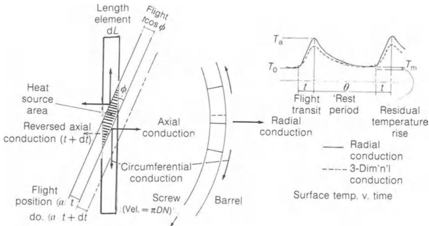  
图C.3 螺棱间隙引起的料筒局部热流。

螺棱间隙内的表面传热系数可按螺槽C中所用的方法估算：

螺棱间隙

$$
\delta = 0. 0 0 0 1 5 \mathrm{m}
$$

则等效狭缝

$$
H = 0. 0 0 0 3 \mathrm{m}
$$

且等效直径

$$
D _ {\mathrm{e}} = 0. 0 0 0 6 \mathrm{m}
$$

螺棱剪切速率

$$
\begin{array}{r} \dot {\gamma} = \frac {\pi D N}{\delta} \\ = 2 0 9 4. 4 \mathrm{s} ^ {- 1} \end{array}
$$

抛物线速度分布对应的等效流量Q

$$
\begin{array}{l} = 2 0 9 4. 4 \times \frac {\pi \times 0 . 0 0 0 3 ^ {3}}{6} \\ = 2 9. 6 1 \times 1 0 ^ {- 9} \mathrm{m} ^ {3} \mathrm{s} ^ {- 1} \end{array}
$$

则质量流量

$$
\begin{array}{r l} w & = 2 9. 6 1 \times 1 0 ^ {- 9} \times 7 8 5 \\ & = 2 3. 2 5 \times 1 0 ^ {- 6} \mathrm {kg s^ {- 1}} \end{array}
$$

格雷茨数

$$
\begin{array}{r l} G z & = \frac {w C _ {\mathrm{p}}}{k L} \\ & = \frac {2 3 . 2 5 \times 1 0 ^ {- 6} \times 2 3 0 0}{0 . 5 \times 0 . 0 3 2 9 7} \\ & = 3. 2 4 \end{array}
$$

McAdams (1954, 式(9.25a))给出了此格雷茨数范围内，

努塞尔数 $Nu = \frac{2}{\pi} Gz$ $= 2.06$

于是传热系数为，

$$
\begin{array}{r l} h _ {\mathrm{a}} & = \frac {2 . 0 6 \times 0 . 5}{0 . 0 0 0 6} \\ & = 1 7 1 9 \mathrm{Wm} ^ {- 2} \mathrm{K} ^ {- 1} \end{array}
$$

利用附录C.3的数据，每圈间隙体积

$$
\begin{array}{l} = 0. 3 2 9 7 \times 0. 0 0 9 5 2 9 \times 0. 0 0 0 1 5 \\ = 4 7 1. 2 6 \times 1 0 ^ {- 9} \mathrm{m} ^ {3} / \text {turn} \end{array}
$$

所产生的剪切热将是间隙内平均温度的函数，由于它并非预先确定，故在表C.12中对多种温度进行了计算。假定料筒初始处于均匀温度 $T_{0}$ (等于螺槽中聚合物的温度)，并在转速1 rps下与温度为 $T_{a}$ 的螺棱间隙内聚合物接触一段时间t = 0.1 s。由于热量同时传入料筒， $T_{a}$ 在这段极短的加热时间内被假定恒定。关于一维瞬态导热，参照McAdams (1954, p. 39)，若表面热阻可忽略，则阻力比 m = k/hx = 0。

无量纲数群Z(与傅里叶数 $\alpha t/r_{m}^{2}$ 相关)

$$
\begin{array}{l} = x / 2 \sqrt {\alpha t} \\ = x / 2 \sqrt {1 . 3 \times 1 0 ^ {- 5} \times 0 . 1} \\ = 4 3 8. 5 x \end{array}
$$

式中t为时间，x为表面以下的距离。

未完成温度变化 $Y = (T_{\mathrm{a}} - T)/(T_{\mathrm{a}} - T_{0})$ ，其中T为位置x处、时刻t的温度。Y之值由Y随Z变化的表查得，其他x值则按McAdams (1954, 式(3.3))*求得。

分数温升 $(1 - Y)$ 见表C.13。0.1 s内料筒吸收的热量由McAdams (1954, 式(3.4))给出，其中 $\alpha$ 为热扩散率， $r_{m}$ 为无限大平板的半厚度。于是

$$
\begin{array}{r l} X & = \alpha t / r _ {\mathrm{m}} ^ {2} \\ & = 1. 3 \times 1 0 ^ {- 5} \times 0. 1 / 0. 0 1 ^ {2} \\ & = 0. 0 1 3 ^ {*} \end{array}
$$

由此得McAdams (1954, 式(3.4))右端之值为0.12868。于是

$$
\begin{array}{r l} Q & = 0. 1 2 8 6 8 r _ {\mathrm{m}} A \rho C _ {\mathrm{p}} (T _ {\mathrm{a}} - T _ {0}) ^ {\dagger} \\ & = 0. 1 2 8 6 8 \times 0. 0 1 \times 0. 3 2 9 7 \times 0. 0 0 9 5 2 9 \times 7 8 0 0 \times 5 0 3 (T _ {\mathrm{a}} - T _ {0}) \\ & = 1 5. 8 6 1 (T _ {\mathrm{a}} - T _ {0}) \mathrm{J} / \text {turn} \end{array}
$$

令其与表C.12中温度为 $150 + (T_{\mathrm{a}} - T_{0})$ 时的每圈剪切功相等，

$$
\begin{array}{r l} T _ {\mathrm{a}} - T _ {0} & = 1. 5 4 2 ^ {\circ} \mathrm{C} \\ Q & = 2 4. 4 5 \mathrm{J} / \text {turn} \end{array}
$$

有限的表面传热系数可按McAdams (1954, 式(3.5))处理，该式在m值较大(表面热阻起控制作用)时忽略料筒内的温度梯度。若表面传热系数为 $1719 \, W m^{-2} K^{-1}$ (如上)， $r_{m} = 0.01 \, m$ ，X = 0.013，则：

$$
\begin{array}{r l} m & = \frac {k}{r _ {\mathrm{m}} h} \\ & = \frac {5 0}{0 . 0 1 \times 1 7 1 9} \\ & = 2. 9 0 9 \end{array}
$$

则

$$
\begin{array}{r l} - \ln Y & = \frac {X}{m} \\ & = \frac {0 . 0 1 3}{2 . 9 0 9} \\ & = 0. 0 0 4 4 6 9 \end{array}
$$

(McAdams, 1954, 式(3.5))

表C.12 螺棱间隙内的剪切生热

| 平均温度 (°C) | $\beta(T - T_0)$ | 黏度 (N s m-2) | 剪切能/单位体积 (MW m-3) | 每转剪切功 (J/转) | 绝热温升 (°C) (绝热) |
| --- | --- | --- | --- | --- | --- |
| 1 rps |  |  |  |  |  |
| 140 | -0.102 | 132.38 | 580.85 | 27.375 | 33.23 |
| 150 | 0 | 120.13 | 527.10 | 24.840 | 30.15 |
| 151 | 0.0102 | 118.90 | 521.70 | 24.586 | 29.84 |
| 152 | 0.0204 | 117.68 | 516.35 | 24.334 | 29.54 |
| 154 | 0.0408 | 115.23 | 505.60 | 23.827 | 28.92 |
| 156 | 0.0612 | 112.78 | 494.85 | 23.320 | 28.31 |
| 158 | 0.0816 | 110.33 | 484.10 | 22.814 | 27.69 |
| 160 | 0.102 | 107.88 | 473.35 | 22.307 | 27.08 |
| 170 | 0.204 | 95.62 | 419.56 | 19.772 | 24.00 |
| 180 | 0.306 | 83.37 | 365.81 | 17.239 | 20.93 |
| 190 | 0.408 | 71.12 | 312.06 | 14.706 | 17.85 |
| 200 | 0.510 | 58.86 | 258.26 | 12.171 | 14.77 |
| 2 rps |  |  |  |  |  |
| 140 | -0.102 | 82.35 | 1445.3 | 34.05 | 41.33 |
| 150 | 0 | 74.73 | 1311.6 | 30.90 | 37.51 |
| 160 | 0.102 | 67.11 | 1177.8 | 27.75 | 33.69 |
| 170 | 0.204 | 59.48 | 1044.0 | 24.60 | 29.86 |
| 180 | 0.306 | 51.86 | 910.2 | 21.45 | 26.04 |
| 4 rps |  |  |  |  |  |
| 140 | -0.102 | 51.23 | 3596.6 | 42.37 | 51.43 |
| 150 | 0 | 46.49 | 3263.8 | 38.45 | 46.67 |
| 160 | 0.102 | 41.75 | 2931.0 | 34.53 | 41.92 |
| 170 | 0.204 | 37.01 | 2598.0 | 30.61 | 37.16 |
| 180 | 0.306 | 32.26 | 2265.1 | 26.69 | 32.40 |

且

$$
Y = 0. 9 9 5 5
$$

则

$$
\begin{array}{r l} (T - T _ {0}) & = (1 - Y) (T _ {\mathrm{a}} - T _ {0}) \\ & = 0. 0 0 4 5 (T _ {\mathrm{a}} - T _ {0}) \end{array}
$$

表C.13 螺棱通过时料筒内的径向温度分布

| 内表面下深度, x(mm) | 无量纲深度 $Z = x/2\sqrt{(\alpha t)}$ | 未完成温度变化 $Y = \frac{T_a - T}{T_a - T_0}$ | 分数温升 $\frac{T - T_0}{T_a - T_0}$ |
| --- | --- | --- | --- |
| 1 rps |  |  |  |
| 0 | 0 | 0 | 1.0 |
| 0.456 | 0.2 | 0.2227 | 0.7773 |
| 0.912 | 0.4 | 0.4284 | 0.5716 |
| 1.368 | 0.6 | 0.6039 | 0.3961 |
| 1.824 | 0.8 | 0.7421 | 0.2579 |
| 2.280 | 1.0 | 0.8427 | 0.1573 |
| 2.736 | 1.2 | 0.9103 | 0.0897 |
| 3.192 | 1.4 | 0.9523 | 0.0477 |
| 3.648 | 1.6 | 0.9763 | $0.0237^a$ |
| 4.104 | 1.8 | 0.9891 | $0.0109^a$ |
| 4.561 | 2.0 | 0.9953 | 0.0047 |
| 5.016 | 2.2 | 0.9981 | $0.0019^a$ |
| 5.472 | 2.4 | 0.9993 | $0.0007^a$ |
| 5.928 | 2.6 | 0.9998 | $0.0002^a$ |
| 6.384 | 2.8 | 0.9999 | $0.0001^a$ |
| 6.840 | 3.0 | 1.0 | $0^a$ |
| 2 rps |  |  |  |
| 0 | 0 | 0 | 1.0 |
| 1.14 |  |  | $0.3173^a$ |
| 2.28 |  |  | $0.0456^a$ |
| 3.42 |  |  | $0.0026^a$ |
| 4.56 |  |  | $0.0001^a$ |
| 5.70 |  |  | $0^a$ |
| 4 rps |  |  |  |
| 0 | 0 | 0 | 1.0 |
| 1.14 |  |  | $0.1552^a$ |
| 2.28 |  |  | $0.0044^a$ |
| 3.42 |  |  | $0.0001^a$ |
| 4.56 |  |  | $0^a$ |

$^{a}$ 由式(3.3)计算得出。

以及所传递的热量

$$
\begin{array}{r l} & = A \rho C _ {\mathrm{p}} r _ {\mathrm{m}} (T - T _ {0}) \\ & = 0. 3 2 9 7 \times 0. 0 0 9 5 2 9 \times 7 8 0 0 \times 5 0 3 \times 0. 0 1 \times 0. 0 0 4 5 (T _ {\mathrm{a}} - T _ {0}) \\ & = 0. 5 5 4 7 (T _ {\mathrm{a}} - T _ {0}) \end{array}
$$

此时间隙内聚合物的温升更大，因而其显热的增加变得显著(在表面热阻可忽略时约为剪切功的5%)。显热的增量，

$$
\begin{array}{c} \rho V C _ {\mathrm{p}} (T _ {\mathrm{a}} - T _ {0}) = 7 6 0 \times 4 7 1. 2 6 \times 1 0 ^ {- 9} \times 2 3 0 0 (T _ {\mathrm{a}} - T _ {0}) \\ = 0. 8 2 3 8 (T _ {\mathrm{a}} - T _ {0}) \end{array}
$$

于是剪切功，

$$
\begin{array}{r l} 2 4. 4 5 \mathrm{J} / \text {turn} & = (0. 5 5 4 7 + 0. 8 2 3 8) (T _ {\mathrm{a}} - T _ {0}) \text {at} 1 5 1. 5 4 ^ {\circ} \mathrm{C} \\ & = 1. 3 7 8 5 (T _ {\mathrm{a}} - T _ {0}) \end{array}
$$

与表C.12比较可得：

$$
\begin{array}{r l} (T _ {\mathrm{a}} - T _ {0}) & = 1 5. 2 ^ {\circ} \mathrm{C} \\ T _ {\mathrm{a}} & = 1 6 5. 2 ^ {\circ} \mathrm{C} \\ \text { shear   work } & = 1. 3 7 8 5 (T _ {\mathrm{a}} - T _ {0}) \\ & = 2 0. 9 8 \mathrm{J} / \text { turn } \\ \text { heat   transferred } & = 0. 5 5 4 7 (T _ {\mathrm{a}} - T _ {0}) \\ & = 8. 4 3 \mathrm{J} / \text { turn } \end{array}
$$

其余部分用于增加聚合物的显热。

对于所假设的0.01 m热量渗入料筒深度，金属温度的(均匀)升高为

$$
\begin{array}{r l} T - T _ {0} & = 0. 0 0 4 5 (T _ {\mathrm{a}} - T _ {0}) \\ & = 0. 0 6 8 ^ {\circ} \mathrm{C} \end{array}
$$

后者强烈依赖于所假定的 $r_{m}$ 值，因为这也是假定热量在其中均匀分布的厚度，例如当 $r_{m} = 0.0036 \, m$ 时， $T_{a}$ 与剪切功几乎不变，分别为 $165.3^{\circ}C$ 和20.97 J每圈，而金属温升 $T - T_{0}$ 变为 $0.189^{\circ}C$ 。这一近似表明，有限的表面传热系数会按比例减少传入料筒的热量，从而也降低表面温度，但聚合物的温度却大幅升高。

在该转动的其余0.9 s内，料筒的这一部分与螺槽中的聚合物接触，对于 $300 W m^{-2} K^{-1}$ 的系数C(p. 441)，可视其为与后者热绝缘，于是料筒中的热量(由图C.4中初始温度分布曲线下的面积表示)将向料筒更深处扩散，同时表面温度下降。由于这种非均匀温度分布无法用标准图表表示，必须借助数值方法，如Dusinberre提出的方法(McAdams, 1954, p. 44)。若无量纲比值，

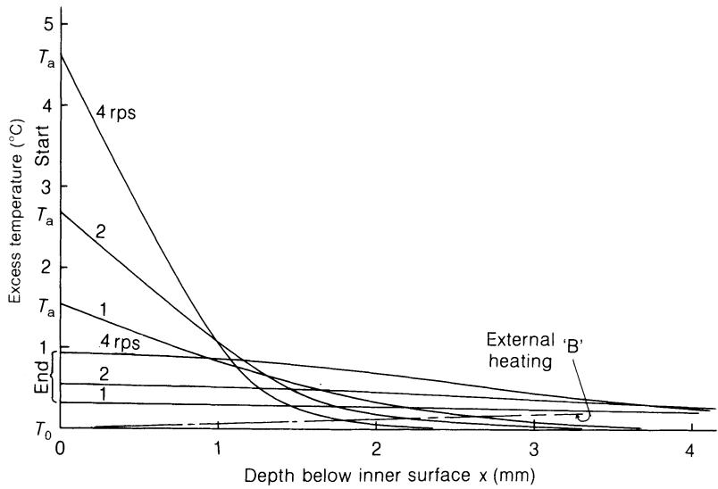  
图C.4 料筒内“静止”期开始与结束时的瞬态径向温度分布。

$$
M = \frac {(\mathrm{d} x) ^ {2}}{\alpha \mathrm{d} t}
$$

该式将厚度为dx的单元与时间间隔dt联系起来，则距表面第n个单元中心处在dt之后的温度 $T_{n}^{\prime}$ 由McAdams (1954, 式(3.6a))给出：

$$
T _ {n} ^ {\prime} = \frac {T _ {n - 1} + (M - 2) T _ {n} + T _ {n + 1}}{M}
$$

表C.14采用表C.13中m = 0的初始温度比进行计算。与聚合物热绝缘的条件要求表面处温度梯度为零。在一次粗略计算中，以 $T_{0}^{\prime} = T_{1}$ 近似表达该条件，并取M = 4、dx = 2.28 mm、dt = 0.1 s，得0.9 s后的表面温度为 $0.1473(T_{\mathrm{a}} - T_{0})$ ，但其最终热含量不足初始值的一半。热含量近似由下式给出：

$$
\begin{array}{r} Q = \int C _ {\mathrm{p}} \rho A \mathrm{d} x \mathrm{d} T \\ = C _ {\mathrm{p}} \rho A \mathrm{d} x \Sigma \mathrm{d} T \end{array}
$$

其中单元厚度dx为常数。

| 1 rps |  |  |  |  |  |  |  |  |  |  |  |  |
| --- | --- | --- | --- | --- | --- | --- | --- | --- | --- | --- | --- | --- |
| 深度 x (mm) | 0 | 2.28 | 4.56 | 6.84 | 9.12 | 11.40 | 13.68 | 15.96 | 18.24 | 20.52 |  |  |
| 时间 (s) |  |  |  |  |  |  |  |  |  |  |  |  |
| 0 | 0.8119 | 0.1573 | 0.0047 | 0 |  |  |  |  |  |  |  |  |
| 0.1 | 0.4846 | 0.2828 | 0.0417 | 0.0012 | 0 |  |  |  |  |  |  |  |
| 0.2 | 0.3838 | 0.2730 | 0.0918 | 0.0110 | 0.0003 | 0 |  |  |  |  |  |  |
| 0.5 | 0.2658 | 0.2248 | 0.1355 | 0.0566 | 0.0155 | 0.0025 | 0.0002 | 0 |  |  |  |  |
| 0.9 | 0.2050 | 0.1851 | 0.1370 | 0.0825 | 0.0400 | 0.0153 | 0.0045 | 0.0010 | 0.0001 | 0 |  |  |
| 最终温度 = 0.205 × 1.542 = 0.316°Ca. |  |  |  |  |  |  |  |  |  |  |  |  |
| 2 rps |  |  |  |  |  |  |  |  |  |  |  |  |
| 深度 x (mm) | 0 | 1.14 | 2.28 | 3.42 | 4.56 | 5.70 | 6.84 | 7.98 | 9.12 | 11.40 | 12.54 | 13.68 |
| 时间 (s) |  |  |  |  |  |  |  |  |  |  |  |  |
| 0 | 0.8646 | 0.3173 | 0.0456 | 0.0026 | 0.0001 | 0 |  |  |  |  |  |  |
| 0.05 | 0.4888 | 0.3665 | 0.1511 | 0.0322 | 0.0035 | 0.0002 | 0 |  |  |  |  |  |
| 0.10 | 0.3858 | 0.3224 | 0.1871 | 0.0736 | 0.0188 | 0.0029 | 0.0002 | 0 |  |  |  |  |
| 0.25 | 0.2660 | 0.2440 | 0.1884 | 0.1222 | 0.0661 | 0.0296 | 0.0108 | 0.0031 | 0.0006 | 0.0001 | 0 |  |
| 0.45 | 0.2046 | 0.1942 | 0.1665 | 0.1290 | 0.0901 | 0.0566 | 0.0319 | 0.0161 | 0.0072 | 0.0028 | 0.0009 | 0.0003 |
| 最终温度 = 0.2046 × 2.68 = 0.5483°C |  |  |  |  |  |  |  |  |  |  |  |  |
| 4 rps |  |  |  |  |  |  |  |  |  |  |  |  |
| 深度 x (mm) | 0 | 1.14 | 2.28 | 3.42 | 4.56 | 5.70 | 6.84 | 7.98 | 9.12 | 11.40 | 12.54 | 13.68 |
| 时间 (s) |  |  |  |  |  |  |  |  |  |  |  |  |
| 0 | 0.8116 | 0.1552 | 0.0044 | 0.0001 | 0 |  |  |  |  |  |  |  |
| 0.025 | 0.4836 | 0.2816 | 0.0410 | 0.0011 | 0 |  |  |  |  |  |  |  |
| 0.050 | 0.3826 | 0.2719 | 0.0912 | 0.0108 | 0.0003 | 0 |  |  |  |  |  |  |
| 0.125 | 0.2644 | 0.2240 | 0.1349 | 0.0563 | 0.0154 | 0.0025 | 0.0002 | 0 |  |  |  |  |
| 0.225 | 0.2040 | 0.1843 | 0.1364 | 0.0821 | 0.0398 | 0.0153 | 0.0045 | 0.0010 | 0.0001 | 0 |  |  |
| 最终温度 = 0.2040 × 4.61 = 0.9404°C |  |  |  |  |  |  |  |  |  |  |  |  |

表C.14 料筒内“静止”期间的温度分布

表面处半厚度单元的热含量按 $\frac{1}{2}C_{p}\rho A\,\mathrm{d}x(T-T_{0})$ 计，故总量等于 $C_{p}\rho A\,\mathrm{d}x(T-T_{0})$ 乘以分数温升之和(表C.13最后一列)，并将第一个单元按0.5计。由该初始温度分布算得热含量为：

$$
\begin{array}{l} = 5 0 3 \times 7 8 0 0 \times 0. 3 2 9 7 \times 0. 0 0 9 5 2 9 \times 0. 0 0 0 4 5 6 \times 2. 8 3 9 8 \times 1. 5 4 2 \\ = 2 4. 6 1 \mathrm{J} / \text {turn} ^ {*} \end{array}
$$

单元厚度为0.456 mm，与按McAdams (1954, 式(3.4))算得的每圈24.45 J相比较。为保持这一恒定热含量，需在估算出其余各温度之后逐步调整表面温度。为限制步数，表C.14中将单元厚度加大至2.28 mm(1 rps)或1.14 mm(2和4 rps)。于是在1 rps下：

$$
\begin{array}{r l} \frac {\Sigma \mathrm{d} T}{1 . 5 4 2} & = \frac {2 . 8 3 9 8}{5} \\ & = 0. 5 6 8 0 \end{array}
$$

2和4 rps的对应值分别为0.79795和0.56547。在每种情形下，0.9 s、0.45 s或0.225 s后算得的温度比都介于0.204与0.205之间，乘以剪切结束时的初始温度，即得表8.2中“静止”期末的残余温度。螺杆转速提高时，剪切时间与“静止”时间均缩短，但二者之比保持不变。剪切速率和剪切功的增加使剪切结束时和“静止”结束时的表面温度提高，在本例中大致按转速的0.8次方增长。在热扩散率恒定的情况下，随着螺杆转速的提高和剪切时间的缩短，热量渗入的深度变浅。“静止”期的缩短还使热扩散更加局限于料筒内表面附近。
