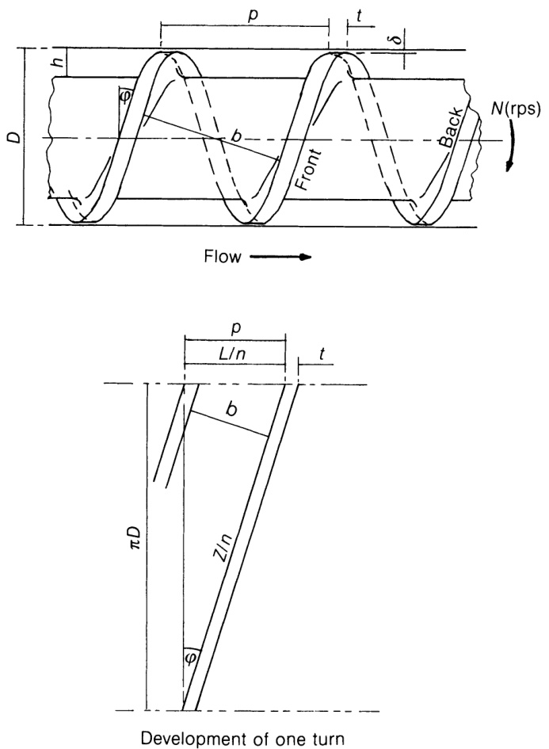
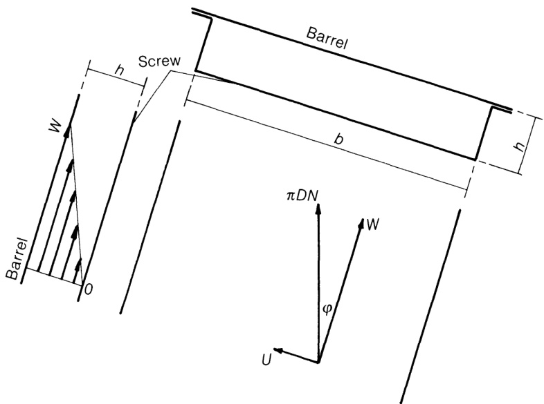
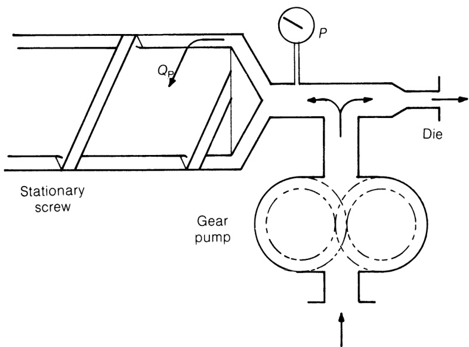
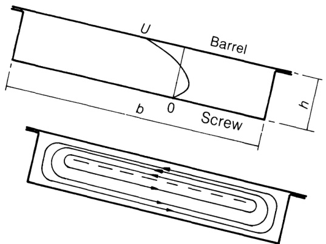
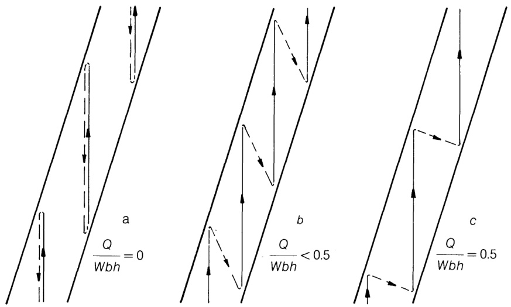

# 6.2 流体方程推导  

## 6.2.1 引言  

图6.1展示了采用本章术语标注的简单螺杆几何结构。需注意：螺距 $\pmb{p}$ 与螺距宽度 $t$ 沿轴向测量，而通道宽度 $^b$ 则垂直于螺旋轴线测量。（Weeks 和 Allen (1962) 将 $t$ 用于表示螺旋翼宽度，即车间测量值，导致式(6.2)与式(6.11)存在细微差异。） 螺旋角$\phi$为真实角度，但为便于展示，侧视图中常将螺纹简化为直线。除非另有说明，所有示意图均采用左旋螺旋结构，且读者最近侧面沿页面下移方向排列，形成由左向右的流向。显然右旋螺纹需反向旋转以产生相同流向，但相关方程同样适用。转速以每秒转数(rps)表示，输出值为$\mathbf{m}^{3}\,\mathbf{s}^{-1}$或${\bf k g}\,{\bf s}^{-1}$以保持量纲一致；理论性较强的文献可能采用每秒弧度表示转速，此时数值需乘以$2\pi$因子。输出量$Q$（式(6.15)）的各分量以体积形式推导，需乘以螺杆熔体段平均温度和压力下的密度方可得出理论质量输出量（见下文假设8）。通道内的直角坐标系如图6.2所示；长度坐标$x$、$y$和$\boldsymbol{z}$分别指向通道宽度（法向）、通道深度（径向）和通道长度（螺旋）方向。其极限值分别为$b$、$h$和$Z$，通过展开可得：  
$$
{Z=L/\sin{\phi}}\tag{6.1}
$$

$$
{b=(p-t)\cos{\phi}}\tag{6.2}
$$

$$
{p=\pi D\tan{\phi}}\tag{6.3}
$$

对于具有 $\pmb{n_{\mathrm{s}}}$ 圈数的螺杆，其对应轴向长度为 $L$。对应的速度分量为 $\pmb{u}$、$\pmb{v}$ 和 $\pmb{w}$，其极限值分别为：在筒体表面 $(y=h)$ 处的 $U$、在通道边缘 $(x=b)$ 处的 $V$ 以及在筒体表面 $(y=h)$ 处的 $W$。 

注：普遍认为螺杆的几何截面分别对应固体输送、熔化及熔体泵送功能的观点未必成立（参见第6.4节及第7章），本书提及的“熔化区”特指该机制占主导作用的区域，而非单纯指锥形段本身。  

## 6.2.2 假设条件  

简化流动分析的假设如下：  

1. 稳态运行。第11.2节将探讨不稳定性问题。 

  
Figure 6.1 Screw dimensions.  

  
Figure 6.2 Co-ordinate system for screw channel.  

1. 聚合物为均质流体，即仅涉及“熔体泵送”部分。  
2. 聚合物附着于料筒和螺杆根部表面，但不附着于料道前后壁（通道侧壁）。  
3. 忽略曲率效应，即螺旋通道近似为相同尺寸的直通道。  
4. 通道深度远小于筒体内部直径。  
5. 零泄漏流。详见第6.3节讨论。  
6. 熔体呈牛顿流体特性，即粘度随温度变化，与剪切速率或时间无关。  
7. 流动过程为等温过程。  
8. 忽略重力作用。  
9.  螺杆初始深度视为恒定。在微分形式下，流动方程(6.15)可应用于螺杆变深段的单元长度。 

Fenner（1970）曾发表过一项卓越的研究，深入探讨了上述若干假设产生的差异。研究表明，尽管这些假设对精确设计至关重要，但在多数常规情况下可通过修正系数进行近似处理，因此操作条件变化对趋势产生的影响可忽略不计。本书主要关注实际操作中的趋势变化，因此即使采用高度简化的数学处理方法，仍可得出有价值的结论。不过，必要时将重新审视这些假设的有效性（例如第6.6节、8.3节和9.2节）。  

作者对威克斯和艾伦（1962）在以下分析及第8章功耗计算方面的贡献深表谢忱；但由此推导出的结论均由作者本人全权负责。 

## 6.2.3 阻力流  

假设3、4、5和6意味着直道中的流动可进一步近似为两块平行平板以角度$\phi$相对运动时的流动（图6.3）； 为便于分析，将下板（螺杆）视为静止，因此速度相对于螺杆而非筒体——就构成总流量的轴向分量而言，此设定显然无关紧要。由于粘度恒定（假设7和8），流场叠加定理成立，故首先在无压力梯度条件下考虑板间相对运动产生的流场。筒体相对于螺杆的速度等于其周长$\pi D$乘以转速$N$；筒体速度为$\pi D N$，并与螺杆通道成角度$\phi$。由于假设聚合物附着于筒体和螺杆表面（假设3），其在各边界处的速度将与相邻固体表面速度相同，即筒体处为$\pi D N$，螺杆处为0。将筒体速度沿螺杆通道方向与横向分解：  

$$
W=\pi D N\cos\phi\tag{6.4}
$$  

$$
U=\pi D N\sin\phi\tag{6.5}
$$  

$W$和$U$的定义如图6.2所示。 

显然，仅沿流道方向的分量$W$能导致挤出机产生净流出，尽管$U$对形成横向环流至关重要（方程(6.26)）。这是等温简单剪切的情况，根据方程

  
Figure 6.3 Velocities in drag flow.  

(3.11) 剪切速率 $\dot{\gamma}$ 将保持恒定，即  

$$
\dot{\gamma}=\frac{w}{y}=\frac{W}{h}\tag{6.6}
$$  

如图6.3所示的速度分布。在厚度为dy、宽度为$\pmb{b}$的层中，沿流道方向的流量${\tt d}Q_{\tt D}$为：  

$$
\mathrm{d}Q_{\mathbf{D}}=w\boldsymbol{b}\cdot\mathbf{d}\boldsymbol{y}\tag{6.7}
$$  

以及总流量:

$$
Q_{\mathrm{D}}=\int_{0}^{h}w b\,\mathrm{d}y=\int_{0}^{h}b\,{\frac{W}{h}}\,y\,\mathrm{d}y=\left[{\frac{W b y^{2}}{2h}}\right]_{0}^{h}\tag{6.8}
$$  

由于$b$为常数，$\textstyle\int_{0}^{h}w\,\mathbf{d}y$即为速度与深度关系图下方面积$W h/2$，且：  

$$
Q_{\mathbf{D}}={\frac{W}{2}}\,b h\tag{6.9}
$$  

其中 $Q_{\mathbf{D}}$ 是筒体与螺杆相对运动产生的体积流量，称为拖曳流，而 $W/2$ 是平均下行通道流速。代入 $W$ 得：  

$$
Q_{\mathrm{D}}={\frac{\pi}{2}}\,D N b h\cos\phi\tag{6.10}
$$  

并根据式(6.2)代入$^b$：  

$$
Q_{\mathrm{D}}=\frac{\pi}{2}\,D N h(p-t)\cos^{2}\phi^{*}\tag{6.11}
$$  

## 6.2.4 压力流动  

为分离压力效应，将螺杆视为静止状态，从而消除拖曳流动。假设由独立泵在螺杆末端产生压力（图6.4）。在相同温度（及粘度）条件下，通过模头的流体流动与挤出机产生压力时保持一致。然而该压力还将引发逆向流动，即  

\*如6.2.1节所述，Weeks和Allen（1962）将$t$定义为螺旋螺距宽度，此时方程(6.2)变为:

$$
\boldsymbol{b}=p\cos\phi-\boldsymbol{t}
$$  

包括Fisher（1976）在内的若干作者忽略了飞距$t$，使得$b=\pi D\sin\phi$导致方程(6.11)需要修正。 

$$
Q_{D}=\frac{\pi^{2}}{2}D^{2}N h\,\sin\phi\,\cos\phi
$$  

本书主要采用通道宽度$^b$作为流速与功率方程的表达依据，因其更符合性能考量；故上述任一定义均可适用。  

在螺杆的进料段区域，其行为等同于长条状矩形截面模具（$b\gg h$，假设3）。第3章中，对于宽度$T$、深度$H$的“无限”缝式模头，其压力梯度由下列公式给出：   

$$
\frac{\mathbf{d}P}{\mathbf{d}L}\!=\!\frac{12\eta Q}{T H^{3}}\tag{3.34}
$$  

代入螺钉尺寸并令压力流量为$Q=Q_{\mathbf{P}}$：  

$$
\frac{\mathbf{d}P}{\mathbf{d}z}\!=\!\frac{12\eta Q_{\mathrm{P}}}{b h^{3}}\tag{6.12}
$$  
 
或重新排列： 

$$
Q_{\mathtt{P}}={\frac{b h^{3}}{12\eta}}\cdot{\frac{\mathrm{d}P}{\mathrm{d}z}}\tag{6.13}
$$  

需注意，当存在正压梯度（即从进料段到模头压力递增）时，压力流方向相反，即需从阻力流中扣除。如图6.5所示，速度分布呈抛物线形（参见图3.8）。 

如第132页所述，牛顿粘度假设允许流场叠加，即总体积流量$Q_{\mathrm{Tot}}$由下列公式给出：  

$$
Q_{\mathrm{Tot}}=Q_{\mathbf{D}}-Q_{\mathbf{P}}-Q_{\mathbf{L}}\tag{6.14}
$$  

但根据假设6，泄漏流量$Q_{\mathrm{L}}$可忽略不计（第6.3节），因此代入  

  
Figure 6.4 Analogy for pressure (back) flow.  

公式 (6.9) 与 (6.13):  

$$
Q_{\mathrm{Tot}}=Q_{\mathrm{D}}-Q_{\mathrm{P}}={\frac{W b h}{2}}-{\frac{b h^{3}}{12\eta}}\cdot{\frac{\mathrm{d}P}{\mathrm{d}z}}\,\tag{6.15}
$$  

通过附录B.1中基于一维流动纳维-斯托克斯(Navier-Stokes)方程的更严谨数学方法，可得出相同结果。该结果亦可表示为无量纲形式：  

$$
\frac{Q_{\mathrm{Tot}}}{W b h}\!=\!\frac{1}{2}-\frac{h^{2}}{12\eta W}\!\cdot\!\frac{\mathrm{d}P}{\mathrm{d}z}\tag{6.16}
$$  

该无量纲输出值（简记为$Q/\pmb{W}b h$）在理论与实践层面均具有重要价值，可用于表征单螺杆挤出机的运行状态，后续章节将持续引用该指标。  

部分学者采用压力流与阻力流之比（负值），其与$Q/\pmb{W}b h$存在如下关联：  

$$
{\frac{Q_{\mathrm{P}}}{Q_{\mathrm{D}}}}\!=\!{\frac{-(Q_{\mathrm{Tot}}-Q_{\mathrm{D}})}{Q_{\mathrm{D}}}}\!=\!1-{\frac{2Q}{W b h}}\tag{6.17}
$$  

and  

$$
\frac{Q}{W b h}\!=\!\frac{1}{2}\left(1-\frac{Q_{\mathrm{P}}}{Q_{\mathrm{D}}}\right)\tag{6.18}
$$  

i.e.  

$$
0<Q/W b h<\textstyle{\frac{1}{2}}\quad\mathrm{as}\quad1>Q_{\mathrm{P}}/Q_{\mathrm{D}}>0
$$  

and  

$$
\begin{array}{r}{\frac{1}{2}<Q/W b h<1\quad\mathrm{as}\quad0>Q_{\mathrm{P}}/Q_{\mathrm{D}}>-1}\end{array}
$$  

参照方程(6.15)，根据连续性原理，$Q_{\mathrm{Tot}}$沿挤出机方向应近似恒定。因此对于通道宽度$b$和深度$\pmb{h}$恒定的螺杆，  

$$
{\frac{\mathbf{d}P}{\mathbf{d}z}}={\mathrm{constant}}={\frac{P}{Z}}\tag{6.19}
$$  

即压力沿恒定深度螺旋线均匀上升，方程(6.15)可改写为：  

$$
Q_{\mathrm{Tot}}=\frac{W b h}{2}-\frac{b h^{3}}{12\eta}\cdot\frac{P}{Z}\tag{6.20}
$$  

其中 ${\cal Z}$ 为熔体泵送段的螺旋长度，$P$ 为该长度段内的压力升幅。需注意此公式不适用于螺距变化的螺杆，而方程(6.15)和(6.16)对该类螺杆的增量长度段仍适用。  

通道内任意点的流速在附录B.1中给出如下：  

$$
w=\frac{W y}{h}+\frac{y^{2}-y h}{2\eta}\cdot\frac{\mathrm{d}P}{\mathrm{d}z}\tag{B.8}
$$  

是阻力流与压力流产生的速度代数和。净流量将与速度分布曲线下面积的代数和成正比。当${\bf d}P/{\bf d}z=0$时，螺杆沿程无压力变化且无压力流（在平行计量段中若前端锥形段产生压力，这种情况完全可能发生）。此时速度分布如图6.3和6.6(d)所示，所有流体均为正向流动，且$Q/W b h=1/2$。若此时引入微小背压，$\mathbf{d}P/\mathbf{d}z$将呈微小正值，导致由$-b h^{3}\,\mathrm{d}P/12\eta\,\mathrm{d}z$表示的微小（虚拟）逆流，从而降低总流量，使得$Q/W b h$小于$1/2$；如图6所示。$\mathrm{d}P/12\eta\,\mathrm{d}z$，从而减少总流量，此时$Q/W b h$小于$1/2$，如图6.6(c)所示。需注意此时速度分布不再呈线性，其在桶形段的斜率 $\mathrm{d}w/\mathrm{d}y_{(y=h)}=\dot{\gamma}_{\mathrm{wall}}$（即桶壁剪切速率）大于对应阻力流情况（参见第168页）。若进一步增加$P$和${\bf d}P/{\bf d}z$，输出流量与$Q/W b h$将持续降低，且在部分通道深度范围内，合流将发生逆转（如图6.6(b)所示），部分抵消筒壁附近正向流动。当压力达到某一值时，正负向流动将达到平衡（图6.6(a)），此时净流量为零且$Q/W b h=0$。这对应于完全闭合的模头，此时压力达到螺杆理论极限值；实际操作中，因“搅拌”产生的剪切热将改变该值，熔融机制也会受到干扰。若螺杆此段压力下降（例如因螺杆前段产生高压），则${\bf d}P/{\bf d}z$为负值，压力流将朝向模头方向流动，此时总流量大于单纯阻力流产生的流量，如图6.6(e)所示，此时$Q/W b h>1/2$。需注意此时筒壁剪切速率已降低。 

  
Figure 6.5 Velocities in pressure flow.  

  
Figure 6.6 Velocity profiles for several outputs and pressure gradients.  

表达式 $Q/W b h$ 表示实际流量与理论可能流量的比值，该理论值假设聚合物以筒体速度 $W$ 作为塞状物移动，并在螺杆上滑动——如同被阻止随螺杆旋转的固体螺母。因此它是一种“体积效率”指标，与拖曳流状态下的$_{1/2}$值相比，可直观反映实际流量相对于拖曳流状态的增减幅度。更重要的是，它能指示螺杆内压力梯度大小：当$(Q/W b h$略小于$1/2_{_\cdot}$)表示梯度小；当$(Q/W b h$趋近于零)表示梯度大；当$(Q/W b h>1/2)$则表示梯度甚至为负。 

实际操作中难以直观判断螺杆内部状况，即便在模头前安装压力表，也无法反映压力是否严重影响螺杆性能。当螺杆尺寸已知时，可在特定工况下测得$Q/W b h$值。只需精确测量螺杆转速（得出$W$）和产量（例如通过称重并除以熔体温度下的密度，即可得出体积产量$Q$）。因此，$Q/W b h$的数值作为车间故障排查的第一步具有重要价值——详见第150页示例。  

## 6.2.5 横向流动  

迄今仅考虑了纵向（下流）速度分量。Mohr、Saxton和Jepson（1957）基于纳维-斯托克斯方程（参见附录B.1）分析了横向流动：  

$$
\eta\,{\frac{\partial^{2}u}{\partial y^{2}}}+\eta\,{\frac{\partial^{2}u}{\partial z^{2}}}-{\frac{\partial P}{\partial x}}=0\tag{B.10}
$$  

且忽略沟槽侧壁处的滞流现象。在尺寸恒定的沟槽中，横向分量为：  

$$
U=\pi D N\sin\phi\tag{6.5}
$$  

与$\boldsymbol{z}$无关，且由于沿通道速度分布（图6.6）同样与$\boldsymbol{z}$无关，因此合理地假设在整个区域内$\partial u/\partial z=0$，进而得出$\partial^{2}u/\partial z^{2}=0$。消去该项并重新排列：  

$$
\eta\,{\frac{\partial^{2}u}{\partial y^{2}}}\!=\!{\frac{\partial P}{\partial x}}\tag{6.21}
$$  

由于粘度$\eta$呈牛顿流体特性且等温，积分得：  

$$
u=\frac{1}{2\eta}\cdot\frac{\partial P}{\partial x}\left(y^{2}\right)+C y+D\tag{6.22}
$$  

But ${\pmb u}={\bf0}$ at $y=0$ , and $u=U$ at $y=h$ , therefore ${\cal D}=0$ and  

$$
C=\frac{U}{h}-\frac{1}{2\eta}\cdot\frac{\partial P}{\partial x}\cdot h
$$  

导致：  

$$
u=\frac{U y}{h}+\frac{1}{2\eta}\cdot\frac{\partial P}{\partial x}\left(y^{2}-y h\right)\tag{6.23}
$$  

请注意，该形式与沿通道速度分布相同，即包含两个表面相对运动产生的“阻力项”（与螺杆距离成正比），随后是与压力梯度相关的抛物线项。如图6.7所示示意图所示，该结构与图6.6(a)相似，正负区域面积相等。 

总横向流由下列公式给出：  

$$
\begin{array}{c}{{Q=\displaystyle\int_{0}^{h}u z\,{\mathrm{d}}y=\left[\frac{U}{h}\,\frac{z y^{2}}{2}\!+\!\frac{z}{2\eta}\!\cdot\!\frac{\partial P}{\partial x}\left(\frac{y^{3}}{3}\!-\!\frac{y^{2}h}{2}\right)\right]_{0}^{h}}}\\ {{=\displaystyle\frac{U z h}{2}\!-\!\frac{z h^{3}}{12\eta}\!\cdot\!\frac{\partial P}{\partial x}}}\end{array}\tag{B.13}
$$  

  
Figure 6.7 Transverse velocity profile.  

但由于假设泄漏可忽略不计，横向流量$Q$必须为零。因此：  

$$
\frac{U z h}{2}-\frac{z h^{3}}{12\eta}\cdot\frac{\partial P}{\partial x}=0
$$  

整理:

$$
{\frac{\partial P}{\partial x}}\!=\!{\frac{6\eta U}{h^{2}}}\tag{6.24}
$$  

or:  

$$
\frac{1}{2\eta}\cdot\frac{\partial P}{\partial x}\!=\!\frac{3U}{h^{2}}\tag{6.25}
$$  

将式(6.24)代入式(6.23):  

$$
u=\frac{U y}{h}\left(\frac{3y}{h}-2\right)\tag{6.26}
$$  

在任何点处给出的速度均独立于横向压力梯度。  

实际中，靠近筒壁的流体（图6.7中左侧区域）必须沿螺旋桨叶片前缘（向内）下行，再返回至螺杆附近的区域（图6.7中右侧区域）。该环流通过在相邻叶片后缘（向外）的上升流完成循环。上述分析针对通道中部区域，该处径向分量可忽略，符合假设3（通道宽度远大于深度）。这种横向流动对泄漏、功率和混合的影响将分别在第6.3节、第8.2节和第9.1节中讨论。 

通道内的纵向与横向流速叠加形成复杂流态，或许最恰当的描述是：以通道螺旋线为中心、自身呈倾斜螺旋状的“双螺旋”结构。  

当模具闭合且净流量为零（$Q=0$）时，代入式(6.15)得：  

$$
\frac{\mathbf{d}P}{\mathbf{d}z}\!=\!\frac{6\eta W}{h^{2}}\tag{6.27}
$$  

将此代入方程(B.8)，即可得下游流速：

$$
w={\frac{W y}{h}}\left({\frac{3y}{h}}-2\right)\qquad(Q=0~~\mathrm{only})\tag{6.28}
$$  

该式与方程(6.26)形式相同，其中$U$被$W$所替代。但根据方程(6.4)和(6.5)，它们分别是$\pi D N$ sin $\phi$和$\pi D N\cos\phi$，这些矢量可组合得到：  

$$
\mathrm{total~velocity}=\pi D N\,{\frac{y}{h}}\,\left({\frac{3y}{h}}-2\right)\qquad(Q=0\ \ \mathrm{only})\tag{6.29}
$$  

在与螺钉轴线垂直的平面内，如图6.8(a)所示示意图。 

  
Figure 6.8 Flow patterns in screw channel (only extreme elements shown).  

当模具打开且流体开始流动时，横向循环保持不变，但纵向分布如图6.6(b)-6.6(d)所示发生变化，最终形成如图6.8(b)和6.8(c)所示的结果流场。这些流动模式已由埃克尔与瓦伦蒂诺蒂（1958）及肯纳威（1957）通过实验验证，后者利用含固体示踪粒子的透明模型制作了流动动态影像。伯恩哈特（1959）则通过“旗杆图”更精确地呈现了总速度矢量的变化幅度与方向。对于伪塑性或其他非牛顿流体（其粘度取决于所有方向的总剪切力），纵向与横向流动通过对粘度的影响相互依存，各分量叠加原理不再适用。同理，阻力流与压力流亦不可叠加，但此问题将在第6.7节重新探讨。 