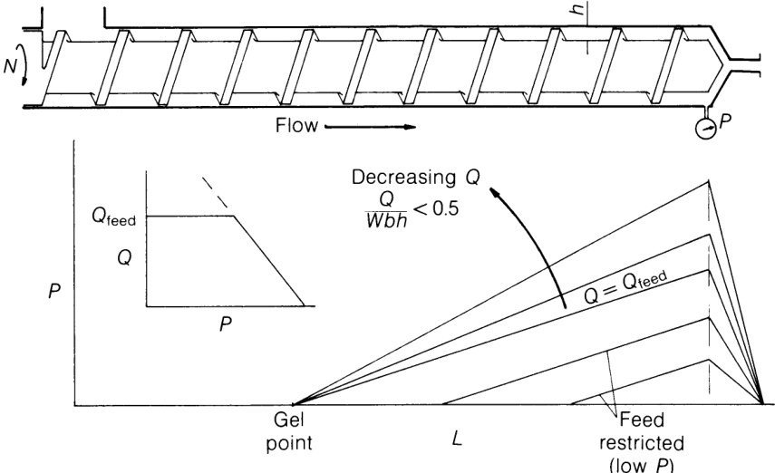
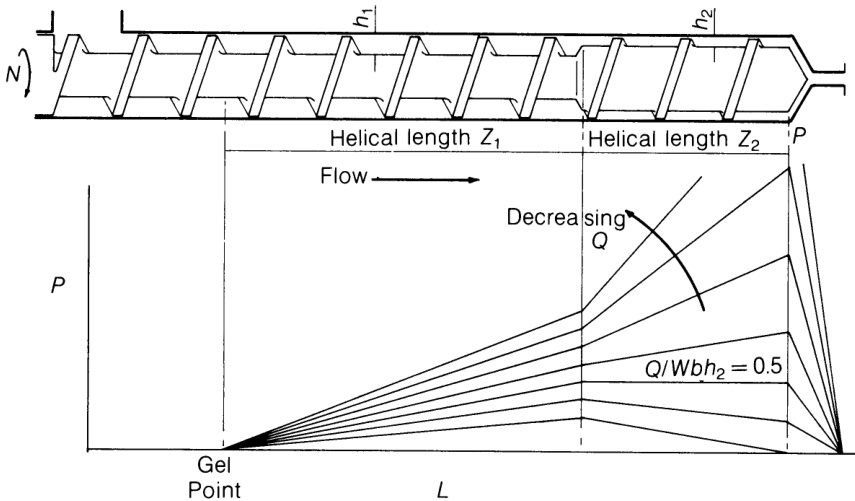
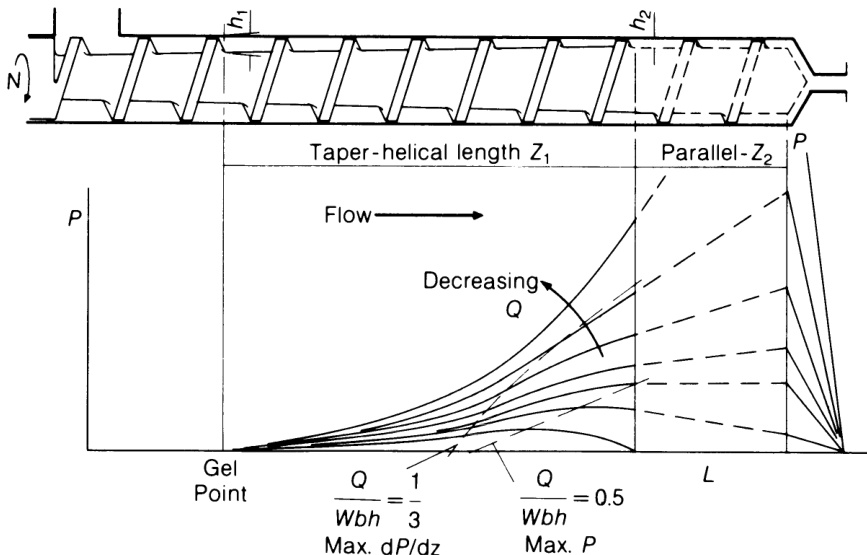

# 6.4 常见螺杆类型的输出方程与纵向压力分布  

## 6.4.1 变量分析  5

首先分析平行（恒定深度）螺杆方程中的变量。体积流量方程(6.15)包含两个项，分别代表拖曳流和压力流。第一项由方程(6.9)或(6.11)给出；基于几何相似性，螺旋角恒定且$p,t$及$^b$（方程(6.2)）均与$\pmb{D}$成正比，故：  

$$
Q_{\mathbf{D}}\propto D^{2}N h\tag{6.30}
$$  
 
即阻力流与转速 $N$、通道深度 $h$ 以及直径 $_{D}$ 的平方成正比。通过提高螺杆转速和/或使用更深的螺杆可增加阻力流。螺杆直径变化的影响将在第 11.5 节中讨论。体积拖曳流量亦与熔融聚合物的流体特性（包括粘度）无关；因此质量拖曳流量将与熔融聚合物密度成正比，且随温度升高因热膨胀导致的衰减幅度极小。 

需注意：无量纲输出$Q/W b h$代表实际输出与（两倍）阻力流量的比值，当$Q/W b h$恒定时，实际输出$Q_{\mathrm{Tot}}$将遵循与阻力流量相同的规律。第二项（代表负压流量）由方程(6.13)给出。在几何相似条件下（$b\propto D$），压力流量与螺杆直径、压力梯度成正比，与通道深度立方成正比，但与熔体粘度成反比。因此输出损失与压力梯度成正比，但随通道深度增加而急剧上升，导致高背压下深螺杆输出相对较低（见图6.16）。粘度的影响在于：当背压升高时，低粘度熔体（如因熔体温度高或固有粘度低导致的尼龙或低分子量聚合物）的输出损失更大。对于假塑性熔体（第6.7节），还需考虑剪切速率的影响（如螺杆转速过高）。 

本节后续将探讨不同螺杆几何结构下的纵向压力梯度，但通过引入无量纲输出指标$Q/W b h$可简化变量间的复杂影响。因此有必要分析$Q/W b h$与方程(6.13)中其他变量之间的关系。如前所述（第136页），正向压力梯度增大时，$Q/W b h$ 值将从 $_{1/2}$ 趋近于零；而负向压力梯度则对应 $Q/W b h>1/2$ 的情况。方程(6.16)表明：在其他因素恒定时，$Q/W b h$的恒定值对应恒定的压力梯度。但将$W$代入方程(6.4)可得:

$$
\frac{Q_{\mathrm{Tot}}}{W b h}\!=\!\frac{1}{2}\!-\!\,\frac{h^{2}}{12\eta\pi D N\cos\phi}\!\cdot\!\frac{\mathrm{d}P}{\mathrm{d}z}\tag{6.31}
$$  

或对于常数 $Q/W b h$

$$
\frac{\mathsf{d}P}{\mathsf{d}z}\propto\frac{\eta D N\cos\phi}{h^{2}}\tag{6.32}
$$  

因此，当$Q/W b h$和螺旋角$\phi$恒定时，压差变化率$\mathbf{d}P/\mathbf{d}z$将随粘度$\pmb{\eta}_{\mathrm{:}}$、螺杆直径$D$和转速$N$呈线性增加，但随通道深度$h_{\ast}$的平方呈反比下降。换言之，当$Q/W b h$保持恒定时，高粘度聚合物配合大直径或高速螺杆会导致压力梯度增大，而深螺杆则会显著降低压力梯度。因此温度升高导致粘度降低时，压力梯度随之减小；反之，式(6.16)中剪切速率$\mathbf{\nabla}W/h$增大则会使压力梯度增大。反之，在压力梯度恒定条件下，仅能通过调整方程(6.32)右侧因子来维持$Q/W b h$恒定。例如，若需比较同一螺杆在相同压力梯度下的性能，当粘度降低（因温度升高）时，可通过同步提升螺杆转速来补偿，从而在$Q/W b h$恒定状态下实现性能对比。熔体输送段的此类及其他运行特性将在第6.5节和第9章中讨论。前述分析基于压力梯度；螺杆末端压力的相关关系将在第6.5.1节阐述。  

## 6.4.2 恒定深度螺杆  

现推导恒定深度螺杆的纵向压力分布。通常情况下，螺杆全长范围内质量流量必须恒定。仅在添加剂注入、提取及某些多螺杆结构中存在例外。因此除因压力、温度或化学反应导致的密度变化外，熔体输送段的容积流量亦保持恒定。式(6.15)表明：对于恒速$N$、尺寸$D$和$^b$的螺杆中处于等温状态的牛顿流体，通道深度$h$与压力梯度${\bf d}P/{\bf d}z$存在唯一对应关系。因此在平行螺杆中（恒定${\bf h}$），熔体输送段全长范围内${\bf d}P/{\bf d}z$恒定且等于$P/Z$（式(6.19)），其中$P$为总压升，$Z$为熔体输送段的螺旋长度； $Z=L/\sin\phi$（式(6.1)），其中$L$为轴向长度。此时适用式(6.20)，可重排为：  

$$
P=\frac{12\eta W Z}{h^{2}}\left(\frac{1}{2}-\frac{Q}{W b h}\right)\tag{6.33}
$$  

or:  

$$
P=K_{1}\left(\frac{1}{2}-\frac{Q}{W b h}\right)\tag{6.34}
$$  

where:  

$$
K_{1}=\frac{12\eta W Z}{h^{2}}\tag{6.35}
$$  
 
因此压力分布呈直线，如图6.9所示的轴向长度关系。图6.9中假设“凝固点”固定——修正方法参见第6.6节。随着模头压力的增加，${\bf d}P/{\bf d}z$ 必须增大，而式(6.15)和(6.16)表明 $Q$ 及 $Q/W b h$ 必须减小。极限情况下，输出量 $Q$ 和 $Q/W b h$ 趋于零，经式子变形后可得： 

  
Figure 6.9 Pressure profiles: parallel screw.  

(6.16) gives:  

$$
\frac{\mathrm{d}P}{\mathrm{d}z}\!=\!\frac{6\eta W}{h^{2}}\tag{6.36}
$$  

or:  

$$
P={\frac{6\eta W L}{h^{2}\sin\phi}}\tag{6.37}
$$  

该值代表该螺杆可提供的最大梯度和压力——但实际限制请参见第136页。若降低压力（例如通过打开模头），则${\bf d}P/{\bf d}z$将减小，输出量$Q$将增加。实际操作中，在模头压力降至零之前，其他因素往往会限制产量。最显著的是料斗和螺杆的固体物料进料与输送能力——该能力基本不受模头压力影响，将限制产量的进一步提升。当模头压力继续降低时，输出保持恒定，此时方程(6.20)只能通过减小$Z$来满足，因此${\bf d}P/{\bf d}z$保持恒定，但压力沿螺杆开始进一步上升，这表明至此螺杆仅部分填充——详见第166页。在低背压条件下，熔融主要依靠传导实现，螺杆输送的聚合物很可能尚未完全熔化。因此，当$Q/W b h=1/2$时，零压力梯度条件在恒定深度固料进料螺杆中难以实现。然而熔体进料螺杆（其有效长度从进料口前端开始，该处压力可开始上升）完全可能实现沿长度方向压力均匀递增或压力零变化的运行。若在加压条件下进料，当$Q/W b h>1/2$时，熔体进料螺杆也可能出现压力均匀下降的情况。复合螺杆中的恒定深度段同样具备上述特性；当$Q/W b h=1/2$时该段压力保持恒定的特性至关重要，尤其对具有平行（恒定深度）“计量段”的复合螺杆而言。实际输出限制将在第6.6节讨论。 

## 6.4.3 双平行螺杆  

双平行螺杆（或称阶梯式螺杆，常被称为“尼龙螺杆”）的优势将在第9.4节中探讨。假设两段螺杆的$D,p,t,\phi,b$等参数相似，则可分别将公式(6.20)应用于各段：  

$$
Q_{1}=\frac{W b h_{1}}{2}-\frac{b h_{1}^{3}}{12\eta}\cdot\frac{P_{1}}{Z_{1}}\tag{6.38}
$$  

and  

$$
Q_{2}=\frac{W b h_{2}}{2}-\frac{b h_{2}^{3}}{12\eta}\cdot\frac{P_{2}}{Z_{2}}\tag{6.39}
$$  

但根据连续性原理

$$
Q_{1}=Q_{2}\tag{6.40}
$$  

and  

$$
P_{1}+P_{2}=P\tag{6.41}
$$  

附录B.3给出了一个替代方程，其中消除了$P_{1}$和$P_{2}$。对于平行螺杆，每个截面内的压力梯度将保持恒定，但两个截面通常存在差异。当模具压力满足$Q/W b h_{2}=1/2$时，$P_{2}$为零且$P_{1}=P$，即总压力在第一段升高。若按常规设定$h_{1}>h_{2}$，则$Q/W b h_{1}<1/2$，表明第一段存在正压力梯度（如图6.10所示）。若此时增加模具压力，输出流量$Q$将减小（见公式(B.31)），此时$Q/W b h_{2}$与$Q/W b h_{1}$均小于$_{1/2}$； 但始终满足 $Q/W b h_{1}<Q/W b h_{2}$ $(Q\neq0)$ 。因此熔体输送段全程压力将上升，且在通道深度变化处压力梯度发生阶跃变化（压力本身无变化）。最终将达到使输出为零的模头压力，此时$Q/W b h_{2}$与$Q/W b h_{1}$亦归零，此即螺杆可达成的最大压力值。需注意：在常规深度比 $h_{1}/h_{2}$ 下，$Q/W b h_{1}$ 远小于 $Q/W b h_{2}$； 然而方程(B.31)和(B.33)中的立方项占主导地位，除当$Q/W b h_{2}$值略小于$1/2$时，${\bf d}P_{2}/\mathrm{d}z_{2}$通常大于${\bf d}P_{1}/{\bf d}z_{1}$。压力梯度的相对大小在附录B.4中进一步分析，例如当$h_{1}/h_{2}=3$时，${\bf d}P_{2}/ {\bf d}z_{2}>$ $\mathbf{d}P_{1}/\mathbf{d}z_{1}$ 。当 $Q/W b h_{1}\simeq0.15$ 且 $Q/W b h_{2}<0.46$ 时，此关系成立。在此条件下，${\bf d}P_{1}/ {\bf d}z_{1}$仅比$Q/W b h_{2}=0.5$ 时高出4\%。这意味着除非第二段$L_{2}$极短，螺杆大部分增压过程发生在第二段； 然而当$Q/W b h_{2}>1/2$时情况不同。当模头压力降至低于$Q/W b h_{2}=1/2$对应值时，输出量增加导致$Q/W b h_{2}>1/2$ 且${\bf d}P_{2}/ {\bf d}z_{2}$为负值，即第二段压力下降。但此时$Q/W b h_{1}$仍小于$_{1/2}$，第一段压力上升。当螺杆末端压力为零时（即第一段压力上升与第二段压力下降完全抵消），可获得最大输出。此时熔融段存在前向流动阻力，且输出在一定程度上受熔体泵送段限制，因此可通过机械剪切实现熔化。因此阶梯式螺杆可在低压或零模压条件下稳定运行，尤其适用于高压缩比（大$h_{1}/h_{2}$）或长行程比（大$L_{2}/L_{1}$）工况。这种特性在模压阻力微弱或缺失的场合具有实用价值，例如厚壁管材挤压、型材挤压及流模成型工艺。实际上，第二螺杆段会形成相当于模具的阻力，熔体被以高于其自然泵送速率（当$Q/W b h_{2}=1/2$时）的速率强制通过该段。若进一步提升产量，将导致负模头压力——此时第一段的压力升幅不足以克服第二段的“阻力”，显然$Q/W b h_{1}$无法达到0.5的临界值。已有设计提出将第二段深度大于第一段的螺杆（$h_{1}/h_{2}<1$）；此时压力分布发生对调：高模头压力下，第一段压力快速上升而第二段上升缓慢；低模头压力下，第一段压力可能恒定为零甚至负值，而第二段压力上升至零或正值。 

 

Figure 6.10 Pressure profiles: stepped screw.  

## 6.4.4 渐变螺杆与渐变-平行螺杆  

具有渐变锥度（$h$值连续减小）的螺杆也具有类似特征，其后段可带或不带无台阶过渡的平行段。此时假设螺道深度从升压起点处$h_{1}$开始，沿螺旋长度$Z_{1}$均匀减小至模头处或平行段起点处的$h_{2}$，该平行段具有深度$h_{2}$和螺旋长度$Z_{2}$。需注意：若实际螺杆中压力上升起始点发生变化，则$Z_{1}$和$h_{1}$也将随之改变，但锥角$\theta$保持恒定。方程(6.15)可应用于第一段（锥形段）任意长度为$\mathtt{d}z$的小单元，经变形后可表示为: 

$$
\frac{\mathrm{d}P}{\mathrm{d}z}\!=\!\frac{12\eta W}{h^{2}}\left(\frac{1}{2}\!-\!\frac{Q}{W b h}\right)\tag{6.42}
$$  

在$h=h_{1}$（$z=0$处）与$h=h_{2}$（$z=Z_{1}$处）之间进行积分，需注意$Q$为常量，且对于恒定螺距螺杆，$W$和$^b$亦为常量。附录B.3中的详细推导表明，第一段压力升高$P_{1}$由下列公式给出：

$$
P_{1}=\frac{6\eta W Z_{1}}{h_{1}h_{2}}\left(1-\frac{Q}{W b h_{2}}\cdot\frac{h_{1}+h_{2}}{h_{1}}\right)\tag{6.43}
$$  

方程(6.20)可重新排列并应用于并联段（如有）：

$$
P_{2}=\frac{6\eta W Z_{2}}{h_{2}^{2}}\left(1-\frac{2Q}{W b h_{2}}\right)\tag{6.44}
$$  

结合式(6.43)，需注意$Q_{1}=Q_{2}$且$P=P_{1}+P_{2}$  

$$
P=\frac{6\eta W Z_{1}}{h_{1}h_{2}}\left(1-\frac{Q}{W b h_{2}}\cdot\frac{h_{1}+h_{2}}{h_{1}}\right)+\frac{6\eta W Z_{2}}{h_{2}^{2}}\left(1-\frac{2Q}{W b h_{2}}\right)\tag{6.45}
$$  

若 $Q/W b h_{2}=1/2$ ，则方程(6.45)中的第二项为零（平行段内无压力升高），且由于 $h_{2}/h_{1}<1$ ，方程(6.43)与(6.45)均得出 $P_{1}$ 为正值。由于 $h_{1}>h>h_{2}$，方程(6.42)的微分形式表明：在第一段所有点处 ${\bf d}P/{\bf d}z$ 均为正值，但当 $h\rightarrow h_{2}$ 时趋近于零。为完整描述压力分布，需考察压力梯度的变化趋势。对式(6.42)求导得：  

$$
\frac{\mathrm{d}^{2}P}{\mathrm{d}z^{2}}=-\left(\frac{-12\eta W}{h^{3}}+\frac{36\eta Q}{b h^{4}}\right)\left(\frac{h_{1}-h_{2}}{Z_{1}}\right)\tag{6.46}
$$  

当 $\mathsf{d}^{2}P/\mathsf{d}z^{2}=0$ 时，发生一个拐点，即： 

$$
\frac{Q}{W b h}\!=\!\frac{1}{3}\tag{6.47}
$$  

因此，当 $Q/W b h_{2}=1/2$ 时，压力分布如图 6.11 所示。但需注意，拐点的位置与 $Q/W b h_{2}$ 的具体数值无关，只要后者大于 $1/3$ 就会出现拐点。随着模头压力增大，螺杆全长各点的压力梯度${\bf d}P/{\bf d}z$均呈上升趋势，同时输出流量$Q$随之降低，导致各点$Q/W b h$值相应下降。在高模头压力下，当$Q/W b h_{2}$值小于$1/3$时，压力梯度沿锥形段持续增大，因此压力升高的主要贡献来自螺杆后段较平缓的部分。由于锥形段末端$h$无阶跃变化，$Q/W b h$与${\bf d}P/{\bf d}z$保持恒定，因此在所有模压条件下，平行段（若存在）的压力分布曲线均为该点处与锥形段曲线相切的直线。若平行段长度显著，则在高模头压力下该段将贡献主要压力升幅。此时输出/压力关系将类似于深度相同且长度略大于平行“计量段”的简单平行螺杆，即方程(6.45)中的第一项可忽略，而第二项中的$Z_{2}$将略有增加。若模压较低导致$Q/W b h_{2}$大于$_{1/2}$，则压力将在锥形段末端及（若存在）平行段内下降。因此最大压力将出现在锥形段内某点，此时满足$Q/W b h=1/2$。该点与拐点位置$(Q/W b h=1/3)$将随模压降低、产量增加而向进料端移动；锥形段前段承受的压力比例增大，在给定模压下对产量的决定作用更为显著。与阶梯式螺杆类似，最大输出量出现在零模具压力状态下。由于螺杆内部产生正压力，此类结构同样能在低压或零压模具条件下稳定运行。 

  
Figure 6.11 Pressure profiles: taper and taper-parallel screw.  

一个工业实例说明了螺杆内部可能产生的压力高于模头，并揭示了$Q/W b h$比值在理解螺杆内部工况中的重要性。一台直径为 $200\,\mathrm{mm}\,(8\,\mathrm{in})$ 的实料挤出机采用锥平行螺杆，螺距与直径均为 $(\phi=17^{\circ}36^{\prime})$，总长度为 24 倍直径，计量段深度为 $5.59\,\mathrm{mm}\,(0.22\,\mathrm{in})$ 的计量段深度。在60转/分钟转速下，该设备对线性低密度聚乙烯的产量为1091千克/小时 (2400磅/小时)的LD聚乙烯，模头压力仅为13.8兆牛顿/平方米(2000磅/平方英寸)。由于熔体温度过高，造粒过程中出现故障，驱动电机容易过载。熔体密度约为$760\,\mathbf{kg}\,\mathbf{m}^{-3}$ $(47.41\mathfrak{b}/\mathfrak{f t}^{3})$ ，计算得$Q/W b h_{2}$值为0.672，表明压力在平行计量段下降； 该值仅需螺杆尺寸、转速及输出功率即可推算——详见第137页。当在计量段中点安装压力表时，读数为$55.2\,\mathrm{MNm}^{-2}$ $(80001\mathsf{b}/\mathsf{i n}^{2})$，表明计量段起始处压力为 $96.6\,\mathbf{MNm}^{-2}$ $(14\;000\,16/\mathrm{in}^{2})$。如图6.11所示，实际峰值压力将更高。当务之急是降低转速以减少剪切热和压力（参见式(6.44)及模头方程），同时提高料筒温度以降低功率输入和压力（分别通过降低粘度实现，参见式(8.9)和式(6.44)）。虽然产量随之降低，但判断认为与其高速生产废品，不如低速持续生产合格产品，直至获得不同螺杆形状的螺杆！ 

部分学者（如Bernhardt, 1959）将$Q/W b h=$ $1/3$视为某种最优设计。图6.11表明，对于锥形螺杆，该值既不代表最大产量也不代表最大压力，仅表示压力曲线中拐点的坐标位置及压力梯度的最大值。对于恒定深度螺旋，将方程(6.20)改写为方程(6.33)的形式，在将$Z$和$Q$视为常量的前提下对$P$关于$\pmb{h}$求导，可得：  

$$
\frac{{\mathrm{d}}P}{{\mathrm{d}}h}\,{=}\,\frac{-12\eta W Z}{h^{3}}\,{+}\,\frac{36\eta Z Q}{b h^{4}}\tag{6.48}
$$  

and:  

$$
\frac{\mathrm{d}^{2}P}{\mathrm{d}h^{2}}\,{=}\,\frac{\,+36\eta W Z}{h^{4}}\,{-}\,\frac{144\eta Z Q}{b h^{5}}\tag{6.49}
$$  

但当 $Q/W b h=1/3$ 时，${\sf d}P/{\sf d}h=0$，此时 ${\bf d}^{2}P/{\bf d}h^{2}$ 为负值，表明压力 $P$ 达到最大值。因此，对应的（恒定）螺杆深度 $h$ 将在给定输出值和转速下产生最大压力；通过比较方程 (B.32)、(B.39) 与 (6.33) 可知，在高压背压条件下，该结论对变深螺杆近似成立。然而，笔者认为此结论价值存疑，因为实际所需压力取决于所用模头类型，而产量则受能量、混合及稳定性等因素限制——这些将在第9章和第11章中详细讨论。 

前文展示了多种常见螺杆的压力分布及其随产量和背压的变化规律。这些规律可推广至其他螺杆类型，但日益复杂的产量/压力方程更适合通过图形表示法求解。
