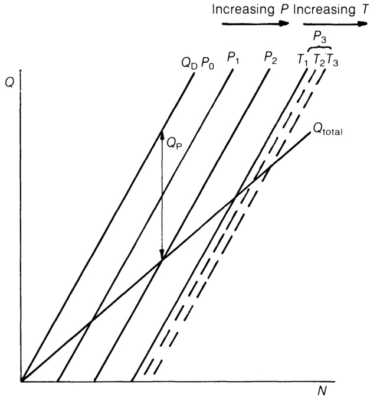
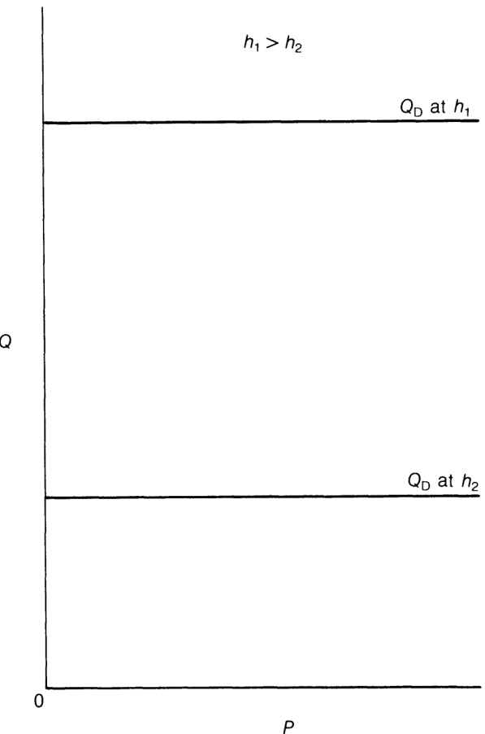
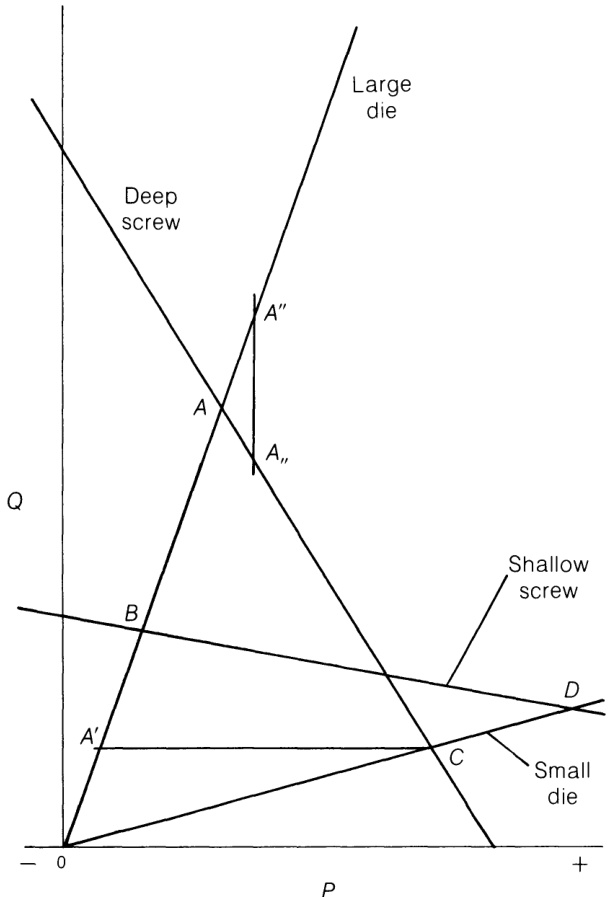
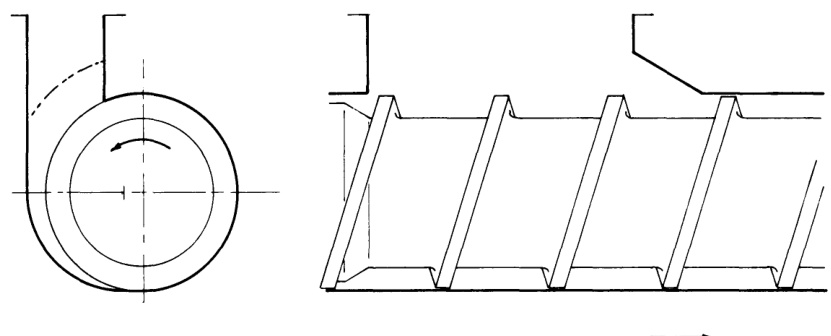
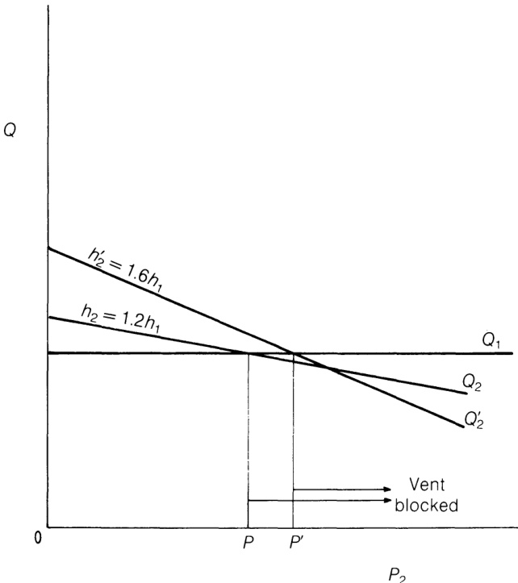
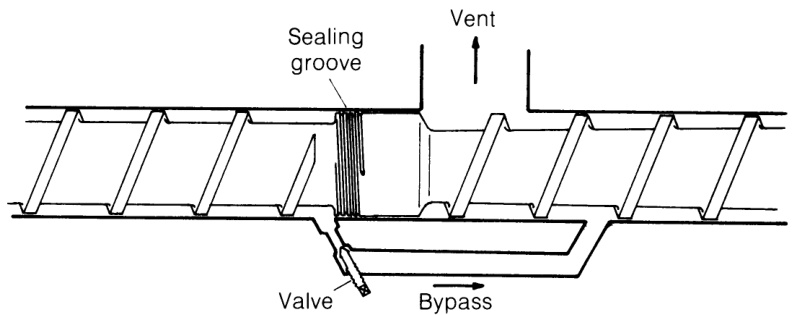
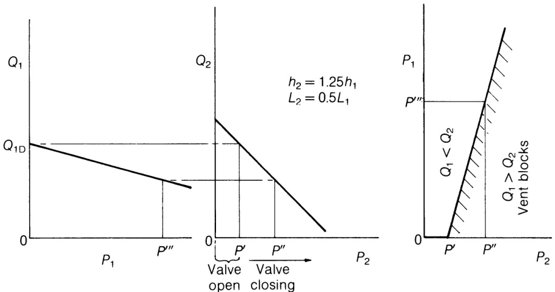

# 6.5 螺杆/模头组合产量的图形化，包括排气过程 

## 6.5.1 图形表示  

由式(6.9)可知，阻力流与$W$成正比，进而与螺杆转速$N$成正比（式(6.11)）。式(6.13)表明，对于牛顿流体，压力梯度${\bf d}P/{\bf d}z$（即压力）与螺杆转速无关。因此在恒定压力下，输出流量$Q$与$N$呈线性关系（式(6.20)），即为比例阻力流量减去恒定压力下的流量，其形式为:

$$
Q_{\mathrm{Tot}}=A N-\frac{B P}{\eta}\tag{6.50}
$$  

where:  

$$
A={\frac{\pi}{2}}\,D b h\cos\phi\tag{6.51}
$$  

(from equation (6.10)) and:  

$$
B={\frac{b h^{3}}{12Z}}\tag{6.52}
$$  

（由式（6.20）得出）。因此，图6.12通过一系列平行直线展示了不同背压条件下产量与转速的关系。方程(6.50)表明：当温度升高导致粘度$\eta$降低时，在转速恒定条件下，压力流量$Q_{\mathbf{P}}$将增加而总产量减少——这在恒定压力下温度升高的虚线曲线中得以体现。更具实际意义的是挤出机与固定模头组合时输出随转速的变化规律。根据式(3.22)，固定几何模头的$Q/P$关系为：  

$$
Q_{\mathrm{Die}}=\frac{K P}{\eta}\tag{6.53}
$$  

此处 

$$
K=\frac{\pi R^{4}}{8L}\tag{6.54}
$$  

  
Figure 6.12 Total output vs speed.  

对于半径为 $R$、长度为 $L$ 的毛细管，或： 

$$
K=\frac{T H^{3}}{12L}\tag{6.55}
$$  

对于宽度为 $T$、深度为 $H$ 的“无限”缝隙。但根据连续性：  

$$
Q_{\mathrm{Tot}}=Q_{\mathrm{Die}}\tag{6.56}
$$  

将方程（6.53）与（6.56）结合并重新排列：  

$$
P=\frac{\eta Q_{\mathrm{Tot}}}{K}\tag{6.57}
$$  
 
代入式(6.50)并重新排列：  

$$
Q_{\mathrm{Tot}}\left(1+\frac{B}{K}\right)=A N\tag{6.588}
$$  

即如图6.12所示，总输出功率与压力与转速$N$成正比。 

$$
Q_{\mathrm{Tot}}\propto P_{\mathrm{Die}}\propto N\tag{6.59}
$$  

这只是近似值，因为实际中温度也可能随速度变化（第9.2节）。假塑性流体在第6.7节中讨论，但为方便起见，此处将输出与速度的关系纳入考虑。最关键的是，螺杆通道与模腔中的剪切速率（即粘度）存在差异（参见式(6.50)和(6.53)），因此式(6.58)中的括号项将变为$(1+B\eta_{\mathrm{Die}}/K\eta_{\mathrm{Screw}})$。两者粘度比值取决于螺杆与模腔的剪切速率，以及对应剪切速率下的假塑性指数$n$值。然而，即使假设拖曳流与压力流分离对假塑性流体仍成立，方程(6.69)结合方程(6.17)表明：与模头不同，螺杆中的剪切速率并不与压力流$Q_{\mathbf{P}}$或压力$P$成正比， 因此剪切速率之比值——即模腔粘度$\eta_{\mathrm{Die}}$与螺杆粘度$\eta_{\mathrm{Screw}}$之比——将随螺杆转速变化。这预计会导致输出量随转速呈略高于比例的关系增长。实际操作中，由于比机械功率$E/Q$随转速增加而上升（图8.13），温度往往随之升高。若螺杆剪切速率下的粘度温度系数大于模头，则螺杆粘度下降幅度可能大于模头。图3.5中收敛的曲线（实验中常见现象）印证了这一推论。实验常发现，即使是高度假塑性聚合物，在进料或熔融限制显现前（参见第7章），产量与转速仍近乎线性关系。在高压环境或大型设备中，由于温度控制困难，产量/转速曲线可能出现下垂，这很可能是温度对粘度产生的影响所致。 

  
Figure 6.13 Drag flow vs speed.  

方程(6.20)、(B.31)、(B.37)和(B.38)表明，对于几种常见类型的螺杆，阻力流量与转速成正比且与压力无关。因此在图6.13中，$Q/P$图显示$Q_{\mathbf{D}}$在原点上方距离处呈现一系列水平线，这些线与转速$N$成正比。图6.14展示了通道深度$h$的类似效应：恒定转速下的阻力流与通道深度成正比。根据方程(6.20)，压力流$Q_{\mathbf{P}}$（负值）与压力$\pmb{P}$成正比且与转速$N$无关，因此图6.15由图 6.13图叠加了多条平行直线，分别对应不同速度下的拖曳流量$Q_{\mathbf{D}}$（从零压力开始随压力$P$线性递减）；此时纵坐标表示$Q_{\mathrm{Tot}}=\,Q_{\mathbf{D}}-Q_{\mathbf{P}}$（方程(6.15)）。方程(B.32)、(B.39)和(B.42)表明，对于其他类型的螺杆，输出量也随压力线性变化（但参见第6.7节和第6.8节）。在图6.16中，压力流量$Q_{\mathbb{P}}$同样叠加于图6.14之上，以$Q_{\mathrm{Tot}}$作为最终纵坐标。但由于$Q_{\mathbb{P}}$与$h^{3}$成正比，$Q/P$曲线的斜率随通道深度增加而急剧上升。该图直接阐明了不同深度螺旋钻的若干操作特性——如第149页所述，最终通道深度比“压缩比”$h_{1}/h_{2}$更具决定性意义，故将避免使用后者这一常见但易误导的俗称。首先，在压力相同增幅下，深螺杆的输出量降幅远大于浅螺杆——因此它们常被分别称为“软螺杆”与“硬螺杆”。其次，尽管低压状态下深螺杆输出量大于浅螺杆，高压条件下则相反。在零输出状态下，深螺杆的最大可达压力也低于浅螺杆。缩短熔体输送段长度$_{Z}$的效果与增加螺杆深度$\pmb{h}$类似，但影响幅度较小，因为$Q_{\mathbf{P}}$仅与$Z$呈线性变化（见式(6.13)）。由于$Q/W b h$与$Q_{\mathrm{Tot}}$成正比，图6.16的纵坐标亦可视为给定转速与通道深度下$Q/W b h$的线性标尺，其零压力点对应拖曳流状态，取值为$_{1/2}$。当$1/2<Q/W b h<1$时，输出/压力曲线向左延伸至纵坐标轴左侧，表示负压变化——此特性将在附录B.5中分析双级螺杆时运用。该输出/压力曲线是方程(6.20)或(6.33)的图形化表示，必须满足所讨论螺杆的条件；但它不提供与特定模头组合时实际输出值及其对应压力的信息。对于牛顿等温流体，模具的输出/压力关系由方程(6.53)给出，该关系以通过原点的直线表示。方程(6.54)和(6.55)表明：若模头狭窄和/或较长，则$K$值较小且斜率较小；若模头宽阔和/或较短，则斜率较大（如图6.17所示），该斜率代表$K/\eta$。对于处于稳定运行状态的螺杆与螺纹，输出量$Q$与压力$P$的关联关系必须同时满足，而螺杆曲线与螺纹曲线的交点即为这两个联立方程组的唯一（真实）解。图6.18表明：对于大模头，深螺杆（点$\textbf{\emph{B}}$）的输出量和压力可能远高于浅螺杆（点$\pmb{A}$）。然而当配合小模头时，同等转速下浅螺杆（点 $\b{D}$ ）的输出可能高于深螺杆（点 $^{c}$ ）。此矛盾可通过提高后者转速解决，此时螺杆设计的选型（如同背压选择）便成为能量、混合与稳定性综合考量的问题（详见第9章与第11章）。第6.7节和第6.8节将探讨非牛顿流体与非等温操作对该图的修正。对于更复杂的问题，连续性要求串联段落满足：  

  
Figure 6.14 Drag flow vs channel depth.  

  
Figure 6.15 Pressure and total flows vs speed.  

  
Figure 6.16 Pressure and total fows vs channel depth.  

  
Figure 6.17 Die characteristics (Newtonian).  

$$
Q_{1}=Q_{2}=Q_{3},\;\;\mathrm{etc.}\tag{6.60}
$$  

and:  

$$
\mathrm{d}P_{1}+\mathrm{d}P_{2}+\mathrm{d}P_{3}+\dots=0\tag{6.61}
$$  

（包括通过模具的压降）其中 $\mathbf{d}P_{x}$ 是截面 $_x$ 中的压力变化。在并联运行情况下：  

$$
Q_{1}+Q_{2}+Q_{3}+\cdot\cdot=Q_{\mathrm{Tot}}\tag{6.62}
$$  

  
Figure 6.18 Operating points of screw/die combinations.  

and:  

$$
{\bf d}P_{1}={\bf d}P_{2}={\bf d}P_{3},~~\mathrm{etc.}\tag{6.63}
$$  

此外，当螺杆段共用同一根轴时，各段转速$N$相同，且当直径$\boldsymbol{D}$和螺旋角$\phi$也保持恒定时，下通道速度$W$和通道宽度$^b$将保持恒定。  

## 6.5.2 通风或真空抽吸  

为简化起见，本文以排气或真空抽吸为例说明此类图示的应用，并采用等温牛顿流体近似。排气目的包括：(i) 排出进料段内滞留空气；(ii) 去除固体原料表面及内部水蒸气； (iv) 去除螺杆加热过程中产生的降解产物。此举有助于获得无孔隙、结构稳定、表面光滑的产品，并减少异味、模具积垢及“冒烟”现象（例如在LDPE涂布造纸工艺中因高温引发的情况）。

  

  
Figure 6.20 Vent for vacuum extraction.  

真空进料（第7章）也可实现排气，并在一定程度上达到目的(i)和(ii)；而目的(iv)显然只能在熔融后实现。 

常用的方法包括多种，其中最普遍的是在螺杆中设置减压段，并在其上方的料筒上开孔（图6.19）。所有熔融聚合物都会流经该排气孔，因此该孔极易堵塞； 为减少排气孔堵塞并辅助清除被挤入孔内的物料，已采用多种结构设计（包括可拆卸插件），如图6.20所示：排气口呈切线状布置于螺杆下行侧上方，并加长以增大蒸汽释放面积，其后缘经充分倒角处理以利物料再卷入（参见第7章）。由于原理要求熔体在螺杆首段熔化后，经排气孔减压至零压，因此通常需设置第二段浅螺纹区以在模头前建立所需压力。此方案在特定工况下可行（需在螺杆设计阶段精确预测），但灵活性较差——模头压力增大易导致排气孔堵塞。分析产量与压力关系可知：两段螺杆转速相同，当排气通道畅通时，第一段螺杆在零背压下工作，其产量与模头压力无关。根据连续性原理，若要保持排气畅通，则$Q_{2}\geq Q_{1}$，故$h_{2}$必须大于$h_{1}$。随着模腔压力$P_{2}$增大，$Q_{2}$将逐渐减小，直至当$P_{2}>P$（图6.21）时低于$Q_{1}$，此时排气通道将堵塞——因为第二段排气区域的排料速度已不及第一段的供料速度。为避免此现象，常将 $h_{2}$ 设计得远大于 $h_{1}$ ，这虽可容许稍高的模头压力 $\pmb{P}$ ，但如图 6.16 所示，会导致 ${\bf d}Q/{\bf d}P$ 梯度陡峭化——即在相同压力升幅下输出下降更剧，使得该设计对模头压力变化更为敏感。为确保蒸汽释放，排气口处的螺杆通道必须保持部分空隙；若第二段呈锥形，则通道填充位置取决于模头压力。当模头压力升高时，可通过延长通道填充位置（如图6.22所示）来维持相同输出量，即增加有效长度，直至最终通道在排气口处完全填满导致堵塞。然而如第6.6节所述，部分填充螺杆的抽吸速率对填充程度极为敏感，即使在其他条件理想时也可能引发抽吸波动；若将第二段深度$h_{2}$增至最小值以上，该现象将进一步加剧。 

  
Figure 6.21 Effect of die pressure on venting.  

  
Figure 6.22 Effect of die pressure on filling position.  

  
Figure 6.23 Valved bypass venting system (Bone-Cravens patent).  

  
Figure 6.24 Valve closing vs die pressure $P_{2}$ to avoid vent blocking.  

另一种采用类似螺杆的排气方法是利用部分填充来避免聚合物熔体直接流过排气孔——通过将排气孔设置在螺杆内部的螺纹后方（Bernhardt, 1956），该区域通常最后发生填充。排气通道通过空心螺杆延伸至驱动端的旋转接头。其输出/压力特性与前法相似，但排气面积受限严重，难以集成螺杆加热或冷却功能，且一旦堵塞无法进行人工清理。由于第一段在零背压条件下运行，该段末端实际起到增压阻力作用，促进前期段落的熔融与混合；已有方案建议用短环形节流结构（如“涂抹头”）替代，使第一段加深，从而可能提高产量和/或增强混合效果。然而，第一段的产量仍与模头压力无关；后者限制和/或压力波动仍可能发生。 

若将该限制结构优化至极限——采用紧密间隙配合反向螺距密封槽——熔体可经旁路通道绕过排气口，在排气位置下游重新注入螺杆。如此既避免熔体流经排气口，又能在意外堵塞时使螺杆第二段自动泵送疏通排气通道。该系统的改进方案是在旁路中加入可调阀（Grant, 1961），使第一螺杆段的背压$P_{1}$可变，从而补偿模头压力$P_{2}$的变化（图6.23）。该设计通常可在不堵塞排气孔的前提下允许更高模腔压力，更重要的是能使第一段与第二段螺杆深度趋于一致，从而降低熔体涌动风险。特定螺杆的运行状态可通过$P_{1}$与$P_{2}$关系图（图6.24）概括；阀门上游的压力表可辅助操作人员监控。笔者曾观察到排气孔因$P_{2}$升高而堵塞，随后通过相应提高$P_{1}$得以疏通。该系统还具有额外优势：根据第二段的填充点位置，可形成较大熔体表面释放挥发物。实际经验表明存在两项限制：(i)聚合物在密封区或排气区停留时间过长导致的热降解可能污染产品； (ii) 尽管调节阀门可避免排气口堵塞，但第一螺杆段背压增加将改变功输入与熔体温度。其本质与无排气螺杆相同，但因操作者常试图在单螺杆长度内解决排气问题，导致熔融混合有效长度缩短，却期望保持相同产量、熔体温度及稳定性等性能，故问题更为严峻。本文作者认为更合理的处理方式是将排气通道与第二螺杆段视为对简单螺杆长度的延伸，在产量与额外长度对聚合物施加的额外剪切作用之间寻求平衡。桶内系统可去除约5%（质量分数）水蒸气——通过多级萃取点处理，可将约15%的挥发性单体降解至残留含量远低于1%。 

更激进的系统（Fisher, 1976, p. 83）采用两台独立挤出机：首台固料进料机将熔融聚合物泵入脱气容器，次台熔体进料机将脱气后的聚合物输送至模头。该容器需加热，可配备搅拌器和/或真空装置辅助挥发物去除。其可提供大面积聚合物接触面和长停留时间以促进分离，据称第二台挤出机可实现无冲击运行，但这取决于熔体供料的稳定性。两台挤出机可采用不同转速甚至不同直径；由于容器容量充足，无需精细调节相对产量。尽管设备结构复杂，且长时间停留可能导致热敏聚合物降解，但该工艺似乎适用于去除大量水蒸气及其他挥发物。  

附录B.5中提供了$Q{\scriptscriptstyle-}P$图应用的更多实例。 
