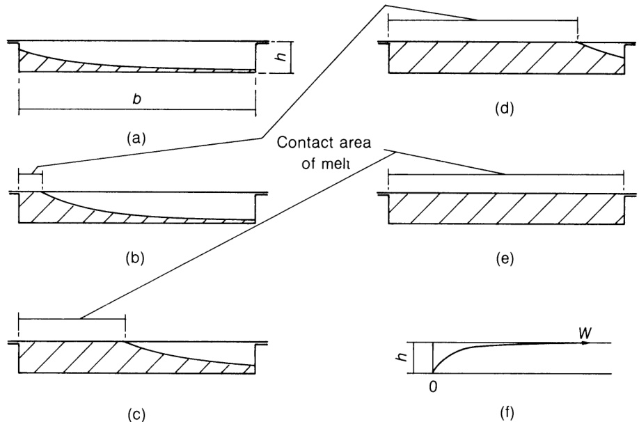

# 6.6 输出修正  

第6.2节中的十项假设允许通过简单的解析方程推导流量和机械功率输入，由此可清晰观察到运行条件变化引发的趋势。此外，借助袖珍计算器即可获得具体数值。  

上述假设中，第1、6、7、8及10条分别在第11.2、6.3、6.7、6.8和6.4节中阐述，而重力（第9条假设）在高粘度熔体中显然可忽略。除料料变化等外部因素外，挤出机内部亦可能产生不均匀性，例如因选择性进料（第271页）或选择性熔融（第282页）所致。尽管部分熔融的聚合物可能表现为流体并产生压力，仍需采用适当的粘度值与热含量参数。 

若聚合物不附着于筒体和螺杆表面，流动状态将变得不确定。当筒体附近出现低粘度区域（例如因过度加热或低分子量物质分离所致，如单体、润滑剂等），拖曳流动将减弱。当螺杆表面接近“滑移”状态时，阻力流可能增强，但压力流也将失真。假设3忽略了聚合物附着于螺纹侧壁产生的阻力；阻力流并非真正一维，其平均阻力速度小于$W/2$（方程(6.9)）。同样地，压力流也无法完全用无限缝隙中的流动来描述。McKelvey（1962，第236页）给出了通道宽度与深度比$b/h$不同值下阻力流与压力流的修正系数图。图表显示：当$b/h=10$（典型塑料挤出机工况）时，$K_{\mathrm{D}}=0.93$且$K_{\mathrm{P}}=0.94$，且这些系数随$b/h$变化缓慢，故在评估运行条件变化时可忽略（设计阶段除外）。忽略这些修正项将导致计算流量率高估约7%，并相应低估基于观测流量率计算的$Q/W b h$值，因此在从$Q/W b h$值推导时具有显著影响。在橡胶挤出螺杆常用的深槽中，修正量将大于上述数值。 

假设浅槽且忽略曲率（因惯性项可忽略）的主要影响在于：式(6.9)和式(6.10)会高估平均槽内流速——后者更应表示为：  

$$
Q_{\mathrm{D}}={\frac{\pi}{2}}\left(D-h\right)N b h\cos{\phi}\tag{6.64}
$$  

当直径与深度比$D/h=10$时，误差为$+11\%$，但该近似仍具实用价值，尤其适用于锥形螺杆——其沿长度方向的$(D-h)$会发生变化。较小的误差源于桶壁与螺杆根部的面积（及应力）不均等， 导致剪切速率（速度梯度）产生的拖曳流动不恒定，图6.3所示的速度分布应类似于图6.6(e)——压力流动产生的抛物线速度分布（图6.5）也将发生类似扭曲，其峰值更接近螺杆根部。 

直接影响输出/压力特性的主要不确定因素是有效熔体长度Z。Weeks和Allen（1962）的实验表明，通过绘制固料挤出机熔体输送段各测点压力数据并外推至零压力，可相当可靠地确定初始压力上升点。同一研究团队通过让聚合物从料筒不同位置流出并流经热电偶来测量熔体温度。这种方法当然提供了时间平均读数，但在“凝胶点”区域可能产生偏高读数，因为流动中的固体颗粒无法通过热电偶周围相对狭窄的通道。本文作者通过重新计算最终温度与总产量，结合从初始压力上升点起算的长度段内计算的功率输入，得出该点的焓值与平均温度。对于高压缩螺杆，实验条件下LDPE的温度值介于$105^{\circ}\mathbf{C}$至$110^{\circ}\mathbf{C}$之间， 而该材料晶体熔点约为117℃。这表明初始压力上升点可视为“凝胶点”的有效指示——悬浮于熔融基体中的半固态颗粒平均温度虽低于名义熔点，但仍能表现出流体特性并产生流体动力压力。Marshall、Klein与Uhl（1965）及Barnett等人（1966）曾报道过在螺杆表面安装热电偶并浸入通道流体进行的实验。塔德莫尔与克莱因（1970）根据这些文献重现的螺杆沿程温度分布图显示：（i）某一点存在温度随时间波动的现象及其特性；（ii）温度随通道宽度变化；（iii）波动与变化随螺杆转速增加而加剧的趋势；（iv）波动区域随转速提升向模头方向移动。其对熔化过程（第7章）及模头均匀性（第11.1节）的影响将在后文探讨，但这些结果表明：仅凭温度测量无法可靠确定压力开始上升的临界点。实践经验证实了威克斯与艾伦（1962）的发现——该临界点会随压力增大而向料头端移动。基于第七章所述Tadmor熔融模型（图7.23及7.31(b)）的计算表明：在熔融段内将出现显著压力升高，这意味着在给定模头压力下，熔体输送段的压力梯度${\bf d}P/{\bf d}z$将减小而输出量$Q$将增大。如第275页所述，该效应通常较弱，仅在深螺杆与高模头压力条件下显著，因此基于熔体有效填满通道点起算的长度$Z$计算产量时，无需过度保守。塔德摩尔熔化模型（第7章）可预测固态床完全熔化的位置，在理论或实验能预测固态床破裂点之前，该位置似乎是确定有效熔化长度$Z$的最佳依据。  

  
Figure 6.25 Melt cross-section of partially filled channels.  

部分填充螺杆的泵送速率已在压力分布（第145页）和排气（第162页）章节中提及；图6.25以示意图展示了多种情况。如图6.25(a)所示，当通道仅被极少量熔体填充时，熔体将在螺杆表面形成薄膜并旋转，此时熔体既不接触料筒，也不存在推动其沿螺杆移动的力。任何附着于料筒或滞留在螺纹间隙的物料，都将因速度分量$U$（方程(6.5)）所代表的横向运动，而聚集在螺杆螺纹的前缘面（图6.25(b)）。阴影区域所示物料在筒体处承受剪切力，而与螺杆接触的较大表面则施加平衡力；因此筒体的剪应力及剪切速率远高于螺杆，形成如图6.25(f)所示的速度梯度。拖曳流可由式(6.8)的修正形式表示：  

$$
Q_{\mathbf{D}}=\int_{0}^{h}w x\,\mathbf{d}y\tag{6.65}
$$  

但在本例中，$w$和$x$均为$y$的非线性函数。当填充程度增加至图6.25(c)所示状态时， 与料筒接触的面积增长速度将快于熔体体积（阴影区域所示）和与螺杆接触的面积，从而使剪应力和剪切速率趋于趋近，“泵送效率”随之提升。当通道接近填满时（如图6.25(d)所示），其剪切条件和泵送效率将与完全填满的通道（如图6.25(e)所示）趋于相似。因此可预期近满通道的运行特性与完全填满通道基本一致，但需注意压力必须保持为零，否则通道将被填满。然而，随着通道填充程度的增加，泵送速率呈现非线性增长，这意味着向螺杆段输送物料的轻微增加可能导致其泵送速率不成比例地提升，进而抽空该段物料，使泵送速率下降，直至物料输送再次提升填充程度。这被认为是输出不稳定现象（即脉动，参见第11.2节）的根源，该现象在传统排气螺杆泵的第二段（参见第6.5节）中频繁出现。其原理类似于涡轮压缩机因入口级失速引发的经典脉动现象。 