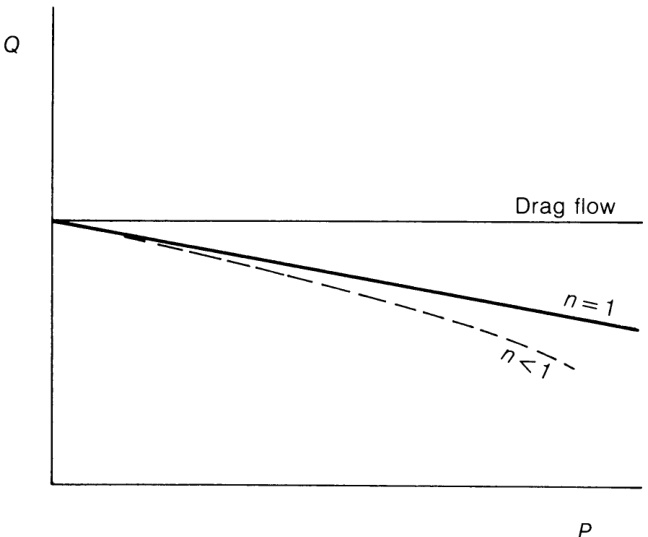
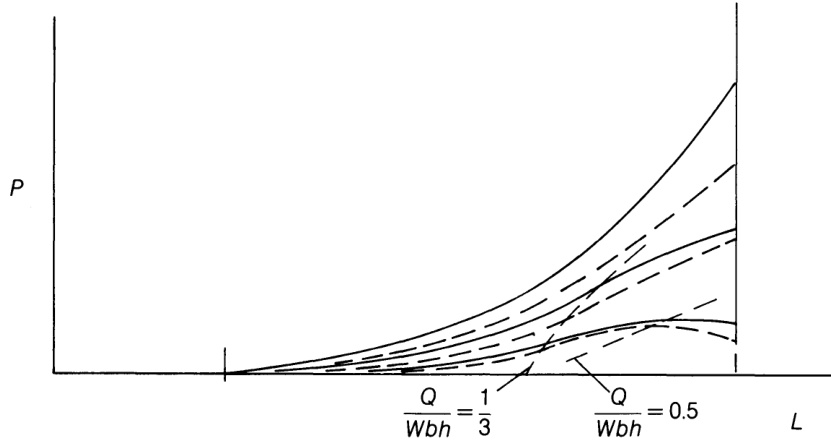

# 6.7 假塑性流动

 在第143页提及拖曳流动与粘度无关，因此若提高螺杆转速，该输出项将不受假塑性行为影响。然而转速提升将导致剪切速率增加并降低假塑性熔体的粘度，进而增加由压力引起的回流（如方程(6.15)末项所示）。因此，随着转速增加，输出/压力曲线的斜率将增大——这与图6.15所示牛顿流体恒定斜率形成对比。图6.6表明，除拖曳流动（当$Q/W b h=1/2$）情况外， 螺杆通道深度方向上的速度分布呈非线性。由于剪切速率$\dot{\gamma}=\mathsf{d}w/\mathsf{d}y$（方程(3.4)）随位置变化，其数值取决于拖曳流与压力流的强度。附录B.1给出距螺杆通道根部$y$处的下游速度$w$为：  

$$
w=\frac{W y}{h}+\frac{(y^{2}-y h)}{2\eta}\cdot\frac{\mathrm{d}P}{\mathrm{d}z}\tag{B.8}
$$  

那么该点的剪切速率：  

$$
\dot{\gamma}_{y}=\frac{\mathrm{d}w}{\mathrm{d}y}=\frac{W}{h}+\frac{\left(2y-h\right)}{2\eta}\cdot\frac{\mathrm{d}P}{\mathrm{d}z}\tag{6.66}
$$  

但通过对式(6.16)进行变形：  

$$
\frac{\mathrm{d}P}{\mathrm{d}z}=\left(\frac{1}{2}-\frac{Q}{W b h}\right)\frac{12\eta W}{h^{2}}\tag{6.42}
$$  

代入方程(B.8)：  

$$
w={\frac{W y}{h}}+{\frac{6W}{h^{2}}}\left({\frac{1}{2}}-{\frac{Q}{W b h}}\right)(y^{2}-y h)\tag{6.67}
$$  

代入式(6.66)得：

$$
\begin{array}{r}{\dot{\gamma}_{y}=\displaystyle\frac{\mathrm{d}w}{\mathrm{d}y}=\displaystyle\frac{W}{h}+(2y-h)\left(\displaystyle\frac{1}{2}-\displaystyle\frac{Q}{W b h}\right)\displaystyle\frac{6W}{h^{2}}\,}\\ {=\displaystyle\frac{W}{h}+\displaystyle\frac{W}{h}\left(\displaystyle\frac{12y}{h}-6\right)\left(\displaystyle\frac{1}{2}-\displaystyle\frac{Q}{W b h}\right)}\end{array}\tag{6.68}
$$  

在桶壁表面处，当 $y=h$ 时  

$$
\begin{array}{c}{\displaystyle{\dot{\gamma}_{h}=\frac{\mathrm{d}W}{\mathrm{d}y}=\frac{W}{h}\left[1+6\left(\frac{1}{2}-\frac{Q}{W b h}\right)\right]}}\\ {\displaystyle{=\frac{W}{h}\left(4-\frac{6Q}{W b h}\right)}}\end{array}\tag{6.69}
$$  

该结论适用于粘度恒定的情况，即等温牛顿流体（参见6.2.2节中的假设7和8）。但如附录B.1所示，对于非牛顿流体——其粘度$\eta$是剪切速率的函数——粘度将随通道深度变化，并成为$Q/W b h$的函数， 即压力流与阻力流之比值的函数（方程(6.68)）。因此纳维-斯托克斯方程(B.1)的积分变得复杂，无法像方程(6.15)那样给出明确反映操作变量影响的解析解。然而，一种近似方法可考虑剪切速率（如因流速或通道深度变化）对粘度的主要影响，以及背压增加时剪切速率的变化，该方法利用方程(6.69)确定粘度插入流体方程时的剪切速率。该方法未考虑粘度变化对速度分布曲线形状的影响，即图6.6中曲线的变形（参见图4.1）。具体步骤是：先根据已知输出或压力条件计算$Q/W b h$值，进而通过式(6.69)求得表观壁面剪切速率。随后在该剪切速率下，于对应熔体温度下该聚合物的剪切速率-粘度曲线上取截距，即可获得用于流动方程(6.15)或(6.20)的粘度值。这使得在假设$Q$值时可计算${\bf d}P/{\bf d}z$或$P$值，反之亦然，其复杂程度仅略高于牛顿流体情况，但需对每个$Q$或$P$值重复计算。  

现简要探讨方程(6.69)对压力分布及输出/压力特性的影响。当$Q/W b h=1/2$时，方程(6.69)简化为$\mathsf{d}W/\mathsf{d}y=W/h$，与图6.6(d)一致，且方程(6.15)的第二项消失，输出量由此成为与粘度无关的量，如同牛顿流体情况。对于恒定深度螺杆，首先考虑两种流体（一种为牛顿流体，另一种为假塑性流体）在拖曳流剪切速率$W/h$下粘度相等的条件。若施加背压使两种流体的输出量$Q$和$Q/W b h$均等量减少，则根据图6.6和式(6.69)，壁面剪切速率$\dot{\gamma}_{h}$将增大，假塑性流体的粘度$\eta$将减小，而牛顿流体的粘度保持不变。根据式(6.15)并与相同输出流量$Q$和$Q/W b h$下的牛顿流体比较，$Q_{\mathbf{P}}$必须保持不变，但压力梯度${\bf d}P/{\bf d}z$将随粘度降低而减小。由于通道深度 $h$ 保持恒定，沿长度方向的 ${\bf d}P/{\bf d}z$ 值不变，因此图 6.9 仍适用，但对应给定 $Q/W b h$ 值时，压力梯度减小且最终压力 $P$ 降低。在输出/压力图上，给定输出量$Q$和$Q/W b h$值对应的压力将低于牛顿流体的情况，即图中曲线向原点方向水平偏移。若基于等背压条件进行比较，则式(6.15)表明：伪塑性流体因粘度较低导致输出量减小，即在$Q$对$P$的图上呈现垂直向下偏移。因此在图6.26中，伪塑性流体的输出曲线位于牛顿流体曲线下方。需注意：由于粘度与剪切速率及压力梯度呈非线性关系，假塑性流体的$Q/P$特性曲线不再是直线；当两种流体在接近拖曳流剪切速率（即$\dot{\gamma}_{h}=W/h$）时的粘度相等时，牛顿流体曲线在$P=0$处与该曲线相切。 

对于深度变化的螺杆（如阶梯式或锥形螺杆），上述趋势同样成立，但螺杆沿程剪切速率与粘度的变化将导致压力梯度产生额外变化，这些变化超出图6.10和图6.11所示范围。通过对式(6.69)进行导数运算可得：  

  
Figure 6.26 Effect of pseudoplasticity on output/pressure line. Newtonian; ---- pseudoplastic.  

深度 h:  

$$
\frac{{\bf d}\dot{\gamma}_{h}}{{\bf d}h}=\frac{W}{h^{2}}\left(\frac{12Q}{W b h}-4\right)\tag{6.70}
$$  

这表明在恒定输出条件下（如同一螺杆沿不同位置），当$Q/W b h<1/3$时，壁面剪切速率随深度$\pmb{h}$减小而增大——即与第149页纵向压力梯度拐点所示条件相同。表6.1中的水平线对此进行了说明；例如在计量段拖曳流工况下运行的4:1阶梯螺杆（$h_{1}/h_{2}=4.0$）中，壁面剪切速率从第一段的0.81增至计量段的1.00。在5:1锥形螺杆$(h_{1}/h_{2}=5.0)$于$Q/W b h_{2}=0.2$工况下运行时，壁面剪切速率从凝胶点处的0.75逐渐增至末端的2.80。与平行螺杆的情况类似，相较于牛顿流体，剪切率增加导致粘度降低且压力梯度减小。因此表6.1中的水平线表明：图6.10和6.11中上部压力分布曲线的曲率将减小，且较浅区域产生的总压力占比将降低。当$Q/W b h>1/3$（即表6.1中粗线右侧区域）时，随着深度h减小，壁面剪切速率降低，导致粘度和压力梯度相较于牛顿流体增加。图6.27定性展示了这种纵向压力梯度的变化，可与图6.11中锥形螺杆的对比结果进行对照。某一点处的实际压力$P$和梯度$\mathbf{d}P/\mathbf{d}z$取值，取决于假设牛顿流体与假塑性流体粘度相等的剪切速率值。 

表6.1中的垂直线显示了螺杆长度范围内某固定点处剪切速率随背压的变化规律。例如对于3:1螺杆，凝胶点处的壁面剪切速率在整个有效背压范围及$Q/W b h$条件下仅从1.33变化至$0.93W/h_{2}$。事实上，仅在低值时  

  
Figure 6.27 Pressure gradients in pseudoplastic flow. \___ n=1; \--- n<1

表6.1 不同锥度$h_{1}/h_{2}$螺杆的壁面剪切速率（由式(6.69)计算）与无量纲输出值对比，以拖曳流中螺杆末端剪切速率$W/h_{2}$的比值表示   

在螺杆中部区域（$Q/W b h_{2}$）及螺杆末端附近（此时压力梯度较高），壁面剪切率与阻滞流状态下的剪切率存在显著差异。这些剪切率属于牛顿流体特性，但其与阻滞流值的轻微偏差表明，它们与假塑性流状态下的剪切率差异亦不大，因此前述粘度近似值在大多数情况下是合理的。 

在评估特定转速和背压下变深螺杆的性能时，合理的近似方法是采用等效于方程(6.69)所示壁面剪切率范围的算术平均粘度值。然而在低背压条件下（当$Q/W b h_{2}>1/3$时），最大剪切速率不再出现在螺杆末端。显然此时更准确的做法是采用对应最大剪切速率与最小剪切速率的平均粘度值，而非螺杆两端剪切速率的平均值。更精确的方法是将螺杆视为由若干独立段组成，每段具有恒定的剪切速率和粘度，并通过方程(6.60)和(6.61)进行组合。对于阶梯式螺杆，该方法可简化为使用方程(6.38)、(6.39)、(6.40)和(6.41)，其中前两个方程采用不同粘度值。模头方程(6.53)中使用的粘度值也必须基于模头内的剪切速率，例如方程(3.24) 。  

当螺杆与固定几何形状的模头组合使用时，必须纳入后者与假塑性流体间的$Q{\scriptscriptstyle-}P$关系。如第3.1节所示，若流变方程近似为幂律关系：  

$$
\tau\propto\dot{\gamma}^{n}\tag{3.6}
$$  

$$
\eta=\frac{\tau}{\dot{\gamma}}\propto\dot{\gamma}^{n-1}\tag{3.7}
$$  

但在模头中:

$$
\dot{\gamma}_{\bf w}\propto Q
$$  

例如对于圆形毛细管（表3.1）：  

$$
{\dot{\gamma}}_{\mathrm{w}}={\frac{3n+1}{n}}\cdot{\frac{Q}{\pi R^{3}}}
$$  
 
然后代入方程(3.7)： 

$$
\eta\propto Q^{n-1}\tag{6.71}
$$  

将式(6.71)代入式(6.53)得：  

$$
{\cal Q}\propto\frac{K P}{Q^{n-1}}\tag{6.72}
$$  

or:  

$$
Q^{n}\propto K P\tag{6.73}
$$  

当 $n<1$ 时，该曲线呈向上凹陷形态，而图6.17所示牛顿流体（$n=1$）的曲线则为 $Q\propto K P$。因此，牛顿螺杆与模头的特征方程（6.15）和（6.53）需分别替换为图6.26和方程（6.73），图6.18相应修改为图6.28，工作点从$A$移至$A^{\prime}$。 

简言之，假塑性聚合物熔体的效应主要体现在三个方面：首先，压力导致的产量下降幅度往往大于牛顿流体，尤其在高螺杆转速和/或背压条件下更为显著；其次，纵向压力分布曲线形态发生改变； 第三，当配合模具使用时，在给定螺杆转速下，产量变化不大，但模具压力较低，且随产量（螺杆转速）增加的速率低于牛顿流体。 

上述分析基于等温条件成立；温度变化的影响（部分隐含于剪切速率变化中）将在下一节探讨。第8章将分别论述假塑性条件与非等温条件对能耗及热量产生的影响。 

本讨论将粘度视为独立变量，其取决于牛顿剪切速率。Fenner（1970）曾将牛顿流体的输出/压力特性与幂律假塑性流体进行对比。后者呈现预期中的压力依赖性增强，尤其在高假塑性（低$n$值）条件下，导致给定压力下总输出降低且零输出时的最大压力减小。一维情况下，粘度仅取决于下游剪切速率；二维情况下，粘度则取决于包含横向流速的合力剪切速率（图6.8）。正如Fenner所指出的，两种情况下的$Q/W b h$差异通常较小（小于0.025），仅在接近阻力流动条件时例外（当$n=0.25$时，差异为  

 

Figure 6.28 Operating point for pseudoplastic flow. \___ n=1; \--- n<1

$Q/{W b h}$ 约为 0.07）。与图 4.1 对比可知，对应牛顿剪切速率的粘度在低压下低估了偏离牛顿 $Q{\scriptscriptstyle-}P$ 图的情况，但在高压下则高估了这种偏离。 

除假塑性外，真实聚合物熔体还可能具有时变特性，这在启动和速度变化时可能表现为响应延迟，但在稳态挤出过程中，此类效应往往会被热容量和机械惯性效应所掩盖。在稳态条件下，粘弹性效应仅在纵向收缩和模头侧向膨胀过程中显现。 