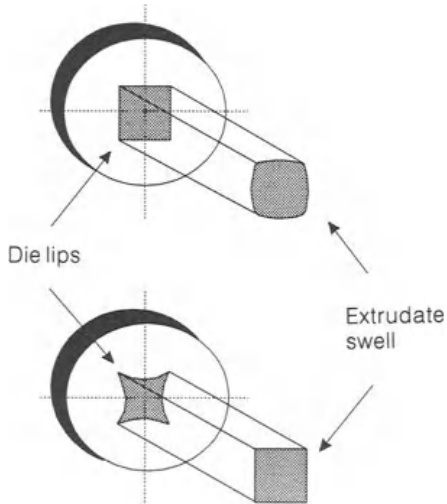
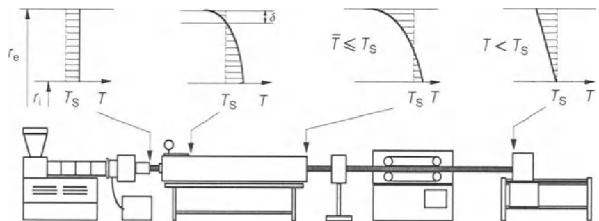
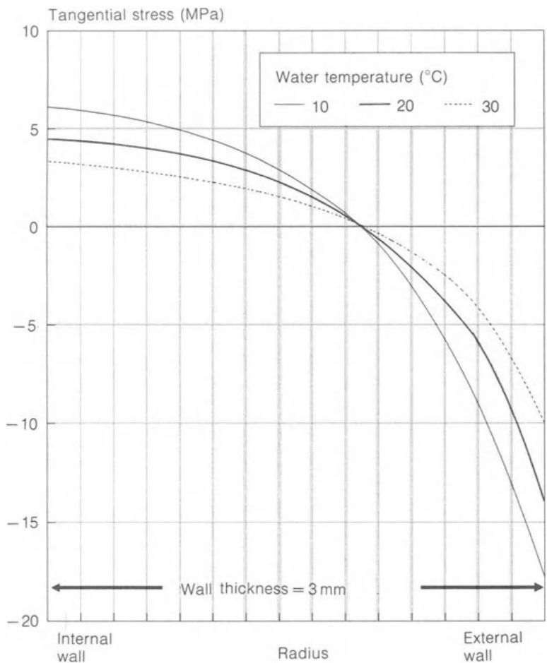
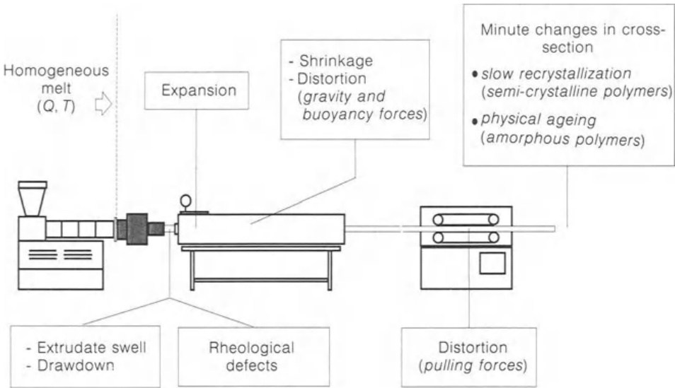

# 5.2 影响挤出模性能的因素

挤出机头和 **定型套**（calibration sleeve）如果使用通常被认为是挤出生产线上唯一负责将挤出机泵送的熔体塑形为所需截面的装置。其他设备，如冷却槽、牵引、切割或缠绕装置，通常被认为是次要的，主要用于挤出物的冷却和/或操作。事实上，挤出生产线上的各种设备与所生产挤出物的尺寸和物理特性之间有着密切的相互关系。因此，许多功能、几何和操作参数都会影响挤压模头的性能。

## 5.2.1 模头结构

Die construction  

尽管挤出机头几个部件的几何形状和尺寸显然与挤出型材的形状和尺寸有关，但所采用的结构系统一般必须确保易于维护（组装、拆卸和清洗操作应快捷）、制造成本低、部件之间密封有效、与挤出机快速耦合、有足够的机械阻力以尽量减少变形和先前适当的流道的相应变形，以及加热系统的正确位置和功率。正如本章所展示的，对于给定的材料、应用和操作条件（如温度和螺杆速度），在挤出物的质量流量、尺寸和形状以及整个轮廓的平衡物理性能方面，只有有限的几种模头几何形状可以优化工艺。然而，在实际操作中，熔体的流变特性会随着时间随机或周期性地在局部发生变化，这既是由于温度场的波动（与加热控制系统的精度和灵敏度有关），也是由于不同批次聚合物之间的差异。此外，加工商可能希望对一组聚合物/化合物使用相同的工具来生产相同或类似的挤出物（这可以通过插入适当的定型器（calibrator）和修改操作条件来实现，例如牵引速度和螺杆旋转频率）。

值得注意的是，模头最严格的先决条件之一是它能生产出在整个宽度上具有均匀平均速度的挤出物。流动阻力定义为:

$$
R=\frac{\Delta P}{Q}\!=\!f(g e o m e t r y,~r h e o l o g y)\tag{5.1}
$$  

其中，$\Delta P$ 是产生流量 $Q$ 所需的压降，模头中的每条流道都必须相同。根据公式 (5.1)，温度场的变化和/或几何形状的局部改变会影响阻力，从而导致吞吐量的变化。例如，在生产异型材时，必须平衡各分段的流道，从而防止挤出物严重变形或异型材中出现严重的残余应力。通常情况下，可以通过局部改变模头长度来保证均匀的流动阻力。 

因此，在实践中，为了校正或提高操作灵活性，必须使挤压头具有以可控方式局部修改某些相关型材尺寸或温度场的能力。这通常是通过使用可调心轴和噎杆来实现的，其位移或偏转由几个单独的螺栓控制。这些系统的位置取决于其主要目标。例如，如果要改善平膜的流动均匀性，通常会在平行区的某处插入窒流杆，并寻求一定的流动松弛。模唇的调整会影响局部产量，并增加模头的使用范围。最近，对通道间隙进行机械调节的做法可能会被热系统所取代，该系统可局部改变聚合物熔体流动的温度场（从而改变粘度、压降和局部质量流量）。挤出物的尺寸也可以通过后挤出参数进行修正，例如通过控制局部冷却条件。事实上，定型系统(calibration system)可以保证在挤出生产线上的特定位置获得适当的外部轮廓（或更少的内部轮廓），但之后可能会出现变化。 

## 5.2.2 材料流变

Material rheology  

聚合物熔体必须沿着模头流动，不能产生停滞区或二次流动。尤其是在挤出热敏性聚合物（如聚氯乙烯PVC）的情况下，

图 5.1 挤出物膨胀对挤出物形状的影响。上图：方形模头会产生变形的挤出物。下图：方形挤出物需要特定的模唇横截面。 

应控制粘性耗散，确保最终单个流动的充分熔接，挤出物应在整个出口横截面上以均匀的平均速度出现，并表现出良好的表面特性。这意味着，对于特定的生产率，聚合物的流变性决定了流道的几何形状。剪切应力和流体相应的剪切稀化特性对总压降的影响很大，而法向应力则与挤出物的质量有关，从某种意义上说，法向应力决定了聚合物可挤出性的有效极限。事实上，鲨鱼皮熔体断裂现象的发生经常与延伸流的发展有关，尽管其起源和机制在文献中仍有激烈的争论（Cogswell，1977 年；Kurtz，1984 年；Ramamurthy，1986 年）。这种异常现象可描述为特定聚合物熔体在通过模头进行稳态挤压过程中出现的粗糙表面，通常具有明显的图案。在实际应用中，在汇聚流或靠近模头出口处产生的法向应力应保持在临界值以下，该临界值是材料固有的。由于拉伸作用，挤出线上也会产生法向应力。其他一些具有实际意义的流变异常现象，如鱼眼、脱板和模唇堆积，不仅难以解释，而且难以预测。鱼眼是挤出物表面突出的硬聚合物斑点。据信，它们是在聚合物生产过程中产生的，但也可能是在加工过程中由于熔融不均匀而形成的。脱模和模唇积聚分别是设备表面（如蜘蛛芯轴的支腿上）或模头表面的（低分子量？）聚合物粘性沉积物。它们似乎与某些配方成分之间的相互作用、分子量分布的广度、环境湿度和模头的某些几何特征有关。 

众所周知，模头出口处的挤出物膨胀是聚合物弹性的一种表现形式。如图 5.1 所示，不仅横截面尺寸会增大，而且在非轴对称型材的情况下，形状也会发生变形。后者的实际意义似乎显而易见：在确定模唇形状时，应尽量补偿加工时产生的变形（图 5.1，底部）。平衡挤出膨胀取决于操作和几何参数。提高剪切速率和降低熔体温度有利于弹性，而较长的模头长度和较低的储层与毛细管比率则会减少膨胀。因此，模头几何形状和加工条件的多种组合可产生相同的挤出物横截面。模头膨胀行为的理论预测非常复杂。最近，通过使用 Galerkin 上风有限元法（FEM）对与 Kaye-BernsteinKearsley-Zapas (K-BKZ) 积分构成方程耦合的动量和能量方程进行数值求解，对长毛细管和狭缝的非等温模头膨胀进行了计算，得出了很好的预测结果（Barakos 和 Mitsoulis，1994 年）。最初预测形状变形的尝试并不完全成功（Huang 和 White，1979 年；White 和 Huang，1981 年），但最近开发了一种反向模头配方方案，通过隐式牛顿-拉斐森迭代技术，可以预测给定挤出物横截面的模唇形状（Legat 和 Marchal，1993 年）。

遗憾的是，上述方法非常复杂（涉及对复杂构成方程的处理），而且在计算要求和/或计算时间方面成本高昂。因此，一般处理器通常无法使用这些方法，只能依靠聚合物制造商提供的稀缺流变数据。这就减少了有限的熔体温度下的剪切流动曲线和长毛细管的平均挤出-膨胀数据，这些数据可以是表格形式的，也可以是图形形式的（有时会提供可恢复的剪切应变值）。拉伸流动数据和/或发生流动缺陷的条件很难获得。另外，也可以使用一些方法，通过毛细管流变仪获得的实验剪切流数据来估算延伸和弹性行为，如上所述，这些数据可以从聚合物制造商处获得（Covas、Carneiro 和 Brito，1991 年；Covas 和 Carneiro，1992 年）。例如，由 Cogswell（1972 年）开发的收敛流动模式现象学分析（发生在毛细管流变仪中）利用端部效应导致的压降分量 $P_{0}$（通过著名的 Bagley 校正计算）中包含的信息来估计材料的延伸行为。对于圆形模头，相关方程为：

$$
\sigma=3(n+1)P_{0}/8\tag{5.2}
$$

$$
\dot{\varepsilon}=4\tau\dot{\gamma}/[3(n+1)P_{0}]\tag{5.3}
$$

其中$\sigma$和$\dot{\varepsilon}$分别为平均法向应力和延伸应变率，$\tau$为剪切应力，$\dot{\gamma}$为相应的剪切速率。如果现有剪切流数据中的最大剪切速率与流变缺陷的起始点相对应，则可使用上述表达式确定临界法向应力和应变速率。这可以通过以下关系与最大容许收敛角 ${\alpha}$ 联系起来：  

$$
\alpha=2\tan^{-1}(2\dot{\varepsilon}/\dot{\gamma})\tag{5.4}
$$  

用于楔形锥形截面：  

$$
\alpha=3\tan^{-1}(3\dot{\varepsilon}/\dot{\gamma})\tag{5.5}
$$  

其中， $\dot{\gamma}$ 表示锥体出口处的剪切速率。也可以采用第一法向应力差 $N_{1}$（聚合物弹性的度量）与剪切粘度函数 $\eta(\dot{\gamma})$ 之间的相关性，以及前者与平衡模头膨胀率 $_{D S}$（由挤出物直径/模头直径之比给出）之间的相关性。用 Munstedt 型多项式（度数为 2）描述粘度函数时，可以得到很好的结果（Munstedt，1978 年），而 Wagner（1977 年）和 Tanner（1970 年）公式分别将 $N_{1}$ 与 $\eta$ 和 $N_{1}$ 与 $_{D S}$ 联系起来（Covas、Carneiro 和 Brito，1991 年）：  

$$
D S=\left[1+\frac{1}{8}\left(\frac{a_{1}-1+2a_{2}\log(a_{\mathrm{T}}\dot{\gamma})}{n}\right)^{2}\right]^{1/6}\tag{5.6}
$$  

在上式中，$\scriptstyle a_{1}$ 和 ${a}_{2}$ 是蒙斯特多项式的一阶和二阶系数，$\boldsymbol{a}_{mathbf{T}}$ 是考虑温度对粘度影响的偏移系数，$_n$ 是材料的固有阻尼常数，其值通常在 0.13 到 0.20 之间。表 5.1 显示了一些聚合物在指定温度范围内获得的 n 平均值。由于膨胀率通常不仅取决于剪切速率，还取决于测量方向，因此有必要将公式 (5.6) 预测的毛细管值修改为其他形状。以狭缝为例，两种几何形状的面积膨胀百分比大致相同。然后，将直径膨胀率平方后得出的面积膨胀率乘以狭缝宽度或厚度的系数。对于聚烯烃来说，厚度方向的膨胀率约等于宽度方向膨胀率的平方（Powell，1974 年），而在聚氯乙烯挤出过程中，据推测膨胀量与宽度和厚度比成反比（Brown、Kim 和 Summers，1979 年）。对于平行板之间的流动，方程 (5.6) 被修改为（Tanner，1970 年）：  

表 5.1 阻尼常数 $\pmb{n}$ 的值:

|     |     |     |
| --- | --- | --- |
| Material | Temperature range (°C) | n   |
| PS  | 175-205 | 0.18 |
| HDPE (pipes) | 190-240 | 0.18 |
| LDPE (film) | 170-210 | 0.05 |
| LLDPE | 150-160 | 0.14 |
| UPVC | 190-210 | 0.19-0.26 |
| PPVC | 150-180 | 0.38 |

$$
D S=\frac{H}{H_{0}}=\left[1+\frac{1}{12}\left(\frac{a_{1}-1+2a_{2}\log(a_{\mathrm{T}}\dot{\gamma})}{n}\right)^{2}\right]^{1/4}\tag{5.7}
$$  

众所周知，商用聚氯乙烯化合物具有异常的流变特性，这是因为在通常的加工条件下会产生超分子流。其实际影响之一是熔体弹性随温度升高而增加，即挤出膨胀随温度升高而增加。这种行为与众所周知的 “凝胶化 ”过程有关，即材料的颗粒结构逐渐转变为缠结网络和三维有序结构。由于方程 (5.6) 和 (5.7) 是针对真正的熔体流动而得出的，因此应加以修改以适应这种不寻常的反应（应注意的是，在较高温度下可观察到真正的熔体流动和传统的流变行为）。对于毛细管（Covas 和 Carneiro，1992 年）：  

$$
D S=\left[1+\frac{1}{8}\left(\frac{a_{1}-1+2a_{2}\log(a_{\mathrm{T}}\dot{\gamma})}{n^{\prime}a_{\mathrm{T}}}\right)^{2}\right]^{1/6}\tag{5.8}
$$  

其中，$n^{\prime}$ 是参考温度下的阻尼函数，对于刚性管道和型材的化合物而言，其值通常在 0.19 到 0.26 之间。 

## 5.2.3 挤出机与模头的相互作用

Extruder-die interaction  

挤出工艺的工作点由挤出机和模头特性曲线相交处的输出值和压力值决定（见第 6 章）。在挤压机几何形状和工作条件不变的情况下，工作点的位置取决于模头阻力（模头阻力是其几何形状和聚合物粘度的函数）。换句话说，挤出物的输出既取决于模头横截面和流道几何形状，也取决于操作条件。模头阻力的下限与熔体均匀性差和固体最终存活有关，而最大值则与过度的粘度耗散或功耗有关。 

## 5.2.4 挤出后的现象

Post-extrusion phenomena  

如第 5.1 节所述，挤出生产线的产量可能受到现有冷却和挤出物处理能力的限制。以挤出管材为例，校准和冷却槽所需的长度取决于热传导系数以及熔体和冷却液的温度。切割速度或在卷取机中更换卷轴所需的时间也与此有关。图 5.2 展示了这样一条线，并显示了多个位置的适当挤出物横向温度曲线（Kleindienst，1973 年）。熔体被认为是以均匀的温度从模头中出来的。在校准管材公称直径的同时，外层材料必须凝固，以承受沿管线剩余长度作用在型材上的力，而不使其外部轮廓变形。这些力包括各种导轨和牵引力、拉伸力（或缩减力，由履带速度与挤出模出口处挤出速度之比决定）、校准所用的内压力和浮力所产生的法向力和摩擦力。由于牵引所施加的法向力非常重要，如果要避免椭圆化，当型材离开冷却槽时，其厚度的相当大比例应该已经凝固。最后，高质量的切割要求整个断面是坚固的。在这些条件下，管材的公称直径完全可以在规定的公差范围内。然而，其他现象可能会改变管道的平均厚度或局部厚度。事实上，即使所有设备的设计和操作都正确无误，挤出物在生产线上也会发生不可逆转的尺寸变化。由于校准和/或修改操作变量可能无法有效控制这些现象，因此在确定模唇时应预计到这些变化。 

Griffith 和 Tsai（1980 年）以及 Stevenson（1985 年）研究了挤出生产线上多个位置的操作条件、模头几何形状和材料特性对挤出物尺寸的影响。结果表明，模头膨胀和拉伸是最重要的参数。  
  

图 5.2 沿着挤出生产线特定位置所需的挤出温度曲线（改编自 Kleindienst，1973 年）。

实际上，挤出物永远不会达到平衡膨胀状态，因为在挤出模头时，膨胀和拉伸同时发生，导致尺寸和形状发生变化。虽然校准可以确保适当的外形外轮廓，但可能会产生残余应力和厚度梯度。由于挤出物的膨胀受到定型器（calibrator）的限制，内部应力与校准压力差一起表现为沿壁的摩擦力。例如，如果在挤出管材的过程中，校准装置与模头的距离为 $L$，则管材变形包括 $\varepsilon_{1}$ 和 $\varepsilon_{2}$ ，前者代表模头与校准装置之间发生的变形（这是拉伸程度和聚合物弹性的函数），后者代表定型器（calibrator）内部发生的变形。这些数据由 Halasz（1993 年）计算得出，他建议调整熔体变形，使拉伸程度和 $\varepsilon_{2}$ 相似。从工艺建模的角度来看，这个问题类似于双轴拉伸粘弹性流，但由于管子很粗，无法应用膜理论。此外，在膨胀管的外部边界（即自由充气表面和摩擦边界）之间存在一个接触点，在开始进行数值模拟时，该接触点的位置是未知的（Sun、Luo 和 Tanner，1994 年）。这种情况被认为是流变学和计算中的一个未决问题。直到最近，Sun、Luo 和 Tanner（1994 年）才对粗管在牵引力作用下的膨胀和延伸进行了等温模拟，同时忽略了定型器（calibrator）中的摩擦。 

如果考虑到长丝的生产，每根长丝在空气中拉伸一小段距离，然后在水浴中冷却，就可以清楚地确定拉伸对挤出横截面的影响。将拉伸过程视为等温过程，忽略挤出物的膨胀，并将流动视为牛顿流动，即可得出简单的质量平衡： 

$$
DR=A_{0}/A_{\mathrm{e}}=V_{\mathrm{e}}/V_{\mathrm{o}}\tag{5.9}
$$  

其中，$_{D R}$ 是拉伸比，$\pmb{A}$ 表示横截面，$V$ 表示速度；指数 o 和 e 分别指模具出口附近和拉辊之前的位置。相应的拉伸力为（Agassant、Avenas 和 Sergent，1986 年）：  

$$
F=3\eta_{\mathrm{e}}Q\log\left(D R/L\right)\tag{5.10}
$$  

其中，$\eta_{\ e}$ 为拉伸粘度，$Q$ 为体积输出，$L$ 为拉伸长度。当考虑到聚合物的粘弹性时，$F$ 的计算要复杂得多，但它可以证明存在无法拉伸聚合物的操作条件（Agassant、Avenas 和 Sergent，1986 年）。无论如何，尽管对特定聚合物的 “可纺性 ”定义提出了许多标准，但众所周知，材料必须表现出延伸应变硬化特性，即延伸粘度的增加必须大于横截面的减小（由丝的延伸速度引起）。这些流变条件也可以通过改变冷却条件来实现。 

重力引起的坍塌，即熔体在自重作用下的流动，导致型材壁厚分布不均，无法通过校准来避免。这在大厚度型材中具有重要的实际意义，因为在这种型材中，冷却条件与聚合物的低导热性有关，通常允许大量塑料长时间保持熔融状态。在 $335\,\mathrm{kg}\,\mathrm{h}^{-1}$（Pittman 等人，1992 年）的条件下生产高密度聚乙烯管材时进行的测量显示，出现了明显的熔体坍塌，顶部的厚度比平均值少 $7.1\%$，底部的厚度比平均值多 $7.9\%$ 。在相同的实验中，管材直径从定径套的 $325\,\mathrm{mm}$ 减少到最终的 $315\,\mathrm{mm}$ (减少了 $3.1\%$ ), ，而壁厚则减少了约 $20\%$ 。 通常可以通过手动调整模具偏心率来克服坍落度的影响，但也可以进行在线自动控制。Giacomin 和 Doshi（1988 年）以及 Pittman 等人（1992 年）对这一现象进行了数值模拟（使用有限元方法），并开发了计算机辅助方法，用于正确设置模具以补偿坍落度。 

图 5.3 在不同水温下，由于外部冷却，$3\;\mathbf{mm}$  厚管道壁上的应力分布（Berger 和 Kramer，1975 年）。 

冷却时的收缩既发生在横向，也发生在纵向，而且还会在挤出物中产生残余应力。其计算公式为  

$$
\delta=\beta(T_{\mathbf{N}}-T_{\mathbf{k}})\tag{5.11}
$$  

其中，$\beta$ 为热膨胀系数，括号中的项为环境温差。由于挤出物厚度上的温度梯度，相应的变形差异会导致应力梯度，从而增加产品的内应力。对于通常需要进行外部定径/冷却的管材，外壁附近会产生残余压应力，内壁附近会产生拉应力。图 5.3 显示了不同冷却条件下厚度为 3 美元的管壁应力分布（Berger 和 Kramer，1975 年）。在管道承受内压的情况下，这种应力场是不利的，因为内壁产生的总圆周应力是外加压力产生的拉应力（在此位置达到最大值）与拉残余应力之和。保持尽可能低的内应力的方法之一是在两个连续的冷却单元之间进行空气对流，或使用较高的冷却介质温度，从而加入退火区。通过测量冷却时不同厚度深度的管壁温度的实验表明，在退火区暴露期间，外层温度会急剧上升，从而降低管内的温度梯度并缓解内应力（Kamp 和 Kurz，1980 年；Pittman 等人，1992 年）。实践表明，这些区域可延伸至总冷却段的 $5.10\%$ ，而不会影响传热效率（Kamp 和 Kurz，1980 年；Kurz，1988 年）。 

图 5.4 为挤出生产线示意图，确定了影响挤出物尺寸和形状的主要变量。这些变量包括挤出物的膨胀、冷却时的收缩、由履带引起的单轴牵引力和法向力、坍落度和浮力。后者在挤压低密度和相对较薄的型材时可能很重要。挤出物的最终特性受挤出机中聚合物加工历史、模头内的流动条件、拉伸速率和冷却时的温度变化（影响表面和体积形态及结晶度）以及型材的尺寸均匀性和表面质量的影响。挤出机螺杆速度和几何形状、模头几何形状、设定温度、产量、聚合物特性（随聚合物类型、等级和成分而变化）、冷却条件、牵引速度和挤出物的最终形态（意味着特定的机械性能）之间存在着相关性。然而，这种灵活性往往被难以确定所需的操作策略所抵消，从而无法在产量和/或产品性能方面优化工艺。 

图 5.4 影响挤出线挤出物形状和尺寸的变量
