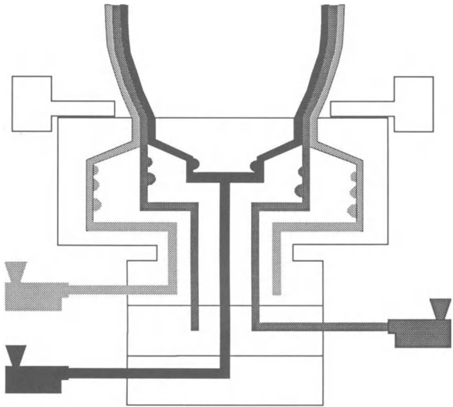

# 5.3 一些型材的挤出模头

EXTRUSION DIES FOR SOME PROFILES  

本节讨论最常用于生产一些流行挤出物的挤出头的一般设计特点。更详细的分析见相关文献（Henson，1988；Levy 和 Carley，1989；Michaeli，1992；Halasz，1993）。由于本章的性质和篇幅所限，无法对具体应用的最新发展进行讨论。新的概念，如叠加纵向和横向振荡的摆动模头（Casulli 等人，1990 年）、用于管理挤出物微观结构的剪切控制定向模头（Allan 和 Bevis，1991 年）以及边角和弯曲挤出物的生产（Miller、Lee 和 Stevenson，1991 年）将不再进一步讨论。 

## 5.3.1 管材和管道  

Tubing and pipes  

管材挤出包括将挤出头入口处的环形流动转换为模头出口处的环形流动。在解决这一问题的各种方案中，有一种方案（图 5.5，上部）使用一个心轴，心轴由支腿（即所谓的蜘蛛支腿）支撑，心轴包括适配器和平行区。这些支腿将流入的水流分成几股，然后再汇合成一股环形水流。由此产生的熔接线很容易在管道内部（非校准）表面检测到，从而降低管道阻力。因此，不仅要仔细确定支腿的轴向剖面，最大限度地减少对气流的干扰，还要保证有利于充分熔接的条件。这意味着，在模头后续锥形区的停留时间应是聚合物松弛时间的数倍。通过强制压缩比，聚合物分子在轴向被拉伸，相应的应力导致松弛时间大大缩短。因此，在较短的停留时间内就可以实现高质量的熔接（Overeijnder，1982 年）。在平行区（特征长度/厚度比为 15-30），熔体进一步均匀化，挤出膨胀和总压降得到控制。机头通常配有一个模环，其相对于芯轴的偏心率可通过定心螺钉进行调节。 

图 5.5 管材芯模。蜘蛛支撑芯棒解决方案用于挤出 UPvC（上图），而穿孔环则适用于加工聚烯烃（下图） (Battenfeld)。 

如上所述，每种管材原则上都需要一个特定的挤出头。不过，由于该工艺的经济性很成问题，不同尺寸的模头通常可以连接到同一个挤出机头。在实践中，以生产 UPVC 管材为例，通常可以使用 8 个挤出机头，将不同直径的模头连接在一起，从而生产出直径从 10 到 $710\,\mathrm{mm}$ 不等的标准管材。在某些尺寸上存在重叠，因此可以用两个不同的挤出头生产相同的产品。这一原则也适用于其他产品，如吹塑薄膜或吹塑容器。 

有许多设计方案可以避免或尽量减少熔接缝的影响。例如，心轴可以用一个 **穿孔环** 来支撑，而不是用许多支腿来支撑，因为不同流道之间的多条熔接缝比整个管道厚度上的一条薄弱熔接缝要好得多（图 5.5，底部）。在**提篮式挤出模头**（由德国 Hoechst AG 公司开发）的情况下，穿孔篮会形成径向外流。这种结构节省了空间，但也面临一些问题（Henson，1988 年）。 **螺旋心轴挤出机头** 采用了在吹膜挤出中流行的概念。进入的熔体通过在芯轴表面切割的几个单独通道进行径向分布，形成螺旋状流向模头出口。由于模体和芯轴之间的间隙在下行通道方向上增大，而螺旋槽的深度减小，因此这种流动模式逐渐转变为轴向流动。如果考虑到聚合物的流变特性，对模头的几何形状进行合理设计，熔体就会在整个环形截面上均匀分布（从而以均匀的速度流出模头），并且不会出现熔接线。也许令人惊讶的是，这一概念并没有像其优点所证明的那样被管道制造加工商频繁采用。 

最近，仪器仪表和控制技术在管材挤出中的应用大大提高了工艺的一致性，同时也节省了材料，因为可以缩小公差（设备制造商通常声称可以节省 $2–4\%$ 的聚合物成本）。与整个工艺自动化的总体趋势同步，自 20 世纪 80 年代初以来，已经可以测量（通常采用超声波技术）管道的平均直径和沿周边的厚度变化，并自动纠正最终的异常情况。这通常被称为 **模头自动定心**（这一称谓并不完全正确，因为在实际操作中，当操作员调整模唇以确保生产出厚度均匀的管材时，他是在补偿由于温度波动或重力坍塌等引起的局部流动异常，因此他实际上可能是在分散模头）。这一操作最初是通过机械系统来完成的，这些系统会物理地改变模头的几何形状。最近，热定心系统开始流行，这种系统使用的模头在圆周方向上的各个区域都是热隔离和单独控制的，可以局部改变熔体温度，从而改变压降和流动速度。 

## 5.3.2 吹膜

Blown film  

由于生产性吹膜需要将熔体塑造成环形流动，人们可能会找到与上述类似的解决方案。由于薄膜通常是垂直向上挤出的，因此垂直挤出机与中央进料的工具相连。当挤出机水平放置时，挤出机头可采用横向或中央喂料。传统的芯模有两个局限性。其一是在芯轴周围的各个流动前沿熔接在一起，从而在薄膜上形成一个重要的纵向薄弱环节。另一个原因是在下流道方向上形成了不同长度的流线（由于从水平流向垂直流的变化），在模头圆周上产生了总压降差，从而导致薄膜厚度的梯度（见公式 (5.1)）。可以通过改变部分材料的流向或改道来均衡流道长度，但由于制造、维护和清洁方面的困难，这种解决方案很少采用。此类挤出生产线通常采用的一种策略是通过某种方法将异常分布到整个薄膜周边，以避免出现明显的薄弱线或区域。通常，模头、挤出机/机头组件或牵引装置会缓慢旋转或摆动。当模头旋转时，必须安装专用的驱动装置，并精心设计有效的密封装置。非旋转模头系统的优势在于模头较小，因此需要较短的停留时间。

图 5.6 螺旋芯模示意图（半剖视）。 

上述与熔接缝和薄膜厚度变化有关的困难导致了螺旋心轴挤出机头的发展（图 5.6），详见第 5.3.1 节。熔体通常通过一个与径向流道系统（有时称为端口）相连的中央通道，或通过一个环形通道加入。后者更容易进入模头的中心区域，这对内部气泡冷却非常重要。径向通道的数量通常与螺旋通道的数量相同。不过，也可以用一个径向通道为两个螺旋通道供料（三角形过渡），或用一个径向通道为两个螺旋通道的一半供料（Rauwendaal，1991b）。吹膜模头的性能取决于其在模头圆周上产生均匀流速的能力，没有熔接缝和雾线。停留时间分布要窄，平均停留时间要短，泵送熔体所需的压力要低（Coyle，1991 年）。出口流的均匀性主要取决于螺旋的设计。设计不佳的模头会产生周期性的流动变化，这种变化等于螺旋槽的数量（Vlcek、Vlachopoulos 和 Perdikoulios，1988 年）。一般来说，增加螺旋槽的数量可显著改善流动均匀性。在工业中，通常的做法是每英寸模头直径使用 1-2 个沟槽（Rauwendaal，1991b）。总压降的一个重要部分发生在模头底部。因此，对于分子量高且分布窄的聚合物，如低密度聚乙烯和某些类型的高密度聚乙烯，可采用加宽的间隙。螺旋和模头出口之间也可设置松弛区。 

近年来，薄膜行业在产能、生产速度和厚度方面取得了重大发展。现在已经可以生产 $6\,\mu\mathrm{m}$ 的聚乙烯薄膜，卷绕速度达到 $140\,\mathrm{{m}\,\mathrm{{min}}^{-1}}$（Schafer，1994 年）。这显然需要在设备设计和工艺控制方面达到很高的水平。例如，目前有许多控制平均直径和圆周直径的技术。机械定心和热定心系统采用的原理与管道相同。机械系统经常用于这种几何形状，因为一些加工商认为，在薄膜从模头出来时出现温差是有风险的。一家重要的生产商使用模头螺栓来调节柔性模唇，从而调节模头间隙。螺栓由步进电机机械驱动。最近，有人提出了作用于冷却隔膜的控制系统。例如，有一种系统包括一个分段式自动二次空气环，位于气泡开始成形之前，为薄膜较厚的部分提供较少的气流，反之亦然。这样，薄膜的拉伸将在这些部分以不同的方式进行，任何厚度差异都会被拉平。其他系统使用单独加热或不加热的空气来调节薄膜厚度。 

## 5.3.3 平膜和片材

Flat film/sheet  

要挤出宽度相对较大、厚度均匀的厚片材或薄膜，需要将挤出机末端的圆形熔体塑造成矩形截面，使各种基本流动元素面临相似的停留时间和流动阻力。这并不容易，因为靠近剖面中心的流动流线长度明显短于靠近外围的流动流线长度。因此，根据公式（5.1），要么定义一个特定的温度场（在不同位置产生不同的流变特性），要么必须局部改变流动几何形状。在较简单的挤出机头中，垂直于主流动方向的分配通道将进入的熔体分配到整个机头的宽度上。随后，熔体均匀地流向模头出口。这种结构通常称为 T 型（图 5.7，顶部）。虽然分配通道的横截面明显大于平行流的厚度，但该系统并不能真正保证流体的均匀分布，阻力仍随宽度方向的位置而变化。实际上，这种设计只能对相对低粘度的材料起到令人满意的作用（这也是这种解决方案目前主要用于涂层的原因）。因此，校正装置的存在，如可调节通道局部厚度的扼流条和柔性唇板，对于确保挤出物的适当公差尤为重要。这些系统还可以处理加工或材料的变化。 

图 5.7 厚膜模头示意图。不同的配置旨在保证熔体在整个宽度上的均匀分布。 

可以对这些模头进行流变学设计，从而在理论上确保均匀的流动分布，即挤出宽度上均匀的平均出口速度。相应的解决方案包括 **鱼尾模头** （fishtail）和 **衣架模头** （coathanger），在这两种模头中，分配器的横截面在横向上逐渐变化（分别为线性和非线性模式，通常为水滴形横截面），而平行区在整个宽度上具有不同的长度（图 5.7）。因此，靠近模头中心的流体在分配器中停留的时间很少，但在模头的大部分长度上都必须在狭窄的间隙中流动，而靠近外围的另一个流体则会沿着分配器的大部分流动（分配器的横截面较大，因此造成的压降较小），然后流向狭窄平行板之间的出口，但停留的时间较短。在所产生的压力下，模头的偏转可能会极大地改变流动路径，因此在设计阶段就应加以考虑。根据上述推理，我们可以再次得出结论，这些模头的设计必须考虑到特定的流速和聚合物（或聚合物流变性），或者换句话说，只有在特定的粘度和产量下才能达到最佳性能。 

在实践中，由于温度的局部波动或材料的实际特性，材料的流变性可能会发生变化。这些工具还必须在挤出物的宽度，特别是厚度，以及可加工的材料范围方面表现出一定的灵活性。除上述调节系统外，还可以使用可更换的下唇、可弯曲的唇和/或局部可偏转的通道壁，或可改变挤出物宽度的系统。使用这些解决方案中的任何一种，都有可能制造出高质量的挤出物，但却无法最大限度地发挥模头的性能。液压、机电和热力系统可用于自动减少薄膜轮廓变化。热系统可能是应用最广泛的系统，它基于温度变化引起的调整部件的膨胀或收缩。 

## 5.3.4 型材

Profiles  

轮廓一词指的是各种形状，实际上包括前面讨论过的挤出物。不过，它通常指非圆形或非轴对称的横截面。一般来说，这类模头的设计取决于产品是空心的（例如窗型）还是紧凑的（“T ”型轮廓），以及横截面是简单的还是复杂的。建立最合适的流道（在流线型、停留时间分布和防止流变异常方面）的难度与需要将进入的环形流塑造成与型材截面相似的截面直接相关（如上所述，为了补偿挤出后的变形，需要挤出具有特定轮廓的熔体），型材的所有 “子截面 ”以相同的平均速度出现。因此，如果生产矩形或圆形横截面并不困难，那么设计用于生产窗框的挤出机头就需要大量的经验和技术。许多加工商试图通过精心设计型材冷却条件来中和设计不当的模头所带来的影响。然而，这往往会导致挤出物中产生重要的残余应力，或使产品在使用中发生严重变形。 

平模或板模最为简单。所需的开口位于流道的出口处，有时只需最小程度的流线型。这种解决方案虽然便宜，但显然会导致形成滞流区或散热不平衡。如今，这些模头通常由黄铜或低级工具钢制成，用于热稳定性聚合物的短期生产。只需更换板材，即可挤出不同的型材。半流线型或多级模头由许多不连续的板块组成，每个板块都有特定的横截面，但依次接近出口的形状和尺寸。这些都是长周期模头，适当的流线型可以克服材料停滞和降解的问题。流线型异型模头使用（锥形或喇叭形）适配器，使流动逐渐形成平行区，其长度可局部变化，以确保模头出口处的流动均匀（图 5.8）。当适配器的横截面呈线性减小时，流速最初会很慢，然后会显著增加。在某些情况下，这可能会导致材料过热。喇叭形适配器可以设计成线性增加速度，或在轴向保持恒定的加速流（Sors，1974 年）。然而，由于通道加工困难，这种解决方案并未得到广泛应用。 

图 5.8 流线型窗口轮廓模头（Schiedrum，1975 年）。 

图 5.9 使用锥形适配器和可拆卸嵌入件的医疗应用异型模头的局部示意图（Beddus，1989 年）。 

空心型材的生产需要插入芯棒和相应的固定板。在这一区域，基本熔体流主要是一维的，流动阻力增大。然而，在拐角处或两个或多个单独流道汇合处，平均流速会变得更高，因为金属壁上的零速（或滑速）现在被平行板之间聚合物的平均流速所取代。某些异型材，如双层板材或医疗用导管，通常使用基于较简单类似异型材几何形状的挤出机头（分别为共槽和锥形心轴）进行挤出，然后根据制造的特定几何形状进行调整（图 5.9）。 

许多型材挤出模头的内表面都镀有或涂有铬，以提供良好的润滑性并方便清洁模头。镀铬提供了一个坚硬的表面层，可抛光至精细的光洁度。有几家公司提供聚四氟乙烯浸渍的镍或铬涂层。在这种情况下，表面会变得很滑。在较高温度下加工时，最好使用二硫化钨或氮化钛涂层（Rauwendaal，1991c）。一般来说，这种类型的溶液会导致壁面滑动（与在 PVC 复合物中加入外部润滑剂的效果类似），从而有利于形成塞流条件（相当于低幂律指数 n）。在这种情况下，挤出物的膨胀以及随之而来的轮廓变形都会减小，较低的法向应力也会降低流变缺陷发生的可能性（第 5.2.2 节）。 

## 5.3.5 电线电缆

Wire and cable  

在电线包覆中，一层薄薄的聚合物通过十字头模头挤出在铜线周围，挤出速度通常超过  $2000\,\mathrm{m}\,\mathrm{min}^{-1}$  。最内层起屏蔽作用，中间层通常是聚乙烯绝缘材料，外层起屏蔽作用。因此，该技术可用于一次和二次涂覆，即覆盖金属导体或涂覆先前绝缘的导线。 

聚合物通过侧向供料进入模头，并分布在心轴周围，预热导体在心轴内匀速前进。因此，熔体相对于初始流动方向偏离 $90^{\circ}$ 。随后，熔体在环形间隙中流向模头出口，在那里覆盖导体。通常使用两种涂层技术（Michaeli，1992 年）（图 5.10）。一种是压力绝缘，即熔体在流出模头之前被推向导线。这样可以避免最终在单根导线之间形成气泡，影响电缆性能。另一种是管式涂覆，挤出的管子在离开模头后立即被推到导体上，这可以通过两者之间的速度差或使用真空来实现。这种技术主要用于二次涂覆，即涂覆先前绝缘的导线。 

图 5.10 压力或压缩（上）和 管式（下）线材涂覆工艺。  

与电缆包覆有关的一个众所周知的问题是空洞的形成。这是由于聚合物的外部首先凝固，内部区域无法在凝固后自由收缩。塑料与金属的附着力下降，聚合物内部会形成宏观空隙，从而降低电缆的介电强度。此外，侧进料会造成不同流线长度的差异，进而影响绝缘厚度分布（最终可能影响规定的电缆性能）。对于其他环形挤出物和脂膜，可以从流变学角度设计一个流动分布系统，确保在整个模头圆周内流速均匀。如图 5.11 所示，最常用的技术之一是使用心形分配系统，将挤出机进入的材料分成两个通道，随着流动在轴向的推进，通道变得越来越宽和越来越浅。心形轮廓的计算是为了在外壁和内壁附近产生类似的流动阻力。根据适用于其他几何形状的原则，计算出适合特定流变和操作特性的流道。因此，为了确保可加工的尺寸和材料范围具有一定的灵活性，或补偿加工条件的变化，模头可互换定心系统被广泛使用。 

图 5.11 心形线缆涂覆分布系统（改编自 Michaeli，1992）。 

## 5.3.6 多层挤出

Multilayer extrudates  
  
多层挤出通常由两种或两种以上不同的聚合物或基于同一种聚合物的化合物组成，可通过层压（这是一种多步挤出工艺，每层单独挤出，部分或全部冷却后再挤出下一层）或共挤（各熔体层同时从模口挤出）生产。Michaeli（1992 年）根据各熔体流在模头的流动模式对现有的共挤技术进行了分类。因此，它们可以以三种方式流动。 

首先，它们可以在模头的整个长度上单独流动。各种聚合物熔体在模头内的单独通道中流动，并在模头出口处被推挤到一起。这一过程通常由压力辊或正压辅助。具有明显不同流变特性的材料（和/或在不同温度下流动的材料）都可以用这种技术进行加工。 

其次，它们可以在模头的大部分区域内分开进行，然后在适配器或平行区的压力作用下接触。图 5.12 展示了三种不同材料（分别为 A、B 和 C）的连接情况。三层流动模式由每种聚合物的流变学以及厚度和速度的相对差异决定。在所考虑的示例中，材料 A 和 B 表现出相似的流变性，而聚合物 B 和 C 的特性却大相径庭。这可能会导致 B 和 C 之间的界面不稳定，在挤出物表面可观察到抛物线图案。相对较高的剪切应力（通常在 ${0.03}$ and $0.06\,\mathbf{MPa}_{.}$ 之间）有利于这种现象的发生。因此，使流道的几何形状和操作条件适应待处理聚合物的特定组合尤为重要。各个流道通常相邻，以优化温度控制，并尽量减少各个流道的长度差异。然而，这种技术结构复杂，因此造价昂贵。尽管如此，这种技术仍然非常流行，并已被用于生产大多数可用的挤出几何形状。例如，图 5.13 显示了一种三层吹膜共挤模头。不同的熔体以传统的螺旋形芯棒几何形状流动，然后在平行区入口处汇合。与单熔体挤出一样，可提供模头定心系统，整个模头可缓慢旋转，以分散任何异常。此外，通过使用可互换的模块化分流板系统，可改变薄膜中所用材料的组合顺序（ABA、BAB、ABC、CBA 等），从而提高了应用的灵活性。还应注意的是，薄膜层数不必与喂料挤出机的数量相匹配。通过适当的分流板或模头设计，其中一种材料--通常是粘合剂--可以作为一个以上的薄膜层插入。 

图 5.12 在共挤过程中连接三个单独的流道。 

图 5.13 吹塑共挤模头的工作原理  

最后，熔体流可以在挤出模的整个长度上一起流动（喂料块工艺）。这种技术通常用于平膜生产，并允许在共挤过程中使用传统挤出模头挤出单一熔体。分流板按照规定的顺序将来自不同挤出机的熔体通过输送管混合在一起（见图 5.14）。更换插在挤出模和传送管道之间的分流板块，可以随时改变挤出层的分布。 

图 5.14 模块化平膜共挤系统的工作原理 
 
熔体应具有相似的粘度，因为层流性质确保了它们的分离。图 5.15(a)显示，当 A 层和 B 层的体积或粘度相似时，各层的分布稳定而均匀。当不同层的横截面或相对粘度存在明显差异时，分布会随着流动的发展而变化。在图 5.15(b)中，粘度较低的流体 A 开始包裹粘度较高的熔体 B。另一方面，如果 A 的体积远小于 B 的体积，则很难确保界面延伸至挤出物的整个宽度。A 材料会在 B 表面堆积成条状（图 5.15(c)）。与各层粘度差异有关的其他问题包括挤出物弯曲和挤出物宽度上各层厚度的变化。前者是由于粘度较低的层溢出造成的。第二种情况在平膜共挤中很典型，其原因是各层在分流板中逐渐重新排列。要尽量减少这些问题，就必须正确设计模头和传送管道（横截面应为矩形），并促进充分的流变性。重要的是要降低界面剪切应力，并使界面粘度和界面弹性（决定界面法向应力）相匹配。 

  

图 5.15 共挤过程中由于单种聚合物的粘度或流动体积不同而导致的层间重新排列。 
