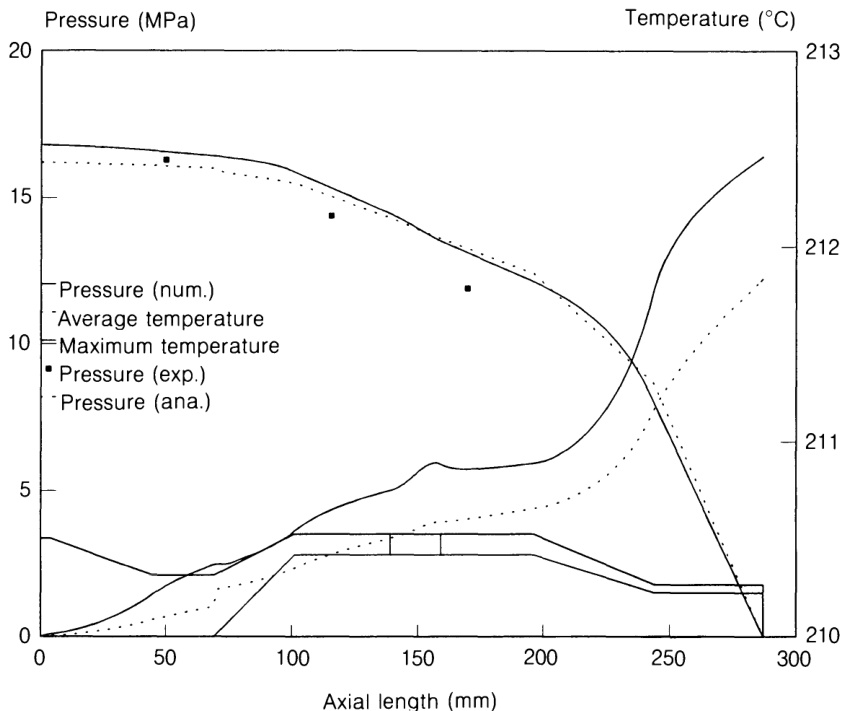
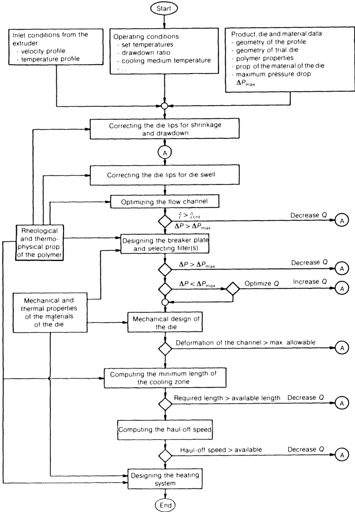
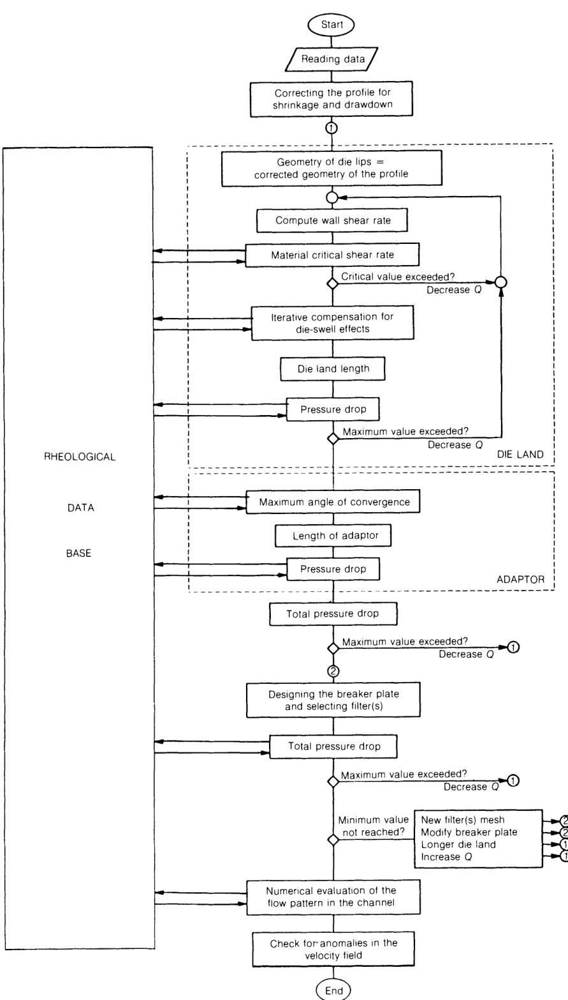
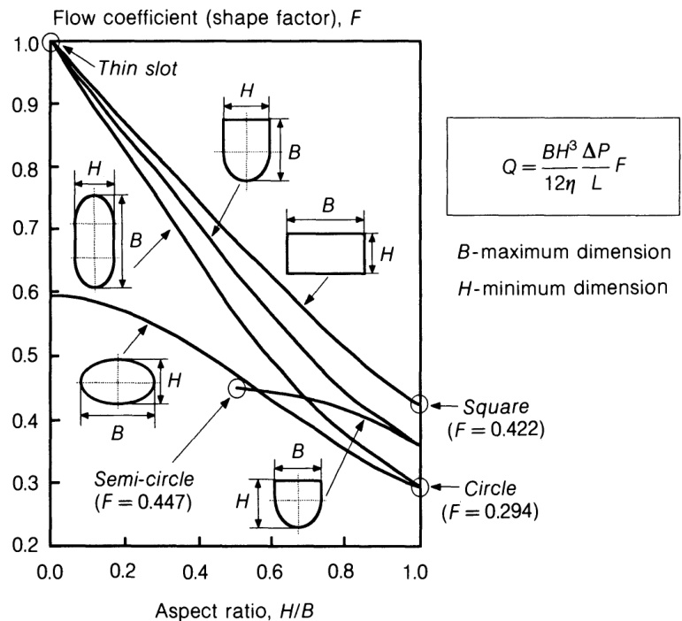
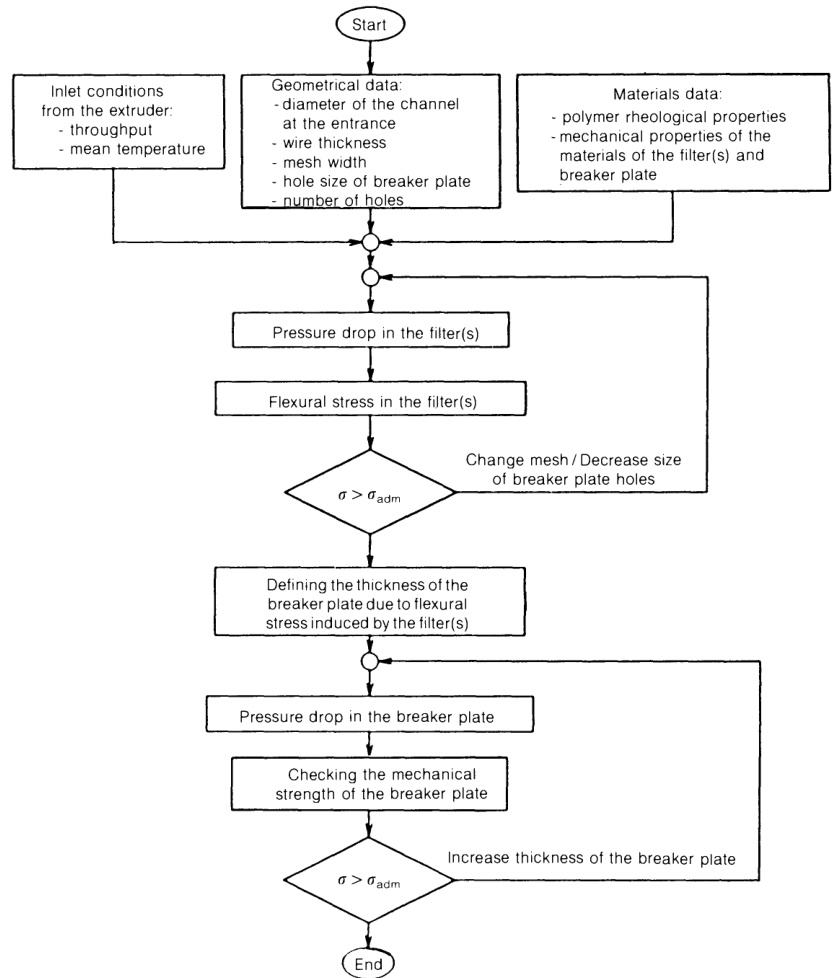

# 5.4 模头设计的基本原则

虽然本书主要涉及挤出机和成型机头的操作，但介绍一些模头设计的一般原则似乎也很有意义，因为这些原则不仅可以说明模头内外各种相关参数之间的相互关系，而且有望为加工商经常遇到的一些设计问题（如制造新模头和扩大或缩小现有模头的尺寸）提供指导。此外，了解模头设计的原则和限制也有助于确定操作行为的可能性和实际效果。 

挤出模头的设计主要包括为材料定义合适的流动路径，确保流线型、良好的熔体均匀性和温度分布、可接受的压降、狭窄的停留时间分布、无任何流动缺陷，以及在尽可能高的流速下生产出具有所需形状和尺寸公差的横截面。因此，对于任何特定的应用（产品、材料和典型的运行条件），都有必要根据所开发的适当速度、温度、应力、剪切率、压降和停留时间剖面来确定几何参数，如汇合点、压缩比、相对通道长度和流动限制轮廓。设计者还应尽可能全面地考虑挤出后现象对挤出物沿挤出生产线变形的影响。如前所述，这些现象包括挤出物膨胀、收缩、重力、压缩力和浮力。尽管挤出是一种宽容的工艺，因为它允许在校准阶段进行尺寸修正，但在确定模唇横截面时，最好还是将这些现象考虑在内，以避免挤出物中残余应力的积累所造成的后果。其他相关的设计步骤包括模头组成部件的机械设计、加热系统的位置和功率要求、校准器的设计以及冷却区最小长度的确定。Michaeli (1992) 在其独特的模头设计著作中对这些方面给予了关注。 

上述各项任务的复杂性以及计算机能力和性能的快速发展，促进了计算机辅助工程（CAE）方法在模头设计中的应用。因此，出现了许多商用模头设计软件包。因此，本节将利用这一趋势解释该方法目前的局限性，并介绍模头设计策略。显然，任何计算序列都可以在计算机程序中实现。目前可用的商用软件包可以不同程度地模拟模头内部的流动，提供定量信息（如温度场和速度场、压降和停留时间），有经验的操作员可以利用这些信息来评估现有模头的性能，或评估新设计的适当性（O'Brien，1992 年）。由于可以增加新的部分，或很容易修改当前的几何结构，而且只需花费很少的精力就能改变加工条件和材料流变学，因此耗时或困难的实验可以减少到最低程度，并可为原型设计选择一些替代设计方案。这些程序利用一组特定的边界条件求解一般的运动方程和能量方程，并与描述燃料流变行为的构成方程（通常考虑非牛顿粘性或粘弹性燃料）相耦合。如今，螺旋心轴吹膜、共混模和鱼尾模通常都是通过这种方法设计的。 

有两种软件包可供选择。通用程序可提供多种构成模型，模拟沿操作员输入的几何形状的流动。采用数值方法（通常是复杂的计算机密集型方法），使用有限元、有限差分或体积控制技术。操作员定义几何形状，选择边界条件，输入材料和运行特性，程序就会自动生成网格，并通过连续增量求解流动方程，最终得到一个收敛的解决方案。对于许多不同的实际问题，都可以用数值或图形的方式显示结果，如速度和温度曲线、流线和沿流线的数值。各种程序的主要区别在于所采用的数值算法、可用的构成模型类型、所展示的图形功能以及对用户的友好程度。另一个软件系列是针对特定的模头几何形状开发的，即平膜、吹膜、吹塑和涂丝。这些程序通常使用直接的屏幕数据输入系统，并采用较简单的流道模拟技术。在某些情况下，算法能够计算出产生完全均匀挤出物的流道几何形状。 

为模头设计目的模拟聚合物熔体流动的主要困难之一是将计算时间控制在合理范围内，特别是对于复杂的流道。例如，Rakos、Kiani 和 Sebastian（1989 年）开发了一种三维有限元求解技术，以获得非轴对称异型模的适配器和平行区的速度和压力分布。在一个简单的 \*L'- 形轮廓的情况下，使用 27 个节点砖元素，在 ETA10 超级计算机上运行流动模拟大约需要 45 个 CPU 分钟，而在 VAX GPX/II 工作站上运行则需要 48 个 CPU 小时。因此，必须开发适当的近似方法来简化几何和/或流动方程。应尽可能将真实的三维流动简化为二维或一维问题（当三个或两个速度分量分别取决于两个或一个空间坐标时，有时会考虑 2.5 维和 1.5 维），如下所示（Vergnes 和 Agassant，1986 年）：  

- 模头通常可视为窄通道，即与其他两个维度相比，一个维度通常明显狭窄。然后，流动可以用平行板之间完全展开的流动方程来描述，间隙等于局部间隙；这可以应用于管道或平膜模头的出口区域。  
- 当通道深度与外半径相比较小时，环形流几何图形可以方便地展开而不会产生明显误差，从而使用笛卡尔坐标系。这种技术通常用于研究涂丝模头的十字头。  
- 复杂的流道可分为不同的基本流道。通常用这种方法研究包覆模、异型模和螺旋心轴模。  
- 由于挤出过程中流速较低，聚合物温度与模壁温度相似，因此通常可以使用通道深度的平均温度。 

  

图 5.16 管材芯模中的温度和压力轴向分布图（Carneiro，1994 年）

例如，图 5.16 比较了简单分析等温分析的预测结果与典型高密度聚乙烯熔体通过传统芯棒型管材挤出模头的非等温数值模拟结果（采用有限差分技术）（Carneiro，1994 年）。由于粘性耗散，平均温度上升了不到 ${2}^{\,\circ}\mathbf{C}$ ，而最高温度上升了大约  ${2.5}^{\,\circ}\mathbf{C}$ ，其他数值方案也得到了类似的结果（Sebastian 和 Rakos，1985 年）。分析计算得出的压降与数值计算得出的压降非常相似。粘滞耗散的影响显然与模头尺寸、聚合物流变学和吞吐量有关。尽管如此，计算得出的温度升高一般低于 ${10}^{\,\circ}\mathbf{C}$ （Sebastian 和 Rakos，1985 年）。因此，工业公司在研究熔融聚合物通过挤出模头的流动时，最合适的 CAE 工具（或计算方案）取决于问题的性质（产品形状、规定公差、产量、材料）、允许用于开发的时间、现有的技术和科学知识以及可用的计算资源。 

除少数例外情况外，无论其复杂程度如何，目前可用的程序基本上都是评估工具。针对特定条件的流动模拟结果可以最大限度地减少实验工作的需要，但只能间接地用于模头设计。事实上，应该由操作人员来决定流动条件（或模头几何形状）是否合适或需要改进，以及应该在哪些方面进行必要的更改。最后，大多数程序只能处理模头内的流体流，而忽略了所有挤压后现象的影响。但 MICROPUS 软件是个例外，它可以进行模头的热设计（Menges, Kalwa and Schmidt, 1987）。挤压模头设计 CAE 的进一步发展应结合在了解工艺的各个环节（通过相对复杂的几何形状的粘弹性流动、模头出口处的挤出物膨胀、复杂中空型材的冷却、微观结构和形态的发展）方面所取得的专有技术，并将其整合到一个能够解决实际工程问题的软件包中。要实现这一目标，有两个先决条件。 

一是研究加工问题的反演公式。如上所述，在传统的模拟技术中，描述流动的方程与描述材料特性的构成方程相耦合，并根据给定的操作和几何条件进行求解。从而获得有关流动条件的信息。逆向模拟技术相当于求解与构成方程耦合的问题方程，但现在是为了确定模头几何形状或操作条件，以诱导预先指定的流动模式或产品几何形状。由于这种方法特别复杂，另一种解决方案是开发优化方案，在程序中实施决策机制和一些有关问题的专门技术。 

另一个先决条件是为模头设计建立一个完全集成的总体战略，按适当的顺序考虑设计中的各种物理、热学、流变学和机械方面的问题。这样的方案需要使用全面的流变学和物理材料信息，但遗憾的是，由于需要大量的实验工作，这些信息很少能得到。因此，数据库的存在或使用快速生成相关数据的技术（如第 5.2.2 节中介绍的技术）至关重要。 

图 5.17 描述了设计挤压模头的可能一般策略（Covas、Carneiro 和 Brito，1991 年；Michaeli，1992 年）。所涉及的步骤主要包括：初步确定模唇；确定流道布局；设计破碎板和过滤器（如果有的话）；评估模头部件的机械阻力；计算挤压后现象对挤出物形状的影响；以及设计加热系统。模头被分成一系列几何形状较为简单的模块，可以更容易地进行研究，即研究压降和流速之间的关系。此外，通过勾画模唇的横截面来开始设计程序，可以对任何相邻模块（在挤出机方向）的暂定形状进行一致的定义。  

  

图 5.17 设计挤出模头的一般策略（Covas、Carneiro 和 Brito，1991 年） 

除了聚合物的流变和热物理性质外，典型的输入数据包括模头材料的机械性能和热性能、模头几何形状的初始猜测、操作条件（包括挤出机/模头界面温度和速度的边界条件）、挤出机/模头界面温度和速度的边界条件、挤出机/模头界面温度和速度的边界条件。挤出机/模头界面温度和速度场的边界条件），以及一些实际的边界操作值（如最大挤出机输出或可用功率、最大总压降和局部最高温度）。

1. 初步确定模唇。由于挤出物的任何后挤压都应通过重新设计模唇来补偿，而重新设计模唇又会改变流道的尺寸，进而改变模头膨胀，因此应寻求一种迭代程序。这将在第 5.5.4 节中详细阐述。 

2. 模头的流变设计（流道的定义）应保证：  

- 不存在任何流动异常。不能达到临界法向应力；应确定并仔细评估温度场和速度场；应促进各熔体流充分熔接的条件。  
- 可接受的压降。要在挤压机内实现充分的流体混合和熔化，需要一个最小压降。最高限值与聚合物的机械功（可能导致其降解）、对工艺输出的影响、挤出机电机的可用功率以及若干挤出机和挤出机部件（即挤出机螺杆和挤出机固定螺栓）的机械阻力有关。 

图 5.18 列出了模头流变设计的相应计算顺序，包括平行区、适配器、破碎板和过滤器 （Covas、Carneiro 和 Brito，1991 年；Carneiro，1994 年）。如上图所示，计算是从模唇向适配器方向进行的。在补偿了挤出物因冷却时的收缩而导致的尺寸变化后，对挤出物的膨胀进行估算。对于非轴对称型材，分析应包括整个横截面的质量平衡，以确定局部模头的陆地比率，确保以均匀的平均速度挤出产品。适配器的收敛锥度（线形或喇叭形）应根据法向应力进行验证，将达到的值与临界极限值进行比较。如有必要，校正程序包括降低收敛和/或质量吞吐量。断流板和过滤器也必须考虑压降。应定期将总压降与规定的极限值进行比较，以决定是否应更新运行条件。 

如上所述，模拟聚合物流经构成模头的多个通道时，需要解决一系列边界条件下的 连续性、动量和能量方程，并结合相关的构成模型。尽管上述近似方法简化了这一任务，但仍需要使用数值技术。一般的处理器/设计人员往往不容易使用这些技术，而且在设计序列的现阶段也没有理由使用这些技术。然而，如果说文献中对形状简单的管道（如圆形或环形通道、平行板）中的等温非牛顿流体流动进行了大量研究，那么对任意截面形状的流量-压力关系进行预测的方法却鲜有报道。不过，某些分析方程显然能得出合理的预测结果，因此可用于模头设计。例如，Schenkel（1981 年）研究了流经窄矩形通道的情况，并引入了一个长宽比系数 $(W/H)$，用于量化侧壁的阻滞效应。该方法与通常用于模拟挤压机泵送段流动的方法类似。Lahti (1963)、Kozicki、Chou 和 Tiu (1966) 以及 Miller (1972) 采用了类似的方法，定义了受形状系数影响的一般流动方程。图 5.19 显示了 Lahti 针对不同长宽比计算出的一般方程和 “流动系数”。Weeks (1958) 和 Lenk and Frankel (1981) 提出了许多不同形状的公式，包括线性锥形狭缝。White 和 Huang（1981 年）研究了通过矩形和梯形模头的流体。Shenoy 和 Saini（1984 年）也采用了 Lenk 和 Frankel（1981 年）提出的方法，根据聚合物的熔体流动指数计算各种不同形状管道中的压力损失。 

  

图 5.18 确定简单型材模的流道  

在这一阶段，流道的初步定义已经完成。下一步是对流道的适当性进行数值评估。这将为挤出物膨胀、粘性散热、速度场以及平均停留时间和停留时间分布提供更准确的信息。这里的计算是在模头出口方向进行的。由于几何形状或加工条件的任何必要修改都会引发新的分析优化循环，因此该程序可能会涉及多次数值/分析迭代。 

  

图 5.19 不同长宽比的形状系数，根据 Lahti（1963 年）  

3. 过滤网和多孔板。由于多孔板孔的大小决定了过滤网在不因弯曲应力而断裂的情况下可承受的最大压力，因此应验证这些附件的机械阻力。因此，过滤网和多孔板的设计包括流变学和机械方面（可按图 5.20 所示的顺序进行）（Masberg，1981 年；Covas、Carneiro 和 Brito，1991 年）。每个过滤器组产生的压降可由以下公式近似得出（Bauer、Ehrmann 和 Schneider，1981 年）：  

$$
\Delta P=\frac{8d k}{w}\left\{\frac{2m[(3n+1)/n](w+d)^{2}}{\rho F w^{3}}\right\}^{n}\tag{5.12}
$$  

其中，$_m$ 为质量吞吐量，$\rho$ 为熔体密度，$w$ 为网格宽度，$d$ 为金属丝直径，$F$ 为有效流动面积；$k$ 和 $n$ 为幂律常数。 

文献中还提出了其他近似方法（Carley 和 Smith，1978 年；Kaplan、Morland 和 Hsu，1979 年）。由于滤波器在与断流板孔相邻的区域弯曲，因此断流板孔的大小引起的挠度应低于导线的极限值（Masberg，1981 年）：  

$$
f_{\operatorname*{max}}=\frac{R\Delta P}{64N}\cdot\frac{5+\nu}{1+\nu}\tag{5.13}
$$  

The corresponding maximum stress is:  

$$
\sigma=\frac{S E}{2}\left(f_{\mathrm{max}}/R\right)^{2}\tag{5.14}
$$  

在这些等式中，$\Delta P$ 是总压降，由等式 (5.12) 计算得出；$R$ 是多孔板孔的半径；$\nu$ 是泊松系数；$N$ 是过滤网的刚度（来自板的理论），由以下公式得出：  

$$
N=\frac{0.01E h_{s}^{3}}{12(1-\nu^{2})F^{(0.75)}}\tag{5.15}
$$  

$s$ 是安全系数；$E$ 是金属丝的杨氏模量；$h_{s}$ 是过滤器的总厚度，取值为 $d(1+d/w)$。 

多孔板由许多平行的短孔组成，因此入口效应起着重要作用。可以通过人为增加通道长度来确定其影响，以产生相同的等效压降：  

$$
L^{*}=(L/R+6)R\tag{5.16}
$$  

其中 $L$ 为实际长度。多孔板厚度可通过以下公式求得（Masberg，1981 年）：  

$$
H=B D(\Delta P S/\sigma_{\mathrm{adm}}\alpha)^{0.5}\tag{5.17}
$$  

其中，$\boldsymbol{B}$ 是一个考虑到多孔板夹紧条件影响的系数，通常在 0.3 和 0.45 之间变化；$D$ 是多孔板直径；$Δ P$ 是总压降值（由于沿单个孔的压力流而计算出的值应为原来的两倍甚至三倍，以预计压力流的影响）。 45; $D$ 多孔板直径; $\Delta P$ 总压降（沿单个孔的压力流计算值应加倍甚至三倍，以预计过滤网部分堵塞或挤压过程开始时出现压力峰值的后果）； ${\boldsymbol{\sigma}}_{\mathbf{adm}}$  材料的极限应力；以及 $_{\alpha}$ 由于板上存在孔洞而导致的应力集中，其值为 $(1-2R/t)$ ，其中 t 表示半径为 $\pmb R$ 的孔洞中心之间的距离。在实践中，孔的数量可以用 $A_{\mathrm{c}}/0.866t^{2}$ 来定义（Masberg，1981 年），其中 $A_{\mathfrak{c}}$ 是多孔板的表面积。 

  

图 5.20 过滤网和多孔板的机械和流变尺寸（Covas、Carneiro 和 Brito，1991 年）

1. 模头的机械设计包括上述的一些计算，但一般都要考虑在运行过程中作用在整个模头上的所有力以及由此产生的变形。一般来说，这些力包括模壁剪切力、压力和压缩力。模头的机械设计有两个目标。首先是根据模头部件对外力的抵抗力来设计模头。Michaeli （1992 年）对这一问题进行了专门研究，制定了一些一般设计规则，并将蜘蛛支撑芯模和脂肪薄膜/片材模作为案例研究。第二个目标是确定流道的变形并补偿其影响。 

2. 现在应更详细地分析挤压后现象。热传导计算可确定发生最相关形状变形的时间段（或轴向距离）。如果有拉伸、冷却和形态发展的热力学模型，就可以确定挤出物的轴向轮廓，从而为确定模唇的配置提供所需的信息。最近，Duffo、Monasse 和 Haudin（1991 年）对聚丙烯流延膜挤出进行了研究，并建立了一个在空气中拉伸的热力学模型和一个在轧辊上冷却的纯热模型，其中考虑到了聚合物结晶。还对 “缩颈 ”和边缘 “串珠”（沿薄膜外围均匀增厚）现象进行了预测（d'Halewyu、Agassant 和 Demay，1990 年）。 

3. 模头的热设计。加热系统的总功率可通过模头的能量平衡来估算（Michaeli，1992 年）。也可以确定每个加热器的位置和功率，但这需要了解流道和模体中的温度场。工艺中涉及的各种热流包括  

$\dot{Q}_{\mathrm{me}}$ : 与熔体一起进入模头的热流；   
$\dot{Q}_{\mathrm{ma}}$ : 与熔体一起流出模头的热流；   
$\dot{Q}_{\bf k l}$ : 通过对流向周围环境散失的热量；
$\dot{Q}_{\mathrm{rad}}$ : 辐射造成的热损失；  
$\dot{Q}_{\mathrm{diss}}$ : 在模头中耗散的能量；   
$\dot{Q}_{\mathrm{H}}$: 加热器向模头提供的能量（这是需要确定的值）。  

根据能量平衡：  

$$
\dot{Q}_{\mathrm{H}}=\dot{Q}_{\mathrm{kl}}+\dot{Q}_{\mathrm{rad}}-\dot{Q}_{\mathrm{diss}}-(\dot{Q}_{\mathrm{me}}-\dot{Q}_{\mathrm{ma}})\tag{5.18}
$$  

其中

$$
\dot{Q}_{\mathrm{kl}}=A\alpha_{\mathrm{kl}}(T_{\mathrm{c}}-T_{\mathrm{a}})\tag{5.19}
$$  

$$  
\dot{Q}_{\mathrm{rad}}=A\varepsilon\sigma(T_{\mathrm{c}}^{4}-T_{\mathrm{a}}^{4})\tag{5.20}
$$  

$$  
\dot{Q}_{\mathrm{diss}}=m\Delta P/\rho\tag{5.21}
$$  

$$  
\dot{Q}_{\mathrm{me}}-\dot{Q}_{\mathrm{ma}}=m C_{\mathrm{p}}(T_{\mathrm{e}}-T_{\mathrm{s}})\tag{5.22}
$$  

 
其中 $\pmb{A}$ 为压模表面积；$\alpha_{\mathbf{k}1}$ 为自然对流传热系数；$\varepsilon$ 为发射率；$\sigma$ 为斯蒂芬-波尔兹曼常数；$_m$ 为质量吞吐量；$\Delta P$ 为压模中的压降； $\rho$ 聚合物密度；$C_{\mathfrak{p}}$ 聚合物比热；$T_{c}$ 模头表面温度；$T_{\mathbf{a}}$  室温；$T_{\mathfrak{e}}$ 模头入口处的熔体温度；以及 $T_{\mathbf{s}}$ 模头出口处的熔体温度。 