# 5.5 模头设计的具体内容

SPECIFIC ASPECTS OF DIE DESIGN  

## 5.5.1 吹膜

Blown film  

如第 5.3.2 节所述，在吹膜挤出过程中，避免熔接缝问题的最佳方法是采用螺旋心轴模头结构，在这种结构中，最初流向心轴上加工的螺旋通道的进料流逐渐转变为轴向环形流。这种转变是由螺旋槽深度的逐渐减小以及心轴和模体之间间隙的同时增大造成的。这种模头最初由 Procter（1972 年）进行研究，并确定了其一般功能原理。后来的分析基本上逐渐放弃了最初采用的一些简化方法（Kurzbuch，1974 年；Ast，1976 年；Helmy 和 Worth，1980 年；Wortberg 和 Schmitz，1982 年；Saillard 和 Agassant，1984 年；Vlcek、Kral 和 Kouba，1984 年；Perdikoulias、Vlcek 和 Vlachopoulos，1987 年；Rauwendaal，1987 年；Vlcek、Vlachopoulos 和 Perdikoulias，1988 年；Benkoucha 和 Sebastian，1989 年）。模头基本体积的质量平衡结果（见图 5.21）： 

$$
Q_{1}-Q_{2}=Q_{3}-Q_{4}\tag{5.23}
$$  
 
其中，$Q_{1}$ 和 $Q_{2}$分别表示元件入口和出口处的螺旋压力流，$Q_{3}$ 和 $Q_{4}$分别表示同一元件中流入和流出的轴向流。假设流体为等温流和幂律流体，则螺旋流的计算公式为 (Rauwendaal, 1987)： 

$$
Q_{\mathrm{hel}}=\frac{F W H^{2}}{2[(2n+1)/n]}\,\left(\frac{H}{2k}\,\frac{\mathrm{d}P}{\mathrm{d}z}\right)^{1/n}\tag{5.24}
$$  

 
其中，$k$ 和 $\pmb{n}$ 是幂律常数，$W$ 和 $\pmb{H}$ 是局部通道尺寸，${\pmb F}$ 是通道形状系数，${\bf d}P/{\bf d}z$ 是下行通道方向的压降。

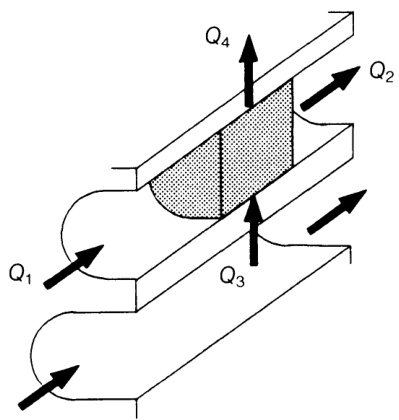  

图 5.21 螺旋心轴元件的质量平衡  

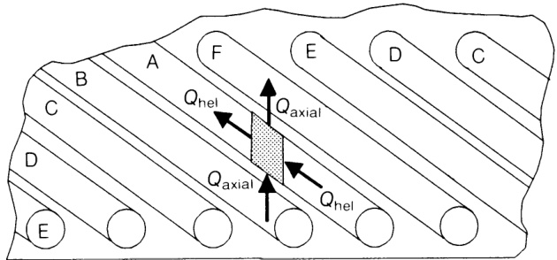  

图 5.22 展开的螺旋心轴，显示了各种螺旋通道和相关流程。 

轴流为（Rauwendaal，1987 年）：

$$
Q_{\mathrm{axial}}=\frac{\delta^{2}}{2[(2n+1)/n]}\,\left(\frac{\delta}{2k}\,\frac{\mathrm{d}P}{\mathrm{d}y}\right)^{1/n}\tag{5.25}
$$  

其中，$\delta$ 为芯轴与模体之间的间隙，$\mathbf{d}P/\mathbf{d}y$ 为轴向压降。现在，我们可以设想一个循序渐进的过程，沿着相邻螺旋元件之间的流线直到螺旋的末端。图 5.22 是心轴展开的示意图。公式 (5.23) 被连续应用，每个流量的值（由公式 (5.24) 和 (5.25) 给出）被局部更新。螺旋的第一个和最后一个流动元素具有特定的边界条件。 

与 Procter（1972 年）不同，Rauwendaal（1987 年）没有假设从螺旋起点到终点的压力下降是线性的。相反，螺旋方向的压降通过螺旋角（即螺旋间距）与横跨通道的压降相关。Saillard 和 Agassant（1984 年）以及 Vleck、Kral 和 Kouba（1984 年）采用了类似的方法，但放宽了之前的一些假设。Perdikoulias、Vlcek 和 Vlachopoulos（1987 年）对这三种模型进行了比较，得出的结论是，它们在总压降、沿螺旋的压力分布和沿模唇圆周的最终流量分布方面产生了明显不同的结果。尽管如此，预测的总体趋势是一致的，所有模型都显示流动均匀性随幂律指数 n 的增加而增加。 

Kurzbuch (1974)、Ast (1976)、Helmy 和 Worth (1980) 以及 Wortberg 和 Schmitz (1982)还发表了其他一些假设等温流动条件的一维分析。更复杂的技术也被应用于螺旋心轴模头的研究。例如，Vlcek、Vlachopoulos 和 Perdikoulias（1988 年）在有限数量的控制体积上使用了幂律流体的集合参数法，而 Benkhoucha 和 Sebastian（1989 年）则使用了流体分析网络来模拟模头内部的二维等温流。事实上，设计不当的螺旋心轴模头会导致间隙圆周上的流动不均匀，以及周期性的流动变化（通常等于模头中的螺旋数量（Vlcek、Vlachopoulos 和 Perdikoulias，1988 年））。 

上述分析还可用于评估操作和几何参数对模头性能的影响。除了聚合物流变（如温度场）的作用外，还有六个重要的几何因素：螺旋通道数、螺旋角、螺旋宽度、螺旋初始深度、芯轴和模体之间的初始间隙以及芯轴和模体之间的最终间隙。螺旋通道数、初始环形间隙和螺旋角通常被视为三个主要变量（Coyle，1991；Rauwendaal，1991b）。一般来说，随着通道数量的增加，水流均匀性会显著提高。初始环形间隙的值也可以优化。增大间隙后，流量变化会减小，达到最小值后又会增大。事实上，在间隙足够大的情况下，轴向的环形流动会立即形成，但不会参与螺旋流动（因此会产生焊缝）。减小螺旋角通常可以改善流动的均匀性。然而，由于相应的压降也会增加，因此应寻求折中方案（Rauwendaal，1991b）。形成环形流动的模口对总压降的影响很大。因此，其设计应考虑到待加工聚合物的流变性。 

## 5.5.2 平膜和片材 

Flat film/sheet  

T平膜或片材模头的设计重点在于确定分流板或分配通道，以确保生产出厚度和速度均匀的挤出物。如前所述，这相当于保证总的流动阻力相同，而不考虑流动路径，并且每条流动路径的停留时间相同。另一个重要的设计因素是模头因压力而产生的机械变形，通常称为 **蛤壳(clamshelling)** 。由于模头在边缘处被夹紧，最大的变形发生在中心，从而导致该区域的不平衡增量流。不过，必须注意的是，调整模唇以补偿夹壳现象会影响整体压降，进而影响产量。在实践中，平膜/片材模头的设计各不相同，包括分流板外形、唇板调节系统的结构、限流条的最终存在、所使用的加热器类型（通常为板式元件或筒式元件）以及整体尺寸。 

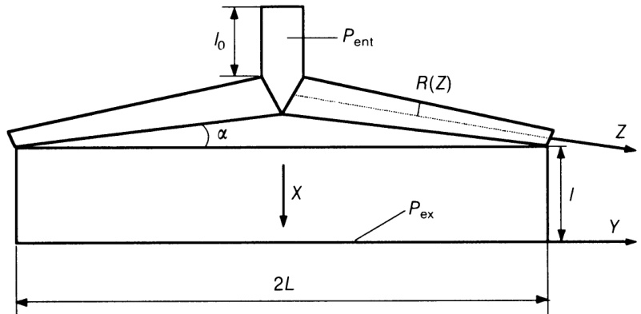  

图 5.23 线性锥形歧管的尺寸（Vergnes、Saillard 和 Plantamura，1980 年）。 

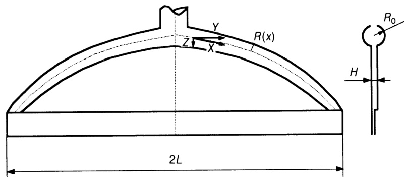  

图 5.24 曲线锥形歧管的尺寸（Rauwendaal，1991a）。 

Charbonneaux（1991 年）和 Rauwendaal（1991 年 a）回顾了文献中针对 T 型、鱼尾型和共槽模头提出的一些流动分析。特别是，Charbonneaux（1991 年）介绍了每种情况的假设条件和相应的设计方程。例如，为了使图 5.23 所示几何形状的线性分流板模头确保整个宽度上的均匀流速，分流板圆形截面 $R(z)$ 应遵循公式（Vergnes、Saillard 和 Plantamura，1980 年）：  

$$
R(z)=\left[\frac{(1+3n)}{2\pi(1+2n)}(L-z\cos\alpha)\right]^{n/(1+3n)}\left(\frac{H^{1+2n}}{\sin\alpha}\right)^{1/(1+3n)}\tag{5.26}
$$  

相应的流速为 ：

$$
Q={\frac{n}{2n+1}}L h^{(1+2n)/n}\left[{\frac{P_{\mathrm{ent}}-P_{\mathrm{ex}}}{2k}}\right]^{1/n}{\frac{1}{\left(1+L\tan{\alpha}+2^{n}l_{0}\sin{\alpha}\right)^{1/n}}}\tag{5.27}
$$  

其中 $k,n$ 为幂律常数，$P_{\mathrm{ent}}$ 和 $\scriptstyle P_{mathbf{ex}}$ 分别为模头入口和出口压力。公式 (5.26) 表明，系数 $\pmb{n}$ 和流形角 ${α}$ 越小，流形截面越大。这些方程是针对理想的线性锥形模头推导出来的，可以通过一些近似方法适用于实际模头的几何形状（Vergnes、Saillard 和 Plantamura，1980 年）。对于具有圆形流形 $R(y)$（见图 5.24）和缝隙通道长度 $Z(y)$（Matsubara，1980 年；Charbonneaux，1991 年）的曲线锥形共挤模头，可以使用以下方程  

$$
R(y)=\frac{m^{1/[3(n+1)]}}{\pi^{1/3}}\left[\frac{1+3n}{2(1+2n)}\right]^{n/[3(n+1)]}H^{2/3}(L-y)^{1/3}\tag{5.28}
$$  

$$

{Z(y)=\displaystyle\frac{3\sqrt{k}}{2}\left[{(L-y)}^{1/3}\sqrt{\left(L-y\right)^{2/3}-k}\right.}{+\left.k\log\left\{(L-y)^{1/3}+\sqrt{\left(L-y\right)^{2/3}-k}\right\}\right]}\tag{5.29}

$$  

with:  

$$
k=\left[\frac{\pi H}{m^{(1+3n)/(1+n)}}\left(\frac{1+3n}{2(1+2n)}\right)^{2n/(1+n)}\right]^{2/3}\tag{5.30}
$$  

其中，m 是歧管中的平均停留时间与狭缝中的平均停留时间之比。如果将 m$ 选为大于统一值，则可以获得更小的共沟槽间隙。上述关系有助于为特定应用设计工具。对于现有的挤压头，Dooley（1990 年）、Wang（1991 年）以及 Pittman 和 Sander（1993 年）通过有限元方法模拟了聚合物的不可压缩等温流动（假定存在各种简单的构成方程）。 

上述表达式包含了预期的材料幂律指数，再次证明了这些模头的优化与特定流变学和操作条件的内在联系。在实践中，n 值的偶然变化（由于模头中出现了非预期的温度场）以及压降引起的机械变形，都会使理论上设计正确的几何形状的性能变差。因此，如前所述，应考虑到调整能力。Winter 和 Fritz（1986 年）开发了一种基本不受流速或聚合物粘度影响的共流器设计。它采用矩形歧管，可产生一致的剪切速率。考虑了两种情况，即统一宽度 $\pmb{b}$ 和恒定长宽比 $b/h$（见图 5.25）。对于宽度不变的流形（并假设 $b/H >>1$）. 

$$
h(y)=H\,{\sqrt{\frac{L-y}{b}}}\tag{5.31}
$$  

$$
\pmb{Z}(y)=2b\sqrt{(L-y)/(b-1)}\tag{5.32}
$$  

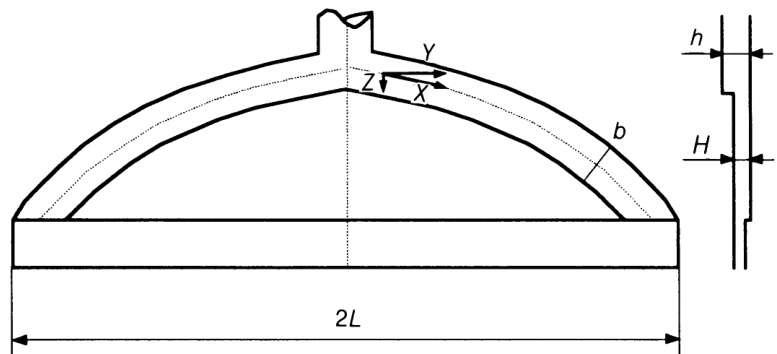
 
图 5.25 曲线锥形分流板的尺寸，熔体分布特征与聚合物流变无关（Winter 和 Fritz，1986 年）

 
不过，由于中心的陆地长度特别大，这种解法更容易受到蛤壳效应的影响。此外，这些表达式是通过等温分析获得的。实际上，局部温度的变化会对整个宽度上的平均出口速度产生影响。一般来说，对夹层起决定作用的尺寸有：分流板与模唇之间的距离、共沟角、模座长度和模座间隙（Helmy，1987 年）。基于一些示例研究，Helmy（1987 年）表明，稍微修改一下模头的几何形状就可以减少 $55\%$ 的蛤壳，而 Michaeli（1992 年）发现，减少 $33\%$ 的模头底座可以使总挠度减少 4 倍。 其他设计参数包括分流板和模体尺寸（增加 $2.5\,\mathrm{cm}$ 的整体模头厚度可以使夹壳减少 $7\%$ （Helmy，1987 年））。正确预测夹壳需要使用数值技术（通常是有限元方法），它能够确定模头中任意点的变形。Michaeli (1992) 开发了一种简单得多的方法。通过考虑纵向和横向的两个整体模头横截面来计算模唇的变形。第一个横截面被比作悬臂梁，其一侧被紧紧夹住，并承受均匀分布的载荷（由最大压降值给出）。横向截面假定不使用螺钉固定在一起，并被视为等同于悬臂梁，一端刚性夹紧，另一端导向。 

## 5.5.3 异型材

Profiles  

如果尽可能根据以下一般规则确定要生产的挤出物，则可简化型材制造模头的设计。
- 首先，横截面应尽可能简单。
- 其次，最好制造对称的型材。
- 第三，应避免在型材的任何区域堆积材料。
- 第四，壁厚应保持一致。
- 第五，内壁必须比外壁薄 $20–30\%$ （因为它们不是直接冷却的）。
- 第六，空心型材型腔的定义应考虑在模头中固定必要的金属嵌件的需要。
- 第七，转角半径必须至少为型材壁厚的四分之一，以避免应力集中。
- 最后，型材出模后应能保持其形状一段时间（Schiedrum，1975；Rauwendaal，1991c；Michaeli，1992）。 

与某些特定型材设计相关的问题在文献中已有论述。例如，Krein（1983 年）讨论了波纹管的设计，Sirlereaux 和 Loewen（1983 年）考虑了窗户型材的阻力要求，Stokes（1987 年）研究了共挤管道的机械设计。设计的复杂性与挤出物的形状和尺寸直接相关。尽管如此，还是可以提供以下指导。首先，适配器或过渡区应呈流线型，以避免材料滞留和出现流动不稳定性。流体应不断加速，并在模头处达到均匀的最大速度。其次，模头区或平行区必须保证挤出横截面各点的平均速度一致。这可能需要刻意改变整个宽度上的通道长度。这样就可以避免挤出物出现不理想的扭曲，最终产品基本上不会产生残余应力。如果是空心型材，模头底座一般要能容纳形成空腔的嵌入件。最后，流道设计应促进一维流动条件。不过，由于横向流可能会在生产过程中产生，因此应保证在此方向上有一定的流线型。 

Sors （1974 年）建议使用喇叭形适配器来保持不断加速的流动。然而，这种技术本身并不能确保模头入口区和模头底部之间所需的几何连续性。Michaeli (1992) 报告了几种建立转接头几何形状的经验技术，其中包括在包括过渡区的锥体上逐步建立轮廓横截面的可能性（如图 5.9 所示）。Chan 和 Hon（1990 年）提出了一种几何方法，可根据剖面的定义自动生成这种流道。该技术结合了一个断面上各点的比例间距来确定第二个断面上的点，以及各断面中心点的移动和对齐。这一理念似乎很有前途，但仍处于起步阶段。在实践中，适配器要尽可能简单和精简，其性能仍然依赖于设计人员的专业知识和经验。 

目前，模槽几何形状的定义基于半经验技术。一般通过两种方法来追求模头出口处的气流均匀性。最普遍的技术是区分各个平行通道的长度。如果两个体积流 $Q_{1}$ 和 $Q_{2}$必须从单独的平行通道中流出（如图 5.26 所示），长度分别为 $L_{1}$ 和 $L_{2}$，横截面积分别为 $A_{1}$ 和 $A_{2}$，且  

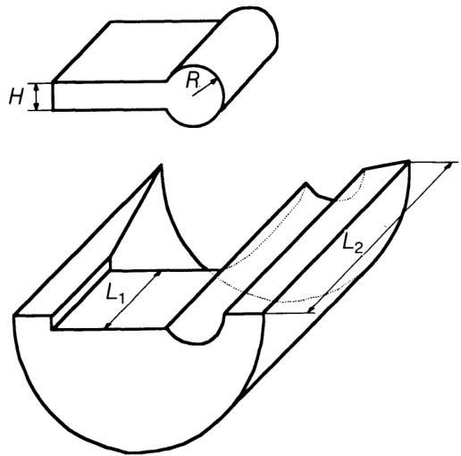  
Figure 5.26 Die for the production of a simple profile, showing the relative die land lengths (adapted from Schenkel and Kuhnle, 1983).  

那么，平均流速是一样的：

$$
\bar{V}_{1}=\bar{V}_{2}=\frac{Q_{1}}{A_{1}}=\frac{Q_{2}}{A_{2}}\rightarrow\frac{Q_{1}}{Q_{2}}=\frac{A_{1}}{A_{2}}\tag{5.33}
$$  

考虑到幂律（power-law）流体以及输出与压力的关系： 

$$
\frac{Q_{1}}{Q_{2}}=F(n)\left(\frac{L_{2}}{L_{1}}\right)^{1/n}\tag{5.34}
$$  

或者用相对长度表示：

$$
\lambda=\frac{L_{1}}{L_{2}}=\sqrt[1/n]{F(n)A_{2}/A_{1}}\tag{5.35}
$$  

图 5.26 中的几何图形（矩形/圆形）（Schenkel 和 Kuihnle，1983 年）：

$$
\lambda=\left(\frac{H}{R}\right)^{n+1}\left(\frac{1}{2}\,\frac{3n+1}{2n+1}\,F\right)^{n}\tag{5.36}
$$  

其中，$H$ 是矩形分段的高度，$\pmb R$ 是圆的半径，$F$ 是矩形形状系数。其他几何排列的处理方法相同。例如，对于两个相邻的矩形：

$$
\lambda=\left(\frac{H_{1}}{H_{2}}\right)^{n+1}\left(\frac{F_{1}}{F_{2}}\right)\tag{5.37}
$$  

其中指数 1 和 2 显然是指每个矩形。这种方法的简化之一是忽略了相邻平行水道之间因局部压力不同而产生的横向流动。如图 5.27 所示，将可能产生的不利影响降至最低的一种实用方法是从薄地段向宽地段逐渐过渡。这样可以避免从较低间隙短切材料，导致较宽间隙边缘材料过剩。通常会建造 $45^{\circ}$ 的角坝。Huneault、Lafleur 和 Carreau（1992 年）针对该问题开发了一种更精确的方法。该方法遵循以下顺序:  

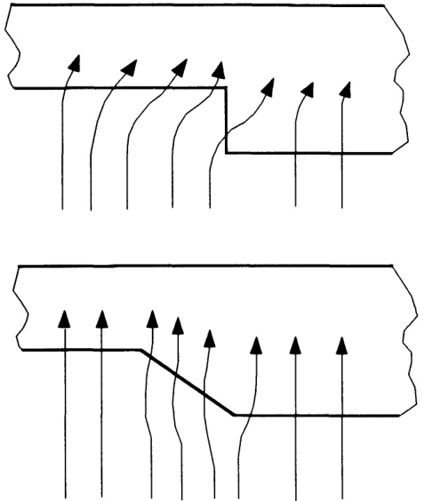  
Figure 5.27 Avoiding premature polymer degradation due to transversal fow across the die land.  

1. 将流动几何形状细分为更简单的部分，形成流动网络。  
2. 假设对流速分布有一个初始猜测，计算出纵向和横向的相关流动阻力 $(\Delta P/Q)$ 。  
3. 通过求解流网方程，评估每个截面的压力和流速。  
4. 重复步骤 2 和 3，直至收敛。 

在图 5.28 的示例中，两个相邻的矩形水道被细分为六个基本流道。总流量由上游条件决定。相关的流动方程为 : 

$$
Q_{i}={\frac{P_{i}^{\mathrm{up}}-P_{i}}{R_{i}}}\tag{5.38}
$$  

$$
Q_{i j}=(P_{j}^{\mathrm{up}}+P_{j}-P_{i}^{\mathrm{up}}-P_{i})/2R_{i j}^{\mathrm{t}}\tag{5.39}
$$  

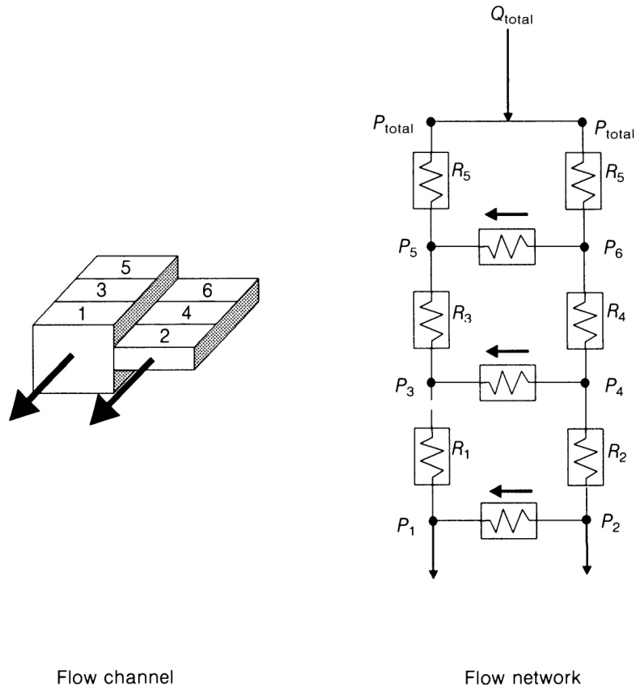  

图 5.28 流量几何（左）和相应的流量网络（右）（Huneault、Lafleur 和 Carreau，1992 年）。 
  
其中 $Q_{i}$ 和 $Q_{i j}$ 分别指主要方向和横向的流量，$P_{i}^{\mathsf{u p}}$ 和 $P_{i}$ 分别指 $_i$ 断面上游和下游的压力、 $R_{i}$ 是 $i$ 断面的阻力，$R_{i j}^{\mathrm{t}}$ 是相邻断面 $i$ 和 $j$ 之间横向的阻力。对于矩形渠道，流动阻力的计算公式为：  

$$
{\cal R}=2k L[2(1/n+2)]^{n}W^{-n}H^{-(2n+1)}Q^{n-1}\tag{5.40}
$$  

其中 $k$ $n$ 为幂律常数，$H\\,W$ 和 $L$ 分别为厚度、宽度和通道长度。从断面 $_i$ 到断面 $j$ 的横向阻力是两个相连半断面的横向阻力之和，再加上入口效应产生的阻力。对于每个半断面，我们可以近似地写出 :

$$
R_{i}^{\mathrm{t}}=\frac{R_{i}}{2}\left(\frac{W_{i}}{L_{i}}\right)^{1+n}\tag{5.41}
$$  

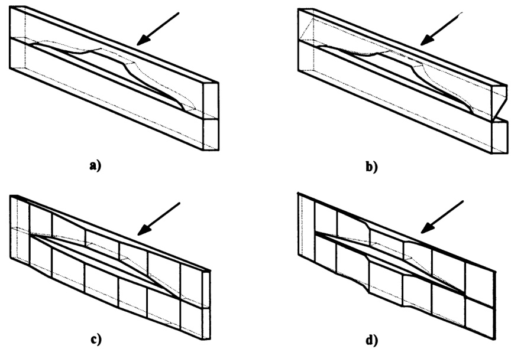  

图 5.29 模头去面策略：(a) 直切模头；(b) 背线性去面模头；(c) 线性去面模头；(d) 二次方去面模头（改编自 Lee 和 Stevenson，1992 年）。 

可以根据 Bagley 修正或通过人为增加每个通道的长度来估算入口效应（此技术用于计算多孔板中的压降 - 见公式 (5.16)）。可以设想将此模型用于解决逆问题，即给定模唇各部分的指定输出（根据均匀出口平均速度要求计算得出），计算每个平行通道的适当长度。 

还可以通过面缓解策略来平衡模头出口处的流量（Lee 和 Stevenson，1992 年）。图 5.29(a)显示的是一个传统的直切模头，其模口为典型的恒定模口。图 5.29(b)显示的是后退式模头，金属从上板背面斜切。切割角度使得模口最厚的地方也有最长的未松开焊盘。图 5.29(c)和 5.29(d)分别显示了直线型和二次型端面松脱模头。这些都是根据经验法则设计的：  

$$
L/L_{\operatorname*{max}}=(H/H_{\operatorname*{max}})^{p}\tag{5.42}
$$  
  
其中 $H$ 和 $L$ 分别为局部间隙和压模实体长度（die land）（挤出方向），$\pmb{p}$ 对线性压模取值为 1，对二次压模取值为 2。$H$ 和 $L$ 的值与模头出口处的恒定平均速度有关。 

## 5.5.4 案例分析：管道生产

Case study: pipe production  

本节按照上文介绍的一般原则（见图 5.18 中介绍的方法），考虑了管材挤出模头设计的最相关方面。 

聚合物（本例选择典型的高密度聚乙烯挤出牌号）的流变特性是根据 5.2.2 节中介绍的程序确定的。剪切粘度与剪切速率的关系由 Munstedt 型多项式（Munstedt，1978 年）来描述。在计算恒定剪切应力时，通过引入移动因子 $a_{T}$，考虑了温度的影响：  

$$
\log\tau=a_{0}+a_{1}\log(a_{T}\dot{\gamma})+a_{2}[\log(a_{T}\dot{\gamma})]^{2}\tag{5.43}
$$  

其中，$a_{0},\,a_{1}$ 和 $\displaystyle a_{2}$ 是二阶多项式的系数，而  

$$
a_{T}=\left(\frac{\dot{\gamma}_{\mathrm{ref}}}{\dot{\gamma}}\right)_{\tau}\tag{5.44}
$$  

其中， $\dot{\gamma}_{\mathrm{ref}}$ 表示在所选参考温度下与剪切应力 $\tau$ ,相对应的剪切速率，而 $\dot{\gamma}$ 表示与相同剪切应力相对应的相同剪切速率，但现在是在所需温度 T' 下。根据公式 (5.2) 和 (5.3)，使用相同的温度依赖行为计算出延伸特性。这些信息主要用于设计目的（即确定最大收敛性和质量流量），因为相应的压降值要比剪切流的压降值低 50-100 倍（Covas，1985 年），因此可以忽略不计。 

通过直接观察毛细管流变实验中产生的挤出物，可以确定流动缺陷的发生。虽然其表征标准通常是根据临界应力确定的（第 5.2.2 节），但用临界剪切速率来表示流变异常的开始更为方便。可以再次使用移位因子的概念将温度的影响包括在内，如式 $\left(5.44\right)-$  所定义，剪切速率现在将对应于临界值。特定温度下的临界剪切速率  $\dot{\gamma}_{\mathfrak{c}}$ 是根据参考温度下的 $\dot{\gamma}_{\mathsf{c,r e f}}$ 计算得出的： 

$$
\log\dot{\gamma}_{\mathrm{c}}=(\log\dot{\gamma}_{\mathrm{c,ref}}-b)-m/T\tag{5.45}
$$  

和  

$$
\log a_{\mathrm{T}}=b+m/T\tag{5.46}
$$  

即假定与温度有关的Arrhenius类型。 

挤出装置的整个结构被定义为一系列简单的流道。图 5.30 展示了由六个蜘蛛腿支撑的传统芯轴挤压头的布置和相关的初始尺寸。模唇与管道横截面相同（1 英寸管道，$2\,\mathrm{mm}$ 厚）。

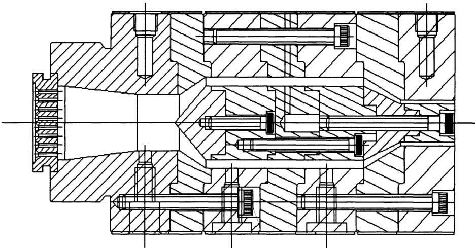  

图 5.30 心轴管模头的暂定几何形状。 

在指定了质量吞吐量和总压降限制后，模拟就可以开始了。为了测试算法进行必要修正的能力，我们定义了一个众所周知的过量输出。如图 5.31（左）所示，初始值  $100\,\mathrm{kg\,h^{-1}}$  被逐渐减小到大约 $25\,\mathbf{kg}\,\mathbf{h}^{-1}$ ，以避免出现流动效应。这是一个分两步走的过程。首先，输出是固定的，模唇的横截面等于管道的横截面（输出下降到大约  $72\,\mathbf{kg}\,\mathbf{h}^{-1}$ ）。无论输入的数值是多少，结果都是一样的，因为它只取决于材料属性。在随后的迭代中，输出将进一步减小，因为模唇的初始尺寸将被修改，以补偿挤出物膨胀（横截面应减小）、冷却收缩（后果相反）和履带缩水（效果与模唇膨胀类似）的综合影响。如图 5.31（右图）所示，初始外部和内部辐射（分别为 12.70 and $10.70\,\mathrm{mm}$ ）将分别降至 10.40 and $8.76\,\mathrm{mm}$ 。根据以下迭代程序对挤出膨胀效应进行补偿：  

1. 模唇与管道横截面相等。  
2. 计算剪切速率   
3. 确定挤出膨胀率   
4. 修正模唇尺寸。  
5. 根据新的尺寸重复步骤 2 和 3。  
6. 确定挤出物的尺寸。  
7. 增加/减少模唇尺寸。  
8. 重复步骤 5-7，直到步骤 6 得出所需的挤出物尺寸。 

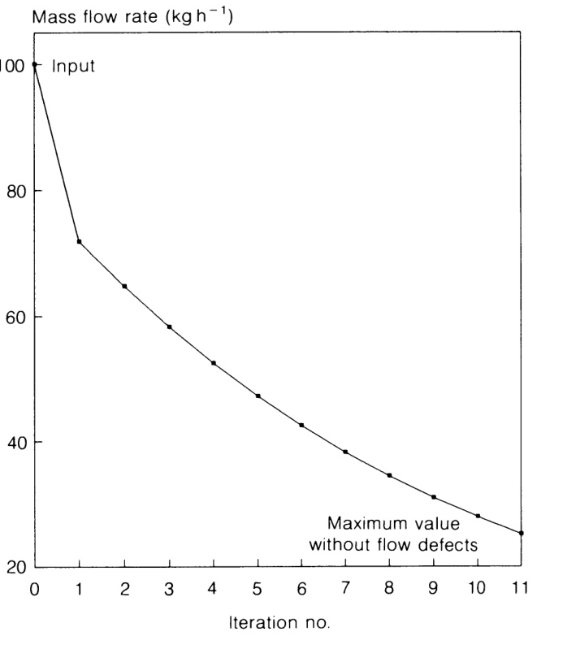{width="650" height="680"}   

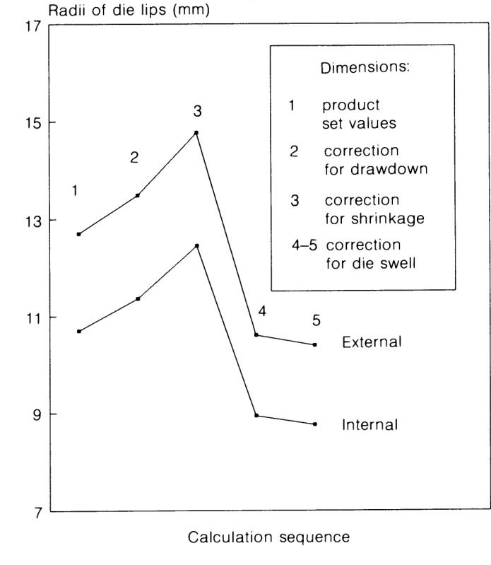{width="600" height="650"}  

图 5.31 确定模头几何形状。上图：修正产量以避免流动缺陷。下图：定义模唇横截面

如前所述，挤出物膨胀和收缩是同时发生的。前者会改变挤出物的形状（非轴对称轮廓）和尺寸，而收缩则主要影响尺寸（Brown、Kim 和 Summers，1979 年；Griffith 和 Tsai，1980 年）。由于模头膨胀取决于松弛的时间，因此在相同平衡值的操作条件下（即相同的产量、温度和模头几何形状），一旦与不同的履带速度结合，就会沿着挤出线产生不同的横截面剖面。图 5.32 展示了这一点，图中在生产线的不同位置测量了简单圆形挤出物的横截面，其拉伸比保持不变（Huneault、Lafleur 和 Carreau，1990 年）。我们预计，在加工松弛时间较短的材料（如高密度聚乙烯）时，可以通过质量平衡（等式 (5.9)）来确定缩径的影响，前提是模头膨胀已达到平衡。如果拉伸是各向同性的，则  

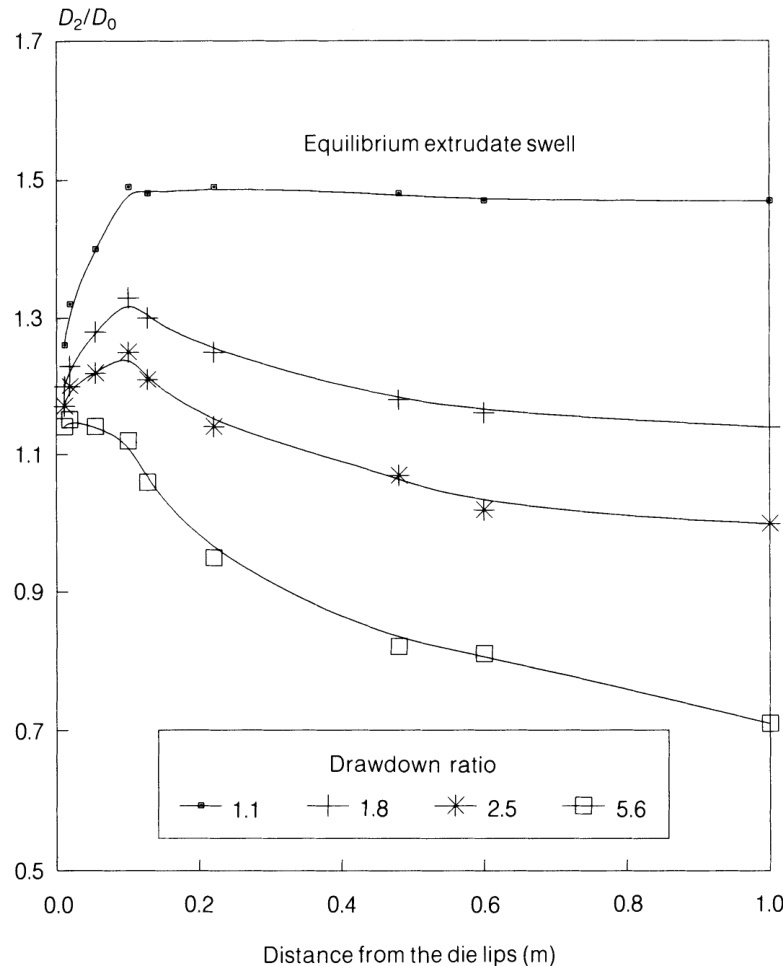  

图 5.33 优化模头内部的分析流计算结果（Carneiro，1994 年）。

$$
\frac{D_{2}}{D_{0}}=D S_{\mathrm{equi}}\left(\frac{1}{D R}\right)^{1/2}\tag{5.47}
$$

其中，$D_{2}$ 指拉伸后的圆形挤出物，$D_{0}$ 是模头直径，$D S_{\mathrm{equi}}$ 是根据公式 (5.6) 计算得出的。当 $\pmb{D}\pmb{R}$ 小于或等于 2 时，预测值通常与实验值非常接近（误差在 $3\%$ 以内）。由于高密度聚乙烯挤出的典型拉伸比通常低于 1.3，因此方程 (5.47) 可用于实际目的。遗憾的是，如果对松弛时间较长的材料（如聚氯乙烯）采用这种方法，会产生很大的误差，因为挤出物的膨胀可能永远达不到平衡。对于环形通道，可以定义三种不同的模胀比，即 $D S_{\tt e d}$ 、$D S_{\mathrm{id}}$ 和 $D S_{\mathfrak{e}}$ ，分别指外径、内径和厚度。然而，如果挤出方向是单轴且均匀的，$D S_{\mathrm{ed}}$ 和 $D S_{\mathfrak{e}}$ 是相同的（Garcia-Rejon，1982 年）。这通常适用于模头陆地比在 10-25 之间的管材模头。 

现在，计算将向第一个适配器区进行，该区相当于环形会聚通道，包括一定程度的压缩（促进从蜘蛛腿流出的各熔体流的焊接）。由于流动加速，最终可能出现熔体断裂。其发生的标准由类似于式 (5.45) 的关系给出，其中$\dot{\varepsilon}_{\mathsf{c},\mathsf{r e f}}$ 由式 (5.4) 计算得出。原则上，等式 (5.46) 也将成立。这个极限显然应该与扩展率的局部最大值 $\dot{\varepsilon}_{\mathrm{max}}$ 进行比较。后者的位置和数值取决于截面的几何形状（环形收敛截面可以通过改变不同的间隙和外部半径来产生压缩）。Carneiro (1994) 对不同几何形状（圆形、矩形和环形汇流槽）的 $\dot{\varepsilon}_{\mathrm{max}}$ 进行了量化，并假定等温流动、不可压缩流体和渠道任意截面的平均流速。例如，对于矩形会聚通道（这种几何形状与研究蜘蛛腿之间单个熔体前沿的流动有关）：  

$$
\dot{\varepsilon}_{\operatorname*{max}}=\frac{n H\dot{\gamma}_{\operatorname*{max}}\tan\alpha}{W(2n+1)}\tag{5.48}
$$  
 
其中 $\pmb{H}$ 是间隙，$\alpha$ 是收敛角，$W$ 是收敛末端的宽度，$\pmb{n}$ 表示幂律指数。如果 $\dot{\varepsilon}_{\mathsf{c,r e f}}>\dot{\varepsilon}_{\mathsf{m a x}}$，则必须增加块的长度，以减少收敛。然而，我们应该注意到，相应的压降也会相应增加。 

上述步骤逐步应用于挤出机方向上的各个模区，并考虑最终出现的相关流动异常，计算总压 降（与运算器最初定义的总极限压降进行比较）。图 5.33 显示了完成分析算法后得到的结果。模头的几何形状、轴向压力、停留时间、壁面剪切速率和壁面剪切应力均以图形表示。将管道尺寸的分析预测值与相同加工条件下的实验值进行比较，可以发现外径的误差很小 $(2-3\%)$，内径的误差约为  $5.6\%$ 。这些差异包括所考虑的所有挤压后现象的综合影响。然而，由于之前的研究表明与挤出-膨胀预测相关的误差达到了 $10\%$ ，因此收缩、拉伸和校准的影响似乎是负的，并且可以补偿这种过度测量。

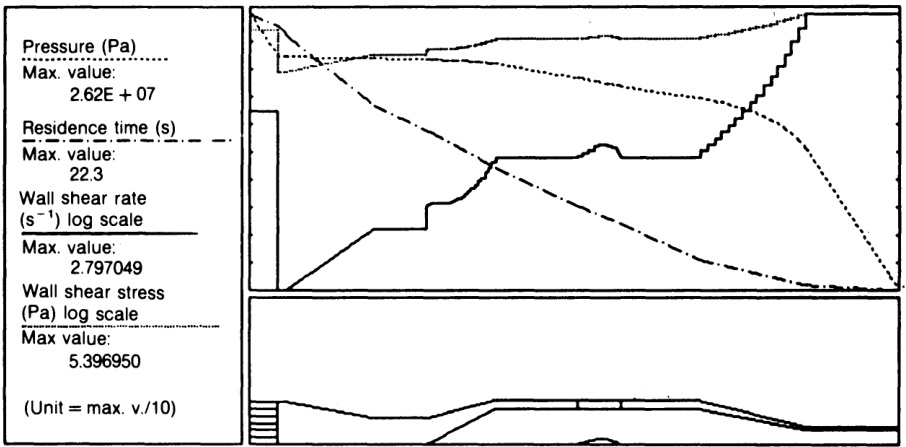  

图 5.33 优化模头内部的分析流计算结果（Carneiro，1994 年）。 
 
通过优化模头（图 5.16）的流动数值模拟提供了更准确的压降信息，这主要是由于对 **蛛腿(spider legs)** 之间的流动进行了更充分的模拟。还可以评估粘性耗散的实际意义。这一点非常重要，因为模头内出现明显的横向温度梯度将改变预测的模头膨胀率，进而改变挤出物的最终尺寸。