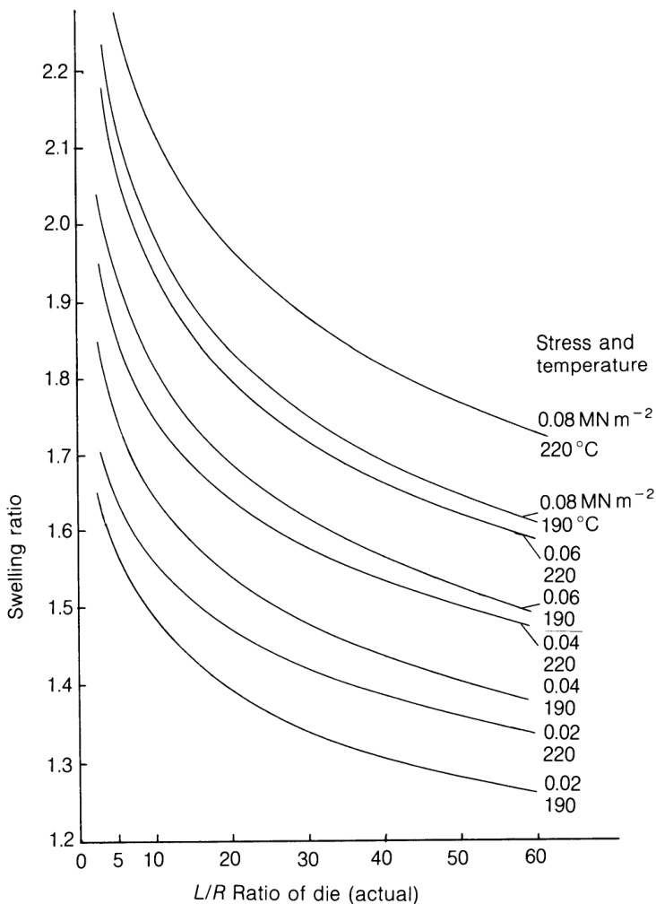
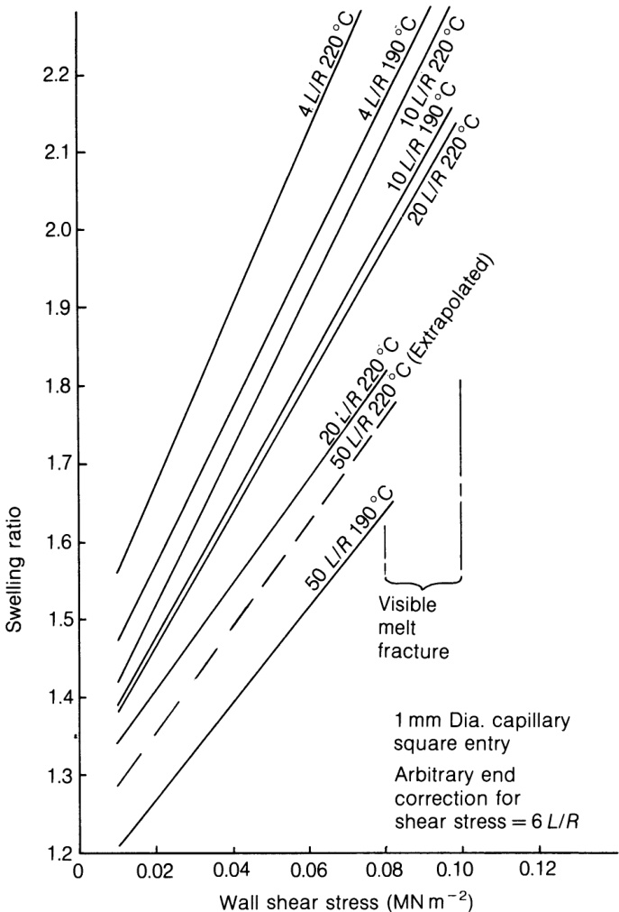

====================
3.4 弹性效应
====================

ELASTIC EFFECTS 

熔体弹性的主要作用是从入口处或流经模具时施加的剪切和/或伸长应变中恢复。在没有有意拉伸的情况下，它表现为模具出口处的横向膨胀和相关的长度回缩，特别是在用于吹塑的型坯缓慢挤出过程中。当挤出机刚刚停止挤出或挤出速度较慢时，猛拉挤出物，然后松开挤出物，这时挤出物会（部分）回弹，这就证明了挤出物的弹性。

聚合物熔体在剪切流动时也会有部分弹性，例如在锥板粘度计中剪切后会有部分回弹。这也可以看作是螺杆在启动时的瞬间扭矩峰值，但在实际操作中很难与机械惯性区分开来。与拉伸流一样，弹性应变会随着时间的推移转化为粘性耗散，当挤出机减速或停止时，剩余应变的恢复很难与残余压力释放时因膨胀而从模头缓慢 “脱溶 ”区分开来。挤压机内最重要的影响可能是当聚合物从螺槽进入螺棱间隙时，突然受到更大的剪切速率的影响；如果熔体是非牛顿型且具有明显的弹性，粘度不会瞬间下降到与更高剪切速率相对应的粘度，从而产生瞬时高应力和伴随的剪切加热。相反，在离开螺棱间隙时，粘度也不会瞬间上升到与突然降低的剪切速率相匹配的粘度；这些影响的间隔时间为 0.1 秒或更短，可能不完全相同，也可能相互抵消。 

图3.10 膨胀比与模具长度-聚苯乙烯。

对一些似乎与聚合物熔体弹性行为有关的流动缺陷进行了广泛的观察和研究（Cogswell，1981 年）。挤出物的表面粗糙度（鲨鱼皮、桔皮等）似乎与模具内的表面效应有关，这是由于靠近模壁的剪切应力过大或与模具表面的间歇性粘附造成的，低金属温度会加剧这种粗糙度，并在一定程度上受到表面光洁度和金属表面性质的影响。与模具膨胀一样，可以通过将挤出物从模具中拉出来改变或减少这些现象。其他流道缺陷已被证明会扰乱整个流道，其中熔体断裂可能是人们最熟悉和研究最多的一种。熔体断裂似乎是在模具中超过临界剪切应力时产生的，与温度和模具长度无关，但也有人提出了模具入口处的临界延伸应变率。通过使用细锥形模具入口（公式 (3.73)），可将这种影响降至最低，但不会明显改变临界值。 

关于纤维和薄膜的生产，第 2 章提到了在模头后通过牵引进行单轴或双轴取向。在挤出机和模头内，可通过流动产生取向，例如在流经长模头或包覆线材时产生纵向取向，或在大型管模头快速发散时产生横向取向。与纤维拉伸和薄膜拉伸相比，熔体温度下的低应力和更快的松弛导致产品的定向水平普遍较低。这种影响很可能是不可取的，表现为冲击强度的定向损失。如果产品在适当的温度范围内冷却时保持应变，与取向相关的还有应变诱导结晶。 

圆形毛细管的溶胀比，定义为挤出物直径与模头直径的比值，取决于聚合物、熔体温度、模头长度 (L/R) 、模头入口几何形状和模头内的剪切应力或剪切速率。挤出物直径通常在冷却至室温后收缩后测量，但一些光学方法已被用于在接近熔体温度时“在线”测量直径。膨胀率随着模具长度的增加而降低，为松弛提供了更多时间，对于非常长的模具，膨胀率趋于恒定值（图3.10）。通过基于剪切应力而非剪切速率进行关联，熔体温度的影响被最小化，作者在图3.11中对结晶聚苯乙烯样品的数据表明，在相当大的剪切应力和LIR比范围内，温度升高的影响是溶胀比几乎恒定的小幅增加。在这种情况下，温度升高 30°C 时，增加量在0.05到0.15之间。Powell（1974）提出了狭缝模具和圆形毛细管在可恢复剪切应变方面的厚度和宽度膨胀比的广义曲线。然而，后者必须针对每种聚合物和温度通过实验确定。

图3.11 膨胀比与剪切应力-GP聚苯乙烯。